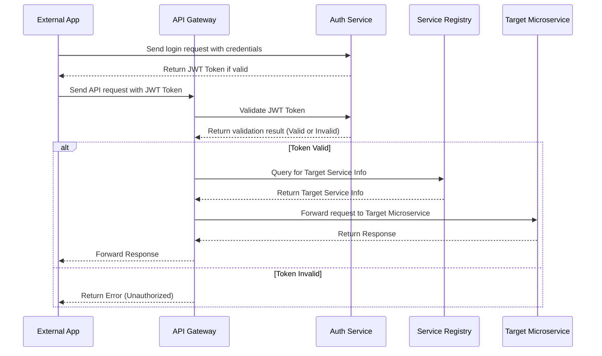
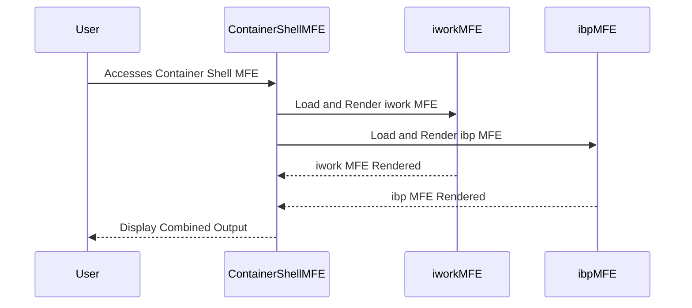
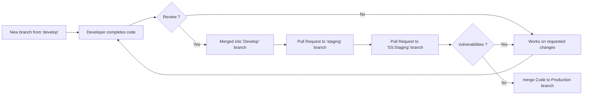

## Insurance Wellness Hub  

## 1. Project Overview
- **Project Name**: Insurance Wellness Hub
- **Architecture**: Monorepo using NX workspace
- **Purpose**: Milestone1 Planning Tech Spec Document

The Insurance Wellness Hub is designed to manage insurance policies efficiently. It provides users with functionalities to create, update, retrieve, and manage functionalities of a Insurance mediator Company for Corporate and Insurance Company.
The system also offers Creating Company, Opportunity, Tracking  Opportunity stages,  Document Management, Authentication, and Authorization

## 2. Technical Stack
### Frontend
- React with Vite
- Material UI (MUI) components
- TypeScript
- Jest for testing

### Backend
- NestJS microservices
- PostgreSQL database
- TypeORM for database management
- Swagger for API documentation

### Infrastructure
- Docker containerization
- Kubernetes orchestration
- AWS cloud hosting
- CI/CD pipeline

### Backedn Microservice Architecture Overview
**High-Level Work Flow**

1) External User must login - API-Gateway uses Auth Service and send token for valid user 

2) User requests for Microservice Endpoints with valid token in Header

3) API Gate way searches for Service Information from Service Registry 

4) By using the service information API Gateway serves the external authorized request with response

### Microservices Description

For Microservices Details Refernce Link : [**Microservices Details**](https://docs.google.com/spreadsheets/d/1xQLqB5q4frdnKj0oncKrdNMv9LBSwt_wPcPhdEcLJDA/edit?gid=0#gid=0)

### FrontEnd OverView 
- Container Shell 
  - Main Container MFE for iwork , ibp MFEs
  - iwork and ibp will get rendered in Conatiner MFE through Iframes 

- iwork MFE 
  - IIRM Employee related Portal 

- ibp MFE
  - Client Employee portal  

## 3. Core Services
###  API Gateway 
- Central entry point for all services
- Request routing and aggregation
- Authentication middleware

### Organization Service
- Company management
- Contact management
- Document management
- Address management

###  Opportunity Service
- Opportunity creation and tracking
- Risk location management
- Claims experience tracking
- Document management

## 6. RDBMS Approach and  Models
- Using PostgreSQL as RDBMS 
- Mostly of the cases Soft Delete 
- Audit fields (createdAt, uploadedBy)
- Who and When information capturing  
- Type-safe enums

## 5. API Documentation
- Swagger integration for each service
- Authentication using JWT
- Role-based access control - Intital 

## 6. Testing Strategy

**Unit tests using Jest**

- Unit testing with Coverage of 80% Intially 
- Will be Improved to 85% in Milestone-2

## 7. Security Considerations
- JWT authentication
- **Access control**
  - As per the Application needs , Planned to Implement RBAC in three types 
    - Role Based Access
    - HierarchyBased Access
    - Custom Based Access

- Data encryption
  

## 8. Deployment Workflow
- Feature branch workflow 

- **PR review process**
  - For PR Reviews following process
  - [**PR Review reference Link**](https://github.com/divamidesignlabs/new-insurance-wellness-hub/blob/ss-staging/code-guidelines.md)
  - The same PR Review Guidelines were availabe in Git repo also 

- Code quality checks
  - Flying duck Vulnerability check 

- CI/CD pipeline
  - Manual 
    - Planned a manual deployment strategy for Development team to Work 
  - AWS Deployment 
    - CI/CD Pipelines - Inprogress 

## 9. Monitoring & Logging
- Error handling
- Logging strategy
- Performance monitoring
- Health checks
  - Service Registry will be checking  MicroServices health check at regular intervals 

## 10. Deployment Strategy
- Docker containerization
- Kubernetes orchestration
- Environment configurations

