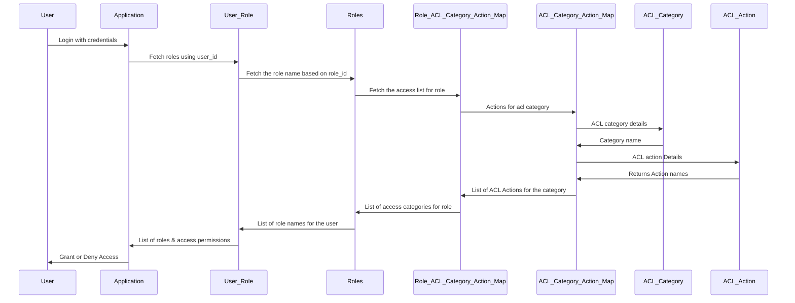
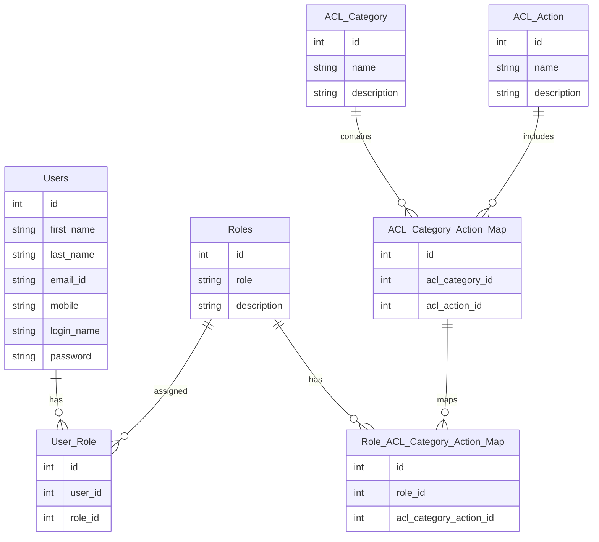

## ACL & RBAC Spec Document

### Overview 
- Defines the implementation of Access Control List (ACL) and Role-Based Access Control (RBAC) for the application. 

- Describes how users, roles, permissions, and actions are managed using the defined database tables.

- Explains Flow of the Authentication and Authorization 

### Objective 

- Implement a secure and manageable authorization model using ACL and RBAC.

- Ensure users have appropriate access to perform actions.

- Provide granular permissions using ACL categories and actions.

- Ensure only the permitted resources can be accessed by the user 

### Roles and Designations 
- **Roles** 
  1) BD
  2) CRM
  3) AM
  4) ISG
  5) Leadership
  6) Analyst
  7) Functional Admin
  8) Super Admin

- **Designations**
  1) Executive
  2) Team Lead
  3) Manager
  4) HOD
  5) HOC
  6) Vice Chairman
  7) Chairman
  8) Other

### Databse Schema 
For achieving ACL &  RBAC  we used the follwing Database tables 

#### Table Name: users

- Stores the user information 

| Column      | Data Type       | Constraints            | Description                           |
|---------------|-----------------|------------------------|-------------------------------------|
| id        | INT              | Primary Key            | Unique identifier for the user     |
| first_name | VARCHAR(150)      | NOT NULL               | User's first name                   |
| last_name  | VARCHAR(50)      | NOT NULL               | User's last name                    |
| email_id   | VARCHAR(150)     | UNIQUE, NOT NULL       | User's email address                |
| mobile | VARCHAR(15)      | UNIQUE                 | User's mobile number                |
| login_name | VARCHAR(50)      | UNIQUE, NOT NULL       | Unique username for login           |
| password   | VARCHAR(150)     | NOT NULL               | Hashed password for authentication,   bcrypted format  |

#### Table Name: user_role

- Stores the user and role mapping

| Column      | Data Type       | Constraints            | Description                           |
|---------------|-----------------|------------------------|-------------------------------------|
| id        | INT              | Primary Key            | Unique identifier for the user     |
| user_id | INT      | NOT NULL               | User's id refered form users table                    |
| role_id | INT      | NOT NULL               | User's role id refered  |

#### Table Name: Roles

- Stores all roles planned for the application 

| Column       | Data Type      | Constraints     | Description                    |
|---------------|----------------|-----------------|--------------------------------|
| id          | INT             | Primary Key     | Unique identifier for the role |
| role        | VARCHAR(50)     | NOT NULL        | Name of the role               |
| description | VARCHAR(255)    |                 | Description of the role        |

#### Table Name: acl_category

- Contains all the categories of control like company , organization , policy and many other objects of IIRM application

| **Column**    | **Data Type**      | **Description**                      |
|----------------|--------------------|-------------------------------------|
| id           | INT (Primary Key)   | Unique identifier for the category  |
| name         | VARCHAR(50)         | Category name                       |
| description  | VARCHAR(255)        | Description of the category         |

#### Table Name: acl_action

- Contains the actions that can be performed on an Object , like Read , Write , Import , Export 

| **Column**    | **Data Type**      | **Description**                           |
|----------------|--------------------|------------------------------------------|
| id           | INT (Primary Key)   | Unique identifier for the action         |
| name         | VARCHAR(50)         | Action name (e.g., Import, Export)       |
| description  | VARCHAR(255)        | Description of the action                |

#### Table Name: acl_category_action_map

- Maps actions to categories to define available operations.

| **Column**         | **Data Type**      | **Description**            |
|---------------------|--------------------|---------------------------|
| id                | INT (Primary Key)   | Unique identifier for the category-action mapping      |
| acl_category_id   | INT                 | Foreign Key referencing `ACL_Category.id`              |
| acl_action_id     | INT                 | Foreign Key referencing `ACL_Action.id`       |

#### Table Name: role_acl_category_action_map

- Defines which roles have permissions for specific category-action combinations.

| **Column**                 | **Data Type**      | **Description**                                              |
|-----------------------------|--------------------|------------------------------|
| id                       | INT (Primary Key)   | Unique identifier for the role-category-action mapping      |
| role_id                  | INT                 | Foreign Key referencing `Roles.id`                          |
| acl_category_action_id   | INT                 | Foreign Key referencing `ACL_Category_Action_Map.id`        |

### FLow Diagrams 

**Steps**

1) User Login to the Application using credentails 
2) After Successfull Authentication token will be issued with a user_id
3) Based on the user_id , tghe rolles assigned to the user will be identified 
4) For the identified roles ACL Categories will be identified 
5) For the assigned ACL Categories , ACL actions will be identified 
6) Return the ACL Object with assigned ACL categories and ACL Actions 
7) Application can be accessed based on ACL Object 
 
---
**ACL Sequence**

---
**ER Shema Diagram**

### Encryption Implementation 

- Password Encryption need to Implement 

- Need to Plan and Implement data Encryption 

### Conclusion 

- Using this ACL & RBAC , User will allowed to access the application based on the role assigned to the user 
- 

### Pending Check List 

- Currenlty Genralised ad Initital RBAC Implemented , Will enhanced based on the requirememts 
- ACL list will be bulged as development will be progressing 