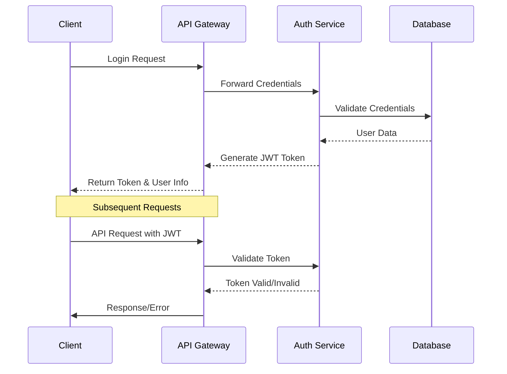
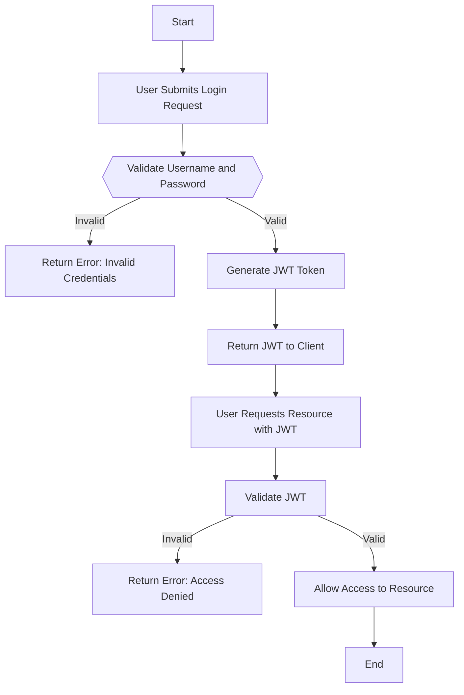

## Authentication Mechanisms 

Explains about outlines of authentication service for the application, providing secure access to resources using JWT (JSON Web Tokens). The service validates user credentials and generates tokens to manage user sessions


### Key Components
- API Gateway
- Auth Service
- JWT Token Management
- Role-Based Access Control
- Middleware Implementation
- Error Handling 
- Testing Strategy


### Database Tables
The following table is used for storing user information

- Consideration is IIRM Employee is also a user, All the entries of employees and external users will be in users table 


**Table Name : Users**

| Column Name  | Data Type      | Description                  |
|---------------|----------------|------------------------------|
| id            | SERIAL         | Primary key Unique Identification |
| first_name     | VARCHAR(50)    | User's first name            |
| last_name     | VARCHAR(50)    | User's last name             |
| email_id      | VARCHAR(100)   | User's email address         |
| mobile        | VARCHAR(15)    | User's mobile number         |
| login_name    | VARCHAR(50)    | Username for login           |
| password      | VARCHAR(255)   | Hashed password              |


### API End Points 

| Method | EndPoint     | Description                  | Payload |
|---------------|----------------|------------------------------|------|
| POST            | /iirm/auth-service/login       | User can login   ||


### Flow Diagrams

**Authe tication Flow**


---
**Authentication Flow Chart** 




### Security Considerations

- Passwords are stored using secure hashing algorithms (e.g., bcrypt).

- JWT tokens are signed using a secure private key.

- Expiration times ensure tokens are with time span

- Refresh tokens can be implemented for extended access.(In-Progress)


## Implementation Details

### 1. JWT Token Structure

```typescript
interface JWTPayload {
  sub: string;          // User ID
  email: string;        // User Email
  roles: string[];      // User Roles
  permissions: string[];// User Permissions
  iat: number;         // Issued At
  exp: number;         // Expiration Time
  iss: string;         // Issuer
}
```


### 3. API Gateway Implementation

```typescript
// filepath: /apps/services/api-gateway/src/middleware/auth.middleware.ts

@Injectable()
export class AuthMiddleware implements NestMiddleware {
  constructor(
    private readonly authService: AuthService,
    private readonly config: ConfigService
  ) {}

  async use(req: Request, res: Response, next: Function) {
    const token = this.extractToken(req);
    if (!token) {
      throw new UnauthorizedException('No token provided');
    }

    try {
      const decoded = await this.authService.validateToken(token);
      req['user'] = decoded;
      next();
    } catch (error) {
      throw new UnauthorizedException('Invalid token');
    }
  }
}
```

### 4. Authorization Guard

```typescript
// filepath: /apps/services/api-gateway/src/guards/roles.guard.ts

@Injectable()
export class RolesGuard implements CanActivate {
  constructor(private reflector: Reflector) {}

  canActivate(context: ExecutionContext): boolean {
    const requiredRoles = this.reflector.get<string[]>('roles', context.getHandler());
    if (!requiredRoles) {
      return true;
    }

    const { user } = context.switchToHttp().getRequest();
    return requiredRoles.some((role) => user.roles?.includes(role));
  }
}
```

## Security Considerations

### 1. Token Management
- Token Expiration: 4 hour - Configured from Env
- Refresh Token: Need to Implement (In-porgress)
- Token Encryption: RS256 algorithm

### 2. Password Security
```typescript
interface PasswordPolicy {
  minLength: 8;
  requireUppercase: true;
  requireLowercase: true;
  requireNumbers: true;
  requireSpecialChars: true;
  maxAttempts: 3;
  lockoutDuration: 15; // minutes
}
```

## API Specifications

### 1. Authentication Endpoints

```typescript
@Controller('auth')
export class AuthController {
  @Post('login')
  async login(@Body() credentials: LoginDto): Promise<AuthResponse>;

  @Post('refresh')
  async refresh(@Body() token: RefreshTokenDto): Promise<AuthResponse>;

  @Post('logout')
  async logout(@Headers() headers: any): Promise<void>;
}
```

### 2. Response Formats

```typescript
interface AuthResponse {
  accessToken: string;
  refreshToken: string;
  user: {
    id: string;
    email: string;
    roles: string[];
    permissions: Permission[];
  };
  expiresIn: number;
}
```

## Testing Strategy

### 1. Unit Tests

```typescript
// filepath: /apps/services/auth-service/src/auth/auth.service.spec.ts

describe('AuthService', () => {
  it('should validate JWT token', async () => {
    const token = 'valid.jwt.token';
    const result = await authService.validateToken(token);
    expect(result).toBeDefined();
  });
});
```

### 2. Integration Tests

```typescript
// filepath: /apps/services/auth-service/test/auth.e2e-spec.ts

describe('AuthController (e2e)', () => {
  it('/auth/login (POST)', () => {
    return request(app.getHttpServer())
      .post('/auth/login')
      .send(loginCredentials)
      .expect(201)
      .expect(res => {
        expect(res.body.accessToken).toBeDefined();
      });
  });
});
```

## Error Handling

### 1. Authentication Errors

```typescript
enum AuthenticationError {
  INVALID_CREDENTIALS = 'Invalid email or password',
  EXPIRED_TOKEN = 'Token has expired',
  INVALID_TOKEN = 'Invalid token',
  INSUFFICIENT_PERMISSIONS = 'Insufficient permissions'
}
```

### 2. Error Responses

```typescript
interface ErrorResponse {
  statusCode: number;
  message: string;
  error: string;
  timestamp: string;
  path: string;
}
```

## Monitoring and Logging

### 1. Auth Events to Monitor
- Failed login attempts
- Token validations
- Permission denials
- Role changes

### 2. Logging Format

```typescript
interface AuthLog {
  timestamp: string;
  action: string;
  userId: string;
  status: 'SUCCESS' | 'FAILURE';
  metadata: Record<string, any>;
}
```

## References

1. [NestJS Authentication](https://docs.nestjs.com/security/authentication)
2. [JWT Best Practices](https://auth0.com/blog/jwt-security-best-practices/)
3. [OWASP Security Guidelines](https://owasp.org/www-project-api-security/)