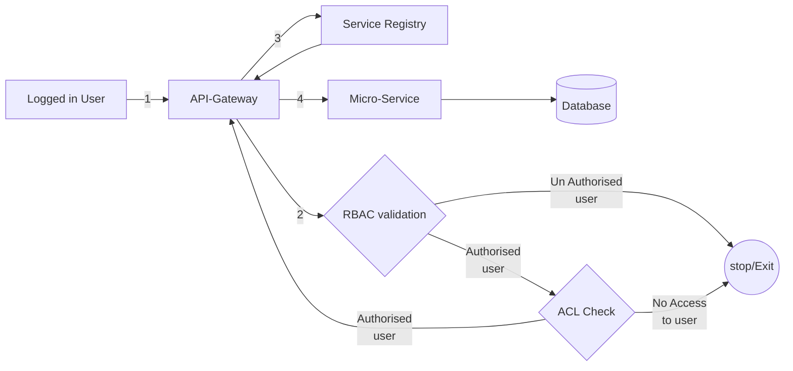
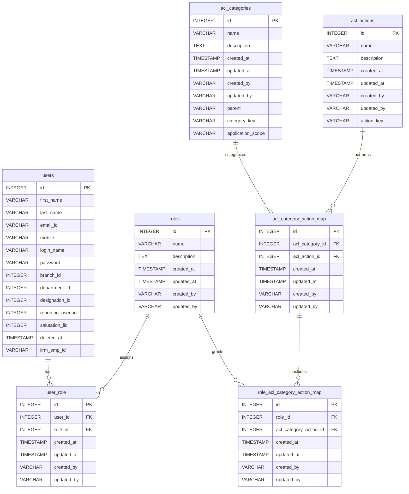

## RBAC Implementation

### Introduction
- RBAC Design 
- RBAC Implementation 
    - Auth Gaurd & ACL Guard 
- Architecture Diagram 
- Database Schema 
- API Endpoints 
- Testing and Validation 
- Security Considerations 
- Limitations 

### RBAC Design 
- Once the user logged in , our system will issue **JWT token** , Which will be maintained for all other requests

- If the request is without token in request headers , will be restricted by **Auth Gaurd**

- Once the request is with token in header 
    - Decode the Token
    - Identify the User and his Roles 
        - If Authorized proceed to ACL Guard 
        - Else return message **Un Authorized User**

- Valid user Token and passed the Auth Guard 
    - **ACL Gaurd** will checks for the access to the requested resource based on the user role
        - If valid Allow the user for accessing the resource 
        - Else return message **Access Denied**

### Architecture & Flow 



### RBAC Implementation 

### API Endpoints 
- AuthGuard and RoleGuard Applied for all the routes except login and userdetails. These 2 enpoints will be ignored
    - /login
    - /user-details

```
async canActivate(context: ExecutionContext): Promise<boolean> {
if(path === '/login' || path === '/user-details') {
      return true;
    }
}
```
### Guards

**Auth Guard**

**ACL Gaurd**


**Apply AuthGaurd and ROleGaurd at endpoints**
```
 @All(":service/*")
  @UseGuards(AuthGuard, AclGuard)
  async proxyRequest(
    @Param("service") serviceName: string,
    @Req() request: Request
  ) {
  
        statements;
  
    }
```


### Database Shema 
- users  : Stores the user details 
- roles  : Stores all the roles 
- user_role : Stores the mapping of the role to the user 
- acl-category : Stores entity  category like Company , Opportunity, Approval
- acl_action : Stores action list like READ, WRITE , DELETE
- acl_category_action_map : Stores the mapping of category and actions , Like Company - READ
- role_acl_category_action_map : Stores the mapping of role and category_action




### RBAC Object for UI 

- **Endpoint** : access-control-list/permissions
- **Service** : Auth-Service

RBAC Response Object 
```
{
        "roleId": 5,
        "roleName": "BD",
        "access": {
            "iWork": {
                "TPA": {
                    "CMP_TPA_001": {
                        "READ_001": true,
                        "WRITE_001": true,
                        "UPDATE_001": true,
                        "IMPORT_001": true,
                        "EXPORT_001": true,
                        "DELETE_001": true
                    },
                    "OPTY_TPA_001": {
                        "READ_001": true,
                        "WRITE_001": true,
                        "UPDATE_001": true,
                        "IMPORT_001": true,
                        "EXPORT_001": true,
                        "DELETE_001": true
                    }
                },
                "BD": {
                    "RD_BD_001": {
                        "READ_001": true,
                        "WRITE_001": true,
                        "UPDATE_001": true,
                        "IMPORT_001": true,
                        "EXPORT_001": true,
                        "DELETE_001": true
                    }
                }
            }
        }
    }
```

### Target Systems/Modules affected


### Limitations
- When the request is though API-Gateway, ACL and Auth gaurds will strictly restrict the un-authorized access

- When the request is directly accessing service Endpoint, Need to apply one more level of securing process . How ever these endpoint will not exposed to outside as the services are running in ELK cluster 

### Feature Enhancements


