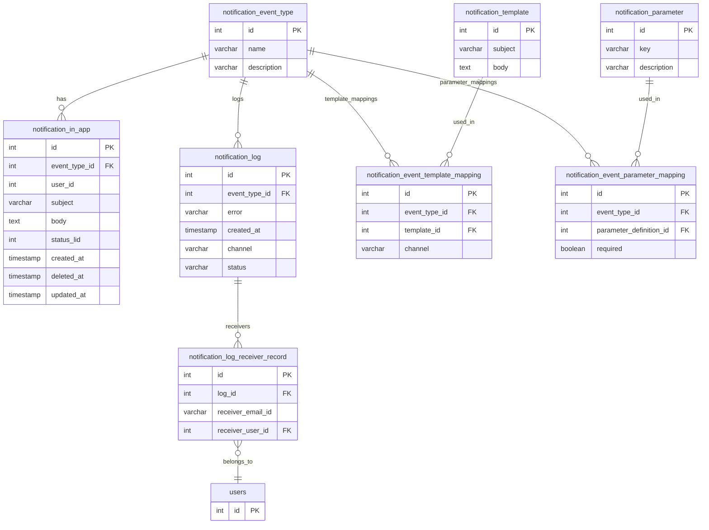

# Notifications

## 1. Overview
Notifications are essential in any system to keep users informed about important events, actions required, or updates relevant to their activities.

Notifications help improve user engagement, ensure timely responses, and enhance overall productivity by providing real-time alerts and reminders. 
In IIRM notification systems reduce the risk of missed tasks or deadlines and contribute to a more responsive and interactive user experience.


## 2. Notification Types
List and describe each type of notification (e.g., system alerts, user messages, reminders).

| Type            | Description | 
|-----------------|-------------|
| Remainders | Schedulers will be running in background <br> and trigger notifications based on business logic |
| System Generated  | Based on business logic and user Interaction  |
 


## 3. Notification Channels

In IIRM application the following notifications channels we are using 

| Channel   | Supported (Yes/No) | Notes                |
|-----------|--------------------|----------------------|
| In-App    | Yes                | Will be displayed in Notitifcations icon in the Applications     |
| Email     | Yes                | Email will be sent to specific user mail_ID |
|Whats-App|Yes|Send whatsapp messages|


### 3.1 Roles & Details of Notifications
The following are events the where notifications will get triggerd in IIRM 

- BD Executive 
    - Opportunities 
        - Opportunity is assigned to the user
        - Manager Approve / Rejection for RFP
        - Activity gets approved/ rejected from the manager
        - When there is a deviation in held cover note (BDE + BDM)
        - When the deviation is addressed/ or not addressed (BDE + BDM)
        - When there is a deviation in policy hard copy (BDE + BDM)
        - When the deviation is addressed/ not addressed (BDE + BDM)
        - When the policy is not correct in policy confirmation (BDE + BDM)
        - When the policy is corrected (BDE + BDM)
- BD Manager 
    - Approval Notifications 
        - When an approval request is received
        - When an approval is not done in 1 day, manager and manager's reporting manager has to be notified
    - Opportunity Notificatiosn
        - When a policy is confirmed for an opportunity 
        - When an opportunity is lost 
        - When a BD does not complete any activity in any opportunity by planned date
        - When there is 2 days for the Mandate entry planned date and still the activity is not completed, Manager has to be notified 
        - QCR is done and opportunity expiry date is 1 week away, notification has to be sent that there is only 1 week left after which opportunity will be lost 
        - Any deviations in Held Cover note
        - Any deviations in policy hard copy
        - If policy information is not correct in policy confirmation
- ISG Executive
    - Opportunity 
        - When an opportunity is assigned to the user 
        - When an activity is assigned to the user
        - When an activity gets rejected/ approved from the manager
        - When an activity is not performed as per planned date 
        - When Broking slip approval is done, notify that broking slip has to be shared with the insurers

- ISG Manager 
    - Opportunity 
        - When an opportunity comes to ISG Bucket
    - Approval Notifications 
        - When an approval request is received 
        - When an approval is not done in 1 day, manager and manager's reporting manager has to be notified
    - Opportunity 
        - When an opportunity is won
        - When an opportunity is lost
- Leadership 
    - Leads 
        - Weekly notification with new leads added in that week
    - Opportunity 
        - Monthly lost opportunities 

- Organization
    - Leads 
        - When a high premium lead is added (For ex: A company has been added where premium is 100 crores, then that has to be intimated to the entire org)
    - Opportunites 
        - Monthly won opportunities    


## 4. Notification Content
In IIRM we are using the following notifications templates  

- Title / Subject    - Defines the tile or subject of the mial 
- Message / Content  body - Defines the Content or body of the email 
- Action link (optional) - Defines any link to be share din the email 

[**Notifications Title and Template reference**](https://docs.google.com/spreadsheets/d/175CEg1_bXKdNoLN36gpKDNdWyUDTT8wGGxmrhBa580w/edit?gid=2083266504#gid=2083266504)


## 6. Notification Delivery Logic
- InApp- Notifications
    - InApp-Notifications are mostly generated by business logic, And will be maintained in the Database
    - Displayed into the Notification icon when an user had logged into the systems 
    - Notification will be rendered based on Role and ID of the logged user

- Mail Notifications 
    - Template will be picked from database 
    - Template will be based on the Notification Key 
    - Respective Params will get updated with values and email deliverd to users 


## 7. Read/Unread Status
- Notification status 
    - Read 
    - Un-Read

- Default notification status will be Un-Read 
- Once the user click the notifications icon and view a specific notification in the app , the status of the notification will get updated to Read


## 8. API Endpoints
List relevant API endpoints for notifications (if applicable).

|Endpoint|Method|Description|Prams / Body|
|----------------------|--------|-------------|-----|
|/notifications| GET    | Fetch user notifications   |status <br> As a Query Param|
|/update-status|PUT|Update Status |notification_id, status <br> as body|
|/check-latest-notification|GET|Fetch Latest Notifications|notification_id, status <br> as params |
|/notifications|POST|Save notifications|userid, emailId, channel , eventType <as> body|

## 9. Database Schema 
The following are the database tables used for notifications 


**ER-Daigram**



```

CREATE TABLE IF NOT EXISTS public.notification_event_type
(
    id serial PRIMARY KEY
    name character varying NOT NULL,
    description character varying ,
    CONSTRAINT notification_event_type_name_key UNIQUE (name)
);

CREATE TABLE IF NOT EXISTS public.notification_in_app
(
    id serial PRIMARY KEY,
    event_type_id integer NOT NULL,
    user_id integer NOT NULL,
    subject character varying,
    body text ,
    status_lid integer,
    created_at timestamp with time zone DEFAULT CURRENT_TIMESTAMP,
    deleted_at timestamp with time zone,
    updated_at timestamp with time zone,
    CONSTRAINT fk_notification_in_app_event_type FOREIGN KEY (event_type_id)
        REFERENCES public.notification_event_type (id) MATCH SIMPLE
        ON UPDATE NO ACTION
        ON DELETE NO ACTION
);


CREATE TABLE IF NOT EXISTS public.notification_log
(
    id serial PRIMARY KEY,
    event_type_id integer NOT NULL,
    error character varying,
    created_at timestamp with time zone DEFAULT CURRENT_TIMESTAMP,
    channel character varying(250) ,
    status character varying(250) ,
    CONSTRAINT fk_notification_log_event_type FOREIGN KEY (event_type_id)
        REFERENCES public.notification_event_type (id) MATCH SIMPLE
        ON UPDATE NO ACTION
        ON DELETE NO ACTION
);


CREATE TABLE IF NOT EXISTS public.notification_log_receiver_record
(
    id serial PRIMARY KEY,
    log_id integer,
    receiver_email_id character varying,
    receiver_user_id integer,
    CONSTRAINT fk_notification_log_id FOREIGN KEY (log_id)
        REFERENCES public.notification_log (id) MATCH SIMPLE
        ON UPDATE NO ACTION
        ON DELETE NO ACTION,
    CONSTRAINT fk_user_id FOREIGN KEY (receiver_user_id)
        REFERENCES public.users (id) MATCH SIMPLE
        ON UPDATE NO ACTION
        ON DELETE NO ACTION
        NOT VALID
);

CREATE TABLE IF NOT EXISTS public.notification_template
(
    id serial PRIMARY KEY,
    subject character varying COLLATE pg_catalog."default" NOT NULL,
    body text COLLATE pg_catalog."default" NOT NULL
);


CREATE TABLE IF NOT EXISTS public.notification_parameter
(
    id serial PRIMARY KEY,
    key character varying COLLATE pg_catalog."default" NOT NULL,
    description character varying COLLATE pg_catalog."default",
    CONSTRAINT notification_parameter_pkey PRIMARY KEY (id),
    CONSTRAINT notification_parameter_key_key UNIQUE (key)
);

CREATE TABLE IF NOT EXISTS public.notification_event_template_mapping
(
    id serial PRIMARY KEY,
    event_type_id integer NOT NULL,
    template_id integer NOT NULL,
    channel character varying(250) COLLATE pg_catalog."default" NOT NULL,
    CONSTRAINT fk_notification_event_type FOREIGN KEY (event_type_id)
        REFERENCES public.notification_event_type (id) MATCH SIMPLE
        ON UPDATE NO ACTION
        ON DELETE NO ACTION,
    CONSTRAINT fk_notification_template FOREIGN KEY (template_id)
        REFERENCES public.notification_template (id) MATCH SIMPLE
        ON UPDATE NO ACTION
        ON DELETE NO ACTION
);

CREATE TABLE IF NOT EXISTS public.notification_event_parameter_mapping
(
    id serial PRIMARY KEY,
    event_type_id integer NOT NULL,
    parameter_definition_id integer NOT NULL,
    required boolean DEFAULT false,
    CONSTRAINT fk_event_parameter_mapping_event_type FOREIGN KEY (event_type_id)
        REFERENCES public.notification_event_type (id) MATCH SIMPLE
        ON UPDATE NO ACTION
        ON DELETE NO ACTION,
    CONSTRAINT fk_event_parameter_mapping_parameter_definition FOREIGN KEY (parameter_definition_id)
        REFERENCES public.notification_parameter (id) MATCH SIMPLE
        ON UPDATE NO ACTION
        ON DELETE NO ACTION
);

```


## 10. Error Handling


## 11. Security & Privacy
- Only Loged-In user can view his In-app Notifications 
- Logged User get displayed wih the notfications 
- API communication will be based on valid JWT Token 
- User will be Authorized to a specific route using role gaurd and acl gaurd


## 12. Future Enhancements

