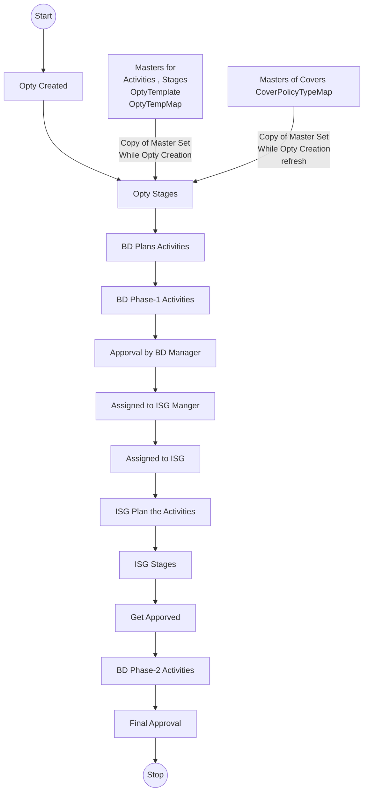

### Opprtunity 
- Created by BD
- Activities will be performed by BD / ISG on the Opportunity
- Stage Can be a collection of one or more Activities 
- Some activities need approval from respective managers
- Set of activities and Stages will depend on the type of Opportunity template
  - Ex : GMC, HMC , Fire , may have different Stages , some will be common

### BD Stages 
- BD Phase - 1 
  - Data Validation
  - Meeting With KDM
  - Mandate Details Entry
  - RFP Data Collection
  - RFP Details Entry
- BD Phase - 2
  - Held Cover Note
  - Policy Hard Copy Reciept
  - Policy Confirmation
  - Policy Docket
  - Handover Cover Meet

### ISG Stages 
- ISG Stages 
  - Broking Slip Gen
  - Enter Quote
  - QCR gen
  - Meeting Final Nego
  - Placement Slip Gen
  - Premium Calc


**Opportunity Flow**




### Access Previlages on Opty

- BD Role 
  - Own 
  - Own + Tagged 
  - Own + Tagged + My Reportees
  - Own + Tagged + Tagged User Reportees + My Reportees  

- ISG Role 
  - Will come into Picture after BD Phase-1 Completed
  - Can view all the stages information once get access
  - Can perform only the activates as per his role


### Database Schema plan 

[**DB Shcema Refernce**](https://docs.google.com/spreadsheets/d/1W2wfVvku7CqA-I7CqpwslrHsc1EqtWNchVkpCEz7Vss/edit?gid=221077927#gid=221077927)


### API Planning 

- DB - Masters for Opty Stages and Activitites 
- API for Create / Edit / List of Opportunity by applying ACL and RBAC
- API for SmartSearch Opportunity by applying ACL and RBAC
- API for Plan the dates for Opportunity , Once the first data selected , Auto populate Dates
- API for Each Stage - for BD stages Phase-1 to store the data of Each Stage
- API for Approving the Opportunity and Assign to ISG Department
- API for Each Stage- for ISG stages  to store the data of Each Stage
- API for Each Stage- for BD stages Phase-2 to store the data of Each Stage
- API for Final Approvals

**Endpoints** : [Opportunity Endpoints details]() 

| Host URL   |      Method      |  EndPoint |Description|
|----------|:-------------|------:|:------|
| http://localhost:3016 |GET |  /opportunity| Get the list of Opportunities |
| http://localhost:3016 |GET |  /opportunity/activity-data/{opportunityActivityId}| Get Opportunity by id |


Authentication & Authorization Details

Error Handling

### UI Planning 
- Reusable Forms 
- Reusable Styling System 
- UI Implementation as per Figma
- API Integrations 


**DB Queries**
```
SELECT * FROM organisation 	
SELECT * FROM employee WHERE organization_lid = 1
SELECT * FROM employee_hierarchy
SELECT * FROM company 
  
-- All the Opprtunities 
SELECT * FROM opportunity

-- My own oppertunities 
SELECT * FROM opportunity OPP 
where lead_crm = 79 ORDER BY OPP.id DESC LIMIT 100

-- Reportees for me 
 SELECT * FROM employee_hierarchy 
 WHERE reporting_user_id = 79

-- Me + My reportess 
-- SELECT * FROM employee_hierarchy 
SELECT * FROM opportunity OPP 
	LEFT JOIN company COM ON OPP.company_id = COM.id
	LEFT JOIN employee emp ON EMP.id = COM.lead_crm
	WHERE OPP.lead_crm = 79 
		OR OPP.lead_crm IN (
            SELECT user_id FROM public.employee_hierarchy 
            WHERE reporting_user_id = 79
        )
		ORDER BY OPP.id DESC LIMIT 100


-- Me + Reportess + Tagged 
-- SELECT * FROM entity_user_tag
SELECT * FROM opportunity OPP 
LEFT JOIN entity_user_tag EUT ON EUT.entity_id = OPP.id
LEFT JOIN company COM ON OPP.company_id = COM.id
LEFT JOIN employee emp ON EMP.id = COM.lead_crm
WHERE OPP.lead_crm = 79
	OR OPP.lead_crm IN (
            SELECT user_id FROM public.employee_hierarchy 
            WHERE reporting_user_id = 79
        )
	OR EUT.user_id = 79	
	ORDER BY OPP.id DESC LIMIT 100

-- Me + Reportees + Tagged + Reportees Tagged 
SELECT * FROM opportunity OPP 
LEFT JOIN entity_user_tag EUT ON EUT.entity_id = OPP.id
LEFT JOIN company COM ON OPP.company_id = COM.id
LEFT JOIN employee emp ON EMP.id = COM.lead_crm
WHERE OPP.lead_crm = 79
		-- My Reportess
    	OR OPP.lead_crm IN (
            SELECT user_id FROM public.employee_hierarchy 
            WHERE reporting_user_id = 79
        )
		-- My Tagged
        OR EUT.user_id = 79
        -- My reportees Tagged
		OR EUT.user_id  IN (
            SELECT user_id FROM public.employee_hierarchy 
            WHERE reporting_user_id = 79
        )
		ORDER BY OPP.id DESC LIMIT 100			
```
