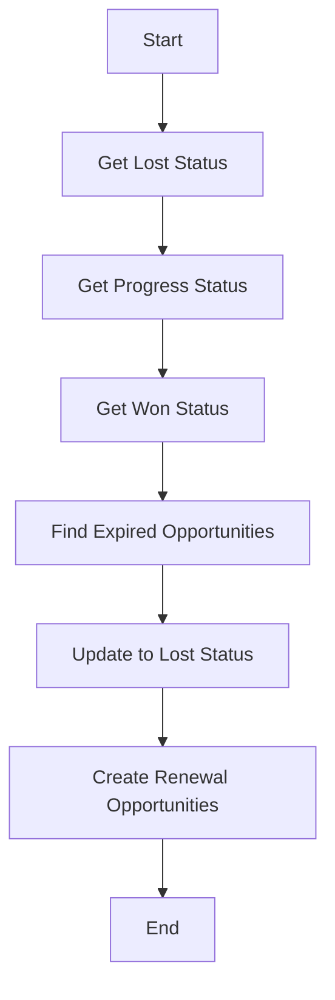
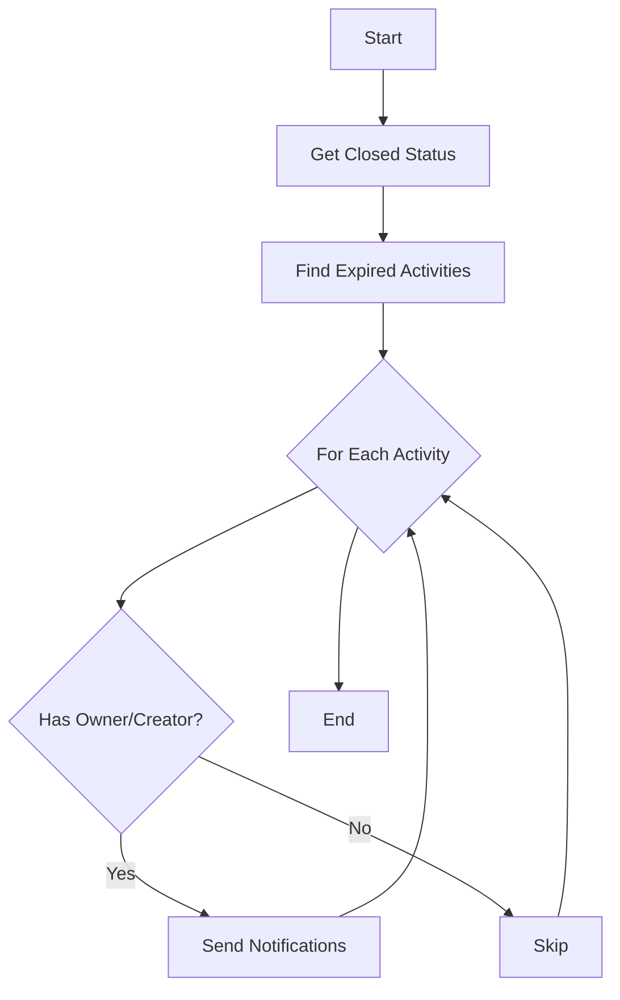
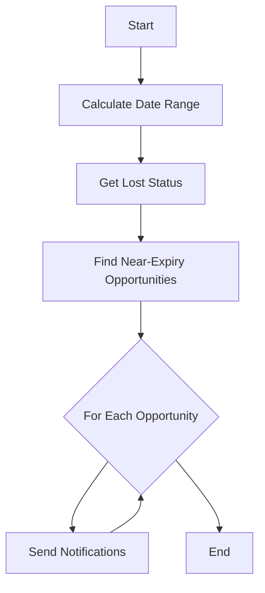

## Scheduler Service Specification

## Overview
This document outlines the scheduled jobs running in the Insurance Wellness Hub's Scheduler Service, specifically focusing on opportunity status management and notifications.

## Cron Jobs Schedule

| Job Name | Schedule | Timing |
|----------|----------|---------|
| Handle Expired Opportunities | `00 8 * * *` | Daily at 8:00 AM |
| Handle Activities Close to Expiry | `00 8 * * *` | Daily at 8:00 AM |
| Handle Opportunities Close to Expiry | `00 8 * * *` | Daily at 8:00 AM |

## Job Specifications

### 1. Handle Expired Opportunities


**Purpose**: Manages expired opportunities and creates renewal opportunities.

**Process Flow**:
1. Retrieves status configurations (Lost, Work in Progress, Won)
2. Identifies opportunities past their expiration date
3. Updates expired opportunities to "Lost" status
4. Creates renewal opportunities for expired ones

**Error Handling**:
- Logs error if status lookups are not found
- Continues processing even if some opportunities fail

### 2. Handle Opportunity Activities Close to Expiry


**Purpose**: Monitors expired activities and sends notifications.

**Process Flow**:
1. Retrieves closed status configuration
2. Identifies expired activities not marked as closed
3. Sends notifications to activity owners/creators

**Notification Details**:
- Type: `OPPORTUNITY_ACTIVITY_PLAN_DELAY`
- Recipients: Activity owner or creator
- Channels: In-app and email

### 3. Handle Opportunities Close to Expiry


**Purpose**: Proactively notifies about opportunities approaching expiration.

**Process Flow**:
1. Identifies opportunities expiring in next 7 days
2. Excludes already lost opportunities
3. Sends notifications to opportunity owners

**Time Window**:
- Current date to +7 days

## Notification System

### Notification Types
```typescript
const NOTIFICATION_EVENT_TYPES = {
  OPPORTUNITY_EXPIRATION: "Opportunity_Expiration",
  OPPORTUNITY_ACTIVITY_PLAN_DELAY: "Opportunity_Activity_Plan_Delay"
};
```

### Notification Channels
- In-app notifications
- Email notifications

### Notification Parameters
```typescript
interface NotificationParams {
  eventType: string;
  emailId: string[];
  channel: string;
  parameters: Record<string, string>;
  userId: number[];
}
```

## Error Handling & Logging

### Error Scenarios:
1. Missing lookup values
2. Database query failures
3. Notification service failures
4. User details not found

### Logging Strategy:
- Console errors for configuration issues
- Error tracking for notification failures
- Activity tracking for successful operations

## Dependencies

### External Services:
- Notification Service: `${ENV.URL_NOTIFICATION_SERVICE}/notifications`
- Client Server: `${ENV.CLIENT_SERVER_URL}`

### Database Entities:
- Opportunity
- LookUp
- User
- NotificationEventParameterMapping
- OpportunityActivityMap

## Testing Strategy

### Unit Tests:
```typescript
describe('OpportunityStatusScheduler', () => {
  describe('handleExpiredOpportunities', () => {
    it('should update expired opportunities to lost status');
    it('should create renewal opportunities');
    it('should handle missing status configurations');
  });

  describe('handleOpportunityActivitiesCloseToExpiry', () => {
    it('should identify expired activities');
    it('should send notifications to owners');
  });

  describe('handleOpportunitiesCloseToExpiry', () => {
    it('should identify opportunities expiring in 7 days');
    it('should send expiration notifications');
  });
});
```

## Monitoring & Maintenance

### Key Metrics:
1. Number of opportunities marked as lost
2. Number of renewal opportunities created
3. Notification success/failure rate
4. Job execution time
5. Error frequency

### Health Checks:
1. Database connectivity
2. Notification service availability
3. Cron job execution status

## Future Enhancements

1. Configurable notification schedules
2. Multiple notification channels
3. Batch processing for large datasets
4. Retry mechanism for failed notifications
5. Custom notification templates