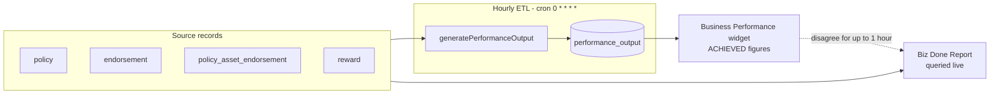
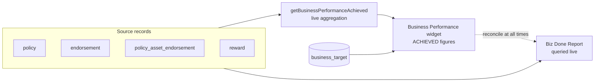
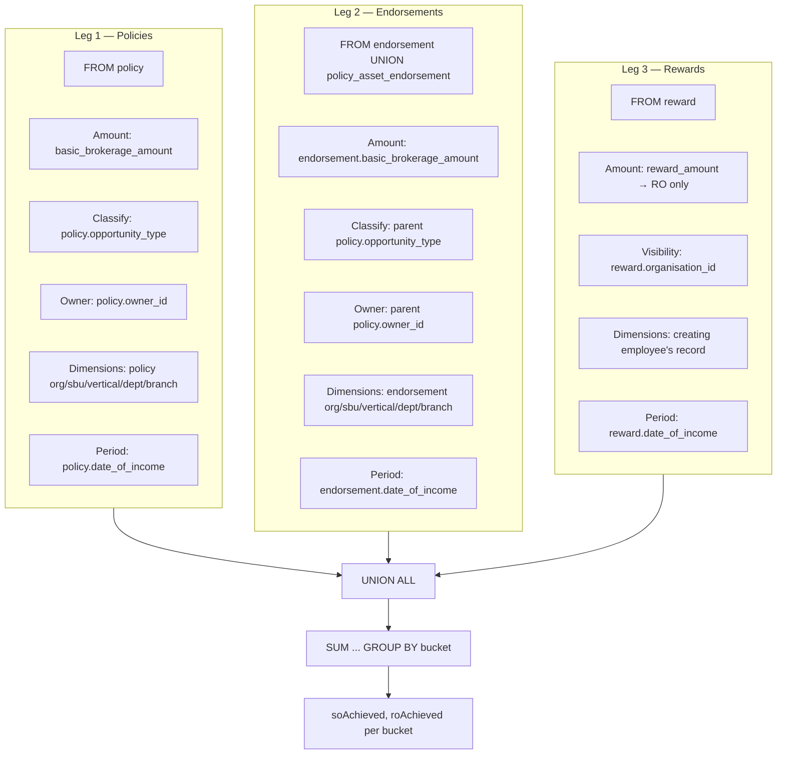
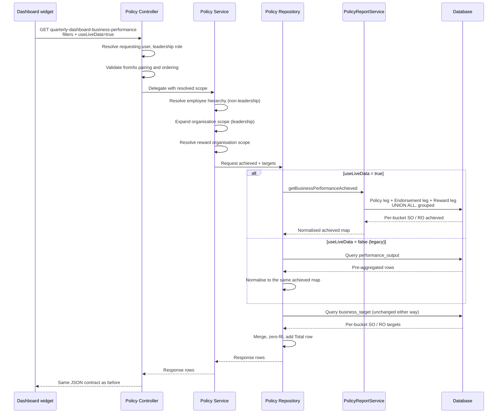

# Business Performance Widget — Live Data Sourcing

**Status:** Draft — pending functional sign-off and database verification
**Date:** 2026-08-04
**Affected surface:** iWork Dashboard → "My Business Performance" (Target vs Actual Breakdown)

---

## 1. Purpose

This document defines the business and functional requirements for changing **how the "My Business Performance" dashboard widget obtains its achieved (actual) figures**.

Today the widget reads pre-aggregated figures from the `performance_output` table, which is refreshed by an hourly background job. The Biz Done Report, by contrast, aggregates the same underlying records at query time. The two surfaces therefore disagree for up to an hour after any policy, endorsement, or reward is created or edited — a discrepancy business users encounter routinely and cannot explain, which erodes confidence in both reports.

This enhancement makes the widget aggregate its achieved figures on demand from the same source tables the Biz Done Report reads. The batch table is removed from the widget's read path entirely, so a reconciliation gap caused by job timing becomes structurally impossible.

**Business outcome:** For any given filter combination, the widget's achieved figures reconcile with the Biz Done Report at every point in time, with no dependency on job execution.

---

## 2. Scope

### **In-Scope**

- **Achieved-side data sourcing** for the two widget endpoints:
  - `GET /policy/quarterly-dashboard-business-performance` (quarterly SO/RO chart)
  - `GET /policy/quarterly-dashboard-business-performance-by-sbu-basis` (per-SBU breakdown)
- **Live aggregation** of achieved brokerage from the `policy` table, both endorsement tables, and the `reward` table, applying the same eligibility rules the Biz Done Report applies
- **A controlled rollout switch** (`useLiveData` query parameter) so the legacy and live figures can be compared side by side in a live environment before the legacy path is retired
- **Preservation of the existing API response contract** — field names, types, ordering, quarter labels, and the `Total` row are unchanged, so no downstream UI logic is affected
- **Preservation of the existing filter contract** — the widget continues to honour exactly the filters it honours today
- **Reward attribution parity** — rewards continue to be counted within RO achieved and continue to be attributed to the creating employee's SBU

### **Out-of-Scope**

- **The target (plan) side of the widget.** Targets are read from `business_target` and are not affected by this change in any way.
- **Additional filters.** `insurerId`, `incomeType`, `businessMonth`, `filterByBusinessDate`, `policyType`, `groupCompanyId` and `brokerId` are accepted by the Biz Done Report but are deliberately **not** introduced into this widget. The UI already suppresses the widget when an insurer or business-month filter is applied.
- **The `generatePerformanceOutput` job and the `performance_output` table.** Both remain in place and continue to run unchanged, because other consumers still depend on them (see §10).
- **The second dashboard widget** served by `getNewDashboardBusinessPerformance`, and the `opportunity-service` consumer of `performance_output`. Both remain on the batch table and remain subject to the same staleness. They are candidates for the same treatment once this change is proven (see §11).
- **Any change to how policies, endorsements, or rewards are created, edited, or classified.**
- **Retirement of the `useLiveData` parameter.** Flipping the default and removing the legacy branch is a separate, later activity.
- **New indexes or database migrations.** Index requirements are stated as a verification action, not delivered here (see §8).

---

## 3. Stakeholders

- **Primary Users:** Business Development leadership, SBU heads, and managers who read the "My Business Performance" widget and reconcile it against the Biz Done Report
- **Secondary Users:** Operations and MIS teams who field "why don't these two numbers match" queries
- **System Actors:**
  - **Policy Service** — serves both widget endpoints and performs the live aggregation
  - **Scheduler Service** — continues to trigger the hourly `generatePerformanceOutput` job for the remaining consumers
- **External Stakeholders:** None

---

## 4. Problem Statement

### **4.1 Current behaviour**

The `generatePerformanceOutput` job runs hourly (`@Cron("0 * * * *")` in `opportunity-status.scheduler.ts`). For each employee and each org dimension combination, it writes one `performance_output` row per KPI/entity-type pairing for a given month.

Between two job runs, any record created or edited is invisible to the widget but immediately visible to the Biz Done Report.

### **4.2 Business impact**

| Impact | Description |
|---|---|
| Reconciliation failure | The widget and the Biz Done Report show different achieved figures for the same filter set, with no visible reason |
| Loss of confidence | Users cannot tell which of the two numbers is correct, so both are treated as unreliable |
| Support overhead | Each discrepancy generates an investigation that concludes "wait for the job to run" |
| Data-entry feedback gap | A user who corrects a policy cannot confirm the correction on the dashboard until the next hour |
| Job fragility | A failed, delayed, or partially-completed job run silently extends the discrepancy window indefinitely, with no user-visible indication |

### **4.3 Why not simply run the job more often**

Increasing the job frequency shortens the window but does not close it, and multiplies the load of a full re-aggregation across all employees. Any caching or batching layer placed in front of the same pipeline inherits the same staleness. The only structural fix is to remove the intermediate table from the widget's read path, which is what this enhancement does.

---

## 5. Solution Overview

The achieved half of both widget endpoints is computed at request time. The target half continues to read `business_target`. The two halves are merged into the existing response shape.

The live aggregation is implemented in `PolicyReportService` — the same class that already owns the Biz Done Report's listing, KPI, and org-drilldown queries. Co-locating the widget's aggregation with the report's aggregation is deliberate: the divergence this enhancement fixes arose because the two surfaces had separate implementations of the same business rules.

---

## 6. Data Sourcing — Detailed

This section is the substance of the enhancement: exactly which records are read, how each is classified, how each is attributed, and how the filters are applied.

### **6.1 What the two achieved measures mean**

The widget shows two achieved measures per bucket (per quarter, or per SBU).

| Measure | Business definition | Source amount |
|---|---|---|
| **SO Achieved** | Brokerage earned on new business (sales opportunities), including mined business | `basic_brokerage_amount` on policies and endorsements whose parent policy has `opportunity_type = 'SO'` |
| **RO Achieved** | Brokerage earned on renewals, **plus** reward income | `basic_brokerage_amount` on policies and endorsements whose parent policy has `opportunity_type = 'RO'`, **plus** `reward_amount` on rewards |

**Note on mined business.** The legacy ETL wrote separate `MINED` and `MINED_ENDORSEMENT` entity types, but the widget then folded them into SO Achieved together with `SO` and `SO_ENDORSEMENT`. Mined and non-mined new business are therefore indistinguishable in this widget's output. The live aggregation reflects this by classifying on `opportunity_type` alone. **This is not a behaviour change** — the two figures were already summed together — but it is called out here so the absence of a mined split is understood as intentional.

**Note on rewards in RO.** Rewards have always been counted inside RO Achieved (the widget displays an asterisked note to this effect). This is preserved.

**Note on excluded records.** A policy whose `opportunity_type` is neither `'SO'` nor `'RO'` contributes to neither measure. This matches the legacy ETL, which had no branch for other values.

### **6.2 The three legs**

The aggregation reads three independent groups of records and sums their contributions. They are combined with `UNION ALL` rather than joined, for two reasons: each group answers the attribution question differently, and a join that multiplies rows (a co-insured policy produces one row per insurer participant) would double-count money.

#### **Leg 1 — Policies**

| Aspect | Rule |
|---|---|
| Table | `policy` |
| Amount | `SUM(COALESCE(basic_brokerage_amount, 0))`, split by `opportunity_type` into the SO and RO measures |
| Eligibility gate | `enabled_for_performance_lid` must equal the "Yes" toggle lookup id. Records not enabled for performance are excluded. |
| Period | `date_of_income` within the resolved date range |
| Owner attribution | `owner_id` |
| Org attribution | The policy row's own `organisation_id`, `sbu_id`, `vertical_id`, `department_id`, `branch_id` |

#### **Leg 2 — Endorsements**

Endorsements are read from a union of the two endorsement tables — `endorsement` (group policies) and `policy_asset_endorsement` (asset policies) — using the same unified source definition the Biz Done Report uses, so no endorsement type is missed.

| Aspect | Rule |
|---|---|
| Tables | `endorsement` ∪ `policy_asset_endorsement`, inner-joined to the parent `policy` |
| Amount | `SUM(COALESCE(endorsement.basic_brokerage_amount, 0))` |
| Classification | Inherited from the **parent policy's** `opportunity_type`. An endorsement has no opportunity of its own. |
| Eligibility gate | `enabled_for_performance_lid` = "Yes" on **both** the endorsement row and its parent policy |
| Period | The **endorsement's** own `date_of_income` — an endorsement is recognised in the month its income falls, not its parent policy's |
| Owner attribution | The **parent policy's** `owner_id`. An endorsement has no owner of its own. |
| Org attribution | The endorsement row's own `sbu_id`, `vertical_id`, `department_id`, `branch_id` |

> **Inherited nuance — organisation on endorsements.** In the unified endorsement source, group endorsements take `organisation_id` from the **parent policy**, whereas asset endorsements take it from the **endorsement row**. This asymmetry exists in the shared source definition and applies identically to the legacy ETL and to the live aggregation, so it is not a change introduced here. It is documented so that an organisation-filtered comparison between the two endorsement types is not mistaken for a defect in this enhancement.

#### **Leg 3 — Rewards**

A reward is neither a policy nor an endorsement: it has no owner, no opportunity, and no SBU. It carries only `organisation_id` and `created_by`. Its treatment therefore separates two distinct questions.

| Question | Rule | Rationale |
|---|---|---|
| **May this viewer see it?** | `reward.organisation_id` must fall within the viewer's organisation scope | Matches the Biz Done Report exactly, so the two surfaces always agree on which rewards are in scope, and organisation isolation is enforced on the reward's own recorded organisation |
| **Whose number is it?** | SBU / vertical / department / branch are taken from the **creating employee's** record, joined via `created_by` | The reward row carries none of these columns, so the creating employee is the only attribution available — and it is the attribution the legacy ETL used, so existing figures are preserved |

| Aspect | Rule |
|---|---|
| Table | `reward`, left-joined to the employee record on `created_by` |
| Amount | `SUM(COALESCE(reward_amount, 0))` — contributes to **RO Achieved only**; SO contribution is zero |
| Exclusions | Soft-deleted rewards (`deleted_at IS NOT NULL`) are excluded |
| Period | `reward.date_of_income` within the resolved date range |
| Owner attribution | **None.** Rewards are never scoped by the owner hierarchy, matching the Biz Done Report. |
| Sub-org filters | Applied against the creating employee's `sbu_id` / `vertical_id` / `department_id` / `branch_id` |

> **Organisation drift guard.** Because a reward is made *visible* by its own `organisation_id` but *attributed* by its creator's SBU, the two can disagree if that employee has since transferred to another organisation. In the per-SBU breakdown, the SBU display-name lookup is constrained to the organisations in scope, so such a reward is dropped rather than causing an SBU belonging to another organisation to appear inside an organisation-filtered chart. Cross-organisation isolation takes precedence over completeness in this rare case.

### **6.3 Bucketing**

| Endpoint | Bucket | Derivation |
|---|---|---|
| Quarterly chart | Fiscal quarter Q1–Q4 | `FLOOR(((EXTRACT(MONTH FROM date_of_income) + 8) % 12) / 3) + 1` — April–June = Q1 through January–March = Q4 |
| Per-SBU breakdown | SBU | The leg's `sbu_id` (for rewards: the creating employee's `sbu_id`) |

The legacy ETL bucketed on `performance_output.performance_month`, which was only ever the month of the underlying `date_of_income`. Applying the same expression directly to `date_of_income` is arithmetically equivalent.

The quarterly endpoint always returns all four quarters plus a `Total` row, zero-filling quarters with no activity. The per-SBU endpoint zero-fills SBUs with no activity from the organisation's SBU master list, so the chart shows the full SBU set rather than only those with movement.

### **6.4 Filter application**

The widget honours exactly the filters it honours today. No filter is added or removed.

| Filter | Applied to policies | Applied to endorsements | Applied to rewards |
|---|---|---|---|
| `organisationId` | Policy row's `organisation_id` | Endorsement source's `organisation_id` | `reward.organisation_id` |
| `sbuId` | Policy row's `sbu_id` | Endorsement row's `sbu_id` | Creating employee's `sbu_id` |
| `verticalId` | Policy row's `vertical_id` | Endorsement row's `vertical_id` | Creating employee's `vertical_id` |
| `departmentId` | Policy row's `department_id` | Endorsement row's `department_id` | Creating employee's `department_id` |
| `branchId` | Policy row's `branch_id` | Endorsement row's `branch_id` | Creating employee's `branch_id` |
| `userId` / `owner` | `policy.owner_id` within the resolved hierarchy | Parent `policy.owner_id` | **Not applied** — rewards have no owner |
| `financialYear` / `quarter` / `month` | Resolved to a date range, applied to `date_of_income` | Same, on the endorsement's `date_of_income` | Same, on `reward.date_of_income` |
| `from` / `to` | Overrides `financialYear`/`quarter`/`month` when both are supplied | Same | Same |
| `insurerId`, `incomeType`, `businessMonth` | **Not applied** — out of scope; the UI suppresses the widget when an insurer or business-month filter is active | | |

**Hierarchy resolution.** For non-leadership users the requesting user's downline is resolved first, and the resulting employee list scopes the policy and endorsement legs. For leadership users no owner restriction is applied; scope comes from the organisation filters instead. Where an explicit employee is selected, that selection always takes precedence over the leadership bypass. This resolution logic is unchanged.

**Date-range resolution.** When `from` and `to` are both supplied they are used directly. Otherwise the range is derived from `month`, else `quarter`, else the full financial year. The quarterly endpoint clips the *current* quarter to today; the per-SBU endpoint uses the full quarter span, because targets are set for future months and the breakdown must sum to the same quarterly total. **This asymmetry is pre-existing and is deliberately left unchanged**, since altering it would move the target figures as well.

### **6.5 Request flow**

Both sourcing paths are normalised to an identical intermediate shape before merging, so the assembly, zero-filling, and totalling logic is shared and cannot drift between the two paths.

### **6.6 Target sourcing**

Targets continue to be read from `business_target` where the KPI is Brokerage and the entity type is `SO` or `RO`, with `month` inside the resolved range. Because `business_target` carries no organisation dimension columns of its own, organisation-level filtering on the target side resolves through the employee record — as it does today.

> This section originally read "unchanged, stated for completeness — no change is made here, and no change is required." That proved incorrect: the two endpoints scoped the target side differently, and the quarterly endpoint's target query has since been corrected. See §14.

---

## 7. Functional Requirements

### **Achieved Data Sourcing**

- **FR-001** — When `useLiveData=true`, both widget endpoints shall compute achieved figures by aggregating the `policy`, endorsement, and `reward` tables at request time, and shall not read `performance_output`.
- **FR-002** — When `useLiveData` is absent or `false`, both endpoints shall behave exactly as they do today, reading achieved figures from `performance_output`.
- **FR-003** — The live aggregation shall apply the "enabled for performance" gate to policies, and to both the endorsement row and its parent policy.
- **FR-004** — The live aggregation shall classify SO versus RO from `policy.opportunity_type`, taking the parent policy's value for endorsements, and shall exclude records whose value is neither `'SO'` nor `'RO'`.
- **FR-005** — The live aggregation shall recognise each record in the period of its own `date_of_income`.
- **FR-006** — The live aggregation shall exclude soft-deleted rewards.
- **FR-007** — Reward amounts shall contribute to RO Achieved only, never to SO Achieved.
- **FR-008** — Reward visibility shall be scoped by `reward.organisation_id`; reward SBU, vertical, department and branch attribution shall be taken from the creating employee's record.
- **FR-009** — Rewards shall not be scoped by the owner hierarchy.
- **FR-010** — In the per-SBU breakdown, an SBU resolved for a reward that does not belong to an organisation in scope shall be excluded from the result.

### **Contract Preservation**

- **FR-011** — The response payload of both endpoints shall be byte-compatible in structure with the current contract: identical field names, types, quarter labels, `Total` row, and ordering.
- **FR-012** — Both endpoints shall continue to zero-fill: all four quarters on the quarterly endpoint, and the organisation's full active SBU list on the per-SBU endpoint.
- **FR-013** — Inactive SBUs shall continue to be excluded from the per-SBU breakdown.
- **FR-014** — The set of honoured filters shall be unchanged; `insurerId`, `incomeType` and `businessMonth` shall continue to be ignored by these two endpoints.
- **FR-015** — Existing date validation shall be retained: supplying only one of `from`/`to`, or a `from` later than `to`, shall return a validation error.

### **Rollout Control**

- **FR-016** — `useLiveData` shall be an optional boolean query parameter on both endpoints, defaulting to `false`.
- **FR-017** — The dashboard widget shall send `useLiveData=true` on both requests.
- **FR-018** — Both paths shall remain independently callable for the duration of the validation period, so figures can be compared without a deployment.

### **Unaffected Behaviour**

- **FR-019** — Target figures shall be sourced from `business_target` regardless of the value of `useLiveData`.
- **FR-020** — The `generatePerformanceOutput` job shall continue to run on its existing schedule and shall continue to populate `performance_output` for its remaining consumers.

---

## 8. Non-Functional Requirements

### **Performance**

- **NFR-001** — The live path replaces a small pre-aggregated table scan with a three-leg aggregation over the policy, endorsement and reward tables. The worst case — a leadership user, full financial year, no filters — must be measured with query analysis on a production-sized dataset before the flag is enabled for general use.
- **NFR-002** — If the measured response time is unacceptable, the remedy is indexing, not caching. A time-to-live cache would reintroduce precisely the staleness this enhancement removes. The candidate covering index is `(date_of_income, enabled_for_performance_lid, owner_id, opportunity_type)` including `organisation_id`, `sbu_id`, `basic_brokerage_amount`, with equivalents on both endorsement tables. Any index shall be added through a migration, not applied ad hoc.
- **NFR-003** — Date-range predicates must be expressed against the raw date columns so that indexes remain usable. Wrapping a date column in a conversion function, as the legacy ETL did, is not permitted on this path.

### **Data Integrity**

- **NFR-004** — Achieved figures shall be derived exclusively from committed source records; no intermediate persisted state shall sit between the source tables and the widget response on the live path.
- **NFR-005** — Amount aggregation shall not be performed across a join that multiplies source rows, so that co-insured policies cannot double-count premium or brokerage.

### **Maintainability**

- **NFR-006** — The live aggregation shall reside in the same service class that owns the Biz Done Report's aggregation rules, so that a future change to eligibility, classification, or attribution applies to both surfaces at once. The defect this enhancement corrects originated in two separate implementations of one set of rules.
- **NFR-007** — Both sourcing paths shall normalise to a common intermediate shape so that response assembly is shared and cannot diverge.

### **Security**

- **NFR-008** — Organisation isolation shall be enforced on both paths. A non-leadership user's reward scope shall be resolved explicitly to their own organisation rather than left unrestricted.
- **NFR-009** — The existing authentication and leadership-role resolution shall be unchanged.

---

## 9. Business Rules & Constraints

### **Classification Rules**

- **BR-001** — New business (`opportunity_type = 'SO'`) counts towards SO Achieved, including mined business.
- **BR-002** — Renewal business (`opportunity_type = 'RO'`) counts towards RO Achieved.
- **BR-003** — An endorsement always inherits its parent policy's SO/RO classification.
- **BR-004** — Reward income counts towards RO Achieved.
- **BR-005** — A record whose `opportunity_type` is neither `'SO'` nor `'RO'` counts towards neither measure.

### **Eligibility Rules**

- **BR-006** — Only records flagged as enabled for performance are counted. For an endorsement, both the endorsement and its parent policy must be flagged.
- **BR-007** — Soft-deleted rewards are never counted.

### **Attribution Rules**

- **BR-008** — Owner attribution for both policies and endorsements is the policy's owner. An endorsement has no owner of its own.
- **BR-009** — Organisation attribution for a reward is the reward's own recorded organisation.
- **BR-010** — SBU, vertical, department and branch attribution for a reward is the creating employee's current record.
- **BR-011** — Rewards are never restricted by the owner hierarchy.
- **BR-012** — Where a reward's recorded organisation and its creator's organisation disagree, the reward is excluded from the per-SBU breakdown rather than surfacing an out-of-scope SBU.

### **Period Rules**

- **BR-013** — A record is recognised in the period containing its own date of income.
- **BR-014** — An explicit `from`/`to` range overrides the financial-year, quarter, and month filters.
- **BR-015** — The quarterly chart clips the current quarter at today; the per-SBU breakdown spans the full quarter. This is pre-existing and intentional, because targets exist for future months within the quarter.

### **Constraints**

- **BR-016** — The `reward` table has no SBU, vertical, department or branch column. Any SBU-level reward figure necessarily derives from the creating employee.
- **BR-017** — `business_target` has no organisation dimension columns, so target-side organisation filtering must resolve through the employee record.
- **BR-018** — The widget cannot honour insurer-level or income-type filters on the target side, which is why they are excluded from the achieved side as well; introducing them on one side only would produce a target/achieved mismatch.

---

## 10. Changes in Behaviour

The following differences between the legacy and live figures are expected. During validation, every difference observed must map to one of these; anything else is a defect.

| # | Change | Cause | Assessment |
|---|---|---|---|
| 1 | Achieved figures update immediately on save instead of after the next job run | The intended outcome of this enhancement | Expected and desired |
| 2 | Rewards are no longer restricted by the owner hierarchy | Matches Biz Done Report behaviour; a reward has no owner to scope by | Accepted — a manager's view may include organisation-wide rewards it previously excluded |
| 3 | Leadership totals may increase slightly | The legacy ETL only ever wrote rows for employees of specific user types, silently excluding policies owned by anyone else. The Biz Done Report applies no such restriction, and neither does the live path. | Accepted — the live figure is the more complete one |
| 4 | A reward whose creator has changed organisation may be excluded from the per-SBU breakdown | Organisation-drift guard (BR-012) | Accepted — cross-organisation isolation takes precedence |

**Explicitly unchanged:** reward inclusion in RO Achieved; reward SBU attribution; the mined/non-mined treatment; the API response contract; the filter contract.

> **Superseded.** This list originally also declared "the quarter versus per-SBU date-range asymmetry" and "all target figures" to be unchanged. Both were wrong, and together they were the reason AC-003 failed on the live path. See §14.

---

## 11. Acceptance Criteria

### **AC-001 — Immediacy (the core requirement)**

- **Given** a policy with a brokerage amount inside the current financial year
- **When** the brokerage amount is edited and the dashboard is reloaded **without** running the `generatePerformanceOutput` job
- **Then** the widget's achieved figure reflects the edit immediately
- **And** the same request with `useLiveData=false` still shows the pre-edit figure, demonstrating the difference is the sourcing change

### **AC-002 — Reconciliation with the Biz Done Report**

- **Given** any filter combination the widget supports
- **When** the widget's SO Achieved and RO Achieved are summed across all four quarters
- **Then** the total equals the Biz Done Report's Brokerage Amount KPI for the same filters, allowing for fee amounts which the report includes in its own total and this widget does not
- **And** the equality holds without the job having run in between

### **AC-003 — Internal consistency between the two charts**

- **Given** the same filter set applied to both endpoints
- **When** the per-SBU breakdown's SO and RO achieved figures are summed across all SBUs
- **Then** the totals reconcile with the quarterly chart's corresponding totals, including the reward component

### **AC-004 — Contract preservation**

- **Given** identical filters
- **When** each endpoint is called with `useLiveData=false` and then `useLiveData=true`
- **Then** the response structures are identical in field names, types, ordering, quarter labels and the presence of the `Total` row
- **And** no change to the dashboard UI beyond the added query parameter is required

### **AC-005 — Filter fidelity**

- **Given** each of: leadership full year; leadership plus organisation; leadership plus SBU; non-leadership manager; an explicitly selected employee; each of Q1 through Q4; a custom `from`/`to` range
- **When** each is requested on both paths with the job freshly run
- **Then** every difference between the two responses maps to a row in §10

### **AC-006 — Zero-fill and active-SBU behaviour**

- **Given** an organisation with SBUs that have no activity in the selected period
- **When** the per-SBU breakdown is requested on the live path
- **Then** those SBUs appear with zero values
- **And** inactive SBUs do not appear at all

### **AC-007 — Organisation isolation**

- **Given** a non-leadership user
- **When** the widget is requested on the live path
- **Then** no reward belonging to another organisation contributes to the RO figure

### **AC-008 — Validation preserved**

- **Given** a request supplying only `from`, or only `to`, or a `from` later than `to`
- **When** either endpoint is called on either path
- **Then** a validation error is returned as it is today

### **AC-009 — Legacy consumers unaffected**

- **Given** this change deployed
- **When** the second dashboard business-performance widget and the `opportunity-service` consumer are exercised
- **Then** their behaviour is unchanged, and the `generatePerformanceOutput` job continues to populate `performance_output` on its existing schedule

### **AC-010 — Performance within budget**

- **Given** a production-sized dataset
- **When** the worst case (leadership, full financial year, no filters) is requested on the live path
- **Then** the response time is within the agreed budget, with query analysis evidence recorded

---

## 12. Rollout Plan

| Stage | Action | Exit condition |
|---|---|---|
| 1 | Deploy with `useLiveData` defaulting to `false`; the widget sends `true` | Both paths callable; no change for any other consumer |
| 2 | Run the job to make `performance_output` current, then compare both paths across the AC-005 filter matrix | Every difference maps to §10 |
| 3 | Reconcile the live path against the Biz Done Report per AC-002 | Figures agree |
| 4 | Record query-analysis evidence and add any required index by migration | AC-010 met |
| 5 | Functional sign-off from business stakeholders on the §10 changes | Written confirmation |
| 6 | Flip the DTO default to `true` | Live figures serve all callers |
| 7 | Remove the parameter and the legacy branch from these two endpoints | Single code path |

Stage 7 does not remove the job or the table, which remain in use by other consumers.

---

## 13. Open Items

| # | Item | Owner | Notes |
|---|---|---|---|
| OI-001 | Query-analysis evidence and index decision on a production-sized dataset | Engineering | Blocks AC-010 and therefore stage 4 of rollout. No database was available during implementation, so no query has yet been executed. |
| OI-002 | Business sign-off on the §10 behaviour changes, particularly the removal of owner scoping from rewards | Business Development leadership | Blocks stage 5 |
| OI-003 | Automated test coverage for both sourcing paths | Engineering | The `policy-service` unit test suite currently fails in its entirety on a pre-existing circular entity import, unrelated to this change. Tests cannot be added meaningfully until that is repaired. |
| OI-004 | Decision on migrating the remaining `performance_output` consumers | Product | The second dashboard widget and the `opportunity-service` reader remain subject to the same staleness this enhancement removes here |
| OI-005 | Confirmation that the endorsement organisation asymmetry (§6.2) is acceptable, or a separate change to normalise it | Business Development leadership | Pre-existing behaviour, inherited unchanged; surfaced here because it becomes visible during reconciliation testing |
| OI-006 | Reward organisation scope does not expand IIRM Holdings to its child organisations | Engineering | See §14.4. Affects both endpoints identically, so AC-003 still holds, but both may under-count rewards when Holdings is the selected organisation. Discovered while resolving AC-003. |

---

## 14. AC-003 Defect — the two charts did not reconcile

Rollout stage 2 surfaced a failure of **AC-003**: with the same filters and `useLiveData=true`, the quarterly chart and the per-SBU breakdown returned different figures. The per-SBU endpoint was confirmed as the correct one. This section records the causes and the resolution.

### **14.1 Root causes**

Both endpoints already shared the achieved-side aggregator, so no divergence originated there. Every cause was in scoping — the two endpoints had been written as independent passes over the same requirement.

| # | Cause | Effect on the quarterly chart |
|---|---|---|
| 1 | No IIRM Holdings expansion. The per-SBU endpoint resolves a Holdings selection to its child organisation ids; the quarterly endpoint matched the Holdings id literally. Its only expansion branch was keyed on `organisationId === 0` and looked up the children of a non-existent organisation, so it never fired. | Selecting Holdings returned approximately zero |
| 2 | The date range was not requested with `fullPeriod`, so the **current** quarter was clipped to today. Targets are set for future months. | The in-flight quarter's remaining targets were dropped |
| 3 | The target query joined the employee record only when an organisation filter was present, never joined `org_sbu`, and applied no active-SBU guard. For a leadership user with no organisation filter it applied no restriction at all. | Targets were counted for employees with no SBU or a deactivated SBU, so target totals ran higher than the breakdown's |
| 4 | The organisation, SBU, vertical, department and branch filters were not passed into the owner-hierarchy resolution, so the user list was drawn from a wider hierarchy than the breakdown's. | Both target and achieved figures drew on a wider population |

Causes 2 and 3 are the two claims retracted from §10 and §6.6 above.

### **14.2 Resolution**

The organisation-scope resolution — the only genuinely shared concern — was extracted into a single private helper, `resolveBusinessPerformanceOrgScope`, which both endpoints now call:

- IIRM Holdings expands to its child organisation ids
- `0`, `null` and absent all mean "all organisations" (previously `0` produced a guaranteed-empty scope on the per-SBU endpoint too)
- An empty resolved scope binds as `[-1]`, matching nothing, so it can never silently widen

The two target queries were deliberately **not** merged. The quarterly endpoint honours the vertical, department and branch filters and the per-SBU endpoint does not, so a single shared query would have had to carry optional parameters for dimensions one caller never uses. The quarterly query was instead corrected in place to match the per-SBU endpoint's scoping: the employee record is now joined unconditionally, `org_sbu` is joined, and the active-SBU guard is applied.

The consequence is that any future change to target-side scoping must be applied to both queries. This is a knowingly accepted cost.

### **14.3 Resulting changes to the quarterly chart**

All three move the quarterly figures towards the per-SBU breakdown's.

| Change | Direction |
|---|---|
| Selecting IIRM Holdings now returns data instead of zeros | Increase |
| The current quarter now counts its full target, not just months up to today | Increase in target |
| Targets owned by employees with no SBU, or a deactivated SBU, are no longer counted | Decrease in target |

### **14.4 Known residual**

Reward organisation scope is resolved separately from the policy and endorsement legs and does not expand Holdings. With Holdings selected, the reward leg therefore filters on the Holdings organisation id while the other two legs filter on the child organisations. The behaviour is identical on both endpoints, so AC-003 is unaffected, but both may under-count rewards for Holdings. Tracked as OI-006.

### **14.5 Verification status**

Not verified by execution. Unit tests for the new resolver cannot be run: per OI-003 the `policy-service` suite fails in its entirety on this branch, reproducibly on an unmodified checkout. Static checks only — no new type or lint findings against the pre-change baseline. AC-003 must be re-run manually by calling both endpoints with an identical query string.

---

## 15. Glossary

| Term | Meaning |
|---|---|
| **SO** | Sales Opportunity — new business |
| **RO** | Renewal Opportunity — renewal business |
| **Mined** | New business sourced from an existing client relationship; folded into SO for this widget |
| **Achieved** | Actual brokerage earned in the period |
| **Target** | Planned brokerage for the period, from `business_target` |
| **Date of income** | The date on which income is recognised for a policy, endorsement, or reward; the basis for all period bucketing in this widget |
| **Enabled for performance** | A per-record flag determining whether the record counts towards performance reporting |
| **Leadership** | A role granting visibility beyond the user's own reporting hierarchy |
| **SBU** | Strategic Business Unit |
| **Biz Done Report** | The live-queried policy report this widget must reconcile with |
