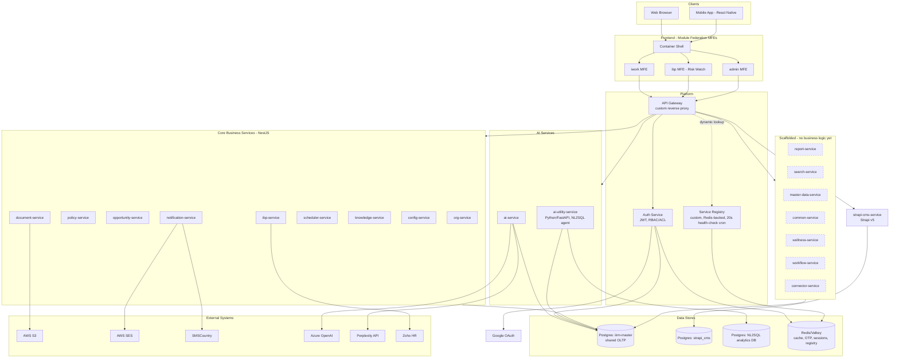
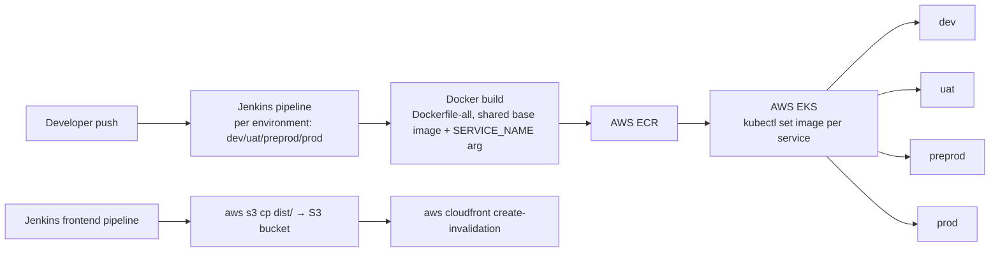

# Solution & Technical Architecture — Proposed vs As-Built Validation

## Context

Divami drafted two architecture diagrams for IIRM roughly a year before implementation began:

1. **"Proposed App Framework Architecture – High Level"** (Draft V0) — the logical/solution architecture: UI micro-frontends, BFF, API Gateway, microservices, data access, analytics/search, and an adaptor/integration layer to internal and external systems.
2. **"CIBP Platform – Complete Architecture"** — the technical/infrastructure architecture: AWS edge (Route53, WAF, CloudFront, Global Accelerator), ECS Fargate services, RDS datastores, and supporting AWS services (SNS, CloudWatch, EventBridge).

This doc validates both against what is actually implemented in this repository today, so a Tech Lead can see, component by component, whether the original architecture was followed, adapted, or dropped. Every "As-Built" cell below is grounded in a specific file — nothing here is inferred from the diagrams alone.

**Not verifiable from this repo:** actual AWS resource provisioning (VPC/subnets, security groups, ALB, WAF, CloudFront, Route53, Global Accelerator, RDS Multi-AZ settings, EventBridge). This repo contains application code, Dockerfiles, and Jenkins pipelines only — no Terraform/CloudFormation/k8s manifests. Where the Jenkins pipelines reveal real infra calls (e.g. `kubectl`, `aws cloudfront create-invalidation`), that's cited; everything else is marked **Unverifiable** rather than guessed.

## Headline deviations

- **Compute platform changed**: proposed **ECS Fargate** → actual is **AWS EKS**. `Jenkinsfile-Backend-dev:27,76,94-95` runs `aws eks update-kubeconfig --name IIRM-Dev` and `kubectl set image deployment/...` per service. No Fargate task/service definitions exist anywhere in this repo.
- **Frontend edge matches the proposal**: S3 + CloudFront is real — `Jenkinsfile-Frontend-prod:76,81` uploads `dist/apps/ui/iwork` to `s3://iwork-prod-frontend` and invalidates CloudFront distribution `E13UEBODEG72AR`.
- **Notifications changed**: proposed **SNS** → actual is **AWS SES** (email) + **SMSCountry** (SMS). `docs/SMSCOUNTRY-IMPLEMENTATION-SUMMARY.md` confirms SNS (and 2Factor) were explicitly removed in favor of SMSCountry. No SNS reference exists anywhere in the codebase.
- **BFF layer was never built.** UI micro-frontends call the API Gateway directly; no BFF project or module exists.
- **Adaptor/integration framework was never built.** `connector-service` exists as an Nx project but its service logic is an unimplemented stub — no adaptors, no "transform to unified structure" layer. Every real external integration (S3, SES, SMSCountry, Azure OpenAI, Perplexity, Google OAuth, Zoho) is wired point-to-point inside the owning service instead.
- **Analytics and Search services are scaffolds.** `report-service` and `search-service` exist (Nx-generated, default controller/module only) but carry no business logic. The closest real capability is `ai-utility-service`'s NL2SQL agent, which isn't in either diagram.
- **Data layer is 3 databases, not "Databases" generically or a single "CMS & Search DB".** Shared Postgres `iirm-master` (core services) + Strapi's own `strapi_cms` Postgres + a separate NL2SQL analytics Postgres used only by `ai-utility-service`. There is no dedicated search datastore — `search-service` has nothing to store.
- **Core platform pattern was followed closely**: API Gateway → Service Registry dynamic routing, Auth Service (JWT + RBAC/ACL), and ~12 business services in the exact Controller → Service → Handler → Data Access shape drawn in the SOW diagram.

---

## A. Solution Architecture — vs "Proposed App Framework Architecture – High Level"

| # | Component (SOW) | Proposed | As-Built | Status |
|---|---|---|---|---|
| 1 | Clients | Web + Mobile | Web (container/iwork/ibp/admin) + React Native mobile app (`apps/mobile`) | Followed |
| 2 | UI Micro-Frontends | Customer / Agent / Auction / Wellness / Administration / Customer Support portals | `container` shell (Module Federation) loading `iwork` (internal ops portal) and `ibp` (client/HR portal, "Risk Watch") + `admin` — different portal segmentation, no "Auction" concept | Deviated |
| 3 | BFF (per-portal) | Dedicated BFF between UI and API Gateway | Not found — UI calls the API Gateway directly | Not Built |
| 4 | API Gateway | Single gateway, routes to microservices | Custom NestJS reverse proxy; dynamic routing via Service Registry lookup (`apps/services/api-gateway/src/app/app.service.ts:88-146`); `@UseGuards(AuthGuard, AclGuard)` per route | Followed |
| 5 | External IDPs | Generic multi-IDP cloud | Only Google OAuth wired into `auth-service` (`app/google-oauth/*`); Zoho SSO exists but is scoped inside `ibp-service`, not the shared IDP layer | Partially Followed |
| 6 | Auth & Auth / Role Sync / Access Control microservice | Dedicated service | `auth-service`: JWT issuance, `AccessControlModule` (RBAC/ACL), session/token-version invalidation | Followed |
| 7 | Generic microservice pattern (Controller → Service → Handler → Data Access) | Repeated per domain | ~12 NestJS services (org, policy, opportunity, document, notification, scheduler, knowledge, config, ibp, ai, master-data, common) follow this exact layering | Followed |
| 8 | Dedicated Data Access microservice | Single service fronting all DB access | Not built — each service owns direct TypeORM access to the shared DB | Deviated |
| 9 | Databases (generic cluster) | Multiple DB cylinders, unspecified role | 3 real Postgres DBs: shared `iirm-master` (`service-lib/src/lib/database/typeorm.config.ts`), Strapi's own `strapi_cms`, and a separate NL2SQL DB for `ai-utility-service` | Deviated |
| 10 | Analytics & Reporting microservice | Dedicated service | `report-service` is a scaffold (no custom modules); real analytics capability is `ai-utility-service`'s NL2SQL query-generation agent, which isn't a named box in the SOW diagram | Partially Followed |
| 11 | Search on Unstructured microservice | Dedicated service | `search-service` is a scaffold — no search engine wired up | Not Built |
| 12 | Integration layer — "transformation to unified structure" + adaptors | Shared adaptor framework | `connector-service` is an unimplemented stub (`app.service.ts` returns a static message) | Not Built |
| 13 | External Adaptors → External Systems | Generic connector to unnamed systems | Real integrations, wired directly per service: AWS S3 (`document-service`), AWS SES + SMSCountry (`notification-service`), Azure OpenAI + Perplexity (`ai-service`), Google OAuth (`auth-service`), Zoho (`ibp-service`) | Deviated |
| 14 | Internal Systems: HRMS, CRM, Doc Processing (Tesseract OCR & AI), ETL Engine, Analytics Engine (Superset), Search Engine (Lucene), CMS, Data Warehouse | 8 named systems | Only **CMS** is real (`strapi-cms-service`, Strapi v5, proxied by the API Gateway). HRMS-like functionality lives inside `ibp-service` rather than as an external system. No ETL engine, Superset, Lucene, Tesseract, or data warehouse found in this repo | Mostly Not Built |

---

## B. Technical Architecture — vs "CIBP Platform – Complete Architecture"

| # | Component (SOW) | Proposed | As-Built | Status |
|---|---|---|---|---|
| 1 | Edge: Route53 → WAF → CloudFront → S3 (frontend) | Full CDN edge stack | Confirmed for the pieces the repo can see: S3 hosting + CloudFront invalidation (`Jenkinsfile-Frontend-prod:76,81`, distribution `E13UEBODEG72AR`). Route53/WAF/Global Accelerator provisioning not visible from this repo | Unverifiable (partial evidence: Followed) |
| 2 | Gateway Security Group: ALB (API Gateway) + Certificate Manager | Public-subnet ALB | Not visible from this repo (no Terraform/CFN) | Unverifiable |
| 3 | ECR Registry | Container registry | Confirmed — Jenkins pushes to ECR `241533143959.dkr.ecr.ap-south-1.amazonaws.com` per service | Followed |
| 4 | Compute: Fargate Cluster | ECS Fargate | **Deviated** — actual is **AWS EKS**. `Jenkinsfile-Backend-dev:27,76` (`EKS_CLUSTER_NAME = "IIRM-Dev"`, `aws eks update-kubeconfig`) and `kubectl set image deployment/<service> ...` per service across all 4 backend pipelines | Deviated |
| 5 | Gateway Service (Internal App Gateway) + Service Discovery | Two internal components | Matches: `api-gateway` (custom reverse proxy) + `service-registry` (custom, Redis/in-memory-backed, `@Cron` health check every `ENV.HEALTH_CHECK_DURATION \|\| 20`s) | Followed |
| 6 | Auth Service, Config Service, IBP Service, Iwork Service, Doc Processor Service, Service n | Named service boxes | Auth/Config/IBP services exist as named. "Iwork Service" is actually a frontend MFE, not a backend service. "Doc Processor Service" doesn't exist as its own service — document extraction logic lives inside `ai-service` (OCR/extraction via Azure OpenAI + Perplexity) and file handling in `document-service` | Partially Followed |
| 7 | Search Service, Analytics Service | Named service boxes | `search-service` and `report-service`(≈"Analytics Service") exist as Nx scaffolds only, no implemented logic | Not Built |
| 8 | Data Service | Single data-access service | Not built — no such service; each service talks to Postgres directly via TypeORM | Deviated |
| 9 | Adaptor Service 1..n → External Systems | Dedicated adaptor services | `connector-service` is an unimplemented stub; real external calls are embedded per-service (see Section A, row 13) | Not Built |
| 10 | Notification Service → SNS | AWS SNS | **Deviated** — SNS was explicitly removed; actual is AWS SES (email) + SMSCountry (SMS), per `docs/SMSCOUNTRY-IMPLEMENTATION-SUMMARY.md` | Deviated |
| 11 | Datastore: Application Database (RDS Multi-AZ) | Dedicated RDS instance | Matches in role — shared Postgres `iirm-master`. Multi-AZ setting itself is an RDS provisioning flag, not visible from application code | Followed (Multi-AZ: Unverifiable) |
| 12 | Datastore: CMS & Search Database (RDS Multi-AZ) + CMS & Search Storage (S3) | Paired CMS+Search datastore | Only the **CMS** half is real — Strapi's own separate Postgres `strapi_cms` (`apps/services/strapi-cms-service` database config). No search datastore exists since `search-service` was never implemented | Partially Followed |
| 13 | Caching & Event Bridge (Redis) | Cache + event bus | Redis/Valkey is real and used for caching, OTP, sessions, and service-registry storage (`service-lib/src/lib/cache/cache.service.ts`, `redis.util.ts`). No evidence of an event-bus/pub-sub pattern — services talk synchronously over HTTP via the API Gateway, not through Redis pub/sub or EventBridge | Partially Followed |
| 14 | CloudWatch (x2, compute + datastore) | Monitoring | Not visible from this repo (no logging/metrics SDK calls found tied to CloudWatch specifically) | Unverifiable |
| 15 | External IDPs | Generic multi-IDP | Same finding as Section A row 5 — Google OAuth only, centrally; Zoho scoped to `ibp-service` | Partially Followed |

---

## As-Built Diagrams

### Solution architecture (current)



### Technical / deployment architecture (current)



Dashed nodes in the solution diagram mark Nx projects that exist but carry no implemented business logic yet — flagged rather than silently omitted, since their presence in the SOW diagram made them look shipped.

---

## Module dependency graph (Nx)

For the actual import-level dependency graph across every service, lib, and UI app — auto-generated from code, always accurate, but shows code wiring rather than runtime topology — run:

```
npx nx graph
```

This opens a live, interactive graph in the browser. It isn't committed here (same reason `site/` is gitignored): it's a generated artifact that goes stale the moment a project is added, so regenerate on demand rather than trusting a checked-in export.

## Open questions for Tech Lead / Infra owner

1. Is there a separate Terraform/CloudFormation repo that provisions the VPC, ALB, WAF, Route53, Global Accelerator, and RDS settings? This repo has none, so Section B rows 1, 2, 11 (Multi-AZ), and 14 couldn't be confirmed either way.
2. Was the move from Fargate → EKS (Section B, row 4) a deliberate decision, and is it documented anywhere?
3. Is there a plan to build the adaptor/integration layer (`connector-service`) and the Search/Analytics services, or have their responsibilities been absorbed elsewhere (e.g., `ai-utility-service`'s NL2SQL agent covering analytics)?
