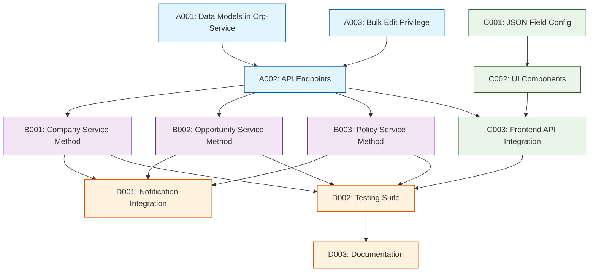

# Tasks - Phase 1

## 1. Task Overview

- **Component:** BULK-EDIT
- **Phase:** 1
- **Technical Spec:** [phase-1-technical-spec.md](./phase-1-technical-spec.md)
- **Total Estimated Effort:** 43 story points
- **Implementation Order:** 4 task groups in sequence
- **Phase 1 Scope:** Backend endpoints in document-service, entity-specific service methods, frontend JSON configuration, and UI components for bulk editing interface

## 2. Task Categories

### Category A: Backend Foundation

Core backend infrastructure, data models, and API endpoints in document-service

### Category B: Entity-Specific Implementation

Individual entity bulk update methods with validation in respective service files

### Category C: Frontend Configuration & UI

JSON configuration system and UI components for bulk edit interface

### Category D: Integration & Documentation

Notification integration, testing, and documentation

## 3. Detailed Task Breakdown

### 📋 Backend Foundation

#### TASK-A001: Set up core data models and DTOs in document-service

- **Summary:** BULK-EDIT - Core Data Models and Request/Response DTOs in Document-Service
- **Issue Type:** Story
- **Epic Link:** BULK-EDIT Epic
- **Story Points:** 3
- **Priority:** High
- **Labels:** data-model, foundation, bulk-edit, document-service
- **Components:** DOCUMENT-SERVICE
- **Description:**

  Create TypeScript interfaces and DTOs for bulk edit requests, responses, and error handling in the existing document-service.

- **Technical Requirements:**

  - Implement BulkEditRequest, BulkEditResult, FieldUpdate interfaces from tech spec
  - Create DTOs with class-validator decorators for input validation
  - Implement BulkEditError and BulkEditErrorCode enum
  - Add validation rules for entity types and field operations

- **Acceptance Criteria:**

  - ✅ All data models implemented with correct TypeScript types in document-service
  - ✅ DTOs include comprehensive validation decorators
  - ✅ Error handling models support all required error scenarios
  - ✅ Entity type validation enforces 'company', 'opportunity', 'policy' only
  - ✅ Unit tests pass for all data model validation rules

- **Dependencies:** None

- **Jira Sub-tasks:**

  - Define core interface models in document-service
  - Implement request/response DTOs with validation
  - Create error handling types and enums
  - Write unit tests for data models

#### TASK-A002: Implement bulk edit API endpoints in document-service

- **Summary:** BULK-EDIT - REST API Endpoints in Document-Service
- **Issue Type:** Story
- **Epic Link:** BULK-EDIT Epic
- **Story Points:** 5
- **Priority:** High
- **Labels:** api, controller, bulk-edit, document-service
- **Components:** DOCUMENT-SERVICE
- **Description:**

  Build the REST API endpoints for bulk edit validation and execution in document-service with proper ACL guards.

- **Technical Requirements:**

  - Implement POST /document-service/bulk-edit/validate endpoint
  - Implement POST /document-service/bulk-edit/execute endpoint
  - Add "Bulk Edit" ACL guard to controller methods
  - Implement comprehensive input validation using class-validator
  - Route requests to appropriate entity service methods (org-service, opportunity-service, policy-service)

- **Acceptance Criteria:**

  - ✅ Validation endpoint returns detailed validation results
  - ✅ Execute endpoint routes to entity-specific service methods
  - ✅ ACL guard enforces "Bulk Edit" privilege on both endpoints
  - ✅ Input validation prevents malformed requests
  - ✅ Error responses follow technical specification format
  - ✅ Integration tests pass for both endpoints

- **Dependencies:** TASK-A001

- **Jira Sub-tasks:**

  - Implement bulk edit controller with ACL guards
  - Add validation endpoint logic
  - Add execute endpoint with routing to service methods
  - Implement comprehensive input validation
  - Write integration tests

#### TASK-A003: Create "Bulk Edit" privilege in database

- **Summary:** BULK-EDIT - Database Privilege Configuration
- **Issue Type:** Task
- **Epic Link:** BULK-EDIT Epic
- **Story Points:** 1
- **Priority:** High
- **Labels:** database, privilege, bulk-edit
- **Components:** DATABASE
- **Description:**

  Create the "Bulk Edit" privilege in the database for RBAC system integration.

- **Technical Requirements:**

  - Add "Bulk Edit" privilege to the privileges/permissions table
  - Configure privilege mapping for role-based access
  - Verify ACL system recognizes the new privilege

- **Acceptance Criteria:**

  - ✅ "Bulk Edit" privilege exists in database
  - ✅ Privilege can be assigned to user roles
  - ✅ ACL guards correctly validate the privilege
  - ✅ Documentation updated with privilege configuration

- **Dependencies:** None (database change)

- **Jira Sub-tasks:**

  - Create database migration for "Bulk Edit" privilege
  - Verify privilege integration with ACL system
  - Document privilege configuration

### 🔧 Entity-Specific Implementation

#### TASK-B001: Implement Company bulk update with validation in company.service.ts

- **Summary:** BULK-EDIT - Company Entity Bulk Update Method in Org-Service
- **Issue Type:** Story
- **Epic Link:** BULK-EDIT Epic
- **Story Points:** 5
- **Priority:** High
- **Labels:** company, validation, bulk-edit, org-service
- **Components:** ORG-SERVICE
- **Description:**

  Implement bulk update method for Company entities in org-service company.service.ts with comprehensive validation and single transaction processing.

- **Technical Requirements:**

  - Add bulkUpdateCompanies method to company.service.ts
  - Implement Company-specific field validation (lead_crm, account_manager, status, priority)
  - Add business rule validation for status transitions
  - Process all updates in single transaction with error handling
  - Integrate with existing audit logging mechanism

- **Acceptance Criteria:**

  - ✅ bulkUpdateCompanies method processes dozens to hundreds of records
  - ✅ Field validation enforces Company entity constraints
  - ✅ Status transition validation follows business rules
  - ✅ Single transaction processing with rollback on failure
  - ✅ Partial failures captured with detailed error information
  - ✅ Transaction performance meets <5 second requirement
  - ✅ Unit tests cover all validation and processing scenarios

- **Dependencies:** TASK-A001, TASK-A002

- **Jira Sub-tasks:**

  - Implement bulkUpdateCompanies method in company.service.ts
  - Add Company field validation logic
  - Implement business rule validation
  - Add single transaction processing with error handling
  - Write comprehensive unit tests

#### TASK-B002: Implement Opportunity bulk update with validation in opportunity.service.ts

- **Summary:** BULK-EDIT - Opportunity Entity Bulk Update Method
- **Issue Type:** Story
- **Epic Link:** BULK-EDIT Epic
- **Story Points:** 5
- **Priority:** High
- **Labels:** opportunity, validation, bulk-edit, opportunity-service
- **Components:** OPPORTUNITY-SERVICE
- **Description:**

  Implement bulk update method for Opportunity entities in opportunity.service.ts with comprehensive validation and single transaction processing.

- **Technical Requirements:**

  - Add bulkUpdateOpportunities method to opportunity.service.ts
  - Implement Opportunity-specific field validation (bd_owner, isg_owner, status, expiry_date)
  - Add business rule validation for opportunity lifecycle
  - Process all updates in single transaction with error handling
  - Integrate with existing audit logging mechanism

- **Acceptance Criteria:**

  - ✅ bulkUpdateOpportunities method processes dozens to hundreds of records
  - ✅ Field validation enforces Opportunity entity constraints
  - ✅ Opportunity lifecycle validation follows business rules
  - ✅ Date field validation handles expiry_date constraints
  - ✅ Single transaction processing with rollback on failure
  - ✅ Partial failures captured with detailed error information
  - ✅ Transaction performance meets <5 second requirement
  - ✅ Unit tests cover all validation and processing scenarios

- **Dependencies:** TASK-A001

- **Jira Sub-tasks:**

  - Implement bulkUpdateOpportunities method in opportunity.service.ts
  - Add Opportunity field validation logic
  - Implement business rule and lifecycle validation
  - Add single transaction processing with error handling
  - Write comprehensive unit tests

#### TASK-B003: Implement Policy bulk update with validation in policy.service.ts

- **Summary:** BULK-EDIT - Policy Entity Bulk Update Method
- **Issue Type:** Story
- **Epic Link:** BULK-EDIT Epic
- **Story Points:** 5
- **Priority:** High
- **Labels:** policy, validation, bulk-edit, policy-service
- **Components:** POLICY-SERVICE
- **Description:**

  Implement bulk update method for Policy entities in policy.service.ts with comprehensive validation and single transaction processing.

- **Technical Requirements:**

  - Add bulkUpdatePolicies method to policy.service.ts
  - Implement Policy-specific field validation (lead_crm, isg_owner, account_manager, status)
  - Add business rule validation for policy data consistency
  - Process all updates in single transaction with error handling
  - Integrate with existing audit logging mechanism

- **Acceptance Criteria:**

  - ✅ bulkUpdatePolicies method processes dozens to hundreds of records
  - ✅ Field validation enforces Policy entity constraints
  - ✅ Policy status validation follows business rules
  - ✅ Data consistency validation prevents orphaned references
  - ✅ Single transaction processing with rollback on failure
  - ✅ Partial failures captured with detailed error information
  - ✅ Transaction performance meets <5 second requirement
  - ✅ Unit tests cover all validation and processing scenarios

- **Dependencies:** TASK-A001

- **Jira Sub-tasks:**

  - Implement bulkUpdatePolicies method in policy.service.ts
  - Add Policy field validation logic
  - Implement business rule validation
  - Add single transaction processing with error handling
  - Write comprehensive unit tests

### 🔗 Frontend Configuration & UI

#### TASK-C001: Create JSON configuration for bulk editable fields

- **Summary:** BULK-EDIT - Frontend JSON Field Configuration System
- **Issue Type:** Story
- **Epic Link:** BULK-EDIT Epic
- **Story Points:** 3
- **Priority:** Medium
- **Labels:** frontend, configuration, json, bulk-edit
- **Components:** FRONTEND-UI
- **Description:**

  Create JSON configuration files in the frontend UI to specify bulk editable fields per entity type and field validation rules.

- **Technical Requirements:**

  - Create JSON config for Company fields (lead_crm, account_manager, status, priority)
  - Create JSON config for Opportunity fields (bd_owner, isg_owner, status, expiry_date)
  - Create JSON config for Policy fields (lead_crm, isg_owner, account_manager, status)
  - Include field types, validation rules, and dropdown options in config
  - Implement config loading service in frontend

- **Acceptance Criteria:**

  - ✅ JSON configuration files define all bulk editable fields per entity
  - ✅ Field configurations include data types and validation constraints
  - ✅ Configuration supports dropdown options and field dependencies
  - ✅ Frontend service loads configuration correctly
  - ✅ Configuration is easily maintainable and extensible
  - ✅ Unit tests verify configuration loading and validation

- **Dependencies:** None (frontend implementation)

- **Jira Sub-tasks:**

  - Create entity field configuration JSON files
  - Implement configuration loading service
  - Add field validation rule definitions
  - Create configuration management utilities
  - Write configuration tests

#### TASK-C002: Implement bulk edit UI components

- **Summary:** BULK-EDIT - Frontend UI Components for Bulk Edit Interface
- **Issue Type:** Story
- **Epic Link:** BULK-EDIT Epic
- **Story Points:** 8
- **Priority:** High
- **Labels:** frontend, ui-components, bulk-edit
- **Components:** FRONTEND-UI
- **Description:**

  Build comprehensive UI components for bulk edit functionality including multi-select checkboxes, bulk edit panel, and confirmation screens.

- **Technical Requirements:**

  - Implement multi-select checkboxes on listing screens (visible only to users with bulk edit privileges)
  - Create bulk edit panel with entity-specific form fields based on JSON configuration
  - Add confirmation dialog showing summary of changes to be applied
  - Implement validation and error display panels
  - Add progress indicators and success/failure result displays

- **Acceptance Criteria:**

  - ✅ Multi-select checkboxes appear only for users with "Bulk Edit" privilege
  - ✅ Bulk edit panel displays appropriate fields per entity type from JSON config
  - ✅ Selection persists across pagination on listing screens
  - ✅ Confirmation dialog shows clear summary of pending changes
  - ✅ Validation errors are displayed with actionable feedback
  - ✅ Success/failure results show detailed operation summary
  - ✅ UI components are responsive and accessible

- **Dependencies:** TASK-C001 (JSON configuration)

- **Jira Sub-tasks:**

  - Implement multi-select checkbox functionality
  - Create bulk edit form panel with dynamic field loading
  - Add confirmation dialog component
  - Implement validation and error display components
  - Create progress and result display components
  - Write UI component tests

#### TASK-C003: Integrate frontend with backend bulk edit APIs

- **Summary:** BULK-EDIT - Frontend API Integration with Document-Service
- **Issue Type:** Story
- **Epic Link:** BULK-EDIT Epic
- **Story Points:** 5
- **Priority:** High
- **Labels:** frontend, api-integration, bulk-edit
- **Components:** FRONTEND-UI
- **Description:**

  Integrate frontend bulk edit components with document-service bulk edit endpoints for validation and execution.

- **Technical Requirements:**

  - Implement API service calls to POST /document-service/bulk-edit/validate
  - Implement API service calls to POST /document-service/bulk-edit/execute
  - Add proper error handling and user feedback for API responses
  - Implement retry logic for transient failures
  - Add loading states and progress indicators during API calls

- **Acceptance Criteria:**

  - ✅ Frontend successfully calls validate endpoint before execution
  - ✅ Frontend successfully executes bulk operations via execute endpoint
  - ✅ API errors are properly handled and displayed to users
  - ✅ Loading states provide clear feedback during operations
  - ✅ Retry logic handles transient network failures
  - ✅ Integration tests verify frontend-backend communication

- **Dependencies:** TASK-A002 (API endpoints), TASK-C002 (UI components)

- **Jira Sub-tasks:**

  - Implement API service for bulk edit endpoints
  - Add error handling and user feedback
  - Implement loading states and progress indicators
  - Add retry logic for failed requests
  - Write API integration tests

### ✨ Integration & Documentation

#### TASK-D001: Implement notification integration for ownership changes

- **Summary:** BULK-EDIT - Notification Service Integration for Ownership Changes
- **Issue Type:** Story
- **Epic Link:** BULK-EDIT Epic
- **Story Points:** 3
- **Priority:** Medium
- **Labels:** integration, notification, bulk-edit
- **Components:** ORG-SERVICE, OPPORTUNITY-SERVICE, POLICY-SERVICE
- **Description:**

  Implement integration with Notification Service for sending ownership change notifications according to business rules in respective entity service methods.

- **Technical Requirements:**

  - Integrate with Notification Service using existing templates
  - Implement business rules for ownership change notifications per FR-008
  - Add notification logic to entity service methods (company.service.ts, opportunity.service.ts, policy.service.ts)
  - Handle notification failures gracefully without affecting bulk operations

- **Acceptance Criteria:**

  - ✅ Ownership change notifications sent according to business rules
  - ✅ Notification templates work correctly for bulk operations
  - ✅ Notifications include relevant context (old owner, new owner, performing user)
  - ✅ Notification failures don't block bulk edit operations
  - ✅ Integration tests verify notification functionality
  - ✅ Structured logging captures notification events

- **Dependencies:** TASK-B001, TASK-B002, TASK-B003 (entity service methods)

- **Jira Sub-tasks:**

  - Implement Notification Service integration
  - Add ownership change notification logic
  - Implement error handling for notification failures
  - Write notification integration tests

#### TASK-D002: Create comprehensive testing suite

- **Summary:** BULK-EDIT - Complete Testing Suite and Quality Assurance
- **Issue Type:** Story
- **Epic Link:** BULK-EDIT Epic
- **Story Points:** 8
- **Priority:** High
- **Labels:** testing, quality, bulk-edit
- **Components:** DOCUMENT-SERVICE, ORG-SERVICE, OPPORTUNITY-SERVICE, POLICY-SERVICE, FRONTEND-UI
- **Description:**

  Build comprehensive testing suite including unit tests, integration tests, and end-to-end tests for the complete bulk edit functionality.

- **Technical Requirements:**

  - Achieve 85% code coverage target for all bulk edit components
  - Implement unit tests for entity service methods and validation logic
  - Add integration tests for API endpoints and service interactions
  - Create end-to-end tests for complete bulk edit workflows
  - Add performance testing for processing hundreds of records

- **Acceptance Criteria:**

  - ✅ Unit test coverage meets 85% target across all components
  - ✅ Integration tests validate API endpoints and service communication
  - ✅ End-to-end tests verify complete bulk edit workflows
  - ✅ Performance tests verify processing time requirements (<5 seconds)
  - ✅ Test data includes realistic Company, Opportunity, Policy records
  - ✅ Error scenario testing covers all failure modes
  - ✅ All tests run successfully in CI/CD pipeline

- **Dependencies:** TASK-B001, TASK-B002, TASK-B003, TASK-C002, TASK-C003

- **Jira Sub-tasks:**

  - Write comprehensive unit tests for service methods
  - Implement API endpoint integration tests
  - Create end-to-end test scenarios
  - Add performance and load tests
  - Set up CI/CD test automation

#### TASK-D003: Create technical documentation and deployment guide

- **Summary:** BULK-EDIT - Technical Documentation and Deployment Guide
- **Issue Type:** Story
- **Epic Link:** BULK-EDIT Epic
- **Story Points:** 3
- **Priority:** Medium
- **Labels:** documentation, deployment, bulk-edit
- **Components:** DOCUMENTATION
- **Description:**

  Create comprehensive technical documentation covering API usage, configuration management, and deployment procedures for bulk edit functionality.

- **Technical Requirements:**

  - Write API documentation with request/response examples
  - Document JSON configuration structure and management
  - Create operational guides for bulk edit privilege management
  - Build troubleshooting guide for common issues
  - Document frontend integration patterns

- **Acceptance Criteria:**

  - ✅ API documentation provides clear integration guidance with examples
  - ✅ Configuration documentation explains JSON structure and field definitions
  - ✅ Operational guide covers privilege management and user setup
  - ✅ Troubleshooting guide addresses common configuration and usage issues
  - ✅ Frontend integration documentation enables UI team development
  - ✅ Documentation includes security considerations and best practices

- **Dependencies:** TASK-D002 (complete implementation)

- **Jira Sub-tasks:**

  - Write comprehensive API documentation
  - Document JSON configuration management
  - Create operational and troubleshooting guides
  - Build frontend integration documentation
  - Conduct knowledge transfer sessions

## 4. Task Dependencies & Sequencing

## 5. Parallel Development Opportunities

### What Can Be Built Simultaneously:

- **After A001:** A002 and A003 can start in parallel
- **After A002:** B001, B002, and B003 can be developed in parallel by different teams
- **Independent Frontend Track:** C001 and C002 can start immediately (no backend dependencies)
- **After B001/B002/B003:** D001 notification integration can begin
- **After C003:** Frontend and backend integration testing can proceed

### Critical Path:

A001 → A002 → B001/B002/B003 → D002 → D003

### Team Coordination:

- **Document-Service Team:** Focus on A001, A002, A003 (coordination layer)
- **Entity Service Teams:** B001 (org-service), B002 (opportunity-service), B003 (policy-service)
- **Frontend Team:** Can start with C001, C002 immediately, then C003 after A002
- **Integration Team:** D001, D002, D003

## 6. Risk Mitigation Tasks

### Technical Risks:

- **Single Transaction Risk:** Performance testing in TASK-D002 validates transaction processing time
- **Multi-Service Coordination:** Entity-specific implementations in separate services (B001, B002, B003) isolated to reduce complexity
- **Permission Integration:** Simple ACL guard approach in TASK-A002 leverages existing infrastructure
- **Frontend-Backend Coordination:** JSON configuration in TASK-C001 provides clear contract between teams

### Implementation Risks:

- **Service Method Complexity:** Validation is embedded within entity service methods to ensure consistency
- **Frontend Configuration:** JSON-based approach in UI allows easy maintenance without backend changes
- **Cross-Team Dependencies:** Frontend track (C001, C002) can start independently of backend development

## 7. Definition of Done

### Task Completion Criteria:

- ✅ All acceptance criteria met with checkboxes verified
- ✅ Unit tests written and passing (85% coverage target)
- ✅ Code review completed and approved
- ✅ Integration tests passing (where applicable)
- ✅ Documentation updated and reviewed

### Component Completion Criteria:

- ✅ All functional requirements FR-001 through FR-010 implemented
- ✅ Performance requirements met (<5 seconds for hundreds of records)
- ✅ Security requirements satisfied (RBAC integration)
- ✅ Integration with all dependent services verified
- ✅ Frontend configuration files ready for UI team
- ✅ Ready for production deployment

## 8. Estimation Summary

| Category                       | Task Count | Total Effort  | Duration (days) |
| ------------------------------ | ---------- | ------------- | --------------- |
| Backend Foundation             | 3          | 9 points      | 4-5 days        |
| Entity-Specific Implementation | 3          | 15 points     | 7-8 days        |
| Frontend Configuration & UI    | 3          | 16 points     | 8-10 days       |
| Integration & Documentation    | 3          | 14 points     | 6-7 days        |
| **TOTAL**                      | **12**     | **54 points** | **25-30 days**  |

_Note: Frontend and backend tracks can run in parallel, reducing overall timeline_

## 9. Traceability Matrix

| Task ID | Technical Spec Section | Functional Requirements | Business Value                    |
| ------- | ---------------------- | ----------------------- | --------------------------------- |
| A001    | Section 3.2, 4.3       | FR-006, FR-009          | Data models & validation          |
| A002    | Section 3.1, 6.1       | FR-006, FR-007          | API endpoints in document-service |
| A003    | Section 8.1, 8.2       | FR-001                  | Database privilege setup          |
| B001    | Section 4.3, 6.1       | FR-002                  | Company bulk updates              |
| B002    | Section 4.3, 6.1       | FR-003                  | Opportunity bulk updates          |
| B003    | Section 4.3, 6.1       | FR-004                  | Policy bulk updates               |
| C001    | Section 4.2            | FR-002, FR-003, FR-004  | Frontend field configuration      |
| C002    | Section 4.2, UI        | FR-001, FR-005          | Bulk edit UI components           |
| C003    | Section 3.1, 3.2       | FR-006, FR-007          | Frontend-backend integration      |
| D001    | Section 6.2, 9.1       | FR-008                  | Notification integration          |
| D002    | Section 10.1, 10.2     | Quality assurance       | System reliability                |
| D003    | Section 4.2, 11.0      | Documentation           | Developer experience              |

## 10. Implementation Notes

### Development Best Practices:

- Follow test-driven development (TDD) approach
- Use TypeScript strict mode for type safety
- Implement feature flags for gradual rollout of bulk edit functionality
- Regular code reviews after each task completion
- Single transaction processing - no complex batch architecture needed

### Quality Gates:

- Automated testing pipeline must pass
- Code coverage minimum 85% for entity service methods
- Security scan must pass with no high-severity issues
- Performance benchmarks must meet <5 second requirement for hundreds of records
- Integration tests for API endpoints and frontend integration must pass

### Architecture Decisions:

- **Document-Service as Coordinator:** Bulk edit endpoints implemented in existing document-service as coordination layer
- **Direct Service Calls:** Entity updates via direct service method calls to org-service, opportunity-service, and policy-service, not microservice endpoints
- **ACL Integration:** Simple ACL guard attachment leverages existing infrastructure
- **JSON Configuration:** Frontend-managed field configuration enables easy maintenance
- **Embedded Validation:** Validation logic embedded in entity service methods for consistency

### Team Coordination:

- **Backend Team:** Focus on org-service endpoints and entity service methods
- **Frontend Team:** Can start with JSON configuration and UI components independently
- **Database Team:** Handle "Bulk Edit" privilege creation as data change
- **Testing Team:** Coordinate end-to-end testing across frontend and backend components

### Performance Considerations:

- Single transaction design for dozens to hundreds of records
- Maximum processing time target: 5 seconds
- Efficient SQL operations leveraging existing indexes
- Memory-efficient processing without complex batch logic
- Frontend caching of JSON configuration for improved UX
