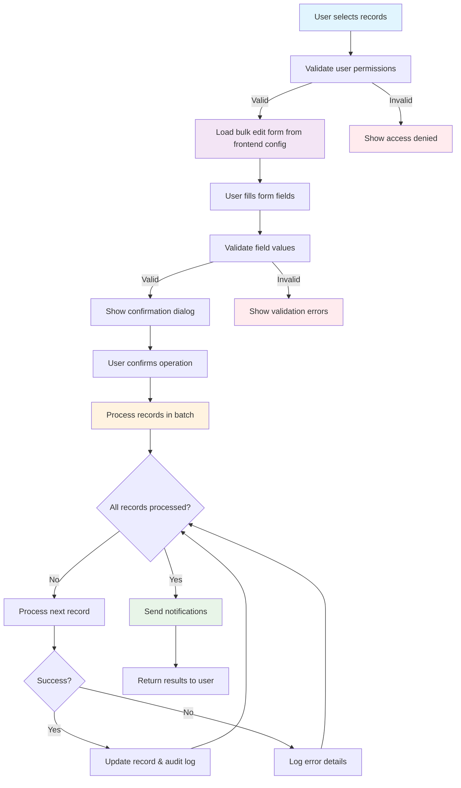

# TRD - Phase 1

## 1. Component Overview

- **Purpose:** Enable authorized users to efficiently edit multiple records (Companies, Opportunities, Policies) simultaneously through a unified bulk edit interface
- **Scope:** Complete bulk edit functionality for three core entities with field-specific editing capabilities, validation, and error handling
- **Phase 1 Scope:** Backend endpoints in document-service, entity-specific service methods, frontend JSON configuration, and UI components for bulk editing interface
- **Dependencies:** Document Service (host service), Opportunity Service, Policy Service, Auth Service (RBAC), Notification Service
- **Dependents:** Frontend listing components with multi-select, bulk edit panels, audit logging system, notification system

## 2. Functional Requirements

List of functional requirements this component must fulfill:

- **FR-001:** Display multi-select checkboxes only to users with bulk edit privileges on listing screens
- **FR-002:** Support bulk editing of specific fields for Company entities (lead_crm, account_manager, status, priority)
- **FR-003:** Support bulk editing of specific fields for Opportunity entities (bd_owner, isg_owner, status, expiry_date)
- **FR-004:** Support bulk editing of specific fields for Policy entities (lead_crm, isg_owner, account_manager, status)
- **FR-005:** Enable record selection across filtered results with pagination persistence
- **FR-006:** Provide bulk edit form with entity-specific field validation
- **FR-007:** Process bulk updates in single transaction batches
- **FR-008:** Send notifications for ownership changes according to business rules
- **FR-009:** Handle partial failures with detailed error reporting
- **FR-010:** Integrate with existing audit logging mechanism

## 3. Component Interface

### 3.1 Public API

Define the external interface this component exposes:

```typescript
// Bulk Edit API Interface (implemented in document-service)
interface BulkEditAPI {
  // Validate bulk edit request
  validateBulkEdit(request: BulkEditRequest): Promise<ValidationResult>;

  // Execute bulk edit operation
  executeBulkEdit(request: BulkEditRequest): Promise<BulkEditResult>;
}

// REST Endpoints (in document-service)
// POST /document-service/bulk-edit/validate - Validate bulk edit request
// POST /document-service/bulk-edit/execute - Execute bulk edit operation
```

### 3.2 Input/Output Contracts

- **Inputs:** Entity type, record IDs, field updates, user context
- **Outputs:** Operation results, validation errors, progress status
- **Data Formats:** JSON for all API communications

````typescript
// Input Data Structures
interface BulkEditRequest {
  entityType: 'company' | 'opportunity' | 'policy';
  recordIds: number[];
  fieldUpdates: FieldUpdate[];
  userId: number;
}

interface FieldUpdate {
  fieldName: string;
  newValue: any;
  operation: 'set' | 'clear';
}

```typescript
// Output Data Structures
interface BulkEditResult {
  totalRecords: number;
  successCount: number;
  failureCount: number;
  errors: BulkEditError[];
  affectedRecords: number[];
}

interface BulkEditError {
  recordId: number;
  fieldName: string;
  errorCode: string;
  errorMessage: string;
}
````

````

### 3.3 Error Handling
- **Error Types:** Validation errors, permission errors, database errors, network errors
- **Error Responses:** Structured error objects with specific error codes and user-friendly messages
- **Recovery Strategies:** Retry mechanisms for transient failures, partial success handling

```typescript
enum BulkEditErrorCode {
  PERMISSION_DENIED = 'PERMISSION_DENIED',
  INVALID_FIELD_VALUE = 'INVALID_FIELD_VALUE',
  RECORD_NOT_FOUND = 'RECORD_NOT_FOUND',
  CONCURRENT_MODIFICATION = 'CONCURRENT_MODIFICATION',
  VALIDATION_FAILED = 'VALIDATION_FAILED',
  DATABASE_ERROR = 'DATABASE_ERROR'
}
````

## 4. Data Model

### 4.1 Data Storage

- **Storage Type:** Uses existing PostgreSQL database tables for Company, Opportunity, and Policy entities
- **Data Schema:** No additional tables required - bulk edit operations are tracked through existing audit logging mechanism

### 4.2 Frontend Configuration

- **Field Configuration:** Bulk editable fields for each entity type are maintained in JSON configuration files in the frontend UI
- **Entity Field Mapping:**
  - Company: `lead_crm`, `account_manager`, `status`, `priority`
  - Opportunity: `bd_owner`, `isg_owner`, `status`, `expiry_date`
  - Policy: `lead_crm`, `isg_owner`, `account_manager`, `status`
- **Implementation:** Frontend JSON configuration files control which fields are displayed in bulk edit forms per entity type

### 4.2 Data Flow



### 4.3 Data Validation

- **Input Validation:** Field type validation, required field checks, data format validation
- **Business Rules:** Entity-specific validation rules, user permission checks, data consistency rules
- **Data Integrity:** Foreign key constraints, referential integrity, concurrent modification detection
- **Audit Integration:** All bulk edit operations automatically logged through existing audit logging mechanism with user context, timestamp, and field changes

## 5. Technology Stack

### 5.1 Core Technologies

- **Programming Language:** TypeScript/Node.js
- **Framework:** NestJS (following existing architecture)
- **Database:** PostgreSQL
- **Additional Libraries:** TypeORM, class-validator, class-transformer

### 5.2 Technology Rationale

- **Why These Choices:** Consistent with existing microservices architecture, TypeScript provides type safety, NestJS offers dependency injection and modular structure
- **Alternatives Considered:** Direct database operations (rejected for complexity), external bulk processing service (rejected for latency)
- **Trade-offs:** Single service approach provides consistency but may create bottleneck for very large operations

## 6. Integration Design

### 6.1 Dependency Integration

For each component this depends on:

- **DOCUMENT-SERVICE:** Hosts bulk edit endpoints, validates requests, coordinates operations with entity services
- **ORG-SERVICE:** Implements Company entity bulk updates with company-specific business rules via bulkUpdateCompanies method
- **OPPORTUNITY-SERVICE:** Implements Opportunity entity bulk updates via bulkUpdateOpportunities method, manages opportunity lifecycle
- **POLICY-SERVICE:** Implements Policy entity bulk updates via bulkUpdatePolicies method, ensures policy data consistency
- **AUTH-SERVICE:** Validates user permissions and bulk edit privileges using existing RBAC system via ACL guards
- **NOTIFICATION-SERVICE:** Sends notifications for ownership changes using existing notification templates

### 6.2 Service Integration

For external services or systems:

- **Audit Service:** Integrates with existing audit logging mechanism for comprehensive tracking
- **User Management:** Leverages existing user hierarchy for manager notifications
- **Email Service:** Uses existing email templates for notification delivery
- **Direct Service Calls:** Entity updates are performed through direct service method calls to org-service, opportunity-service, and policy-service rather than microservice endpoints

## 7. Performance Considerations

### 7.1 Performance Requirements

- **Response Time:** Form loading < 500ms, validation < 200ms
- **Throughput:** Support up to 1000 records per bulk operation
- **Scalability:** Handle concurrent bulk operations from multiple users

### 7.2 Performance Strategies

- **Caching:** Cache user permissions for 5 minutes, leverage frontend JSON configuration for field definitions
- **Database Optimization:** Use batch SQL operations, leverage existing entity table indexes
- **Resource Management:** Process records in configurable batch sizes (default 50), implement memory-efficient streaming

## 8. Security Design

### 8.1 Security Requirements

- **Authentication:** Users must be authenticated through existing JWT system
- **Authorization:** Bulk edit privileges validated using existing RBAC system
- **Data Protection:** Sensitive field values encrypted in transit and at rest

### 8.2 Security Implementation

- **Encryption:** Use existing TLS encryption for API communications
- **Input Sanitization:** Validate and sanitize all user inputs using class-validator
- **Audit Logging:** Every bulk edit operation logged with user context and timestamp

## 9. Monitoring & Observability

### 9.1 Logging

- **Log Levels:** INFO for successful operations, WARN for validation failures, ERROR for system failures
- **Log Format:** Structured JSON logs with user ID, entity type, affected records, integrated with existing audit system
- **Sensitive Data:** Never log actual field values, only field names and record counts
- **Audit Integration:** All bulk edit operations automatically captured by existing audit logging mechanism

### 9.2 Metrics

- **Performance Metrics:** Operation duration, records processed per minute, error rates by entity type
- **Business Metrics:** Daily bulk edit operations, most frequently edited fields, user adoption rates
- **Alerting:** Alert on bulk operation failures > 10%, processing time > 5 minutes

## 10. Testing Strategy

### 10.1 Unit Testing

- **Test Coverage:** Target 85% code coverage for bulk edit components
- **Key Test Cases:** Field validation, permission checks, batch processing logic, error handling
- **Mock Dependencies:** Mock external services (notification, audit) for isolated testing

### 10.2 Integration Testing

- **Integration Points:** Test with actual database, auth service, notification service
- **Test Data:** Create test datasets with 100+ records for performance validation
- **Environment Requirements:** Dedicated test database with sample company, opportunity, policy data
