# Auto-Create Renewal Opportunities — Module PRD

**Module:** RENEWGEN · Auto-Create Renewal Opportunities
**Product:** iWork — IIRM Insurance CRM
**Stage:** 40a · Product Requirements
**Mode:** Reverse-engineered from production code
**Last updated:** 2026-07-27
**Author:** Daksh · Nithin Sirigiri

---

## 1. Why This Module Exists

Every policy in iWork has an expiry date, but nothing in the day-to-day UI forces the Renewal/ISG team to notice a policy entering its renewal window unless someone remembers to look. This module is the nightly scheduler job that does that looking, automatically. `handlePoliciesCloseToExpiry` (`scheduler_key = HANDLE_POLICIES_CLOSE_TO_EXPIRY`) scans policies coming up for renewal within the next year and, for every SBU that has opted in, creates the Renewal Opportunity the Renewal/ISG team would otherwise have to remember to create by hand — valued with the policy's actual premium plus any endorsements already booked against it. This job is currently switched **off** in production pending business and CTO sign-off — this document exists to give that sign-off something precise to review. It has a sibling job, **Auto-Close Expired Opportunities** (covered in its own PRD, `Auto-Close-Expired-Opportunities-PRD.md`), which runs the same night looking the other direction — from expired opportunities toward closure rather than from policies toward renewal — and shares this job's scheduling architecture but is otherwise independent; it is not covered here except where the two share infrastructure. By the end of this document, the reader will know exactly which policies this job touches, what it creates and how the new record is valued, the SBU/policy-type controls that scope it, and a scheduling-architecture finding that changes what "disabling this job" actually means operationally.

---

## 2. Scope

### In scope

- The `handlePoliciesCloseToExpiry` scheduler method (`scheduler_key = HANDLE_POLICIES_CLOSE_TO_EXPIRY`), and the full eligibility/batching/creation logic in the delegated `ro-creation.utils.ts` `handlePoliciesCloseToExpiry` function it calls.
- SBU enablement (`org_sbu.is_ro_generation_enabled`), per-SBU policy-type suppression, and the cross-pod concurrency claim mechanism.
- The premium calculation performed at RO creation time (policy gross premium plus summed endorsements).
- The dual-trigger scheduling architecture (`@Cron` decorator vs. `DynamicCronService`) as it applies specifically to this job's `scheduler_key`.

### Out of scope (deferred)

- **Auto-Close Expired Opportunities** (`scheduler_key = HANDLE_EXPIRED_OPPORTUNITIES`) — this job's sibling; covered in its own PRD, `Auto-Close-Expired-Opportunities-PRD.md`.
- The endorsement-triggered RO premium *update* in `enrollment-upload.scheduler.ts` (`updateEndorsementSummaryAfterEnrollment`) — a separate mechanism that patches `premiumPaid` on an *already-existing* RO after a later endorsement is booked; distinct from the creation-time premium calculation this job performs.
- The manual `POST /opportunity/regenerate-renewal-opportunity` endpoint and its `regenerateRenewalOpportunity` service method — a separate, manually-triggered entry point that calls into the same underlying utility function, currently structurally inconsistent with that utility's actual signature (see Open Questions).
- The Application Scheduler / Scheduler Management admin screen and its `cron-configurations` API — an existing, separately built system; referenced here only as the operational control surface this job is (partially) subject to.
- The other four scheduler methods in the same file — `handleExpiredOpportunities`, `handleOpportunityActivitiesCloseToExpiry`, `handleOpportunitiesCloseToExpiry`, `generatePerformanceOutputForAllUsers`, `refreshCompanyAnalytics` — adjacent jobs sharing the same file (and, for two of them, the same dual-trigger risk), but not otherwise designed here.
- The generic `createOpportunity` / `createStageActivityMap` creation pipeline itself — shared infrastructure, not redesigned here.
- The Application Scheduler admin screen's own permission model — noted as a gap in Open Questions, not designed here.

---

## 3. User Personas

| Persona | Role in this module |
|---|---|
| Renewal / ISG team | Owns and works the Renewal Opportunities this job auto-creates |
| System (the scheduler itself) | The actual actor executing this job nightly — no human triggers a run under normal operation |
| CTO / CIO / Admin | Configures `org_sbu.is_ro_generation_enabled` and per-SBU policy-type suppression; decides, via ENV feature flag, whether this job runs in a given environment at all |
| Central OPS / Admin (Application Scheduler screen) | Operates the visible admin toggle for this job, believing it fully controls execution — per Section 5.3, that belief is only partially correct |

---

## 4. User Stories

Each story traces to a specific behavior observed in the codebase — there is no BRD for this module; traceability is to the Business Rules and citations in Section 5, not to a UC/FR pair.

### 4.1 Nightly Scan, Eligibility & Creation

**US-RENEWGEN-001**
As the System, I want to nightly scan policies expiring within the next year and create a Renewal Opportunity for each eligible one, so that the Renewal/ISG team has a pipeline of upcoming renewals without manual entry.

**US-RENEWGEN-002**
As the Renewal/ISG team, I want the auto-created RO to never duplicate an existing RO for the same policy, so that my pipeline doesn't fill up with redundant records.

**US-RENEWGEN-003**
As the Renewal/ISG team, I want the auto-created RO's expiry date to match the underlying policy's own expiry date (not a fixed one-year-from-now date), so that the RO's timeline reflects the actual policy being renewed.

**US-RENEWGEN-004**
As the Renewal/ISG team, I want the auto-created RO's `premiumPaid` to already reflect any endorsements booked against the policy, so that the renewal premium estimate I see at creation time is accurate.

### 4.2 SBU & Policy-Type Scoping

**US-RENEWGEN-005**
As a CTO/CIO/Admin, I want RO auto-creation to run only for SBUs that have explicitly opted in (`is_ro_generation_enabled`) and are active, so that business units not ready for this automation aren't affected.

**US-RENEWGEN-006**
As a CTO/CIO/Admin, I want to suppress RO auto-creation for specific policy types within a specific SBU, so that policy types unsuited to automated renewal generation can be excluded per business unit.

### 4.3 Batching & Concurrency

**US-RENEWGEN-007**
As the System, I want to process policies in fixed-size batches ordered by soonest-expiring first, so that a nightly run makes steady, prioritized progress even if interrupted.

**US-RENEWGEN-008**
As the System, I want to atomically claim an SBU before processing it and release the claim when done, so that multiple scheduler-service pods running the same cron do not create duplicate ROs for the same SBU concurrently.

### 4.4 Operational Control

**US-RENEWGEN-009**
As a CTO/CIO/Admin, I want to toggle this job on/off independently of its sibling (both are currently OFF in production) so that this automation only takes effect once business sign-off is obtained.

---

## 5. Business Rules

The diagram below traces the full Create-RO activity end to end, from nightly trigger to the last policy in the last SBU. Every decision point and action is backed by a numbered Business Rule in the subsections that follow — read the diagram as an index into the rules, not as a substitute for them.

```mermaid
flowchart TD
    A["Nightly trigger fires<br/>(@Cron 00:15 UTC decorator<br/>OR DynamicCronService per<br/>application_scheduler_configuration<br/>— see Section 5.3)"] --> B{"ENV.HANDLE_RENEWAL_OPPORTUNITY_CRON<br/>=== 'true' ?<br/>(BR-RENEWGEN-001)"}
    B -- No --> Z1["Return immediately —<br/>nothing evaluated"]
    B -- Yes --> C{"All 5 required lookups<br/>resolved?<br/>(BR-RENEWGEN-002)"}
    C -- No --> Z2["Log error, return —<br/>no SBU processed"]
    C -- Yes --> D["Fetch SBUs where<br/>is_ro_generation_enabled = true<br/>AND status_lid = ACTIVE<br/>(BR-RENEWGEN-010)"]
    D --> E{"Any enabled<br/>SBU found?"}
    E -- No --> Z3["Log info, return"]
    E -- Yes --> F

    subgraph PerSBU ["For each enabled SBU"]
        F["Atomically claim SBU:<br/>UPDATE org_sbu SET<br/>ro_process_status='PROCESSING'<br/>(BR-RENEWGEN-013)"] --> G{"Claim affected<br/>exactly 1 row?"}
        G -- No --> H["Skip — already claimed<br/>by another pod instance"]
        G -- Yes --> I["Fetch suppressed<br/>policy_type_lid list<br/>for this SBU<br/>(BR-RENEWGEN-011)"]
        I --> J["Build eligibility query:<br/>policy_to in next 365 days,<br/>no existing RO (dedup),<br/>insurance-only or NULL,<br/>not installment-income,<br/>sbu_id match, type not suppressed<br/>(BR-RENEWGEN-003,004,005,006,012)"]
        J --> K["Fetch next batch of<br/>qualifying policies (100),<br/>ordered by policy_to ASC<br/>(BR-RENEWGEN-014)"]

        subgraph PerPolicy ["For each policy in the batch"]
            K --> L["Sum endorsement premium:<br/>endorsement table (grouped types)<br/>or policy_asset_endorsement (others)<br/>(BR-RENEWGEN-008)"]
            L --> M["Call createRenewalOpportunity:<br/>expiryDate = policy.policy_to,<br/>not recomputed<br/>(BR-RENEWGEN-007)"]
            M --> N["Fetch risk locations (policy,<br/>fallback to company)<br/>and company contacts"]
            N --> O["Save new Opportunity row<br/>(opportunityTypeLid = RO)"]
            O --> P["Seed OpportunityActivityMap via<br/>createStageActivityMap, RO-specific<br/>stage/activity names, all OPEN<br/>(BR-RENEWGEN-009)"]
            P --> Q{"Creation<br/>succeeded?"}
            Q -- No --> R["Log error (policyId, sbuId),<br/>continue — no successCount<br/>increment for this policy"]
            Q -- Yes --> S["successCount += 1"]
        end

        S --> T{"More qualifying<br/>policies left?"}
        R --> T
        T -- Yes --> K
        T -- No --> U["Release SBU claim (finally block —<br/>reset ro_process_status/<br/>started_at to NULL)"]
        H --> V
        U --> V["Log: 'Completed SBU:<br/>successCount/total ROs created'"]
    end

    V --> W{"More enabled<br/>SBUs remaining?"}
    W -- Yes --> F
    W -- No --> X["Run complete"]
```



### 5.1 Renewal Eligibility Window & Dedup

**BR-RENEWGEN-001**
This job is gated by `ENV.HANDLE_RENEWAL_OPPORTUNITY_CRON`; unless this env var is the exact string `"true"`, `handlePoliciesCloseToExpiry` returns immediately (opportunity-status.scheduler.ts:618-620).

**BR-RENEWGEN-002**
Five lookups must all resolve before any SBU/policy is evaluated: `OPPORTUNITY_TYPE_RENEWAL`, `IS_POLICY_MINED_YES`, `NATURE_OF_BUSSINESS`/`INSURENCE_ONLY`, `INCOME_TYPE`/`INCOME_TYPE_POL_INSTALLMENT`, and `MASTER_STATUS`/`MASTER_STATUS_ACTIVE`; if any is missing, the entire function returns without processing a single SBU (ro-creation.utils.ts:56-150).

**BR-RENEWGEN-003**
Eligibility window: `policy.policy_to BETWEEN now AND (now + 365 days)` (`ONE_YEAR_IN_DAYS`) (ro-creation.utils.ts:152-153,228-229).

**BR-RENEWGEN-004**
Dedup: a policy is excluded if an opportunity already exists with `opportunity_type_lid` = `OPPORTUNITY_TYPE_RENEWAL` and `ref_policy_id` = that policy's id (`NOT EXISTS` subquery) (ro-creation.utils.ts:230-234).

**BR-RENEWGEN-005**
Nature-of-business filter: the policy must have `nature_of_bussiness_lid` = `INSURENCE_ONLY` or `NULL`; policies flagged with any other nature-of-business value are excluded (ro-creation.utils.ts:235-238).

**BR-RENEWGEN-006**
Income-type filter: the policy must NOT have `income_type_lid` = `INCOME_TYPE_POL_INSTALLMENT`, unless `income_type_lid` is `NULL` (ro-creation.utils.ts:239-242).

**BR-RENEWGEN-007**
The new RO's `expiryDate` is set to the policy's own `policy_to` value exactly; unlike the SO-continuity path in the sibling job, this creation branch does not recompute expiry via `ONE_YEAR_IN_DAYS` — it trusts whatever `expiryDate` the caller supplied (ro-creation.utils.ts:357; opportunity.service.ts:8241-8260).

**BR-RENEWGEN-008**
The new RO's `premiumPaid` = `(policy.grossPremium ?? 0)` plus a summed endorsement premium computed at creation time: for policies whose policy type is in `GROUP_POLICY_TYPES`, the sum comes from the `endorsement` table grouped by `policyId`; for all other policy types, it comes from `policy_asset_endorsement` grouped the same way (ro-creation.utils.ts:299-344,356).

**BR-RENEWGEN-009**
The new RO also receives a full `OpportunityActivityMap` seed set via the shared `createStageActivityMap` mechanism, using RO-specific activity/stage naming (`activity.roName`/`stage.roName`) since its `opportunityTypeLid` is not the Sales Opportunity type (opportunity.service.ts:1645-1656).

### 5.2 SBU & Policy-Type Scoping

**BR-RENEWGEN-010**
Only SBUs with `org_sbu.is_ro_generation_enabled = true` AND `status_lid` = the `MASTER_STATUS_ACTIVE` lookup id are processed; an SBU with the flag `true` but an inactive `status_lid` is silently excluded from every run (ro-creation.utils.ts:155-158).

**BR-RENEWGEN-011**
Per-SBU suppression: any `policy_type_lid` with a matching row in `sbu_ro_policy_type_suppression` for that SBU is excluded via `NOT IN`, and this clause is appended to the query only when at least one suppression row exists for that SBU (ro-creation.utils.ts:211-215,244,254).

**BR-RENEWGEN-012**
Each SBU's run is scoped by an exact match, `policy.sbu_id = :sbuId`; a policy with `sbu_id = NULL` can never satisfy this condition for any SBU and is implicitly excluded from RO auto-creation entirely (ro-creation.utils.ts:243).

**BR-RENEWGEN-013**
Cross-pod concurrency guard: before processing an SBU, the job atomically claims it via `UPDATE org_sbu SET ro_process_status='PROCESSING', ro_process_started_at=NOW() WHERE id=$1 AND (ro_process_status IS NULL OR ro_process_started_at < NOW() - INTERVAL '2 hours')`; if the affected-row count is not exactly 1, that SBU is skipped for this run (already claimed by another instance). The claim is unconditionally released (both columns reset to `NULL`) in a `finally` block regardless of success or failure (ro-creation.utils.ts:188-208,394-399).

**BR-RENEWGEN-014**
Policy processing within an SBU is batched at a fixed size of 100 (`DEFAULT_RO_CRON_BATCH_SIZE`, a hardcoded TypeScript constant — not env-configurable), ordered by `policy.policy_to ASC` so the soonest-expiring policies are processed first (ro-creation.utils.ts:276,283).

### 5.3 Scheduling & Execution Control

**BR-RENEWGEN-015**
This job is registered twice, through two independent mechanisms that write into the same NestJS `SchedulerRegistry`: (a) a hardcoded `@Cron("15 00 * * *")` decorator directly on `handlePoliciesCloseToExpiry`, and (b) a DB-driven registration performed by `DynamicCronService.loadCronJobs()`, which reads the `application_scheduler_configuration` row keyed by `scheduler_key = HANDLE_POLICIES_CLOSE_TO_EXPIRY` during `onModuleInit` (opportunity-status.scheduler.ts:614-615,93-131).

**BR-RENEWGEN-016**
Because the `@Cron(...)` call site does not pass a `name` option, `@nestjs/schedule`'s `SchedulerOrchestrator.addCron` assigns the decorator-based job a random `crypto.randomUUID()` registry key, regenerated fresh on every application boot. This key can never collide with, and is never discoverable via, the literal `scheduler_key` string (`HANDLE_POLICIES_CLOSE_TO_EXPIRY`) the Application Scheduler admin UI and `DynamicCronService` operate on (node_modules/@nestjs/schedule/dist/scheduler.orchestrator.js:89-95).

**BR-RENEWGEN-017**
Consequently, disabling this job via the Application Scheduler admin screen (`PUT /cron-configurations/:id` with `isEnabled=false`, which calls `DynamicCronService.stopCron("HANDLE_POLICIES_CLOSE_TO_EXPIRY")`) only stops the `DynamicCronService`-registered entry; the `@Cron`-decorated entry keeps firing daily at `00:15` UTC regardless of the admin UI's Enabled/Disabled state, because `stopCron` can only look up the registry by the literal `scheduler_key`, not by the decorator's random UUID (apps/services/scheduler-service/src/app/cron-configuration/dynamic-cron.service.ts:69-77,193-205).

**BR-RENEWGEN-018**
Only the `DynamicCronService`-triggered execution path writes to `application_scheduler_configuration.last_run_status`/`last_successful_run_at`/`last_failed_run_at` and to `scheduler_audit_log`, via `CronConfigurationRepository.updateExecutionStatus`/`createAuditLog`; the `@Cron`-decorated path's outcome is visible only in application logs, inside `@nestjs/schedule`'s own generic try/catch that has no repository or audit-log call at all (apps/services/scheduler-service/src/app/cron-configuration/cron-configuration.repository.ts:101-134; node_modules/@nestjs/schedule/dist/schedule.explorer.js:116-125).

**BR-RENEWGEN-019**
The `cron-configurations` admin API (`GET /cron-configurations`, `GET /cron-configurations/:id`, `PUT /cron-configurations/:id`) — the endpoint that controls this job's admin-visible on/off state — has no `@UseGuards` or role check on the controller or any of its three routes; an unauthenticated `PUT` request does not get rejected — it falls back to `const userId = (req as any).user?.userId || 1`, silently attributing the configuration change to `userId = 1` (apps/services/scheduler-service/src/app/cron-configuration/cron-configuration.controller.ts:22,97-105).

---

## 6. Acceptance Criteria

### 6.1 Nightly Scan & Eligibility

**AC-RENEWGEN-001** — Feature flag disabled
Given `ENV.HANDLE_RENEWAL_OPPORTUNITY_CRON` is not exactly `"true"`,
When the nightly `@Cron("15 00 * * *")` fires,
Then `handlePoliciesCloseToExpiry` returns immediately with no policies evaluated.

**AC-RENEWGEN-002** — SBU eligibility
Given an `org_sbu` row with `is_ro_generation_enabled = true` and `status_lid` = the active-status lookup id,
When the job runs,
Then that SBU is included in the enabled-SBU set and its policies are evaluated for RO creation.
Given an `org_sbu` row with `is_ro_generation_enabled = false` (regardless of status), or `is_ro_generation_enabled = true` with an inactive status,
Then that SBU is excluded entirely — no policies under it are evaluated in this run.

**AC-RENEWGEN-003** — Policy eligibility window and dedup
Given a policy with `policy_to` between now and now+365 days, no existing RO opportunity referencing it, `nature_of_bussiness_lid` = insurance-only or `NULL`, and `income_type_lid` ≠ installment (or `NULL`),
When the job's per-SBU eligibility query runs,
Then the policy is counted as qualifying and is included in a creation batch for that SBU.

**AC-RENEWGEN-004** — Policy-type suppression
Given an SBU has a `sbu_ro_policy_type_suppression` row for a given `policy_type_lid`,
When the eligibility query runs for that SBU,
Then policies of that suppressed type are excluded from the qualifying set, even if they otherwise satisfy the eligibility window and dedup criteria.

### 6.2 Creation & Field Carryover

**AC-RENEWGEN-005** — RO field carryover
Given a qualifying policy is processed,
When the RO is created,
Then:
- `expiryDate` = the policy's own `policy_to` (not recomputed as now+365 days),
- `premiumPaid` = `policy.grossPremium` (or 0) plus the summed endorsement premium for that policy (from `endorsement` for grouped policy types, from `policy_asset_endorsement` otherwise),
- `sbuId`, `organisationId`, `verticalId`, `departmentId`, `branchId` are carried through unchanged from the policy,
- a full `OpportunityActivityMap` stage/activity set is seeded for the RO's `policyTypeLid`, using RO-specific activity/stage names, all rows `OPEN`.

### 6.3 Batching & Concurrency

**AC-RENEWGEN-006** — Concurrency guard
Given two scheduler-service instances attempt to process the same SBU concurrently,
When both call the atomic claim `UPDATE` within the same run,
Then only one instance's `UPDATE` affects exactly one row and proceeds; the other instance's claim affects zero rows, and it skips that SBU for this run, logging "already claimed by another instance."

**AC-RENEWGEN-007** — Batching
Given an SBU has more than 100 qualifying policies,
When the job processes that SBU,
Then policies are fetched and processed in batches of 100, ordered by `policy_to` ascending (soonest-expiring first), until every qualifying policy for that SBU has been attempted.

**AC-RENEWGEN-008** — Per-policy isolation
Given RO creation fails for one policy in a batch,
When the failure is caught,
Then the error is logged with `policyId` and `sbuId`, `successCount` is not incremented for that policy, and processing continues to the next policy in the batch.

### 6.4 Scheduling & Execution Control

**AC-RENEWGEN-009** — Admin-disable does not stop the decorator-triggered run
Given an Admin sets `isEnabled = false` for `scheduler_key = HANDLE_POLICIES_CLOSE_TO_EXPIRY` via the Application Scheduler admin screen,
When the nightly hardcoded `@Cron("15 00 * * *")` fires,
Then `handlePoliciesCloseToExpiry` still executes in full for the reasons given in AC-RENEWGEN-001/BR-RENEWGEN-015 to 018, and no admin-visible audit trail reflects this run.

---

## 7. Data Contract

### 7.1 Inputs (consumed by this module)

| Source | Data |
|---|---|
| `org_sbu` | `is_ro_generation_enabled`, `status_lid` — gates which SBUs this job processes at all |
| `sbu_ro_policy_type_suppression` | `sbuId` + `policyTypeLid` rows — per-SBU denylist of policy types |
| `policy` | `policy_to`, `sbu_id`, `nature_of_bussiness_lid`, `income_type_lid`, `grossPremium`, `basicBrokerageAmount`/`basicBrokeragePercentage`, `feeAmount`, `sumInsured`, `ownerId`, `organisationId`, `verticalId`, `departmentId`, `branchId`, `policyTypeLid` — source rows for eligibility filters and RO field population |
| `endorsement` / `policy_asset_endorsement` | `grossPremium` per `policyId` — summed into the new RO's `premiumPaid` at creation time |
| `look_up` | `OPPORTUNITY_TYPE_RENEWAL`, `IS_POLICY_MINED_YES`, `NATURE_OF_BUSSINESS`/`INSURENCE_ONLY`, `INCOME_TYPE`/`INCOME_TYPE_POL_INSTALLMENT`, `MASTER_STATUS`/`MASTER_STATUS_ACTIVE`, `RO_POLICY_STATUS`, `RO_SERVICE_LEVEL` — all lookup ids this job must resolve before running |
| ENV vars | `HANDLE_RENEWAL_OPPORTUNITY_CRON`, `SCHEDULER_LOGIN_USERNAME`/`PASSWORD`, `URL_OPPORTUNITY_SERVICE` — gate and configure this job (note: the 100-row batch size is a hardcoded constant, not an ENV var — BR-RENEWGEN-014) |
| `application_scheduler_configuration` | Row keyed `scheduler_key = HANDLE_POLICIES_CLOSE_TO_EXPIRY` — the DB-driven half of the dual-trigger schedule |

### 7.2 Outputs (produced / written by this module)

| Consumer | What it uses |
|---|---|
| **Opportunity** table | This job creates a new RO row (`opportunityTypeLid` = RO) per qualifying policy |
| **opportunity_activity_map** | Every RO this job creates gets a full seeded stage/activity template set via `createStageActivityMap` |
| **org_sbu** (`ro_process_status`/`ro_process_started_at`) | This job writes and clears these columns as its cross-pod concurrency claim mechanism |
| **scheduler_audit_log** / `application_scheduler_configuration.last_run_status` | Only the `DynamicCronService`-triggered runs write here — the decorator-triggered runs of the same method do not (Section 5.3) |
| **My Companies listing** (RO premium rollup) | Every RO this job creates feeds directly into the company listing's `roPremium`/`renewalOpportunityCount` aggregates |

### 7.3 Cross-module contract items for stage 40b

- Exact retry/idempotency semantics when a `renewal-opportunity` API call throws mid-batch — today it is logged and skipped, with no retry and no dead-letter queue.
- Exact resolution plan for the dual-trigger scheduling risk (BR-RENEWGEN-015 through 018) — whether to add an explicit `{ name: schedulerKey }` option to the `@Cron(...)` call, remove the decorator entirely in favor of `DynamicCronService`, or another approach. This same fix is needed for the sibling Auto-Close Expired Opportunities job — a single unified fix across both, not two independent ones, is strongly implied.
- Resolution of the `regenerateRenewalOpportunity` signature mismatch (OQ-07) — whether that manual-trigger endpoint is dead code or needs repair.
- Exact, per-environment (dev/staging/prod) source of truth for `HANDLE_RENEWAL_OPPORTUNITY_CRON`, and the actual current SBU-enablement list — not resolvable from code, needs DB confirmation.
- Whether/how the `cron-configurations` admin API should be secured (currently no guard on any of its three routes; an unauthenticated `PUT` attributes the change to `userId = 1`).

---

## 8. Downstream Impact Summary

Because this job is currently switched off, none of the effects below happen today. The moment it is switched on, these effects begin happening automatically, nightly, without a human touching individual policies — which is exactly why the reconciliation and scheduling questions in Section 9 need to be closed out before sign-off.

The most consequential open item for this specific job is SBU enablement. Per the client-provided `org_sbu` CSV dump (25 rows across 5 organisations), **every row has `is_ro_generation_enabled = false`** — zero SBUs are currently opted in. Since this job only processes SBUs where that flag is `true` (BR-RENEWGEN-010), enabling it exactly as configured today would create **zero** Renewal Opportunities, not the previously estimated ~80,702 (see Open Questions, OQ-01). That estimate cannot be realized until specific SBUs are explicitly opted in.

Once SBUs are opted in, enabling this job directly changes the Renewal/ISG team's workload: every eligible policy in an opted-in SBU's renewal window generates a live RO with activities already seeded, shifting the team's job from "remember to create the RO" to "work the RO that already exists." This feeds the **My Companies** module's company-level rollups directly: per that module's own Data Contract, the company listing's RO Premium cell aggregates `roPremium`/`renewalOpportunityCount` per company — every RO this job creates increases those numbers for the owning company without any manual action.

The adjacent notification jobs in the same file — `handleOpportunityActivitiesCloseToExpiry` and `handleOpportunitiesCloseToExpiry` — are not part of this module's scope, but share the identical dual-trigger scheduling risk described in Section 5.3, so any operational fix applied to this job's scheduling architecture should be evaluated against these two as well — and against the sibling Auto-Close Expired Opportunities job, which has the identical issue.

| Downstream area | Impact once enabled (and SBUs opted in) |
|---|---|
| Renewal/ISG team workload | New RO backlog to work, pre-seeded with activities |
| My Companies RO premium rollup | Company-level RO premium/count increases per new RO created |
| Application Scheduler admin visibility | Only the DB-cron half of each run is auditable; the decorator half runs invisibly (Section 5.3) |
| Impact if no SBU is opted in | Zero ROs created — the job runs nightly but does nothing |

---

## 9. Open Questions

| # | Question | Owner | Impact |
|---|---|---|---|
| OQ-01 | The client's own pre-reverse-engineering estimate for this job was ~80,702 opportunities affected, but every row in the client-provided `org_sbu` CSV dump (25 rows, 5 organisations) has `is_ro_generation_enabled = false`. Since this job only processes SBUs where this flag is `true` (BR-RENEWGEN-010), enabling it as-configured today would create **zero** ROs. How was the 80,702 figure computed, and which SBUs need `is_ro_generation_enabled` set to `true` to realize any of that projected impact? | Business / CTO | Directly determines whether this job does anything at all on go-live |
| OQ-02 | Confirmed in code: does disabling this job via the Application Scheduler admin screen actually stop all execution, or only the DB-driven trigger? Per BR-RENEWGEN-015 to 018, the hardcoded `@Cron` decorator keeps firing daily regardless of the admin UI's Enabled/Disabled toggle, with zero audit trail for that path. | Tech Lead / CTO | Changes what "toggle off in production" actually guarantees — currently it does not guarantee the job stops running |
| OQ-03 | What is the currently deployed value, per environment (dev/staging/prod), of `HANDLE_RENEWAL_OPPORTUNITY_CRON`? Not visible in code — needs AWS/deploy-config confirmation. | Tech / DevOps | Determines actual current behavior per environment, not just intended behavior |
| OQ-04 | Does `application_scheduler_configuration` currently have a row for `scheduler_key = HANDLE_POLICIES_CLOSE_TO_EXPIRY`, and what are its current `is_enabled` and `scheduler_expression` values? Needs a DB query or a check of the admin screen. | Tech | Confirms whether the DB-driven half of the dual trigger is even configured today |
| OQ-05 | Does `scheduler-service` run multiple replicas/pods in production? If so, and the dual-trigger issue is confirmed (it is, per Section 5.3), actual execution multiplicity per night could be higher than 2x — and the cross-pod concurrency guard (BR-RENEWGEN-013) is the only protection against duplicate ROs in that scenario. | Tech / DevOps | Determines real-world blast radius of both the dual-trigger finding and reliance on the concurrency guard |
| OQ-06 | Confirmed implemented: the new RO gets a full `OpportunityActivityMap` seeded (BR-RENEWGEN-009). Within that seeding, `ownerId` on a seeded activity row is only set when `stage.refRoleKey = ROLE_BD_EXECUTIVE`; otherwise it is `NULL`. Is that acceptable for system-injected (`injectedBy = "SYSTEM"`) ROs, or does the business expect a specific fallback owner (e.g., the policy's owner) for activities that would otherwise go unowned? | Product | Determines whether the auto-created RO's activities are actionable by anyone on day one |
| OQ-07 | `opportunity.service.ts`'s `regenerateRenewalOpportunity` (reachable via `POST /opportunity/regenerate-renewal-opportunity`) calls the same underlying RO-creation utility function with four positional arguments, against a function whose declared signature takes exactly one parameter (`RoCreationDeps`), and the `deps` object it builds omits two non-optional fields (`orgSbuRepository`, `sbuRoPolicyTypeSuppressionRepository`). Is this endpoint dead code, or a live, currently-broken manual-trigger path that predates or postdates the SBU-enablement enhancement? | Tech Lead | Determines whether a manual RO-regeneration path exists in a working state today |
| OQ-08 | The `cron-configurations` admin API has no `@UseGuards`/role check on any of its three routes, and an unauthenticated `PUT` is silently attributed to `userId = 1` rather than rejected. Is a gateway-level guard assumed to sit in front of this service, and has that assumption been verified against the actual production network/API-gateway topology? | Tech Lead / Security | Determines who can actually flip this job on/off in production today |

---

## 10. Approval

*To be completed by the client after review.*

```
Approved by:
Role:
Date:

Approved by:
Role:
Date:
```
