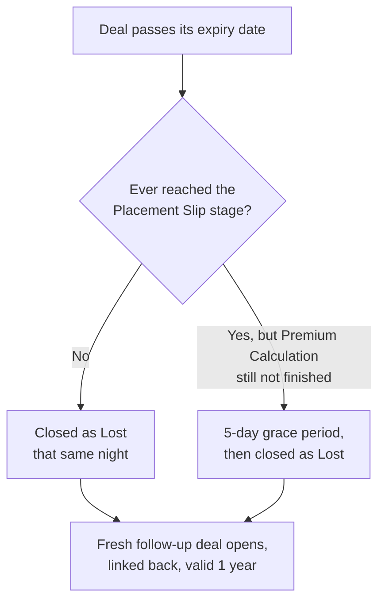
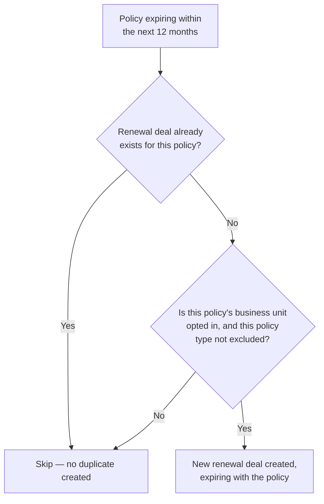

# Two Nightly Jobs Ready for Your Go-Ahead

**Status:** Built and tested, both switched off — awaiting business sign-off  **Date:** 2026-07-27

The system behind IIRM's sales and policy pipeline runs a set of automated nightly jobs that keep the pipeline tidy without anyone having to babysit it. This brief covers two of them — one that closes out deals that have run past their deadline, and one that automatically opens a renewal deal for every policy approaching its expiry — both fully built and tested but currently switched off. Two terms come up throughout: a "Sales Opportunity" is simply a deal being pursued, and a "Renewal Opportunity" is the same thing but specifically for renewing an existing policy. By the end of this document you'll know exactly what each job does, what the impact numbers actually mean, and the handful of decisions we need from you before either one is switched on.

> [!note] Both jobs are already built and tested. Nothing in the system changes until you give the go-ahead — they are switched off right now.

## At a Glance

| Job | What happens automatically | Preview impact if switched on today |
|---|---|---|
| Closing expired deals | Deals that ran out of time get closed as Lost; a fresh follow-up deal opens automatically in their place | ~12,962 deals affected |
| Creating renewal deals | Policies expiring within a year get a renewal deal opened automatically, once per policy | ~80,702 policies affected |

## Job 1 — Closing Out Deals That Ran Past Their Deadline

Every sales deal carries an expiry date — the point by which it should have either closed or moved forward. Right now, when that date passes, nothing happens automatically; someone has to notice and close it out by hand. This job takes care of that every night, but it treats two kinds of stalled deals differently, because a deal that never really got going is not the same as one where the team had already put in real work.

If a deal never reached the point of locking in terms with the insurer — a stage we call the Placement Slip — it's treated as a deal that never really started, and it's closed as Lost the same night its expiry date passes. If a deal did reach that point but hadn't yet finished working out the exact premium amount — the Premium Calculation stage — the team gets 5 extra days beyond the expiry date before it's closed. That grace period exists because real work was already in progress, and a short buffer gives the team a chance to finish rather than losing the deal outright. Deals that are already marked Won, or that completed both stages, are left completely untouched by this job.

Closing a deal as Lost never means the relationship ends there. The moment a deal is closed this way, the system automatically opens a brand-new deal referencing back to the one that was closed, so the team has a clean slate to keep pursuing that client. This new deal is given a full year — one year from the day it's created — before it too would need attention.

## Job 2 — Making Sure No Policy Renewal Slips Through

Every insurance policy also has its own expiry date — the day the current coverage ends. This job looks twelve months ahead every night for policies approaching that date and automatically opens a Renewal Opportunity for each one, so the renewal team always has something to work from well before the policy actually lapses.

The job is careful not to create duplicates — if a renewal deal already exists for a policy, nothing new is created on the next run. Whatever renewal deal is opened is given the same expiry date as the policy it's renewing, so it lands exactly when the current coverage runs out.

A few rules narrow down which policies qualify. The job only runs for business units that have specifically switched renewal-creation on — it's an opt-in per business unit, not an all-or-nothing switch for the whole company. It also skips policies that aren't purely insurance-related and policies billed on an installment-income basis. Within any business unit that has opted in, specific policy types can also be excluded — for example, if one business unit decides a particular policy type shouldn't get automatic renewals, that's already configurable without touching any code.

## What the Numbers Actually Mean

"12,962" and "80,702" are not new problems being created — they're a snapshot of deals and policies that have already piled up over time with no automated job managing them. Turning on Job 1 would close roughly 13,000 stalled deals as Lost and open a fresh follow-up deal for each one — nothing is deleted, and every one of those relationships gets a new deal to pick up where the old one left off. Turning on Job 2 would open roughly 80,700 renewal deals in one go, one for every policy that's already sitting inside its one-year renewal window today.

> [!tip] That first night is a one-time backlog catch-up. Every night after that, each job only touches the handful of deals or policies that newly cross their threshold — not this backlog again.

## Decisions We Need From You

1. **Turn both on now, or see the exact list first?** We can approve go-live for both jobs exactly as described, or we can generate a preview report naming every deal and policy that would be affected, for you to review before deciding. Nothing runs until you choose.
2. **Any business unit that should sit out of renewals for now?** The system already supports switching renewal-creation on per business unit — by default whichever units are already flagged on will start creating renewals. Tell us before go-live if any unit should be paused initially.
3. **Any policy type that should never get an automatic renewal?** Also already configurable per business unit, beyond the exceptions already built in (installment-billed and non-insurance policies). Let us know if there are more exceptions you want in place before go-live.
4. **Is 5 days enough breathing room for deals that are mid-process?** Deals that reached the Placement Slip stage but hadn't finished Premium Calculation get 5 extra days before being closed. Tell us if that buffer should be longer or shorter.

## How to Give the Go-Ahead

Reply with your decisions on the four items above, or simply confirm you're approving both jobs as described. Once we have your sign-off, we switch both jobs on — they'll start running on their nightly schedule with no other change to how your teams work day to day.
