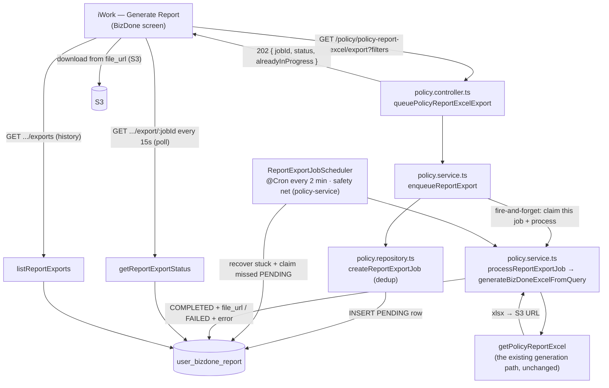

# PERF-BIZ-02 — BizDone Report Excel Download — Async Job — Technical Requirements Document (As-Built)

**Module:** PERF-BIZ-02
**Product:** iWork (BizDone report Excel download — `policy-service`, `ui-lib`, `iwork`)
**Client:** IIRM
**Stage:** 40c — Implemented (Fix A shipped; Fix B pending, see §6)
**Mode:** Brownfield (a live download real users depend on daily — every change preserves output correctness, not just removes the timeout)
**Authored:** 2026-08-02 · **Updated:** 2026-08-03 (reconciled with the shipped implementation)
**Audience:** Backend developers (`policy-service`), frontend developers (`iwork`/`ui-lib`), DBA, TL/PTL sign-off
**Depends on / extends:** [BizDone-Dashboard-Performance-TRD.md](./BizDone-Dashboard-Performance-TRD.md) (PERF-BIZ-01) — that TRD owns the query-optimization work (Fix B here); this TRD adds the async-job architecture (Fix A) that makes the download succeed *regardless of record count*.

> **What changed from the original plan.** The design proposed a `scheduler-service` worker, a `POST` enqueue, a `report_export_job` table with `params` + `retry_count`. The shipped implementation instead: runs the worker **in-process in `policy-service`** (it already hosts crons and owns the generation code), exposes the enqueue as a **GET** (to inherit the existing export ACL), names the table **`user_bizdone_report`** with a **`filters_applied`** column, and **drops `retry_count`** (a failed job goes straight to `FAILED`). Sections below describe the as-built system; §12 records why each choice was made.

---

## 1. Problem

The BizDone "Download Report" ran entirely inside a single synchronous HTTP request. `GET /policy/policy-report-excel` → `getPolicyReportExcel` (`policy.service.ts`) resolves the visible-user set, runs ~14 heavy query passes over `policy`/`policy_insurer_map`/reward tables, writes a six-sheet xlsx to temp disk, password-protects it, uploads it to S3, and only then returns the S3 URL. For 40K+ records that wall-clock time exceeds the request-timeout ceiling and the caller receives a **504 / request-timeout**, even though the backend often finishes the file after the client has given up.

Two timeout ceilings, confirmed in code:

- **App-level:** `TimeoutInterceptor` (`service-lib/src/lib/interceptors/timeout.interceptor.ts`) aborts any request after `REQUEST_TIMEOUT_MS` (default **120000ms / 2 min**), throwing `RequestTimeoutException`.
- **Infra-level:** the gateway / load-balancer idle timeout (nginx `proxy_read_timeout`, ALB idle, or API-gateway) surfaces as the **504** the user sees.

Raising either ceiling only moves the wall — it never removes it. The only design that succeeds for *any* record count is to stop doing the work inside the request. **The one detail that makes the fix cheap:** the endpoint already returns an **S3 URL, not the file bytes**, so the client was already designed to receive a URL and fetch the file separately — we changed *when* it gets the URL (poll), not *what* it gets.

## 2. Scope

**In scope (this TRD)**
- Fix A — convert the Excel download from synchronous request/response to an **asynchronous job**: enqueue → in-process background worker generates → S3 → status/poll for the download URL. **Shipped.**
- The frontend Downloads experience (tray/drawer, polling, auto-download, history). **Shipped.**
- Fix B — the query optimizations from PERF-BIZ-01 that make each job finish in seconds. **Referenced, still pending** (§6).

**Out of scope**
- The on-screen listing / KPI path (`GET /policy/policy-report-list`) — already paginated, doesn't hit the timeout. Unchanged.
- The full query rewrite detail — owned by PERF-BIZ-01.
- The synchronous `GET /policy/policy-report-excel` endpoint — left live and untouched so the change is additive; the frontend Download button now uses the async flow instead.

## 3. Architecture (as-built)



## 4. Pattern reused

The codebase already implements an async job-table + background-worker pattern (TPA claim sync: `sync_job` / `claim_sync_job` entities + `TpaClaimsWorkerScheduler`, with a `PENDING → PROCESSING → COMPLETED/FAILED` lifecycle and stuck-job recovery). This TRD's job entity and worker mirror that shape. The worker itself lives in `policy-service` (which already runs `@Cron` schedulers such as `EndorsementCreationScheduler`), not `scheduler-service` — see §12.1.

## 5. Fix A — Async Excel export (as-built)

### 5.1 Table / entity: `user_bizdone_report`

Entity `UserBizdoneReport` (`service-lib/src/lib/entities/user-bizdone-report.entity.ts`); DDL in `database-migrations/sql/report-export-job-table.sql`. Status/type enums live in **`service-lib/src/lib/constants.ts`** (`UserBizdoneReportStatus`, `UserBizdoneReportType`), not the entity file.

| Column | Purpose |
|---|---|
| `id` | job id, returned to the client |
| `user_id` | requester (scoping + "my exports" listing) |
| `report_type` | `BIZDONE` (leaves room for other exports later) |
| `status` | `PENDING` / `PROCESSING` / `COMPLETED` / `FAILED` |
| `filters_applied` (jsonb) | the exact BizDone query the user applied — the worker replays it to regenerate the same report |
| `file_url` | S3 URL, populated on `COMPLETED` |
| `error_message` | on `FAILED` |
| `started_at`, `completed_at`, `created_at`, `updated_at` | lifecycle + stuck-recovery |

Indexes: partial `(created_at) WHERE status='PENDING'` (worker claim), partial `(started_at) WHERE status='PROCESSING'` (stuck recovery), `(user_id, created_at)` (history listing). **No `retry_count`** and **no `priority`** column — see §12.

### 5.2 Endpoints (all GET, in `policy.controller.ts`)

| Endpoint | Purpose | Returns |
|---|---|---|
| `GET /policy/policy-report-excel/export` | **Enqueue.** Inserts a PENDING row with the caller's filters, returns immediately. | `202 { jobId, status, alreadyInProgress }` |
| `GET /policy/policy-report-excel/export/:jobId` | **Poll one job's status** (user-scoped). | `{ jobId, status, fileUrl, errorMessage, filtersSummary, createdAt, completedAt }` |
| `GET /policy/policy-report-excel/exports` | **List** the user's 20 most recent exports (Downloads history). | array of the above shape |

All three are **GET** so they inherit the existing `business-performance/export` ACL that the synchronous download already uses — the `AclGuard` maps every `policy-report-excel*` path to that export permission, which is granted for GET (§12.2). The status and list endpoints are scoped to the caller's `user_id`, so one user cannot read another's exports.

**De-duplication.** `createReportExportJob` checks for an existing in-flight (`PENDING`/`PROCESSING`) job for the same `user_id` + `report_type` with an identical `filters_applied` (JSON compare). If found it returns that job with `alreadyInProgress: true` (the UI shows *"Report is being generated, please wait."*) instead of creating a duplicate. Changing any filter produces a different set → a new job. Completed jobs are **not** reused — a fresh generate always makes a new report (data may have changed since).

### 5.3 Generation: trigger-on-enqueue + safety-net cron (in `policy-service`)

Generation runs in `policy-service` (not `scheduler-service`). It is kicked off **immediately on enqueue** and backed by a **slow safety-net cron**:

- **Immediate trigger.** After `enqueueReportExport` inserts a fresh (non-deduped) job, it calls `triggerReportExportJob(jobId)` **fire-and-forget** (not awaited, so it runs after the HTTP response is sent and is not bound by the request timeout). That method atomically claims the specific job (`claimReportExportJob` — status-guarded `PENDING → PROCESSING`) and processes it, so the report starts within milliseconds instead of waiting for a poll.
- **Safety-net cron** — `ReportExportJobScheduler` (`report-export-job.scheduler.ts`, registered in `policy.module.ts`), `@Cron("0 */2 * * * *")` every 2 minutes, `isRunning` guard. Each tick: `recoverStuckReportExportJobs()` (returns `PROCESSING` jobs older than **30 min** to `PENDING` after a crash) then `claimNextReportExportJob()` to pick up any job the immediate trigger missed (e.g. the process restarted between insert and trigger). Both the trigger and the cron use the same atomic status-guarded claim, so they never double-process a row.
- **Processing** — `processReportExportJob(job)` → `generateBizDoneExcelFromQuery(job.filtersApplied, job.userId)`, which **replays the stored filters through the existing `getPolicyReportExcel` path unchanged**, uploads to S3, and returns the URL. Success → `COMPLETED` + `file_url` + `completed_at`; error → `FAILED` + `error_message` (no retry — the user regenerates).

Because generation runs outside the HTTP request (fire-and-forget task or cron), the `TimeoutInterceptor` does not apply — no `x-bypass-timeout` plumbing needed. The immediate-trigger design keeps the cron's idle DB load minimal (a claim + stuck-recovery query only once every 2 minutes) while still guaranteeing durability.

### 5.4 Why this satisfies "success no matter how many records"

Generation no longer runs inside a request, so **no HTTP timeout applies to it**. A 40K-row and a 400K-row export both simply take as long as they take; the client only makes fast enqueue + poll + list calls. Record count becomes a "how long until ready" question, not an availability one.

## 6. Fix B — make each job fast (from PERF-BIZ-01) — still pending

Async removes the *ceiling*; the query work still determines *how long the user waits*. PERF-BIZ-01 owns these and they are **not yet shipped**:

- **Scoping:** replace the unbounded recursive CTE in `getFilteredUserIds` with a read from the already-maintained `employee_hierarchy` closure table (PERF-BIZ-01 §3.3), honoring its correctness caveats (self-row inclusion, staleness).
- **Indexes:** `policy.owner_id`, composite `(owner_id, date_of_income)` / `(owner_id, date_of_business)`, partial index on the "billable" flag, `employee_hierarchy.reporting_user_id` (PERF-BIZ-01 §6).
- **Business-month filter:** drop the `TO_CHAR(businessMonth, …)` function-on-column filter that defeats indexing.

Additive to Fix A; can ship independently.

## 7. Frontend (as-built)

Scoped to the two BizDone screens (`/biz-done-report`, `/biz-done-report-enhanced`). Backing state in `ui-lib` (`exportsSlice`, `useReportExports` hook); UI in `iwork` (`components/ReportExportsTray`).

- **Generate button** (shared `Table` `primaryAction`) becomes *"Preparing report…"* + disabled while a report is in-flight; a **"Downloads"** secondary button (with an unseen count) opens the drawer.
- **Enqueue** is fire-and-forget: toast *"being prepared…"*, or *"being generated, please wait."* when `alreadyInProgress`. The user keeps working.
- **Poller** runs in-page while a job is in-flight, every `VITE_REPORT_EXPORT_POLL_INTERVAL_MS` ms (default 15s, `environment.reportExportPollIntervalMs`). Stops when nothing is in-flight.
- **Downloads drawer** ("Your reports"): per-report card with status icon, a human-readable **filter summary with names resolved** (see §8), a **Latest** badge on the newest, exact + relative time, an in-progress bar, and a circular **download** button using the app's `download-icon.svg`. History survives refresh/re-login (hydrated from the list endpoint).
- **Auto-download:** reports generated *this session* download automatically the moment they complete (guarded to fire once; not applied to hydrated history).
- Store is always kept **newest-first**; the common `ChipRenderer`, `Button`, and `Drawer` are used throughout; status strings come from a shared `EXPORT_JOB_STATUS` const.

## 8. Filter summary with resolved names

So two exports with different filters are distinguishable, the list/status endpoints return a `filtersSummary` string built server-side. `listReportExports` parses each job's `filters_applied`, batch-resolves organisation / SBU / vertical / department / branch / insurer **names** by id (`resolveFilterEntityNames`, one query per entity type), and formats e.g. *"May · FY 2025 · Team · IIRM Sri Lanka"*. Unresolved ids fall back to *"Org 1"*. The frontend prefers `filtersSummary`; a client-side id summary covers the brief pre-poll window.

## 9. Correctness preservation

This is a finance/permissions-sensitive report — the async version must produce a **byte-identical** workbook to the synchronous one for the same filters:

1. The worker calls the same `getPolicyReportExcel` generation path — no rules, columns, or scoping change.
2. Parallel-run diff (recommended before wider rollout): for a representative account sample (including the PERF-BIZ-01 worst case `id=2`), enqueue an async export and generate the synchronous one with identical filters; diff all six sheets (row counts, Totals row, money-column sums).
3. Permission parity: the enqueue endpoint applies the same export ACL as the synchronous download; `filters_applied` is the caller's own scoped query, so a user cannot enqueue an export wider than they could download.

## 10. Testing

| Layer | Coverage |
|---|---|
| Unit — enqueue | Inserts a `PENDING` job with the correct `filters_applied` + user; de-dup returns the in-flight job with `alreadyInProgress`. |
| Unit — status/list | Correct shape incl. `filtersSummary`; rejects cross-user access; list is newest-first, capped at 20. |
| Unit — worker | Claim (`PENDING → PROCESSING`) is race-safe; `COMPLETED` sets `file_url`; `FAILED` sets `error_message`; stuck reset works. |
| Integration — parallel run | §9.2 sheet-by-sheet diff vs. the synchronous output, including `id=2`. |
| Frontend | Poller start/stop, auto-download-once, de-dup message, name-resolved summary, newest-first order. |

## 11. Rollback

- Fix A is additive: the synchronous `GET /policy/policy-report-excel` endpoint stays live and untouched — rollback is pointing the frontend Download button back at it. The `user_bizdone_report` table is inert if unused.
- Cron worker: disabling `ReportExportJobScheduler` (remove from module providers) stops all background generation with no data implications.
- Fix B rollback is per PERF-BIZ-01 §10.

## 12. Design decisions (were Open Questions)

1. **Worker in `policy-service`, in-process — resolved.** `policy-service` already hosts `@Cron` schedulers and owns `getPolicyReportExcel`, so an in-process worker reuses the generation code directly with no cross-service HTTP, JWT, or `x-bypass-timeout` plumbing. `scheduler-service` is not involved. (Trade-off: generation runs in the API service's process; the `isRunning` guard + single-claim-per-tick keep concurrency bounded.)
2. **Enqueue is a GET — resolved.** A POST returned 401 because `AclGuard` grants the `business-performance/export` permission for GET only (the synchronous download is a GET). Making the enqueue a GET inherits that grant with no ACL DB change. (Not strictly REST-pure, but the whole export path is already GET-based; the de-dup keeps repeat GETs safe.)
3. **`retry_count` dropped — resolved.** A failed generation goes straight to `FAILED`; the user regenerates. Stuck-in-`PROCESSING` jobs (crash recovery) still return to `PENDING` via the 30-min threshold.

**Still open**
4. **Retention / cleanup.** How long do generated S3 files and `user_bizdone_report` rows live before a cleanup job prunes them?
5. **Concurrency cap.** The worker processes one job per tick; if throughput needs raising for month-end peaks, add a bounded batch (guard the DB pool).
6. **Notification.** Poll-only today (in-page). A notification-service push on `COMPLETED` would reach users who navigated away / closed the tab.
7. **Poll mechanism.** Interval polling (chosen for simplicity/resilience); true HTTP long-polling is an option if request volume becomes a concern.

## 13. Key files (as-built)

- Entity: `service-lib/src/lib/entities/user-bizdone-report.entity.ts` · enums in `service-lib/src/lib/constants.ts`
- DDL: `database-migrations/sql/report-export-job-table.sql`
- Backend: `policy-service/src/app/policy/policy.controller.ts`, `policy.service.ts`, `policy.repository.ts`, `report-export-job.scheduler.ts`, `policy.module.ts`
- Frontend state: `ui-lib/src/lib/redux/exportsSlice.ts`, `ui-lib/src/lib/hooks/useReportExports.ts`, `ui-lib/src/lib/constants/endPoints.ts`, `ui-lib/src/lib/environment.ts`
- Frontend UI: `iwork/src/app/components/ReportExportsTray/*` (`index.tsx`, `config.ts`, `constants.ts`, `styles.ts`, `utils.ts`), wired into `BizDownReportListing` and `BizDownReportEnhancedListing`

## 14. Approval

Leave blank. TL/PTL sign-off authority.

```
Approved by:
Role:
Date:
```

---

# END OF TRD
