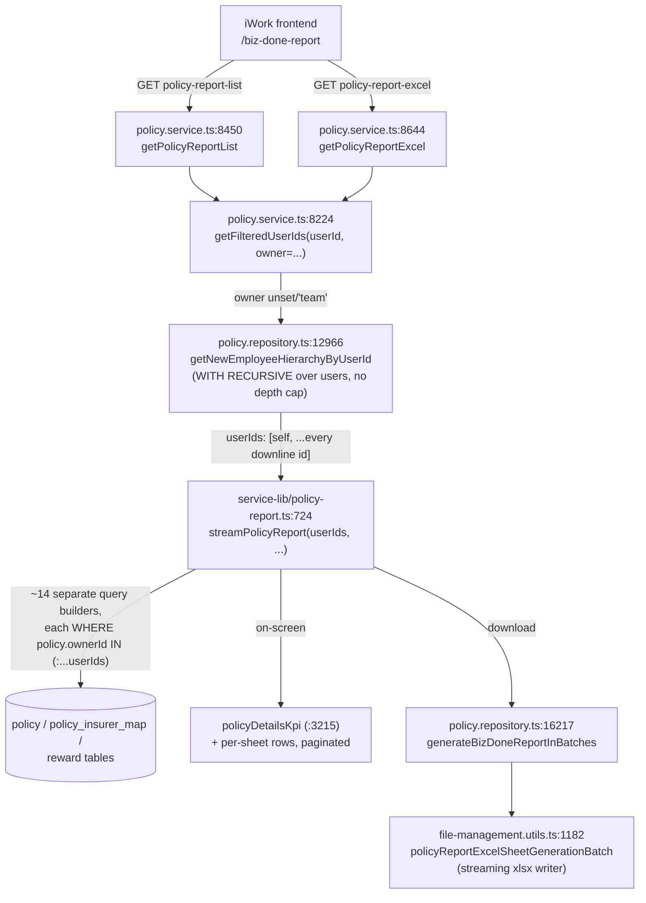

# PERF-BIZ-01 — BizDone Report & Business-Performance Dashboard — Performance & Query Optimization — Technical Requirements Document

**Module:** PERF-BIZ-01
**Product:** iWork (BizDone report + business-performance dashboard, both `policy-service`)
**Client:** IIRM
**Stage:** 40b — Module TRD
**Mode:** Brownfield (optimizing a live, already-shipping report real users depend on daily — every change here must preserve output correctness, not just improve speed)
**Authored:** 2026-07-29
**Audience:** Backend developers (`policy-service`), DBA, TL/PTL sign-off
**Source:** Implements item 13 of [Performance-Action-Items.md](./Performance-Action-Items.md) ("BizDone & Dashboard — Performance & fine tuning → Query optimization"), from the 24-Jul-2026 Technical Head meeting.
**PRD Reference:** [IIRM-5441_BizDone-PRD.md](../../IIRM-778_Admin-Reports/IIRM-5441_BizDone/IIRM-5441_BizDone-PRD.md) — read in full before touching any query named here; every fix below is constrained by its Business Rules, especially BR-BIZDONE-003 (visibility scoping).

This TRD is grounded entirely in the current `policy-service`, `opportunity-service`, `org-service`, and shared `service-lib`/`libs/service-lib` source as it exists on this branch today — every claim below cites a real file and line range. Where something couldn't be confirmed from code or would require a business decision, it is listed as an [Open Question](#12-open-questions) rather than asserted.

---

## 1. Scope

**This TRD covers:**
- The "Me + Team" visibility-scoping query (`getNewEmployeeHierarchyByUserId` and its duplicates) that gates every BizDone Report request — on-screen listing, KPI cards, and Excel download alike.
- The BizDone Excel-generation call chain: `getPolicyReportList` → `getPolicyReportExcel` → `streamPolicyReport` → `generateBizDoneReportInBatches`.
- The two business-performance dashboard queries named in the action item: `getQuarterlyDashboardBusinessPerformanceBySbu` and `getPolicyDashboardDetails`.
- Index candidates on the specific tables/columns these queries touch.
- A correctness-preservation plan, since every query rewrite here must produce the same rows a live, business-critical Excel export already produces — this is a permissions- and finance-sensitive report, not a cosmetic dashboard.

**Explicit non-goals (out of scope for this TRD):**
- General table partitioning/indexing strategy across the whole schema — owned by [DB-Partitioning-Indexing-TRD.md](./DB-Partitioning-Indexing-TRD.md). This TRD names indexes *specific* to the queries above and hands them to that sibling doc; it does not restate the general strategy.
- Converting reports to stored SQL functions — owned by [SQL-Functions-Reports-TRD.md](./SQL-Functions-Reports-TRD.md).
- Infra sizing/season-based scaling for `policy-service` pods — owned by [Infra-Capacity-Planning-TRD.md](./Infra-Capacity-Planning-TRD.md).
- Any service-boundary change to `policy-service` — owned by [Service-Split-TRD.md](./Service-Split-TRD.md).
- Health-check thresholds for this module — owned by [Health-Check-TRD.md](./Health-Check-TRD.md).
- The **Enhanced** BizDone report's on-screen drill-down UI (`getPolicyScopeSummary` / `getScopeSummaryByLevel`) — explicitly deferred by the PRD itself (see PRD "Scope"). It shares the same `getFilteredUserIds` scoping call this TRD fixes, so it inherits the fix, but its own accordion-rollup logic is not separately redesigned here.
- Redesigning BizDone's business rules (grouping, column formulas, brokerage reconciliation gaps) — those are PRD concerns, not performance ones; this TRD changes *how* the data is fetched, never *what* rows qualify or *what* a column means.

---

## 2. Current State — Grounded in Code

### 2.1 The BizDone call chain, as it actually runs today

The frontend calls exactly two endpoints for BizDone (confirmed against `apps/ui/ui-lib/src/lib/constants/endPoints.ts:797,972` — the only two BizDone URLs referenced anywhere in `apps/ui/iwork`):

| Frontend entry point | Route | Controller | Service method | Backing repo/util |
|---|---|---|---|---|
| On-screen KPI cards + table (`/biz-done-report`) | `GET /policy/policy-report-list` | `policy.controller.ts:1436` (`getPolicyReportList`) | `policy.service.ts:8450` (`getPolicyReportList`) | `policyReportService.streamPolicyReport` + `policyDetailsKpi` (`service-lib/src/lib/utils/policy-report.ts:724`, `:3215`) |
| Download Report (six-sheet workbook) | `GET /policy/policy-report-excel` | `policy.controller.ts:1603` (`getPolicyReportExcelDownload`) | `policy.service.ts:8644` (`getPolicyReportExcel`) | same `streamPolicyReport` → `policy.repository.ts:16217` (`generateBizDoneReportInBatches`) |

Both paths resolve "who am I allowed to see" through the identical helper:



### 2.2 The recursive hierarchy query — exact SQL, confirmed unbounded

`policy.repository.ts:12966-13015` (`getNewEmployeeHierarchyByUserId`, called by `getFilteredUserIds` at `policy.service.ts:8245` and by `getPolicyScopeSummary` at `policy.service.ts:8310`):

```sql
WITH RECURSIVE HierarchyCTE AS (
  SELECT id, reporting_user_id, first_name, last_name, 0 AS Level,
    organisation_id, sbu_id, vertical_id, department_id, branch_id
  FROM users WHERE id = ${userId}
  UNION ALL
  SELECT t.id, t.reporting_user_id, t.first_name, t.last_name, h.Level + 1,
    t.organisation_id, t.sbu_id, t.vertical_id, t.department_id, t.branch_id
  FROM users t
  JOIN HierarchyCTE h ON t.reporting_user_id = h.id
  AND t.user_type_key IN ('USER_TYPE_IIRM_EMPLOYEE', 'USER_TYPE_COMPANY_EMPLOYEE_AND_IIRM_EMPLOYEE')
)
SELECT id, reporting_user_id, first_name, last_name, Level, organisation_id, sbu_id, vertical_id, department_id, branch_id
FROM HierarchyCTE ORDER BY Level, id
```

Confirmed: no `LIMIT`, no depth cap, `${userId}` interpolated directly into the SQL string rather than parameterized (low risk since `userId` is an internal integer derived from the auth header, not user-supplied text, but worth a defensive parameterize-it-anyway fix while this code is being touched). This exactly matches PRD Business Rule 3's description and its worst-case numbers (`id=2`: 383 indirect reports → 194,430 finalized policies; `id=331`, `id=2168`, `id=5950` as smaller genuine cases).

**This exact query is duplicated at least four times in the codebase**, independently maintained, all with the identical unbounded shape:

| Copy | Location | Consumers |
|---|---|---|
| `PolicyRepository.getNewEmployeeHierarchyByUserId` | `policy.repository.ts:12966` | Only `getFilteredUserIds` (`policy.service.ts:8245`) and `getPolicyScopeSummary` (`policy.service.ts:8310`) — i.e., this is the one BizDone actually depends on. |
| `ScopeService.getNewEmployeeHierarchyByUserId` | `libs/service-lib/src/lib/utils/scope.utils.ts:1242-1284` | The **shared, canonical** copy — injected and called from ~20 sites across `policy.service.ts` (lines 933, 9150, 9352, 12362 — none of them the BizDone path), `claim.service.ts`, `opportunity.service.ts`, `note.repository.ts`, `meeting.repository.ts`, `task.repository.ts`, `org-service/comapny.service.ts`, `service-tat.service.ts`. |
| `OpportunityRepository.getEmployeeHierarchyByUserId` | `opportunity.repository.ts:15772-15840` | `opportunity.service.ts`'s own `getEmployeeHierarchyByUserId` wrapper (`opportunity.service.ts:12016`) — opportunity-service's independent equivalent, same query shape, different name (no "New" prefix — opportunity-service never had the older N+1 variant to disambiguate from). |
| `EmployeeRepository.getEmployeeHierarchyByUserId` | `org-service/employee.repository.ts:1802-1856` | org-service's own org-chart hierarchy API — the **only** copy with any mitigation at all: a hardcoded `LIMIT 5000` on the final `SELECT`. |

**Why this matters for the fix:** `getFilteredUserIds` (the function BizDone actually calls) reaches `PolicyRepository`'s *own* local copy — not the shared `ScopeService` copy that `PolicyService` already has injected as `this.scopeService` and already uses elsewhere in the very same file. That is an existing inconsistency worth correcting as part of this work: there is no reason for `policy.service.ts` to carry two independent code paths to the identical query. Recommendation §3.5 below folds this into the fix.

There is also an **older, slower, non-SQL variant**: `policy.repository.ts:12862-12964` (`getEmployeeHierarchyByUserId`, note: *no* "New") walks the hierarchy in JavaScript — one `findOne` + one `find` round trip *per node*, recursively. For `id=2`'s 384-person downline that is ~700+ sequential DB round trips instead of one CTE query. It is still live — called from `policy.service.ts:7470` and `policy.service.ts:10954`, and internally by `policy.repository.ts:12780` for a parent-privilege lookup — but **not** on the BizDone path, so it is out of scope for this TRD's fix; flagged here only because it's evidence of the same unbounded-hierarchy problem recurring in a worse form elsewhere, worth a follow-up ticket.

### 2.3 `generateBizDoneReport` vs `generateBizDoneReportInBatches` — one is dead code

Verified by tracing every caller in the repo:

- **`generateBizDoneReport`** (`policy.repository.ts:13074-13137`) takes a pre-materialized `policyData: any` object (full arrays for `companySummary`, `policySummary`, etc., already in memory) and passes it to `policyReportExcelSheetGeneration` (`service-lib/file-management.utils.ts:1126` — the **non-streaming** Excel writer). **It has zero live callers anywhere in the codebase.** Its only would-be caller was a block in `policy.service.ts:7981-8022` that is entirely commented out today (`// const reportData = await this.policyReportService.getPolicyReport(...)` followed by a commented `generateBizDoneReport` call). This is confirmed dead code, not a second live path for a different scenario.
- **`generateBizDoneReportInBatches`** (`policy.repository.ts:16217-16252`) is the one actually wired up — called from `getPolicyReport` (`policy.service.ts:8033`), `getPolicyReportExcel` (`policy.service.ts:8846`), and (per §2.4 below) the orphaned `getPolicyReport` path. It's a thin wrapper: fetch user details + module-password config, then hand the `AsyncGenerator` stream straight to `policyReportExcelSheetGenerationBatch` (`service-lib/file-management.utils.ts:1182`), which writes the workbook sheet-by-sheet as batches arrive.

**What this means for the optimization:** the "batches" rename already solved the *Excel-generation memory* problem — the workbook is streamed to disk/S3 incrementally instead of building a 194k-row object graph in Node memory first. It does **not** touch the *query* cost. `streamPolicyReport` (the thing actually producing each batch) still resolves the full `userIds` list up front via the unbounded recursive CTE, then runs ~14 independent query-builder passes (company/policy/insurer summaries × policy+endorsement legs, details-policy, details-co-insurer, KPI totals — enumerated at `service-lib/policy-report.ts:983, 1110, 1298, 1404, 1556, 1673, 1805, 2192, 2544, 2729, 3312, 3437, 3748, 3861, 3883`), each with its own `policy.ownerId IN (:...userIds)` predicate against an unindexed column. Batching made the *output* side memory-safe; it never made the *input* side (hierarchy resolution + big-IN-list scans) fast. Recommendation: delete `generateBizDoneReport` (§4.3) as part of this work — dead code that still shows up in searches and could mislead the next engineer into thinking there are two supported paths.

### 2.4 Incidental finding — an orphaned endpoint bypasses visibility scoping entirely

`policy.service.ts:7937-8062` (`getPolicyReport`) is called by `policy.controller.ts:1358` (`GET /policy/policy-report`) and is a **live, reachable** endpoint — but it is not referenced anywhere in `apps/ui/iwork` (confirmed: only `policyReportList` and `policyReportExcel` URLs exist in `apps/ui/ui-lib/src/lib/constants/endPoints.ts`). Inside it, the hierarchy-resolution block is commented out and replaced with a hardcoded empty array:

```ts
// policy.service.ts:7959-7967
// const employeeHierarchy =
//   await this.policyRepository.getEmployeeHierarchyByUserId(userId);
// const userIdsList = employeeHierarchy?.map((user) => user.userId) || [
//   userId,
// ];
const policyData = {
  userIds: [],
  ...
```

That `userIds: []` flows into `streamPolicyReport`, where every scoping predicate is guarded by `if (userIds && userIds.length > 0 && ...)` (e.g. `service-lib/policy-report.ts:1804`). An empty array means every one of those guards is skipped — **this endpoint, if called, returns every policy in the system to any authenticated caller, regardless of role.** It still produces a file literally named `.../BizDone-Report` (`policy.service.ts:8029-8031`).

This is a genuine finding from this investigation, not something introduced by any change proposed here — it predates this TRD and was almost certainly left behind when the code was refactored from the fully-buffered `getPolicyReport`/`generateBizDoneReport` path to the streaming `streamPolicyReport`/`generateBizDoneReportInBatches` path (§2.3). Since it's unreferenced by the frontend, the immediate business exposure looks low, but "unreferenced by the frontend today" is not the same as "unreachable" — the route is live. Recommended disposition: either (a) delete the endpoint and its controller route if genuinely unused, or (b) wire it through the same `getFilteredUserIds` scoping every other BizDone path uses. This is flagged for TL sign-off in [§12](#12-open-questions) as a fast-follow — it's a correctness/security gap the code already has today, independent of whether this TRD's performance work proceeds.

### 2.5 Dashboard queries — not the same shape as each other

The action item groups `getQuarterlyDashboardBusinessPerformanceBySbu` and `getPolicyDashboardDetails` together as "the dashboard." Reading both confirms they are **not** structurally similar, and need different fixes:

**`getQuarterlyDashboardBusinessPerformanceBySbu`** (`policy.repository.ts:12461-~12700`, service wrapper `policy.service.ts:~7798-7898`) genuinely is a `GROUP BY`-heavy aggregate — but critically, it already reads from **precomputed** tables, not raw `policy`: `performance_output` (`performance-output.entity.ts`, table `performance_output`) and `business_target` (`business-target.entity.ts`, table `business_target`), grouped by `sbuId`/`entityType` (`policy.repository.ts:12588, 12642`). Something else already rolls policy/endorsement/reward activity up into these tables on a schedule — this query is one join-and-group-by *once removed* from the expensive raw scan, not the raw scan itself. It still runs live, on every dashboard load, as two separate query passes (achieved + target) plus a zero-fill query for SBUs with no activity (`policy.repository.ts:12670+`) and an organisation-resolution lookup for the IIRM Holdings special case (`policy.repository.ts:12502-12518`) — four-plus round trips per load, scoped by `performanceOutput.userId IN (:...userIds)` / `businessTarget.userId IN (:...userIds)` (`policy.repository.ts:12565, 12619`) using the **same** `userIds` list resolved via `getFilteredUserIds` → the same unbounded recursive CTE from §2.2. So this query inherits the hierarchy-resolution cost even though its own aggregation is already one layer pre-computed.

**`getPolicyDashboardDetails`** (`policy.repository.ts:13837-~14050`, service wrapper `policy.service.ts:7900-7935`) is **not** an aggregate/GROUP BY query at all — correcting the action item's framing here rather than assuming it. It's a **single-policy** detail widget (keyed by one `policyId`, not scoped by org/SBU), and its cost profile is an N+1-shaped fan-out of ~12 independent, sequentially-`await`ed queries: `policyInsurerMapRepo.findOne`, `employeePolicyMapRepo.count` (×2, one for TPA-received), `dependentRepo.count` (×2), `employeeEnrollmentRepo.count` (×2), `policyEmployeeEndorsementRepo.count`, `policyEndorsementRepo.count`, `policyRepository.findOne`, `getCautionDepositsByPolicy`, and a `policyClaimRepo` GROUP BY (`policy.repository.ts:13838-13923`) — each awaited one after another rather than in parallel. None of these individually is expensive (each is scoped to one `policyId`), but 12+ sequential round trips stack their network/connection-pool latency linearly. This is a **parallelization** problem, not an indexing or materialization problem — see §5.

---

## 3. Fix — Unbounded Recursive Hierarchy ("Me + Team" Scoping)

### 3.1 Constraint from the PRD (read this before changing anything here)

BR-BIZDONE-003 is explicit: "Team" means the entire downline at any depth, not just direct reports, and this is enforced server-side as a genuine access control, not a UI nicety — a non-leadership user must never be able to pull data outside their downline "by any combination of filters, on screen or in a download." Any fix here **must preserve exactly the same visible-user-id set** the current recursive CTE produces. A depth cap would be a product-visible behavior change (some manager's "Team" total would silently shrink) and is out of bounds for this TRD to decide unilaterally — see [Open Question 1](#12-open-questions).

### 3.2 Options considered

| Option | What it does | Verdict |
|---|---|---|
| **A — Depth cap** (e.g. limit to 3-4 levels) | Add `WHERE h.Level < N` to the recursive term. | Rejected as the primary fix: changes user-visible "Team" membership for the very managers the PRD flags as the real cases (`id=331` at ~199 indirect reports, `id=2168`, `id=5950`) — this is a business decision about what "Team" means, not an engineering one. Kept as a documented fallback only, pending TL/business sign-off (Open Question 1). |
| **B — Materialize/precompute the hierarchy, refreshed on org-structure change** | Read from a precomputed closure table instead of walking `users` recursively on every request. | **Recommended — see §3.3.** Normally this would mean designing and building a new table; in this codebase, it doesn't — one already exists and is already kept in sync. |
| **C — Pagination/streaming for the 194k-row worst case** | Don't change hierarchy resolution; page the *policy* rows instead. | Already effectively half-done — `streamPolicyReport` already batches/paginates policy rows (`batchSize` param, `service-lib/policy-report.ts:730`) and `generateBizDoneReportInBatches` already streams them into the workbook. Doesn't address the hierarchy-resolution cost or the big-IN-list scan cost at all — complementary to B, not a substitute. |

### 3.3 Recommendation: read from `employee_hierarchy` — it already exists, and is already maintained

This is the load-bearing finding of this TRD. `org-service` already owns a **flattened, precomputed transitive-closure table** for exactly this hierarchy, defined in shared code (`apps/services/service-lib/src/lib/entities/employee_hierarchy.entity.ts`, table `employee_hierarchy`, columns `user_id`, `reporting_user_id`) and **kept incrementally in sync today**:

- **Incremental maintenance on every org-structure write**: `updateEmployeeHierarchy` / `addToFlatHierarchy` (`org-service/src/app/employee/employee.repository.ts:1959-2002`), invoked from the employee create/update paths (`employee.repository.ts:211, 1344`) — deletes and rebuilds the affected user's closure rows via a per-user recursive-CTE insert whenever their reporting line changes.
- **Maintenance on deactivation**: `syncEmployeeHierarchy` (`employee.repository.ts:2668-2687`, called at `:2797, 2919, 2925`) — removes the deactivated user's rows and re-wires their former direct reports to the new manager.
- **Full-rebuild safety net**: `rebuildFlatHierarchy` (`employee.repository.ts:2009-2101`) — a bulk recursive-CTE rebuild of the *entire* table, triggered on demand via an admin controller endpoint (`org-service/employee.controller.ts:~1158`), not on a schedule today.

Critically, the rebuild SQL (`employee.repository.ts:2029-2073`) computes, for **every** user in the org treated as a root, every one of their descendants at any depth, and inserts `(user_id = descendant, reporting_user_id = root)` for each pair. That means: `SELECT user_id FROM employee_hierarchy WHERE reporting_user_id = :managerId` **is already the precomputed answer to "who is in this manager's downline, at any depth"** — the exact question `getNewEmployeeHierarchyByUserId`'s live recursive CTE answers on every single BizDone request today.

**This table is written to consistently, but read from nowhere for permission-scoping.** The only current readers of `EmployeeHierarchy` are the org-service employee-CRUD write paths themselves; every hierarchy *read* anywhere in the codebase — including org-service's own `getEmployeeHierarchyByUserId` (`employee.repository.ts:1802`, the one with the `LIMIT 5000` band-aid) — still re-derives the answer live via `WITH RECURSIVE` instead of querying this table. Pointing BizDone's `getFilteredUserIds` at `employee_hierarchy` turns an O(graph traversal over `users`, unindexed, per request) operation into an O(indexed lookup against a table sized for exactly this query) operation, with **zero new migration** required — the entity is already declared in shared `service-lib` and importable from `policy-service` today.

**Tradeoff, stated plainly:** this trades read-time speed for write-time complexity and staleness risk — which is exactly the right trade for a hierarchy that changes only when someone's reporting manager changes (an HR event, not a per-request event), read on every single BizDone page load and Excel download. The write-time complexity already exists and is already paid for by org-service; this TRD is proposing to *consume* an asset that's already built, not build a new one.

### 3.4 Correctness caveats that must be handled explicitly, not assumed

1. **Self-row.** The rebuild SQL explicitly excludes `user_id = root_user_id` (`employee.repository.ts:2072`, `WHERE user_id != root_user_id`), so `employee_hierarchy` has no row for "manager reports to themself." The current `getNewEmployeeHierarchyByUserId` output *does* include the requesting user's own id (Level 0 base case). Any replacement query must explicitly `UNION` the caller's own `userId` back in, or `getFilteredUserIds` will silently drop the manager's own policies from their own "Me + Team" view — an easy, high-consequence mistake to make and must be a named test case (§9).
2. **Column-name collision, not a data problem but a real readability trap.** `employee_hierarchy.reporting_user_id` means "an ancestor at any depth" (matches whatever root the closure row was generated for); `users.reporting_user_id` means "direct manager only." Same name, different semantics, in tables that will now be joined/compared side by side. Recommend aliasing clearly in the new query (e.g. `ancestor_user_id`) rather than trusting the raw column name to self-document.
3. **Staleness risk is the main new risk this introduces.** `employee_hierarchy` is kept in sync by application-level hooks in org-service's employee-CRUD code paths, not database triggers. Any write to `users.reporting_user_id` that bypasses those specific code paths (a direct SQL fix, a bulk import, a bug in a different mutation path) would desynchronize the closure table from the true hierarchy — and because this feeds a permissions decision, staleness means either an over-broad or an under-broad "Team," silently. Mitigations: (a) an explicit audit — confirm every path that can change `users.reporting_user_id` funnels through `updateEmployeeHierarchy`/`syncEmployeeHierarchy` before cutover (Open Question 2); (b) add a scheduled drift-correction job that re-runs `rebuildFlatHierarchy` periodically (e.g. nightly) via the existing `DynamicCronService` pattern (`scheduler-service/src/app/scheduler/external-hospital-sync.scheduler.ts:43-72` — register a handler, call `dynamicCronService.registerHandlers(...)` + `loadCronJobs()`, control cadence via `application_scheduler_configuration` per [Performance-Action-Items.md §4](./Performance-Action-Items.md#4-database-vacuum--scheduled-activity)'s pattern) as cheap insurance, not a replacement for the incremental sync; (c) the before/after comparison in §9 is the actual gate — if it doesn't match on a representative sample including `id=2`, this fix does not ship regardless of how sound it looks on paper.
4. **User-type filter parity.** The recursive CTE filters descendants to `user_type_key IN ('USER_TYPE_IIRM_EMPLOYEE', 'USER_TYPE_COMPANY_EMPLOYEE_AND_IIRM_EMPLOYEE')` (`policy.repository.ts:12986`). `rebuildFlatHierarchy`'s base and recursive terms apply the identical filter (`employee.repository.ts:2038-2041, 2054-2057`) — same two type keys, confirmed matching, so this particular parity check passes today. Re-verify it still matches if either query is edited independently in the future.

### 3.5 Concrete change

- In `getFilteredUserIds` (`policy.service.ts:8224-8258`), replace the call to `this.policyRepository.getNewEmployeeHierarchyByUserId(userId)` (`policy.service.ts:8245`) with a new repository method that reads `employee_hierarchy` (indexed on `reporting_user_id`, plus the caller's own id unioned in per §3.4.1), keeping the exact same return shape (`{ userId, organisationId, sbuId, verticalId, departmentId, branchId, ... }[]`) so nothing downstream (`getPolicyReportList`, `getPolicyReportExcel`, `getPolicyScopeSummary`) needs to change.
- While in this code: redirect this call through the shared `ScopeService` (`this.scopeService`, already injected into `PolicyService` and already used elsewhere in the same file — `policy.service.ts:933, 9150, 9352, 12362`) rather than maintaining a second, `PolicyRepository`-local implementation. This is a small mechanical change with an outsized benefit: `ScopeService.getNewEmployeeHierarchyByUserId` (`libs/service-lib/src/lib/utils/scope.utils.ts:1242`) is the copy ~20 call sites across `policy-service`, `opportunity-service`, `org-service`, and `claim.service.ts` already depend on — fixing it once, in the shared library, fixes every one of those consumers' hierarchy-resolution cost for free, without touching their code. Retiring the redundant `PolicyRepository` copy (§2.2) and the `opportunity.repository.ts:15772` / `org-service/employee.repository.ts:1802` copies is worth its own follow-up consolidation ticket — flagged in [Open Question 3](#12-open-questions), not done as part of this TRD to keep this change's blast radius to BizDone/Dashboard as scoped.

---

## 4. Fix — Dead Code Cleanup

`generateBizDoneReport` (`policy.repository.ts:13074-13137`) and its non-streaming dependency chain for BizDone specifically have zero live callers (§2.3). Recommendation: delete `generateBizDoneReport` from `PolicyRepository` as part of this work (low-risk — no caller exists to break), along with the fully-commented-out block in `policy.service.ts:7981-8022` that would have called it. Do **not** delete `policyReportExcelSheetGeneration` itself (`service-lib/file-management.utils.ts:1126`) — it's still live for `document-service`'s utilization-reports export (`document-service/src/app/excel/excel.repository.ts:31`), a different report entirely.

---

## 5. Fix — Dashboard Queries

### 5.1 `getQuarterlyDashboardBusinessPerformanceBySbu` — materialization candidate, but the bottleneck is upstream

The query itself already targets pre-aggregated tables (§2.5) — its own `GROUP BY` cost is unlikely to be the dominant factor once the hierarchy-resolution fix (§3) lands, since it shares the exact same `getFilteredUserIds` call for its `userIds` scoping. Recommendation: land the hierarchy fix first, then re-measure this query's own cost in isolation (§10) before deciding whether its four-plus sequential round trips (organisation-scope resolution, achieved query, target query, zero-fill query) also need a materialized rollup. If `performance_output`/`business_target` themselves turn out to be large and this dashboard widget is opened frequently per user per session, a materialized view refreshed on the same `DynamicCronService` cadence that (presumably) already populates these tables is the right follow-up — but confirm what currently populates `performance_output`/`business_target` before designing a second refresh job that could race the first one (Open Question 4 — this TRD did not trace that ETL path; it was out of the original scope handed down).

### 5.2 `getPolicyDashboardDetails` — parallelize, don't materialize

This is a single-policy widget, not an org-wide aggregate (§2.5) — a materialized view is the wrong tool here; there's nothing to pre-aggregate across policies. The fix is mechanical: the ~12 independent `count`/`findOne` calls (`policy.repository.ts:13838-13923`) have no data dependency on each other (none of them reads a value another one produced) and can be issued concurrently via `Promise.all` instead of sequential `await`s, cutting wall-clock latency from "sum of every round trip" to "the slowest single round trip." This is a pure application-code change with no schema impact, and should be trivial to unit-test against the existing mocked repos (`claim.service.spec.ts`-style mocking already used elsewhere in this file's test suite).

---

## 6. Index Candidates Specific to These Queries

General partitioning/indexing strategy is owned by [DB-Partitioning-Indexing-TRD.md](./DB-Partitioning-Indexing-TRD.md); the candidates below are handed to that TRD's execution but are listed here because they're specific to the query shapes this TRD traced — confirmed via `apps/services/service-lib/src/lib/entities/policy.entity.ts` (no `@Index` decorator exists anywhere in that file today) and `user.ts`/`employee_hierarchy.entity.ts` (same — zero indexes).

| Table | Column(s) | Why | Query it serves |
|---|---|---|---|
| `employee_hierarchy` | `reporting_user_id` | The entire point of §3.3 — this is the lookup BizDone's scoping will run on every request. | `getFilteredUserIds` (replacement query) |
| `employee_hierarchy` | `user_id` | Needed for the incremental delete/update paths (`employee.repository.ts:1965, 2674`) to stay cheap as the table grows. | org-service write paths |
| `policy` | `owner_id` | Every one of the ~14 `streamPolicyReport` query builders filters `policy.ownerId IN (:...userIds)` (`service-lib/policy-report.ts:1804-1805` and equivalents). Currently a full scan per query. | `streamPolicyReport` (all sheets) |
| `policy` | `(owner_id, date_of_income)` and `(owner_id, date_of_business)` composite | Every sheet also range-filters on whichever date column `filterByBusinessDate` selects (`service-lib/policy-report.ts:1813-1818`) — a composite index matching the actual predicate pair beats two single-column indexes for this specific access pattern. | `streamPolicyReport`, `policyDetailsKpi` |
| `policy` | `enabled_for_performance_lid` (partial index, `WHERE enabled_for_performance_lid = <the "counts toward BizDone" value>`) | ANDed on every query (`service-lib/policy-report.ts:1807-1811`) — this is effectively the "is this row done/billable" gate BR-BIZDONE-001 describes; a partial index scoped to the qualifying value only indexes the subset of rows BizDone ever reads, not the whole table. | `streamPolicyReport` (all sheets) |
| `policy_insurer_map` | `(policy_id, insurer_participation_type_lid)` | Joined on every `policyDetails`/`co-insurer` sheet (`service-lib/policy-report.ts:1921-1926`) to find the lead-insurer row. | Details-Policy Based, Details-Co-Insurer Based |
| `policy` | expression index or a stored generated column for `TO_CHAR(business_month, 'FMMonth')` | `service-lib/policy-report.ts:1914-1918` filters on `TO_CHAR(policy.businessMonth, 'FMMonth') = :businessMonth` — a function call on the column defeats a plain btree index outright. Either add an expression index matching this exact function call, or (better, since it also fixes a locale-fragility risk) rewrite the filter to a plain month/date-range comparison and drop the function call entirely. | Any query using the Business Month text filter |
| `users` | `(reporting_user_id, user_type_key)` | Speeds the per-level join in `rebuildFlatHierarchy`'s bulk recursive CTE (`org-service/employee.repository.ts:2052-2057`) and the still-live `ScopeService`/opportunity-service/org-service recursive-CTE copies (§2.2) that remain in use elsewhere even after §3.5's redirect. | Hierarchy rebuild + every remaining live CTE copy |
| `performance_output` / `business_target` | `(user_id, sbu_id, entity_type, ...month/period column)` | Both scoped by `userId IN (:...userIds)` plus `sbuId`/period range (`policy.repository.ts:12547-12583, 12607-12637`). | `getQuarterlyDashboardBusinessPerformanceBySbu` |
| `policy_claim` | `(policy_id, claim_status)` | `getPolicyDashboardDetails`'s `GROUP BY claim.claimStatus` (`policy.repository.ts:13917-13923`). | `getPolicyDashboardDetails` |

---

## 7. Correctness-Preservation Plan

This is not optional polish — BR-BIZDONE-003 is a permissions boundary, and the Excel workbook is a finance/reconciliation artifact real users already trust. Every change in this TRD must be validated to produce the **same visible-user-id set** and the **same report rows** as today, not merely a faster result.

1. **Snapshot before touching anything.** For a representative account sample — the PRD's own confirmed cases (`id=2`, `id=331`, `id=2168`, `id=5950`) plus a handful of ordinary single-level managers and at least one leadership-role account — capture the current `getFilteredUserIds` output (the raw user-id array) and the current Download Report workbook (all six sheets, byte contents or at minimum row-level checksums) as the ground truth.
2. **Compare the hierarchy resolution in isolation first**, before touching any downstream query: for every sampled account, the new `employee_hierarchy`-backed query's output user-id set must be an exact set-equality match (not just same count) against the current recursive-CTE output, including the self-row (§3.4.1). Any mismatch blocks progress until explained — do not proceed to the report-level comparison with a known-mismatched user-id set.
3. **Report-level parallel run.** With the hierarchy fix confirmed exact, regenerate the Download Report workbook for the same sampled accounts and the same filter combinations, and diff sheet-by-sheet against the pre-change snapshot: row counts, the Totals row (BR-BIZDONE-005), and per-sheet money-column sums must match exactly. This must include at least one Rewards-sheet case (Business Rules 11/12) and one Income Type filter case, since those are the report's own documented edge behaviors this fix must not disturb.
4. **`id=2` specifically** is the load-bearing worst case (194,430 policies) — it must be run to completion under both the old and new paths at least once each in a non-production environment before cutover, timed, and diffed, not sampled.

---

## 8. Testing Strategy

| Layer | Coverage target |
|---|---|
| `EXPLAIN ANALYZE`, before/after | Run against `id=2`'s worst-case query set (hierarchy resolution + all ~14 `streamPolicyReport` query builders) on a non-production database with production-shaped data volume — not literally production. Capture plan shape (seq scan vs index scan) and timing for both the current and proposed queries. |
| Parallel-run comparison | Per §7 above — automated diff of hierarchy output and workbook contents across the sampled accounts, run as part of CI or a dedicated pre-cutover script, not a manual one-off. |
| "Me + Team" permission-scoping regression | Explicit test cases: (a) an ordinary manager sees exactly their downline, not more, not less; (b) a leadership/Super User account can still widen the Organisation filter freely (unaffected by this change, but must be regression-tested since it shares `getFilteredUserIds`); (c) a non-leadership user cannot see another org's data by any filter combination (AC-BIZDONE-001/002 from the PRD). |
| Unit — `getFilteredUserIds` self-row inclusion | Confirms the caller's own id is present in the returned set even though `employee_hierarchy` itself excludes self-pairs (§3.4.1) — the single easiest correctness regression to introduce. |
| Unit — `getPolicyDashboardDetails` parallelization | Confirms the `Promise.all`-ified version returns identical field values to the sequential version for a policy with claims, enrollments, endorsements, and a CD account all populated (exercises every one of the ~12 sub-queries). |
| Load/perf | Time the on-screen `policy-report-list` load and the `policy-report-excel` download for `id=2`'s account before and after, end to end (not just the SQL layer) — the streaming Excel writer (§2.3) and network transfer both contribute to perceived latency and shouldn't be ignored just because the query layer improved. |

---

## 9. Rollout Plan

Given this feeds a live Excel export finance/ops users already depend on, and a permissions-sensitive on-screen report:

1. Ship the `employee_hierarchy`-backed `getFilteredUserIds` behind a feature flag (or an environment-scoped config toggle, matching whatever pattern other recent flag-gated changes in this codebase use — confirm the house pattern before inventing a new one) so it can run side-by-side with the current recursive-CTE path in preprod without affecting production traffic.
2. Run the side-by-side comparison (§7) against preprod for a full reporting cycle (at least one month-end close, since that's when BizDone usage is presumably heaviest) before flipping the flag in production.
3. Cut over on-screen (`policy-report-list`) first, since a wrong result there is immediately visible and correctable by the user re-filtering; hold the Excel download path (`policy-report-excel`) one release behind, since a wrong downloaded workbook can be acted on (e.g. board-reported) before anyone notices a discrepancy.
4. Delete `generateBizDoneReport` (§4) only after the above is fully cut over and stable — it's dead today, but keep it as a inert fallback reference for one release in case its removal needs to be reverted alongside a broader rollback.

---

## 10. Rollback Plan

- The `employee_hierarchy` read-path change is additive and flag-gated (§9) — rollback is flipping the flag back to the existing recursive-CTE `getNewEmployeeHierarchyByUserId` call, no data migration to undo since nothing about `employee_hierarchy` itself changes (it already exists and is already maintained regardless of whether BizDone reads from it).
- If the parallelized `getPolicyDashboardDetails` regresses (e.g. connection-pool exhaustion from N simultaneous queries instead of N sequential ones, on a pool sized for the old pattern), reverting to sequential `await`s is a single-file code revert with no data implications.
- If an index from §6 causes unexpected write-side regression (e.g. `policy` insert/update slowdown from the new composite/partial indexes), each is independently droppable without affecting the others — do not add them all in one migration; land and measure incrementally per the sibling [DB-Partitioning-Indexing-TRD.md](./DB-Partitioning-Indexing-TRD.md)'s own rollout sequencing.
- The dead-code deletion (§4) has no rollback concern beyond restoring the deleted method from version control, since it has no live callers to break.

---

## 11. Cross-References

- [DB-Partitioning-Indexing-TRD.md](./DB-Partitioning-Indexing-TRD.md) — owns the general indexing/partitioning strategy; §6 above hands it the BizDone/Dashboard-specific candidates.
- [SQL-Functions-Reports-TRD.md](./SQL-Functions-Reports-TRD.md) — if BizDone's reporting queries are later converted to stored SQL functions platform-wide, this TRD's query rewrites should be re-validated against that design rather than duplicated.
- [Infra-Capacity-Planning-TRD.md](./Infra-Capacity-Planning-TRD.md) — `policy-service`'s pod sizing should account for whatever connection-pool impact the `getPolicyDashboardDetails` parallelization (§5.2) introduces.
- [Service-Split-TRD.md](./Service-Split-TRD.md) — none of this TRD's changes assume or require any service-boundary change; `employee_hierarchy` is already shared-schema-accessible from `policy-service` today.
- [Health-Check-TRD.md](./Health-Check-TRD.md) — the BizDone/Dashboard endpoints should be considered for any new health-check thresholds that TRD defines, given they're now confirmed to be among the platform's most expensive read paths.

---

## 12. Open Questions

1. **Depth cap vs. full-hierarchy — business decision, not engineering's to make.** §3.3's `employee_hierarchy`-backed fix preserves full-depth "Team" semantics exactly (no visible behavior change), and is this TRD's recommendation. But if the closure-table fix is for any reason not adoptable quickly, Option A (a depth cap) remains on the table as a fallback — and that decision (what depth, if any, is acceptable for which roles) belongs to TL/PTL/business, not engineering, since it changes what a manager sees. Needs an explicit yes/no: is the closure-table fix acceptable as the sole fix, or should a depth cap also be designed as defense-in-depth even after §3.3 ships?
2. **Audit: does every path that can change `users.reporting_user_id` funnel through `updateEmployeeHierarchy`/`syncEmployeeHierarchy`?** This TRD found the incremental-sync code paths but did not exhaustively audit every write path to `users.reporting_user_id` across the codebase (bulk imports, admin tools, direct SQL scripts) to confirm none of them bypasses the hooks that keep `employee_hierarchy` in sync. This is a prerequisite for trusting §3.3's fix long-term, not just at cutover.
3. **Consolidating the four duplicate hierarchy-query implementations (§2.2) into one.** This TRD recommends redirecting BizDone's specific call through `ScopeService` (§3.5) but explicitly does not remove the `OpportunityRepository`/`org-service EmployeeRepository` copies, to keep this change's scope to policy-service's BizDone/Dashboard path. Should a separate consolidation ticket be opened to retire the redundant copies platform-wide (all four would benefit from the same `employee_hierarchy`-backed fix)?
4. **What currently populates `performance_output`/`business_target`?** §5.1 assumes some existing ETL/job already rolls policy activity into these tables on a schedule, since `getQuarterlyDashboardBusinessPerformanceBySbu` reads them rather than raw `policy`. This TRD did not trace that population path (out of the original scope handed down) — needed before designing any additional materialized-view refresh job on top of it, to avoid two refresh jobs racing each other.
5. **Disposition of the orphaned, unscoped `GET /policy/policy-report` endpoint (§2.4).** Delete it, or wire it through `getFilteredUserIds` like every other BizDone path? This is a live permissions gap independent of the performance work in this TRD and probably shouldn't wait for this TRD's rollout to be resolved.
6. **House pattern for feature-flagging a backend query-path change.** §9 assumes a flag/config-toggle pattern exists elsewhere in this codebase for exactly this kind of side-by-side cutover; this TRD did not locate and confirm one specific existing example to copy — needs confirmation before implementation starts.

---

## 13. Approval

Leave blank. TL/PTL sign-off authority.

```
Approved by:
Role:
Date:

Approved by:
Role:
Date:
```

---

# END OF TRD
