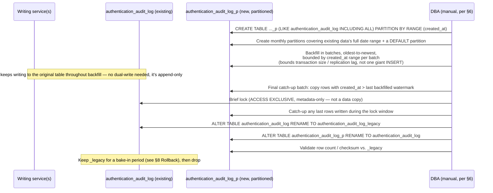

# PERF-DB-01 — Database Partitioning & Indexing — Technical Requirements Document

**Module:** PERF-DB-01
**Product:** iWork + IBP (shared backend — both consume the same Postgres tables; "iWork" and "IBP" are frontend-only branding over one Module Federation shell, per `apps/ui/iwork`, `apps/ui/ibp`)
**Client:** IIRM
**Stage:** 40b — Module TRD
**Mode:** Brownfield (modifying live production schema/queries — every table discussed here is already populated in prod)
**Authored:** 2026-07-29
**Audience:** Backend developers, DBA, TL/PTL sign-off
**Source:** This TRD implements items 5 ("Database - Partitioning") and 6 ("Database - Indexing") of [Performance-Action-Items.md](./Performance-Action-Items.md) (24-Jul-2026 Technical Head meeting), per the [Action Plan](./Performance-Action-Items.md#action-plan) table pointing both items at this file.

This TRD is grounded entirely in what a direct read of the codebase shows — not in assumptions about scale. Where the codebase can't answer a question (row counts, growth rate, retention policy), that is stated as an open question rather than guessed. Every table, column, and query pattern named below is quoted from a real file path; see [§2](#2-current-state-evidence) for the full trail.

---

## 1. Scope

**This TRD designs:**
- An indexing strategy for the highest-traffic, currently-unindexed tables reachable from `policy.repository.ts`, `opportunity.repository.ts`, and `org-service`'s `company.repository.ts`/`employee.repository.ts` — concrete columns, index types, and a validation method (not a speculative "add indexes everywhere" pass).
- A partitioning strategy that distinguishes tables where partitioning is a real fit (append-only, date-keyed, no inbound FK fan-in) from tables where it is not (core dimension/fact tables referenced by dozens of other tables) — and says why for each.
- A concrete, zero-downtime method for converting an **already-populated** table to native Postgres partitioning, since `ALTER TABLE ... PARTITION BY` cannot be applied in place to a table that already has rows.
- How these DDL changes get applied consistently across dev/uat/preprod/prod given the real state of this repo's migration tooling (see [§6](#6-migration-tooling--cross-environment-application) — this is not a hypothetical gap, it's independently re-confirmed here).
- Rollback and blast-radius handling appropriate to changing live production tables, which the sibling [NFR-USA-025 TRD](../NFRs/NFR-USA-025_MS-Teams_Tasks-Integrate/NFR-USA-025_TRD.md) (greenfield) didn't need.

**Explicit non-goals (out of scope for this TRD):**
- Rewriting the queries themselves (e.g., the BizDone `WITH RECURSIVE` hierarchy query, or report-level SQL restructuring) — that's [SQL-Functions-Reports-TRD.md](./SQL-Functions-Reports-TRD.md) and [BizDone-Dashboard-Performance-TRD.md](./BizDone-Dashboard-Performance-TRD.md). This TRD owns the table-level schema (partitions, indexes); those TRDs own what SQL runs against it. Where a BizDone query's fix depends on an index this TRD proposes, that's cross-referenced explicitly in [§4](#4-indexing-strategy), not duplicated.
- Autovacuum tuning and manual `VACUUM` scheduling — item 4 in [Performance-Action-Items.md §4](./Performance-Action-Items.md#4-database-vacuum--scheduled-activity), a separate direct action, not a TRD.
- Infra sizing/seasonal capacity bumping — [Infra-Capacity-Planning-TRD.md](./Infra-Capacity-Planning-TRD.md) owns compute/memory; this TRD's indexing work reduces the query-side load that TRD is sizing for, so the two should be read together before either is executed.
- Schema/index drift validation across environments and audit-log retention policy sign-off — item 12 in [Performance-Action-Items.md §12](./Performance-Action-Items.md#12-production-database--validation--clean-up); that direct-action item and this TRD's partitioning design on `audit_history_log`/`authentication_audit_log` depend on the same retention decision (see [Open Questions](#7-open-questions)).
- Service-boundary or infra-topology changes — [Service-Split-TRD.md](./Service-Split-TRD.md) and [Health-Check-TRD.md](./Health-Check-TRD.md) are unrelated concerns; noted only where a DDL change here would affect a health-check query's assumptions.

---

## 2. Current-State Evidence

Everything in this section was read directly out of the repository during this TRD's research pass; no figure here is carried over from the meeting notes without a file path behind it.

### 2.1 Indexing coverage

- 329 `.entity.ts` files exist under `apps/services/*`. Exactly 47 carry an explicit `@Index(...)` decorator (`grep -rl "@Index(" apps/services --include="*.entity.ts" | wc -l`) — 101 total `@Index(...)` occurrences across those 47 files, i.e. most indexed entities have 1–3 indexes each, not one.
- The 47 indexed entities cluster almost entirely in newer, narrower-purpose tables: audit/log tables (`audit-history-log.entity.ts`, `authentication-audit-log.entity.ts`, `scheduler-audit-log.entity.ts`, `policy-audit-log.entity.ts`, `policy-claim-audit.entity.ts`), sync/integration tables (`claim-sync-job.entity.ts`, `sync-job.entity.ts`, `raw-sync-response.entity.ts`, `raw-tpa-claim-response.entity.ts`, `company-zoho-integration.entity.ts`), and a handful of enrollment/HR tables (`policy-enrollment-employee.entity.ts`, `hr-user-management.entity.ts`, `employee-enrollment-submission.entity.ts`).
- The core transactional/dimension tables that `policy.repository.ts` and `opportunity.repository.ts` query constantly — `policy.entity.ts`, `opportunity.entity.ts`, `endorsement.entity.ts`, `non-group-claim.entity.ts`, `company.entity.ts`, `employee.entity.ts`, `policy-installments.entity.ts`, `policy-participant-map.entity.ts`, `employee_hierarchy.entity.ts` — carry **zero** `@Index(...)` decorators. Confirmed by direct read of each file; details in [§4.1](#41-candidate-tables--evidence).
- Zero physical table partitioning exists anywhere. Every `PARTITION BY` hit in the codebase is a SQL window function (`ROW_NUMBER() OVER (PARTITION BY ...)`), e.g. `opportunity-service/src/app/opportunity/opportunity.repository.ts:882` and `policy-service/src/app/policy/policy.repository.ts:33687-33691` — not a table partition, confirmed by grep for `CREATE TABLE ... PARTITION BY` returning zero hits.
- A prior ad hoc index investigation exists on `policy_enrollment_employee` specifically: `database-migrations/sql/check_pee_indexes.sql` queries `pg_indexes` for that table's `uq_pee_company_employee`/`uq_pee_empco_companyemp_active` indexes, and `database-migrations/sql/pee_multi_company_unique_index.sql` is the migration that replaced a single-column unique index with a compound partial unique index (`ON policy_enrollment_employee(company_id, company_employee_id) WHERE deleted_at IS NULL`) — this is the one place in the repo where an index defect was found and fixed with evidence, and it's the model this TRD's partial-index recommendations follow (see [§4.2](#42-index-type-tradeoffs)).

### 2.2 Concrete unindexed hot-path evidence

Grep counts of camelCase property usage inside the two biggest repository files (case matters — these are TypeORM `QueryBuilder` calls, not raw snake_case SQL):

| File | Lines | `.where()`/`.andWhere()` calls | Hottest filter/join columns (occurrence count) |
|---|---|---|---|
| `apps/services/policy-service/src/app/policy/policy.repository.ts` | 33,874 | 538 | `deletedAt` (125), `companyId` (148), `policyTo` (171), `policyFrom` (118), `ownerId` (56), `createdAt` (64) |
| `apps/services/opportunity-service/src/app/opportunity/opportunity.repository.ts` | 19,677 | 195 | `statusLid` (125), `companyId` (81), `expiryDate` (46), `ownerId` (50), `createdAt` (63) |

None of `policy.policy_to`, `policy.policy_from`, `policy.company_id`, `policy.owner_id`, `policy.created_by`, `opportunity.expiry_date`, `opportunity.status_lid`, `opportunity.sbu_id` has an index today — confirmed by reading `apps/services/service-lib/src/lib/entities/policy.entity.ts` and `.../opportunity.entity.ts` end to end; neither file imports `Index` from `typeorm` at all.

Two concrete, currently-unindexed dashboard queries in `policy.repository.ts` bucket policies by expiry into 30/60/90-day windows via `COUNT(*) FILTER (WHERE policy.policyTo <= CURRENT_DATE + INTERVAL 'N days')` — `getNewDashboardPolicySummary` (query body at lines 12009–12027) and `getPolicyExpiryTimelineBySbu` (query body at lines 26319–26337, the same shape duplicated in a second method). Both additionally scope by owner via `applyListingOwnerScope` (defined at `policy.repository.ts:11870`), which filters `policy.createdBy IN (...)` OR `policy.ownerId IN (...)` OR a correlated subquery against `policy_participant_map.participant_id`/`policy_participant_map.policy_id` — both columns on `policy-participant-map.entity.ts`, also unindexed (confirmed by direct read). The equivalent bucketed query in `opportunity.repository.ts` (around line 18538, part of a `getSalesScheduleBySbu`-family method) filters `opportunity.expiryDate BETWEEN ...` together with `opportunity.sbuId`, `opportunity.opportunityTypeLid`, `opportunity.refPolicyId`, and `opportunity.statusLid` — none indexed.

The two daily schedulers with the clearest time-based access pattern confirm the same columns from a different angle:
- `apps/services/scheduler-service/src/app/scheduler/policy-reminder.repository.ts:38,74` filters `(p.policy_to::date - (NOW() AT TIME ZONE 'Asia/Kolkata')::date)::int IN (:...reminderDays)` — a computed expression on `policy_to`, run once per day at 03:00 IST against the full `policy` table.
- `apps/services/scheduler-service/src/app/scheduler/installment-reminder.repository.ts:62,125` runs the identical pattern against `pi.installment_date` on `policy_installments`, additionally filtering `pi.deleted_at IS NULL`, `pi.installment_date IS NOT NULL`, and `pi.status_lid <> :paidStatusId`.

**Both of these expressions are non-sargable against a plain b-tree index on the date column** — `(col::date - today::date)::int IN (list)` cannot use a simple index on `col` efficiently because the left side is a computed expression, not the bare column. This is a real, fixable finding, not a style nitpick: see [§4.1](#41-candidate-tables--evidence) row for `policy`/`policy_installments` for the specific functional-index fix.

### 2.3 Zero partitioning, and why some tables are real candidates and others aren't

No table in this schema is physically partitioned. That doesn't mean every large table should become one — partitioning a table changes what a foreign key can reference and what an `UPDATE` across the partition key means, so it has to be justified per table, not applied as a blanket policy. The tiering in [§5.1](#51-candidate-tiering) is built from two facts checked directly in the entities:

- `policy.entity.ts` is referenced by `OneToMany` from `Endorsement`, `PolicyInsurerMap`, `PolicyCoverMap`, `PolicyCdNumberMap`, `PolicyPremiumInstallmentSchedule`, `PolicyInstallments`, and `PolicyRiskLocationMap` (all declared inline in `policy.entity.ts:758-790`) — i.e., `policy.id` is an inbound-FK magnet. Partitioning `policy` would require its primary key to include the partition key column (Postgres only allows a partitioned table to be the referenced side of a FK if the referenced unique constraint covers the partition key), which would force a column change on every one of those child tables. High blast radius.
- `authentication_audit_log` (`database-migrations/sql/authentication_audit_log.sql:5-15`) is a plain `SERIAL PRIMARY KEY` table with no incoming `@ManyToOne`/`JoinColumn` from any other entity found in this repo — it is written to, never joined into, by `notification-service`... actually by whichever service logs auth attempts, and read only by security/forensics queries. Zero inbound-FK blast radius. This is the textbook partitioning candidate.
- `audit_history_log` is *almost* the same shape, except `audit-history-log-detail.entity.ts:17-18` has a real `@ManyToOne` + `@JoinColumn({ name: 'audit_log_id' })` back to it — but there is no `CREATE TABLE audit_history_log` or FK-constraint statement anywhere in `database-migrations/` (`grep -rl "audit_history_log" database-migrations/` returns nothing), so **this repo cannot confirm whether a physical FK constraint actually exists in the database** for `audit_history_log_detail.audit_log_id → audit_history_log.id`. That has to be checked with `information_schema.table_constraints` before this table is partitioned — see [Open Questions](#7-open-questions) #2.

---

## 3. Architecture Overview — Change-Application Pipeline

Because this repo has no automated migration runner (detailed in [§6](#6-migration-tooling--cross-environment-application)), the "architecture" this TRD has to define isn't a new service — it's the pipeline every DDL change (index or partition) must go through to reach production safely, given that pipeline is currently manual and undocumented.

```mermaid
flowchart TD
    subgraph Author["Authoring"]
        Dev["Backend dev writes:<br/>1. entity @Index decorator (code)<br/>2. matching raw .sql in database-migrations/sql/<br/>(same dual-artifact pattern as pee_multi_company_unique_index.sql)"]
    end

    subgraph DevEnv["Dev"]
        DevRun["DBA/dev runs .sql manually against dev DB<br/>(psql -f, per existing convention —<br/>no CLI runner wired, see §6)"]
        DevCheck["EXPLAIN ANALYZE before/after captured<br/>+ check_pee_indexes.sql-style pg_indexes diagnostic"]
    end

    subgraph UatEnv["UAT"]
        UatRun["Same .sql applied manually to UAT"]
        UatCheck["Functional regression pass —<br/>confirm no query plan regression on<br/>joins touching the new/changed index"]
    end

    subgraph PreprodEnv["Preprod"]
        PreprodSnap["Preprod DB snapshot/restore<br/>(closest thing to a prod-shaped dataset<br/>this repo can test against, see §9)"]
        PreprodRun["CREATE INDEX CONCURRENTLY against snapshot"]
        PreprodLoad["Load test hot queries<br/>(policy expiry buckets, installment reminders,<br/>dashboard summaries) before/after"]
    end

    subgraph ProdGate["Production — gated"]
        Runbook["Written runbook:<br/>exact SQL, expected lock behavior,<br/>rollback statement, owning DBA"]
        Signoff["DBA + PTL sign-off<br/>(same bar as item 12's cleanup rule)"]
        ProdRun["Apply via CONCURRENTLY,<br/>off-peak, one statement at a time"]
        ProdVerify["Re-run the captured EXPLAIN ANALYZE queries;<br/>confirm plan matches preprod"]
    end

    Dev --> DevRun --> DevCheck --> UatRun --> UatCheck --> PreprodSnap --> PreprodRun --> PreprodLoad --> Runbook --> Signoff --> ProdRun --> ProdVerify
```



This pipeline is deliberately conservative for a brownfield change: every stage either validates a claim (the index/partition helps) or gates a risk (locking, data loss). Nothing here assumes the CLI (`migration:run`) works, because it doesn't — see [§6](#6-migration-tooling--cross-environment-application).

---

## 4. Indexing Strategy

### 4.1 Candidate tables & evidence

Every row below is a table this TRD's research pass read directly — column names, current index state, and the query evidence are all cited to a real path. "Proposed index" is a starting design, not a guarantee; [§4.3](#43-validation-method-not-speculative) is how each one gets confirmed or killed before it ever reaches prod.

| Table (entity file) | Currently indexed? | Hot columns (evidence) | Proposed index | Type & rationale |
|---|---|---|---|---|
| `policy` (`policy.entity.ts`) | No `@Index` at all | `policy_to`, `policy_from`, `company_id`, `owner_id`, `created_by`, `opportunity_id`, `status_lid` — see [§2.2](#22-concrete-unindexed-hot-path-evidence) | `idx_policy_policy_to_date ON policy((policy_to::date))` (functional); `idx_policy_company_id ON policy(company_id)`; `idx_policy_owner_created ON policy(owner_id, created_by)` | Functional index directly fixes the non-sargable scheduler/dashboard expression in `policy-reminder.repository.ts:38` and the bucket queries at `policy.repository.ts:12027`/`26337` (equality/range on `policy_to::date` becomes index-usable). `company_id`/owner columns are plain b-tree — high-cardinality FK/scope columns, simple equality lookups. |
| `policy_installments` (`policy-installments.entity.ts`) | No `@Index` at all | `installment_date`, `policy_id`, `status_lid`, `deleted_at` — `installment-reminder.repository.ts:62,112-125` | `idx_pi_installment_date ON policy_installments((installment_date::date)) WHERE deleted_at IS NULL`; `idx_pi_policy_id ON policy_installments(policy_id)` | Same functional-index fix as `policy`, plus the `WHERE deleted_at IS NULL` partial clause matches the query's own `.where("pi.deleted_at IS NULL")` (`installment-reminder.repository.ts:112`) — a partial index only needs to cover the rows the query ever asks for. |
| `opportunity` (`opportunity.entity.ts`) | No `@Index` at all | `expiry_date`, `company_id`, `status_lid`, `owner_id`, `sbu_id`, `opportunity_type_lid`, `ref_policy_id` — `opportunity.repository.ts:14869,18549-18561,18637-18640,19104-19124` | `idx_opp_expiry_date ON opportunity(expiry_date)`; `idx_opp_sbu_type ON opportunity(sbu_id, opportunity_type_lid) INCLUDE (expiry_date, status_lid)` | `expiry_date` is a plain `date` column (not the computed-expression problem `policy_to` has in the scheduler) — a direct b-tree serves the `BETWEEN`/`>=`/`<=` range filters at those line numbers. The composite candidate targets the specific `getSalesScheduleBySbu`-family bucket query (`opportunity.repository.ts:18538` onward) that filters `sbu_id` + `opportunity_type_lid` together before bucketing by `expiry_date` — validate the exact composite order against `EXPLAIN ANALYZE`, don't assume this ordering is optimal ([§4.3](#43-validation-method-not-speculative)). |
| `policy_participant_map` (`policy-participant-map.entity.ts`) | No `@Index` at all | `participant_id`, `policy_id` — used in the correlated subquery inside `applyListingOwnerScope` (`policy.repository.ts:11870-11914`), hit on every non-leadership dashboard call | `idx_ppm_participant_policy ON policy_participant_map(participant_id, policy_id)` | This table backs an `IN (SELECT DISTINCT policy_id FROM policy_participant_map WHERE participant_id IN (...))` correlated subquery run on nearly every scoped dashboard/listing query in `policy.repository.ts` — currently a full scan per call. Composite covers the filter column first, second column serves the `DISTINCT policy_id` projection. |
| `endorsement` (`endorsement.entity.ts`) | No `@Index` at all | `policy_id`, `company_id`, `endorsement_date` (lines 22-38) | `idx_endorsement_policy_id ON endorsement(policy_id)` | Plain FK lookup — every endorsement listing/detail call joins back to `policy` by this column. |
| `non_group_claim` (`non-group-claim.entity.ts`) | No `@Index` at all | `policy_id`, `company_id`, `opportunity_id`, `claim_date`, `settled_date`, `status_key` (lines 22-46) | `idx_ngc_policy_id ON non_group_claim(policy_id)`; `idx_ngc_status_claimdate ON non_group_claim(status_key, claim_date)` | Same FK-lookup gap as `endorsement`; the composite serves claim-status-dashboard-style queries that filter by status then order/range by date — validate against the actual `non-group-claim` service queries in `policy-service` before committing to this exact column order. |
| `company` (`company.entity.ts`) | No `@Index` (only implicit uniques are not present here either — no `unique: true` columns found) | `status_lid`, `company_type_lid`, `priority_lid`, `source_type_lid`, `group_company_lid`, `account_manager`, `country_id` (lines 51-252) | `idx_company_status_lid ON company(status_lid)`; `idx_company_account_manager ON company(account_manager)` | `company.repository.ts` is 3,049 lines, second-largest in `org-service` — these are the columns every company-listing/filter screen scopes by, none indexed today. |
| `employee` (`employee.entity.ts`) | Only column-level `unique: true` on `email_id_enc`, `mobile_enc`, `iirm_emp_id` (implicit unique indexes; not deliberate query-serving indexes) | `user_id`, `status_lid`, `reporting_user_id`, `branch_id`, `sbu_id`, `department_id`, `designation_id` (lines 49-108) | `idx_employee_user_id ON employee(user_id)`; `idx_employee_reporting_user_id ON employee(reporting_user_id)` | `employee.repository.ts` is 3,022 lines. `reporting_user_id` specifically backs `employee_hierarchy`-style reportee lookups, itself referenced by `policy.repository.ts:11889-11891`'s participant-scope subquery — the same hot path as the `policy_participant_map` row above. |
| `employee_hierarchy` (`employee_hierarchy.entity.ts`) | No `@Index` at all | `reporting_user_id` (line 21) | `idx_emp_hierarchy_reporting_user_id ON employee_hierarchy(reporting_user_id)` | Directly serves the reportee-scope branch of `policy.repository.ts:11889-11891`'s subquery. |
| `audit_history_log` / `authentication_audit_log` | **Already indexed** (`audit-history-log.entity.ts:16-18`: `(entityType, entityId)`, `(userId)`, `(createdAt)`; `authentication-audit-log.entity.ts:23-28`: 6 separate indexes) | — | No new index work needed | Cited here only as the **positive example** — this is what "properly indexed for its access pattern" looks like in this codebase, and the model the other rows above are matched against. These two are partitioning candidates instead ([§5](#5-partitioning-strategy)), not indexing gaps. |

The BizDone `WITH RECURSIVE` hierarchy query (documented in `docs/IIRM-778_Admin-Reports/IIRM-5441_BizDone/IIRM-5441_BizDone-PRD.md`, resolving to 194,430 rows for one account) walks `employee_hierarchy`/participant-style relationships — the `idx_emp_hierarchy_reporting_user_id` and `idx_ppm_participant_policy` indexes above are exactly the kind of underlying-table index [BizDone-Dashboard-Performance-TRD.md](./BizDone-Dashboard-Performance-TRD.md) would need already in place before its query-level fix can be measured fairly. Coordinate sequencing with that TRD rather than assuming either can land independently.

### 4.2 Index type tradeoffs

- **Plain b-tree** for simple FK/equality lookups (`policy_id`, `company_id`, `user_id` style columns) — the default, lowest-risk choice; this is nearly everything in the table above.
- **Partial index** (`WHERE deleted_at IS NULL`, `WHERE <condition>`) wherever the query already filters that condition — matches the proven pattern in `policy-enrollment-employee.entity.ts:12` (`uq_pee_empco_companyemp_active`, unique + partial) and `hr-user-management.entity.ts:12` (`@Index(["userId"], { unique: true, where: '"deleted_at" IS NULL' })`). Smaller index, faster to build/maintain, only indexes the rows anything ever queries. Every soft-deletable table proposed above (`policy_installments`, `non_group_claim`, `employee`) should default to a partial index scoped to `deleted_at IS NULL` unless a query specifically needs soft-deleted rows too.
- **Functional/expression index** (`(policy_to::date)`) specifically to fix the non-sargable scheduler expressions identified in [§2.2](#22-concrete-unindexed-hot-path-evidence) — this is a narrow, targeted fix for a specific query shape, not a general-purpose recommendation.
- **Composite index** where two+ columns are filtered together in the same hot query (`policy_participant_map(participant_id, policy_id)`, `opportunity(sbu_id, opportunity_type_lid)`) — column order matters (most-selective/most-frequently-equality-filtered column first), and the right order has to come from `EXPLAIN ANALYZE`, not intuition, per [§4.3](#43-validation-method-not-speculative).
- **Covering index (`INCLUDE`)** where a query's `SELECT` list is narrow enough that an index-only scan avoids a heap fetch entirely (the `opportunity(sbu_id, opportunity_type_lid) INCLUDE (expiry_date, status_lid)` candidate above) — only worth it once `EXPLAIN (ANALYZE, BUFFERS)` shows heap fetches actually dominate; otherwise it's index bloat for no measured gain.
- What this TRD deliberately avoids: indexing all 282 currently-unindexed entities as a blanket pass. That's how a repo ends up with unused, write-amplifying indexes nobody can justify. Every index above is tied to a query this TRD's research pass actually found; anything not in the table above needs the same evidence-gathering (grep the repository file, find the `.where()`/`.andWhere()` calls, confirm the entity has no `@Index`) before it's proposed.

### 4.3 Validation method (not speculative)

No index in [§4.1](#41-candidate-tables--evidence) goes to production without this sequence, run per table:

1. **Baseline**: on a preprod snapshot (never prod directly — see [§9](#9-testing-strategy)), run `EXPLAIN (ANALYZE, BUFFERS, FORMAT JSON)` for the exact query the index targets (the actual `QueryBuilder`-generated SQL, captured via the repository's own query logging — e.g. `policy.repository.ts` already logs `policyTypeSql`/`policyTypeParams` at the `debug` level around line 12000, which is exactly the kind of capture point to reuse). Save the plan.
2. **Diagnose**: confirm the baseline plan shows a `Seq Scan` (or a `Nested Loop` with an unindexed inner side) on the candidate column, not just "this query feels slow." An index that doesn't change the plan shape doesn't ship.
3. **Build**: `CREATE INDEX CONCURRENTLY IF NOT EXISTS <name> ON <table> (...)` — `CONCURRENTLY` is mandatory on every table in [§4.1](#41-candidate-tables--evidence) since all of them are live, populated production tables; a plain `CREATE INDEX` takes an `ACCESS EXCLUSIVE`-adjacent lock that blocks writes for the build's duration. `CONCURRENTLY` cannot run inside a transaction block — the raw `.sql` file for each of these new indexes must not be wrapped in `BEGIN;...COMMIT;` (11 of the 67 existing files in `database-migrations/sql/` do use explicit transactions; the new index-creation scripts must not follow that sub-pattern).
4. **Re-measure**: re-run the same `EXPLAIN (ANALYZE, BUFFERS)` query, confirm the plan now uses the new index (`Index Scan`/`Bitmap Index Scan`/`Index Only Scan`) and capture the before/after execution-time delta.
5. **Confirm it's actually used, later**: after the index reaches prod, check `pg_stat_user_indexes.idx_scan` after a representative traffic period (a few days, spanning at least one scheduler run of `policy-reminder`/`installment-reminder`). An index with `idx_scan = 0` after that window is either wrong or the query changed — drop it or fix it, don't leave it as write-amplifying dead weight.
6. **Diagnostic script convention**: mirror `database-migrations/sql/check_pee_indexes.sql`'s pattern — a small, standalone, read-only `pg_indexes`/`pg_stat_user_indexes` query committed alongside each new index migration, so the next person auditing this table doesn't have to re-derive what's there from scratch.

---

## 5. Partitioning Strategy

### 5.1 Candidate tiering

| Tier | Tables | Partitioning verdict | Why |
|---|---|---|---|
| **Tier 1 — real candidates** | `authentication_audit_log`, `audit_history_log` (pending the FK check in [§2.3](#23-zero-partitioning-and-why-some-tables-are-real-candidates-and-others-arent)) | Partition now (subject to retention-policy sign-off, [Open Questions](#7-open-questions)) | Append-only (rows are never updated after insert — an audit trail by definition), growing unboundedly, already time-indexed (`createdAt`), no or minimal inbound FK fan-in. This is the shape declarative RANGE partitioning by `created_at` was designed for, and it directly serves item 12's retention/cleanup goal — old partitions get detached and archived instead of `DELETE`d row-by-row. |
| **Tier 2 — defer, needs data** | `policy_installments`, `non_group_claim`, `policy_claim` (the group-claims table backing `policy-employee-claim.entity.ts` — actual table name `policy_claim`, confirmed by `AddCompanyEmployeeIdToClaim1751356800000.ts:7` (`ALTER TABLE policy_claim ...`)) | Do not partition yet — index first ([§4](#4-indexing-strategy)), revisit only if row-count/growth data justifies it | These are date-driven fact tables (`installment_date`, `claim_date`/`settled_date`) but they're written to *and updated* (status transitions, settlement amounts) and referenced by child tables (claim documents, activity maps). Partitioning a table that's actively updated (not just inserted) is materially riskier — an `UPDATE` that would move a row across partition boundaries is a delete+insert under the hood, and every child FK needs revalidation. This repo has no row-count data to justify that risk yet (this TRD cannot query prod directly — see [Open Questions](#7-open-questions) #1). |
| **Tier 3 — not partitioning candidates** | `policy`, `opportunity`, `company`, `employee`, `endorsement` | Index only, never partition (absent a scale event that changes this calculus entirely) | These are the core dimension/fact tables of the schema — `policy.id` alone is referenced by `OneToMany` from at least 7 other entities declared directly in `policy.entity.ts:758-790` (`Endorsement`, `PolicyInsurerMap`, `PolicyCoverMap`, `PolicyCdNumberMap`, `PolicyPremiumInstallmentSchedule`, `PolicyInstallments`, `PolicyRiskLocationMap`). Partitioning a table that's the referenced side of that many foreign keys means every one of those FKs must be redefined to include the partition key, or dropped — a schema change with a blast radius spanning most of `policy-service`. The actual performance problem on these tables (per [§4](#4-indexing-strategy)) is a lack of indexes, not table size outrunning a single index's usefulness — fix that first; partitioning these tables is not something this TRD recommends building. |

### 5.2 Chosen conversion approach: rebuild-and-swap, not `pg_partman` for the initial conversion

Native Postgres declarative partitioning cannot be retrofitted onto an already-populated table in place — there is no `ALTER TABLE foo PARTITION BY RANGE (...)` for an existing table with rows. The only ways to get there are (a) rebuild into a new partitioned table structure and migrate the data, or (b) `pg_partman`, or (c) `ATTACH PARTITION` on data that's already range-constrained. Option (c) doesn't apply here — nothing in this schema is already split into separate range-constrained tables to attach. `pg_partman` doesn't solve the *initial* conversion either — it automates *ongoing* partition creation/retention once a table is already partitioned; it does not migrate an existing plain table's rows into a new partitioned structure for you.

So the conversion itself, for each Tier 1 table, is a **rebuild-and-swap**, chosen specifically because these tables are append-only (no in-place `UPDATE`s to worry about mid-migration):



Because these tables are insert-only, the swap avoids the hardest part of an online partitioning migration (dual-write or trigger-based sync for concurrent updates) — the only rows that can appear "late" are ones written between the last backfill batch and the rename, which the brief final lock window catches.

### 5.3 Ongoing partition maintenance: `pg_partman` vs. hand-rolled scheduler job

Once a Tier 1 table is converted, *something* has to keep creating future partitions and retiring old ones on schedule. Two options, both requiring TL/PTL input before either is built:

- **`pg_partman`**: the standard tool for this; handles future-partition pre-creation and retention-based detach/drop automatically. It is a new Postgres extension — not currently present anywhere in this repo (`grep -rn "pg_partman"` across `.ts`/`.sql`/`.md` returns zero hits) — and on AWS RDS it requires a parameter-group change (`shared_preload_libraries`) and, depending on the RDS engine version, an instance reboot to enable. That's an infra-approval item, not a code change — see [Open Questions](#7-open-questions) #3.
- **Hand-rolled scheduler job**: a new job registered in `scheduler-service` via the existing `DynamicCronService` pattern (the same abstraction the sibling [NFR-USA-025 TRD](../NFRs/NFR-USA-025_MS-Teams_Tasks-Integrate/NFR-USA-025_TRD.md) uses for its webhook-renewal job, and the same one item 4's Vacuum job is slated to use, per `Performance-Action-Items.md §4`) that runs monthly, creates next month's partition, and detaches/archives partitions past the retention boundary. No new Postgres extension, fits the platform's existing "everything recurring goes through `scheduler-service`" convention, but reimplements a subset of what `pg_partman` already does correctly.

This TRD's recommendation is the hand-rolled scheduler job **if** `pg_partman` isn't approved as a new dependency in time, since it needs zero infra sign-off and matches how every other recurring job in this platform is already built — but `pg_partman` is the better long-term answer if the extension gets approved, since partition-boundary math (leap years, exact month-end boundaries) is exactly the kind of thing worth not hand-rolling twice. This is an open question, not a decision this TRD makes unilaterally ([Open Questions](#7-open-questions) #3).

### 5.4 Connection-Pool Sizing

Two sibling TRDs — [Infra-Capacity-Planning-TRD.md §9.3/§10.3](./Infra-Capacity-Planning-TRD.md) and [Health-Check-TRD.md §12](./Health-Check-TRD.md) — name this document as the owner of "fixing the DB connection-pool ceiling." This TRD's actual scope (per [§1](#1-scope)) is table-level schema — partitions and indexes — not connection management, so this subsection exists specifically to close that gap rather than leave it unowned between three documents.

**Current state:** `apps/services/service-lib/src/lib/database/typeorm.config.ts` — the config actually wired into every service's `TypeOrmModule.forRoot(...)` (confirmed in [§6](#6-migration-tooling--cross-environment-application)) — sets no `extra`/pool options, so every one of the 12+ services connecting to the shared core DB runs on `pg`'s undocumented-in-this-repo default pool size (`max: 10` per connection pool, one pool per running pod). Nothing in this repo confirms an RDS Proxy sits in front of the shared core DB — [Infra-Capacity-Planning-TRD.md](./Infra-Capacity-Planning-TRD.md) found one only for a separate QA-automation database in preprod (`Jenkinsfile-db:5`). That means today's real connection ceiling is `(pods per service × 10) summed across every service`, growing linearly and implicitly with every replica added — including replicas HPA would add under [Infra-Capacity-Planning-TRD.md](./Infra-Capacity-Planning-TRD.md)'s proposed scaling design.

**Recommendation:**
1. Make the pool size explicit and env-configurable in `apps/services/service-lib/src/lib/database/typeorm.config.ts` (e.g. `extra: { max: parseInt(ENV.DB_POOL_MAX, 10) || 10 }`) — not to change the default, but to turn an implicit `pg` default into a deliberately-set, per-environment-tunable value. This is a small, low-risk code change, unlike partitioning.
2. DBA to confirm the shared core DB's actual `max_connections` (RDS parameter group) and, against that, the real headroom across all services' pool sizes combined plus manual/admin connections — the same number [Infra-Capacity-Planning-TRD.md §9.3](./Infra-Capacity-Planning-TRD.md) needs to bound its HPA `maxReplicas` values.
3. If headroom is tight, an RDS Proxy in front of the shared core DB (not just the QA-automation DB) is the standard fix for many-small-pools-against-one-Postgres-instance — this is an infra provisioning decision, not a schema change, so it's flagged here but owned jointly with [Infra-Capacity-Planning-TRD.md](./Infra-Capacity-Planning-TRD.md) for actual implementation.

This is deliberately a thin subsection: it exists to give the two sibling TRDs a real target instead of a dangling reference, not to re-scope this document into infra/connection-pool design. Open question #8 in [§7](#7-open-questions) tracks the one unresolved piece specific to this TRD's own partitioning/indexing rollout — whether index-build and partition-conversion operations (§3, §5.2) need a temporarily larger pool allowance for the DBA session running them, separate from the steady-state sizing question above.

---

## 6. Migration Tooling & Cross-Environment Application

This section addresses the gap directly, and goes further than the "5 files + 67 raw scripts, no CLI" framing already in `Performance-Action-Items.md §12` — this TRD's research pass traced *why* the CLI doesn't work, because that changes what "fix it properly" would even mean.

**What exists:**
- `database-migrations/` (repo root) holds 5 timestamped `MigrationInterface` files (`AddAuthVersionToUsers1740007000000.ts`, `AddBypassEnrollmentColumns1715088000000.ts`, `AddCompanyEmployeeIdToClaim1751356800000.ts`, `AddHospitalCountColumns1731331200000.ts`, `AddToBeMappedPostUploadToEndorsement1748390400000.ts`) plus `database-migrations/sql/` with 67 hand-written raw `.sql` scripts.
- `org-service`, `auth-service`, and `opportunity-service` each define `migration:create`/`migration:run`/`migration:revert` targets in their `package.json` (e.g. `apps/services/org-service/package.json:53-71`), wired to a `DataSource` at `apps/services/service-lib/src/lib/database/migrations.config.ts`.
- `policy-service`, `scheduler-service`, and `notification-service` (checked directly) have **no** migration scripts at all — not even the illusion of tooling extends to `policy-service`, which owns the biggest query surface in the repo.

**Why the wired-up part doesn't actually work:**
- `migrations.config.ts:19` points TypeORM at `migrations: [path.join(process.cwd(), 'src/migrations/*.ts')]` — resolving to e.g. `apps/services/org-service/src/migrations/*.ts`. That directory **does not exist** in any of the three services (confirmed directly: `org-service/src/migrations`, `auth-service/src/migrations`, `opportunity-service/src/migrations` are all absent). Running `migration:run` today, with every environment variable set perfectly, would scan an empty/nonexistent folder and apply nothing. It has never been able to apply the 5 real `MigrationInterface` files (which live in `database-migrations/` at the repo root, a path this config never references) or any of the 67 raw `.sql` scripts.
- `migrations.config.ts:6-10` loads its env file from `path.resolve(process.cwd(), '../../../environments/.env.' + (process.env.NODE_ENV || 'dev'))`. The repo's `environments/` directory contains exactly one file: `.env.dev`. There is no `.env.uat`/`.env.preprod`/`.env.prod` checked into this repo. `dotenv.config()` silently no-ops if the target file is missing, so this alone doesn't *prove* the CLI is broken outside dev (if the deployment platform already injects `DB_*` into the process environment directly, `dotenv`'s silent no-op is harmless) — but it does mean nobody has validated this path end-to-end for anything but local dev, and the missing `src/migrations/` folder means it wouldn't matter if they had.
- Separately: `libs/service-lib/src/lib/database/typeorm.config.ts` and `apps/services/service-lib/src/lib/database/typeorm.config.ts` are two **different** files, not one shared config as it might first appear from the similar path. The one actually wired into `TypeOrmModule.forRoot(...)` in every service's `app.module.ts` (confirmed for `auth-service`, `org-service`, `opportunity-service`, `policy-service`, `scheduler-service`, `document-service`, `notification-service`, `ai-service`, `report-service`, `api-gateway`, `knowledge-service`, `ibp-service` — 12 files) is the `apps/services/service-lib` one, which is env-driven with SSL support. The `libs/service-lib` one has hardcoded fallback defaults (a literal default host/db/user/password committed in source) and is imported by roughly 20 feature-level `*.module.ts` files — apparently only to reuse its exported `Entity` classes for `TypeOrmModule.forFeature([...])`, not to open a second live connection. This TRD did not chase down whether that hardcoded-credential file is fully dead weight or a latent risk; it's flagged as [Open Questions](#7-open-questions) #4 rather than asserted either way, and is a separate concern from this TRD's actual scope — noted here only because "how DDL gets applied consistently" depends on knowing which config is real.

**What this TRD actually proposes, given that reality:** don't try to make the 3-service CLI wiring work as a prerequisite for this TRD's rollout — that's a separate, larger fix (pointing `migrations.config.ts` at `database-migrations/`, creating the missing `src/migrations/` directories, deciding whether `MigrationInterface`-style or raw-`.sql`-style is the one true format going forward, extending scripts to `policy-service`). Flag it as its own follow-up (see [Open Questions](#7-open-questions) #5) and, for this TRD's indexes/partitions specifically, follow the pattern the repo already actually uses successfully — a hand-written, reviewed `.sql` file per change (matching `pee_multi_company_unique_index.sql`'s shape) applied manually via `psql -f` by a DBA against each environment in sequence (dev → uat → preprod → prod), gated by the pipeline in [§3](#3-architecture-overview--change-application-pipeline). This is slower than a real CI-driven migration runner, but it's honest about what this repo can actually do safely today, and it matches item 12's own conclusion that any change touching production data needs "a written runbook with a rollback plan and DBA + PTL sign-off before execution," not an automated push.

---

## 7. Open Questions

TL/PTL input needed before implementation starts on either the indexing or partitioning half of this TRD:

1. **Row counts and growth rate.** This TRD could not query production directly (out of scope and unsafe to do from a docs-authoring pass) — the Tier 2 partitioning deferral in [§5.1](#51-candidate-tiering) and the priority ordering of the indexing candidates in [§4.1](#41-candidate-tables--evidence) are both based on query-surface evidence (how much code touches a table), not confirmed row counts. DBA to pull `pg_stat_user_tables` (`n_live_tup`, growth trend) for `policy`, `opportunity`, `policy_installments`, `non_group_claim`, `policy_claim`, `audit_history_log`, `authentication_audit_log` before final prioritization.
2. **`audit_history_log`'s actual FK state.** Confirm via `information_schema.table_constraints`/`pg_constraint` whether `audit_history_log_detail.audit_log_id` has a real FK constraint against `audit_history_log.id` in each environment — this repo has no migration creating either table, so it can't be confirmed by reading code alone ([§2.3](#23-zero-partitioning-and-why-some-tables-are-real-candidates-and-others-arent)). If the FK exists, the partitioning conversion in [§5.2](#52-chosen-conversion-approach-rebuild-and-swap-not-pg_partman-for-the-initial-conversion) needs an additional step: either drop and recreate the FK against a composite key including `created_at`, or accept `audit_history_log_detail` loses referential enforcement (relying on application-level integrity instead).
3. **Is `pg_partman` an acceptable new dependency?** Requires an RDS parameter-group change and possibly an instance reboot ([§5.3](#53-ongoing-partition-maintenance-pg_partman-vs-hand-rolled-scheduler-job)) — infra/DBA sign-off needed either way, but the two paths (`pg_partman` vs. hand-rolled `scheduler-service` job) have different owners and lead times.
4. **Retention policy for `audit_history_log`/`authentication_audit_log`.** Partition boundary width (monthly vs. quarterly) and how many partitions stay "hot" before archive/drop is a business/compliance decision, not an engineering one — this is the same open item `Performance-Action-Items.md §12` already flags for the cleanup activity; both should be resolved together, once, not twice.
5. **Is fixing the migration-tooling gap itself in scope for this initiative, or a separate ticket?** [§6](#6-migration-tooling--cross-environment-application) documents that the CLI wiring in `org-service`/`auth-service`/`opportunity-service` points at a nonexistent folder and never covered `policy-service` at all. This TRD works around that for its own indexes/partitions via manual `.sql` application, but the underlying tooling gap outlives this TRD and should get its own decision on whether it's worth fixing platform-wide.
6. **The two divergent `typeorm.config.ts` files** ([§6](#6-migration-tooling--cross-environment-application)) — confirm `libs/service-lib/src/lib/database/typeorm.config.ts`'s hardcoded credential defaults are genuinely unused dead code and not a second live path, and consider whether that's worth its own security/cleanup ticket independent of this TRD.
7. **Exact composite index column ordering** for the multi-column candidates in [§4.1](#41-candidate-tables--evidence) (`opportunity(sbu_id, opportunity_type_lid)`, `non_group_claim(status_key, claim_date)`) — this TRD proposes a starting order based on the query shapes found, but the final order should come out of the `EXPLAIN ANALYZE` validation in [§4.3](#43-validation-method-not-speculative), not be locked in by this document.
8. **Temporary pool headroom for the DBA session running index builds/partition conversions** ([§5.4](#54-connection-pool-sizing)) — `CREATE INDEX CONCURRENTLY` and the rebuild-and-swap steps in [§5.2](#52-chosen-conversion-approach-rebuild-and-swap-not-pg_partman-for-the-initial-conversion) hold a long-lived session against the shared core DB; confirm with DBA whether the steady-state pool sizing in [§5.4](#54-connection-pool-sizing) leaves room for this without a temporary carve-out.

---

## 8. Rollback Plan

Indexing and partitioning have very different rollback realities, and this TRD does not pretend otherwise.

**Indexing rollback — cheap and safe.** `DROP INDEX CONCURRENTLY <name>` reverses any index in [§4](#4-indexing-strategy) with no data loss and minimal locking (same `CONCURRENTLY` reasoning as the build). The runbook for every index change ([§3](#3-architecture-overview--change-application-pipeline)) includes the exact `DROP INDEX CONCURRENTLY` statement alongside the `CREATE`, so rollback is a copy-paste, not a redesign.

**Partitioning rollback — realistically means "keep the old table, don't cut over yet," not "undo a completed swap."** Once [§5.2](#52-chosen-conversion-approach-rebuild-and-swap-not-pg_partman-for-the-initial-conversion)'s rename-swap has happened and the application has been writing to the new partitioned table for any length of time, reversing it cleanly means replaying every write since the swap back onto the old structure — which is exactly the kind of operation this TRD is trying to avoid needing. The actual rollback strategy is therefore front-loaded, not back-loaded:
- The `_legacy` table (the renamed original) is kept, untouched, for a defined bake-in period after cutover (length to be set with DBA — proposed default: 2 weeks of normal traffic, including at least one full scheduler cycle of anything reading that table) before it's dropped. If a serious problem surfaces during bake-in, the fastest safe path is rename-swap back (`_legacy` → live name, live → `_broken`), accepting the loss of whatever writes happened only against the new table in that window — which is why the bake-in period should be short and heavily monitored, not a passive "leave it for a month and forget it."
- Every backfill batch in [§5.2](#52-chosen-conversion-approach-rebuild-and-swap-not-pg_partman-for-the-initial-conversion) is validated (row count / checksum) against its source range *before* the next batch starts — catching a bad batch early is cheaper than catching it after the full cutover.
- The safest rollback is the one taken before cutover: if preprod load testing ([§9](#9-testing-strategy)) shows a regression, the swap simply doesn't happen in prod, and the new partitioned table is dropped with zero impact on the live one. This is why [§3](#3-architecture-overview--change-application-pipeline)'s pipeline gates preprod validation before the runbook/sign-off stage, not after.
- What "rollback" does **not** realistically mean here: silently reverting a partitioned table back to a single unpartitioned one after weeks of production writes across multiple partitions, with no data-loss window. If that's ever needed, it's a new forward migration (partitioned → single table), not an undo — say so plainly to whoever is running the runbook, rather than implying a partition change is as reversible as an index.

---

## 9. Testing Strategy

| Layer | Approach |
|---|---|
| Query-level before/after | `EXPLAIN (ANALYZE, BUFFERS)` on the exact production query shape (captured via each repository's existing debug-level SQL logging, e.g. `policy.repository.ts`'s `policyTypeSql`/`policyTypeParams` logging around line 12000), run before and after each index/partition change, on a preprod snapshot — never against prod directly. |
| Index validation | Per [§4.3](#43-validation-method-not-speculative): baseline plan must show `Seq Scan`/unindexed `Nested Loop` before the change, `Index Scan`/`Bitmap Index Scan`/`Index Only Scan` after. Confirmed via `pg_stat_user_indexes.idx_scan` in prod post-rollout, not just in preprod. |
| Partitioning validation | Row-count/checksum parity between `_legacy` and the new partitioned table after backfill and after the final catch-up batch ([§5.2](#52-chosen-conversion-approach-rebuild-and-swap-not-pg_partman-for-the-initial-conversion)); confirm partition pruning actually happens (`EXPLAIN` should show only the relevant partitions scanned, not all of them, for a date-range query). |
| Load testing | Against a preprod snapshot/restore of production-shaped data (the closest this repo can get without touching prod) — replay the two daily scheduler queries (`policy-reminder.repository.ts`, `installment-reminder.repository.ts`) and the dashboard bucket queries identified in [§4.1](#41-candidate-tables--evidence) under representative concurrency, before and after. |
| Regression | Full existing test suite for `policy-service`, `opportunity-service`, `org-service` after any entity file gains a new `@Index(...)` decorator — an index decorator is metadata TypeORM reads at startup; confirm no entity-loading regression, especially since `synchronize: false` means the decorator itself does nothing to the DB (the matching raw `.sql` is what actually creates it) — a mismatch between the two is a silent risk worth an explicit check. |
| Scheduler-specific | Re-run `policy-reminder`/`installment-reminder` schedulers manually in preprod (both already support manual triggering per their `@Cron` setup) after the functional-index fix in [§4.1](#41-candidate-tables--evidence), and confirm the eligible-row count matches the pre-change result — the goal is faster, not different, results. |

---

## 10. Team Ownership

| Component | Owner | Notes |
|---|---|---|
| Entity `@Index(...)` decorator changes | **Developer** | Code-side only — does not touch the DB by itself (`synchronize: false`); must ship paired with the raw `.sql`. |
| Raw `.sql` index/partition scripts in `database-migrations/sql/` | **Developer, authored** | Matches the existing convention (67 files already there); reviewed like any other change. |
| Applying `.sql` scripts to each environment | **DBA** | Manual, per [§6](#6-migration-tooling--cross-environment-application) — no CLI to hand this to. |
| `EXPLAIN ANALYZE` before/after capture | **Developer + DBA** | Developer identifies the query shape from the repository file; DBA runs it against preprod/prod-shaped data. |
| Preprod snapshot/restore for load testing | **DBA + DevOps** | Needs a repeatable, production-shaped dataset — this TRD assumes one can be produced but doesn't design that pipeline itself; coordinate with [Infra-Capacity-Planning-TRD.md](./Infra-Capacity-Planning-TRD.md) if a snapshot-refresh job is needed regularly. |
| `pg_partman` RDS parameter-group change (if approved) | **DBA + Infra/DevOps** | RDS-side change, external to this repo's code. |
| `scheduler-service` partition-maintenance job (if `pg_partman` not approved) | **Developer** | Follows the existing `DynamicCronService` registration pattern, same as every other recurring job on this platform. |
| Runbook authoring + DBA/PTL sign-off | **Developer (drafts) + DBA + PTL (approve)** | Same bar as `Performance-Action-Items.md §12`'s rule for any production data change. |
| Retention-policy decision (partition boundary/archive window) | **PTL/TL + Compliance** | Business decision, not engineering — see [Open Questions](#7-open-questions) #4. |

---

## 11. Approval

Leave blank. TL/PTL sign-off authority.

```
Approved by:
Role:
Date:

Approved by:
Role:
Date:
```

---

# END OF TRD
