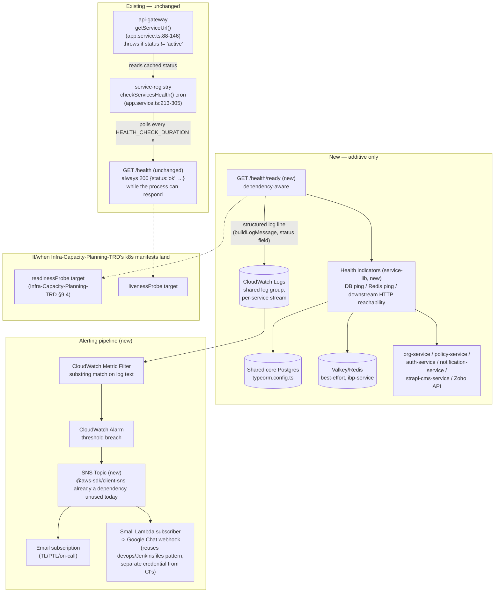
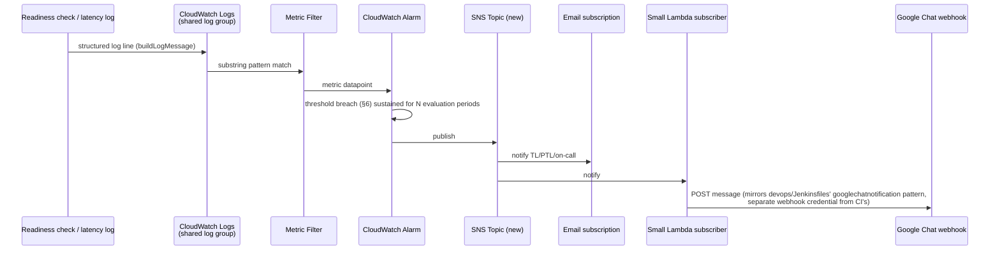

# PERF-OBS-01 — Health Check: Key Areas, Thresholds & Alerting — Technical Requirements Document

**Module:** PERF-OBS-01
**Product:** IBP (Integrated Benefits Portal) — primary scope per the source item; shared-service dependencies (`org-service`, `policy-service`, `auth-service`) noted where IBP's health depends on them
**Client:** IIRM
**Stage:** 40b — Module TRD
**Mode:** Brownfield (an existing, running health-check mechanism is extended — every change below is designed to not break it mid-rollout)
**Authored:** 2026-07-29
**Audience:** Backend developers, DevOps, TL/PTL sign-off
**Source:** Implements item 11 of [Performance-Action-Items.md](./Performance-Action-Items.md) (24-Jul-2026 Technical Head meeting) — "11. Health Check: (1) Identify the key areas of the IBP Portal for health check, (2) Set the thresholds, (3) Any deviations, then send alerts."

This TRD is grounded entirely in code read directly from this repo. Every claim about current behavior cites a file and, where useful, a line range. Where a claim can't be verified from this repo (e.g. what's actually set in a deployed environment's `.env` file, which isn't committed), it's called out explicitly as unconfirmed rather than assumed.

---

## 1. Scope

**This TRD designs:**
- A dependency-aware readiness check for `ibp-service` and the shared services it depends on (`org-service`, `policy-service`, `auth-service`), replacing the hardcoded `{ status: 'ok' }` liveness stub as the *only* signal of health.
- The specific "key areas" of the IBP Portal worth checking, enumerated from `ibp-service`'s real module list — not a generic checklist.
- Concrete starting thresholds for those key areas, and the methodology for deriving real numbers rather than guessing them.
- A near-term alerting pipeline built on what already exists (CloudWatch logging, the Jenkins Google Chat webhook) rather than assuming a new observability stack.
- The exact backward-compatibility contract for `service-registry` and `api-gateway`, both of which already depend on today's single-route health check for real routing decisions (§2.5) — this is the central brownfield constraint the whole design works around.

**Explicit non-goals (out of scope for this TRD):**
- Introducing Prometheus/Grafana — treated as a heavier alternative and an open question (§7.3, [Open Questions](#13-open-questions)), not a given.
- Kubernetes manifests, `readinessProbe`/`livenessProbe` YAML — no k8s manifests exist in this repo today; [Infra-Capacity-Planning-TRD.md](./Infra-Capacity-Planning-TRD.md) owns introducing infra-as-code, and its §9.4 already names this TRD as the upstream dependency for what those probes should target. This TRD designs the HTTP contract those probes will eventually consume; it does not write the probe YAML itself.
- Fixing the DB connection-pool sizing or partitioning/indexing — [DB-Partitioning-Indexing-TRD.md](./DB-Partitioning-Indexing-TRD.md)'s remit.
- Converting reports to SQL functions — [SQL-Functions-Reports-TRD.md](./SQL-Functions-Reports-TRD.md)'s remit; this TRD only consumes whatever report-latency telemetry that effort produces (its own §11 already names this TRD as the consumer).
- Redesigning `service-registry`'s storage/registration model or `api-gateway`'s routing logic — both are treated as existing contracts to preserve, not rebuild.

---

## 2. Current State — What Exists, What Doesn't

### 2.1 The shared, shallow health endpoint

Every NestJS service in this repo gets its health endpoint from the same shared module. `apps/services/service-lib/src/lib/health/health.controller.ts` is a 15-line `@Controller('health')` with a single `@Get()` route that delegates to `apps/services/service-lib/src/lib/health/health.service.ts`:

```ts
// health.service.ts (verbatim, in full)
@Injectable()
export class HealthService {
    healthCheck() {
        return { status: 'ok' };
    }
}
```

No DB check, no Redis check, no downstream check — the response is a compile-time constant. Both classes are registered once, in `apps/services/service-lib/src/lib/service-lib.module.ts` (`controllers: [HealthController]`), and every consuming service pulls this in transitively via `InsuranceWellnessHubServiceLibModule`, which appears in the `imports` array of `ibp-service`, `auth-service`, and every other backend service's `app.module.ts`. There is exactly one implementation of this health check across the whole platform today — which is good news for this TRD, since a fix to the shared module upgrades every service at once rather than needing 12 separate changes.

### 2.2 The registration contract with `service-registry`

Every service's `app.module.ts` registers itself with `service-registry` inside `onModuleInit()`, declaring a name, URL, port, and a `healthCheck` path. Reading the actual registrations across all 12 services that call this:

| Service | `healthCheck` path declared in `app.module.ts` |
|---|---|
| `auth-service` | `/health` (`app.module.ts:66`) |
| `org-service` | `/health` (`app.module.ts:64`) |
| `opportunity-service` | `/health` (`app.module.ts:37`) |
| `knowledge-service` | `/health` (`app.module.ts:25`) |
| `scheduler-service` | `/health` (`app.module.ts:213`) |
| `report-service` | `/health` (`app.module.ts:28`) |
| `ai-service` | `/health` (`app.module.ts:55`) |
| `config-service` | `/api/health` (`app.module.ts:42`) |
| `policy-service` | `/api/health` (`app.module.ts:42`) |
| `document-service` | `/api/health` (`app.module.ts:47`) |
| `ibp-service` | `/api/health` (`app.module.ts:50`) |
| `notification-service` | `/api/health` (`app.module.ts:28`) |

### 2.3 A real, verified bug this TRD works around rather than silently inherits

The `/health` vs `/api/health` split in the table above turns out not to matter, for a reason worth stating plainly because it shapes this TRD's rollout design (§9): the shared registration helper both groups actually call, `ServiceRegistrationService.registerService()` in `apps/services/service-lib/src/lib/service-communication.ts:8-25`, **hardcodes the health path it sends to `service-registry` and ignores whatever the caller declared**:

```ts
async registerService(service: any) {
  const serviceInfo = {
    name: `${service.name}`,
    url: `${service.url}`,
    port: `${service.port}`,
    healthCheck: '/health',        // <- always this, regardless of service.healthCheck
    status: service.status,
  };
  ...
}
```

So whatever `service-registry` actually stores as each service's `healthCheck` is `/health`, full stop — the `/api/health` values `ibp-service`, `config-service`, `policy-service`, `document-service`, and `notification-service` declare in their own `app.module.ts` are dead values, never transmitted.

This is currently harmless for those five services specifically, because none of them ever calls `app.setGlobalPrefix()` — they all bootstrap via the shared `apps/services/service-lib/src/lib/common-bootstrap.ts`, which does not set a global prefix anywhere in its body. `HealthController`'s route is therefore always the literal `/health`, regardless of what any `app.module.ts` believes it registered. The hardcode and the real route happen to agree by accident.

They do **not** agree for `report-service`: its `main.ts` bypasses `CommonBootstrap` entirely, calls `NestFactory.create()` directly, and sets `app.setGlobalPrefix('api')` itself (`apps/services/report-service/src/main.ts:14-16`) — so its real, live route is `/api/health`. Its `app.module.ts:28` declares `/health` (matching the shared hardcode, both wrong). If `service-registry`'s active polling (§2.4) is running against `report-service` in an environment where this matters, it is polling a 404 and would mark `report-service` `inactive` — which, per §2.5, means `api-gateway` refuses to route *any* traffic to it. `report-service`'s own file header says "This is not a production server yet! This is only a minimal backend to get started," which may well mean this has no real-world impact today — but the mechanism is real and independently verified, not hypothetical, and it directly informs why this TRD does not touch that hardcode as a side effect (§9.4) and instead flags it as a standalone fix.

There is also a second, unrelated, unused copy of a registration service at `apps/services/ibp-service/src/app/services/service-registration.service.ts` — it implements `OnModuleInit`/`OnModuleDestroy` with its own `registerService`/`unregisterService`, but it is never imported by `ibp-service`'s `app.module.ts` or any other module (`grep` confirms zero references outside its own file) — dead code. It also has its own bug (its `unregisterService()` hardcodes the path `.../unregister/auth-service` regardless of which service is calling it), but since nothing wires it up, it's inert. Flagged here only so nobody mistakes it for the live registration path when working in this area.

### 2.4 `service-registry`'s active health polling

`apps/services/service-registry/src/app/app.service.ts:213-305` already runs a `@Cron` job, `checkServicesHealth()`, on an interval of `ENV.HEALTH_CHECK_DURATION || 20` seconds. It only runs its real branch when `this.storageType === "valkey"` (i.e. the registry is backed by Redis/Valkey rather than the in-memory fallback); whether that's actually the storage mode in any deployed environment isn't confirmed from this repo (env files aren't committed) and is called out as [Open Question 2](#13-open-questions). When it does run, for every registered service it does:

```ts
const res = await axios.get(service.url + service.healthCheck);
service.status = "active";     // on any 2xx
// ...
service.status = "inactive";   // on any thrown error (axios throws on non-2xx)
```

This is the platform's one existing active health-polling mechanism, and it works purely off HTTP status code — it never inspects the response body. That fact is load-bearing for this TRD's backward-compatibility design (§5.1, §9).

### 2.5 The hidden circuit breaker: `api-gateway`'s `getServiceUrl()`

This is the single most important current-state fact for this TRD's design, and it is not something the source action item mentions — it was found by reading the actual routing code. `apps/services/api-gateway/src/app/app.service.ts:88-146`, `getServiceUrl()`, is called by every one of `api-gateway`'s ~20 proxy routes before forwarding a request (`app.controller.ts`, repeated at lines 128, 205, 314, 413, 511, ... 2077). It fetches the service record from `service-registry` and does this:

```ts
} else if (service.status !== 'active') {
  ...
  throw new Error(`Service ${serviceName} is down`);
}
```

In other words: the `status` field that §2.4's cron flips based on a plain HTTP GET to the health path is a **hard circuit breaker for all business traffic**, not just a monitoring signal. If `checkServicesHealth()` ever marks `ibp-service` (or any service) `inactive`, `api-gateway` stops routing to it entirely — every request, not just health-check requests.

This is why a naive version of "make the health check dependency-aware" — e.g. having the *same* `/health` route return a 503 whenever the DB is momentarily slow — would be dangerous in this specific codebase: a transient DB blip would flip `status` to `inactive` within one `HEALTH_CHECK_DURATION` window (as fast as 20 seconds) and `api-gateway` would black-hole all traffic to that service until the next successful poll. §5 designs around this directly.

### 2.6 What's confirmed absent

- **No `@nestjs/terminus` anywhere** in this repo (`package.json` search across every service, and no import anywhere in `apps/services` or `libs`).
- **No Prometheus, Grafana, or Alertmanager configuration anywhere.** A repo-wide search turns up exactly the incidental hits already documented in the sibling TRDs' own grounding (`SQL-Functions-Reports-TRD.md:117`, `Infra-Capacity-Planning-TRD.md:48`) plus one unrelated comment in a template-management spec doc describing what Prometheus integration "would" look like — not real code.
- **No Kubernetes manifests** — confirmed separately by [Infra-Capacity-Planning-TRD.md §2](./Infra-Capacity-Planning-TRD.md), cross-referenced rather than re-derived here.
- **No readiness/liveness distinction anywhere** — one route, one static response, regardless of caller intent.

### 2.7 What's confirmed present and reusable

- **CloudWatch logging is real and already wired.** `apps/services/service-lib/src/lib/logger.ts` conditionally adds a `WinstonCloudWatch` transport (lines 65-67) when `ENV.CLOUD_WATCH_LOG === 'true'`. All services share one log group (`cloudwatchConfig.logGroupName: ENV.LOG_GROUP_NAME`, `logger.ts:16`), but each gets its own daily log stream (`` `${serviceName}-${date}` ``, `logger.ts:42-44`) — so a service-scoped CloudWatch query/metric filter is possible via the log-stream-name prefix, not just the log group. Nearly every service's structured log line is built by `buildLogMessage()` (`apps/services/service-lib/src/lib/utils/logger.util.ts`), which always includes a `status: 'success' | 'failure'` field. The persisted CloudWatch line shape is `` `[Logger] {timestamp} [{level}]: {json-stringified LogData}` `` (per `logger.ts`'s `LoggerFormat` printf combined with `buildLogMessage`'s `JSON.stringify` output) — i.e. the line is *not* a single top-level JSON object, it's a bracketed text prefix with an embedded JSON substring. This matters for §7: CloudWatch Metric Filters against this format need simple substring patterns (e.g. matching the literal text `"status":"failure"`), not JSON-syntax filter patterns (`{ $.status = "failure" }`), which require the whole log event to parse as JSON at the top level.
- **`@aws-sdk/client-sns` is already a direct dependency** (`package.json`, alongside `@aws-sdk/client-cloudwatch-logs` and `@aws-sdk/client-ses`) — but a repo-wide `src`-only search finds zero actual usage anywhere. This is not evidence of an existing SNS integration; it's an available, already-approved building block nobody has wired up yet, which is a meaningfully smaller ask than introducing a brand-new AWS dependency (§7.2).
- **A Google Chat webhook is already integrated and watched**, for CI notifications: `devops/Jenkinsfiles/Jenkinsfile-Backend-dev:31` defines `GOOGLE_CHAT_LINK` (a Chat API webhook URL) and line 401 calls the `googlechatnotification` Jenkins plugin step with it on every build's pass/fail. The same pattern is repeated identically across every environment's backend and frontend Jenkinsfile. This is CI notification, not application/ops alerting, but it's a channel the org already watches — a candidate delivery target for the new alerting pipeline (§7.2), reusing the mechanism, not the specific CI credential.
- **No PagerDuty, Slack, or email-notification dependency found** in any `package.json` in this repo (`pagerduty`, `slack`, `@slack`, `nodemailer`, `sendgrid` all searched, zero hits) — so Google Chat (reused) and plain email via SNS/SES are the only two channels this TRD can build on without introducing a brand-new vendor integration.

---

## 3. Architecture Overview

The design adds exactly one new capability to the existing shared health module, plus a new (currently unused-by-anything) observability path alongside the existing polling/routing path — it does not touch `service-registry`'s storage model, `api-gateway`'s routing logic, or the registration contract in §2.2/§2.3 at all.



The key structural decision: **`/health` (liveness) is never modified in status-code behavior.** `service-registry`'s cron and `api-gateway`'s circuit breaker keep reading exactly what they read today. Everything dependency-aware lives behind a brand-new route that nothing existing polls yet — so this TRD's entire "Set the thresholds / send alerts" mandate is delivered without touching the one piece of code (§2.5) that can black-hole production traffic if handled carelessly.

---

## 4. Key Areas — IBP Portal Health-Check Scope

The source item says "the IBP Portal," not "the platform" — scope follows `ibp-service`'s actual module list (`apps/services/ibp-service/src/app/*`) plus the shared services it genuinely depends on, not a generic list invented for this document.

### 4.1 `ibp-service`'s own modules

| Module | Real dependency found | Why it's a key area |
|---|---|---|
| `hr-module` (`hr.module.ts`, `hr.controller.ts`, `hr.service.ts`, `hr.repository.ts`) | Shared core Postgres (raw SQL via `hrRepository.query()`); optional Redis (best-effort lock/cache, `hr.service.ts:737-778`) | `generateReport()` (`hr.service.ts:816-937`) is a known heavy path: dynamic raw-SQL report execution against `admin_reports.query`, already carrying its own in-memory stampede-protection caches (`resultPending`, `reportMetaCache`, `hrCtxCache`) precisely because it's expensive. `downloadReport()` reuses the same path. This is the single most report-latency-sensitive surface in `ibp-service`. |
| `company-employee` (`company-employee.module.ts`, `.service.ts`, `.repository.ts`, `tpa-sso-executor.service.ts`) | Shared core Postgres; owns the `TypeOrmModule.forRoot(typeOrmConfig)` call for `ibp-service` (`company-employee.module.ts:75`) | Employee/claims data surface; `tpa-sso-executor.service.ts` executes TPA single-sign-on flows — an external-reachability-adjacent path worth the same latency/error-rate telemetry as Zoho, once instrumented. |
| `onboarding` (`onboarding.module.ts`, `.service.ts`, `.repository.ts`) | HTTP calls to `strapi-cms-service` (`onboarding.service.ts:224`, `getStrapiBaseUrl()` + `axios.get`) and directly to `notification-service` (`onboarding.service.ts:1535`, `axios.post(this.notificationServiceUrl, ...)`) for company-branding lookups and life-event/enrollment email notifications | Two real downstream dependencies, both internal microservices. The Strapi call already degrades gracefully (`if (!strapiBaseUrl) return {}`, `onboarding.service.ts:218-221`) — worth preserving that softness in how its health check is weighted (§6). |
| `zoho-integration` (`zoho-integration.module.ts`, `.service.ts`, `.repository.ts`, `zoho-people-api.service.ts`) | External OAuth2 + REST calls to Zoho People (`accounts.zoho.in` for token exchange, `zoho-integration.service.ts:43-90`) | The one genuinely external (outside IIRM/Divami's own infra) dependency in IBP's scope. Per-company OAuth tokens (keyed by `companyId`, not global) mean a generic synthetic "ping Zoho" check isn't meaningful without a specific company's valid token — this key area is better served by error-rate/latency telemetry from real sync calls (§6) than a synthetic probe. |
| `services/service-registration.service.ts` | — | Dead code (§2.3) — not a health-check target, flagged only so it isn't mistaken for a live component. |

### 4.2 Shared services IBP depends on

Per the source item's own framing and the confirmed scope handed down for this TRD: `org-service`, `policy-service`, and `auth-service` are shared infrastructure IBP's flows sit on top of (company/org data, policy data, and authentication respectively), reached today via direct HTTP or through `api-gateway`. These get the same shared-module health upgrade (§5) as `ibp-service` itself, since they're built on the same `service-lib`. This TRD does not redesign their internals — it only adds the same dependency-aware readiness check to each, using each service's own real dependencies (their own DB connection via `typeOrmConfig`/`orgServiceTypeOrmConfig`, and whatever downstream calls each already makes).

### 4.3 Redis — present, but explicitly non-critical for IBP

`ibp-service`'s own code already treats Redis as optional and best-effort, not a hard dependency: `hr.service.ts`'s `tryAcquireRedisLock()`, `setTpaFetchTimestamp()`, and `getTpaFetchTimestampFromRedis()` all guard with `if (!this.redis) { ... proceed without lock/cache ... }` and catch-and-continue on any Redis error (`hr.service.ts:737-778`). This TRD's design honors that existing decision rather than overriding it: Redis reachability is checked and reported, but a Redis outage marks the relevant check `degraded`, never flips `ibp-service`'s overall readiness to `down` (§5.4, §6).

---

## 5. Health-Check Design

### 5.1 `/health` (liveness) — unchanged, on purpose

The existing route, response shape, and status-code behavior are preserved exactly: `GET /health` continues to return HTTP 200 with a JSON body as long as the Nest process is up and can handle an HTTP request. The body may gain *additive* fields (e.g. `uptimeSeconds`, `service` name, `version`) since neither `service-registry`'s cron (§2.4, checks status code only, never the body) nor any other known consumer parses the body today — but the `status` key stays present and stays `'ok'` under the same conditions it is today. This is what makes the rollout in §9 backward compatible by construction rather than by careful sequencing: nothing about the contract `service-registry` and `api-gateway` depend on (§2.4, §2.5) changes.

### 5.2 `GET /health/ready` (new) — dependency-aware readiness

A new route on the same `HealthController`, added once in `service-lib`, inherited by every consuming service exactly like `/health` is today:

```ts
@Controller('health')
export class HealthController {
  constructor(private healthService: HealthService) {}

  @Get()
  check() {
    return this.healthService.healthCheck(); // unchanged
  }

  @Get('ready')
  async ready(@Res() res: Response) {
    const result = await this.healthService.readinessCheck();
    res.status(result.status === 'down' ? 503 : 200).json(result);
  }
}
```

Nothing polls this route today — it exists for a human/dashboard/CloudWatch-canary consumer, and later for a Kubernetes `readinessProbe` once [Infra-Capacity-Planning-TRD.md](./Infra-Capacity-Planning-TRD.md)'s manifests exist. Its own failure can never affect `api-gateway` routing or `service-registry`'s active-service list, because nothing wires it into either yet.

### 5.3 Technology choice: a small hand-rolled indicator pattern, not `@nestjs/terminus`

| Choice | Justification | Alternative considered |
|---|---|---|
| A small internal `HealthIndicator` interface (`{ name, critical, check(): Promise<{status, latencyMs?, details?}> }`), registered per-service via a multi-provider DI token (`HEALTH_INDICATORS`), consumed by one shared `HealthService.readinessCheck()` in `service-lib` | The actual surface needed — a DB ping, an optional Redis ping, and a handful of HTTP reachability checks — is small enough to hand-roll in well under 150 lines, and it lets each service register only the indicators it actually has (mirroring how each service's own `app.module.ts` already customizes its own `serviceInfo` at registration time, §2.2) rather than a one-size-fits-all check. Matches this codebase's stated preference (see `NFR-USA-025_TRD.md §8`) for keeping the dependency surface small where an existing pattern already covers the need. | `@nestjs/terminus` — the standard NestJS ecosystem tool for exactly this (`TypeOrmHealthIndicator`, `HttpHealthIndicator`, `MemoryHealthIndicator`), and arguably the more idiomatic long-term choice. Not adopted by default here only because it's a brand-new dependency with zero prior usage in this repo (§2.6) — flagged as [Open Question 5](#13-open-questions) rather than decided unilaterally, since a reasonable TL/PTL call could go either way. |
| `ai-utility-service` (Python/FastAPI) is out of this pattern's reach | It's the one non-NestJS backend service; it already has its own logging equivalent (`ai-utility-service/src/logger.py`, per the confirmed grounding for this TRD). It is not in IBP's dependency scope (§4) today, so this TRD does not design its health contract — flagged only so a future extension knows the pattern needs a FastAPI-native mirror (same JSON shape, same `/health` + `/health/ready` routes), not a NestJS one. | — |

### 5.4 Response contract

```jsonc
// GET /health  (unchanged shape, additive fields only)
{ "status": "ok", "service": "ibp-service", "uptimeSeconds": 481233 }

// GET /health/ready
{
  "status": "ok",           // "ok" | "degraded" | "down"
  "service": "ibp-service",
  "timestamp": "2026-07-29T10:15:00.000Z",
  "checks": {
    "database":            { "status": "up",   "latencyMs": 8,  "critical": true  },
    "redis":               { "status": "down", "latencyMs": null, "critical": false, "detail": "best-effort cache, not blocking" },
    "zoho":                { "status": "up",   "note": "error-rate telemetry, not a synthetic probe (see §4.1)" },
    "strapiCmsService":    { "status": "up",   "latencyMs": 340, "critical": false },
    "notificationService": { "status": "up",   "latencyMs": 210, "critical": false }
  }
}
```

**Overall-status rule, stated explicitly because it's the design's central safety property:** only checks marked `critical: true` (a service's *own* datastore) can flip the top-level `status` to `down` (→ HTTP 503). Downstream/optional checks (Redis, other microservices, external APIs) can only produce `degraded` at most — they're informational for dashboards and alerting (§7), never a reason for this service's own readiness to fail. This deliberately avoids a cascading-failure anti-pattern where one microservice's blip marks every service that merely *calls* it as "not ready" — which, if this endpoint is ever wired into `service-registry` or a k8s `readinessProbe` later, would otherwise turn a single dependency hiccup into a platform-wide outage.

---

## 6. Thresholds

### 6.1 Derivation methodology — not arbitrary numbers

Every number below is a **starting point to validate against real data**, not a final answer, for two reasons this repo already establishes: (1) [Performance-Action-Items.md item #2](./Performance-Action-Items.md#2-pre-prod-record-the-zero-state-baseline) is capturing a documented zero-state baseline (pod resource usage, DB connection counts, autovacuum stats) specifically so later performance work has real numbers to compare against — this TRD's resource/connection thresholds should be revised the moment that baseline lands; (2) the platform already has one hard, enforced number worth anchoring latency thresholds against: `common-bootstrap.ts`'s global `TimeoutInterceptor`, defaulting to `REQUEST_TIMEOUT_MS = 10000` (10 seconds) — any request already fails for the user at that point today, so a WARN threshold set close to or above 10s is useless (the user already saw a failure before the alert would fire).

### 6.2 Starting thresholds by key area

| Key area | Metric | WARN | CRITICAL | Basis |
|---|---|---|---|---|
| `ibp-service` DB (shared core Postgres, `typeorm.config.ts`) | Ping (`SELECT 1`) latency | > 200ms | > 500ms, or ping fails within 2s | No pool size is configured in `typeorm.config.ts` (falls to `pg`'s default `max: 10` per pod, per [Infra-Capacity-Planning-TRD.md §9.3](./Infra-Capacity-Planning-TRD.md)) — a ping that can't acquire a connection at all is a stronger signal than latency alone once that ceiling is under pressure. |
| Redis (`ibp-service`, optional) | Ping latency | > 100ms | Unreachable | Never critical per §4.3/§5.4 — informational only. |
| Report generation (`hr.service.ts generateReport`/`downloadReport`) | p95 query duration | > 3s | > 7s | Anchored below the enforced 10s request timeout (§6.1) so the alert fires *before* users see a failure, not after. Starting numbers to be replaced once [SQL-Functions-Reports-TRD.md Open Question 1](./SQL-Functions-Reports-TRD.md#10-open-questions)'s recommended duration-log instrumentation around `hrRepository.query(finalQuery)` actually lands — that TRD's own §11 names this TRD as the consumer of that telemetry. |
| BizDone/Dashboard endpoints (`policy-service`, e.g. `getPolicyDashboardDetails`) | p95 query duration | > 3s | > 7s | Same anchor as report generation; [BizDone-Dashboard-Performance-TRD.md §11](./BizDone-Dashboard-Performance-TRD.md) already flags these as "among the platform's most expensive read paths" and asks this TRD to fold them in. |
| `strapi-cms-service` reachability (from `onboarding.service.ts`) | Response time | > 1s | > 3s, or timeout at 5s | `onboarding.service.ts` itself uses a 100000ms (100s) axios timeout for this call today (`onboarding.service.ts:225-227`) — that's a request-level safety net, not a health threshold; the health-check threshold here is deliberately much tighter since it's meant to catch degradation early, not merely prevent a hang. |
| `notification-service` reachability (from `onboarding.service.ts`, platform-wide) | Response time / error rate | > 1s / > 2% of calls failing in 5 min | > 3s / > 10% failing in 5 min | Not gating for `ibp-service`'s own readiness (§5.4) — but its own error/latency numbers matter directly, since a degraded `notification-service` is a business-visible failure (HR communications, life-event emails) regardless of `ibp-service`'s status. |
| Zoho integration | Error rate (log-derived, §7.1), not a synthetic ping | > 5% of sync attempts failing in 15 min | > 20% failing in 15 min, or any `reauth_status`-equivalent hard-auth failure | Per §4.1 — no meaningful synthetic probe exists for a per-tenant OAuth integration; this is telemetry off real calls. |
| CPU/memory (any service) | — | — | — | **Not designed here.** No Prometheus/metrics adapter exists (§2.6); the only available signal is `kubectl top pods`, which isn't continuously scraped anywhere today. CloudWatch Container Insights (if enabled on the EKS cluster — unconfirmed from this repo) is the plausible substrate; this is explicitly [Infra-Capacity-Planning-TRD.md](./Infra-Capacity-Planning-TRD.md)'s territory, cross-referenced rather than re-solved here. |

Every threshold above should be re-derived once the zero-state baseline (item #2) and per-report latency instrumentation (SQL-Functions-Reports-TRD's Open Question 1) actually produce numbers — treat this table as the hypothesis the baseline capture is meant to test, not a final spec.

---

## 7. Alerting Pipeline

### 7.1 Substrate: CloudWatch Metric Filters on the existing log group

Since CloudWatch logging is already wired (§2.7) and Prometheus/Grafana is not, the near-term path reuses what exists rather than standing up a new stack:

1. A **CloudWatch Metric Filter** per key area, scoped to `ENV.LOG_GROUP_NAME`'s shared log group, using a *substring* pattern (not a JSON-syntax pattern — see §2.7's caveat about the actual line shape) — e.g. a filter matching `"status":"failure"` combined with a log-stream-name prefix (`ibp-service-*`) to scope it per service, or a filter matching a specific `location`/`method` value already present in the JSON payload (e.g. `"location":"HR-MODULE HrService"` if the readiness/report-latency code emits one, matching the existing `buildLogMessage()` convention used everywhere else in this codebase).
2. Each readiness check (§5.2) and each instrumented latency point (report generation, BizDone dashboard queries) logs its result through the existing `createLogger()`/`buildLogMessage()` path — reusing the established `status: 'success' | 'failure'` field rather than inventing a new logging convention.
3. A **CloudWatch Alarm** on each metric filter's resulting metric, with the thresholds from §6.

**Nice-to-have, not required for this TRD to land:** emitting a single, top-level, pure JSON log line (dropping the `[Logger] {timestamp} [{level}]:` text prefix, §2.7) would unlock JSON-syntax metric filters and per-field metric extraction, which is materially more powerful than substring matching. Flagged as [Open Question 6](#13-open-questions) rather than bundled into this TRD's scope, since it's a change to every service's log output format, not just the health-check surface.

### 7.2 Delivery channels



- **SNS topic**: new, but built on an already-approved dependency (`@aws-sdk/client-sns`, present in `package.json`, unused today, §2.7) — a smaller ask than introducing a new AWS service from scratch.
- **Email**: zero new infrastructure — a direct SNS subscription.
- **Google Chat**: reuses the *mechanism* already proven in `devops/Jenkinsfiles/Jenkinsfile-Backend-dev:401` (a webhook POST to a Chat space), via a small Lambda SNS subscriber — deliberately **not** the same webhook URL/credential the CI pipeline uses, to avoid mixing build-notification traffic with ops-alert traffic in one space and one secret. Whether ops alerts should land in the same Chat space as CI notifications, or a new dedicated one, is [Open Question 7](#13-open-questions).
- **Deliberately not routed through `notification-service`**: `notification-service` is itself one of the things being monitored (§6) — an alerting path that depends on the platform's own services being healthy to report that the platform is unhealthy is a circular design; SNS → email/Chat sidesteps that entirely.

### 7.3 Prometheus/Grafana — heavier alternative, not assumed

A real Prometheus + Grafana + Alertmanager stack would give richer dashboards, PromQL-based alerting, and a natural home for the resource-threshold gap in §6.2 — but it's a new, standalone infrastructure decision (metrics-server/exporter sidecars, a Prometheus deployment, ongoing operational ownership) on top of a repo that has none of it today (§2.6), and it duplicates part of what CloudWatch already does for logs. This TRD does not assume that stack gets adopted. Whether it should be evaluated as a follow-on initiative — separate from this TRD's near-term CloudWatch-based pipeline — is [Open Question 4](#13-open-questions).

---

## 8. Testing Strategy

| Layer | Coverage target |
|---|---|
| Unit — indicator classes | Each `HealthIndicator` (DB, Redis, HTTP-downstream) returns the correct `{status, critical}` shape on both success and simulated failure (mocked client/axios rejection). |
| Unit — `readinessCheck()` aggregation | A critical-indicator failure flips overall `status` to `down`; a non-critical-indicator failure flips it to `degraded`, never `down` — directly testing the anti-cascade rule in §5.4. |
| Integration — DB dependency kill, dev/preprod only | Stop/block the dev or preprod Postgres instance (or revoke the app's DB user temporarily) → confirm `/health/ready` flips to `down` within one check cycle → confirm `/health` (liveness) is **unaffected** and still returns 200 → confirm no change in `service-registry`'s stored `status` for that service (proving §5.1's non-interference claim empirically, not just by code inspection). |
| Integration — Redis dependency kill, dev/preprod only | Stop the Valkey/Redis instance → confirm `/health/ready` reports `redis: down` but overall `status` stays `ok` or `degraded`, never `down` — directly testing §4.3's non-critical treatment. |
| Integration — downstream service kill (e.g. stop `strapi-cms-service` in dev) | Confirm `ibp-service`'s `/health/ready` reports the downstream check as failing but its own overall status is unaffected (§5.4's anti-cascade rule again, this time for a real inter-service call rather than a datastore). |
| Alerting — end-to-end in dev/preprod only, never prod | Force a threshold breach (e.g. artificially slow a query past the WARN threshold, or hold the DB kill from above for long enough) → confirm the CloudWatch Metric Filter increments → confirm the Alarm fires → confirm the SNS → email/Chat delivery actually arrives. This validates the full pipeline, not just the check logic. |
| False-positive-storm prevention | Every Alarm uses a **consecutive-evaluation-period** requirement (e.g. 2-3 consecutive breaches, not a single noisy datapoint) before transitioning to `ALARM` state — CloudWatch Alarms support this natively (`evaluationPeriods`/`datapointsToAlarm`). This is the mechanism that prevents one slow query or one transient network blip from paging someone; it should never be tuned to fire on a single sample in production, even though a single-sample test is useful in dev to prove the wiring works. |
| Never test dependency-kill scenarios in prod | All DB/Redis/downstream kill tests are dev/preprod only, by design — the whole point of §5.4's anti-cascade rule is that these tests should be safe to run without threatening prod traffic, but the tests themselves (stopping a real dependency) should still never be run against a live production dependency. |

---

## 9. Rollout Plan

### 9.1 Why this rollout is backward compatible by construction

Because `/health`'s status-code behavior never changes (§5.1) and `/health/ready` is a brand-new route nothing currently polls, there is no "old and new response shapes both accepted during a migration window" problem to solve the way a typical breaking-change rollout would need — `service-registry` and `api-gateway` are simply never touched. The rollout risk this TRD actually carries is much narrower: making sure the *new* route doesn't itself introduce a new failure mode (e.g. a readiness check that throws unhandled and crashes a request, or one that's slow enough to matter).

### 9.2 Staged rollout

1. **`service-lib` first, in isolation.** Land the `HealthIndicator` interface, the new `/health/ready` route, and unit tests (§8) in `service-lib` alone — no consuming service wires up any indicators yet, so `/health/ready` exists everywhere but reports "no checks configured" until each service opts in.
2. **`ibp-service` first among consumers**, since it's this TRD's primary scope (§1) — register its DB indicator, its optional Redis indicator, and its `strapi-cms-service`/`notification-service` reachability indicators. Validate in dev, then preprod, watching real `/health/ready` output for false positives before moving on.
3. **`org-service`, `policy-service`, `auth-service` next** — same pattern, each registering only the indicators relevant to its own real dependencies (§4.2).
4. **Wire up the alerting pipeline (§7) against preprod first**, running the integration tests in §8 for real before any Alarm is allowed to notify a human in production.
5. **Remaining services**, opportunistically, following the same per-service indicator-registration pattern — not blocking on this TRD's primary IBP scope.
6. At every stage, the existing `/health` route, `service-registry`'s polling, and `api-gateway`'s circuit breaker keep working exactly as they do today — nothing in this rollout requires a "flag day" cutover.

### 9.3 The `report-service` mismatch (§2.3) and the shared hardcode bug

Not required for this TRD's rollout, but adjacent enough to flag with a concrete recommendation: fixing `ServiceRegistrationService.registerService()` (`service-communication.ts:13`) to pass through `service.healthCheck` instead of hardcoding `/health` is a small, low-risk, independently-shippable fix — and it should ship *before* anyone ever adds `app.setGlobalPrefix()` to one of the five `/api/health`-declaring services, since that's the exact condition under which the hardcode would start actively breaking a service's registered health path (as it already does for `report-service`, §2.3). Recommended as a separate, small PR rather than bundled into this TRD's scope, so its blast radius (touching every service's registration call) stays independent of this TRD's readiness-check work. Whether to fix it now or defer is [Open Question 3](#13-open-questions).

### 9.4 Interaction with `Infra-Capacity-Planning-TRD.md`

That TRD's §9.4 already names this document as the upstream dependency for what its future `readinessProbe`/`livenessProbe` definitions should target — `livenessProbe` against `/health` (unchanged, §5.1), `readinessProbe` against `/health/ready` (new, §5.2). That TRD's §10.2 also notes that its daily pre-warm lead-time calculation should be set from how long a fresh pod takes to become `Ready` under these probes, once they exist — i.e. once this TRD ships and its indicators are live for the services in that TRD's HPA scope (`policy-service`, `opportunity-service`, `notification-service`, `scheduler-service`, `api-gateway`), that measurement becomes possible. This TRD does not write the probe YAML itself (§1, non-goals) — it only guarantees the HTTP contract is stable and ready to be pointed at.

---

## 10. Team Ownership — Developer vs Infra/DevOps

| Component | Owner | Notes |
|---|---|---|
| `HealthIndicator` interface + `HealthService.readinessCheck()` aggregation logic (`service-lib`) | **Developer** | Core library code, shared by every service. |
| Per-service indicator registration (`ibp-service`, `org-service`, `policy-service`, `auth-service`) | **Developer** | Each service's own `app.module.ts` (or equivalent) wires up only its real dependencies, mirroring the existing per-service `serviceInfo` customization pattern (§2.2). |
| Report/dashboard latency instrumentation (`hr.service.ts`, `policy-service` BizDone endpoints) | **Developer** | Coordinated with [SQL-Functions-Reports-TRD.md](./SQL-Functions-Reports-TRD.md) and [BizDone-Dashboard-Performance-TRD.md](./BizDone-Dashboard-Performance-TRD.md), which already name this TRD as the consumer of that telemetry. |
| CloudWatch Metric Filters + Alarms | **Infra/DevOps** | New CloudWatch configuration against the existing log group; no application code required beyond the log lines already emitted (§7.1). |
| SNS topic + subscriptions (email, Lambda) | **Infra/DevOps** | New AWS resources, built on the already-approved `@aws-sdk/client-sns` dependency. |
| Google Chat webhook credential for ops alerts (separate from CI's) | **Infra/DevOps** | New Chat webhook/space if a dedicated one is chosen ([Open Question 7](#13-open-questions)); do not reuse the CI credential in `devops/Jenkinsfiles`. |
| Zero-state baseline capture that this TRD's thresholds (§6) depend on | **DevOps** | Already assigned in [Performance-Action-Items.md item #2](./Performance-Action-Items.md#2-pre-prod-record-the-zero-state-baseline); this TRD consumes its output, doesn't re-do it. |
| Fixing the `ServiceRegistrationService.registerService()` hardcode (§9.3), if approved | **Developer** | Small, independent PR — not gated on this TRD's rollout. |
| Kubernetes `readinessProbe`/`livenessProbe` manifest definitions, once they exist | **Infra/DevOps**, targeting this TRD's endpoints | Owned by [Infra-Capacity-Planning-TRD.md](./Infra-Capacity-Planning-TRD.md); this TRD only guarantees the HTTP contract (§9.4). |
| On-call ownership for new alerts | **Unresolved** | [Open Question 1](#13-open-questions). |

---

## 11. NFR Design

| Requirement | Design decision |
|---|---|
| No regression to existing routing/circuit-breaker behavior | `/health`'s status code and polling semantics are provably unchanged (§5.1, §9.1) — the new capability lives entirely behind an unpolled route. |
| No cascading false "down" status from an optional dependency | Only `critical: true` indicators (a service's own datastore) can produce `status: down`; everything else caps at `degraded` (§5.4). |
| No false-positive alert storm | CloudWatch Alarms require consecutive evaluation periods before firing (§8); thresholds start conservative and are meant to be revised against real baseline data (§6.1), not tuned reactively after a first storm. |
| Alerting must survive a partial platform outage | The SNS → email/Chat path does not route through any of this platform's own services (specifically not `notification-service`, §7.2) — it can still notify humans even if the thing it's alerting about is a broad outage. |
| Every new capability has a traceable owner | §10's ownership table; no component is left ambiguous between Developer and Infra/DevOps. |

---

## 12. Cross-References to Sibling TRDs

- [DB-Partitioning-Indexing-TRD.md](./DB-Partitioning-Indexing-TRD.md) — owns fixing the unconfigured connection-pool ceiling this TRD's DB-ping threshold (§6.2) is sensitive to; a pool-exhaustion fix there should tighten, not loosen, the ping-latency thresholds proposed here.
- [SQL-Functions-Reports-TRD.md](./SQL-Functions-Reports-TRD.md) — its own §11 already names this TRD as the consumer of the per-report latency telemetry its Open Question 1 recommends instrumenting; §6.2's report-latency thresholds here are provisional until that telemetry lands.
- [Infra-Capacity-Planning-TRD.md](./Infra-Capacity-Planning-TRD.md) — its §9.4 and §10.2 already name this TRD as the upstream dependency for its future `readinessProbe`/`livenessProbe` targets and pre-warm timing measurement (§9.4 here).
- [Service-Split-TRD.md](./Service-Split-TRD.md) — if Risk Watch/IBP is split into separate deployment topology, each resulting service inherits the same `service-lib` health module and needs its own indicator registration (§9.2's pattern), not a redesign.
- [BizDone-Dashboard-Performance-TRD.md](./BizDone-Dashboard-Performance-TRD.md) — its own §11 already asks this TRD to fold in BizDone/Dashboard's expensive read paths as health-check thresholds; §6.2 does so directly.

---

## 13. Open Questions

1. **On-call ownership for new alerts.** Once SNS/CloudWatch Alarms are live (§7), who actually receives and acts on them — a specific rotation, or TL/PTL directly? This is a staffing/process decision, not an engineering one.
2. **Is `service-registry` actually running in `storageType === "valkey"` mode in any deployed environment today?** §2.4's entire active-polling mechanism (and therefore §2.5's circuit-breaker behavior) is conditional on this; it can't be confirmed from this repo since environment `.env` files aren't committed. Needed to know how live a risk §2.3's `report-service` mismatch actually is.
3. **Fix the `ServiceRegistrationService.registerService()` hardcode (§9.3) now, as a quick independent PR, or defer?** It's currently harmless for every service except the possibly-not-production `report-service`, but it's a live landmine for any future service that adds `app.setGlobalPrefix()`.
4. **Is Prometheus/Grafana adoption authorized as a follow-on initiative** (§7.3), separate from this TRD's near-term CloudWatch-based pipeline? Affects whether §6.2's resource-threshold gap gets closed via CloudWatch Container Insights or a full metrics stack.
5. **Hand-rolled `HealthIndicator` pattern (§5.3) vs. adopting `@nestjs/terminus`?** Both are reasonable; this TRD defaults to the smaller-dependency-surface option but the ecosystem-standard alternative is real and worth an explicit TL/PTL call rather than a unilateral default.
6. **Is standardizing on a pure single-line JSON log format** (dropping the `[Logger] {timestamp} [{level}]:` text prefix, §7.1) worth doing now to unlock JSON-syntax CloudWatch Metric Filters, or should this TRD's substring-matching approach ship first and that be a later improvement?
7. **Should ops alerts land in the same Google Chat space as CI build notifications, or a new dedicated space/webhook** (§7.2)? Affects whether a new Chat webhook credential needs provisioning.
8. **Threshold values in §6.2 need business input, not just engineering judgment** — e.g. is a 3s/7s report-latency WARN/CRITICAL split acceptable to whoever owns the HR/IBP user experience, or does the business have a tighter expectation that should override the "anchored below the 10s request timeout" engineering default?

---

## 14. Approval

Leave blank. TL/PTL sign-off authority.

```
Approved by:
Role:
Date:

Approved by:
Role:
Date:
```

---

# END OF TRD
