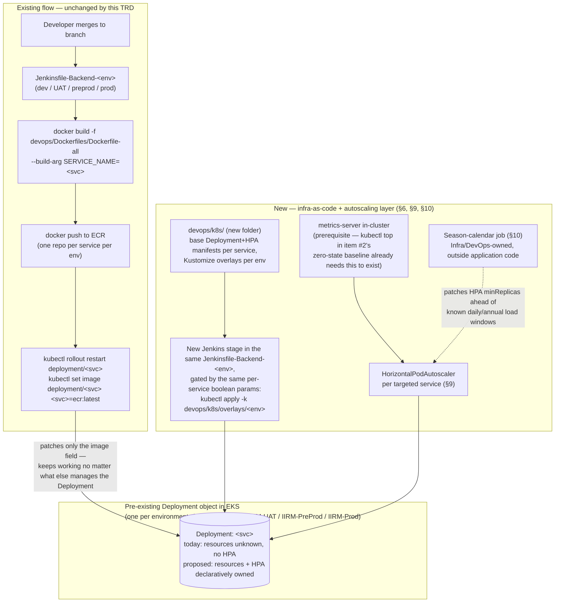
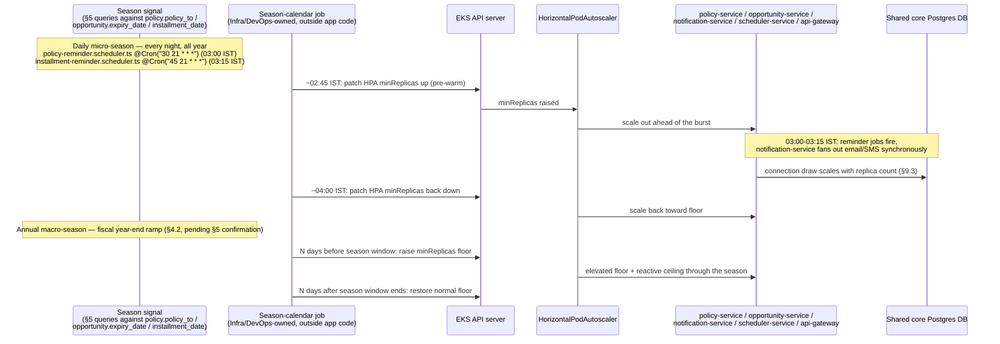

# PERF-INFRA-01 — Infra Capacity Planning: Season-Based Bumping & Right-Sizing — Technical Requirements Document

**Module:** PERF-INFRA-01
**Product:** iWork + IBP (shared backend, shared cluster)
**Client:** IIRM
**Stage:** 40b — Module TRD
**Mode:** Brownfield (changing resource allocation and introducing autoscaling on an already-running production cluster)
**Authored:** 2026-07-29
**Audience:** DevOps/Infra engineers, TL/PTL sign-off
**Source:** Implements items 8 and 9 of [Performance-Action-Items.md](./Performance-Action-Items.md) (24-Jul-2026 Technical Head meeting: "Infra - Season based bumping" and "Optimal allocate the memory/infra size based on the service operational usage rather than generic size for all")

This TRD is brownfield in the fullest sense: the Deployment objects it proposes to change already exist and are already serving production traffic, but their manifests are not version-controlled anywhere this team can see. Every design decision below is shaped by that constraint — the first real deliverable isn't a resource number, it's a place for resource numbers to live at all. Where a number or threshold can't be derived from this repo (because the metric doesn't exist yet), this document says so and proposes how to produce it, rather than inventing a plausible-looking value.

---

## 1. Scope

**This TRD designs:**
- How to empirically characterize and quantify IIRM's seasonal (and daily) load pattern from data already in the shared core database, since no historical infra-metrics stack exists to look at instead.
- A minimal infra-as-code (IaC) layer — where it lives, who owns it, how it is applied via the existing Jenkins pipelines — as the prerequisite for both season-based bumping and right-sizing to be anything other than one-off manual `kubectl` commands.
- A right-sizing methodology for per-service CPU/memory `requests`/`limits`, combining the zero-state baseline (item #2 of the parent [Performance-Action-Items.md](./Performance-Action-Items.md)) with a load-tested peak baseline.
- A Horizontal Pod Autoscaler (HPA) strategy for the services most exposed to the seasonal/daily spike identified in §4: `policy-service`, `opportunity-service`, `notification-service`, `scheduler-service`, `api-gateway`.
- A proactive, calendar-driven "season bump" layer on top of reactive HPA, for the specific load pattern this codebase's own schedulers reveal (see §4).
- Rollout and rollback plans appropriate to changing resource allocation on a live production cluster with no existing load-testing infrastructure.

**Explicit non-goals (out of scope for this TRD):**
- Choosing or introducing a full Terraform/Helm/CDK stack — this TRD proposes the smallest IaC surface that unblocks items 8/9 (plain manifests + Kustomize overlays), and explicitly flags "should this become a bigger IaC initiative" as an open question ([§16](#16-open-questions)), not a decision made here.
- Splitting `Dockerfile-all` into 14 per-service Dockerfiles — discussed and a recommendation given in [§8](#8-the-shared-image-question-dockerfile-all), but the final call is flagged for TL sign-off given the effort/benefit tradeoff.
- Database partitioning/indexing/connection-pool tuning as a design in its own right — that's [DB-Partitioning-Indexing-TRD.md](./DB-Partitioning-Indexing-TRD.md)'s job. This TRD only calls out where DB connection-pool exhaustion becomes a direct risk of scaling replica count (§10.3), and defers the fix to that TRD.
- Redesigning `notification-service`'s synchronous send path or SES/SMS Country cold-start latency — that's [§3 of Performance-Action-Items.md](./Performance-Action-Items.md#3-scs--notifications-first-call-latency), direct-action, already scoped separately.
- Health-probe design itself (liveness/readiness endpoints, thresholds) — that's [Health-Check-TRD.md](./Health-Check-TRD.md). This TRD only states what HPA/readiness needs from that work (§9.4) and treats it as a dependency, not something it designs.
- Service-Split's effect on this cluster's topology — [Service-Split-TRD.md](./Service-Split-TRD.md) may change which Deployments exist at all (e.g. an independent Risk Watch/IBP deployment); this TRD's IaC layer is designed to absorb new services as new manifests, not to pre-empt that decision.

---

## 2. Current State — What Exists, What Doesn't

Verified directly against this repo (not assumed):

| Area | State | Evidence |
|---|---|---|
| Kubernetes manifests / Helm / Terraform / Docker Compose | **None exist anywhere in this repo.** | Repo-wide search returned no `kind: Deployment`, no `HorizontalPodAutoscaler`, no `.tf`, no `docker-compose.yml`. |
| Compute platform | AWS EKS, one cluster per environment | `devops/Jenkinsfiles/Jenkinsfile-Backend-dev:27` (`EKS_CLUSTER_NAME = "IIRM-Dev"`), `-UAT:27` (`IIRM-UAT`), `-preprod:27` (`IIRM-PreProd`), `-prod:27` (`IIRM-Prod`) — four separate clusters, not four namespaces in one cluster. `aws eks update-kubeconfig` at line 76-77 of each. |
| Deploy mechanism | Imperative only: `kubectl rollout restart deployment/<svc>` + `kubectl set image deployment/<svc> <svc>=<ecr-image>:latest`, against **pre-existing** Deployment objects, per-service stage, gated by Jenkins boolean parameters | `devops/Jenkinsfiles/Jenkinsfile-Backend-dev` — e.g. lines 94-95 (apigateway), 134-135 (auth-service), 251-252 (policy-service); same pattern repeated in `-UAT`, `-preprod`, `-prod`. No `-n <namespace>` flag on any `kubectl` call — each environment is its own cluster, default namespace. |
| Current resource requests/limits | **Unknown from this repo.** Deployment objects exist in-cluster but their manifests aren't version-controlled anywhere visible here. | This is itself the core gap this TRD exists to close (§6). |
| Container image | One generic image for all 14 backend services, `devops/Dockerfiles/Dockerfile-all`, parameterized only by `ARG SERVICE_NAME` | `Dockerfile-all:9-18` — `ENV SERVICE=$SERVICE_NAME`, `nx build $SERVICE`, `pm2 start ... dist/main.js`. Base image `devops/Dockerfiles/Dockerfile:12-26` installs Chromium, LibreOffice, poppler/qpdf/p7zip **unconditionally**, for every service. |
| Autoscaling | **None exists.** No HPA object, no autoscaling-related code anywhere in this repo. | Repo-wide search for `HorizontalPodAutoscaler`/`autoscal` returned nothing outside this TRD. |
| Metrics/observability stack | No Prometheus/Grafana/APM found in this repo. | Confirmed by the same search that found no HPA — there is nothing for an HPA to read from except whatever the EKS control plane provides natively (`metrics-server`). See §9.1 for why this matters and how item #2 already tests for it. |
| DB connection pooling | Only `strapi-cms-service` sets an explicit pool (`STRAPI_DATABASE_POOL_MIN=2`, `STRAPI_DATABASE_POOL_MAX=10`, `apps/services/strapi-cms-service/config/database.ts:45-48`). Every other service's primary connection goes through the shared `typeOrmConfig` in `apps/services/service-lib/src/lib/database/typeorm.config.ts`, which sets **no** `poolSize`/`extra.max`/`extra.min` at all — it falls through to the `pg` driver default (`max: 10` per pool, i.e. per pod). A separate, narrower-use `dynamic-datasource.service.ts` (`apps/services/service-lib/src/lib/datasource/dynamic-datasource.service.ts:124-132`) does hardcode `poolSize: 10` / `extra.max: 10, min: 2` for its own dynamically-created connections, but that's a distinct code path from every service's primary `TypeOrmModule.forRoot`. | This means **every replica of every service is its own independent 10-connection pool against the shared core DB** — replica count and DB connection count are directly coupled, which matters the moment HPA scales anything out (§9.3, §10.3). |
| RDS Proxy | Referenced once, for a QA-automation database only, in preprod | `devops/Jenkinsfiles/Jenkinsfile-db:5` — `DBHost = 'iirm-preprod-database-proxy-1.proxy-....rds.amazonaws.com'`, `DBName = 'automation'`. **Not confirmed to exist in front of the shared core DB** that `policy-service`/`opportunity-service`/etc. actually use. |
| Service-level health polling | `service-registry` polls every registered service's own health path on an interval (`ENV.HEALTH_CHECK_DURATION`, default 20s) via plain `axios.get(service.url + service.healthCheck)` | `apps/services/service-registry/src/app/app.service.ts:213-305` (`checkServicesHealth`). This is an **application-level** registry check, not a Kubernetes liveness/readiness probe — the two are easy to conflate but serve different consumers (see §9.4). |

Bottom line: items 8 and 9 both presuppose a place to put "the infra size for service X" and "the season-driven scaling rule for service X." Neither place exists today. Everything in this TRD is built around creating that place first (§6), then filling it with real numbers (§7) and real rules (§9, §10) instead of guesses.

---

## 3. Architecture Overview

The existing image-build-and-deploy flow is left completely untouched. What's added is a parallel, declarative layer that the existing imperative commands now sit on top of, plus a new scheduled actor (owned by Infra, not application code) that nudges the autoscaler ahead of known load windows.



The one architectural decision worth calling out explicitly: **the Jenkins `kubectl set image` step keeps working unmodified.** It only ever touches the container image field of an existing Deployment. Once the Deployment's `resources`/`replicas`/labels are also under `kubectl apply` from `devops/k8s/`, the two commands don't conflict — `kubectl apply` establishes the declarative baseline (including the image tag at time of apply), and the subsequent imperative `kubectl set image` in the same or a later pipeline run just bumps the image on top of it. This is the same reasoning [NFR-USA-025_TRD.md §2](../NFRs/NFR-USA-025_MS-Teams_Tasks-Integrate/NFR-USA-025_TRD.md#2-architecture-overview) used for keeping synchronous HTTP rather than introducing a message bus: match the platform's existing pattern rather than replacing it wholesale.

---

## 4. Characterizing "Season" — What It Actually Looks Like Here

Item 8's example ("when policies are expiring, need to bump the infra/DB") is concrete enough to trace to real code and real columns, not a generic "load varies" statement.

**The two load-bearing date fields:**
- `policy.policy_to` — `apps/services/service-lib/src/lib/entities/policy.entity.ts:85-86` (`@Column({ name: "policy_to", type: "date" })`) — every policy's expiry date.
- `opportunity.expiry_date` — `apps/services/service-lib/src/lib/entities/opportunity.entity.ts:60-61` (`@Column({ name: "expiry_date", type: "date" })`) — the commercial-side expiry that (per `policy-reminder.repository.ts:38-46`) is joined to the policy that will eventually renew it.
- `policy_installments.installment_date` — read by `installment-reminder.repository.ts:62`, drives a second, independent due-date cadence tied to premium payment schedules rather than policy expiry.

**Two distinct timescales, both grounded in code, not assumption:**

1. **Daily micro-season — a fixed nightly window, every day, all year:**
   - `PolicyReminderScheduler.handlePolicyExpiryReminders` runs `@Cron("30 21 * * *")` — 03:00 AM IST — `apps/services/scheduler-service/src/app/scheduler/policy-reminder.scheduler.ts:34-35`.
   - `InstallmentReminderScheduler.handleInstallmentDueReminders` runs `@Cron("45 21 * * *")` — 03:15 AM IST — `apps/services/scheduler-service/src/app/scheduler/installment-reminder.scheduler.ts:34-35`.
   - Both query is a set-membership match, **not** a range: `(p.policy_to::date - NOW()::date)::int IN (:...reminderDays)` (`policy-reminder.repository.ts:38,74`) and the equivalent for installments (`installment-reminder.repository.ts:62,125`). `reminderDays` comes from `ENV.POLICY_REMINDER_DAYS` / `ENV.INSTALLMENT_REMINDER_DAYS` — an operator-configured CSV of exact day-offsets (e.g. "30,15,7,1"), not a continuous window. This means: for any single policy, reminder traffic isn't smooth — it fires in discrete waves at exactly those offsets before its own `policy_to` date. Then, synchronously in the same request path, each eligible row triggers one `axios.post` to `notification-service` (`policy-reminder.scheduler.ts:152-157`, `installment-reminder.scheduler.ts:164-169`), which is itself synchronous end-to-end (no queue — see [Performance-Action-Items.md §3](./Performance-Action-Items.md#3-scs--notifications-first-call-latency)). So every night at 03:00-03:15 AM IST, `scheduler-service` and `notification-service` both see a load burst whose *size* depends on how many policies currently sit at one of the configured day-offsets from expiry — which is a function of §4's macro-season below.
   - This is a genuinely daily event, 365 days a year, but its *amplitude* varies with how many policies cluster near their offsets on any given night.

2. **Annual/quarterly macro-season — expiry dates cluster around fiscal year-end:**
   - This codebase's own fiscal-year convention is April 1 → March 31, confirmed in `apps/services/service-lib/src/lib/utils/get-data-range.utils.ts:12-22` (`fiscalYearStartYear` logic; `FullYear` filter returns `Date.UTC(fiscalYearStartYear, 3, 1)` to `Date.UTC(fiscalYearStartYear + 1, 2, 31)` — April 1 to March 31). `policy.financial_year` (`policy.entity.ts:708-714`, `varchar(15)`) stores this per policy.
   - For an Indian insurance broker (IIRM), corporate policy inception/renewal cycles conventionally align with this same April-March fiscal year — this is a reasonable hypothesis given the codebase's own FY convention, **but it is a hypothesis, not yet a measured fact**: this repo has no query or report that has actually plotted the distribution of `policy.policy_to` / `opportunity.expiry_date` by month. §5 proposes exactly that query as the empirical next step, before any capacity number is set from it.
   - If the hypothesis holds, the effect on the daily micro-season above compounds: a wave of policies expiring on/around March 31 produces reminder-eligible rows at day-offsets 30/15/7/1 that land in the last week of February through March 31 — i.e. a multi-week *ramp* building toward fiscal year-end, not a single spike on one day. This is the concrete shape "season" takes in this codebase: a predictable calendar ramp in nightly reminder-job volume (and the downstream renewal-opportunity creation, quoting, and policy-issuance traffic that owners act on afterward through `opportunity-service`/`policy-service`), layered on top of the daily 03:00-03:15 AM IST notification burst that happens every night regardless.

**What "load" actually means once a reminder fires:** the reminder email/SMS itself is cheap, but it's a call-to-action — the recipient (owner/AM/ISG, resolved via `PolicyReminderRepository.getDynamicRecipientEmails` / row's `ownerId`/`amId`/`isgId`) is expected to act on it by working the renewal in `opportunity-service` (a new or linked `ref_opportunity_id`/`ref_policy_id` — `opportunity.entity.ts:97-101` — is exactly the schema shape a renewal opportunity would use) and eventually re-issuing the policy in `policy-service`. So the real seasonal infra load isn't just the nightly cron job — it's the days of downstream `opportunity-service`/`policy-service`/`document-service` write and read traffic the cron job's notifications kick off, which is why those two services (plus `api-gateway` as the front door) are in scope for HPA in §9 alongside `notification-service` and `scheduler-service` themselves.

---

## 5. Quantifying Season Load Empirically

There is no historical infra-metrics stack to mine (§2) — no Prometheus, no CloudWatch dashboard referenced anywhere in this repo, nothing to backfill a "last year's March looked like X" chart from. The only reliable, already-true-today signal is the data itself: the distribution of `policy.policy_to`, `opportunity.expiry_date`, and `policy_installments.installment_date` predicts *when* the reminder-driven traffic will fire, even without any historical infra telemetry, because the reminder query logic (§4) is deterministic and already running.

**Proposed queries** (run read-only against the shared core DB in a lower environment first, per the existing DB access pattern used for the zero-state baseline in item #2):

```sql
-- Monthly distribution of policy expiry, to test the fiscal-year-end clustering hypothesis
SELECT date_trunc('month', policy_to) AS expiry_month,
       count(*) AS policies_expiring
FROM policy
WHERE policy_to >= now() - interval '2 years'
GROUP BY 1
ORDER BY 1;

-- Reminder-eligible volume per exact day-offset, matching the scheduler's own query shape
-- (policy-reminder.repository.ts:38-46) — run once per candidate reminderDays set
-- to forecast tonight's/this week's cron-triggered notification volume before it fires
SELECT (policy_to::date - (now() AT TIME ZONE 'Asia/Kolkata')::date)::int AS days_to_expiry,
       count(*) AS eligible_policies
FROM policy
WHERE (policy_to::date - (now() AT TIME ZONE 'Asia/Kolkata')::date)::int BETWEEN 0 AND 45
GROUP BY 1
ORDER BY 1;

-- Same shape for installments (installment-reminder.repository.ts:62-125)
SELECT (installment_date::date - (now() AT TIME ZONE 'Asia/Kolkata')::date)::int AS days_to_due,
       count(*) AS eligible_installments
FROM policy_installments
WHERE deleted_at IS NULL
  AND installment_date::date - (now() AT TIME ZONE 'Asia/Kolkata')::date BETWEEN 0 AND 45
GROUP BY 1
ORDER BY 1;
```

**How this feeds the plan, concretely:**
1. Run the monthly-distribution query once to confirm or refute the fiscal-year-end clustering hypothesis (§4.2). This is the first empirical output this TRD depends on — everything downstream in §10 (the calendar for proactive bumping) is parameterized by its result, not by an assumed month.
2. Run the day-offset query on a recurring basis (e.g. weekly) as a **forward-looking forecast**, not a historical metric — it tells you, today, how many reminder-triggered notifications will fire over roughly the next 45 days, which is a leading indicator the season-calendar job (§10) can act on even in an environment with zero infra-metrics history.
3. Cross-reference the resulting monthly/day-offset volumes against the zero-state baseline from [Performance-Action-Items.md item #2](./Performance-Action-Items.md#2-pre-prod-record-the-zero-state-baseline) — that baseline captures per-service pod resource usage and DB connection counts with **zero** eligible rows (all jobs stopped, no traffic). The delta between that zero state and a load test run with a realistic eligible-row count from these queries (§7) is what actually calibrates "how much bigger does this get during season," rather than guessing a multiplier.
4. This is a data-shape forecast, not a load-test replacement — it tells you *when* and *how many rows*, not *how much CPU/memory that translates to*. §7 combines it with an actual load test to get to real numbers.

---

## 6. Introducing Infra-as-Code (Prerequisite for Everything Else)

Neither right-sizing (§7) nor HPA (§9) nor season-based bumping (§10) can be a durable, reviewable change without a version-controlled place for them to live — today, any resource/HPA change would have to be applied by hand directly against the cluster and would have no record anywhere in this repo. This is a plain statement of the gap, not an assumption that a `k8s/` folder already exists: it doesn't, anywhere in this repo.

**Proposal — smallest viable IaC layer, not a Helm/Terraform migration:**

- New folder: `devops/k8s/`, sibling to the existing `devops/Dockerfiles/` and `devops/Jenkinsfiles/` (matching this repo's existing `devops/` convention rather than inventing a new top-level location).
  - `devops/k8s/base/<service>/deployment.yaml` — one per backend service, holding the `resources.requests`/`resources.limits` block (§7) and container spec fields that must match what the existing Jenkins stage already assumes (same container name as used in `kubectl set image deployment/<svc> <svc>=...`, e.g. `apigateway`, `auth-service`, `policy-service` — confirmed per-service in `Jenkinsfile-Backend-dev`).
  - `devops/k8s/base/<service>/hpa.yaml` — the `HorizontalPodAutoscaler` object for the services in scope for §9 only (not all 14 — most of these 14 services have no HPA at all under this proposal, by design; see §9's scope).
  - `devops/k8s/overlays/{dev,uat,preprod,prod}/kustomization.yaml` — one overlay per environment/cluster, patching only what differs (replica floors, resource values from that environment's own baseline capture, environment-specific ECR image if needed). Kustomize is proposed specifically because it needs no new tooling in the Jenkins agent beyond `kubectl kustomize`/`kubectl apply -k`, which ships with `kubectl` itself — no Helm binary, no Terraform state backend to stand up as a prerequisite to this prerequisite.
- **Ownership:** Infra/DevOps authors and reviews every change under `devops/k8s/`, same as they already own `devops/Dockerfiles/` and `devops/Jenkinsfiles/` — this is a natural extension of existing ownership, not a new team boundary.
- **Applying it:** one new stage added to each existing `Jenkinsfile-Backend-<env>`, e.g. `stage('Apply Infra Manifests') { steps { sh "kubectl apply -k devops/k8s/overlays/<env>" } }`, placed after the `Authenticating with EKS` stage (`Jenkinsfile-Backend-dev:73-79`) and before the per-service build stages. It should run whenever *any* service's boolean param is set (or as its own always-on stage, since `kubectl apply -k` is idempotent and safe to run even when nothing changed) — this keeps the existing per-service `when { expression { params.X != false } }` gating for image builds completely untouched.
- **Interaction with the existing `kubectl set image`-only flow:** covered in §3's diagram description — `kubectl apply` establishes/updates the declarative baseline (resources, replicas, HPA), and the existing imperative `kubectl set image` continues to only ever patch the image field on top of whatever `kubectl apply` last established. Neither command needs to know about the other; there's no field-ownership conflict as long as `devops/k8s/` never tries to also manage the image tag itself (it shouldn't — leave the `image:` field in the base manifest pointing at the same `:latest` tag the existing pipeline already pushes to, and let `kubectl set image` remain the sole updater of that one field).
- **First rollout of the IaC layer itself** must start from a `kubectl get deployment <svc> -o yaml` export of what's actually running today in each environment, not from guessed values — this is how the "resources unknown" gap in §2 actually gets closed for the *current* state before any new number is set. This export step should happen alongside (or as part of) the zero-state baseline capture in [Performance-Action-Items.md item #2](./Performance-Action-Items.md#2-pre-prod-record-the-zero-state-baseline), since both need the same `kubectl get deployment` access at the same low-traffic moment.

---

## 7. Right-Sizing Methodology

**The core problem this closes:** today, every one of the 14 backend services presumably runs with whatever resource request/limit was set by hand at some point in the past (unknown — §2), regardless of whether that service is `auth-service` (likely light) or `document-service` (genuinely heavier — see §8) or `policy-service` (backed by a 33,874-line query surface in `apps/services/policy-service/src/app/policy/policy.repository.ts`, per [Performance-Action-Items.md §4](./Performance-Action-Items.md#4-database-vacuum--scheduled-activity)). "Optimal" per item 9 means replacing that guess with two real, measured data points per service:

1. **Zero-state baseline** — [Performance-Action-Items.md item #2](./Performance-Action-Items.md#2-pre-prod-record-the-zero-state-baseline), already scoped as a direct action: `kubectl top pods` per service with all jobs stopped and no user traffic, plus current replica counts and DB connection counts. This is the idle-floor number — what a pod costs just to be alive and serving health checks, nothing else.
2. **Load-tested peak baseline** — **this does not exist yet in this repo; no load-testing tool (k6, Artillery, Locust, JMeter, or otherwise) or load-test script was found anywhere in this codebase.** This is a real gap, called out plainly rather than assumed away: before a defensible "peak" number can be set, Pre-PROD needs a load-testing tool introduced and run against the services in §9's scope, driving traffic shaped by §5's forecasted eligible-row counts (e.g. replay a realistic count of policy-expiry-reminder-eligible rows through the actual `scheduler-service` → `notification-service` → downstream `opportunity-service`/`policy-service` path, rather than synthetic unrelated load) so the peak measured is the peak this specific seasonal pattern actually produces, not a generic stress-test number.

**Setting `requests`/`limits` from the two data points:**
- `requests` ≈ the zero-state baseline (item #2), with a small safety margin (e.g. +20%) — this is what the scheduler uses to bin-pack pods onto nodes, so it should reflect steady-state cost, not peak.
- `limits` ≈ the load-tested peak (once measured), with headroom above it (e.g. +30-50%) — generous enough that a real seasonal peak doesn't trigger OOMKills (the realistic failure mode named in this TRD's rollback plan, §12), but not so generous that a single misbehaving pod can starve its node of everything the scheduler thought was spare capacity.
- Until the load-tested peak exists, `limits` should conservatively default to a multiple of the zero-state baseline (e.g. 3-4x) rather than being left unset — an unset limit on a shared node risks one runaway pod affecting every other service on that node, which is a worse starting position than an imperfect-but-present ceiling.
- Every number here is a placeholder in this TRD by design — the actual figures belong in `devops/k8s/overlays/<env>/` (§6) once both baselines are captured, not hardcoded into this document.

---

## 8. The Shared-Image Question (`Dockerfile-all`)

Item 9 asks for "optimal" allocation "rather than generic size for all" — and the most visible instance of "generic" in this codebase isn't the resource numbers, it's the image itself. Every one of the 14 backend services (except `ai-utility-service`, which uses `Dockerfile-Python`, and `strapi-cms-service`, which uses `Dockerfile-Strapi`) builds from the same base, `devops/Dockerfiles/Dockerfile` (12-26), which unconditionally installs `chromium`, `libreoffice`, `qpdf`, `p7zip`, `poppler`-adjacent build deps, regardless of whether the service needs them. `document-service` genuinely needs Chromium/LibreOffice for Excel/PDF generation and conversion — but `auth-service`, `org-service`, `config-service` almost certainly don't touch any of that tooling at runtime.

Two options, presented for TL/PTL sign-off rather than decided here, since the tradeoff is effort/attack-surface vs. maintenance burden:

| Option | What it does | Tradeoff |
|---|---|---|
| **A — Split `Dockerfile-all` per service** | 14 separate Dockerfiles (or a small number of "flavors" — e.g. "heavy" for document-service, "light" for everything else), each only installing what that service actually needs | Shrinks image size and attack surface meaningfully for the ~12 services that don't need Chromium/LibreOffice/p7zip. Cost: 14 (or a handful of) Dockerfiles to keep in sync instead of one, and someone has to audit which services genuinely need which native deps — this audit hasn't been done anywhere in this repo yet. |
| **B — Accept the shared image, right-size compute only** | Keep `Dockerfile-all` as-is; do all of §7's work against the existing image | Zero new maintenance surface. Cost: every "light" service's image (and therefore image-pull time, and arguably attack surface) stays inflated by tooling it never uses; CPU/memory `requests`/`limits` are still set correctly per §7 regardless of image content, so this option doesn't block right-sizing — it just leaves image bloat unaddressed. |

**Recommendation:** a middle ground — introduce a build-time `ARG` (e.g. `ARG INSTALL_HEAVY_DEPS=false`) in the existing base `Dockerfile`, conditionally skipping the Chromium/LibreOffice/p7zip `apk add` block unless the arg is set, and pass `--build-arg INSTALL_HEAVY_DEPS=true` only from the `document-service` (and any other service confirmed to need it — this needs a quick per-service audit, not yet done) stage in the Jenkinsfiles. This gets most of Option A's image-size/attack-surface benefit for the ~12 light services without forking into 14 maintained Dockerfiles. This is a recommendation, not a decision this TRD makes unilaterally — flagged in [§16](#16-open-questions) for explicit sign-off given it touches every service's build.

---

## 9. HPA Strategy (Reactive Layer)

**Scope:** the five services with the clearest exposure to the seasonal/daily pattern characterized in §4: `policy-service`, `opportunity-service`, `notification-service`, `scheduler-service`, `api-gateway` (as the front door all user-facing renewal traffic passes through). The remaining backend services are left on fixed replica counts under this proposal — nothing in this repo's traffic pattern points to them needing reactive scaling, and adding HPA everywhere "just in case" multiplies the DB-connection risk in §9.3 for no evidence-backed benefit.

### 9.1 What metric can actually drive it

No custom-metrics pipeline exists in this repo (no Prometheus adapter, no metrics-server-adjacent custom API found) — **CPU/memory-based HPA is the only thing available out of the box**, and this TRD deliberately does not assume a custom-metrics adapter that doesn't exist. This is worth stating plainly rather than reaching for a nicer metric (like requests-per-second or queue depth) that would require infrastructure not present today.

A useful, already-grounded check on feasibility: [Performance-Action-Items.md item #2](./Performance-Action-Items.md#2-pre-prod-record-the-zero-state-baseline) requires `kubectl top pods` to work, which itself requires `metrics-server` (or the equivalent EKS add-on) to be running in-cluster — `kubectl top` has no other data source. So item #2 succeeding is itself the confirmation that the same `metrics.k8s.io` API an HPA needs is already live; if item #2 reports `kubectl top` failing or unavailable, that failure is the metrics-server gap surfacing before this TRD's HPA design can proceed at all, and should block §9's rollout until resolved (flagged again as [Open Question 2](#16-open-questions)).

### 9.2 HPA shape (per service, in `devops/k8s/base/<service>/hpa.yaml`)

- Target: CPU utilization (primary) and memory utilization (secondary, since this stack has services that could plausibly leak/grow rather than spike, e.g. anything touching the shared `dynamic-datasource.service.ts` connection cache).
- `minReplicas`: the zero-state baseline replica count from item #2, as a floor — this proposal does not scale below what's already proven sufficient for idle/steady traffic.
- `maxReplicas`: set from the load-tested peak (§7) plus headroom, not an arbitrary round number — this is one more reason the load-testing gap in §7 needs closing before HPA can be tuned with confidence, not just turned on.
- `behavior.scaleDown.stabilizationWindowSeconds`: set conservatively (e.g. 5-10 minutes) given the renewal-driven traffic in §4 is bursty across a multi-day/week ramp rather than an instant spike — scaling down too eagerly between nightly reminder waves would just cause the next wave to start cold again.

### 9.3 The DB connection-pool ceiling this interacts with

This is a concrete, code-grounded risk, not a hypothetical: every service using the shared `typeOrmConfig` (`apps/services/service-lib/src/lib/database/typeorm.config.ts`) opens a connection pool with no explicit size, which means it falls through to the `pg` driver default of `max: 10` **per pod**. Scaling `policy-service` from, say, 3 to 10 replicas under HPA during a season peak is not just "more compute" — it's up to 70 additional connections against the shared core DB, compounded across every one of the five services in §9's scope scaling simultaneously during the same seasonal window. The only place in this repo an RDS Proxy is referenced at all is for a QA-automation database in preprod (`Jenkinsfile-db:5`) — **there is no confirmation an RDS Proxy or PgBouncer sits in front of the shared core DB that these five services actually use.**

This TRD does not attempt to fix DB-side pooling — that belongs to [DB-Partitioning-Indexing-TRD.md](./DB-Partitioning-Indexing-TRD.md) — but it flags this explicitly as a **hard dependency**: `maxReplicas` for every HPA in §9.2 must be sanity-checked against `(maxReplicas × 10 connections) × number of services scaling concurrently`, compared to the shared core DB's actual `max_connections` setting (not currently known from this repo — another item for the zero-state baseline capture in item #2 to record, per its own §3 step: "active connection count per database via `pg_stat_activity`"). If that math doesn't leave headroom for the other 9 services plus manual/admin connections, HPA `maxReplicas` needs to be capped below what compute alone would otherwise allow, until DB-Partitioning-Indexing-TRD's connection-pooling work lands.

### 9.4 Readiness/liveness dependency on Health-Check-TRD

HPA (and the underlying Deployment rollout it drives) needs Kubernetes-native readiness/liveness probes to know when a newly-scaled pod is actually ready for traffic — this is distinct from `service-registry`'s own application-level health poll (`apps/services/service-registry/src/app/app.service.ts:213-234`, `checkServicesHealth`, every `HEALTH_CHECK_DURATION`s via plain `axios.get`), which tells the *registry* whether to route to a service but doesn't tell *Kubernetes* whether a pod is ready to receive traffic in the first place. This TRD assumes each service's Deployment manifest (§6) will define `readinessProbe`/`livenessProbe` against whatever health endpoint [Health-Check-TRD.md](./Health-Check-TRD.md) designs — treated here as an upstream dependency, not redesigned in this document.

---

## 10. Season-Based Bumping (Proactive Layer)

Reactive HPA (§9) is necessarily lagging — it scales *after* CPU/memory crosses a threshold, which is fine for organic variance but can be too slow for the two predictable patterns identified in §4, both of which are known in advance from data already in the DB. This section adds a proactive layer on top of §9, not instead of it.



### 10.1 Where does the "season-calendar job" run, and who owns it

Two options, again presented rather than unilaterally decided, because this is the one place a new capability (calling the Kubernetes API to patch an HPA) needs a home:

- **Option A — inside `scheduler-service`, following the existing `DynamicCronService` pattern** (the same registration shape used by `external-hospital-sync.scheduler.ts`, referenced in [Performance-Action-Items.md §4](./Performance-Action-Items.md#4-database-vacuum--scheduled-activity)). This is architecturally consistent with how every other recurring job on this platform is built, but it requires giving an *application service* a Kubernetes service account with `patch`/`get` RBAC on `HorizontalPodAutoscaler` objects — a meaningfully larger permission surface than anything `scheduler-service` holds today (it currently only makes HTTP calls to other services, e.g. `axios.post` to `notification-service`).
- **Option B — a standalone, Infra/DevOps-owned scheduled job** (e.g. a Jenkins pipeline on a cron trigger, or a lightweight CronJob object defined in `devops/k8s/` itself), running the §5 queries and `kubectl patch hpa` directly, with no application code involved.

**Recommendation: Option B.** It matches the ownership the parent [Performance-Action-Items.md Action Plan table](./Performance-Action-Items.md#action-plan) already assigns to item 8 (Owner: DevOps/Infra, not Backend), and it keeps cluster-scoped RBAC out of application pods entirely — a smaller blast radius if the job itself misbehaves, and no new attack surface added to a service that already talks to two external providers (SES, SMS Country) synchronously. Final call flagged for TL sign-off in [§16](#16-open-questions), since Option A does have the appeal of reusing proven infrastructure rather than building a new scheduled actor outside the app.

### 10.2 Daily vs. annual cadence, both driven by §5's data, not a guess

- **Daily:** the exact 02:45/04:00 IST bump/restore times above are illustrative — the actual pre-warm lead time should be set from how long a fresh pod takes to become `Ready` under the probes designed in [Health-Check-TRD.md](./Health-Check-TRD.md), measured once those probes exist, not assumed.
- **Annual:** the exact "N days before/after" window is intentionally left as a variable, not a hardcoded month — it is set directly from whatever §5's monthly-distribution query actually shows once run, which is why this TRD doesn't hardcode "scale up every March" as a fact. If the query shows a different or additional cluster (e.g. a mid-year renewal wave specific to certain policy types), the calendar job's configuration should reflect that measured shape, not this document's fiscal-year-end hypothesis alone.

### 10.3 Interaction with the DB connection ceiling

Same constraint as §9.3, amplified: a proactively-raised `minReplicas` floor held for days/weeks during the annual season (rather than HPA's normal reactive scale-out-then-back-down over minutes) means the elevated DB connection count from §9.3 is sustained for the whole season window, not a brief spike. This makes the DB-Partitioning-Indexing-TRD dependency called out in §9.3 more urgent for season-based bumping specifically than for baseline HPA alone — an unpooled connection ceiling that's merely uncomfortable under reactive HPA could become a sustained problem under a multi-week proactive floor raise.

---

## 11. Team Ownership — Developer vs Infra/DevOps

| Component | Owner | Notes |
|---|---|---|
| `devops/k8s/base/*` and `devops/k8s/overlays/*` manifests | **Infra/DevOps** | New IaC surface (§6); reviewed like any other devops/ change. |
| New "Apply Infra Manifests" Jenkins stage in each `Jenkinsfile-Backend-<env>` | **Infra/DevOps** | Added alongside existing stages; does not touch per-service `kubectl set image` stages. |
| Zero-state baseline capture (`kubectl top`, `kubectl get deployment -o yaml` export, DB connection snapshot) | **Infra/DevOps** | Already assigned to DevOps in [Performance-Action-Items.md item #2](./Performance-Action-Items.md#2-pre-prod-record-the-zero-state-baseline); this TRD depends on its output for §7. |
| Load-testing tool introduction + peak-baseline capture (§7) | **Infra/DevOps + Backend** | Infra picks/hosts the tool; Backend advises on realistic request shapes for `policy-service`/`opportunity-service`/`notification-service` endpoints so the load test reflects §4's actual seasonal traffic, not generic load. |
| `Dockerfile`/`Dockerfile-all` conditional heavy-deps split (§8) | **Infra/DevOps**, sign-off from **Backend** per service | Backend must confirm which services genuinely need Chromium/LibreOffice before Infra changes what's installed where — an incorrect strip breaks that service silently at runtime, not at build time. |
| `HorizontalPodAutoscaler` objects (§9) | **Infra/DevOps** | Values depend on Backend-informed load-test scenarios but the objects themselves are Infra-owned artifacts. |
| Season-calendar job (§10) — whichever option is chosen | **Infra/DevOps** (Option B, recommended) or **Backend + Infra/DevOps** (Option A) | See §10.1 for the tradeoff; ownership follows directly from which option TL/PTL selects. |
| `metrics-server` presence/health in each EKS cluster | **Infra/DevOps** | Cluster-level prerequisite for §9; verify as part of item #2's `kubectl top` step. |
| DB `max_connections` / RDS Proxy sizing ahead of HPA scale-out | **DBA + Infra/DevOps** | Cross-references [DB-Partitioning-Indexing-TRD.md](./DB-Partitioning-Indexing-TRD.md); this TRD only surfaces the constraint (§9.3), doesn't resolve it. |
| Readiness/liveness probe definitions consumed by Deployment manifests | **Backend + Infra/DevOps** | Owned by [Health-Check-TRD.md](./Health-Check-TRD.md); this TRD's manifests (§6) reference whatever endpoint/thresholds that TRD lands on. |

---

## 12. Rollout & Validation Plan

Changing resource `requests`/`limits` and introducing HPA on an already-running production cluster carries real outage risk (under-provisioned `limits` → OOMKills; too-low `requests` → scheduler over-packs nodes; an untested HPA target → flapping scale-out/scale-in). This repo has **no load-testing infrastructure today** (§7) — that gap is flagged again here because it's the single biggest reason this rollout must be conservative and staged, not a direct-to-prod change.

1. **Dev cluster (`IIRM-Dev`) first.** Land the IaC layer (§6) here first — the goal at this stage is only "does `kubectl apply -k` actually work against a real exported-then-adjusted manifest without Jenkins' `kubectl set image` breaking," not tuned numbers yet.
2. **Preprod cluster (`IIRM-PreProd`) for the real validation.** This is where the zero-state baseline (item #2) and the load-tested peak baseline (§7) actually get captured, since preprod is the closest environment to production traffic patterns without risking real users. Introduce the load-testing tool here first.
   - Apply the right-sized `requests`/`limits` (§7) here and soak for at least one full daily micro-season cycle (§4.1) — i.e. observe at least one real 03:00-03:15 AM IST reminder-triggered burst under the new limits before calling this environment validated, since that's the one load pattern guaranteed to recur daily without waiting for the annual season.
   - Enable HPA (§9) here with conservative `min`/`maxReplicas` first, and watch for scale flapping (rapid scale-out/scale-in cycling) before trusting the `behavior.scaleDown.stabilizationWindowSeconds` value chosen in §9.2.
   - Run the DB connection-count check from §9.3 concretely in this environment — confirm `pg_stat_activity` connection counts under peak HPA replica count don't approach whatever `max_connections` preprod's DB is actually configured with.
3. **UAT cluster (`IIRM-UAT`)** — apply the same manifests as a secondary confirmation pass, primarily to catch any environment-specific drift Kustomize's overlay didn't account for, before prod.
4. **Production cluster (`IIRM-Prod`) — staged, one service at a time, not all five at once.** Roll out in an order that puts the least user-facing-critical service first (e.g. `scheduler-service`, whose failure mode is "reminders are late," not "the app is down for users") and the most critical last (`api-gateway`), so that if something is still wrong despite preprod validation, the blast radius of the first prod change is contained. Hold each service's change for at least 24-48 hours of normal traffic, and ideally through one nightly micro-season cycle (§4.1), before moving to the next service.
5. At every stage, **the existing `kubectl set image`/`rollout restart` deploy flow keeps working exactly as it does today** — this rollout plan only changes what else is also true about the Deployment object (resources, HPA), not how new images reach it.

---

## 13. Rollback Plan

The realistic failure mode named up front: an under-provisioned `limits` value causes OOMKills once real (or load-tested) peak traffic exceeds what was measured/assumed in §7. The fastest safe revert path, using tooling already proven in the existing pipeline rather than anything new:

1. **Immediate:** `kubectl rollout undo deployment/<svc>` — reverts to the previous ReplicaSet, which (since `kubectl apply` from §6 is what's been changing resources, not `kubectl set image`) also reverts the resource values to whatever the last-known-good `kubectl apply` established. This is the single fastest lever, and it requires no new tooling — `rollout undo` is a standard `kubectl` verb, already adjacent to the `rollout restart` the existing Jenkinsfiles already call.
2. **If `rollout undo` isn't sufficient** (e.g. the bad values were already applied across multiple rollout generations): revert the `devops/k8s/` manifest change in git and re-run the "Apply Infra Manifests" Jenkins stage (§6) manually — since that stage is just `kubectl apply -k`, re-running it against the reverted manifest is deterministic and re-applies the last-good `requests`/`limits`/HPA config directly.
3. **If HPA itself is the problem** (e.g. flapping, or scaling to `maxReplicas` and still OOMKilling under the DB connection ceiling from §9.3): `kubectl delete hpa <svc>` immediately removes the autoscaler without touching the Deployment at all, falling back to whatever fixed replica count the Deployment's own `spec.replicas` currently holds — this is the fastest way to stop an autoscaler-driven problem without having to also revert resource values if those are fine.
4. **Communication:** since `service-registry`'s health poll (`apps/services/service-registry/src/app/app.service.ts:213-305`) already marks a service `inactive` on failed health checks, a rollback in progress should be visible there within one `HEALTH_CHECK_DURATION` interval (default 20s) — this existing signal is a fast, already-built confirmation that a rollback actually restored health, without waiting on new tooling from [Health-Check-TRD.md](./Health-Check-TRD.md) to land first.
5. Every rollback action above should be logged against the same dated-snapshot convention item #2 already establishes (`Pre-PROD-Zero-State-Baseline_<date>.md`-style file in this folder) — a rollback event and its cause is exactly the kind of data point that should feed back into a revised right-sizing (§7) rather than being lost once the immediate incident is resolved.

---

## 14. Cross-References to Sibling TRDs

- [DB-Partitioning-Indexing-TRD.md](./DB-Partitioning-Indexing-TRD.md) — owns the actual fix for the DB connection-pool ceiling flagged in §9.3/§10.3; this TRD's `maxReplicas`/proactive-floor values are capped by whatever that TRD's connection-pooling design allows.
- [SQL-Functions-Reports-TRD.md](./SQL-Functions-Reports-TRD.md) — if reporting queries move into DB-side functions, that changes the load profile `policy-service`/`opportunity-service` present under the seasonal ramp in §4 — worth re-checking §7's peak baseline once that TRD ships.
- [Service-Split-TRD.md](./Service-Split-TRD.md) — if Risk Watch/IBP is split into its own deployment topology, the service list in §9's HPA scope and §6's `devops/k8s/base/` folder structure both need to absorb whatever new Deployment(s) that produces; this TRD's IaC layer is structured per-service specifically so that's additive, not a rework.
- [Health-Check-TRD.md](./Health-Check-TRD.md) — this TRD's readiness/liveness probes (§9.4) and its rollback-visibility signal (§13.4) both depend directly on what that TRD designs; treated here as an upstream dependency.
- [BizDone-Dashboard-Performance-TRD.md](./BizDone-Dashboard-Performance-TRD.md) — if BizDone/Dashboard query tuning changes `policy-service`'s resource profile under load, that's a direct input to re-running §7's load test for that service specifically.

---

## 15. NFR Design

| Requirement | Design decision |
|---|---|
| No outage from a resource-limit change | Staged rollout (§12) — dev → preprod (soaked through a real daily micro-season cycle) → UAT → prod, one service at a time in prod, never all five simultaneously. |
| Fast, safe revert | `kubectl rollout undo` as the first lever (§13) — already a standard verb adjacent to what the existing Jenkinsfiles call, no new tooling needed for the fastest path. |
| DB connection safety under scale-out | `maxReplicas` for every HPA explicitly capped against measured DB `max_connections` headroom (§9.3), not set from compute capacity alone. |
| Proactive scaling doesn't outpace what the cluster/DB can support | Season-calendar job (§10) bumps `minReplicas`, not `maxReplicas` — reactive HPA still governs the true ceiling, so a mis-estimated season window raises the floor but never removes the reactive ceiling's protection. |
| Every new capability has a clear, minimal-blast-radius owner | Season-calendar job recommended as Infra/DevOps-owned, outside application RBAC (§10.1, Option B) — avoids granting cluster-scoped permissions to a service that also talks to external providers (SES, SMS Country) synchronously. |

---

## 16. Open Questions

1. **Budget ceiling for infra spend.** Right-sizing (§7) and HPA `maxReplicas` (§9.2) both directly affect AWS compute cost during the season window — is there a spend ceiling TL/PTL expects this to respect, or is "whatever the load test says is needed" acceptable without a cap?
2. **Metrics-server confirmation.** Does `kubectl top pods` actually succeed in every environment today? If item #2's baseline capture hits a `kubectl top` failure, that blocks §9's HPA design entirely until resolved — confirm this before treating §9 as buildable.
3. **Is introducing Terraform/Helm now in scope, or a separate initiative?** This TRD deliberately proposes the smallest IaC surface (plain manifests + Kustomize, §6) to unblock items 8/9 without a bigger platform decision — but if Infra already has appetite for a fuller IaC migration, doing it once here rather than twice (once minimal, once "for real" later) may be worth discussing explicitly.
4. **Is an APM/metrics tool (Prometheus/Grafana/Datadog/CloudWatch Container Insights, etc.) being adopted separately?** This directly affects what HPA can key off of — §9.1 is deliberately scoped to CPU/memory only because nothing else exists today; if a metrics pipeline is already planned, HPA's design (and possibly a custom-metrics-based scaling rule instead of CPU/memory) should be revisited before this TRD's HPA objects are finalized, not after.
5. **`Dockerfile-all` split decision (§8).** Is the conditional-`ARG` middle-ground recommendation acceptable, or does TL/PTL want the fuller per-service split (Option A) despite the added Dockerfile maintenance surface — or is the current shared image acceptable as-is (Option B), deferring image-size/attack-surface work indefinitely?
6. **Season-calendar job ownership (§10.1).** Confirm Option B (standalone Infra/DevOps-owned job, no new application RBAC) over Option A (`scheduler-service`-hosted, following the `DynamicCronService` pattern) — this changes both who builds it and what permissions get granted where.
7. **Does the shared core DB have (or need) an RDS Proxy / PgBouncer?** Currently only confirmed for a QA-automation DB in preprod (`Jenkinsfile-db:5`) — §9.3/§10.3's connection-ceiling risk is meaningfully worse without one in front of the DB these five services actually use. Is this in scope for this initiative or [DB-Partitioning-Indexing-TRD.md](./DB-Partitioning-Indexing-TRD.md)?
8. **What's the real fiscal-year-end clustering shape?** §4.2's hypothesis (renewal traffic clusters around March 31) is grounded in this codebase's own FY convention (`get-data-range.utils.ts`) but has not been confirmed against actual `policy.policy_to`/`opportunity.expiry_date` distributions — §5's queries need to actually be run, and their output should be attached to this TRD (or a linked snapshot doc, matching item #2's convention) before §10.2's season-calendar window is finalized with real dates.
9. **Load-testing tool selection.** No tool exists in this repo today (§7) — is there an existing license/preference (k6, Artillery, JMeter, Locust) from elsewhere in the org, or does Infra/DevOps have a free choice here?

---

## 17. Approval

Leave blank. TL/PTL sign-off authority.

```
Approved by:
Role:
Date:

Approved by:
Role:
Date:
```

---

# END OF TRD
