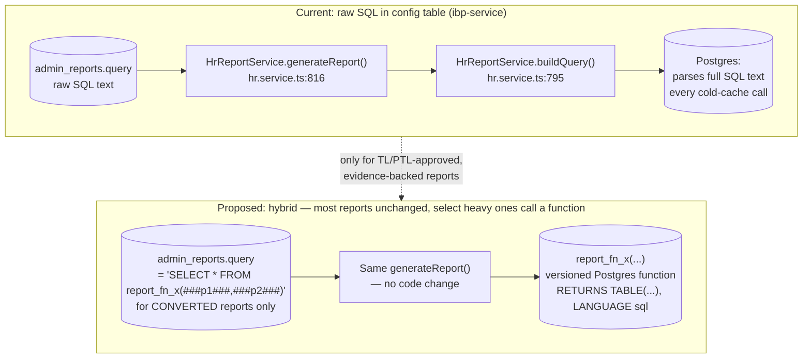
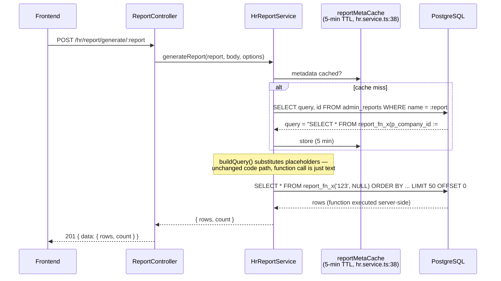

# PERF-DB-02 — SQL Functions for Reports — Technical Requirements Document

**Module:** PERF-DB-02
**Product:** iWork + IBP (both consume reports off the same shared Postgres database)
**Client:** IIRM
**Stage:** 40b — Module TRD
**Mode:** Brownfield (changes how already-live reports execute)
**Authored:** 2026-07-29
**Audience:** Backend developers, DBA, TL/PTL sign-off
**Source:** Implements item 7 — "Database - SQL Functions for all the reports" — of [Performance-Action-Items.md](./Performance-Action-Items.md) (Technical Head meeting, 24-Jul-2026)

This TRD answers one question: should the report execution pattern already live in this codebase — raw SQL text stored in a database config table, resolved and executed at request time — be replaced by calls to versioned Postgres functions? It is a decision document as much as a design document, because the literal instruction ("SQL Functions for all the reports") sits in direct tension with a design principle this codebase's own report framework already documents and defends. That tension is addressed head-on in [§4](#4-the-decision-scope-of-conversion), not glossed over.

---

## 1. Scope

**This TRD covers:**

- Whether — and under what evidence bar — `admin_reports.query` rows in `ibp-service`'s HR report framework should be converted from raw SQL text to calls against versioned Postgres functions.
- The function naming/versioning convention and the `admin_reports.query` value convention for invoking one.
- How `HrReportService.generateReport()`/`countReport()`/`downloadReport()` would call a function-backed report vs. today's ad hoc SQL, and whether that requires any framework code change.
- Security posture for any new `CREATE FUNCTION`/`CREATE OR REPLACE FUNCTION` object: `LANGUAGE sql` vs. `plpgsql`, and the `SECURITY DEFINER` question specifically.
- Deployment, rollout, testing, rollback, and blast-radius process, given this repo has no automated migration runner.

**Explicit non-goals:**

- Rewriting or fixing any specific report's query logic. That belongs to each report's own owning module TRD (per `hr-module-report-framework-tech-spec.md` §9.1's "No-Assumption Rule") or, for BizDone specifically, [BizDone-Dashboard-Performance-TRD.md](./BizDone-Dashboard-Performance-TRD.md).
- Index or partition design. That is [DB-Partitioning-Indexing-TRD.md](./DB-Partitioning-Indexing-TRD.md)'s job — see [§4](#4-the-decision-scope-of-conversion) for why that work should generally happen *before* a report is judged to need function conversion too.
- Building any reporting logic in `apps/services/report-service`. That service is confirmed to be an empty Nx scaffold — `app.service.ts` returns a hardcoded `{ message: 'Reports Service API running successfully..' }` and nothing else (`apps/services/report-service/src/app/app.service.ts`). It is not part of this design and this TRD does not propose using it.
- Designing a query-telemetry/observability stack. This TRD depends on telemetry that does not exist today (see [§10](#10-open-questions)) but does not build it.

---

## 2. Current State (grounding)

Two real reporting code paths exist in this repo. Neither is a stored Postgres function today.

### 2.1 `ibp-service`'s HR report framework

Documented in full at `docs/implementation/ibp-service/hr-module-report-framework-tech-spec.md`. Three backing tables — `admin_reports` (one row per report key, holding `query`: raw SQL text with `###placeholder###` tokens), `admin_reports_parameters` (placeholder-to-value mapping), `admin_reports_results_mappings` (SQL alias-to-frontend-key mapping). The framework's own stated design premise (its §2): *"no hardcoded report logic in the controller or service"* — a new report is a database upsert, not a deploy.

The implementation is `HrReportService` in `apps/services/ibp-service/src/app/hr-module/hr.service.ts`. Verified directly (not re-derived from the framework doc):

- `buildQuery()` (lines 795–814) does the `###param###` substitution: each parameter is either the literal string `NULL` (if the caller's value is missing, `null`, or the sentinel `"#99#"`) or a single-quoted string literal with internal quotes doubled (`'${String(value).replace(/'/g, "''")}'`). This is string interpolation into the query text, not driver-level bind parameters — `hrRepository.query(finalQuery)` executes a fully-formed SQL string.
- `generateReport()` (lines 816–937) is the full runtime: resolve `admin_reports`/`admin_reports_parameters` metadata (cached — see below), call `buildQuery()`, strip/replace any placeholder tokens that had no match (`.replace(/###[a-zA-Z0-9_]+###/g, "''")`, line 890), optionally append `ORDER BY` (after stripping any trailing `ORDER BY` already in the stored SQL — `stripTrailingOrderBy()`, lines 784–793) and `LIMIT`/`OFFSET`, then run the main query and a `SELECT COUNT(*) FROM (...) as base` wrapper in parallel (lines 906–927) — skipped entirely when `limit === 0` or `noCount` is set, specifically to avoid re-running an expensive CTE-laden query twice just to count it (comment at line 914).
- Caching is already real and already sophisticated, not a naive executor: `reportMetaCache`/`reportMetaPending` (class fields, lines 38–39) give report metadata a 5-minute TTL with a shared in-flight promise so concurrent cold-start requests share one DB round trip instead of stampeding it (lines 833–855); `hrCtxCache`/`hrCtxPending` (lines 40–41) cache the caller's external-HR context for 60 seconds the same way (lines 860–878); `countReport()` (lines 989–1035) adds a Redis-backed count cache (5-minute TTL, line 1025) with its own stampede protection (`countPending`, lines 1006–1033), and prefers a dedicated lightweight `<reportName>_count` report if one exists (lines 1014–1021) over re-wrapping the full query in `COUNT(*)`.

Any design proposed here has to slot into this — not replace it, and not accidentally break the cache-invalidation contract already documented at `invalidateReportCache()` (lines 946–953), which assumes `admin_reports.query` changes take effect within the 5-minute `reportMetaCache` TTL without a service restart (comment at line 832: *"migrations take effect without restart"*).

### 2.2 `policy-service`'s BizDone report

`generateBizDoneReport` (`apps/services/policy-service/src/app/policy/policy.repository.ts:13074`) and `generateBizDoneReportInBatches` (same file, line 16217) are hand-written TypeORM query-builder/raw SQL directly in a 33,874-line repository file — no metadata framework, no `admin_reports` table involvement at all. This is a structurally different pattern from §2.1 and is owned by a separate, parallel TRD: [BizDone-Dashboard-Performance-TRD.md](./BizDone-Dashboard-Performance-TRD.md). This document does not duplicate BizDone-specific query fixes; where the two documents' recommendations should share a convention (naming, security posture), that is called out explicitly in [§10](#10-open-questions).

### 2.3 The one real precedent: `fr_user_permission_info`

`docs/IIRM-778_Admin-Reports/IIMR-780_Report Hub/function_fr_user_permission_info.sql` (also present as `16_user-permission-info.sql` in the same folder) is the only `CREATE FUNCTION`/`CREATE PROCEDURE` object in this repo that matches the shape of "a SQL function backing a report": a standalone, durably-named, parameterized, `RETURNS TABLE(...)`, `LANGUAGE sql` function joining `acl_category_action_map` → `acl_categories`/`acl_actions` → `role_acl_category_action_map` → `roles` → `user_role` → `users`/`employee` to answer "who has what permission." A repo-wide search of application TypeScript found **zero** references to `fr_user_permission_info` — it is not called from any service today; it appears to be a standalone DB object for ad hoc/BI use. Its shape (`RETURNS TABLE`, `LANGUAGE sql`, `ilike coalesce(param, column)` optional-filter pattern) is exactly the convention this TRD proposes standardizing on for the reports that do get converted — see [§5](#5-function-convention).

A wider repo search also turned up several *other* `CREATE OR REPLACE FUNCTION` objects — `scripts/pii-encrypt-migrate.sql`, `scripts/pii-decrypt.sql`, `scripts/pii-lookup.sql`, `apps/services/ibp-service/src/app/hr-module/policy-location-final-fix.sql`, `apps/services/ibp-service/src/app/hr-module/policy-location-filter-script.sql`, `apps/services/service-lib/src/lib/scripts/policy-cover-section-sync.sql`. None of these change the picture: the `pii_*` functions are ad hoc DBA-run decrypt/lookup utilities (`scripts/` is the established SQL-only utility location, not app-called code); `_strip_loc_filter` and `_upsert_location_param` are migration-scoped helper functions explicitly `DROP FUNCTION IF EXISTS`-ed at the end of the same script that created them (one-shot migration tooling, not durable objects); `fn_policy_cover_map_set_section_id` is a trigger function. None is invoked by the reporting framework, and none uses `SECURITY DEFINER` — a repo-wide search for `SECURITY DEFINER` returned no matches anywhere. That absence matters for [§7](#7-security-design).

### 2.4 The migration gap this design has to survive

Confirmed: `database-migrations/` holds exactly 5 TypeORM `MigrationInterface` files and `database-migrations/sql/` holds 67 hand-written raw `.sql` scripts, applied manually per environment. No `ormconfig`/`data-source` file and no `typeorm migration:run` invocation exist anywhere in this repo. `admin_reports` content changes today already go through this same manual-script path (e.g. `database-migrations/sql/fix_external_hr_reports.sql`, `fix_portfolio_crm.sql`, `combined_hr_module_migrations_v1.10.sql` all contain `admin_reports`/`admin_reports_parameters` inserts and updates). Any `CREATE OR REPLACE FUNCTION` this TRD proposes has to deploy through the same manual, no-CLI reality — see [§8](#8-deployment--rollout-plan).



---

## 3. Architecture Overview

No new service, no new schema, no framework rewrite. The only structural addition is a new class of Postgres object (versioned functions) and a new *value convention* for `admin_reports.query` that points at one. Everything else — the controller, `HrReportService`, the three metadata tables, the caching layers — stays exactly as documented in `hr-module-report-framework-tech-spec.md`.

That minimalism is deliberate. The report framework's own TRD already considered and rejected "stored procedures per report" (`hr-module-report-framework-tech-spec.md` §6: *"rejected because they require a DB deploy for every report change, defeating the metadata-driven goal"*). A blanket reading of "SQL Functions for all the reports" would directly overturn that documented decision for the entire framework — every report, including the ones nobody has ever complained about, and including reports that get created or edited on a near-zero-deploy cadence today. This TRD does not recommend that. It recommends a narrow, evidence-gated exception to that rule, scoped to a short list of specific reports, not a wholesale architectural reversal. See [§4](#4-the-decision-scope-of-conversion).

---

## 4. The Decision: Scope of Conversion

### 4.1 The tension, stated plainly

| | Dynamic raw-SQL-in-config (today, unchanged) | Postgres functions (`report_fn_*`) |
|---|---|---|
| New report added | DB upsert into `admin_reports`/`admin_reports_parameters`/`admin_reports_results_mappings` — no deploy, takes effect within the 5-min `reportMetaCache` TTL | Requires a new `CREATE FUNCTION` object deployed via the manual SQL-script process (§8) *in addition to* the `admin_reports` row — strictly more steps |
| Existing report's logic changed | Same — a single `UPDATE admin_reports SET query = ...` | `CREATE OR REPLACE FUNCTION` (easy) if the output shape is unchanged; `DROP FUNCTION` + re-`CREATE` (riskier, see §9) if columns change |
| Query text visible/auditable from | The `admin_reports` table itself, in the app's own DB — one place to look | The function body, a separate DB object from the `admin_reports` row that references it — one more place to look, one more thing that can drift out of sync with what the row's comment says it does |
| Plan/parse overhead | Full SQL text is parsed by Postgres on every uncached call; large CTE-heavy report SQL means large parse cost per call | `LANGUAGE sql` functions are typically inlined by the planner for simple single-statement SELECTs (a parse-time win, not a distinct cached-plan win); `plpgsql` functions can get a genuine per-session cached plan for repeated calls, at the cost of losing planner inlining and making `EXPLAIN` less direct (see §7) |
| Centralization of complex logic | Logic lives as a string in a table row — no static type/syntax checking until it's executed | Logic lives as a real Postgres object — can be independently reviewed, diffed, and `EXPLAIN ANALYZE`'d without going through the app at all |
| Fixes a bad query plan (missing index, bad join order) | No | No — wrapping a query in a function does not change its cost. A slow report stays slow inside a function unless the underlying query, index, or join is actually fixed. That work belongs to [DB-Partitioning-Indexing-TRD.md](./DB-Partitioning-Indexing-TRD.md) and should generally be done, and re-measured, *before* a report is judged to still need function conversion on top |

The instruction from the 24-Jul-2026 meeting is written as "for all the reports." Taken literally, that conflicts with the framework's own documented design intent and would remove the zero-deploy report-authoring capability the framework was explicitly built to provide. This TRD treats the meeting note as shorthand for *"reports that are actually slow enough to matter should stop paying the raw-SQL-parse/opaque-logic tax"* — not as a mandate to convert every row in `admin_reports`. **§10, Open Question 2, asks the Technical Head to confirm this reading explicitly** rather than the TRD silently assuming it.

### 4.2 Recommendation

**Keep the dynamic, DB-config-driven pattern as the default for the framework as a whole. Convert only specific, evidence-backed heavy reports to Postgres functions, one at a time, each requiring its own TL/PTL-reviewed conversion.**

Reasoning:

1. The framework's zero-deploy report-authoring capability is a real, currently-used feature (new reports and report edits ship as data changes today) — losing it for reports that were never a performance problem is a pure regression with no offsetting benefit.
2. There is currently no telemetry (no Prometheus/Grafana anywhere in this repo — confirmed by the grounding paragraph in `Performance-Action-Items.md` itself) to say which reports are actually slow. Converting "all" reports without that evidence spends engineering effort on reports that may already be fast, while a handful of genuinely slow ones may not even be the ones anyone assumed.
3. Function conversion's real benefits in this codebase — less per-call parse overhead for large SQL text, a reviewable/`EXPLAIN`-able DB object instead of a string in a table, one instance of a proven pattern (`fr_user_permission_info`) instead of a one-off — apply cleanly to a small number of genuinely heavy, complex, CTE-laden reports. They do not meaningfully help a simple, fast, low-traffic report, and for those the *cost* (extra deploy step, extra object to keep in sync, loss of hot-patchability) dominates.
4. This defers, rather than ignores, a future "what if most reports really do need this" scenario: nothing here prevents converting more reports later if evidence says so. It just requires evidence first, per report.

**What "evidence-backed" means in practice**, given the lack of telemetry, is defined in [§10, Open Question 1](#10-open-questions) — this TRD flags the gap rather than inventing numbers to fill it.

---

## 5. Function Convention

For any report the TL/PTL approves for conversion under §4.2:

### 5.1 Signature convention

- `RETURNS TABLE(col1 type1, col2 type2, ...)` — not `RETURNS SETOF record`. This matches `fr_user_permission_info`'s own precedent and matters mechanically: a `RETURNS TABLE` function can be called as `SELECT * FROM fn(...)` with no column-definition list, which is exactly the shape `admin_reports.query` needs to stay a drop-in replacement for raw SQL (see §6). A `SETOF record` function would require the caller to spell out a column list at every call site, which the current placeholder-substitution framework has no clean way to template.
- Parameters passed as **named arguments** in the `admin_reports.query` template (`report_fn_x(p_company_id := ###companyId###, p_policy_id := ###policyId###)`), not positional. This protects existing `admin_reports` rows from silently breaking if a future function edit reorders parameters — a real risk given `admin_reports.query` values are edited by hand, by scripts, months apart, by different people.
- Every parameter should tolerate `NULL` (matching `fr_user_permission_info`'s `ilike coalesce(p_x, column)` pattern) — because `buildQuery()`'s unmatched-placeholder cleanup (`hr.service.ts:890`) replaces any token without a resolved value with `''` (empty string), not `NULL`. An empty string passed to a function parameter typed `integer` or `date` fails to cast and raises a hard error at query time, unlike today's inline-WHERE-clause substitution where an empty string in a `LIKE`/`ILIKE` comparison merely matches nothing. **This is a real behavioral difference introduced by conversion, not a wash** — function parameters must be typed to accept the substitution patterns `buildQuery()` actually produces (quoted string literals or the bare word `NULL`), and every placeholder used in a converted report's SQL must have a corresponding `admin_reports_parameters` row (already a release blocker per the framework TRD's §9.4 — doubly enforced here because the failure mode is a hard error instead of an empty result).

### 5.2 Naming and versioning

- Function name = `report_fn_<admin_reports.name>` — a 1:1, greppable mapping back to the report key it backs (e.g. report key `ibp_hr_enrollment_employee_list` → function `report_fn_ibp_hr_enrollment_employee_list`). This is clearer than the existing `fr_` prefix (whose meaning isn't documented anywhere this TRD could find) and self-documents which `admin_reports` row a given function belongs to.
- **Non-breaking body change** (same output column names/types/order, different query logic or optimization): re-run `CREATE OR REPLACE FUNCTION report_fn_x(...)` with the same signature. This is the easy, cheap path Postgres gives you, and matches how `admin_reports.query` itself is already hot-patched today.
- **Breaking change** (output columns added/removed/retyped/reordered): Postgres's `CREATE OR REPLACE FUNCTION` explicitly refuses to change an existing function's `RETURNS TABLE` column list — this requires `DROP FUNCTION` of the old signature followed by `CREATE FUNCTION` of the new one. In that case, create a **new**, version-suffixed function (`report_fn_x_v2`) alongside the old one rather than dropping the original in place, cut the `admin_reports.query` row over to reference `_v2`, and only drop `report_fn_x` once the cutover has baked (see [§9](#9-rollback-plan)) — never drop-and-recreate the original name under live traffic.

### 5.3 Function contract checklist

Every conversion PR/runbook must show:

| Item | Requirement |
|---|---|
| Naming | `report_fn_<admin_reports.name>` (or `_v2`+ per §5.2) |
| Output shape | `RETURNS TABLE(...)` with explicit column list |
| Language | `LANGUAGE sql` by default (§7); `plpgsql` only with written justification |
| `SECURITY DEFINER` | Not used, unless an explicit, separately-signed-off exception exists (§7) |
| Parameters | Named-argument call convention in `admin_reports.query`; every parameter accepts `NULL` and a quoted-string-literal substitution |
| Idempotency | Script is a plain `CREATE OR REPLACE FUNCTION ... $function$ ... $function$;` body, safe to re-run |
| Header comment | Owner, date, backing `admin_reports.name`, and — if this revision changes output shape — an explicit note plus the old query text preserved for rollback (§9) |
| Evidence | `EXPLAIN (ANALYZE, BUFFERS)` before/after (§8.3) and parallel-run comparison results (§8.3) attached to the runbook |

---

## 6. Integration Contract — `admin_reports.query` value convention, not a framework change

This is a new **value** stored in `admin_reports.query`, not a code change to `HrReportService`. Concretely, for a converted report, the row's `query` column becomes:

```sql
SELECT * FROM report_fn_ibp_hr_enrollment_employee_list(
  p_company_id := ###companyId###,
  p_policy_id := ###policyId###,
  p_search := ###search###
)
```

Walking this through the existing code confirms no change is needed to `hr.service.ts`:

- `buildQuery()` (line 795) treats `report.query` as opaque text and substitutes `###placeholder###` tokens wherever they appear — inside a function call's argument list is no different from inside a `WHERE` clause to this code.
- `stripTrailingOrderBy()` / the `ORDER BY` append (lines 894–904) and the `LIMIT`/`OFFSET` append (lines 906–907) operate on the *outer* SQL string. `SELECT * FROM report_fn_x(...) ORDER BY "col" ASC LIMIT 50 OFFSET 0` is valid SQL — a function call is a normal `FROM`-clause row source.
- The count wrapper (`SELECT COUNT(*) as count FROM (${baseQuery}) as base`, line 910) is equally valid wrapped around a function call.
- `hrRepository.query(finalQuery)` (lines 918, 923) executes whatever string it's given — it does not care whether that string's `FROM` clause is a table, a CTE, or a function call.

**Conclusion: zero lines of `hr.service.ts` need to change.** The only engineering work per converted report is (a) writing/deploying the function per §5, and (b) updating that one `admin_reports.query` row — the exact same "edit a table row" mechanism already used to hot-patch report SQL today.



---

## 7. Security Design

### 7.1 `LANGUAGE sql` vs. `LANGUAGE plpgsql`

**Default: `LANGUAGE sql`.** This matches the only real report-function precedent in this repo (`fr_user_permission_info`), and is the right default for reporting queries specifically:

- A single-statement `SELECT` in `LANGUAGE sql` is a candidate for planner inlining — Postgres can fold the function body into the calling query's plan much like a view or a macro, which keeps `EXPLAIN` output meaningful (you can see the actual join/scan plan, not an opaque function-call cost estimate) and avoids introducing a second, harder-to-audit execution path.
- `LANGUAGE plpgsql` should be treated as the exception, not the default, for report functions specifically — reserve it for a report that genuinely needs procedural logic (branching, loops, dynamic `EXECUTE`). This repo's existing `plpgsql` functions (`pii_decrypt`, `_strip_loc_filter`, `_upsert_location_param`, `fn_policy_cover_map_set_section_id`) are all migration/utility helpers, not reporting `SELECT`s — there is no existing precedent in this codebase for a `plpgsql` *report* function, and introducing one should require the same written justification called out in the §5.3 checklist. `plpgsql` functions do get a genuine per-session cached execution plan on repeated calls (unlike inlined `LANGUAGE sql`), which is a real advantage for a report called very frequently within one DB session — but this repo has no PgBouncer or other external connection pooler (confirmed: no `pgbouncer` reference anywhere in the repo) and `apps/services/service-lib/src/lib/database/typeorm.config.ts` (the config actually imported by every service's `app.module.ts`, e.g. `auth-service/src/app/app.module.ts:12`) sets no custom `extra`/pool options, so it relies on `pg`'s own default `Pool` behavior — meaning whether repeated calls actually land on the same backend session/connection across requests is not something this TRD can confirm without DBA input (see [§10](#10-open-questions)). Don't reach for `plpgsql` purely for a plan-caching benefit that hasn't been confirmed to materialize under this repo's actual pooling behavior.

### 7.2 `SECURITY DEFINER` — explicit risk, explicit recommendation against it

`fr_user_permission_info` is the one existing precedent for a report-shaped function in this repo, and it directly touches ACL/role tables (`acl_category_action_map`, `acl_categories`, `acl_actions`, `role_acl_category_action_map`, `roles`, `user_role`) — exactly the tables that decide what a user in this system is allowed to do. Any future report function in the same territory (permissions, roles, admin-only data) raises the same question `fr_user_permission_info` itself doesn't answer either way, because it has no `SECURITY DEFINER` clause today (confirmed — it runs as `SECURITY INVOKER`, Postgres's default).

**This TRD recommends against `SECURITY DEFINER` for any report function, without exception, unless a named, separate security sign-off is obtained.** Reasoning, grounded in what actually exists:

- `SECURITY DEFINER` makes a function execute with the privileges of whoever *owns* the function, not whoever *calls* it. That is a real privilege-escalation vector if the function's logic ever has a bug, an unreviewed edit, or an unanticipated input — the caller gets the definer's access regardless.
- In this codebase, that tradeoff buys **no actual benefit today**, because there is no privilege separation to elevate from: `apps/services/service-lib/src/lib/database/typeorm.config.ts` — the config actually imported by every service's `app.module.ts` (confirmed via `grep` across `apps/services/*/src/app/app.module.ts`) — shows every service connecting to Postgres as a single shared DB user (`ENV.DB_USER || "postgres"`) with whatever broad privileges the application already needs for ordinary `SELECT`/`INSERT`/`UPDATE` queries across every entity. There is no lower-privileged "app role" that a report function would need `SECURITY DEFINER` to lift above. Adding it here would add the classic risk (privilege escalation, `search_path` hijacking if not explicitly pinned) for zero corresponding access-control gain.
- If a future architecture change introduces per-service or per-role DB accounts with genuinely reduced privileges (a change this TRD does not propose and has not seen evidence of), `SECURITY DEFINER` could become legitimately useful — but that would be a deliberate, separately-reviewed security decision, with `SET search_path = public, pg_temp` pinned explicitly in the function definition, not something to default into as part of a performance initiative.

### 7.3 What conversion does *not* change about scoping

`hr-module-report-framework-tech-spec.md` §7 states company-scoping is enforced by comparing the request's `companyId` against the authenticated session before substitution — i.e., **in `HrReportService`, in the application layer, not inside the SQL**. Wrapping a report's query in a Postgres function does not add that check into the function itself; the function trusts whatever value it's called with, exactly like today's raw SQL does. This matters for blast radius (§11): a converted function is callable by *any* connection to the shared Postgres database, not just through `HrReportService`'s guarded endpoint — a second caller (a different service, an ad hoc DBA query, a future integration) that calls `report_fn_x(...)` directly bypasses the app-layer company-scoping check entirely, the same way it could already bypass it by querying the underlying tables directly today. Conversion does not make this better or worse; it just makes the query a named, more easily-called-from-elsewhere object, so this constraint is worth restating in the function's own header comment (§5.3) rather than assumed to be understood.

---

## 8. Deployment / Rollout Plan

There is no `typeorm migration:run` and no CI-driven migration step anywhere in this repo (§2.4). Function deployment must fit the same manual, per-environment discipline already used for the 67 hand-written scripts in `database-migrations/sql/`, not invent a new one.

### 8.1 File convention

New subfolder: `database-migrations/sql/functions/`, one file per function per revision, named `<function_name>.sql` (e.g. `report_fn_ibp_hr_enrollment_employee_list.sql`). Each file is a complete, idempotent `CREATE OR REPLACE FUNCTION ... $function$ ... $function$;` statement, headed by a comment block (owner, date, backing `admin_reports.name`, whether this revision changes output shape per §5.2). A companion statement (in the same file or an adjacent, clearly-named file) does the `UPDATE admin_reports SET query = '...' WHERE name = '...'` cutover — following the existing convention already visible in scripts like `database-migrations/sql/fix_external_hr_reports.sql` that combine schema/function-adjacent changes with `admin_reports` content updates in one script.

### 8.2 Environment sequence

Dev → UAT → Preprod → Prod, applied manually (`psql`), in that order, with the same evidence attached at each promotion:

1. **Dev**: create the function; run the parallel-run comparison and `EXPLAIN ANALYZE` comparison from §8.3 against dev data. Do **not** cut over `admin_reports.query` yet.
2. **UAT**: repeat function creation + comparison against UAT data (different data shape/volume than dev is a real check, not a formality). Cut over the UAT `admin_reports.query` row only after comparison passes; let QA exercise the report end-to-end through the actual `/hr/report/generate/:report` endpoint, not just the raw SQL.
3. **Preprod**: same sequence. This is also the environment named in Performance-Action-Items.md items #1/#2 for job-stoppage and zero-state baselining — coordinate scheduling so a report-function rollout doesn't collide with that baseline capture.
4. **Prod**: same sequence, plus DBA sign-off given this touches live, already-relied-upon report output — same bar as the existing "documented runbook + DBA + PTL sign-off" discipline the Action Plan's §12 already requires for any production data-touching change.

Who currently owns executing the 67 existing manual scripts per environment, and whether that same person/process owns this new `functions/` folder too, is an open question — see [§10](#10-open-questions).

### 8.3 Evidence required before promotion at each stage

1. **Parallel-run comparison.** For a representative set of parameter combinations (sourced from `admin_reports_parameters` defaults plus a small QA/product-agreed sample — see [§10, Open Question 1](#10-open-questions) on why a larger real-traffic sample isn't available today), run both the existing raw-SQL query (via the unmodified `admin_reports.query` row) and the candidate function-backed query against the *same* non-prod database snapshot, and diff the result sets row-by-row, column-by-column. Any discrepancy blocks promotion — fix the function, not the comparison.
2. **`EXPLAIN (ANALYZE, BUFFERS)` before/after.** Capture for both versions against the same data snapshot (same DB, ideally same session, so buffer/cache state doesn't skew the comparison). The function version must show equal-or-better planning + execution time and no worse buffer/read behavior. If it doesn't, the report likely needs an index/partitioning fix from [DB-Partitioning-Indexing-TRD.md](./DB-Partitioning-Indexing-TRD.md) first — converting a slow query to a function does not make it fast (§4.1).
3. **Old query text preserved.** The pre-conversion `admin_reports.query` value must be saved verbatim (in the migration script's header comment, or a companion snapshot file) before cutover. This is the single most important step for rollback (§9) and is easy to skip by accident since there's no tooling that does it automatically.

---

## 9. Rollback Plan

`CREATE OR REPLACE FUNCTION` is genuinely easy to revert *for a non-breaking (same output shape) change* — re-apply the prior version's `CREATE OR REPLACE FUNCTION` script, which is a near-instant catalog update with no data movement, nothing like reverting a partitioning change. That said, "easy" here depends on two things this TRD makes mandatory, not automatic:

1. **Revert the `admin_reports.query` row first, not the function.** A plain `UPDATE admin_reports SET query = '<preserved old raw SQL>' WHERE name = '...'` immediately stops new traffic from calling the function — it takes effect within the `reportMetaCache`'s 5-minute TTL (`hr.service.ts:832`), same as any other report-SQL hot-patch, and requires no DB catalog change or lock at all. This is the fast, safe, first move.
2. **Only then decide whether to also revert or drop the function object.** Once nothing references it, the function can be left in place harmlessly (it costs nothing sitting unused) or reverted to its prior body — there is no urgency once the `admin_reports` row itself is reverted.

The one case that is **not** trivially reversible: if the conversion also changed the function's output column shape (§5.2's "breaking change" case), rollback means the *new* function (`report_fn_x_v2`) must be dropped or left orphaned while the `admin_reports` row reverts to referencing the original — this is exactly why §5.2 mandates creating a new version-suffixed function rather than dropping-and-recreating the original name under live traffic. Never let a live `admin_reports.query` row point at a function name that's mid-drop.

Rollback readiness checklist per converted report:

| Step | Requirement |
|---|---|
| Old `admin_reports.query` text | Preserved verbatim before cutover (§8.3) |
| Rollback statement | A one-line `UPDATE admin_reports SET query = ... WHERE name = ...` ready to run, not something to be reconstructed under pressure |
| Function object | Left in place after a rollback unless actively harmful — no urgency to drop it |
| Breaking-shape changes | New version-suffixed function only; never drop-and-recreate the original name live |

---

## 10. Open Questions

1. **Which reports are actually slow enough to justify conversion?** This repo has no reporting-latency telemetry today — no Prometheus/Grafana, confirmed by `Performance-Action-Items.md`'s own grounding paragraph. Whoever approves a specific conversion needs real numbers (execution time distribution, call frequency), not a mandate to "use SQL functions for all reports." Recommended first step: a short, bounded instrumentation pass — either a temporary duration log around `hrRepository.query(finalQuery)` in `generateReport()`/`downloadReport()`, or enabling Postgres's own `log_min_duration_statement` in preprod/prod for a defined window — specifically to produce the evidence this TRD's §4.2 evidence bar requires. Decision owner: TL/PTL + DBA.
2. **Does "for all the reports" mean literally all, or the ones that are slow?** This TRD assumes the latter (§4) because a literal reading conflicts with the framework's own documented zero-deploy design goal (`hr-module-report-framework-tech-spec.md` §6). The Technical Head should confirm the intended scope explicitly.
3. **Does this recommendation extend to BizDone (`policy.repository.ts:13074`, `:16217`)?** BizDone has no metadata framework at all — it's hand-written query-builder/raw SQL directly in the repository file, a structurally different starting point than `admin_reports`. If [BizDone-Dashboard-Performance-TRD.md](./BizDone-Dashboard-Performance-TRD.md) independently recommends function conversion for BizDone, the naming/versioning/security conventions in this document (§5, §7) should apply there too, rather than a second bespoke convention being invented in parallel.
4. **Who owns applying the manual SQL scripts today, and does that extend to the new `functions/` folder?** The 67 existing scripts in `database-migrations/sql/` are applied manually per environment with no named owner documented in this repo. This TRD's §8 deployment process inherits that same gap rather than solving it — Performance-Action-Items.md's own §12 flags the broader migration-tooling gap as a production-data-integrity risk; this is the same gap, applied to a new kind of object.
5. **Is the single shared DB role (`ENV.DB_USER`, `apps/services/service-lib/src/lib/database/typeorm.config.ts`) actually what's deployed in preprod/prod, or does something override it per service?** This directly underpins the §7.2 argument that `SECURITY DEFINER` buys no benefit today — it should be confirmed with DBA/infra, not assumed from the checked-in default. Separately, and out of scope for this TRD but worth flagging: a **second, apparently-unused** TypeORM config exists at `libs/service-lib/src/lib/database/typeorm.config.ts` (not imported by any `app.module.ts` — confirmed via `grep`) with a real-looking hardcoded fallback password (`typeorm.config.ts:37`) and hostname (`:34`) committed to the repo. Being unused today doesn't make a committed credential safe — recommend a separate security follow-up to rotate/remove it regardless of this TRD's outcome.
6. **What connection pooling actually runs in preprod/prod?** No PgBouncer or other external pooler reference exists anywhere in this repo, and `typeorm.config.ts` sets no custom pool size — confirm with DBA/infra whether `plpgsql`'s per-session plan-caching benefit (§7.1) has any real chance of materializing under actual deployed pooling behavior, before using it as a justification for choosing `plpgsql` over `LANGUAGE sql` on any specific report.
7. **Should `admin_reports` gain an explicit column** (e.g., `execution_mode`) marking which reports have been converted, instead of relying on inspecting `query` text for the `SELECT * FROM report_fn_` pattern? A nice-to-have for operability, not required for the plumbing in §6 to work. Decision owner: backend TL.

---

## 11. Cross-References

| Document | Relevance to this TRD |
|---|---|
| [DB-Partitioning-Indexing-TRD.md](./DB-Partitioning-Indexing-TRD.md) | Function conversion does not fix a bad query plan (§4.1, §8.3) — index/partitioning work should generally be applied and re-measured first, before a report is judged to still need function conversion. |
| [Infra-Capacity-Planning-TRD.md](./Infra-Capacity-Planning-TRD.md) | A converted function shares the same connection pool and infra sizing as every other query today — conversion changes neither pool pressure nor infra sizing by itself (§11 blast radius below). |
| [Service-Split-TRD.md](./Service-Split-TRD.md) | The Postgres database is shared regardless of any future service split; a `report_fn_*` object lives in that shared DB and is not owned by whichever service happens to call it today (§7.3). If HR/Risk Watch is ever split out, function ownership travels with the schema, not the calling service. |
| [Health-Check-TRD.md](./Health-Check-TRD.md) | Any telemetry stood up to answer Open Question 1 (per-report latency) is a natural input to that TRD's health-check thresholds, if it lands first. |
| [BizDone-Dashboard-Performance-TRD.md](./BizDone-Dashboard-Performance-TRD.md) | Owns BizDone's specific query fixes (`policy.repository.ts:13074`, `:16217`); this TRD owns the general raw-SQL-vs-function decision and conventions (§5, §7) that BizDone's function conversion, if any, should reuse rather than reinvent (Open Question 3). |

---

## 12. Blast Radius

- **In scope of a single conversion**: only the one `admin_reports.name` row being converted, and only the two endpoints that read it (`POST /hr/report/generate/:report`, `POST /hr/report/download/:report`) plus `countReport()`'s fallback path when no dedicated `_count` report exists. No other report, screen, or product surface is touched by converting one report.
- **Out of that narrow scope but still real**: the function itself lives in the shared Postgres database used by both iWork and IBP (per this TRD's header) and by every backend service connected to it — not just `ibp-service`. Nothing in Postgres prevents a different service, or an ad hoc DBA query, from calling `report_fn_x(...)` directly. As §7.3 states, doing so bypasses the company-scoping check that today lives in `HrReportService`, not in the SQL — a second caller must reimplement that check itself; the function is not self-securing. This isn't worse than today's raw-SQL-in-a-table pattern (that's equally bypassable by querying the underlying tables directly) — it's just a more discoverable, more nameable target once it exists as a named function.
- **Connection pool / infra**: converting a report to a function does not change which connection pool it competes for. No PgBouncer and no custom TypeORM pool sizing were found in this repo (§7.1) — a slow or lock-holding function pressures the same shared pool a slow raw query would today. Function conversion is not, by itself, an infra mitigation; see [Infra-Capacity-Planning-TRD.md](./Infra-Capacity-Planning-TRD.md) for that separate axis.
- **Worst case for a single bad conversion**: the converted report returns wrong or incomplete data (caught by §8.3's parallel-run comparison before promotion, if followed) or performs no better than before (caught by §8.3's `EXPLAIN ANALYZE` comparison). Because rollback (§9) is a single `UPDATE admin_reports.query` statement away, the blast radius of a bad conversion reaching production is bounded to "one report shows wrong/slow data until the next cache TTL expiry after rollback" (at most 5 minutes, per `reportMetaCache`'s TTL) — not a cluster-wide or cross-service incident.

---

## 13. Approval

Leave blank. TL/PTL sign-off authority.

```
Approved by:
Role:
Date:

Approved by:
Role:
Date:
```

---

# END OF TRD
