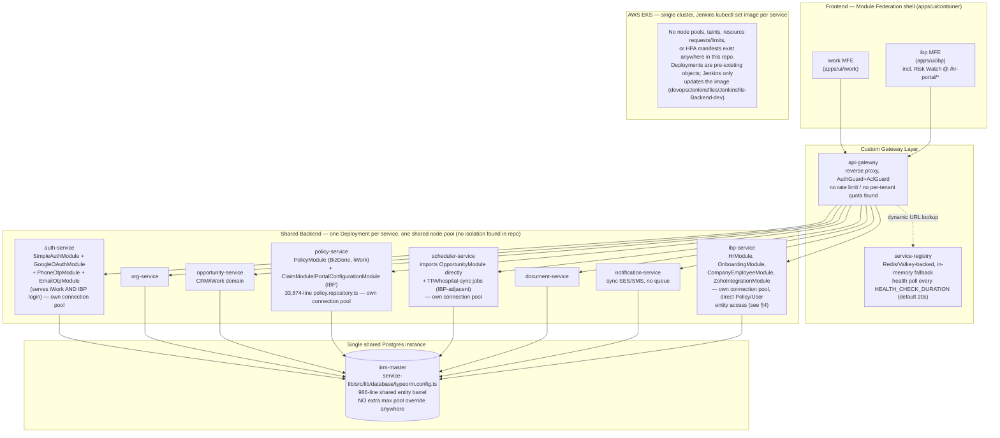
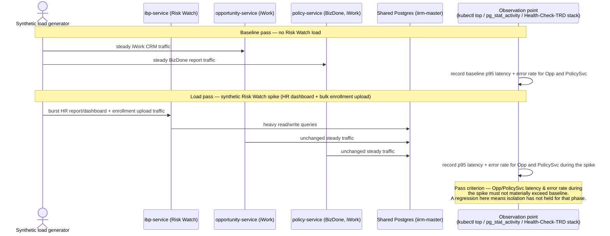

# PERF-ARCH-01 — Service Split — Risk Watch Isolation & iWork/IBP Service Boundaries — Technical Requirements Document

**Module:** PERF-ARCH-01
**Product:** iWork + IBP
**Client:** IIRM
**Stage:** 40b — Module TRD
**Mode:** Brownfield (highest blast-radius of the six performance TRDs — this one proposes carving isolation boundaries into a live, fully-interleaved shared backend, not building something new)
**Authored:** 2026-07-29
**Audience:** Backend architecture, TL/PTL sign-off (**mandatory before any implementation** — see [§15](#15-open-questions-for-tlptl))
**Source:** Implements item 10 of [Performance-Action-Items.md](./Performance-Action-Items.md) (24-Jul-2026 Technical Head meeting):

> 10. Service Split
>     1. Start with Risk Watch because it should run on its own and impact other iWork or IBP services
>     2. Identify service areas because either iWork or IBP utilization should not impact other services

Read literally, item 10 is backwards from what the codebase can actually support ("Risk Watch... impact other services" — read as "should **not** impact"). This TRD proceeds on the corrected reading throughout: **isolate Risk Watch so its load cannot degrade the rest of the platform, then generalize that isolation to other iWork/IBP service boundaries.**

**Sibling TRDs in this same performance initiative** (cross-referenced throughout, not restated): [DB-Partitioning-Indexing-TRD.md](./DB-Partitioning-Indexing-TRD.md), [SQL-Functions-Reports-TRD.md](./SQL-Functions-Reports-TRD.md), [Infra-Capacity-Planning-TRD.md](./Infra-Capacity-Planning-TRD.md), [Health-Check-TRD.md](./Health-Check-TRD.md), [BizDone-Dashboard-Performance-TRD.md](./BizDone-Dashboard-Performance-TRD.md).

---

## 1. Scope

### In scope

- Defining "impact" between Risk Watch (IBP) and iWork/IBP shared services in measurable, mechanism-level terms (not "isolation is good").
- A phased isolation plan for `ibp-service` (Risk Watch's backend), sequenced cheapest/lowest-risk first.
- Identifying which *other* shared backend services (beyond `ibp-service`) carry the highest real risk of iWork-vs-IBP cross-contamination, per item 10.2.
- A rollout plan that is incremental and reversible at every phase, with concrete validation gates and rollback steps.
- A load/latency testing strategy that actually proves isolation holds, not just that a deploy succeeded.
- Open questions that require TL/PTL or infra-budget sign-off before any phase begins.

### Explicit non-goals (out of scope for this TRD)

- **Introducing a message queue / event bus.** No Bull/SQS/RabbitMQ exists anywhere in this codebase today (only `ioredis` as a client dependency, used for cache/session/service-registry storage — not pub/sub). Async decoupling would materially change the isolation design in [§8](#8-phase-3--full-logical-separation-conditional--deferred), but that is a separate, large architectural change. It is flagged as a **scoped-out dependency**, not silently folded into this TRD's build scope — see [§9](#10-explicitly-out-of-scope-message-queue--event-bus).
- **DB partitioning, indexing, or SQL-function conversion.** Covered by [DB-Partitioning-Indexing-TRD.md](./DB-Partitioning-Indexing-TRD.md) and [SQL-Functions-Reports-TRD.md](./SQL-Functions-Reports-TRD.md). This TRD references the HR-report query path as *evidence* for why DB-level isolation matters, but the query-tuning work itself is out of scope here.
- **Node-pool sizing math, HPA thresholds, or season-based capacity bumping.** Covered by [Infra-Capacity-Planning-TRD.md](./Infra-Capacity-Planning-TRD.md). This TRD specifies *what* needs a dedicated resource boundary and *why*; the sibling TRD owns the *how much*.
- **Health-check thresholds/alerting design.** Covered by [Health-Check-TRD.md](./Health-Check-TRD.md). This TRD's rollout gates assume that monitoring exists to observe them — where it doesn't yet, that's flagged as a dependency, not designed here.
- **BizDone query optimization.** Covered by [BizDone-Dashboard-Performance-TRD.md](./BizDone-Dashboard-Performance-TRD.md). This TRD only uses BizDone's co-location with HR/enrollment logic inside `policy-service` as risk evidence for [§9's ranking of item 10.2](#9-item-10b--other-iworkibp-service-boundaries-beyond-risk-watch).
- **Redesigning `ibp-service`'s internal module boundaries** (User Management, onboarding, etc.). That is one level down from this TRD's scope and is the subject of prior art this TRD builds on: `docs/implementation/ibp-service/IIRM-10416_IBP-user-management/hr-portal-user-management-TRD.md`.

---

## 2. Terminology Grounding (read this before the rest of the document)

Three terms in item 10 are UI/brand concepts, not backend service boundaries. Getting this wrong invalidates the whole design, so it is restated plainly:

| Term | What it actually is | Evidence |
|---|---|---|
| **Risk Watch** | The on-screen brand name of the IBP HR Portal, served at `/hr-portal/*` inside the `apps/ui/ibp` frontend. Not a separate Nx project, not a separate backend service. | `docs/IBP_Go-Live-Checklist/1-IBP-Portal-Definition.md:31` — "'Risk Watch' is the on-screen brand name of the HR Portal... In this document, HR Portal = Risk Watch." Frontend code: `apps/ui/ibp/src/app/pages/HRPortal/index.tsx`, `HRPortalInsights/index.tsx`. |
| **iWork** | A frontend micro-frontend (`apps/ui/iwork`, internal ops/CRM portal), not a backend service. | `docs/IIRM-0.1_Solution-Architecture/Solution-Architecture-Validation.md:57` — "'Iwork Service' is actually a frontend MFE, not a backend service." |
| **IBP** | The client/HR-facing product, served by the `apps/ui/ibp` frontend (which contains both the Employee Portal and the Risk Watch/HR Portal). Its closest backend counterpart is `ibp-service`, but `ibp-service` does not own all IBP-specific logic — see [§4](#4-current-state-entanglement--grounding-evidence). | Same as above; both `iwork` and `ibp` are loaded into a shared `apps/ui/container` shell via Module Federation. |

**What this means for "Service Split":** there is no existing `iwork-service` or `risk-watch-service` to "split off" — those are frontend concepts. The only concrete backend unit that already exists as an independently deployable artifact and carries *most* (not all) of Risk Watch/IBP's business logic is **`ibp-service`**. This TRD's Phase 1 target is therefore `ibp-service` itself, not a new service that needs to be built from scratch — which is exactly why deployment-level isolation is the cheapest first move (see [§6](#6-phase-1--deploymentscaling-isolation-for-ibp-service)).

---

## 3. Architecture Overview — Current State



**What this diagram is grounded in:**
- Gateway routing: `apps/services/api-gateway/src/app/app.service.ts` (`getServiceUrl()` looks up a service by name from `service-registry`, throws if not `active`; no throttle/rate-limit guard exists — confirmed by repo-wide search for `Throttle`/`RateLimit`/`express-rate-limit`, zero hits in `api-gateway` or `service-lib`).
- Health polling: `apps/services/service-registry/src/app/app.service.ts:213-305` (`checkServicesHealth`) — `@Cron` at `*/${ENV.HEALTH_CHECK_DURATION || 20} * * * * *`, storage is Valkey (`STORAGE_TYPE=valkey`) or in-process array otherwise.
- Every backend service calls `TypeOrmModule.forRoot(typeOrmConfig)` against the **same** `typeOrmConfig` object — confirmed directly in `auth-service/src/app/app.module.ts:26`, `scheduler-service/src/app/app.module.ts`, `policy-service/src/app/policy/policy.module.ts:90`, and `ibp-service/src/app/company-employee/company-employee.module.ts:75` (the latter two call it from a nested feature module rather than the root `AppModule`, but the effect is identical — one default TypeORM connection per service process, same DB, same config).
- `typeOrmConfig` (`apps/services/service-lib/src/lib/database/typeorm.config.ts`) sets `host`/`port`/`database`/`entities` but has **no `extra` key at all** — no pool-size override. That means each service process's pool is sized at whatever the pinned `pg`/TypeORM driver default is (conventionally 10 for `pg`'s `Pool`), not a value anyone has deliberately tuned per service.
- Deployment: `devops/Dockerfiles/Dockerfile-all` (one generic image, `SERVICE_NAME` build-arg selects which service runs) + `devops/Jenkinsfiles/Jenkinsfile-Backend-dev` (`kubectl set image deployment/<service> ...` + `kubectl rollout restart deployment/<service>`, per-service, gated by a Jenkins boolean parameter). No Kubernetes manifest, node-pool/taint config, or resource request/limit definition exists anywhere in this repo — confirmed by a repo-wide search for `kind: Deployment`, `nodeSelector`, `resources:` across every `.yaml`/`.yml` file (excluding `node_modules`); none found.

---

## 4. Current-State Entanglement — Grounding Evidence

Before proposing any split, it matters exactly *how* entangled `ibp-service` already is with the rest of the platform, because that entanglement determines what "isolation" can realistically mean at each phase.

| Entanglement point | Evidence | Why it matters |
|---|---|---|
| Same physical Postgres DB, same `typeOrmConfig` | `ibp-service/src/app/company-employee/company-employee.module.ts:8-9,75` imports and calls `TypeOrmModule.forRoot(typeOrmConfig)` — the identical config object every other service uses | A dedicated IBP database (Phase 2/3) is a real migration, not a config flag flip |
| Direct TypeORM access to **Policy-domain** tables, not an HTTP call to `policy-service` | `company-employee.module.ts` registers `TypeOrmModule.forFeature([Policy, PolicyClaim, Endorsement, PolicyEnrollmentEmployee, PolicyClaimStatus, PolicyClaimSettlement, PolicyTpaMap, ...])`; `onboarding/onboarding.module.ts` registers `Policy, PolicyEmployeeEnrollment, PolicyEnrollmentDependent, PolicyEnrollmentEmployeePolicyMap, EmployeeEnrollmentSubmission, User` | `ibp-service` doesn't just share a database with `policy-service` — it has its **own repository layer reading and writing the same tables** `policy-service` owns (e.g. `onboarding.service.ts` calls `onboardingRepository.createEnrollmentSubmissionRecord(...)`, `findPolicyById(...)`, `findEmployeeById(...)`). A read-replica-only DB split (Phase 2) works for HR *reporting* reads, but **cannot** cover the onboarding/enrollment write path without either routing those writes through `policy-service`'s API (a real refactor) or keeping primary-DB write access for `ibp-service`. |
| Direct TypeORM access to **User/Role** tables (auth domain) | Same `company-employee.module.ts` also imports `User, UserRole, Role` from the shared entity barrel | `ibp-service` reads/writes identity tables that `auth-service` also owns — a full logical split would need to resolve this too, not just the Policy overlap |
| Almost no synchronous HTTP fan-out from `ibp-service` to other backend services | Repo-wide search for `ENV.URL_*` inside `apps/services/ibp-service/src` found exactly two: `ENV.URL_NOTIFICATION_SERVICE` (`onboarding.service.ts:65`) and `ENV.URL_STRAPI_CMS_SERVICE`/`ENV.STRAPI_PUBLIC_URL` (`onboarding.service.ts:178`), plus `ENV.URL_API_GATEWAY` (`main.ts:10`, for self-registration) | This is the opposite of what the prior `hr-portal-user-management-TRD.md`'s proposed design assumed (it describes `UserManagementService` calling `auth-service` over HTTP for session termination/account creation — a **design**, not confirmed shipped code; that TRD is itself marked "APPROVAL GATE BYPASSED"). **As built today**, `ibp-service` reaches the rest of the platform mostly through the shared database, not through service-to-service HTTP calls. This is actually a *harder* isolation problem than a clean HTTP boundary would be: cutting network calls is easy; cutting shared-table access is not. |
| `ibp-service`'s own known heavy-query path is already patched, not clean | `apps/services/ibp-service/src/app/hr-module/` contains `hr.service.ts` (1,364 lines) and `hr.repository.ts`, plus **~40 standalone `.sql` files sitting directly in the module folder** (`hr-portal-performance-fixes.sql`, `cd-safe-limit-fix.sql`, `endorsement-employee-metrics-rewrite.sql`, `policy-location-*-fix.sql` ×6, `dashboard-asset-counts-fix.sql`, etc.) | This is direct evidence the HR report/dashboard query path is already the platform's known-heaviest, most-patched query surface — exactly where DB-level contention (Phase 2) is most likely to originate, and exactly why the prior TRD (`hr-portal-user-management-TRD.md:46`) explicitly calls out that this module "shares the same PostgreSQL database, TypeORM connection pool, and auth middleware as the rest of `ibp-service`" even at the feature-module level, one layer below what this TRD addresses. |
| Already an independent deployable | `ibp-service` has its own Nx project, own `Dockerfile-all` build-arg target, own Jenkins stage (`stage('ibp-service')` in `Jenkinsfile-Backend-dev`), own `kubectl` Deployment object, own health check (`/api/health`, registered in `app.module.ts`) | This is the one dimension where `ibp-service` is **already** isolated — it is not a shared process with any other service. Phase 1 (deployment/scaling isolation) requires zero application code changes, only infra config, which is why it is proposed first. |

**Bottom line:** `ibp-service` is process-isolated today but not resource-isolated, not connection-isolated, and not data-isolated. Those are three separable problems, and they don't have to be solved in the same phase or even by the same team — which is the basis for the phasing in [§6](#6-phase-1--deploymentscaling-isolation-for-ibp-service)–[§8](#8-phase-3--full-logical-separation-conditional--deferred).

---

## 5. Defining "Impact" — Measurable Isolation Mechanisms

Item 10 says Risk Watch traffic "should not impact other iWork or IBP services." That's only actionable once "impact" is defined as specific, observable mechanisms. Four real mechanisms exist in this stack today — no others were found, and none should be invented:

### 5.1 Kubernetes node-level noisy-neighbor (CPU/memory)

**Mechanism:** With no `resources.requests`/`resources.limits` and no dedicated node pool/taint for any service (confirmed — [§3](#3-architecture-overview--current-state)), the Kubernetes scheduler can co-locate `ibp-service` pods with `opportunity-service`, `policy-service`, or any other pod on the same EKS node with no CPU/memory reservation boundary between them. A CPU-heavy burst in `ibp-service` (e.g. a large HR dashboard query fan-out, or a bulk employee-data upload processing pass — both real features per `docs/IBP_Go-Live-Checklist/1-IBP-Portal-Definition.md` §4.3/4.8) can starve CPU for whatever else the node happens to be running, degrading services that did nothing wrong.

**How to measure:** `kubectl top nodes` / `kubectl top pods` during a synthetic Risk Watch load spike, watching for CPU throttling (`container_cpu_cfs_throttled_seconds_total` if/when a metrics stack exists — see [Health-Check-TRD.md](./Health-Check-TRD.md)) on **co-located, unrelated** pods, correlated with latency increase on those pods' own endpoints despite no increase in their own request volume. That correlation — degraded latency with flat own-traffic — is the signature of noisy-neighbor impact specifically, as opposed to the service just being under its own load.

### 5.2 Postgres connection-count ceiling exhaustion

**Mechanism:** Every backend service opens its own TypeORM/`pg` connection pool against the same `typeOrmConfig` with no `extra.max` override ([§3](#3-architecture-overview--current-state)). This is **not** literally one shared JS pool object — each service process has its own pool — but all of those pools draw from the same finite budget: Postgres's `max_connections` setting on the single shared `iirm-master` instance. Nobody has apportioned that budget per service; it's first-come-first-served across every pod of every service. A concurrency spike in `ibp-service` (e.g. the HR report framework issuing several report queries per dashboard load, per `hr-portal-user-management-TRD.md` §4) can hold enough connections from its own pool's ceiling to leave less headroom in the shared instance-wide budget for everyone else, especially if replica counts or default pool sizes are ever raised without also raising `max_connections` in lockstep.

**How to measure:** `pg_stat_activity` grouped by `application_name`/client during a synthetic Risk Watch load spike — watch total connection count trend toward the instance's `max_connections`, and watch for connection-acquisition timeouts/errors surfacing in *other* services' logs at the same time, not just `ibp-service`'s.

### 5.3 Shared-instance DB resource contention (CPU/IO/lock contention)

**Mechanism:** Distinct from the connection-count ceiling: even with headroom on connection count, all services' queries compete for the same instance's CPU, disk IO, and row/table locks. `ibp-service`'s HR report path is a known heavy, frequently-patched query surface ([§4](#4-current-state-entanglement--grounding-evidence)) and `policy-service`'s `policy.repository.ts` (33,874 lines) backs both BizDone (iWork) and enrollment/claims (IBP) queries against the same `policy`/`policy_claim`/`endorsement` tables `ibp-service` also touches directly. A long-running or lock-heavy HR dashboard/report query can hold locks or saturate IO on tables that `policy-service`'s BizDone queries also need, producing latency on the iWork side that has nothing to do with iWork's own request volume.

**How to measure:** Postgres `pg_stat_statements` (if enabled — confirm as part of [DB-Partitioning-Indexing-TRD.md](./DB-Partitioning-Indexing-TRD.md)) for query-time percentile shifts on `policy-service`'s BizDone queries correlated in time with `ibp-service` HR-report load; `pg_locks` for lock-wait entries spanning both services' queries during a synthetic load test.

### 5.4 Synchronous-HTTP backpressure (currently low risk for `ibp-service` specifically, but real platform-wide)

**Mechanism:** No message queue exists anywhere in this codebase — every inter-service call is synchronous HTTP through `api-gateway`. If Service A calls Service B synchronously and B is slow (for any reason, including DB contention per 5.3), A's request threads/connections stay open waiting, which can itself become a resource-contention problem on A. For `ibp-service` specifically, this risk is currently **low** because, as found in [§4](#4-current-state-entanglement--grounding-evidence), `ibp-service` makes almost no outbound synchronous calls to other backend services (only `notification-service` and `strapi-cms-service`). This mechanism is called out because it is real and matters more for [§9](#9-item-10b--other-iworkibp-service-boundaries-beyond-risk-watch)'s broader boundaries (e.g. `scheduler-service` calling into cron handlers synchronously in-process), not because it's the primary risk for Risk Watch itself today.

**Not proposing to fix this here** — see [§9 (below)](#10-explicitly-out-of-scope-message-queue--event-bus).

---

## 6. Phase 1 — Deployment/Scaling Isolation for `ibp-service`

**Why first:** `ibp-service` already exists as an independently deployable unit ([§4](#4-current-state-entanglement--grounding-evidence)) — it has its own Nx project, Docker build target, Jenkins stage, and `kubectl` Deployment object. This phase requires **zero application code changes**. It is pure infra configuration, which makes it the cheapest, least risky, and most reversible starting point — the opposite of jumping straight to a schema split, which would require code changes across `ibp-service`, `policy-service`, and possibly `auth-service` before any benefit is realized.

**What this phase does:**
1. Give `ibp-service`'s Deployment explicit `resources.requests`/`resources.limits` (currently none exist anywhere in this repo's visible config — this itself may need to be defined for the first time for every service, not just `ibp-service`; cross-reference [Infra-Capacity-Planning-TRD.md](./Infra-Capacity-Planning-TRD.md) for the actual sizing numbers).
2. Evaluate a dedicated EKS node pool (or, as a lighter first step, a `nodeSelector`/taint+toleration pinning `ibp-service` pods away from the rest of the shared services) so a CPU/memory spike in `ibp-service` cannot starve co-located pods ([§5.1](#51-kubernetes-node-level-noisy-neighbor-cpumemory)).
3. Confirm `service-registry`'s health-poll (`checkServicesHealth`, `apps/services/service-registry/src/app/app.service.ts:214-220`) continues to correctly report `ibp-service` health under the new scheduling constraints — a taint/nodeSelector misconfiguration that fails pod scheduling would otherwise look identical to a code-level outage from the gateway's perspective.
4. No DB, no schema, no application-code change. `ibp-service` keeps hitting the same shared `iirm-master` DB exactly as it does today.

**What this phase does *not* solve:** [§5.2](#52-postgres-connection-count-ceiling-exhaustion) and [§5.3](#53-shared-instance-db-resource-contention-cpuiolock-contention) — DB-level contention is untouched by moving pods to different nodes. That's Phase 2.

---

## 7. Phase 2 — DB-Level Isolation

**Only begins once Phase 1 is validated in production** (see [§11](#11-rollout--validation-gates) for the gate). Two sub-steps, not necessarily both required:

### 7.a Dedicated/tuned connection-pool budget for `ibp-service`

Set an explicit `extra.max` (or equivalent) on `ibp-service`'s TypeORM connection config — today `typeOrmConfig` has none ([§3](#3-architecture-overview--current-state)) — so `ibp-service`'s share of the shared instance's `max_connections` budget is a deliberately-chosen number, not whatever the driver default happens to be. This is a small, low-risk, reversible config change (one file, `apps/services/service-lib/src/lib/database/typeorm.config.ts`, or an `ibp-service`-specific override of it) that directly addresses [§5.2](#52-postgres-connection-count-ceiling-exhaustion) without touching the schema or any other service.

### 7.b Read-replica for the HR report/dashboard query path

Route `ibp-service`'s HR Module Report Framework reads (`HrReportService`, per `hr-portal-user-management-TRD.md` §2/§4 — the same read path this TRD's [§4](#4-current-state-entanglement--grounding-evidence) identifies as the platform's known-heaviest, most-patched query surface) to a Postgres read replica instead of the primary.

**Constraint this TRD found and the prior design did not need to consider:** because `ibp-service`'s **write** paths (`onboarding.service.ts`'s `createEnrollmentSubmissionRecord`, `company-employee.module.ts`'s direct `Policy`/`PolicyClaim`/`Endorsement` TypeORM access) hit the same tables the HR reports read, a replica only helps the read-only reporting/dashboard endpoints — **not** the onboarding/enrollment/CD-management write flows, which must keep hitting the primary. This means 7.b is a partial, endpoint-by-endpoint routing change inside `ibp-service` (send `HrReportService`'s report-key queries to a replica connection; leave everything else on the primary), not a blanket "point the whole service at a replica" flip. Confirm replica lag tolerance for HR dashboards (a few seconds of staleness on a dashboard KPI is likely acceptable; confirm this is true for CD Management balance figures too — see [Open Questions](#15-open-questions-for-tlptl)).

**What this phase does not solve:** [§5.3](#53-shared-instance-db-resource-contention-cpuiolock-contention)'s lock contention on tables genuinely shared for **writes** between `ibp-service` and `policy-service` (e.g. `policy_claim`, `endorsement`) — a replica removes read contention but the write path still shares the primary's lock space with `policy-service`. If Phase 2's validation shows this residual contention is still unacceptable, that is the trigger for Phase 3.

---

## 8. Phase 3 — Full Logical Separation (Conditional / Deferred)

**Only pursued if Phase 1 + Phase 2 prove insufficient** — this is a conditional phase, not a committed one. It is described here so the scope and cost are visible to TL/PTL now, not discovered mid-Phase-2.

What "full logical separation" would require, given the entanglement in [§4](#4-current-state-entanglement--grounding-evidence):
- A dedicated database/schema for `ibp-service`-owned data (its existing five User Management tables per `hr-portal-user-management-TRD.md` §3 are already logically ring-fenced; the HR report tables and CD Management tables would follow the same pattern).
- **Resolving the direct cross-domain TypeORM access** in `company-employee.module.ts` and `onboarding.module.ts` — either by moving that logic into `policy-service`/`auth-service` and calling it over HTTP (turning an implicit DB coupling into an explicit, versioned API contract), or by replicating the specific tables `ibp-service` needs read-only and routing writes through the owning service's API.
- A decision on data consistency for the write path once it's no longer a single local transaction against one DB — this is exactly the kind of change that tends to create pressure for async/event-driven sync, which is why [§9](#10-explicitly-out-of-scope-message-queue--event-bus) flags message-queue introduction as a likely (but explicitly out-of-scope-for-this-TRD) dependency of Phase 3 specifically, not of Phase 1 or 2.

This TRD does **not** design Phase 3's schema or migration path. It exists in this document only to (a) make clear that Phase 3 is materially larger than Phases 1–2, and (b) prevent Phase 3 from being silently assumed as "the obvious next step" once Phase 2 ships — it may not be necessary at all if Phase 2's measurements show the residual contention is small.

---

## 9. Item 10b — Other iWork/IBP Service Boundaries Beyond Risk Watch

Per item 10.2, the same isolation thinking must be generalized beyond `ibp-service`. All of the following backend services serve **both** iWork and IBP traffic today (this was independently confirmed, not assumed): `policy-service`, `org-service`, `opportunity-service`, `auth-service`, `scheduler-service`, `document-service`, `notification-service`. Of these, three carry a meaningfully higher risk of cross-product contamination than the rest, ranked below by evidence found in this repo:

| Rank | Service | Why it's high-risk | Evidence |
|---|---|---|---|
| 1 | **`policy-service`** | Largest query surface on the platform (`policy.repository.ts` is 33,874 lines — by far the biggest single file in the codebase) **and** it hosts both the iWork-only BizDone report (`policy.service.ts`, `policy.repository.ts`, `scripts/*bizdone*.sql`) and IBP enrollment/claims logic (`ClaimModule`, `PortalConfigurationModule` in `policy-service/src/app/app.module.ts`) in the **same NestJS process, same connection pool, same tables**. A slow BizDone report run (already flagged as needing its own performance work — [BizDone-Dashboard-Performance-TRD.md](./BizDone-Dashboard-Performance-TRD.md)) and a heavy IBP enrollment/claims write both compete for the exact same process's event loop and DB connections, with no boundary between them at all today — not even the process-level separation `ibp-service` already has. | `apps/services/policy-service/src/app/policy/policy.repository.ts` (33,874 lines), `apps/services/policy-service/src/app/app.module.ts` (imports `PolicyModule, ClaimModule, NonGroupClaimModule, PortalConfigurationModule, TpaExternalFeatureModule, TpaSsoConfigModule` all into one app) |
| 2 | **`auth-service`** | Every login mechanism for **both** products lives in one process: `SimpleAuthModule` (general/iWork-style login) alongside `GoogleOAuthModule`, `PhoneOtpModule`, `EmailOtpModule` (used for IBP employee/HR OTP login per `docs/IBP_Go-Live-Checklist/1-IBP-Portal-Definition.md` §3/§7.1) — a single outage or resource spike here blocks login for both products simultaneously, which is a different (and arguably worse) kind of "impact" than a slow report page: it's a hard availability dependency, not just a latency one. | `apps/services/auth-service/src/app/app.module.ts:5-8,28-31` (`SimpleAuthModule`, `GoogleOAuthModule.forRoot()`, `PhoneOtpModule`, `EmailOtpModule` all imported into one `AppModule`) |
| 3 | **`scheduler-service`** | Runs iWork/CRM-domain jobs (`OpportunityStatusScheduler`, and the module directly imports `OpportunityModule` from `opportunity-service`'s own source tree — `../../../../services/opportunity-service/src/app/opportunity/opportunity.module`) in the **same process** as IBP-adjacent TPA-claims and hospital-sync jobs (`ExternalHospitalSyncScheduler`, `TpaClaimsSyncScheduler`, `GenericTpaSyncScheduler`, `TpaClaimsWorkerScheduler`, `TpaClaimsParserScheduler`). A heavy TPA claims sync run and an iWork opportunity-status cron both compete for the same single Node.js event loop and the same connection pool — worse than `policy-service`'s case in one respect: there's no HTTP/API boundary at all between the two domains' schedulers, they're just providers in one `@Module`. | `apps/services/scheduler-service/src/app/app.module.ts` — imports `OpportunityModule` directly (line ~9), provider list mixes `OpportunityStatusScheduler`/`EnrollmentUploadScheduler` (CRM/iWork) with `ExternalHospitalSyncScheduler`/`TpaClaimsSyncScheduler`/`TpaClaimsWorkerScheduler`/`TpaClaimsParserScheduler` (IBP-adjacent TPA/hospital domain) |

**Why not the others:** `org-service`, `document-service`, `notification-service` are shared but were not found to have the same combination of (a) a large, already-known-heavy query surface and (b) direct cross-domain code entanglement in one process that `policy-service`, `auth-service`, and `scheduler-service` show. That doesn't mean they're risk-free — it means the evidence for prioritizing them first wasn't found; a fuller audit of each is reasonable follow-up work but is not repeated here since it would just be guessing without file-level grounding.

**Recommendation:** After Risk Watch (`ibp-service`) Phases 1–2 are validated, apply the **same Phase-1-first sequencing** (deployment/scaling isolation before DB isolation) to `policy-service` next, given it ranks highest and is also the subject of its own performance TRD ([BizDone-Dashboard-Performance-TRD.md](./BizDone-Dashboard-Performance-TRD.md)) — the two efforts should be coordinated, not run independently, since query optimization and isolation both target the same file (`policy.repository.ts`).

---

## 10. Explicitly Out of Scope: Message Queue / Event Bus

No message queue or event bus exists anywhere in this codebase (confirmed: no Bull/SQS/RabbitMQ dependency in any `package.json`; `ioredis` is present only as a cache/session/service-registry client, not pub/sub). This TRD **deliberately does not propose introducing one** as a prerequisite for Phases 1 or 2 — both are achievable with the platform's existing synchronous-HTTP/shared-DB pattern:

- Phase 1 (deployment isolation) needs no inter-service communication change at all.
- Phase 2 (DB isolation) is a connection-pool/replica-routing change, not a messaging change.

Phase 3 (full logical separation, [§8](#8-phase-3--full-logical-separation-conditional--deferred)) is the one place a message queue would plausibly become necessary — specifically to keep `ibp-service`'s view of Policy/Enrollment data consistent with `policy-service`'s if the direct shared-table access is ever cut. That is flagged as an **open dependency of a phase this TRD does not commit to**, not as build scope here. If Phase 3 is ever greenlit, introducing async messaging should be scoped as its own TRD, following the same reasoning the [NFR-USA-025 TRD](../NFRs/NFR-USA-025_MS-Teams_Tasks-Integrate/NFR-USA-025_TRD.md) used to justify staying synchronous for its own integration ("a larger architectural change than this feature justifies; revisit if sync volume later demands async decoupling").

---

## 11. Rollout & Validation Gates

A live production system with real users cannot tolerate a big-bang service split. Every phase below is independently deployable, independently observable, and independently reversible.

| Phase | Environments (in order) | Validation gate before advancing | Owner |
|---|---|---|---|
| 1 — Deployment isolation | dev → uat → preprod → prod | `ibp-service` pods scheduled correctly under the new node-pool/taint/resource config for **at least one full business cycle** (including a known Risk Watch peak-usage window — e.g. bulk enrollment upload day, per `docs/IBP_Go-Live-Checklist/1-IBP-Portal-Definition.md` §4.3) with no scheduling failures, no `service-registry` health-check flaps, and no regression in `ibp-service`'s own latency | DevOps + Backend |
| 2a — Connection-pool tuning | dev → uat → preprod → prod | `pg_stat_activity` shows `ibp-service`'s connection count staying within its configured budget under peak load, with no connection-acquisition errors reported by *any other* service during the same window | Backend + DBA |
| 2b — Read-replica routing (HR reports) | dev → uat → preprod → prod | HR report/dashboard endpoints return correct data within acceptable replica-lag tolerance (confirm tolerance — [Open Questions](#15-open-questions-for-tlptl)); no write-path regression on onboarding/enrollment (these remain on primary, unchanged) | Backend + DBA |
| 3 — Full logical separation | **Not scheduled** — conditional on Phases 1–2 proving insufficient | A dedicated go/no-go TRD amendment with its own migration plan, reviewed separately, before any code is written | Backend architecture + TL/PTL |

**Cross-cutting gate for every phase:** because no metrics/dashboard stack (Prometheus/Grafana) currently exists in this repo (confirmed in `Performance-Action-Items.md`'s own zero-state-baseline item), the health-check substrate this rollout depends on for "no regression" measurements must exist before Phase 1's validation window — cross-reference [Health-Check-TRD.md](./Health-Check-TRD.md). If that substrate isn't ready, Phase 1's gate becomes manual `kubectl top`/`pg_stat_activity` snapshots (workable, per `Performance-Action-Items.md` §2's own zero-state approach) rather than automated alerting, and this should be called out explicitly at rollout time rather than assumed away.

---

## 12. Rollback Plan Per Phase

| Phase | Rollback action | Data loss risk |
|---|---|---|
| 1 — Deployment isolation | Revert the node-pool/taint/resource config on `ibp-service`'s Deployment (infra-only change); `kubectl rollout undo` or reapply the prior config. No application code changed, so no code rollback is needed. | None — no data or schema touched |
| 2a — Connection-pool tuning | Revert `extra.max` (or remove the override) in the config change; redeploy `ibp-service` via the existing Jenkins `kubectl set image` pipeline. | None |
| 2b — Read-replica routing | Route `HrReportService`'s queries back to the primary connection (revert the routing change in `ibp-service`); replica itself can remain provisioned but unused, or be decommissioned separately | None — replica is additive infrastructure; primary was never removed |
| 3 — Full logical separation | Not designed in this TRD — any rollback plan for Phase 3 must be part of its own dedicated migration TRD, since a schema/data-ownership change is fundamentally harder to reverse than Phases 1–2 | To be defined if/when Phase 3 is scoped |

---

## 13. Testing Strategy

The core question every phase must answer with evidence, not assumption: **does Risk Watch traffic actually stop affecting other services' latency/error rate once isolated?**



| Layer | Coverage target |
|---|---|
| Infra (Phase 1) | Synthetic CPU/memory load against `ibp-service` pods; confirm via `kubectl top nodes`/`kubectl top pods` that co-located, unrelated pods show no CPU throttling and no latency regression despite flat own-traffic |
| DB connections (Phase 2a) | Concurrency burst against `ibp-service`'s HR report endpoints; confirm via `pg_stat_activity` that `ibp-service`'s pool stays within its configured ceiling and no other service reports connection-acquisition errors during the burst |
| DB contention (Phase 2b) | Sustained HR report/dashboard load against the replica-routed endpoints; confirm BizDone query latency in `policy-service` (see [BizDone-Dashboard-Performance-TRD.md](./BizDone-Dashboard-Performance-TRD.md) for its own baseline) shows no correlated degradation |
| End-to-end isolation (every phase) | The sequence above — baseline vs. Risk-Watch-load-pass comparison on `opportunity-service` and `policy-service` latency/error rate, run in preprod before each phase's prod gate |
| Regression on `ibp-service` itself | Confirm the isolation change (node pinning, pool limit, replica routing) does not itself degrade `ibp-service`'s own HR report/dashboard latency — isolating Risk Watch from the rest of the platform must not mean starving Risk Watch of resources it needs |

**What this testing strategy explicitly does not cover:** functional correctness of HR reports, User Management, or onboarding flows — those are covered by `hr-portal-user-management-TRD.md` §10 and the respective feature TRDs. This is isolation/performance testing only.

---

## 14. Cross-References

| Concern | Owning document |
|---|---|
| DB partitioning/indexing for the tables this TRD identifies as contention points (`policy`, `policy_claim`, `endorsement`) | [DB-Partitioning-Indexing-TRD.md](./DB-Partitioning-Indexing-TRD.md) |
| SQL-function conversion for the report queries this TRD identifies as heavy (`hr-module`'s report framework, BizDone) | [SQL-Functions-Reports-TRD.md](./SQL-Functions-Reports-TRD.md) |
| Node-pool sizing, resource request/limit numbers, HPA thresholds for Phase 1 | [Infra-Capacity-Planning-TRD.md](./Infra-Capacity-Planning-TRD.md) |
| Health-check thresholds/alerting substrate this TRD's rollout gates depend on | [Health-Check-TRD.md](./Health-Check-TRD.md) |
| BizDone query optimization inside `policy-service` (§9's #1-ranked risk) | [BizDone-Dashboard-Performance-TRD.md](./BizDone-Dashboard-Performance-TRD.md) |
| `ibp-service` internal module boundaries (User Management) — one level down from this TRD's service-level scope | `docs/implementation/ibp-service/IIRM-10416_IBP-user-management/hr-portal-user-management-TRD.md` |
| "Risk Watch" / IBP / iWork terminology and portal feature inventory | `docs/IBP_Go-Live-Checklist/1-IBP-Portal-Definition.md` |
| As-built vs. proposed architecture validation (source of the "Iwork Service is a frontend MFE" finding) | `docs/IIRM-0.1_Solution-Architecture/Solution-Architecture-Validation.md` |

---

## 15. Open Questions for TL/PTL

This is the TRD most likely to need real architectural sign-off before any code or infra config is touched. None of the following were answerable from the repository alone:

1. **Is a dedicated node pool for `ibp-service` (Phase 1) authorized/budgeted?** This repo has no Terraform/CloudFormation/k8s manifests, so the actual EKS node-group topology, and whether adding a new node pool is even within current AWS budget, is unverifiable from code — confirmed unknown, not assumed either way (same gap noted independently in `docs/IIRM-0.1_Solution-Architecture/Solution-Architecture-Validation.md`'s own open questions).
2. **Is any downtime acceptable for Phase 1's rollout**, given it involves `kubectl` scheduling changes on a live Deployment? If zero-downtime is mandatory, the rollout must be sequenced pod-by-pod with the existing `service-registry` health-poll as the safety net — confirm this is sufficient, or whether a more deliberate drain/cutover procedure is required.
3. **Is a dedicated IBP database instance (Phase 2/3) authorized/budgeted**, and is there an existing DBA-approved process for provisioning a read replica of `iirm-master`? Not visible from this repo.
4. **What replica-lag tolerance is acceptable for HR dashboard/report figures** (Phase 2b), and does that tolerance differ for CD Management balance/utilization figures specifically, given those are financial figures a client HR user may act on?
5. **Should `policy-service` (ranked #1 in [§9](#9-item-10b--other-iworkibp-service-boundaries-beyond-risk-watch)) be sequenced immediately after `ibp-service`'s Phase 2, or run in parallel** given it's also the subject of `BizDone-Dashboard-Performance-TRD.md`? Running both in parallel risks conflating which change fixed what; running sequentially is slower but cleaner to validate.
6. **Does the effective TypeORM/`pg` connection-pool default actually matter at current load**, or is this theoretical until a load test proves it? Recommend confirming via `pg_stat_activity` against the current production instance's actual connection count and `max_connections` setting before investing engineering time in Phase 2a — if there's already large headroom, 2a may not be worth doing yet.
7. **Is the corrected reading of item 10.1 ("Risk Watch should run on its own and NOT impact other services") the intended one?** This TRD proceeds on that reading throughout (see the header quote in this document); if the Technical Head's intent was actually different, everything downstream of [§3](#3-architecture-overview--current-state) needs to be revisited.
8. **Does Phase 3 need to happen at all, or is Phase 1+2 an acceptable permanent end-state?** This TRD does not assume Phase 3 is inevitable — see [§8](#8-phase-3--full-logical-separation-conditional--deferred). Confirm whether "Service Split" in the Technical Head's original ask implies a hard requirement for eventual full separation, or whether measurable isolation (Phases 1–2) satisfies the intent.

---

## 16. Approval

Leave blank. TL/PTL sign-off authority.

```
Approved by:
Role:
Date:

Approved by:
Role:
Date:
```

---

# END OF TRD
