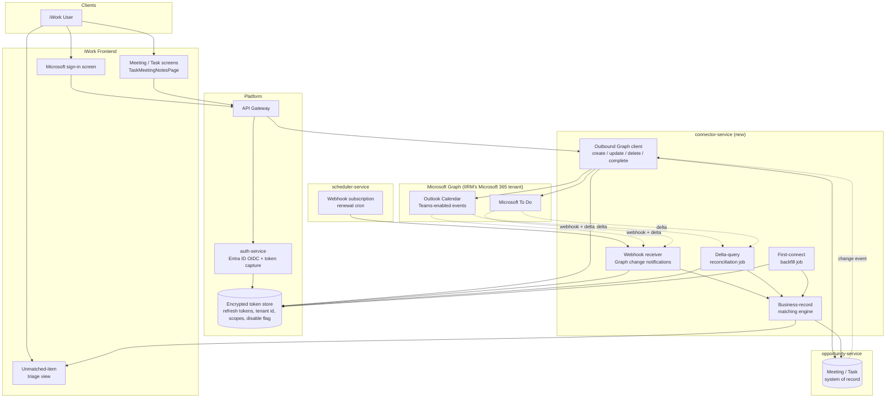
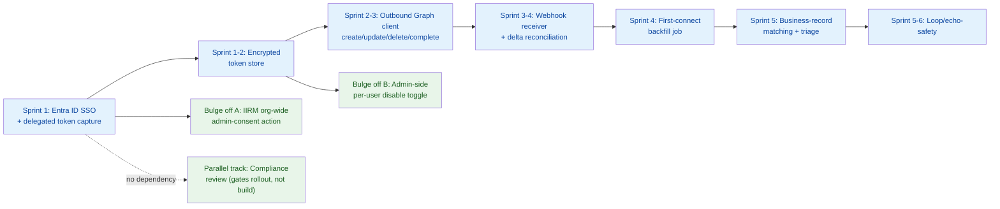
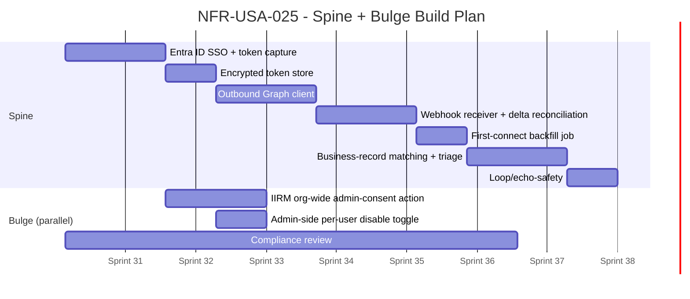

# NFR-USA-025 — Teams Calendar and Meeting Integration in iWork

**Statement by IIRM:** "Teams Calendar and meeting integration in iWork." (`NFR_Usability.docx`, NFR-USA-025)

---

## Problem

- iWork users log Meetings and Tasks in iWork against Opportunities, Companies, Insurers, and TPAs every day.
- That record lives **only inside iWork** — disconnected from the Outlook calendar and Microsoft To Do list the same user actually works out of.
- Result: users double-enter — once in iWork for the CRM record, once in Outlook/To Do for their real working day.
- Meetings and tasks created directly in Outlook/To Do (outside iWork) never reach the engagement record at all — real user activity stays invisible to the CRM.
- iWork is an internal-only application, used solely by IIRM's own staff on IIRM's intranet — it is not exposed to any external company or user. This integration targets a single Microsoft 365 tenant (IIRM's own), not multiple independently-administered client tenants.

## Proposed Solution

- Bidirectional sync of **Meetings** (as Microsoft Teams-enabled Outlook Calendar events) and **Tasks** (Microsoft To Do) between iWork and each user's own Microsoft 365 account.
- **Microsoft Graph API** as the single integration surface — see [Integration Options Considered](#integration-options-considered) for why the alternatives were rejected.
- **Entra ID (Azure AD) sign-in doubles as the consent step** — logging into iWork with a Microsoft account is the same action that grants delegated Calendar/Tasks access, for every user, with no separate opt-in screen.
- **Single-tenant by design** — one Azure app registration in IIRM's own Entra ID tenant. IIRM's own IT/security admin grants org-wide admin consent **once**, for the whole organization — not repeated per client, since there are no external client tenants involved.
- **Admin-side per-user disable** — even after org-wide consent is granted, an IIRM admin can turn sync off for a specific user (e.g., someone who leaves, or shouldn't have it) without revoking the org-wide grant. This is an admin-only control; there is no self-service opt-out.
- **One single delivery phase** — full push + pull for both Meetings and Tasks ships together, covering Outlook Web, Desktop, and mobile automatically (all three just render the same Exchange Online mailbox — no extra work needed per device/app).
- A lighter, unrelated piece of scope rides the same login: an **"Email" menu link** that deep-links into Outlook Web Access using the same Microsoft SSO session — no separate backend integration.
- Scope is deliberately narrow: only the signed-in user's **own primary calendar and own To Do list**. No shared calendars, delegate access, room bookings, or other users' calendars.
- iWork's user-facing surface stays intranet-only; only a narrow, IP-restricted public path is carved out (through the existing gateway/WAF) so Microsoft Graph can deliver webhook notifications — see [Webhook subscription renewal and reliability](#webhook-subscription-renewal-and-reliability).

---

## What the System Must Do

**Sign-in and first-connect backfill**
- The user signs into iWork using their company's Microsoft account — the same step also requests delegated Calendar/Tasks consent.
- On first successful connection, a one-time bounded backfill pulls the user's recent Outlook meetings and To Do tasks.
- Each backfilled item is matched against an existing Opportunity/Company/Insurer/TPA record; matches are created in iWork, non-matches go to a triage queue.
- From then on, new/changed Microsoft-side items that match a known record keep flowing in automatically and promptly.

**Push — iWork → Microsoft**
- The user creates/edits a Meeting against an Opportunity → pushed out as a real **Microsoft Teams online meeting** (join link, not a plain calendar block) — the NFR explicitly names Teams.
- The user creates a Task → pushed to their own Microsoft To Do list.

**Full lifecycle, not just creation**
- Reschedule, cancellation, and task-completion are distinct signals from a plain edit — each must propagate to the other side.
- An iWork-originated change must never be re-ingested as if it were a new external change (see [loop/echo prevention](#bidirectional-loop-and-echo-prevention)).

**"Email" menu — SSO deep-link (separate, lighter scope)**
- Clicking "Email" in iWork's menu opens Outlook Web Access, already signed in.
- No `connector-service`/Graph call involved — it's a plain deep link riding the Entra ID SSO session already established at iWork login.

**Admin-side per-user disable**
- An IIRM admin can disable sync for an individual user without affecting anyone else or the org-wide consent grant.
- That user's login continues to work exactly as before; only their sync (both directions) stops.
- Distinct from the "org-wide consent not yet granted" case below — this is an explicit, targeted admin action, not a pending approval.

**Boundary — explicitly out of scope**
- Shared calendars, delegate access, meeting-room bookings, any other user's calendar.
- A Microsoft item matching no known business record is neither silently created as CRM noise nor silently discarded — it lands in a manual triage view.
- Before IIRM's own IT/security admin has granted org-wide consent, every user logs in exactly as before — no error, no visible difference — sync simply stays dormant for everyone until that one-time grant happens.

---

## Integration Options Considered

| Option | Verdict | Why |
|---|---|---|
| **Microsoft Graph API** | ✅ Selected | Mature, free, fully documented for this exact use case; one integration surface for both Calendar and To Do. |
| Exchange Web Services (EWS) | ❌ Rejected | Microsoft is actively retiring it — Basic Auth already switched off for Exchange Online. Not a close call. |
| iPaaS / Power Automate | ❌ Rejected for production | Per-user licensing cost; moves core sync logic into a low-code tool outside this codebase's engineering/CI practices; doesn't map onto `opportunity-service`'s typed DTOs. Reasonable only as a throwaway demo. |
| Third-party unified calendar vendors (Nylas, Cronofy) | ❌ Rejected | Built for multi-provider abstraction this integration doesn't need (Microsoft-only requirement); neither offers first-class Microsoft To Do support, so Tasks would need direct Graph work regardless; adds a recurring per-user vendor fee for no real benefit. |

**Bottom line:** every alternative either targets a platform Microsoft is retiring, moves core logic outside this codebase's engineering discipline, or pays for abstraction a single-provider requirement doesn't use.

---

## Architecture

**Components and responsibilities:**

- **`auth-service`** — new Entra ID OIDC module, structurally a sibling to the existing `google-oauth` module. Unlike it, this module *persists* the delegated refresh token (Calendars.ReadWrite, Tasks.ReadWrite, offline_access) instead of discarding it, because background sync must run without the user being actively logged in.
- **Encrypted token store** — new table holding refresh tokens, IIRM's tenant ID, granted scopes, and a per-user admin-disable flag.
- **`connector-service`** *(currently an empty NestJS stub — the intended home for this work)* — the sync engine itself:
  - Outbound Graph client — turns an iWork create/update/delete/complete into a Teams-enabled Calendar event or To Do task call.
  - Webhook receiver — accepts Graph change notifications for the user's events and default To Do list, reached via a narrow public path carved out of the otherwise intranet-only deployment.
  - Delta-query reconciliation job — backstop for any missed webhook notification, and the only reliable way deletes/cancellations surface (Graph reports these as `@removed` delta entries or an `isCancelled` flag, not a distinct delete event).
  - First-connect backfill job — one-time, bounded historical window per newly connected user.
  - Business-record matching engine — decides whether an inbound item resolves to a known Company/Insurer/TPA/Opportunity; routes matches to `opportunity-service`, everything else to the triage queue.
- **`opportunity-service`** — unchanged as Meeting/Task system of record; gains an external-ID and sync-source field per record.
- **`scheduler-service`** — owns the recurring cron that renews Graph webhook subscriptions before they expire.

**Data flow, one line per direction:**
- **iWork → Microsoft:** edit reaches `opportunity-service` → `connector-service`'s outbound client → Graph, tagged with the iWork item's ID via a Graph extended property so the later echo is recognised and dropped.
- **Microsoft → iWork:** webhook (or delta sweep, for anything missed) → matching engine → written into `opportunity-service` exactly like a native iWork edit — both directions converge on the same data model.



### Process Flow — End-to-End Sequence

The component diagram above shows *what* talks to *what*; the sequence below shows *when*, tracing every major scenario in order: combined sign-in + consent (with graceful degradation both before IIRM's org-wide admin consent exists and for an individually admin-disabled user), the outbound push, the inbound pull with matching, ongoing subscription renewal, and the Email-menu SSO deep-link.

```mermaid
sequenceDiagram
    actor User as iWork User (Browser)
    participant iWork as iWork Frontend
    participant GW as API Gateway
    participant Auth as auth-service
    participant AAD as Entra ID
    participant TokenDB as Token Store
    participant Conn as connector-service
    participant Opp as opportunity-service
    participant Graph as Microsoft Graph
    participant Sched as scheduler-service

    Note over User,AAD: 1. Login + delegated consent (combined step)
    User->>iWork: Click "Sign in with Microsoft"
    iWork->>GW: /auth/microsoft/login
    GW->>Auth: forward request
    Auth->>AAD: OIDC authorize redirect<br/>(openid profile email + Calendars.ReadWrite + Tasks.ReadWrite + offline_access)
    AAD-->>User: Login / consent prompt

    alt IIRM's org-wide admin consent has been granted
        AAD-->>Auth: Authorization code (all scopes)
        Auth->>AAD: Exchange code for tokens
        AAD-->>Auth: id_token + access_token + refresh_token
        Auth->>TokenDB: Check this user's admin-disable flag
        alt User has not been admin-disabled
            Auth->>TokenDB: Persist encrypted refresh_token + tenant id + scopes
            Auth-->>iWork: iWork session JWT (login success)
            Auth->>Conn: New connected account
            Conn->>Graph: Register webhook subscriptions<br/>(/me/events, /me/todo/lists/{id}/tasks)
            Conn->>Graph: First-connect backfill (bounded window)
            Graph-->>Conn: Existing events / tasks
            Conn->>Conn: Business-record matching
            Conn->>Opp: Create matched Meetings / Tasks
            Conn->>iWork: Unmatched items staged in triage view
        else User has been admin-disabled
            Auth-->>iWork: iWork session JWT (login success, sync inactive)
            Note over Auth,iWork: Token obtained but not activated for sync -<br/>an IIRM admin has explicitly disabled this user
        end
    else IIRM's org-wide admin consent has not yet been granted
        AAD-->>Auth: Authorization code (identity scopes only)
        Auth->>AAD: Exchange code for tokens
        AAD-->>Auth: id_token + access_token (no Calendar/Tasks scope)
        Auth-->>iWork: iWork session JWT (login success, sync dormant)
        Note over Auth,iWork: No error shown - login behaves exactly<br/>as before; sync stays dormant org-wide until IIRM's admin consents
    end

    Note over User,Graph: 2. Push - iWork creates a Meeting (Teams-enabled)
    User->>iWork: Create Meeting against Opportunity
    iWork->>GW: POST /meetings
    GW->>Opp: Create Meeting
    Opp->>Conn: Meeting-created event (iWork meeting ID)
    Conn->>TokenDB: Fetch user's access/refresh token
    Conn->>Graph: POST /me/events<br/>(isOnlineMeeting, onlineMeetingProvider: teamsForBusiness,<br/>extendedProperty: iWorkMeetingId)
    Graph-->>Conn: Created event (Teams join link, Graph event ID)
    Conn->>Opp: Store external Graph event ID on Meeting

    Note over Graph,Opp: 3. Pull - Microsoft-side change arrives
    Graph--)Conn: Change notification (event/task created, updated, or cancelled)
    Conn->>Conn: Check extendedProperty tag

    alt Item was pushed by iWork itself (echo)
        Conn->>Conn: Drop / reconcile only - loop-safety
    else Genuinely new external item
        Conn->>Graph: Fetch full item via delta query
        Conn->>Conn: Business-record matching
        alt Matches known Company / Opportunity / Insurer / TPA
            Conn->>Opp: Create / update Meeting or Task
        else No match found
            Conn->>Opp: Stage in orphan triage queue
            Opp-->>iWork: Shown in triage view for manual linking
        end
    end

    Note over Sched,Graph: 4. Ongoing reliability
    loop Before each subscription's expiry
        Sched->>Graph: Renew webhook subscription
    end

    Note over User,AAD: 5. "Email" menu - SSO deep-link to Outlook Web (no backend call)
    User->>iWork: Click "Email" in menu
    iWork-->>User: Open outlook.office.com in new tab
    User->>AAD: Browser presents existing Entra ID SSO session
    alt Single active Microsoft session in browser
        AAD-->>User: Silently signed into Outlook Web Access
    else Multiple Microsoft accounts active in browser
        AAD-->>User: Account picker shown - standard Microsoft<br/>behavior, not controllable by iWork
    end
```

---

## What Is Hard

### Org-wide admin consent, graceful login degradation, and per-user disable

- **Why it's hard:** enterprise Microsoft 365 tenants commonly disable end-user consent for third-party apps by default. Unlocking Calendars.ReadWrite/Tasks.ReadWrite/offline_access requires *IIRM's own IT/security admin* to grant admin consent on the Azure app registration — a one-time, org-wide action entirely outside engineering's control (there is exactly one tenant to consent — IIRM's own — not a recurring per-client negotiation).
- **Risk if done naively:** because sign-in and consent are the same step, treating scope-denial as a login failure would lock every IIRM user out of iWork entirely until the org-wide grant happens — turning an internal IT approval step into an outage for the whole application.
- **Fix (confirmed behavior):** request `openid profile email` unconditionally, so basic sign-in always succeeds, and request the Calendar/Tasks scopes as an additional, separately-handled consent — catching a scope-denial response distinctly from an authentication failure and simply not activating sync org-wide until IIRM's admin grants it. No user sees any difference in the meantime; sync activates for everyone the moment the grant happens.
- **Separately, an admin-side per-user override:** even after the org-wide grant exists, an IIRM admin can disable sync for one specific user (e.g., role change, offboarding) without touching the org-wide grant or anyone else's sync. That user's login is unaffected — only their sync (both directions) goes inactive. This is enforced entirely on iWork's own side (a disable flag checked before activating sync), not something Entra ID itself is aware of.

### Resolving participant emails for outbound pushes

- **Why it's hard:** an iWork Meeting's participants are stored as internal numeric IDs — `tpaContactPerson`, `insurerContactPerson`, `companyContactPerson`, `employees` in `create-meeting.dto.ts` — not emails, and Graph's Calendar API needs real attendee addresses to create an invite.
- **Confirmed by codebase verification — this is a wiring gap, not missing data:**
  - Employee emails live on `User.emailId`.
  - Contact-person emails live one hop away via `Contact` → `ContactCommunicationDetails`.
  - Both lookups are already proven, working code elsewhere in `opportunity-service` — `opportunity.repository.ts`'s `getContactDetailsByOpportunityId` (contacts) and `getEntityTableMapIds` (employees), used today for opportunity notifications.
  - What doesn't exist yet: that same lookup inside the meeting module. `meeting.repository.ts`'s `getEmployeeNames()` and `getContactNames()` select only name fields today — zero email references anywhere in `meeting.repository.ts`, `meeting.service.ts`, or `meeting.controller.ts`.
- **Fix:** copy the existing lookup pattern into the meeting flow before the outbound Graph client runs — a bounded, precedented task, not a data-collection exercise.

### Business-record matching and orphan triage

- **Why it's hard:** Graph returns raw calendar events and tasks with attendee emails, subjects, and free-text bodies — it has no concept of an iWork Opportunity, Company, Insurer, or TPA. Deciding whether an inbound item belongs to one of those records must be inferred from unstructured data, for every item in a user's mailbox. Getting it wrong either way has a real cost: a false negative silently drops real engagement history; a false positive pollutes the CRM with personal noise.

<details>
<summary>Matching options considered</summary>

- **Pure domain/attendee matching** — fast and cheap, but produces both false negatives (a contact not yet in iWork, or a personal email) and false positives (same company domain, unrelated meeting).
- **Fully manual matching** — the user reviews and links every inbound item by hand. Safe, but defeats the purpose of automatic sync at any real meeting volume.
- **Hybrid** — auto-match using domain/attendee heuristics above a confidence threshold; route everything below that threshold to the triage queue.

</details>

- **Recommendation:** the hybrid approach — it keeps the common case automatic while making the failure mode visible and actionable instead of silent.

### Bidirectional loop and echo prevention

- **Why it's hard:** a naive implementation detects its own outbound write as a new inbound change on the next webhook notification or delta sweep, creating an infinite update loop or a duplicate item. This is only observable once both directions run simultaneously — why it sits late in the build order.
- **Fix:** tag every outbound-created Graph item with the originating iWork ID via Graph's `singleValueExtendedProperties` field, giving the inbound matcher a durable way to recognise "this is my own write coming back" and skip it — durable in the sense that it survives service restarts, unlike a short-lived in-memory suppression cache.

### First-connect historical backfill

- **Why it's hard:** backfill is a distinct, one-time bulk operation, not a special case of the steady-state real-time stream. Pulling a user's entire mailbox history on first connect is slow, risks Graph throttling, and can flood the matching engine and triage queue on day one for a heavy calendar user.
- **Fix:** a bounded window — for example, the last 90 days plus all future items — keeps the first-connect experience fast and the triage backlog manageable. The exact bound is [Open Question 6](#open-questions).

### Persistent delegated token custody

> [!warning]
> This is the one area probing explicitly flagged as needing its own compliance review, separate from the DPDP/PII framework already tracked elsewhere in this repo — treat it as a production-rollout blocker, not a nice-to-have.

- **Why it's hard:** refresh tokens are long-lived credentials to a real mailbox, held for every connected IIRM user — a breach of this token store is a breach of every connected calendar and task list at once. Tokens can also be silently invalidated by an admin action, a password change, or a conditional-access policy update, with no warning to iWork.
- **Fix:** detect an `invalid_grant` response from Graph and surface a "needs reconnection" state to the user, rather than retrying a dead token forever or failing sync silently.
- **Existing precedent to copy:** `ZohoIntegrationService` (`apps/services/ibp-service/src/app/zoho-integration/zoho-integration.service.ts`) already solves this exact problem — it stores Zoho's OAuth `access_token`/`refresh_token` on `CompanyZohoIntegration` and calls `FieldEncryptionService.encrypt()`/`.decrypt()` directly, rather than the declarative `@SensitiveField` decorator used elsewhere, because token refresh is a partial `.update()` call and TypeORM's subscriber hooks only fire on `.save()`/`.remove()`. Copy this exact pattern for Microsoft tokens.
- **Two gotchas to fix, not inherit:** confirm `FF_FIELD_ENCRYPTION_EXPERIMENTAL` and `FIELD_ENC_KEY_BASE64` are actually set in the target environment (the utility silently passes through plaintext otherwise); wrap the new `.decrypt()` calls in a try/catch — Zoho's own calls (`zoho-integration.service.ts:208,224,253`) don't, so a key rotation or corrupted row throws uncaught there today.

### Webhook subscription renewal and reliability

- **Why it's hard:** Graph change-notification subscriptions expire — on the order of a few days for calendar events, often less for other resource types — and must be proactively renewed before expiry or they silently stop delivering. Deletes and cancellations never arrive as their own webhook event; they only surface through the delta-query reconciliation sweep.
- **Implication:** the webhook path is a latency optimisation; the delta sweep is the actual correctness guarantee. Both are required, neither is optional alone.
- **Network constraint:** iWork's user-facing surface is intranet-only — not exposed to the public internet. Microsoft Graph must still reach `connector-service`'s webhook callback directly to deliver notifications, so a narrow, IP-restricted public path (allow-listing Microsoft's published Graph notification IP ranges through the existing gateway/WAF) has to be carved out for this one endpoint, without exposing the rest of the application. If that path is ever closed or misconfigured, the delta-query sweep becomes the sole inbound mechanism — degraded latency, not a hard failure, since [§ above](#webhook-subscription-renewal-and-reliability) already establishes the delta sweep as the correctness guarantee independent of webhooks.

### Regulatory and compliance review

> [!warning]
> Third-party OAuth tokens and externally-sourced personal data (meeting subjects, attendee identities, task content) is a new data category for this repository. It was explicitly scoped, during probing, as needing its own dedicated review rather than being folded into the existing DPDP/PII encryption-masking framework, and that review has not yet happened.

---

## Feasibility Verdict

| Dimension | Assessment | Time Horizon |
|---|---|---|
| Graph integration — Meetings (Teams-enabled Outlook Calendar) | Straightforward | Now |
| Graph integration — Tasks (Microsoft To Do) | Straightforward | Now |
| Org-wide admin consent (one-time) | Feasible with caveats — external, IT/security-team dependency, but a single one-time action, not a per-client rollout | Now |
| Business-record matching + orphan triage | Technically feasible / operationally hard | Now |
| Bidirectional loop/echo safety | Feasible with caveats | Now |
| Persistent token custody & security | Risky — needs mitigation | Now |
| Regulatory/compliance review | Unknown — depends on review outcome | Now |

- Nothing here requires an unproven capability or a dataset that has to be collected by running the system first — that's why every dimension is "Now," not a longer horizon. Microsoft Graph is *documented* to do exactly what's asked.
- That documented capability has **not yet been verified end-to-end against a live tenant from this codebase**: no Microsoft/Azure/Entra/MSAL/Graph code, package, or credential exists anywhere in this repo today. Only Google OAuth is implemented, and a "Sign in with Microsoft" button already sits dormant in the `ibp` app calling a `/auth/microsoft/auth-url` route that doesn't exist on the backend.
- A short live spike against a real Microsoft 365 tenant — app registration, token exchange, one Teams-enabled event created, one webhook subscription received — is the one thing standing between "documented to work" and "confirmed to work here," and it's cheap relative to the rest of the build.
- The real long poles are organisational, not technical: IIRM's own org-wide admin-consent approval runs on IIRM's IT/security team's timeline (a single one-time action, not a recurring per-client rollout), and the compliance review gates production rollout regardless of engineering speed.
- Business-record matching is the one dimension with genuine engineering judgment involved — thresholds and triage UX — but it's boundable and testable against real data as soon as IIRM's own tenant connects, not a research problem.

---

## Why These Outputs — Nothing Missing?

| Output | Why it cannot be dropped |
|---|---|
| Synced-in Meeting<br/>(Outlook → iWork) | Without it, users' real<br/>calendar activity never<br/>reaches the CRM — the<br/>entire pull half of<br/>NFR-USA-025 disappears. |
| Synced-in Task<br/>(To Do → iWork) | Same gap on the task<br/>side — personal to-dos<br/>stay invisible to the<br/>engagement record. |
| Pushed-out Teams meeting<br/>(iWork → Outlook) | Without it, iWork-created<br/>meetings never reach the<br/>user's real calendar; they'd<br/>have to be recreated<br/>by hand. |
| Pushed-out To Do task<br/>(iWork → Microsoft) | Same gap for tasks —<br/>defeats the push half of<br/>bidirectional sync<br/>entirely. |
| Persisted token record | Without stored refresh<br/>tokens, sync only runs<br/>while the user is<br/>actively logged in — no<br/>background sync at all. |
| Business-record match /<br/>staging queue | Without it, either every<br/>personal meeting pollutes<br/>the CRM, or every real<br/>engagement meeting is<br/>silently dropped. |
| Delete/cancellation<br/>propagation | Without it, cancelled<br/>meetings and completed<br/>tasks linger forever on<br/>the other side as stale,<br/>wrong data. |
| First-connect<br/>backfill result | Without it, a newly<br/>connected user sees an<br/>empty sync — only items<br/>created after they<br/>connected, no history. |

---

## Build Order

The spine for this system is:

`Entra ID SSO + delegated token capture → encrypted token store → connector-service outbound Graph client (iWork → Microsoft) → webhook receiver + delta reconciliation (Microsoft → iWork) → first-connect historical backfill job → business-record matching engine + orphan triage → loop/echo-safety`

**Why this order:**
- **Token capture first** — nothing else can call Graph on a user's behalf without it; no partial version of this feature skips it.
- **Outbound push before inbound webhook/matching** — it's the simpler direction (iWork already knows the full state of what it's creating), and it validates the Graph client, Teams-meeting creation, and token-refresh logic end-to-end against a live tenant before the harder inbound side is built on top of it.
- **Webhook receiver + delta reconciliation before backfill** — backfill needs to reuse that same normalisation/dedup path rather than a second, bespoke one built just for the one-time case.
- **Matching engine after both sync directions exist** — it needs real inbound payloads (from webhooks and backfill) to test match/no-match logic against; synthetic test data wouldn't exercise the actual ambiguity this component exists to handle.
- **Loop/echo-safety last** — only observable once both directions are running at the same time.

**Bulges:**
- IIRM org-wide admin-consent action — off the token-capture spine node; needs the OIDC/consent flow and app registration to exist, nothing from the sync engine. A single internal request to IIRM's own IT/security admin, not a recurring rollout, so it can happen any time in parallel with the rest of the spine.
- Admin-side per-user disable toggle — off the token-store spine node; a small admin API + UI control, no dependency on the sync engine, so it can be built in parallel once the token store's schema (including the disable flag) exists.
- Compliance review — a parallel track from day one with no technical dependency on the spine; engineering can proceed fully against a sandbox tenant while it runs, but no real user data flows through the system until it signs off.



**Spine nodes** (delay here delays everything): Entra ID SSO + token capture, token store, outbound Graph client, webhook receiver + delta reconciliation, backfill job, matching engine + triage, loop/echo-safety.

**Bulge nodes** (unblocked when parent spine node completes): IIRM org-wide admin-consent action (parent: Entra ID SSO + token capture); admin-side per-user disable toggle (parent: encrypted token store); compliance review (no technical parent — runs independently, gates rollout).



**Parallelism rules:**
- The compliance review runs in parallel with the entire technical build starting day one; it doesn't block engineering, but it does block enabling the feature for any real user's data.
- The org-wide admin-consent request can go out the moment the app registration and consent screen exist — no need to wait for the webhook, matching, or backfill work, since it's a single internal action, not a per-client campaign.
- The outbound client and the webhook receiver can be built by different engineers in parallel once the token store exists, but they must integration-test together before loop/echo-safety can be verified.
- Backfill cannot be parallelised ahead of the webhook/delta-reconciliation node, since it's designed to reuse that same normalisation path.

---

## Open Questions

1. Who at IIRM owns requesting the org-wide admin-consent grant from IIRM's own IT/security team, and is there an existing internal process for approving new Enterprise Applications?
2. What is the exact business-record matching heuristic (domain-match confidence threshold, attendee-matching rules), and who defines and tunes it?
3. Who *operationally owns* the webhook-subscription-renewal cron — technically confirmed ready (`scheduler-service` has a mature dual pattern: static `@Cron` jobs and a DB-driven `DynamicCronService` used for exactly this shape of recurring external-API job, per `apps/services/scheduler-service/src/app/cron-configuration/`), but no team/person is assigned yet.
4. Does Entra ID SSO fully replace the existing login methods (OTP, simple-auth, `google-oauth`) for iWork once this ships, or do they coexist indefinitely (e.g., for any IIRM user without a Microsoft account)?
5. Who owns the separate compliance review this feature was explicitly scoped as needing, and on what timeline?
6. What is the exact first-connect backfill window — a fixed bound such as 90 days, or something else?
7. What does the orphan/unmatched-item triage view look like in the iWork UI, and who is expected to act on it — the user themselves, or an admin/ops role?
8. When a user's Microsoft token is revoked or expires, do already-synced iWork items remain as last-known-good snapshots, get visibly flagged as stale, or something else?
9. There is already a dormant "Sign in with Microsoft" button in the `ibp` app (`apps/ui/ibp/src/app/components/SignIn/index.tsx`), with a `MICROSOFT_OAUTH` method code anticipated in `authentication-method.entity.ts`, calling a `/auth/microsoft/auth-url` route that does not exist on the backend. Was this meant to become part of this same Entra ID integration eventually, or is it unrelated legacy scaffolding that should be removed rather than built on?
10. A live capability spike against a real Microsoft 365 tenant has not been run yet — every "Now" verdict above rests on Graph's documented behaviour, not on anything confirmed working in this codebase. Who runs that spike, and does it happen before or alongside the first sprint of real build work?
11. What does the admin-side per-user disable control look like — a dedicated admin panel screen, a flag inside an existing user-management view, and is a disable action itself audit-logged (who disabled which user, when, and why)?
12. Has infra confirmed the narrow public-path carve-out for the webhook callback is actually feasible through the existing gateway/WAF, given the rest of iWork is intranet-only — and what is the actual allow-listed IP range/domain Microsoft publishes for Graph notification traffic in the target Azure region?
13. Does IIRM's employee-offboarding process (tied to the existing User Mgmt-Emp workflow / `ibp-employee-auth`) automatically flip a departing employee's admin-side sync-disable flag, or does someone have to remember to do that manually today? If manual, is that an acceptable gap for V1 or does it need to be linked?
14. Does IIRM's own Entra ID tenant have (or plan to add) Conditional Access policies — managed-device requirement, MFA, IP restriction — on this app registration? If so, the OAuth flow needs error handling for a Conditional-Access-blocked sign-in, not yet designed.
15. Recurring meeting series (Graph's `seriesMasterId` model) are not addressed anywhere in this design — iWork's own Meeting fields suggest single-instance only. Is recurring-meeting sync explicitly out of scope for V1, and if so, what should happen if a user pushes/receives one anyway (reject, sync only the instance, or something else)?

---

## References — Industry Frameworks and Reading

Microsoft's own developer documentation for the APIs this design relies on:

| Topic | Link |
|---|---|
| Microsoft Graph — Calendar/Events API | https://learn.microsoft.com/en-us/graph/api/resources/calendar |
| Creating Teams online meetings via Calendar events | https://learn.microsoft.com/en-us/graph/api/user-post-onlinemeetings |
| Microsoft Graph — webhooks / change notifications | https://learn.microsoft.com/en-us/graph/webhooks |
| Microsoft Graph — delta query | https://learn.microsoft.com/en-us/graph/delta-query-overview |
| Microsoft To Do API | https://learn.microsoft.com/en-us/graph/api/resources/todo-overview |
| Register an app with the Microsoft identity platform | https://learn.microsoft.com/en-us/entra/identity-platform/quickstart-register-app |
| Admin consent for enterprise applications | https://learn.microsoft.com/en-us/entra/identity/enterprise-apps/grant-admin-consent |

Architecture-practice references this document's format draws on (see [A Note on Document Format](#a-note-on-document-format) below for how, and how much):

| Framework | Link | Relevance here |
|---|---|---|
| arc42 | https://arc42.org/overview | Widely-used lightweight software/solution architecture template — source of the "building block view + diagram" and "risks" style sections. |
| ISO/IEC/IEEE 42010 | https://quality.arc42.org/standards/iso-42010 | The formal standard for architecture description (stakeholders, concerns, viewpoints, views) — this document is informed by it, not a strict implementation. |
| TOGAF ADM, Phase C | https://publications.opengroup.org/standards/togaf/specifications/c220 | Enterprise architecture method; its "Architecture Definition Document" concept is the closest formal analogue to this document. |
| C4 model | https://c4model.com/ | Diagramming convention (Context → Container → Component → Code) — the component diagram above sits roughly at the Container/Component level. |
| Architecture Decision Records (Nygard) | https://adr.github.io/ | Lightweight decision-log format — the "What Is Hard" and "Integration Options Considered" sections borrow its Context/Decision/Consequences shape. |
| Microsoft Azure Well-Architected — ADRs | https://learn.microsoft.com/en-us/azure/well-architected/architect-role/architecture-decision-record | Microsoft's own current guidance on recording architecture decisions. |

### A Note on Document Format

Honest answer to "does this follow the industry-standard Solution Architecture template": **no, not literally.** There is no single named standard this document implements end to end. It borrows recognisable *practices* — ADR-style option/decision framing, a C4-ish component diagram, an arc42-flavoured "risks" section — without being arc42, TOGAF, or ISO 42010 in structure.

What's missing for strict conformance, if that's ever required (e.g. for a client audit):
- **arc42:** no `Constraints`, no `Context & Scope` (explicit external system boundary), no `Solution Strategy`, no `Runtime View`, no `Deployment View`, no `Quality Requirements` tree, no `Glossary`.
- **TOGAF:** no Baseline-vs-Target architecture distinction, no formal stakeholder/Request-for-Architecture-Work framing, no separate Data/Application/Technology domain views.
- **ISO/IEC/IEEE 42010:** no explicit stakeholder list, no named concerns, no named viewpoints, no explicit view-to-concern traceability.

This document is closer to an internal feasibility memo with architecture-decision-record elements than a formal SAD — which is a reasonable fit for an analysis-and-architecture stage feeding into `/daksh TRD`, but worth naming plainly rather than implying a conformance it doesn't have. If arc42 or ISO 42010 conformance is genuinely needed, say so and this document can be restructured against one of those templates directly.
