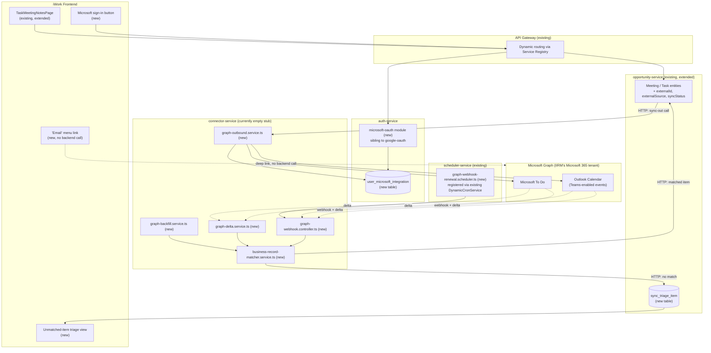
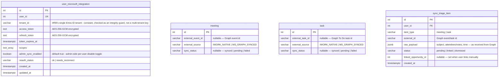
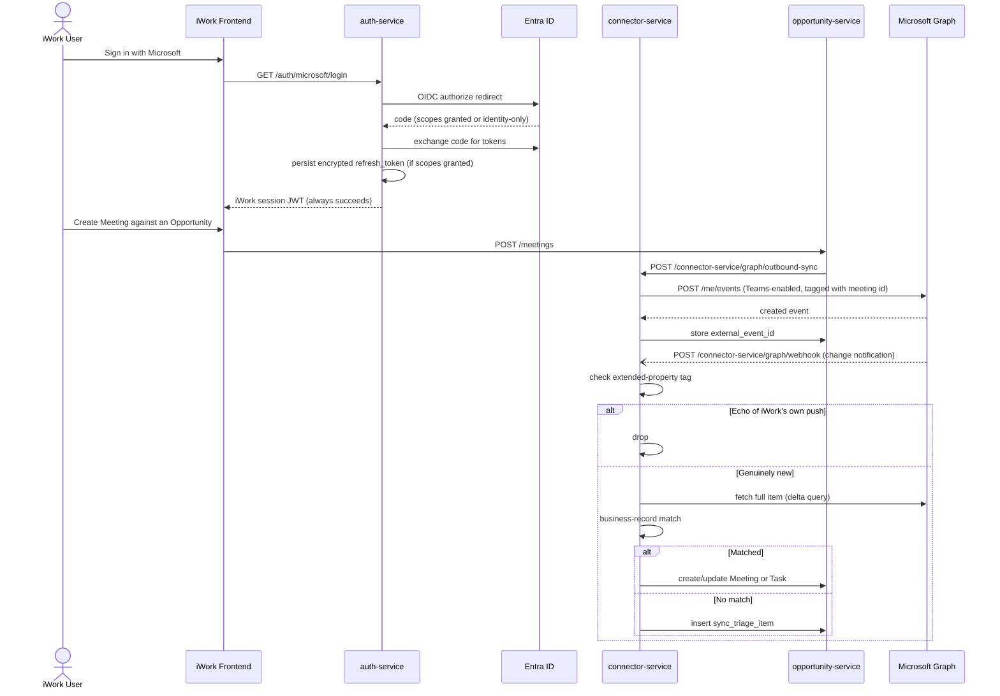

# NFR-USA-025 — Microsoft Teams Calendar & Tasks Integration — Technical Requirements Document

**Module:** NFR-USA-025
**Product:** iWork (Insurance Wellness Hub)
**Client:** IIRM
**Stage:** 40b — Module TRD
**Mode:** Greenfield (forward design — nothing described here is implemented yet)
**Authored:** 2026-07-28
**Audience:** Backend/frontend developers, infra/DevOps engineers, TL/PTL sign-off
**PRD Reference (inherited, stage 40a):** [NFR-USA-025_Solution-Architecture.md](NFR-USA-025_Solution-Architecture.md)

This TRD translates the approved solution architecture into a design developers and infra engineers can build from without daily clarification. Every component named here maps to a specific new module, entity, or job — most of them copying a proven pattern already running in this codebase (the `google-oauth` module's shape, the `ZohoIntegrationService` token-encryption pattern, `scheduler-service`'s `DynamicCronService`) rather than inventing new ones. Where a choice diverges from an existing pattern, [Technology Choices](#8-technology-choices) states why.

---

## 1. Scope

**This TRD designs:**
- The Entra ID OIDC login + delegated-consent module in `auth-service` and its encrypted token store.
- The Graph sync engine in `connector-service` (outbound push, webhook receiver, delta reconciliation, first-connect backfill, business-record matcher).
- The schema additions to `opportunity-service`'s Meeting/Task entities and the new orphan-triage table.
- The webhook-subscription-renewal job in `scheduler-service`.
- The Developer vs. Infra/DevOps ownership split for every piece above.

**Explicit non-goals (out of scope for this TRD):**
- Microsoft Planner integration — the [Solution-Architecture doc](NFR-USA-025_Solution-Architecture.md#integration-options-considered) scoped Tasks to Microsoft To Do only.
- Shared calendars, delegate mailbox access, meeting-room/resource bookings — explicitly out of scope per the architecture's stated boundary.
- Designing the compliance review process itself — referenced as a hard blocker, not designed here (see [Open Questions](#12-open-questions)).
- The granular Jira task breakdown — that is stage 40c, not this document.
- Redesigning `auth-service`'s existing login methods (OTP, simple-auth, `google-oauth`) — whether they coexist with Entra ID SSO is [Open Question 4](NFR-USA-025_Solution-Architecture.md#open-questions) in the architecture doc, unresolved as of this TRD.

---

## 2. Architecture Overview

The design adds exactly one new capability to each of four existing services, rather than introducing a new service for this feature. That choice follows directly from what the codebase already has: `auth-service` already owns every login mechanism iWork has (`google-oauth`, `simple-auth`, `phone-otp`, `email-otp`), so a new `microsoft-oauth` module belongs there, not in a new service. `connector-service` exists specifically as the unimplemented integration-layer service from the original solution architecture (confirmed still an empty stub — no business logic, `imports: []`) — this is the first real work it does. `opportunity-service` already owns Meeting and Task as the system of record; splitting that ownership across two services for one integration would violate the platform's existing service boundaries for no benefit. `scheduler-service` already runs every other recurring background job on this platform, including a DB-driven cron abstraction (`DynamicCronService`) purpose-built for exactly this shape of job (register a handler, let ops control the schedule from an admin page, get automatic run-audit logging).

The one real architectural decision this design makes — beyond following those boundaries — is how `opportunity-service` and `connector-service` talk to each other. This repo has no event bus or pub/sub layer; every existing service-to-service call is synchronous HTTP via the API Gateway. This design keeps that pattern: `opportunity-service` calls `connector-service` directly (and vice versa) over HTTP, rather than introducing Redis pub/sub or a message queue. See [§8](#8-technology-choices) for why that tradeoff is deliberate, not an oversight.



---

## 3. Team Ownership — Developer vs Infra/DevOps

Every component above is either code (developer) or environment/account setup (infra/DevOps or, in one case, IIRM's own IT — not Divami at all). Getting this wrong in either direction stalls the build: a developer waiting on an app registration that infra doesn't know it owns, or infra provisioning a key that was never actually needed.

| Component | Owner | Notes |
|---|---|---|
| `microsoft-oauth` module (`auth-service`) | **Developer** | Code: strategy, controller, service, entity, migration. |
| `user_microsoft_integration` table + migration | **Developer** | Standard TypeORM migration, developer-authored and reviewed like any other. |
| `connector-service` graph-sync module (all 5 components) | **Developer** | Full new module — outbound client, webhook receiver, delta job, backfill job, matcher. |
| `opportunity-service` schema additions | **Developer** | New columns + `sync_triage_item` table; migration. |
| `graph-webhook-renewal.scheduler.ts` | **Developer** | Follows the existing `DynamicCronService` registration pattern. |
| Frontend: sign-in button, triage view, Email menu link | **Developer** | React/`ui-lib` components. |
| Azure AD (Entra ID) app registration itself | **⚠️ IIRM's own IT/Azure tenant admin — external to Divami** | IIRM's own IT/security admin must create/approve the app registration and grant org-wide admin consent for Calendars/Tasks scopes on IIRM's single Entra ID tenant — a one-time action, not a per-client rollout. This is not a Divami infra task at all — see [Open Question 1](NFR-USA-025_Solution-Architecture.md#open-questions). |
| Redirect URI configuration per environment (dev/uat/preprod/prod) on the app registration | **Infra/DevOps** | Coordinated with IIRM's own IT admin above, but the per-environment URI list is ours to specify. |
| Admin-side per-user disable control (API + UI) | **Developer** | Toggles the `user_microsoft_integration` disable flag for one user; see [§4 Data Model](#4-data-model) and [Open Question 11](NFR-USA-025_Solution-Architecture.md#open-questions) for the exact UI location. |
| Public HTTPS route for the webhook receiver, through the existing API Gateway/ALB | **Infra/DevOps** | New ingress rule; must be reachable by Microsoft's Graph notification service. Confirm no WAF rule blocks Microsoft's outbound notification IP ranges. |
| Secrets management for Client ID/Secret across environments | **Infra/DevOps** | Match whatever secrets pattern the existing Jenkinsfiles already use for other services' credentials. |
| `FIELD_ENC_KEY_BASE64` / `FF_FIELD_ENCRYPTION_EXPERIMENTAL` provisioning per environment | **Infra/DevOps** | Confirm these are actually set — [§6](#6-security-design) explains why an unset flag means silent plaintext storage, not an error. |
| Monitoring/alerting for webhook-renewal failures and token-refresh failures | **Infra/DevOps** | New alert rules on whatever monitoring stack the platform already uses. |
| DNS/TLS if a new subdomain or route is needed for the webhook callback | **Infra/DevOps** | Only if the existing API Gateway domain can't host the new route as a sub-path. |
| Narrow public-path carve-out for the webhook route | **Infra/DevOps** | ⚠️ iWork is intranet-only otherwise. This one route must be reachable from Microsoft's Graph notification service specifically — allow-list Microsoft's published Graph notification IP ranges on the WAF rule for this path only; every other route stays intranet-restricted. See [Open Question 12](NFR-USA-025_Solution-Architecture.md#open-questions). |

---

## 4. Data Model

Two schema changes, in two different services, both additive (no existing column changes):



- `user_microsoft_integration` lives in `auth-service`'s schema, keyed by `user_id` (not `company_id` — consent is per iWork user, matching the Zoho integration's per-company keying pattern but at user granularity, since this feature connects an individual's mailbox, not a shared company account).
- `meeting` and `task` gain three nullable columns each in `opportunity-service` — nullable so every existing row (all iWork-native, pre-dating this feature) needs no backfill.
- `sync_triage_item` is new, also in `opportunity-service`'s schema, since triage items are provisional Meetings/Tasks awaiting a human decision, not a `connector-service` concern once Graph's raw payload has been fetched.

---

## 5. API Contracts

| Endpoint | Method | Service | Auth | Purpose |
|---|---|---|---|---|
| `/auth/microsoft/login` | GET | auth-service | Public | Redirects to Entra ID `/authorize` with `openid profile email` scopes always requested, `Calendars.ReadWrite Tasks.ReadWrite offline_access` requested as additional scopes on the same request. |
| `/auth/microsoft/callback` | GET | auth-service | Public (Entra ID redirects here directly) | Exchanges `code` for tokens; persists encrypted refresh token if Calendar/Tasks scopes were granted; issues the standard iWork session JWT regardless of scope outcome (see [§6](#6-security-design) for why this must never hard-fail on partial consent). |
| `/connector-service/graph/webhook` | POST | connector-service | Public, validated by Graph's `clientState` secret (not JWT — Graph itself calls this) | Accepts Graph change notifications; also handles the subscription-creation validation handshake (echoes `validationToken` query param on `POST` with empty body, per Graph's webhook spec). |
| `/connector-service/graph/outbound-sync` | POST | connector-service | Internal service-to-service (JWT scoped to `opportunity-service`'s service identity, not a user JWT) | Called by `opportunity-service` on Meeting/Task create/update/delete/complete; body: `{ userId, itemType, operation, meetingOrTaskId }`. |
| `/connector-service/triage` | GET | connector-service | User JWT | Lists the calling user's pending `sync_triage_item` rows, for the frontend triage view. |
| `/connector-service/triage/:id/link` | POST | connector-service | User JWT | Body: `{ opportunityId }`. Promotes a triage row into a real Meeting/Task in `opportunity-service` and marks the triage row `linked`. |
| `/connector-service/triage/:id/dismiss` | POST | connector-service | User JWT | Marks a triage row `dismissed` — it was correctly identified as not business-relevant. |
| `/connector-service/admin/users/:userId/disable-sync` | POST | connector-service | Admin JWT (admin role required) | Sets `admin_sync_enabled = false` for the target user. Their login is unaffected; both push and pull stop immediately. Already-synced items are left as-is (last-known state), not deleted. |
| `/connector-service/admin/users/:userId/enable-sync` | POST | connector-service | Admin JWT (admin role required) | Sets `admin_sync_enabled = true`, resuming sync on the next scheduled/webhook event — does not trigger a fresh backfill. |

**Error codes:**
- `401` from Graph on any call → trigger the token-refresh path (`§2.3`-style flow, matching `ZohoIntegrationService.getValidAccessToken`'s pattern); if refresh itself fails with `invalid_grant`, set `user_microsoft_integration.reauth_status = "needs_reconnect"` and stop retrying silently.
- `429` from Graph → respect the `Retry-After` header; back off and retry once, matching the existing `ZohoPeopleApiService` pagination's 429-handling pattern.
- `410 Gone` on a webhook subscription (expired without renewal) → resubscribe immediately rather than erroring, then let the next scheduled renewal take over.
- Graph errors return `{ error: { code, message } }` on non-2xx responses (standard Graph error shape) — map to the equivalent NestJS `HttpException` subclass rather than passing Graph's shape through verbatim.

---

## 6. Data Flow

The primary flow developers need to build against is the full round trip: a user connects, an item is pushed out, a change comes back in, and the loop-safety check prevents that change from being reprocessed as new.



---

## 7. Component Detail — connector-service (new module)

| Component | Responsibility | Key design detail |
|---|---|---|
| `graph-outbound.service.ts` | Turns an `opportunity-service` create/update/delete/complete into a Graph call. | Resolves attendee emails via the same lookup pattern already proven in `opportunity.repository.ts` (`getContactDetailsByOpportunityId`, `getEntityTableMapIds`) — copied into this service, not re-derived. Tags every created event with the iWork item ID via `singleValueExtendedProperties`. |
| `graph-webhook.controller.ts` / `.service.ts` | Receives Graph change notifications. | Validates the `clientState` secret on every notification; on the subscription-creation handshake, echoes `validationToken` as `text/plain` within Graph's required response window. |
| `graph-delta.service.ts` | Periodic reconciliation sweep. | Runs on the schedule set by `graph-webhook-renewal.scheduler.ts`; also the only path that surfaces deletes/cancellations (`@removed` delta entries, `isCancelled` flag). |
| `graph-backfill.service.ts` | One-time, bounded pull on first connect. | Bounded window (exact duration — [Open Question 6](NFR-USA-025_Solution-Architecture.md#open-questions) in the architecture doc); reuses `graph-delta.service.ts`'s normalization path rather than a separate one. |
| `business-record-matcher.service.ts` | Decides match vs. triage. | Hybrid heuristic per the architecture doc's recommendation — domain/attendee match above a confidence threshold (threshold itself is [Open Question 2](NFR-USA-025_Solution-Architecture.md#open-questions)); below threshold, insert into `sync_triage_item`. |

---

## 8. Technology Choices

| Choice | Justification | Alternative considered |
|---|---|---|
| `@azure/msal-node` for the OAuth/OIDC flow | Microsoft's own maintained library; handles token caching, PKCE, and refresh-token lifecycle correctly — exactly the part `google-oauth` doesn't need to get right today because it discards tokens. Hand-rolling this for a persistent, security-sensitive token flow is the wrong tradeoff. | Manual `axios` calls, matching `google-oauth`'s existing pattern — rejected because that pattern was built for a discard-after-login flow, not persistent token custody. `passport-azure-ad` — less actively maintained than MSAL for this use case. |
| Direct Graph client (`fetch`/`axios`) over `@microsoft/microsoft-graph-client` SDK | Keeps the dependency surface small; this integration touches a small, fixed set of Graph endpoints (events, To Do, subscriptions, delta) that don't need the SDK's generic request-builder abstraction. | The official Graph SDK — reasonable, but adds a dependency for convenience this integration's narrow endpoint set doesn't need. |
| Copy `ZohoIntegrationService`'s manual `.encrypt()`/`.decrypt()` pattern (not the `@SensitiveField` decorator) | Token refresh is a partial `.update()` call; TypeORM's subscriber hooks that make `@SensitiveField` automatic only fire on `.save()`/`.remove()`. This exact constraint is why Zoho's integration already uses the manual pattern — same constraint applies here. | `@SensitiveField` decorator — would silently fail to encrypt on refresh-path updates. |
| Synchronous HTTP between `opportunity-service` and `connector-service` | Matches the platform's existing service-to-service pattern; no event bus or pub/sub exists anywhere in this codebase today. | Redis pub/sub or a message queue — a larger architectural change than this feature justifies; revisit if sync volume later demands async decoupling. |
| `connector-service` as the sync-engine home | Matches its intended architectural role (the unimplemented integration-layer service) and keeps `opportunity-service` focused on CRM domain logic. | Building the sync engine directly inside `opportunity-service` — rejected; mixes CRM logic with third-party integration plumbing and makes both harder to test independently. |
| `scheduler-service`'s `DynamicCronService` for webhook renewal | Already the platform's proven pattern for exactly this shape of recurring external-API job (see `external-hospital-sync.scheduler.ts`); gives ops visibility and control without new infrastructure. | A static `@Cron` inside `connector-service` itself — rejected; duplicates a responsibility `scheduler-service` already owns platform-wide. |

---

## 9. Security Design

| Concern | Design | Notes |
|---|---|---|
| OAuth/OIDC flow | Authorization code flow with PKCE, via MSAL Node | Standard, matches Microsoft's own current guidance. |
| Combined login + consent | Basic sign-in scopes (`openid profile email`) requested unconditionally; Calendar/Tasks scopes requested as an additional, separately-handled grant | A scope denial must never fail the login itself — see [Org-wide admin consent, graceful login degradation, and per-user disable](NFR-USA-025_Solution-Architecture.md#org-wide-admin-consent-graceful-login-degradation-and-per-user-disable). |
| Admin-side per-user disable | `admin_sync_enabled` checked before any push/pull operation; enforced entirely in `connector-service`, invisible to the user | Only an IIRM admin can flip this — no self-service opt-out (per product decision). |
| Token storage | `access_token`/`refresh_token` AES-256-GCM encrypted at rest via `FieldEncryptionService`, matching `ZohoIntegrationService`'s exact pattern | ⚠️ `FF_FIELD_ENCRYPTION_EXPERIMENTAL` and `FIELD_ENC_KEY_BASE64` must be confirmed set in every target environment — the utility silently passes through plaintext if not, with no error raised. |
| Decrypt error handling | Every `.decrypt()` call wrapped in try/catch | Zoho's own calls do not do this today and can throw uncaught on a corrupted row or key rotation — this design fixes that rather than inheriting it. |
| Webhook authenticity | Graph's `clientState` secret validated on every notification | Prevents a forged notification from triggering a sync. |
| Per-user scoping on `connector-service` endpoints | User identity always derived from the JWT, never from a caller-supplied `userId` query/body param | This is a direct lesson from `ZohoIntegrationService`'s own TRD (GAP-03: `companyId` accepted as an unverified query param on four endpoints) — this design closes that class of bug from the start rather than repeating it. |
| Audit trail | Every outbound push and inbound sync decision logged with the iWork item ID, the Graph item ID, and the decision (matched / triaged / echo-dropped) | Needed to debug a sync discrepancy without re-deriving it from Graph API calls after the fact. |
| Compliance review | Not designed here — explicitly out of scope, see [§1](#1-scope) | Blocking for production rollout regardless of engineering completion. |

---

## 10. NFR Design

| Requirement | Design decision |
|---|---|
| Webhook subscription expiry | Renewed proactively via `scheduler-service`'s cron, on a schedule set safely inside Graph's expiry window (a few days for calendar events) — the delta sweep is the backstop if a renewal is ever missed. |
| Graph rate limiting | Standard exponential backoff on `429`, respecting `Retry-After`; pagination-style delay between backfill requests, matching the existing `ZohoPeopleApiService` pagination's throttling pattern. |
| First-connect backfill performance | Bounded window (not full mailbox history) keeps a single user's first connect from generating an unbounded burst of matching-engine work. |
| Tenant integrity check | `tenant_id` on each `user_microsoft_integration` row is checked against IIRM's expected single tenant on every token operation — a defensive guard against a misconfigured or forged token, not multi-tenant routing logic (there is only one tenant). |
| Intranet-only exposure | Every route except the webhook callback stays behind the existing intranet/VPN boundary; the webhook route is the sole, narrow, WAF-restricted exception (see [§3 Team Ownership](#3-team-ownership--developer-vs-infradevops)). |
| Bidirectional loop safety | Extended-property tagging on every outbound-created Graph item, checked before any inbound item is processed — durable across service restarts, unlike an in-memory suppression cache. |

---

## 11. Testing Strategy

| Layer | Coverage target |
|---|---|
| Unit — token encrypt/decrypt | Round-trip correctness; decrypt failure is caught, not thrown uncaught. |
| Unit — `business-record-matcher.service.ts` | Domain/attendee match above/below threshold; both branches produce the correct routing (Meeting/Task vs. triage row). |
| Unit — echo/loop detection | An item tagged with an iWork-originated extended property is recognized and dropped; an untagged item is not. |
| Integration — full OAuth connect flow | Against a Microsoft 365 Developer Program sandbox tenant — `login` → simulated callback → verify encrypted token row created. |
| Integration — outbound push | Create a Meeting in a test environment → verify a real Teams-enabled event appears in the sandbox tenant's calendar. |
| Integration — inbound webhook + delta | Create an event directly in the sandbox tenant's Outlook → verify it arrives via webhook (or the delta sweep, if webhook delivery is simulated as missed) and is correctly matched or triaged. |
| Mocked in CI | The Graph API client itself — automated unit/integration tests must not depend on live Microsoft calls; only a dedicated sandbox-tenant smoke-test suite hits real Graph. |
| Security | Attempt a `connector-service` call with a JWT for one user but a `userId` referencing another — must be rejected, directly testing the fix described in [§9](#9-security-design). |
| Integration — admin-side per-user disable | Disable a test user via the admin endpoint → verify their login still succeeds and no further push/pull occurs → re-enable → verify sync resumes without a fresh backfill. |

---

## 12. Open Questions

Business/process open questions are tracked in the architecture doc and not repeated here in full — see [NFR-USA-025_Solution-Architecture.md § Open Questions](NFR-USA-025_Solution-Architecture.md#open-questions). TRD-specific technical open questions:

1. Confirm `@azure/msal-node` is an acceptable new dependency (not yet present in any `package.json` in this repo) before implementation starts.
2. What is the actual public domain/path for the webhook callback URL in each environment (dev/uat/preprod/prod), and does it require a new DNS entry or fit under the existing API Gateway domain?
3. Should `sync_triage_item` live in `opportunity-service`'s existing schema (as designed here) or a schema `connector-service` owns itself, if `connector-service` is expected to gain its own datastore for future integrations?
4. Exact webhook-subscription renewal cadence (e.g., renew at 80% of the expiry window) — a scheduling parameter, not yet fixed.
5. Does the Microsoft 365 Developer Program sandbox tenant already exist for IIRM/Divami, or does provisioning it become an infra prerequisite before integration testing can start?
6. Which existing role, from `auth-service`'s `AccessControlModule` (RBAC/ACL), should gate the admin-side per-user disable endpoints — is there already an "admin" role suited to this, or does a new permission need to be defined?
7. **Cross-user duplicate meetings.** When User A pushes a Meeting that invites User B (another connected iWork user), Outlook delivers a copy of the same event to User B's mailbox, and User B's own webhook subscription will fire on it. Does the `extendedProperty` tag set on User A's copy propagate to User B's copy of the same event, or does duplicate-detection need to key off Graph's `iCalUId` instead (stable across every attendee's mailbox copy)? Unconfirmed — needs verification in the live Graph spike ([Open Question 10](NFR-USA-025_Solution-Architecture.md#open-questions)) before the matching engine's duplicate-detection logic can be finalized. If `iCalUId` matching is needed, add it as a lookup key alongside `external_event_id` in [§4 Data Model](#4-data-model).
8. **No admin-listing endpoint exists.** `/connector-service/admin/users/:userId/disable-sync` (see [§5 API Contracts](#5-api-contracts)) requires already knowing the target `userId` — there is no endpoint to list all users' current sync status (connected / disabled / needs-reconnect) for an admin to choose from. Needs a `GET /connector-service/admin/users` (or similar) added to the API contract.
9. **Shared mailboxes / distribution lists as meeting attendees** (e.g. `sales-team@iirm.com`) won't resolve through the `User.emailId` / `Contact.communicationDetails` lookup path described in [What Is Hard § Resolving participant emails](NFR-USA-025_Solution-Architecture.md#resolving-participant-emails-for-outbound-pushes). Is passing the raw, unresolved email through to Graph acceptable, or does this need explicit detection/handling?

---

## 13. Approval

Leave blank. TL/PTL sign-off authority.

```
Approved by:
Role:
Date:

Approved by:
Role:
Date:
```

---

# END OF TRD
