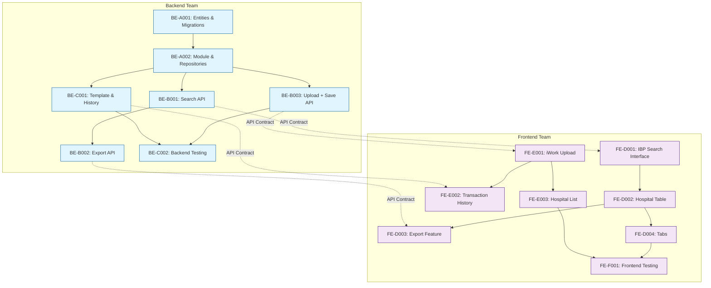

# Tasks - Phase 1

## 1. Task Overview

- **Component:** HOSPITAL-NETWORK
- **Phase:** 1
- **Technical Spec:** [phase-1-technical-spec.md](./phase-1-technical-spec.md)
- **Total Estimated Effort:** 45 story points
  - **Backend:** 25 story points
  - **Frontend:** 20 story points
- **Implementation Order:** Backend-first approach with parallel frontend development after API contracts are defined
- **Phase 1 Scope:** Complete Phase 1 hospital network feature with search, upload, validation, and testing using existing common audit logging functionality
- **Existing Infrastructure:**
  - ✅ TypeORM & PostgreSQL configuration (service-lib)
  - ✅ NestJS modules structure with existing guards (AclGuard, PolicyAccessGuard)
  - ✅ JWT authentication integration (auth-service)
  - ✅ Logging infrastructure (TraceIdService, Winston)
  - ✅ React Query & Axios setup
  - ✅ Material-UI theme and shared components (ui-lib)
  - ✅ React Router configuration
  - ✅ Redux store setup
  - ✅ Bull queue configuration
  - ✅ Swagger documentation setup

---

## 2. Task Categories

### Backend Tasks (25 story points)

#### Category A: Backend Data Layer (8 points)

Database entities, repositories, and migrations for hospital network feature

#### Category B: Backend Core Implementation (12 points)

API endpoints, validation logic, Excel processing, and business logic

#### Category C: Backend Integration & Testing (5 points)

Template downloads and comprehensive testing

### Frontend Tasks (20 points)

#### Category D: Frontend Employee Portal (10 points)

Hospital search, filtering, table display, and export functionality (IBP)

#### Category E: Frontend CRM Portal (7 points)

Excel upload, validation display, transaction history (iWork)

#### Category F: Frontend Testing (3 points)

Unit testing and accessibility verification

---

## 3. Backend Task Breakdown (28 points)

### 📋 Backend Data Layer (8 points)

#### TASK-BE-A001: Create hospital network database entities and migrations

- **Summary:** HOSPITAL-NETWORK - Master Data Entities & Migrations
- **Issue Type:** Story
- **Epic Link:** HOSPITAL-NETWORK Epic
- **Story Points:** 5
- **Priority:** High
- **Labels:** database, entities, migrations, backend, hospital-network, master-data
- **Components:** HOSPITAL-NETWORK Backend (service-lib, ibp-service)
- **Description:**

    Create TypeORM entities for hospital master data tables (mstr_hospital, mstr_hospital_address, mstr_policy_hospital_map, hospital_file_upload_tracking) and database migrations. Use existing audit_log tables for transaction logging.

- **Technical Requirements:**

  **Entities to Create in service-lib/entities:**
  - **MstrHospital entity**: id, name, addressId, code, createdAt, createdBy, updatedAt, updatedBy, deletedAt, deletedBy
  - **MstrHospitalAddress entity**: Same fields and data types as existing address table (address_line_1, address_line_2, city, state, pinCode, country, landmark, etc.) + createdAt, createdBy, updatedAt, updatedBy, deletedAt, deletedBy
  - **MstrPolicyHospitalMap entity**: id, policyId, hospitalId, isNetworkHospital, createdAt, createdBy, updatedAt, updatedBy, deletedAt, deletedBy
  - **HospitalFileUploadTracking entity**: id, policyId, fileId, fileStatus, errorCount, successCount, errorFileId, successFileId, createdAt, createdBy, updatedAt, updatedBy, deletedAt, deletedBy

  **Database Constraints & Indexes:**
  - Add unique constraints: UNIQUE(policyId, hospitalId) on mstr_policy_hospital_map
  - Add indexes on: code, name for search performance on mstr_hospital
  - Add indexes on: policyId, hospitalId, isNetworkHospital on mstr_policy_hospital_map
  - Add indexes on: city, state, pinCode on mstr_hospital_address
  
  **Table Scripts:**
  - Create table creation scripts in hospital-network/scripts/ folder (alongside dto)
  - Generate SQL scripts for all 4 tables with constraints and indexes
  - Migration implementation on hold for later phase
  - Use existing audit_log tables for operation logging (no new audit entities needed)

- **Acceptance Criteria:**

  - ✅ All 4 master data entities created with proper TypeORM decorators
  - ✅ Entities follow existing address table structure for mstr_hospital_address
  - ✅ Unique constraints prevent duplicate policy mappings
  - ✅ Indexes optimize search and join queries
  - ✅ Entities properly exported from service-lib/entities/index.ts
  - ✅ Table creation scripts created in hospital-network/scripts/
  - ✅ SQL scripts ready for database setup (migration implementation later)
  - ✅ Integration with existing audit_log tables configured
  - ✅ Unit tests verify all entity operations
  - ✅ Foreign key relationships properly established

- **Dependencies:** None (uses existing TypeORM setup and audit_log tables)

- **Jira Sub-tasks:**

  - Create MstrHospital entity in service-lib/entities
  - Create MstrHospitalAddress entity (match existing address table structure)
  - Create MstrPolicyHospitalMap entity
  - Create HospitalFileUploadTracking entity
  - Add unique constraints and indexes
  - Create table creation scripts in hospital-network/scripts/ folder
  - Export all entities from service-lib/entities/index.ts
  - Configure relationships with existing audit_log tables
  - Write unit tests for all entities
  - Verify foreign key relationships

#### TASK-BE-A002: Create hospital network module and repository layer

- **Summary:** HOSPITAL-NETWORK - Module & Repository Setup
- **Issue Type:** Story
- **Epic Link:** HOSPITAL-NETWORK Epic
- **Story Points:** 3
- **Priority:** High
- **Labels:** module, repository, backend, hospital-network
- **Components:** HOSPITAL-NETWORK Backend (ibp-service)
- **Description:**

    Create NestJS hospital-network module within ibp-service following the same structure as company-employee module. Integrate with existing service-lib infrastructure and TypeORM setup.

- **Technical Requirements:**

  **Module Structure (Reference: company-employee module):**
  - Create hospital-network folder in ibp-service/src/app/
  - Create HospitalNetworkModule with TypeORM.forRoot(typeOrmConfig)
  - Create TypeORM.forFeature with updated master data entities:
    - MstrHospital, MstrHospitalAddress, MstrPolicyHospitalMap, HospitalFileUploadTracking
    - Include related entities: Policy, LookUp, User, AuditHistoryLog, AuditHistoryLogDetail
  - Follow company-employee module pattern for imports and structure

  **Components to Create:**
  - HospitalNetworkController (with Swagger documentation)
  - HospitalNetworkService
  - HospitalNetworkRepository
  - dto/ folder with DTOs for API requests/responses
  - scripts/ folder with SQL table creation scripts
  - hospital-network.swagger.ts (API documentation)
  - Unit test files (.spec.ts)

  **Sample API Implementation:**
  - Create single GET endpoint: GET /api/v1/hospitals (sample get all hospitals)
  - Follow existing ibp-service patterns for JWT integration
  - Use TraceIdService for logging
  - Register module in AppModule imports array

  **Integration Setup:**
  - No InsuranceWellnessHubServiceLibModule needed (not used in ibp-service pattern)
  - Follow ibp-service JWT configuration pattern
  - Use existing typeOrmConfig from service-lib

- **Acceptance Criteria:**

  - ✅ HospitalNetworkModule created following company-employee pattern
  - ✅ Module registered in ibp-service AppModule
  - ✅ TypeORM.forFeature includes all 4 master data entities
  - ✅ Sample GET API endpoint implemented
  - ✅ Swagger documentation configured
  - ✅ Repository layer accessible to service
  - ✅ TraceIdService integrated for logging
  - ✅ Unit tests created for all components
  - ✅ Module follows ibp-service architectural patterns

- **Dependencies:** TASK-BE-A001

- **Jira Sub-tasks:**

  - Create hospital-network module folder in ibp-service/src/app/
  - Create HospitalNetworkModule (follow company-employee pattern)
  - Create HospitalNetworkController with sample GET API
  - Create HospitalNetworkService
  - Create HospitalNetworkRepository
  - Create dto/ folder with request/response DTOs
  - Create scripts/ folder with SQL table creation scripts
  - Create hospital-network.swagger.ts
  - Add TypeORM.forFeature with master data entities
  - Register module in ibp-service AppModule
  - Write unit tests (.spec.ts files)
  - Verify JWT and TraceId integration

---

### 🔧 Backend Core Implementation (12 points)

#### TASK-BE-B001: Implement employee hospital search API with filtering ✅ COMPLETED

- **Summary:** HOSPITAL-NETWORK - Employee Search API Implementation
- **Issue Type:** Story
- **Epic Link:** HOSPITAL-NETWORK Epic
- **Story Points:** 4
- **Priority:** High
- **Labels:** api, search, backend, hospital-network
- **Components:** HOSPITAL-NETWORK Backend
- **Description:**

    Implement hospital search API for employee portal following existing policy service patterns. Use common `validateOpportunityScope` function from service-lib for consistent list functionality with search, filter, and sort capabilities.

- **Technical Requirements:**

  **API Structure (Following Policy Service Pattern):**
  - Build endpoint: GET /api/v1/policy/:policyId/hospitals/search
  - Use same DTO pattern as GetPolicyQueryDto with all standard query parameters
  - Apply existing @UseGuards(PolicyAccessGuard)
  - Use existing TraceIdService for logging
  - Add Swagger @ApiTags and decorators

  **Search & Filter Implementation:**
  - Use `validateOpportunityScope` function like policy service does
  - Implement searchArray for filters: state, city, pinCode filters
  - Implement searchString for global search on: hospitalName, address fields
  - Add searchOn object defining searchable fields (like policySearchObject)
  - Add isNetworkHospital flag parameter to filter by network/excluded hospitals

  **Sort Implementation:**
  - Enable sorting for ALL columns: hospitalName, city, state, pinCode, address, createdAt, updatedAt
  - Use same mapSortParams utility as policy service
  - Default sort: hospitalName ASC

  **Search Logic:**
  - Keyword search on: hospitalName, address line 1, address line 2, city
  - Filters: state, city, pinCode, isNetworkHospital (from MstrPolicyHospitalMap)
  - Nearby pinCode search: first 3 digits match (e.g., 500xxx pattern)
  - Combined filters and search work together

  **Network/Excluded Hospital Logic:**
  - Add `isNetworkHospital` query parameter (boolean)
  - If `isNetworkHospital=true`: return hospitals where MstrPolicyHospitalMap.isNetworkHospital = true
  - If `isNetworkHospital=false`: return hospitals where MstrPolicyHospitalMap.isNetworkHospital = false
  - If not provided: return all hospitals for the policy
  - Use JOIN with MstrPolicyHospitalMap table for policy-specific hospital filtering

  **Integration with Common Functions:**
  - Use ScopeService.validateOpportunityScope like policy repository does
  - Follow exact pattern from PolicyRepository.getAllPolicies method
  - Use EntityService.fetchEntityList underlying functionality
  - Maintain consistent pagination, sorting, and filtering patterns

- **Acceptance Criteria:**

  - ✅ Uses validateOpportunityScope function like other services
  - ✅ All columns sortable with proper field mapping
  - ✅ Search works on hospital name and address fields
  - ✅ Filters work: state, city, pinCode, isNetworkHospital
  - ✅ Nearby pinCode search finds hospitals (e.g., 500xxx)
  - ✅ Network/Excluded hospital filtering works correctly
  - ✅ PolicyAccessGuard prevents cross-policy access
  - ✅ Consistent with existing API patterns (policy service)
  - ✅ Response time < 500ms for 10,000 records
  - ✅ Swagger documentation generated
  - ✅ Unit and integration tests pass

- **Dependencies:** TASK-BE-A002

- **Jira Sub-tasks:**

  - Create SearchHospitalDto following GetPolicyQueryDto pattern
  - Create hospitalSearchObject (like policySearchObject) for searchOn fields
  - Update HospitalNetworkRepository to use validateOpportunityScope
  - Implement searchArray filters and searchString logic
  - Add sort functionality for all hospital fields
  - Implement isNetworkHospital filtering with policy mapping
  - Update HospitalNetworkService with new search logic
  - Add hospital search endpoint to controller with PolicyAccessGuard
  - Add Swagger documentation following policy service pattern
  - Write unit tests for search, filter, sort functionality
  - Write integration tests

#### TASK-BE-C001: Implement template download API and transaction history

- **Summary:** HOSPITAL-NETWORK - Template Download & Upload History
- **Issue Type:** Story
- **Epic Link:** HOSPITAL-NETWORK Epic
- **Story Points:** 2
- **Priority:** High (moved up for upload flow)
- **Labels:** api, template, history, backend, hospital-network
- **Components:** HOSPITAL-NETWORK Backend
- **Description:**

    Add template download and upload history endpoints to existing hospital-network module. Template uses entity column headers with mock data from constants file. History retrieves hospital_file_upload_tracking records by policyId.

- **Technical Requirements:**

  **Template Download (Policy-Independent):**
  - Add endpoint: GET /api/v1/policy/:policyId/hospitals/template to existing HospitalNetworkController
  - Generate Excel template with headers from entity columns:
    - MstrHospital: name (Hospital Name), code (Hospital Code)
    - MstrHospitalAddress: address_line_1 (Address), city, state, pinCode, email, phone
    - MstrPolicyHospitalMap: isNetworkHospital → Classification (Network/Excluded)
  - Include 10 mock hospital records from constants file
  - Use existing HospitalNetworkService (add generateTemplate method)
  - Template structure: Hospital Name | Hospital Code | Address | City | State | Pin Code | Email | Phone | Classification

  **Upload History (Policy-Specific):**
  - Add endpoint: GET /api/v1/policy/:policyId/hospitals/transactions to existing HospitalNetworkController
  - Query hospital_file_upload_tracking table by policyId using existing HospitalNetworkRepository
  - Return tracking records with: fileStatus, errorCount, successCount, createdAt, createdBy, file details
  - Add pagination using existing pagination patterns
  - Sort by createdAt DESC (latest first)

  **Constants File:**
  - Create hospital-template-data.ts in constants/ folder
  - Define HOSPITAL_TEMPLATE_HEADERS array
  - Define MOCK_HOSPITAL_DATA array with 10 realistic records
  - Include all validation scenarios in mock data (Network/Excluded examples)

- **Acceptance Criteria:**

  - ✅ Template endpoint added to existing HospitalNetworkController
  - ✅ Template headers match entity column structure exactly
  - ✅ Template includes 10 mock records from constants file
  - ✅ Template ready for immediate use in upload flow
  - ✅ History endpoint queries hospital_file_upload_tracking by policyId
  - ✅ History returns file tracking details with pagination
  - ✅ History sorted by timestamp (latest first)
  - ✅ Constants file contains realistic mock hospital data
  - ✅ No new files created (use existing controller/service/repository)
  - ✅ Unit tests verify template generation and history retrieval

- **Dependencies:** TASK-BE-B001

- **Jira Sub-tasks:**

  - Create constants/hospital-template-data.ts with headers and mock data
  - Add generateTemplate method to existing HospitalNetworkService
  - Add getUploadHistory method to existing HospitalNetworkService
  - Add getHospitalUploadTracking method to existing HospitalNetworkRepository
  - Add template download endpoint to existing HospitalNetworkController
  - Add transaction history endpoint to existing HospitalNetworkController
  - Write unit tests for template generation and history retrieval
  - Write integration tests for both endpoints

#### TASK-BE-B003: Implement Excel upload processing API with S3 integration for admin

- **Summary:** HOSPITAL-NETWORK - Excel Upload Processing from S3 with Error File Generation
- **Issue Type:** Story
- **Epic Link:** HOSPITAL-NETWORK Epic
- **Story Points:** 8
- **Priority:** High
- **Labels:** api, upload, validation, s3, error-file, backend, hospital-network
- **Components:** HOSPITAL-NETWORK Backend
- **Description:**

    Implement hospital data processing API that downloads Excel files from S3, validates with 7 rules, saves valid data, creates error Excel files for failures, and updates tracking table. Follows existing scheduler service patterns for file processing.

- **Technical Requirements:**

  - **File Upload Flow:**
    1. File first uploaded to `file_uploads` table via existing file upload service
    2. API receives `fileId` and `policyId` in request body
    3. Immediately create record in `hospital_file_upload_tracking` with status "PROCESSING"
    4. Download file from S3 using `fileKey` from `file_uploads` table
    5. Process Excel data with validation
    6. Create error Excel file for failed rows and upload to S3
    7. Update tracking table with success/error counts and error file ID

  - **API Endpoint:** POST /api/v1/policy/:policyId/hospitals/upload
  - **Request Body:** `{ "fileId": number }`
  - **File Processing:** Use existing file-management.utils functions:
    - `downloadFromS3(fileKey)` - Download file from S3
    - `generateExcel(errorData)` - Generate error Excel file
    - `uploadToS3(buffer, key, mimeType)` - Upload error file to S3

  - **Validation Rules (7):**
    1. Mandatory fields validation (name, address, city, state, classification only)
    2. Classification validation (Network/Excluded only)
    3. Duplicate detection within file (case-insensitive, trimmed)
    4. State/City normalization and lookup from master tables
    5. Hospital name/address normalization and existing record check
    6. Data format validation (proper Excel structure)
    7. Non-empty file validation

  - **Data Processing:**
    - Normalize city/state strings (trim + lowercase) and lookup/create in master tables
    - Normalize hospital name/address for duplicate detection
    - Map to existing hospital records where possible instead of creating duplicates
    - Create policy-hospital mapping records
    - Make hospital `code` and address `pinCode` fields optional

  - **Error File Generation:**
    - Create Excel file with failed rows and error reasons
    - Upload error file to S3 with key: `hospital-uploads/errors/[filename]_errors_[timestamp].xlsx`
    - Store error file record in `file_uploads` table
    - Update `hospital_file_upload_tracking.error_file_id` with error file ID

  - **Database Updates:**
    - Update `mstr_hospital.code` to be nullable (optional field)
    - Update `mstr_hospital_address.pin_code` to be nullable (optional field)
    - Use existing tracking table: `hospital_file_upload_tracking`

- **Acceptance Criteria:**

  - ✅ API accepts `fileId` and `policyId` in request body (not multipart file)
  - ✅ Creates tracking record with "PROCESSING" status immediately
  - ✅ Downloads file from S3 using `downloadFromS3()` utility
  - ✅ All 7 validation rules work with proper normalization
  - ✅ Only name, address, city, state, classification are mandatory
  - ✅ Creates error Excel file for failed rows using `generateExcel()`
  - ✅ Uploads error file to S3 using `uploadToS3()` utility
  - ✅ Updates tracking table with success/error counts and error file ID
  - ✅ Normalizes and maps to existing hospital records where possible
  - ✅ Processes state/city lookups with create-if-not-exists logic
  - ✅ Returns processing results with tracking ID and counts
  - ✅ Follows scheduler service pattern for file processing
  - ✅ Unit tests cover all validation and save scenarios

- **Dependencies:** TASK-BE-C001 (needs template for upload flow)

- **Jira Sub-tasks:**

  - Use existing xlsx package (already in dependencies) - no ExcelJS installation needed
  - Create HospitalUploadService
  - Create UploadHospitalDto
  - Implement file parsing logic using xlsx package
  - Implement 7 validation rules
  - Implement direct save logic with duplicate handling
  - Create hospital_file_upload_tracking record logic
  - Integrate with existing audit logging
  - Add upload endpoint with file handling
  - Write unit tests for validation and save
  - Write integration tests

#### TASK-BE-B002: Implement Excel export API for hospital list

- **Summary:** HOSPITAL-NETWORK - Excel Export API
- **Issue Type:** Story
- **Epic Link:** HOSPITAL-NETWORK Epic
- **Story Points:** 2
- **Priority:** Medium
- **Labels:** api, export, excel, backend, hospital-network
- **Components:** HOSPITAL-NETWORK Backend
- **Description:**

    Implement Excel export API that exports all search results (not just paginated rows) with hospital details. Use ExcelJS for file generation.

- **Technical Requirements:**

  - Create HospitalExportService with ExcelJS
  - Build endpoint: GET /api/v1/policy/:policyId/hospitals/export
  - Accept same filters as search API (state, city, pinCode, keyword)
  - Export all matching hospitals (no pagination)
  - Columns: Hospital Name, Address, City, State, Pin Code, Phone Number
  - Stream large exports to prevent memory issues
  - Return file URL or stream file directly

- **Acceptance Criteria:**

  - ✅ Export generates Excel with all filtered hospitals
  - ✅ File includes correct columns with headers
  - ✅ Large exports (1000+ records) complete without timeout
  - ✅ Response time < 3 seconds for 500 records
  - ✅ File downloads correctly in browser
  - ✅ Unit tests verify Excel generation

- **Dependencies:** TASK-BE-B003 (export can use upload infrastructure)

- **Jira Sub-tasks:**

  - Install ExcelJS dependency (if not already installed)
  - Create HospitalExportService
  - Implement Excel generation logic
  - Add export endpoint to HospitalController
  - Implement streaming for large files
  - Write unit tests

---

### 🔗 Backend Integration & Testing (3 points)

#### TASK-BE-C002: Backend comprehensive testing suite

- **Summary:** HOSPITAL-NETWORK - Backend Testing Suite
- **Issue Type:** Story
- **Epic Link:** HOSPITAL-NETWORK Epic
- **Story Points:** 3
- **Priority:** High
- **Labels:** testing, backend, hospital-network
- **Components:** HOSPITAL-NETWORK Backend
- **Description:**

    Implement comprehensive backend testing suite with unit tests and integration tests achieving 90%+ coverage for hospital network feature.

- **Technical Requirements:**

  - Write unit tests for all services (HospitalSearchService, HospitalExportService, HospitalUploadService, HospitalSyncService)
  - Write unit tests for HospitalController
  - Write integration tests for all API endpoints
  - Mock external dependencies (file system, Bull queue)
  - Use test database for integration tests
  - Achieve 90%+ code coverage

- **Acceptance Criteria:**

  - ✅ Unit test coverage ≥ 90%
  - ✅ All API endpoints have integration tests
  - ✅ All validation scenarios tested
  - ✅ Error handling tested thoroughly
  - ✅ PolicyAccessGuard tested
  - ✅ All tests pass in CI/CD pipeline

- **Dependencies:** TASK-BE-B001, TASK-BE-B002, TASK-BE-B003, TASK-BE-C001

- **Jira Sub-tasks:**

  - Write unit tests for HospitalSearchService
  - Write unit tests for HospitalExportService
  - Write unit tests for HospitalUploadService
  - Write unit tests for HospitalSyncService
  - Write unit tests for HospitalController
  - Write integration tests for all endpoints
  - Configure Jest coverage reporting
  - Fix failing tests

---

## 4. Frontend Task Breakdown (20 points)

### 🔍 Frontend Employee Portal - IBP (10 points)

#### TASK-FE-D001: Create Hospital Network page with search interface and Network/Excluded switch

- **Summary:** HOSPITAL-NETWORK - Employee Portal Main Page with Switch (IBP)
- **Issue Type:** Story
- **Epic Link:** HOSPITAL-NETWORK Epic
- **Story Points:** 5
- **Priority:** High
- **Labels:** employee-portal, frontend, hospital-network, ibp, switch
- **Components:** HOSPITAL-NETWORK Frontend (IBP)
- **Description:**

    Build Hospital Network page in IBP with search filters (state, city, pin code, keyword) and a switch to toggle between Network Hospitals and Excluded Hospitals using the same API endpoint with a classification flag.

- **Technical Requirements:**

  - Use existing HospitalNetwork page at apps/ui/ibp/src/app/pages/HospitalNetwork
  - Replace sampleJson.ts with real API calls
  - Create useHospitalSearch custom hook with React Query
  - Add Material-UI Switch component to toggle between "Network Hospitals" and "Excluded Hospitals"
  - Switch state affects API call with classification filter (network/excluded)
  - Create SearchFilters component with Material-UI Autocomplete
  - Add state/city dropdowns (fetch from Common Service)
  - Add pin code input with 6-digit validation
  - Add keyword search input
  - Implement search button with filter validation
  - Add clear filters functionality (preserve switch state)
  - Use existing TraceId context for logging
  - Default switch state: Network Hospitals

- **Acceptance Criteria:**

  - ✅ Switch toggles between Network/Excluded hospitals
  - ✅ Switch state affects API calls with correct classification filter
  - ✅ Search filters display correctly
  - ✅ State dropdown populates from API
  - ✅ City dropdown filtered by selected state
  - ✅ Pin code validates 6-digit format
  - ✅ Search triggers API call with filters and classification
  - ✅ Loading states show during API calls
  - ✅ Error messages display for failed requests
  - ✅ Clear filters resets form but preserves switch state
  - ✅ Default shows Network hospitals
  - ✅ Unit tests verify component behavior and switch functionality

- **Dependencies:** None (can start after API contracts defined)

- **Jira Sub-tasks:**

  - Create useHospitalSearch hook
  - Create SearchFilters component
  - Add state/city API integration
  - Create PinCodeInput component
  - Add form validation
  - Replace sample data with API
  - Add loading and error states
  - Write unit tests

#### TASK-FE-D002: Implement hospital results card grid with pagination

- **Summary:** HOSPITAL-NETWORK - Hospital Card Grid & Pagination (IBP)
- **Issue Type:** Story
- **Epic Link:** HOSPITAL-NETWORK Epic
- **Story Points:** 3
- **Priority:** High
- **Labels:** employee-portal, cards, frontend, hospital-network, ibp
- **Components:** HOSPITAL-NETWORK Frontend (IBP)
- **Description:**

    Create hospital results card grid displaying search results with Hospital Name, Address, Phone in individual cards, Google Maps integration, and pagination controls. Card design details will be provided during implementation.

- **Technical Requirements:**

  - Enhance existing ResultsContainer from HospitalNetwork page
  - Replace CommonHospitalNetworkCard with new card design
  - Create HospitalCard component displaying: Hospital Name, Full Address, Phone Number
  - Add Google Maps icon that opens location in new tab
  - Implement responsive card grid layout (3-4 cards per row on desktop, 1-2 on mobile)
  - Implement pagination controls (Material-UI Pagination)
  - Show 10 records per page
  - Add loading skeleton cards while fetching
  - Add empty state when no results
  - Design input will be provided during implementation

- **Acceptance Criteria:**

  - ✅ Cards display all hospital information correctly
  - ✅ Google Maps icon generates correct URL
  - ✅ Card grid responsive across all device sizes
  - ✅ Pagination shows current page and total pages
  - ✅ Page navigation updates search results
  - ✅ Loading skeleton cards display while fetching
  - ✅ Empty state shows when no results
  - ✅ Cards follow provided design specifications
  - ✅ Unit tests verify rendering and interactions

- **Dependencies:** TASK-FE-D001

- **Jira Sub-tasks:**

  - Create HospitalTable component
  - Create HospitalRow component
  - Add Google Maps link generation
  - Implement pagination controls
  - Add loading skeleton
  - Add empty state
  - Make table responsive
  - Write unit tests

#### TASK-FE-D003: Implement Excel export functionality

- **Summary:** HOSPITAL-NETWORK - Excel Export Feature (IBP)
- **Issue Type:** Story
- **Epic Link:** HOSPITAL-NETWORK Epic
- **Story Points:** 2
- **Priority:** Medium
- **Labels:** employee-portal, export, frontend, hospital-network, ibp
- **Components:** HOSPITAL-NETWORK Frontend (IBP)
- **Description:**

    Add Excel export button that downloads all search results (not just visible page) with loading state and success notification.

- **Technical Requirements:**

  - Create useHospitalExport custom hook
  - Add Export button above table
  - Call export API with same filters as search
  - Show loading spinner on button during download
  - Trigger browser download for Excel file
  - Show success toast notification
  - Handle errors with error toast

- **Acceptance Criteria:**

  - ✅ Export button downloads Excel file
  - ✅ Export includes all search results (not just page)
  - ✅ Loading state shows during export
  - ✅ Success toast displays after download
  - ✅ Error toast shows for failed export
  - ✅ Export works with all filter combinations
  - ✅ Unit tests verify export logic

- **Dependencies:** TASK-FE-D002

- **Jira Sub-tasks:**

  - Create useHospitalExport hook
  - Create ExportButton component
  - Implement file download logic
  - Add loading state
  - Add toast notifications
  - Write unit tests

---

### 🏢 Frontend CRM Portal - iWork (7 points)

#### TASK-FE-E001: Create Hospital Upload section with integrated template download

- **Summary:** HOSPITAL-NETWORK - CRM Upload Section with Template (iWork)
- **Issue Type:** Story
- **Epic Link:** HOSPITAL-NETWORK Epic
- **Story Points:** 4
- **Priority:** High
- **Labels:** crm-portal, upload, template, frontend, hospital-network, iwork
- **Components:** HOSPITAL-NETWORK Frontend (iWork)
- **Description:**

    Create Hospital Upload tab in Portal Configuration page with integrated template download and upload flow. User downloads template and immediately uploads in the same workflow.

- **Technical Requirements:**

  - Add "Hospital Upload" tab in Policy Details → Portal Configuration
  - Create HospitalUpload component
  - Section 1: Template Download button (downloads immediately before upload)
  - Section 2: File upload with drag-and-drop (accept .xls, .xlsx)
  - Section 3: Validation and save results display (errors/warnings with row numbers)
  - Upload API validates and saves data directly (no separate save step)
  - Create useHospitalUpload hook with React Query (handles upload + save)
  - Create useTemplateDownload hook
  - Add progress bar during upload and processing
  - Show validation results and save status in single view
  - Success shows confirmation of saved hospitals

- **Acceptance Criteria:**

  - ✅ Hospital Upload tab accessible from Policy Details
  - ✅ Template download works before upload flow
  - ✅ File upload accepts only .xls/.xlsx
  - ✅ Upload progress bar displays during processing
  - ✅ Validation results display with row numbers
  - ✅ Upload validates and saves data automatically
  - ✅ Success confirmation shows saved hospital count
  - ✅ Error handling for both validation and save failures
  - ✅ Unit tests verify complete upload flow

- **Dependencies:** None (can start after API contracts defined)

- **Jira Sub-tasks:**

  - Add Hospital Upload tab to Portal Configuration
  - Create HospitalUpload component
  - Create integrated TemplateDownload button
  - Create FileUpload component with drag-and-drop
  - Create ValidationResults component (includes save status)
  - Create useHospitalUpload hook (handles upload + save)
  - Create useTemplateDownload hook
  - Add progress tracking for complete flow
  - Write unit tests

#### TASK-FE-E002: Implement transaction history view

- **Summary:** HOSPITAL-NETWORK - Transaction History (iWork)
- **Issue Type:** Story
- **Epic Link:** HOSPITAL-NETWORK Epic
- **Story Points:** 2
- **Priority:** Medium
- **Labels:** crm-portal, history, frontend, hospital-network, iwork
- **Components:** HOSPITAL-NETWORK Frontend (iWork)
- **Description:**

    Create transaction history table showing all hospital uploads for the policy with details (file name, uploader, timestamp, counts, status).

- **Technical Requirements:**

  - Create TransactionHistory component
  - Display table with columns: File Name, Uploaded By, Upload Date, Total Rows, Valid Rows, Error Rows, Status
  - Create useTransactionHistory hook
  - Add pagination (10 per page)
  - Add download icon to retrieve original file
  - Show transaction status (Pending/Validated/Saved/Synced/Error)

- **Acceptance Criteria:**

  - ✅ Transaction history displays all uploads
  - ✅ Table shows all required columns
  - ✅ Download icon retrieves original file
  - ✅ Status displayed with appropriate badge color
  - ✅ Pagination works correctly
  - ✅ Unit tests verify data display

- **Dependencies:** TASK-FE-E001

- **Jira Sub-tasks:**

  - Create TransactionHistory component
  - Create useTransactionHistory hook
  - Implement table layout
  - Add download functionality
  - Add pagination
  - Write unit tests

#### TASK-FE-E003: Add hospital list view for uploaded hospitals

- **Summary:** HOSPITAL-NETWORK - Uploaded Hospitals View (iWork)
- **Issue Type:** Story
- **Epic Link:** HOSPITAL-NETWORK Epic
- **Story Points:** 1
- **Priority:** Low
- **Labels:** crm-portal, list, frontend, hospital-network, iwork
- **Components:** HOSPITAL-NETWORK Frontend (iWork)
- **Description:**

    Add view to show all hospitals currently uploaded for the policy with search capability. Reuse search components from IBP where possible.

- **Technical Requirements:**

  - Create HospitalListView component
  - Reuse search filter components from IBP
  - Display hospital card grid (reuse from IBP)
  - Show all hospitals for policy (no classification filter)
  - Add simple keyword search

- **Acceptance Criteria:**

  - ✅ Hospital list shows all uploaded hospitals
  - ✅ Search filters hospitals by keyword
  - ✅ Components reused from IBP
  - ✅ Card grid displays correctly
  - ✅ Unit tests verify list display

- **Dependencies:** TASK-FE-E001

- **Jira Sub-tasks:**

  - Create HospitalListView component
  - Reuse search components
  - Implement keyword filter
  - Write unit tests

---

### ✨ Frontend Testing (3 points)

#### TASK-FE-F001: Frontend comprehensive testing suite

- **Summary:** HOSPITAL-NETWORK - Frontend Unit Tests
- **Issue Type:** Story
- **Epic Link:** HOSPITAL-NETWORK Epic
- **Story Points:** 3
- **Priority:** High
- **Labels:** testing, frontend, hospital-network
- **Components:** HOSPITAL-NETWORK Frontend (IBP + iWork)
- **Description:**

    Implement comprehensive unit testing suite for all hospital network components and hooks achieving 90%+ coverage using Jest and React Testing Library.

- **Technical Requirements:**

  - Write unit tests for all IBP components (HospitalNetwork page, SearchFilters, HospitalTable, ExportButton)
  - Write unit tests for all iWork components (HospitalUpload, TransactionHistory, HospitalListView)
  - Write unit tests for custom hooks (useHospitalSearch, useHospitalExport, useHospitalUpload, useHospitalSave, useTransactionHistory)
  - Mock API calls with MSW (Mock Service Worker)
  - Test user interactions (search, filter, upload, download)
  - Test form validation
  - Test error scenarios
  - Achieve 90%+ code coverage

- **Acceptance Criteria:**

  - ✅ Unit test coverage ≥ 90%
  - ✅ All components have unit tests
  - ✅ All hooks have unit tests
  - ✅ API mocks work correctly with MSW
  - ✅ User interactions tested (click, type, upload)
  - ✅ Form validation tested
  - ✅ Error scenarios tested
  - ✅ All tests pass in CI/CD pipeline

- **Dependencies:** TASK-FE-D001, TASK-FE-D002, TASK-FE-D003, TASK-FE-D004, TASK-FE-E001, TASK-FE-E002, TASK-FE-E003

- **Jira Sub-tasks:**

  - Write tests for HospitalNetwork page (IBP)
  - Write tests for SearchFilters component
  - Write tests for HospitalTable component
  - Write tests for ExportButton component
  - Write tests for HospitalUpload component (iWork)
  - Write tests for TransactionHistory component
  - Write tests for all custom hooks
  - Set up MSW for API mocking
  - Configure Jest coverage reporting
  - Fix failing tests

---

## 5. Task Dependencies & Sequencing

### Backend Critical Path

```text
TASK-BE-A001 (Entities) 
    → TASK-BE-A002 (Module & Repositories)
        → TASK-BE-B001 (Search API)
            → TASK-BE-B002 (Export API)
        → TASK-BE-B003 (Upload + Save API)
        → TASK-BE-C001 (Template & History APIs)
    
TASK-BE-B003 → TASK-BE-C002 (Testing)
TASK-BE-C001 → TASK-BE-C002 (Testing)
```

### Frontend Critical Path

```text
API Contracts Defined
    → TASK-FE-D001 (IBP Search Interface)
        → TASK-FE-D002 (Hospital Table)
            → TASK-FE-D003 (Export)
            → TASK-FE-D004 (Tabs)
        → TASK-FE-F001 (Testing)
    
    → TASK-FE-E001 (iWork Upload Section)
        → TASK-FE-E002 (Transaction History)
        → TASK-FE-E003 (Hospital List)
        → TASK-FE-F001 (Testing)
```

### Cross-Team Dependencies



---

## 6. Parallel Development Strategy

### What Can Be Built Simultaneously

**Backend Team (2 developers):**

- **Week 1:** BE-A001 (Entities) must complete first
- **Week 2:** BE-A002 (Module) can start after entities
- **Week 3-4:** After BE-A002, parallelize:
  - Developer 1: BE-B001 (Search API) → BE-B002 (Export API)
  - Developer 2: BE-B003 (Upload + Save API)
- **Week 5:** BE-C001 (Template & History) can run parallel with testing
- **Week 6:** BE-C002 (Comprehensive Testing)

**Frontend Team (2 developers):**

- **Week 1-2:** Wait for API contracts (TypeScript interfaces)
- **Week 3-4:** After API contracts defined, parallelize:
  - Developer 1: FE-D001 (IBP Search) → FE-D002 (Table) → FE-D003 (Export)
  - Developer 2: FE-E001 (iWork Upload) → FE-E002 (History)
- **Week 5:** FE-D004 (Tabs), FE-E003 (Hospital List) can run in parallel
- **Week 6:** FE-F001 (Testing)

### Team Coordination Points

1. **API Contract Definition (Week 1-2):**
   - Backend team defines TypeScript interfaces for all APIs
   - Frontend team can start building UI with mocked data
   - Coordination meeting to review and finalize contracts

2. **Integration Checkpoint (Week 4):**
   - Backend APIs deployed to dev environment
   - Frontend switches from mocks to real APIs
   - Integration testing begins

3. **Testing Sprint (Week 5-6):**
   - Both teams focus on comprehensive testing
   - Cross-team bug fixes and refinements

---

## 7. Estimation Summary

### Backend Team Breakdown

| Category | Task Count | Total Effort | Duration (weeks) |
|----------|-----------|--------------|------------------|
| **Backend Data Layer** | 2 | 8 points | 1-2 weeks |
| **Backend Core Implementation** | 3 | 12 points | 2-3 weeks |
| **Backend Integration & Testing** | 2 | 5 points | 1-2 weeks |
| **BACKEND TOTAL** | **7** | **25 points** | **4-7 weeks** |

### Frontend Team Breakdown

| Category | Task Count | Total Effort | Duration (weeks) |
|----------|-----------|--------------|------------------|
| **Frontend Employee Portal (IBP)** | 4 | 10 points | 2-3 weeks |
| **Frontend CRM Portal (iWork)** | 3 | 7 points | 1-2 weeks |
| **Frontend Testing** | 1 | 3 points | 1 week |
| **FRONTEND TOTAL** | **8** | **20 points** | **4-6 weeks** |

### Overall Project Timeline

- **Total Story Points:** 45 (25 backend + 20 frontend)
- **Estimated Duration:** 6-8 weeks with parallel development
- **Team Composition:** 2 backend developers + 2 frontend developers
- **Critical Path:** Backend entities/APIs → Frontend integration → Testing

---

## 8. Team Assignments

### Backend Team Responsibilities

**Senior Backend Developer 1:**

- BE-A001: Database Entities (5 pts)
- BE-B001: Search API (4 pts)
- BE-B002: Export API (2 pts)
- BE-C002: Backend Testing (3 pts)
- **Total:** 14 points

**Backend Developer 2:**

- BE-A002: Module & Repositories (3 pts)
- BE-B003: Upload + Save API (7 pts)
- BE-C001: Template & History (2 pts)
- **Total:** 12 points

### Frontend Team Responsibilities

**Senior Frontend Developer 1 (IBP):**

- FE-D001: IBP Search Interface (4 pts)
- FE-D002: Hospital Table (3 pts)
- FE-D003: Export Feature (2 pts)
- FE-D004: Tabs (1 pt)
- **Total:** 10 points

**Frontend Developer 2 (iWork):**

- FE-E001: iWork Upload Section (4 pts)
- FE-E002: Transaction History (2 pts)
- FE-E003: Hospital List (1 pt)
- FE-F001: Frontend Testing (3 pts)
- **Total:** 10 points

---

## 9. Definition of Done

### Backend Task Completion Criteria

- ✅ All acceptance criteria met
- ✅ Unit tests written with 90%+ coverage
- ✅ Integration tests passing
- ✅ Code review completed and approved
- ✅ API documented in Swagger
- ✅ Error handling implemented with existing logging
- ✅ Guards applied (PolicyAccessGuard where needed)
- ✅ Performance requirements met
- ✅ Database migrations tested

### Frontend Task Completion Criteria

- ✅ All acceptance criteria met
- ✅ Unit tests written with 90%+ coverage
- ✅ Component rendering tested
- ✅ User interactions tested
- ✅ Code review completed and approved
- ✅ Responsive design verified (mobile/tablet/desktop)
- ✅ Error handling implemented
- ✅ Loading states implemented
- ✅ Integrated with existing theme and components

### Integration Completion Criteria

- ✅ Frontend successfully calls backend APIs
- ✅ End-to-end user flows work correctly
- ✅ Error scenarios handled gracefully
- ✅ Performance targets achieved
- ✅ UAT sign-off received

---

## 10. Risk Mitigation

### Backend Risks

#### Risk: Excel processing memory issues with large files

- **Mitigation Tasks:** BE-B003 implements streaming, BE-B002 uses pagination
- **Testing:** BE-C002 tests with large files (1000+ rows)

#### Risk: Sync mechanism failures

- **Mitigation Tasks:** BE-B004 implements retry logic with existing Bull queue
- **Monitoring:** Use existing logging infrastructure to track sync job status

### Frontend Risks

#### Risk: Poor mobile user experience on hospital search

- **Mitigation Tasks:** FE-F001 focuses on responsive design testing
- **Testing:** Test on actual mobile devices during development

#### Risk: Large Excel exports causing browser timeout

- **Mitigation Tasks:** FE-D003 implements proper loading states and timeout handling
- **Backend Support:** BE-B002 uses streaming to reduce file size

### Integration Risks

#### Risk: API contract changes breaking frontend

- **Mitigation:** Define TypeScript interfaces early, version APIs
- **Process:** Coordination meeting at Week 2 to finalize contracts

---

## 11. Communication Plan

### Daily Standups (15 minutes)

**Backend Team:**

- Task progress updates
- Blockers and dependencies
- API contract changes

**Frontend Team:**

- Component progress updates
- UI/UX clarifications needed
- API integration issues

### Weekly Cross-Team Sync (30 minutes)

**Attendees:** Backend Lead, Frontend Lead, QA Lead, Product Owner

**Agenda:**

- Review completed tasks
- Discuss upcoming dependencies
- Address integration issues
- Demo completed features
- Adjust timeline if needed

### Key Milestones

1. **Week 2:** API Contracts Finalized
2. **Week 3:** Backend Core APIs Complete
3. **Week 4:** Integration Checkpoint
4. **Week 6:** Feature Complete
5. **Week 7:** Testing Complete
6. **Week 8:** Production Deployment

---

## 12. Traceability Matrix

### Backend Tasks to Technical Spec Mapping

| Task ID | Technical Spec Section | API Endpoints | Functional Requirements |
|---------|------------------------|---------------|-------------------------|
| BE-A001 | Section 4.1 | - | FR-HN-016 (duplicates) |
| BE-A002 | Section 5.1 | - | Module setup |
| BE-B001 | Section 3.1, 5.1 | GET /hospitals/search | FR-HN-003, FR-HN-004, FR-HN-005, FR-HN-006 |
| BE-B002 | Section 3.1 | GET /hospitals/export | FR-HN-010 |
| BE-B003 | Section 3.2 | POST /hospitals/upload | FR-HN-014, FR-HN-015, FR-HN-016, FR-HN-017, FR-HN-018 |
| BE-C001 | Section 3.2 | GET /hospitals/template, /transactions | FR-HN-014, FR-HN-019 |
| BE-C002 | Section 10 | - | Testing requirements |

### Frontend Tasks to Technical Spec Mapping

| Task ID | Technical Spec Section | Components | Functional Requirements |
|---------|------------------------|------------|-------------------------|
| FE-D001 | Section 5A.1, 5A.5 | Search filters | FR-HN-003, FR-HN-004, FR-HN-005 |
| FE-D002 | Section 5A.1 | Hospital table | FR-HN-007, FR-HN-008, FR-HN-009 |
| FE-D003 | Section 5A.4 | Export button | FR-HN-010, FR-HN-011 |
| FE-D004 | Section 5A.1 | Network/Excluded tabs | FR-HN-001, FR-HN-002 |
| FE-E001 | Section 5A.1 | Upload section | FR-HN-014, FR-HN-015, FR-HN-017 |
| FE-E002 | Section 5A.1 | Transaction history | FR-HN-019, FR-HN-022 |
| FE-E003 | Section 5A.1 | Hospital list | FR-HN-022 |
| FE-F001 | Section 10.2 | Test suite | Testing requirements |

---

## 13. Success Criteria

### Backend Success Metrics

- ✅ All 7 API endpoints implemented and documented
- ✅ 7 validation rules working correctly
- ✅ Search response time < 500ms
- ✅ Export completes in < 3 seconds
- ✅ Upload validation completes in < 5 seconds
- ✅ 90%+ code coverage achieved
- ✅ All integration tests passing
- ✅ Zero critical security vulnerabilities

### Frontend Success Metrics

- ✅ Both portals (IBP + iWork) fully functional
- ✅ All user interactions work correctly
- ✅ 90%+ code coverage achieved
- ✅ Responsive on all device sizes
- ✅ Zero P1 bugs in production
- ✅ UAT sign-off received

### Integration Success Metrics

- ✅ End-to-end flows work without errors
- ✅ Real-time sync between CRM and employee portal
- ✅ Error handling graceful and user-friendly
- ✅ Performance targets met in production
- ✅ Production deployment successful

---

**Document Version:** 2.0 (Revised for existing infrastructure)
**Last Updated:** 10 November 2025
**Author:** Technical Architecture Team
**Status:** Ready for Sprint Planning
**Target Completion:** 6-8 weeks with parallel development
**Key Change:** Removed infrastructure setup tasks (TypeORM, auth, React Query, Material-UI, logging, etc.) as they already exist in the codebase
