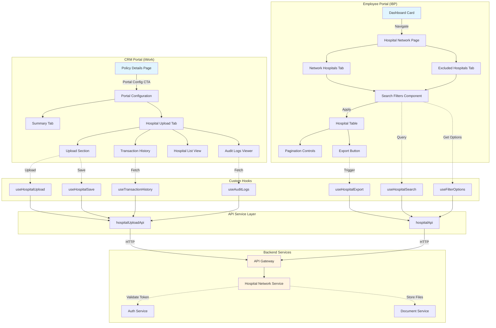

# TRD - Phase 1: Hospital Network Module

> **Full-Stack Implementation** - Complete frontend (React) and backend (NestJS) technical specification

## Quick Links

- [Component Overview](#1-component-overview)
- [Functional Requirements](#2-functional-requirements)
- [API Interface](#3-component-interface)
- [Data Model](#4-data-model)
- [Technology Stack](#5-technology-stack)
- [Frontend Architecture](#5a-frontend-architecture)
- [Integration Design](#6-integration-design)
- [Risk Mitigation](#10-risk-mitigation)
- [Implementation Summary](#15-implementation-summary)

---

## 1. Component Overview

### Purpose

The Hospital Network component enables employees to view and search network/excluded hospitals associated with their insurance policy, and allows administrators to upload, validate, and manage hospital data per policy through a CRM portal configuration interface.

### Scope

This is a **full-stack feature** encompassing both frontend and backend implementations:

**Frontend (React):**
- **Employee Enrolment Portal (IBP):** Hospital viewing, searching, filtering, and exporting
- **CRM Portal (iWork):** Hospital data upload, validation, transaction history, and audit logging

**Backend (NestJS):**
- RESTful APIs for hospital search, export, upload, and management
- Excel file processing and validation
- Database operations with PostgreSQL
- Audit logging using existing common functionality

- **Phase 1 Scope:** Complete implementation including:
    - Employee portal with hospital listing (Network & Excluded tabs)
    - Geographic filters (State, City, Pin Code with nearby search)
    - Keyword search functionality
    - Pagination and Excel export
    - Google Maps integration
    - CRM Excel upload with template download
    - Complete validation suite (7 validation rules)
    - Transaction history tracking
    - Audit logging using existing common functionality

- **Dependencies:**
    - **Policy Service:** Retrieves policy information for employees and validates policy IDs during upload
    - **Auth Service:** Authenticates employees and admin users, provides user context
    - **API Gateway:** Routes requests to the hospital network service
    - **Document Service:** Stores uploaded Excel files and generates export files
    - **Common Service:** Provides master data for States/UTs and Cities

- **Dependents:**
    - **Employee Dashboard:** Displays "Hospital Network" card and navigates to hospital listing
    - **CRM Policy Details Screen:** Provides "Portal Configuration" CTA to access hospital upload

---

## 2. Functional Requirements

### Employee Enrolment Portal Requirements

- **FR-HN-001:** System shall provide a "Hospital Network" entry point on the IBP portal dashboard that navigates to the Network Hospital screen
- **FR-HN-002:** System shall provide two tabs: "Network Hospitals" (default) and "Excluded Hospitals"
- **FR-HN-003:** System shall support filtering hospitals by State/UT, City/Location, State and City combination, and Pin Code
- **FR-HN-004:** System shall enable Search button only after at least one filter field is populated
- **FR-HN-005:** System shall display hospitals within and nearby the specified pin code area
- **FR-HN-006:** System shall provide keyword search capability by hospital name or address with partial matching
- **FR-HN-007:** System shall display search results as individual cards with Hospital Name, Address, and Phone Number (card design details will be provided during implementation)
- **FR-HN-008:** System shall implement pagination with 10 results per page and navigation controls
- **FR-HN-009:** System shall provide a map icon next to each address that opens Google Maps in a new tab
- **FR-HN-010:** System shall export all search results (not just visible rows) to Excel with all columns
- **FR-HN-011:** System shall display appropriate error messages for no results, invalid pin code, or data unavailability

### CRM Portal Configuration Requirements

- **FR-HN-012:** System shall provide "Portal Configuration" CTA in Policy Details screen
- **FR-HN-013:** System shall display Summary, Network Hospital Upload, and FAQ Upload tabs
- **FR-HN-014:** System shall provide Excel template download functionality with required column structure
- **FR-HN-015:** System shall validate all 7 validation rules: mandatory fields, pin code format, duplicates, invalid classification, file format, blank file, and invalid location data
- **FR-HN-016:** System shall prevent duplicate entries based on Policy ID + Hospital Name + Address + Pin Code (case-insensitive, trimmed)
- **FR-HN-017:** System shall enable Save button only after upload and validation completion
- **FR-HN-018:** System shall update Employee Enrolment Portal data upon successful save
- **FR-HN-019:** System shall maintain transaction history with file name, record counts, uploader, timestamp, and download capability
- **FR-HN-020:** System shall log all actions (upload, edit, save, delete) using the existing common audit logging functionality
- **FR-HN-021:** System shall provide audit log export to Excel and retain logs for minimum 1 year
- **FR-HN-022:** System shall display uploaded hospital list with search and filter capabilities matching employee portal

---

## 3. Component Interface

### 3.1 Public API

```typescript
// Employee Enrolment Portal APIs
interface EmployeeHospitalAPI {
    /**
     * Retrieve network or excluded hospitals for a policy
     * @param policyId - Employee's policy ID (from auth context)
     * @param hospitalType - 'network' | 'excluded'
     * @param filters - Search filters
     * @param pagination - Page number and size
     */
    searchHospitals(
        policyId: string,
        hospitalType: 'network' | 'excluded',
        filters: HospitalSearchFilters,
        pagination: PaginationParams
    ): Promise<HospitalSearchResponse>;

    /**
     * Export search results to Excel
     * @param policyId - Employee's policy ID
     * @param hospitalType - 'network' | 'excluded'
     * @param filters - Applied search filters
     */
    exportHospitals(
        policyId: string,
        hospitalType: 'network' | 'excluded',
        filters: HospitalSearchFilters
    ): Promise<ExportFileResponse>;

    /**
     * Get distinct states/cities for filter dropdowns
     * @param policyId - Employee's policy ID
     */
    getFilterOptions(policyId: string): Promise<FilterOptionsResponse>;
}

// CRM Portal Configuration APIs
interface CRMHospitalAPI {
    /**
     * Download Excel template for hospital upload
     */
    downloadTemplate(): Promise<TemplateFileResponse>;

    /**
     * Upload hospital data via Excel
     * @param policyId - Policy ID for hospital association
     * @param file - Excel file with hospital data
     */
    uploadHospitals(
        policyId: string,
        file: File
    ): Promise<UploadValidationResponse>;

    /**
     * Save validated hospital data
     * @param policyId - Policy ID
     * @param uploadId - ID from upload validation
     */
    saveHospitals(
        policyId: string,
        uploadId: string
    ): Promise<SaveResponse>;

    /**
     * Retrieve transaction history for a policy
     * @param policyId - Policy ID
     */
    getTransactionHistory(policyId: string): Promise<TransactionHistoryResponse>;

    /**
     * Download original uploaded file
     * @param transactionId - Transaction history record ID
     */
    downloadUploadedFile(transactionId: string): Promise<FileDownloadResponse>;

    /**
     * Retrieve hospital list for CRM view
     * @param policyId - Policy ID
     * @param filters - Search filters
     * @param pagination - Page and size
     */
    getHospitalList(
        policyId: string,
        filters: HospitalSearchFilters,
        pagination: PaginationParams
    ): Promise<HospitalSearchResponse>;

    /**
     * Retrieve audit logs
     * @param policyId - Optional policy filter
     * @param dateRange - Optional date range filter
     */
    getAuditLogs(
        policyId?: string,
        dateRange?: DateRange
    ): Promise<AuditLogResponse>;

    /**
     * Export audit logs to Excel
     * @param filters - Audit log filters
     */
    exportAuditLogs(filters: AuditLogFilters): Promise<ExportFileResponse>;
}
```

### 3.2 Input/Output Contracts

**HospitalSearchFilters:**
```typescript
interface HospitalSearchFilters {
    state?: string;              // State/UT filter
    city?: string;               // City/Location filter
    pinCode?: string;            // Pin code (6 digits)
    keyword?: string;            // Keyword search (hospital name or address)
    stateAndCity?: {             // Combined filter
        state: string;
        city: string;
    };
}
```

**PaginationParams:**
```typescript
interface PaginationParams {
    page: number;                // 1-based page number
    pageSize: number;            // Records per page (default: 10)
}
```

**HospitalSearchResponse:**
```typescript
interface HospitalSearchResponse {
    hospitals: Hospital[];
    totalRecords: number;
    currentPage: number;
    totalPages: number;
    hasNext: boolean;
    hasPrevious: boolean;
}

interface Hospital {
    id: string;
    hospitalName: string;
    address: string;
    phoneNumber: string;
    state: string;
    city: string;
    pinCode: string;
    hospitalType: 'network' | 'excluded';
}
```

**UploadValidationResponse:**
```typescript
interface UploadValidationResponse {
    uploadId: string;
    status: 'success' | 'partial_success' | 'failure';
    validRecords: number;
    invalidRecords: number;
    networkHospitalCount: number;
    excludedHospitalCount: number;
    errors: ValidationError[];
    warnings: ValidationWarning[];
}

interface ValidationError {
    row: number;
    field: string;
    errorCode: string;
    message: string;
    value?: string;
}

interface ValidationWarning {
    row: number;
    message: string;
}
```

**TransactionHistoryResponse:**
```typescript
interface TransactionHistoryResponse {
    transactions: TransactionRecord[];
}

interface TransactionRecord {
    id: string;
    fileName: string;
    networkHospitalCount: number;
    excludedHospitalCount: number;
    uploadedBy: string;
    uploadDate: Date;
    fileUrl: string;
}
```

**AuditLogResponse:**
```typescript
interface AuditLogResponse {
    logs: AuditLog[];
    totalRecords: number;
}

interface AuditLog {
    id: string;
    user: string;
    timestamp: Date;
    actionType: 'UPLOAD' | 'EDIT' | 'SAVE' | 'DELETE';
    affectedRecords: number;
    changeSummary: string;
    previousValue?: string;
    newValue?: string;
    policyId: string;
}
```

### 3.3 Error Handling

**Error Types:**

1. **Validation Errors (HTTP 400):**
    - `MISSING_POLICY_ID`: "Policy ID is missing. Please provide a valid Policy ID."
    - `MISSING_HOSPITAL_NAME`: "Hospital Name cannot be blank."
    - `MISSING_ADDRESS`: "Address field is mandatory."
    - `MISSING_PIN_CODE`: "Pin Code is required."
    - `MISSING_CLASSIFICATION`: "Please specify whether the hospital belongs to Network or Excluded list."
    - `INVALID_PIN_CODE`: "Invalid Pin Code format. Please enter a valid 6-digit Pin Code."
    - `DUPLICATE_RECORD`: "Duplicate record found - [Hospital Name], [Address]."
    - `INVALID_CLASSIFICATION`: "A hospital cannot be listed under both Network and Excluded columns."
    - `INVALID_FILE_FORMAT`: "Invalid file format. Please upload a valid Excel file (.xls or .xlsx)."
    - `EMPTY_FILE`: "File is empty. Please upload a valid file with hospital data."
    - `INVALID_STATE`: "Invalid State/UT name. Please enter a valid value."
    - `INVALID_CITY`: "Invalid City/Location. Please verify and correct."

2. **Business Logic Errors (HTTP 422):**
    - `DUPLICATE_IN_SYSTEM`: "Duplicate record already exists for this Policy ID in the system."
    - `NO_RESULTS_FOUND`: "No hospitals found for the selected criteria."
    - `DATA_UNAVAILABLE`: "Hospital network data not available. Please contact administrator."

3. **System Errors (HTTP 500):**
    - `SYNC_FAILED`: "Failed to sync data to Enrolment Portal. Please try again."
    - `EXPORT_FAILED`: "Failed to generate Excel export. Please try again."

**Error Response Format:**
```typescript
interface ErrorResponse {
    statusCode: number;
    errorCode: string;
    message: string;
    details?: any;
    timestamp: Date;
}
```

**Recovery Strategies:**
- **Validation Errors:** Return detailed error list with row numbers, allow user to fix and re-upload
- **Duplicate Errors:** Provide option to skip duplicates or update existing records
- **Sync Failures:** Queue sync operation for retry, notify admin if failures persist
- **Export Failures:** Log error, provide user-friendly message, allow retry

---

## 4. Data Model

### 4.1 Data Storage

**Storage Type:** PostgreSQL Database

**Data Schema:**

```sql
-- Hospital Master Table
CREATE TABLE hospitals (
    id UUID PRIMARY KEY DEFAULT gen_random_uuid(),
    policy_id VARCHAR(50) NOT NULL,
    hospital_name VARCHAR(255) NOT NULL,
    address TEXT NOT NULL,
    phone_number VARCHAR(50),
    state VARCHAR(100) NOT NULL,
    city VARCHAR(100) NOT NULL,
    pin_code VARCHAR(6) NOT NULL,
    hospital_type VARCHAR(20) NOT NULL CHECK (hospital_type IN ('network', 'excluded')),
    latitude DECIMAL(10, 8),
    longitude DECIMAL(11, 8),
    is_active BOOLEAN DEFAULT true,
    created_at TIMESTAMP DEFAULT NOW(),
    created_by VARCHAR(100),
    updated_at TIMESTAMP DEFAULT NOW(),
    updated_by VARCHAR(100),
    CONSTRAINT unique_hospital_per_policy UNIQUE (policy_id, hospital_name, address, pin_code)
);

-- Indexes for performance
CREATE INDEX idx_hospitals_policy_id ON hospitals(policy_id);
CREATE INDEX idx_hospitals_state_city ON hospitals(state, city);
CREATE INDEX idx_hospitals_pin_code ON hospitals(pin_code);
CREATE INDEX idx_hospitals_type ON hospitals(hospital_type);
CREATE INDEX idx_hospitals_search ON hospitals USING gin(
    to_tsvector('english', hospital_name || ' ' || address)
);

-- Upload Transaction History Table
CREATE TABLE hospital_upload_transactions (
    id UUID PRIMARY KEY DEFAULT gen_random_uuid(),
    policy_id VARCHAR(50) NOT NULL,
    file_name VARCHAR(255) NOT NULL,
    file_path TEXT NOT NULL,
    network_hospital_count INTEGER DEFAULT 0,
    excluded_hospital_count INTEGER DEFAULT 0,
    total_records INTEGER DEFAULT 0,
    valid_records INTEGER DEFAULT 0,
    invalid_records INTEGER DEFAULT 0,
    upload_status VARCHAR(20) NOT NULL CHECK (upload_status IN ('pending', 'validated', 'saved', 'failed')),
    uploaded_by VARCHAR(100) NOT NULL,
    uploaded_at TIMESTAMP DEFAULT NOW(),
    saved_at TIMESTAMP,
    error_details JSONB,
    FOREIGN KEY (policy_id) REFERENCES policies(id) ON DELETE CASCADE
);

CREATE INDEX idx_upload_transactions_policy ON hospital_upload_transactions(policy_id);
CREATE INDEX idx_upload_transactions_status ON hospital_upload_transactions(upload_status);

-- Audit Log Table
CREATE TABLE hospital_audit_logs (
    id UUID PRIMARY KEY DEFAULT gen_random_uuid(),
    policy_id VARCHAR(50),
    user_id VARCHAR(100) NOT NULL,
    user_name VARCHAR(255) NOT NULL,
    action_type VARCHAR(20) NOT NULL CHECK (action_type IN ('UPLOAD', 'EDIT', 'SAVE', 'DELETE')),
    affected_records INTEGER DEFAULT 0,
    change_summary TEXT,
    previous_value JSONB,
    new_value JSONB,
    transaction_id UUID,
    ip_address VARCHAR(45),
    user_agent TEXT,
    timestamp TIMESTAMP DEFAULT NOW(),
    FOREIGN KEY (transaction_id) REFERENCES hospital_upload_transactions(id) ON DELETE SET NULL
);

CREATE INDEX idx_audit_logs_policy ON hospital_audit_logs(policy_id);
CREATE INDEX idx_audit_logs_timestamp ON hospital_audit_logs(timestamp DESC);
CREATE INDEX idx_audit_logs_user ON hospital_audit_logs(user_id);
CREATE INDEX idx_audit_logs_action ON hospital_audit_logs(action_type);

-- Temporary Upload Staging Table
CREATE TABLE hospital_upload_staging (
    id UUID PRIMARY KEY DEFAULT gen_random_uuid(),
    upload_id UUID NOT NULL,
    row_number INTEGER NOT NULL,
    policy_id VARCHAR(50),
    hospital_name VARCHAR(255),
    state VARCHAR(100),
    city VARCHAR(100),
    address TEXT,
    pin_code VARCHAR(6),
    phone_number VARCHAR(50),
    network_hospital BOOLEAN,
    excluded_hospital BOOLEAN,
    is_valid BOOLEAN DEFAULT false,
    validation_errors JSONB,
    created_at TIMESTAMP DEFAULT NOW(),
    FOREIGN KEY (upload_id) REFERENCES hospital_upload_transactions(id) ON DELETE CASCADE
);

CREATE INDEX idx_staging_upload_id ON hospital_upload_staging(upload_id);
```

### 4.2 Data Flow

```mermaid
flowchart TD
    Start[User Action] --> Action{Action Type?}
    
    %% Employee Portal Flow
    Action -->|Employee Search| EP1[Validate Auth Token]
    EP1 --> EP2[Get Policy ID from Context]
    EP2 --> EP3{Validate Filters}
    EP3 -->|Invalid| EP4[Return Validation Error]
    EP3 -->|Valid| EP5[Build Query with Filters]
    EP5 --> EP6[Apply Pin Code Nearby Logic]
    EP6 --> EP7[Execute Search Query]
    EP7 --> EP8{Results Found?}
    EP8 -->|No| EP9[Return Empty Result Message]
    EP8 -->|Yes| EP10[Apply Pagination]
    EP10 --> EP11[Return Hospital List]
    
    Action -->|Export Request| EX1[Get All Search Results]
    EX1 --> EX2[Generate Excel File]
    EX2 --> EX3{Export Success?}
    EX3 -->|No| EX4[Return Export Error]
    EX3 -->|Yes| EX5[Return Download Link]
    
    %% CRM Upload Flow
    Action -->|Upload Excel| UP1[Validate File Format]
    UP1 -->|Invalid| UP2[Return Format Error]
    UP1 -->|Valid| UP3[Parse Excel Rows]
    UP3 --> UP4[Store in Staging Table]
    UP4 --> UP5[Run Validation Rules Loop]
    
    UP5 --> V1{Mandatory Fields?}
    V1 -->|Missing| VE1[Add Validation Error]
    V1 -->|OK| V2{Pin Code Format?}
    V2 -->|Invalid| VE2[Add Validation Error]
    V2 -->|OK| V3{Duplicate Check?}
    V3 -->|Duplicate| VE3[Add Validation Error]
    V3 -->|OK| V4{Invalid Classification?}
    V4 -->|Both Network & Excluded| VE4[Add Validation Error]
    V4 -->|OK| V5{Valid State/City?}
    V5 -->|Invalid| VE5[Add Validation Error]
    V5 -->|OK| V6[Mark Row as Valid]
    
    V6 --> UP6{More Rows?}
    VE1 --> UP6
    VE2 --> UP6
    VE3 --> UP6
    VE4 --> UP6
    VE5 --> UP6
    
    UP6 -->|Yes| UP5
    UP6 -->|No| UP7[Create Transaction Record]
    UP7 --> UP8[Store Original File]
    UP8 --> UP9[Return Validation Response]
    
    %% Save Flow
    Action -->|Save Upload| SV1[Validate Upload ID]
    SV1 -->|Invalid| SV2[Return Not Found Error]
    SV1 -->|Valid| SV3{Has Valid Records?}
    SV3 -->|No| SV4[Return No Valid Records Error]
    SV3 -->|Yes| SV5[Begin Transaction]
    SV5 --> SV6[Delete Existing Hospitals for Policy]
    SV6 --> SV7[Insert Valid Records from Staging]
    SV7 --> SV8[Update Transaction Status]
    SV8 --> SV9[Create Audit Log Entry]
    SV9 --> SV10[Commit Transaction]
    SV10 --> SV11{Trigger Sync}
    SV11 -->|Failed| SV12[Log Sync Error]
    SV11 -->|Success| SV13[Return Success Response]
    SV12 --> SV13
    
    %% Transaction History Flow
    Action -->|View History| TH1[Get Policy ID]
    TH1 --> TH2[Query Transaction Table]
    TH2 --> TH3[Return Transaction List]
    
    %% Audit Log Flow
    Action -->|View Audit Logs| AL1[Apply Filters]
    AL1 --> AL2[Query Audit Log Table]
    AL2 --> AL3{Export Request?}
    AL3 -->|Yes| AL4[Generate Excel]
    AL3 -->|No| AL5[Return Audit Log List]
    AL4 --> AL5
    
    %% Error Handling Nodes
    EP4 --> End[Return Response]
    EP9 --> End
    EP11 --> End
    EX4 --> End
    EX5 --> End
    UP2 --> End
    UP9 --> End
    SV2 --> End
    SV4 --> End
    SV13 --> End
    TH3 --> End
    AL5 --> End
```



### 4.3 Data Validation

**Input Validation Rules:**

1. **Mandatory Fields:**
    - Policy ID: Required, non-empty, alphanumeric
    - Hospital Name: Required, max 255 characters
    - Address: Required, max 2000 characters
    - Pin Code: Required, exactly 6 digits
    - At least one of: Network Hospital or Excluded Hospital must be true

2. **Format Validation:**
    - Pin Code: Must match regex `^\d{6}$`
    - Phone Number: Optional, alphanumeric with spaces/hyphens, max 50 chars
    - State/City: Alphabetic with spaces, max 100 chars

3. **Business Rules:**
    - Hospital cannot be both Network and Excluded in same record
    - Duplicate check: Case-insensitive, trimmed comparison of Policy ID + Hospital Name + Address + Pin Code
    - State and City must exist in master data (if master data validation enabled)

4. **File Validation:**
    - File format: .xls or .xlsx only
    - File size: Max 10MB
    - Must contain at least one data row (excluding header)
    - Column headers must match template exactly

**Data Integrity:**
- Unique constraint on (policy_id, hospital_name, address, pin_code)
- Foreign key constraint on policy_id referencing policies table
- Soft delete capability via is_active flag
- Audit trail for all modifications

---

## 5. Technology Stack

### 5.1 Backend Technologies

- **Programming Language:** TypeScript 5.x
- **Backend Framework:** NestJS 10.x
- **Database:** PostgreSQL 15.x
- **ORM:** TypeORM 0.3.x
- **Backend Libraries:**
    - `exceljs` - Excel file generation and parsing
    - `class-validator` - DTO validation
    - `class-transformer` - Object transformation
    - `@nestjs/swagger` - API documentation
    - `winston` - Logging
    - `bull` - Job queue for sync operations
    - `cache-manager` - Caching filter options

### 5.2 Frontend Technologies

- **Programming Language:** TypeScript 5.x
- **Frontend Framework:** React 18.x
- **State Management:** React Context API / Redux Toolkit
- **UI Component Library:** Material-UI (MUI) v5 or existing design system
- **Frontend Libraries:**
    - `axios` - HTTP client for API calls
    - `react-query` / `@tanstack/react-query` - Server state management
    - `react-hook-form` - Form handling and validation
    - `yup` - Client-side validation schema
    - `xlsx` / `exceljs` - Excel file handling
    - `react-table` / `@tanstack/react-table` - Table with pagination
    - `date-fns` - Date formatting and manipulation
    - `react-router-dom` - Navigation and routing

### 5.3 Technology Rationale

**Technology Stack Comparison:**

| Layer | Frontend (React) | Backend (NestJS) | Shared |
|-------|------------------|------------------|--------|
| **Language** | TypeScript 5.x | TypeScript 5.x | ✓ |
| **Framework** | React 18.x | NestJS 10.x | - |
| **State Management** | React Query, React Hook Form | - | - |
| **Database** | - | PostgreSQL 15.x | - |
| **ORM** | - | TypeORM 0.3.x | - |
| **Validation** | Yup | class-validator | TypeScript interfaces |
| **HTTP Client** | Axios | @nestjs/axios | - |
| **Excel Processing** | ExcelJS (client) | ExcelJS (server) | ✓ |
| **Testing** | Jest + RTL + Playwright | Jest + Supertest | Jest |
| **UI Components** | Material-UI (MUI) v5 | - | - |
| **Job Queue** | - | Bull | - |
| **Caching** | React Query cache | Redis + cache-manager | - |
| **Logging** | Console / Sentry | Winston | - |

**Backend Choices:**

1. **NestJS:**
    - Consistent with existing monorepo architecture
    - Built-in dependency injection and modular structure
    - Strong TypeScript support
    - Excellent integration with TypeORM and validation libraries

2. **TypeORM:**
    - Already used in the project
    - Strong PostgreSQL support with advanced querying
    - Migration support for schema changes
    - Entity relationships and cascade operations

3. **ExcelJS:**
    - Robust Excel parsing and generation
    - Supports both .xls and .xlsx formats
    - Stream support for large files
    - Active maintenance and good documentation

4. **Bull Queue:**
    - Reliable job queue for async sync operations
    - Redis-backed for persistence
    - Retry mechanisms and error handling
    - Progress tracking for long-running operations

**Frontend Choices:**

1. **React 18:**
    - Consistent with existing UI applications in monorepo
    - Strong TypeScript support and type safety
    - Large ecosystem and community support
    - Performance optimizations with concurrent features

2. **React Query:**
    - Excellent server state management
    - Built-in caching, refetching, and error handling
    - Reduces boilerplate code for API calls
    - Automatic background updates and cache invalidation

3. **React Hook Form:**
    - Minimal re-renders for better performance
    - Built-in validation support
    - Easy integration with Yup schema validation
    - Less boilerplate than other form libraries

4. **Material-UI:**
    - Comprehensive component library
    - Consistent with existing design system (if applicable)
    - Built-in accessibility support
    - Customizable theming

**Trade-offs:**

- **React Query vs Redux:** React Query chosen for simpler server state management; Redux may be overkill for this feature
- **MUI vs Custom Components:** MUI provides faster development but larger bundle size
- **ExcelJS (client):** Client-side processing may impact performance for large files; consider server-side export for large datasets

---

## 5A. Frontend Architecture

### 5A.1 Component Structure

**Employee Enrolment Portal Components:**

```
apps/ui/ibp/src/
├── pages/
│   └── HospitalNetwork/
│       ├── index.tsx                      # Main hospital network page
│       ├── NetworkHospitals.tsx           # Network hospitals tab
│       ├── ExcludedHospitals.tsx          # Excluded hospitals tab
│       └── styles.ts                       # Styled components
├── components/
│   └── HospitalNetwork/
│       ├── HospitalSearchFilters/
│       │   ├── index.tsx                  # Filter component
│       │   ├── StateFilter.tsx            # State dropdown
│       │   ├── CityFilter.tsx             # City dropdown
│       │   ├── PinCodeFilter.tsx          # Pin code input
│       │   ├── KeywordSearch.tsx          # Keyword search input
│       │   └── styles.ts
│       ├── HospitalGrid/
│       │   ├── index.tsx                  # Card grid component
│       │   ├── HospitalCard.tsx           # Individual hospital card
│       │   ├── MapIcon.tsx                # Google Maps link icon
│       │   ├── Pagination.tsx             # Pagination controls
│       │   └── styles.ts
│       ├── ExportButton/
│       │   ├── index.tsx                  # Export to Excel button
│       │   └── styles.ts
│       └── EmptyState/
│           ├── index.tsx                  # No results message
│           └── styles.ts
├── hooks/
│   └── hospital-network/
│       ├── useHospitalSearch.ts           # Search hospitals hook
│       ├── useHospitalExport.ts           # Export functionality hook
│       ├── useFilterOptions.ts            # Get filter dropdown options
│       └── usePagination.ts               # Pagination logic hook
├── services/
│   └── hospital-network/
│       ├── hospitalApi.ts                 # API service layer
│       └── types.ts                       # TypeScript interfaces
└── utils/
    └── hospital-network/
        ├── googleMapsHelper.ts            # Generate Google Maps URLs
        ├── excelExportHelper.ts           # Excel export utilities
        └── validationSchemas.ts           # Yup validation schemas
```

**CRM Portal Components:**

```
apps/ui/iwork/src/
├── pages/
│   └── PortalConfiguration/
│       ├── index.tsx                      # Portal config landing page
│       ├── Summary.tsx                    # Summary tab (placeholder)
│       ├── HospitalUpload/
│       │   ├── index.tsx                  # Hospital upload tab
│       │   ├── UploadSection.tsx          # Upload functionality
│       │   ├── TransactionHistory.tsx     # Upload history table
│       │   ├── HospitalList.tsx           # Uploaded hospitals list
│       │   └── styles.ts
│       └── styles.ts
├── components/
│   └── PortalConfiguration/
│       ├── UploadSection/
│       │   ├── index.tsx                  # Main upload component
│       │   ├── TemplateDownload.tsx       # Download template button
│       │   ├── FileUpload.tsx             # File upload input
│       │   ├── ValidationResults.tsx      # Validation error display
│       │   ├── SaveButton.tsx             # Save CTA button
│       │   └── styles.ts
│       ├── TransactionHistory/
│       │   ├── index.tsx                  # Transaction table
│       │   ├── TransactionRow.tsx         # Individual transaction row
│       │   ├── DownloadIcon.tsx           # Download file icon
│       │   └── styles.ts
│       ├── HospitalListView/
│       │   ├── index.tsx                  # Hospital list component
│       │   ├── HospitalSearchFilters.tsx  # Reuse from employee portal
│       │   ├── HospitalGrid.tsx           # Reuse from employee portal
│       │   └── styles.ts
│       └── AuditLogs/
│           ├── index.tsx                  # Audit log viewer
│           ├── AuditLogTable.tsx          # Audit log table
│           ├── AuditLogFilters.tsx        # Date range and policy filters
│           ├── ExportButton.tsx           # Export audit logs
│           └── styles.ts
├── hooks/
│   └── portal-configuration/
│       ├── useHospitalUpload.ts           # Upload and validation hook
│       ├── useTemplateDownload.ts         # Template download hook
│       ├── useTransactionHistory.ts       # Get transaction history
│       ├── useHospitalSave.ts             # Save validated data
│       └── useAuditLogs.ts                # Fetch and export audit logs
├── services/
│   └── portal-configuration/
│       ├── hospitalUploadApi.ts           # CRM API service layer
│       └── types.ts                       # TypeScript interfaces
└── utils/
    └── portal-configuration/
        ├── excelParser.ts                 # Parse uploaded Excel
        ├── validationHelpers.ts           # Client-side validation
        └── uploadHelpers.ts               # Upload progress tracking
```

### 5A.2 State Management

**Employee Portal State:**

```typescript
// Using React Query for server state
import { useQuery, useMutation } from '@tanstack/react-query';

// Hospital search state
const useHospitalSearch = (policyId: string, filters: HospitalSearchFilters, pagination: PaginationParams) => {
    return useQuery({
        queryKey: ['hospitals', policyId, filters, pagination],
        queryFn: () => hospitalApi.searchHospitals(policyId, filters, pagination),
        staleTime: 5 * 60 * 1000, // 5 minutes
        cacheTime: 10 * 60 * 1000, // 10 minutes
    });
};

// Filter options state (cached)
const useFilterOptions = (policyId: string) => {
    return useQuery({
        queryKey: ['filterOptions', policyId],
        queryFn: () => hospitalApi.getFilterOptions(policyId),
        staleTime: 60 * 60 * 1000, // 1 hour
    });
};

// Export mutation
const useHospitalExport = () => {
    return useMutation({
        mutationFn: (params: ExportParams) => hospitalApi.exportHospitals(params),
        onSuccess: (data) => {
            // Trigger file download
            downloadFile(data.fileUrl, data.fileName);
        },
    });
};
```

**CRM Portal State:**

```typescript
// Upload mutation with progress tracking
const useHospitalUpload = () => {
    const [uploadProgress, setUploadProgress] = useState(0);
    
    return useMutation({
        mutationFn: (params: UploadParams) => 
            hospitalUploadApi.uploadHospitals(params, setUploadProgress),
        onSuccess: (data) => {
            // Invalidate related queries
            queryClient.invalidateQueries(['transactionHistory']);
            queryClient.invalidateQueries(['hospitalList']);
        },
    });
};

// Save mutation
const useHospitalSave = () => {
    return useMutation({
        mutationFn: (params: SaveParams) => hospitalUploadApi.saveHospitals(params),
        onSuccess: () => {
            // Invalidate employee portal cache
            queryClient.invalidateQueries(['hospitals']);
            queryClient.invalidateQueries(['filterOptions']);
        },
    });
};

// Transaction history state
const useTransactionHistory = (policyId: string) => {
    return useQuery({
        queryKey: ['transactionHistory', policyId],
        queryFn: () => hospitalUploadApi.getTransactionHistory(policyId),
        refetchInterval: 30000, // Refresh every 30 seconds
    });
};
```

**Local UI State:**

```typescript
// Using React Hook Form for form state
import { useForm } from 'react-hook-form';
import { yupResolver } from '@hookform/resolvers/yup';

const HospitalSearchFilters: React.FC = () => {
    const { control, handleSubmit, watch, formState: { errors, isValid } } = useForm({
        resolver: yupResolver(searchValidationSchema),
        mode: 'onChange',
    });
    
    // Watch for any field changes to enable/disable search button
    const filterValues = watch();
    const hasFilters = Object.values(filterValues).some(val => !!val);
    
    return (
        <form onSubmit={handleSubmit(onSearch)}>
            {/* Form fields */}
            <Button type="submit" disabled={!hasFilters}>
                Search
            </Button>
        </form>
    );
};
```

### 5A.3 Routing & Navigation

**Employee Portal Routes:**

```typescript
// apps/ui/ibp/src/routes.tsx
import { lazy } from 'react';

const HospitalNetwork = lazy(() => import('./pages/HospitalNetwork'));

export const employeeRoutes = [
    {
        path: '/dashboard',
        element: <Dashboard />,
        children: [
            {
                path: 'hospital-network',
                element: <HospitalNetwork />,
            },
        ],
    },
];

// Dashboard navigation card
const DashboardCards: React.FC = () => {
    const navigate = useNavigate();
    
    return (
        <Card onClick={() => navigate('/dashboard/hospital-network')}>
            <CardContent>
                <Typography variant="h6">Hospital Network</Typography>
                <Typography variant="body2">
                    View network and excluded hospitals
                </Typography>
            </CardContent>
        </Card>
    );
};
```

**CRM Portal Routes:**

```typescript
// apps/ui/iwork/src/routes.tsx
const PortalConfiguration = lazy(() => import('./pages/PortalConfiguration'));

export const crmRoutes = [
    {
        path: '/policy/:policyId',
        element: <PolicyDetails />,
    },
    {
        path: '/policy/:policyId/portal-configuration',
        element: <PortalConfiguration />,
        children: [
            {
                index: true,
                element: <Navigate to="summary" replace />,
            },
            {
                path: 'summary',
                element: <Summary />,
            },
            {
                path: 'hospital-upload',
                element: <HospitalUpload />,
            },
            {
                path: 'faq',
                element: <FAQ />,
            },
        ],
    },
];

// Policy details page - Portal Configuration CTA
const PolicyDetails: React.FC = () => {
    const { policyId } = useParams();
    const navigate = useNavigate();
    
    return (
        <Box>
            {/* Policy details content */}
            <Button 
                variant="contained"
                onClick={() => navigate(`/policy/${policyId}/portal-configuration`)}
            >
                Portal Configuration
            </Button>
        </Box>
    );
};
```

### 5A.4 API Service Layer

**Employee Portal API Service:**

```typescript
// apps/ui/ibp/src/services/hospital-network/hospitalApi.ts
import axios from 'axios';
import { HospitalSearchFilters, PaginationParams, HospitalSearchResponse } from './types';

const API_BASE_URL = process.env.REACT_APP_API_BASE_URL;

export const hospitalApi = {
    searchHospitals: async (
        policyId: string,
        hospitalType: 'network' | 'excluded',
        filters: HospitalSearchFilters,
        pagination: PaginationParams
    ): Promise<HospitalSearchResponse> => {
        const response = await axios.get(`${API_BASE_URL}/api/v1/hospitals/search`, {
            params: {
                policyId,
                hospitalType,
                ...filters,
                page: pagination.page,
                pageSize: pagination.pageSize,
            },
        });
        return response.data;
    },

    exportHospitals: async (
        policyId: string,
        hospitalType: 'network' | 'excluded',
        filters: HospitalSearchFilters
    ): Promise<{ fileUrl: string; fileName: string }> => {
        const response = await axios.get(`${API_BASE_URL}/api/v1/hospitals/export`, {
            params: { policyId, hospitalType, ...filters },
            responseType: 'blob',
        });
        
        // Create download URL from blob
        const blob = new Blob([response.data], { 
            type: 'application/vnd.openxmlformats-officedocument.spreadsheetml.sheet' 
        });
        const fileUrl = window.URL.createObjectURL(blob);
        const fileName = hospitalType === 'network' 
            ? `hospital-network-upload-${policyId}-${new Date().toISOString().split('T')[0]}.xlsx`
            : `excluded-hospitals-upload-${policyId}-${new Date().toISOString().split('T')[0]}.xlsx`;
        
        return { fileUrl, fileName };
    },

    getFilterOptions: async (policyId: string): Promise<FilterOptionsResponse> => {
        const response = await axios.get(`${API_BASE_URL}/api/v1/hospitals/filter-options`, {
            params: { policyId },
        });
        return response.data;
    },
};
```

**CRM Portal API Service:**

```typescript
// apps/ui/iwork/src/services/portal-configuration/hospitalUploadApi.ts
import axios from 'axios';

export const hospitalUploadApi = {
    downloadTemplate: async (): Promise<Blob> => {
        const response = await axios.get(`${API_BASE_URL}/api/v1/admin/hospitals/template`, {
            responseType: 'blob',
        });
        return response.data;
    },

    uploadHospitals: async (
        policyId: string,
        file: File,
        onProgress: (progress: number) => void
    ): Promise<UploadValidationResponse> => {
        const formData = new FormData();
        formData.append('file', file);
        formData.append('policyId', policyId);

        const response = await axios.post(
            `${API_BASE_URL}/api/v1/admin/hospitals/upload`,
            formData,
            {
                headers: { 'Content-Type': 'multipart/form-data' },
                onUploadProgress: (progressEvent) => {
                    const percentCompleted = Math.round(
                        (progressEvent.loaded * 100) / (progressEvent.total || 100)
                    );
                    onProgress(percentCompleted);
                },
            }
        );
        return response.data;
    },

    saveHospitals: async (
        policyId: string,
        uploadId: string
    ): Promise<SaveResponse> => {
        const response = await axios.post(`${API_BASE_URL}/api/v1/admin/hospitals/save`, {
            policyId,
            uploadId,
        });
        return response.data;
    },

    getTransactionHistory: async (policyId: string): Promise<TransactionHistoryResponse> => {
        const response = await axios.get(`${API_BASE_URL}/api/v1/admin/hospitals/transactions`, {
            params: { policyId },
        });
        return response.data;
    },

    downloadUploadedFile: async (transactionId: string): Promise<Blob> => {
        const response = await axios.get(
            `${API_BASE_URL}/api/v1/admin/hospitals/transactions/${transactionId}/file`,
            { responseType: 'blob' }
        );
        return response.data;
    },

    getAuditLogs: async (
        policyId?: string,
        dateRange?: { from: Date; to: Date }
    ): Promise<AuditLogResponse> => {
        const response = await axios.get(`${API_BASE_URL}/api/v1/admin/hospitals/audit-logs`, {
            params: { policyId, ...dateRange },
        });
        return response.data;
    },

    exportAuditLogs: async (filters: AuditLogFilters): Promise<Blob> => {
        const response = await axios.get(
            `${API_BASE_URL}/api/v1/admin/hospitals/audit-logs/export`,
            {
                params: filters,
                responseType: 'blob',
            }
        );
        return response.data;
    },
};
```

### 5A.5 Frontend Validation

**Client-side Validation Schemas:**

```typescript
// apps/ui/ibp/src/utils/hospital-network/validationSchemas.ts
import * as yup from 'yup';

export const searchFiltersSchema = yup.object({
    state: yup.string().max(100).matches(/^[a-zA-Z\s]*$/, 'State must contain only letters'),
    city: yup.string().max(100).matches(/^[a-zA-Z\s]*$/, 'City must contain only letters'),
    pinCode: yup.string().matches(/^\d{6}$/, 'Pin code must be exactly 6 digits'),
    keyword: yup.string().max(255),
}).test(
    'at-least-one',
    'Please provide at least one search filter',
    (value) => Object.values(value).some(val => !!val)
);

// CRM Upload validation
export const uploadValidationSchema = yup.object({
    file: yup
        .mixed()
        .required('Please select a file to upload')
        .test('fileFormat', 'Only Excel files (.xls, .xlsx) are allowed', (value) => {
            if (!value) return false;
            const file = value as File;
            return ['application/vnd.ms-excel', 
                    'application/vnd.openxmlformats-officedocument.spreadsheetml.sheet']
                .includes(file.type);
        })
        .test('fileSize', 'File size must be less than 10MB', (value) => {
            if (!value) return false;
            const file = value as File;
            return file.size <= 10 * 1024 * 1024; // 10MB
        }),
});
```

### 5A.6 Component Interaction Diagram



### 5A.7 Error Handling & User Feedback

**Error Boundary Component:**

```typescript
// apps/ui/ibp/src/components/ErrorBoundary/index.tsx
class HospitalNetworkErrorBoundary extends React.Component<Props, State> {
    state = { hasError: false, error: null };

    static getDerivedStateFromError(error: Error) {
        return { hasError: true, error };
    }

    componentDidCatch(error: Error, errorInfo: React.ErrorInfo) {
        console.error('Hospital Network Error:', error, errorInfo);
        // Log to error tracking service (e.g., Sentry)
    }

    render() {
        if (this.state.hasError) {
            return (
                <Box textAlign="center" p={4}>
                    <Typography variant="h6" color="error">
                        Something went wrong
                    </Typography>
                    <Typography variant="body2" color="textSecondary">
                        Please refresh the page or contact support if the issue persists.
                    </Typography>
                    <Button onClick={() => window.location.reload()}>
                        Refresh Page
                    </Button>
                </Box>
            );
        }

        return this.props.children;
    }
}
```

**Toast Notifications:**

```typescript
// Using React Toast or Snackbar for user feedback
import { useSnackbar } from 'notistack';

const HospitalUpload: React.FC = () => {
    const { enqueueSnackbar } = useSnackbar();
    const uploadMutation = useHospitalUpload();

    const handleUpload = async (file: File) => {
        try {
            const result = await uploadMutation.mutateAsync({ policyId, file });
            
            if (result.status === 'success') {
                enqueueSnackbar('Hospital data uploaded successfully!', { 
                    variant: 'success' 
                });
            } else if (result.status === 'partial_success') {
                enqueueSnackbar(
                    `Upload completed with ${result.invalidRecords} errors. Please review.`,
                    { variant: 'warning' }
                );
            }
        } catch (error) {
            enqueueSnackbar('Upload failed. Please try again.', { 
                variant: 'error' 
            });
        }
    };
};
```

**Loading States:**

```typescript
const NetworkHospitals: React.FC = () => {
    const { data, isLoading, isError, error } = useHospitalSearch(
        policyId,
        filters,
        pagination
    );

    if (isLoading) {
        return (
            <Box display="flex" justifyContent="center" p={4}>
                <CircularProgress />
                <Typography ml={2}>Loading hospitals...</Typography>
            </Box>
        );
    }

    if (isError) {
        return (
            <Alert severity="error">
                {error?.message || 'Failed to load hospitals. Please try again.'}
            </Alert>
        );
    }

    if (!data?.hospitals.length) {
        return (
            <EmptyState message="No hospitals found for the selected criteria." />
        );
    }

    return <HospitalGrid hospitals={data.hospitals} />;
};
```

---

## 6. Integration Design

### 6.1 Dependency Integration

**Policy Service Integration:**
- **Communication Method:** REST API via API Gateway
- **Data Exchange:**
    - Request: Policy ID validation
    - Response: Policy details including active status
- **Integration Pattern:**
    ```typescript
    // Validate policy exists and is active
    async validatePolicy(policyId: string): Promise<boolean> {
        const response = await this.httpService.get(
            `/api/policy-service/policies/${policyId}/validate`
        );
        return response.data.isActive;
    }
    ```

**Auth Service Integration:**
- **Communication Method:** JWT token validation via middleware
- **Data Exchange:**
    - Request: JWT token in Authorization header
    - Response: User context with policyId, userId, role
- **Integration Pattern:**
    ```typescript
    // Extract policy ID from authenticated user context
    @UseGuards(JwtAuthGuard)
    async searchHospitals(@Request() req) {
        const policyId = req.user.policyId;
        // ... continue with search
    }
    ```

**Document Service Integration:**
- **Communication Method:** REST API for file storage
- **Data Exchange:**
    - Upload original Excel files
    - Generate and store export files
    - Retrieve files by ID
- **Integration Pattern:**
    ```typescript
    // Store uploaded file
    async storeUploadFile(file: File, metadata: FileMetadata): Promise<string> {
        const formData = new FormData();
        formData.append('file', file);
        formData.append('metadata', JSON.stringify(metadata));
        
        const response = await this.httpService.post(
            '/api/document-service/upload',
            formData
        );
        return response.data.fileId;
    }
    ```

**Common Service Integration:**
- **Communication Method:** REST API or shared database (to be determined)
- **Data Exchange:**
    - Get list of valid States/UTs
    - Get list of Cities for a State
    - Validate location data
- **Integration Pattern:**
    ```typescript
    // Validate state and city
    async validateLocation(state: string, city: string): Promise<boolean> {
        const response = await this.httpService.get(
            `/api/common-service/locations/validate`,
            { params: { state, city } }
        );
        return response.data.isValid;
    }
    ```

### 6.2 Service Integration

**Google Maps External API:**
- **Usage:** Generate map links for hospital addresses
- **Authentication:** No API key required for simple search URLs
- **Rate Limiting:** No limits for link generation (client-side navigation)
- **Integration:**
    ```typescript
    // Generate Google Maps URL
    generateMapsUrl(address: string): string {
        const encodedAddress = encodeURIComponent(address);
        return `https://www.google.com/maps/search/?api=1&query=${encodedAddress}`;
    }
    ```
- **Fallback Strategy:** If address is empty, disable map icon in UI

**Pin Code Nearby Search:**
- **Implementation:** Use PostgreSQL's built-in geographic queries or external geocoding service
- **Approach:**
    ```typescript
    // Option 1: Simple pin code range search (first 3 digits)
    async searchByPinCodeNearby(pinCode: string): Promise<Hospital[]> {
        const pinPrefix = pinCode.substring(0, 3);
        return this.hospitalRepository
            .createQueryBuilder('hospital')
            .where('hospital.pin_code LIKE :prefix', { prefix: `${pinPrefix}%` })
            .getMany();
    }
    
    // Option 2: Latitude/Longitude based (requires geocoding)
    // Use PostGIS extension for geographic queries
    ```

**Excel Template Generation:**
- **No External Service:** Template generated programmatically using ExcelJS
- **Template Structure:**
    ```typescript
    async generateTemplate(): Promise<Buffer> {
        const workbook = new ExcelJS.Workbook();
        const worksheet = workbook.addWorksheet('Hospital Data');
        
        worksheet.columns = [
            { header: 'Policy ID', key: 'policyId', width: 20 },
            { header: 'Hospital Name', key: 'hospitalName', width: 30 },
            { header: 'State / UT', key: 'state', width: 20 },
            { header: 'City / Location', key: 'city', width: 20 },
            { header: 'Address', key: 'address', width: 40 },
            { header: 'Pin Code', key: 'pinCode', width: 10 },
            { header: 'Phone Number', key: 'phoneNumber', width: 15 },
            { header: 'Network Hospital', key: 'networkHospital', width: 18 },
            { header: 'Excluded Hospital', key: 'excludedHospital', width: 18 }
        ];
        
        return await workbook.xlsx.writeBuffer();
    }
    ```

---

## 7. Performance Considerations

### 7.1 Performance Requirements

- **Response Time:**
    - Hospital search: < 500ms for up to 10,000 records per policy
    - Excel export: < 3 seconds for up to 1,000 records
    - Upload validation: < 5 seconds for files up to 500 rows
    - Save operation: < 2 seconds for up to 500 hospitals

- **Throughput:**
    - Support 100 concurrent employee searches
    - Support 10 concurrent CRM uploads
    - Handle 1,000 hospital records per policy
    - Process 50 export requests per minute

- **Scalability:**
    - Horizontal scaling for API instances
    - Database connection pooling
    - Queue-based async processing for heavy operations

### 7.2 Performance Strategies

**Caching:**
- **Filter Options Cache:**
    - Cache distinct states/cities per policy for 1 hour
    - Invalidate on save operation
    - Use Redis for distributed caching
    ```typescript
    @Cacheable({ ttl: 3600, key: 'filter-options' })
    async getFilterOptions(policyId: string): Promise<FilterOptions> {
        // Query database for distinct values
    }
    ```

**Database Optimization:**
- **Indexing Strategy:**
    - Composite index on (policy_id, hospital_type) for tab filtering
    - GIN index on full-text search fields (hospital_name, address)
    - B-tree indexes on state, city, pin_code for filter queries
    
- **Query Optimization:**
    ```sql
    -- Optimized search query with indexes
    SELECT h.*
    FROM hospitals h
    WHERE h.policy_id = $1
      AND h.hospital_type = $2
      AND h.is_active = true
      AND (
          h.state = $3 OR $3 IS NULL
      )
      AND (
          h.city = $4 OR $4 IS NULL
      )
      AND (
          h.pin_code LIKE $5 OR $5 IS NULL
      )
      AND (
          to_tsvector('english', h.hospital_name || ' ' || h.address) 
          @@ plainto_tsquery('english', $6)
          OR $6 IS NULL
      )
    ORDER BY h.hospital_name
    LIMIT $7 OFFSET $8;
    ```

- **Connection Pooling:**
    ```typescript
    // TypeORM configuration
    {
        type: 'postgres',
        poolSize: 20,
        maxQueryExecutionTime: 1000, // Log slow queries
        extra: {
            max: 20,
            min: 5,
            idleTimeoutMillis: 30000
        }
    }
    ```

**Resource Management:**
- **Memory:**
    - Stream large Excel files instead of loading into memory
    - Limit upload file size to 10MB
    - Paginate search results (10 per page)
    - Use cursor-based pagination for exports

- **CPU:**
    - Offload validation processing to background jobs for files > 100 rows
    - Use worker threads for Excel parsing if needed
    
- **I/O:**
    - Batch database inserts (100 records per batch)
    - Use COPY command for bulk inserts when possible
    - Compress exported Excel files

**Async Processing:**
```typescript
// Queue configuration for heavy operations
@Processor('hospital-sync')
export class HospitalSyncProcessor {
    @Process('sync-to-portal')
    async handleSync(job: Job<SyncJobData>) {
        // Perform sync operation
        // Update job progress
        await job.progress(50);
        // Complete sync
        return { synced: true };
    }
}
```

---

## 8. Security Design

### 8.1 Security Requirements

- **Authentication:**
    - Employee Portal: JWT token from Auth Service with policy context
    - CRM Portal: JWT token with admin role and policy access permissions
    - Token validation on every request via JwtAuthGuard

- **Authorization:**
    - Employees can only view hospitals for their own policy
    - Admins can manage hospitals only for policies they have access to
    - Role-based access control (RBAC) for CRM operations

- **Data Protection:**
    - No sensitive data (passwords, SSNs) in hospital records
    - Phone numbers are non-sensitive public contact information
    - Audit logs protected from unauthorized access
    - Uploaded files stored securely with access control

### 8.2 Security Implementation

**Encryption:**
- **Data in Transit:**
    - All API communication over HTTPS/TLS 1.3
    - Secure WebSocket connections for real-time updates (if implemented)
    
- **Data at Rest:**
    - Database encryption at storage level (PostgreSQL encryption)
    - Uploaded Excel files encrypted in Document Service
    - No application-level encryption for hospital data (public information)

**Input Sanitization:**
```typescript
// DTO with validation
export class HospitalSearchDto {
    @IsOptional()
    @IsString()
    @MaxLength(100)
    @Matches(/^[a-zA-Z\s]+$/, { message: 'State must contain only letters' })
    state?: string;

    @IsOptional()
    @IsString()
    @MaxLength(100)
    @Matches(/^[a-zA-Z\s]+$/, { message: 'City must contain only letters' })
    city?: string;

    @IsOptional()
    @IsString()
    @Matches(/^\d{6}$/, { message: 'Pin code must be exactly 6 digits' })
    pinCode?: string;

    @IsOptional()
    @IsString()
    @MaxLength(255)
    @Transform(({ value }) => sanitizeHtml(value, { allowedTags: [] }))
    keyword?: string;
}

// SQL Injection Prevention (TypeORM parameterized queries)
const hospitals = await this.hospitalRepository
    .createQueryBuilder('hospital')
    .where('hospital.policy_id = :policyId', { policyId })
    .andWhere('hospital.hospital_name LIKE :keyword', { 
        keyword: `%${keyword}%` 
    })
    .getMany();
```

**Authorization Guards:**
```typescript
// Policy access guard
@Injectable()
export class PolicyAccessGuard implements CanActivate {
    canActivate(context: ExecutionContext): boolean {
        const request = context.switchToHttp().getRequest();
        const user = request.user;
        const policyId = request.params.policyId || request.body.policyId;
        
        // Employee can only access their own policy
        if (user.role === 'employee') {
            return user.policyId === policyId;
        }
        
        // Admin must have permission for this policy
        if (user.role === 'admin') {
            return user.policyAccess.includes(policyId);
        }
        
        return false;
    }
}

// Usage
@UseGuards(JwtAuthGuard, PolicyAccessGuard)
@Get('hospitals/:policyId')
async getHospitals(@Param('policyId') policyId: string) {
    // User is authorized to access this policy
}
```

**Audit Logging:**
```typescript
// Audit interceptor
@Injectable()
export class AuditInterceptor implements NestInterceptor {
    intercept(context: ExecutionContext, next: CallHandler): Observable<any> {
        const request = context.switchToHttp().getRequest();
        const user = request.user;
        
        return next.handle().pipe(
            tap(async (data) => {
                if (this.shouldAudit(request.method, request.url)) {
                    await this.auditService.log({
                        userId: user.id,
                        userName: user.name,
                        actionType: this.getActionType(request.method),
                        policyId: request.params.policyId,
                        ipAddress: request.ip,
                        userAgent: request.headers['user-agent'],
                        changeSummary: this.generateSummary(request, data)
                    });
                }
            })
        );
    }
}
```

**Rate Limiting:**
```typescript
// Throttle configuration
@Controller('hospitals')
@UseGuards(ThrottlerGuard)
export class HospitalsController {
    // Employee endpoints: 100 requests per minute
    @Throttle(100, 60)
    @Get('search')
    async searchHospitals() { }
    
    // Admin upload: 10 requests per minute
    @Throttle(10, 60)
    @Post('upload')
    async uploadHospitals() { }
}
```

---

## 9. Monitoring & Observability

### 9.1 Logging

**Log Levels:**
- **ERROR:** Failed validations, sync failures, database errors, API errors
- **WARN:** Duplicate records skipped, partial upload success, slow queries
- **INFO:** Successful uploads, sync completion, export generation, user actions
- **DEBUG:** Detailed validation steps, query execution, cache hits/misses

**Log Format:**
```typescript
// Structured logging with Winston
{
    timestamp: '2025-11-06T10:30:00.000Z',
    level: 'info',
    service: 'hospital-network',
    correlationId: 'uuid-v4',
    userId: 'user123',
    policyId: 'POL-001',
    message: 'Hospital data uploaded successfully',
    context: {
        fileName: 'hospitals.xlsx',
        validRecords: 150,
        invalidRecords: 5,
        duration: 4500
    }
}
```

**Sensitive Data Policy:**
- **Never Log:**
    - JWT tokens
    - Password hashes
    - Personal identification numbers
    
- **Safe to Log:**
    - Policy IDs
    - User IDs (non-personal identifiers)
    - Hospital names and addresses (public data)
    - Phone numbers (public contact info)
    - Operation counts and statistics

### 9.2 Metrics

**Performance Metrics:**
- `hospital.search.duration` - Search query execution time (histogram)
- `hospital.search.results` - Number of results per search (gauge)
- `hospital.export.duration` - Excel export generation time (histogram)
- `hospital.upload.duration` - Upload validation time (histogram)
- `hospital.save.duration` - Save operation time (histogram)
- `hospital.sync.duration` - Sync to portal duration (histogram)

**Business Metrics:**
- `hospital.search.count` - Total searches performed (counter)
- `hospital.export.count` - Total exports generated (counter)
- `hospital.upload.count` - Total uploads attempted (counter)
- `hospital.upload.success` - Successful uploads (counter)
- `hospital.upload.failure` - Failed uploads (counter)
- `hospital.records.total` - Total hospital records by policy (gauge)
- `hospital.validation.errors` - Validation errors by type (counter)

**Alerting:**
```typescript
// Alert conditions
{
    alerts: [
        {
            name: 'high_upload_failure_rate',
            condition: 'hospital.upload.failure / hospital.upload.count > 0.2',
            duration: '5m',
            severity: 'warning',
            action: 'notify-admin'
        },
        {
            name: 'sync_failures',
            condition: 'hospital.sync.failures > 5',
            duration: '10m',
            severity: 'critical',
            action: 'page-on-call'
        },
        {
            name: 'slow_search_queries',
            condition: 'hospital.search.duration.p95 > 1000ms',
            duration: '5m',
            severity: 'warning',
            action: 'notify-team'
        },
        {
            name: 'database_connection_errors',
            condition: 'hospital.db.errors > 10',
            duration: '1m',
            severity: 'critical',
            action: 'page-on-call'
        }
    ]
}
```

**Dashboard Metrics:**
- Real-time search query count and performance
- Upload success/failure rates
- Validation error breakdown (pie chart)
- Sync operation status
- Database query performance
- Cache hit/miss rates
- API response times by endpoint

---

## 10. Risk Mitigation

**Risk: Large File Upload Performance Degradation**
- **Mitigation:** 
    - Implement file size limit (10MB max)
    - Stream processing for files > 100 rows
    - Queue-based async validation for large uploads
    - Progress indicator for user feedback
    - Timeout protection (30 seconds max)

**Risk: Duplicate Data Corruption**
- **Mitigation:**
    - Database unique constraint on (policy_id, hospital_name, address, pin_code)
    - Case-insensitive, trimmed comparison in application layer
    - Transaction rollback on duplicate detection
    - Comprehensive unit tests for duplicate scenarios
    - Audit logging of all data modifications

**Risk: Data Updates Between CRM and Portal**
- **Mitigation:**
    - Database-level data consistency
    - Transaction-based updates
    - Error handling with user notification
    - Comprehensive logging for troubleshooting

**Risk: Database Performance with Large Datasets**
- **Mitigation:**
    - Implement proper indexes (see section 4.1)
    - Connection pooling for concurrent requests
    - Query optimization with explain analyze
    - Pagination for large result sets
    - Archive old audit logs (> 1 year) to separate table

**Risk: Invalid Excel Template Usage**
- **Mitigation:**
    - Clear template download with instructions
    - Client-side validation before upload
    - Server-side comprehensive validation (7 rules)
    - User-friendly error messages with row numbers
    - Template version tracking

**Risk: Security Breach via Unauthorized Access**
- **Mitigation:**
    - JWT token validation on all endpoints
    - Policy-based authorization (users can only access their policy data)
    - Role-based access control for CRM operations
    - Input sanitization and validation
    - Parameterized queries to prevent SQL injection

**Risk: Pin Code Nearby Search Accuracy**
- **Mitigation:**
    - Use first 3 digits for initial implementation (postal zones)
    - Geographic proximity calculation within PIN code zones
    - Fallback to exact pin code match if nearby returns no results

---

## 11. Future Considerations
        const result = service.validate(record);
        expect(result.errors).toContainEqual({
            field: 'pinCode',
            errorCode: 'INVALID_PIN_CODE'
        });
    });
    
    it('should detect duplicate records (case-insensitive)', () => {
        const existing = { 
            policyId: 'POL1', 
            hospitalName: 'Test Hospital',
            address: '123 Main St',
            pinCode: '123456'
        };
        const duplicate = {
            policyId: 'pol1',
            hospitalName: 'TEST HOSPITAL ',
            address: ' 123 main st',
            pinCode: '123456'
        };
        const result = service.checkDuplicate(duplicate, [existing]);
        expect(result.isDuplicate).toBe(true);
    });
    
    it('should reject hospital marked as both network and excluded', () => {
        const record = {
            networkHospital: true,
            excludedHospital: true
        };
        const result = service.validate(record);
        expect(result.errors).toContainEqual({
            errorCode: 'INVALID_CLASSIFICATION'
        });
    });
});
```

2. **Search Service Tests:**
```typescript
describe('HospitalSearchService', () => {
    it('should return paginated results', async () => {
        const result = await service.search(policyId, filters, { page: 1, pageSize: 10 });
        expect(result.hospitals).toHaveLength(10);
        expect(result.totalPages).toBeGreaterThan(0);
    });
    
    it('should filter by state and city combination', async () => {
        const filters = { state: 'Karnataka', city: 'Bangalore' };
        const result = await service.search(policyId, filters);
        result.hospitals.forEach(h => {
            expect(h.state).toBe('Karnataka');
            expect(h.city).toBe('Bangalore');
        });
    });
    
    it('should search nearby pin codes', async () => {
        const filters = { pinCode: '560001' };
        const result = await service.search(policyId, filters);
        // Should return hospitals with pin codes starting with 560
        result.hospitals.forEach(h => {
            expect(h.pinCode).toMatch(/^560/);
        });
    });
    
    it('should perform keyword search on name and address', async () => {
        const filters = { keyword: 'apollo' };
        const result = await service.search(policyId, filters);
        result.hospitals.forEach(h => {
            const searchable = `${h.hospitalName} ${h.address}`.toLowerCase();
            expect(searchable).toContain('apollo');
        });
    });
});
```

3. **Export Service Tests:**
```typescript
describe('HospitalExportService', () => {
    it('should export all search results to Excel', async () => {
        const hospitals = generateMockHospitals(50);
        const buffer = await service.exportToExcel(hospitals);
        const workbook = new ExcelJS.Workbook();
        await workbook.xlsx.load(buffer);
        const worksheet = workbook.getWorksheet(1);
        expect(worksheet.rowCount).toBe(51); // 50 data + 1 header
    });
    
    it('should include all required columns', async () => {
        const buffer = await service.exportToExcel([mockHospital]);
        const workbook = new ExcelJS.Workbook();
        await workbook.xlsx.load(buffer);
        const worksheet = workbook.getWorksheet(1);
        const headers = worksheet.getRow(1).values;
        expect(headers).toEqual([
            'Hospital Name', 'Address', 'Phone Number', 'State', 'City', 'Pin Code'
        ]);
    });
});
```

**Mock Dependencies:**
- Mock TypeORM repository methods
- Mock HTTP service for external API calls
- Mock file system operations
- Mock Redis cache

### 10.2 Frontend Unit Testing

**Test Coverage:** Minimum 90% code coverage

**Component Testing with React Testing Library:**

```typescript
// HospitalSearchFilters.test.tsx
import { render, screen, fireEvent, waitFor } from '@testing-library/react';
import { HospitalSearchFilters } from './HospitalSearchFilters';

describe('HospitalSearchFilters', () => {
    it('should disable search button when no filters are provided', () => {
        render(<HospitalSearchFilters onSearch={jest.fn()} />);
        const searchButton = screen.getByRole('button', { name: /search/i });
        expect(searchButton).toBeDisabled();
    });

    it('should enable search button when at least one filter is provided', async () => {
        render(<HospitalSearchFilters onSearch={jest.fn()} />);
        const stateInput = screen.getByLabelText(/state/i);
        
        fireEvent.change(stateInput, { target: { value: 'Karnataka' } });
        
        await waitFor(() => {
            const searchButton = screen.getByRole('button', { name: /search/i });
            expect(searchButton).toBeEnabled();
        });
    });

    it('should validate pin code format', async () => {
        render(<HospitalSearchFilters onSearch={jest.fn()} />);
        const pinCodeInput = screen.getByLabelText(/pin code/i);
        
        fireEvent.change(pinCodeInput, { target: { value: '12A45' } });
        fireEvent.blur(pinCodeInput);
        
        await waitFor(() => {
            expect(screen.getByText(/pin code must be exactly 6 digits/i)).toBeInTheDocument();
        });
    });

    it('should call onSearch with correct filters', async () => {
        const onSearch = jest.fn();
        render(<HospitalSearchFilters onSearch={onSearch} />);
        
        fireEvent.change(screen.getByLabelText(/state/i), { 
            target: { value: 'Karnataka' } 
        });
        fireEvent.change(screen.getByLabelText(/city/i), { 
            target: { value: 'Bangalore' } 
        });
        
        fireEvent.click(screen.getByRole('button', { name: /search/i }));
        
        await waitFor(() => {
            expect(onSearch).toHaveBeenCalledWith({
                state: 'Karnataka',
                city: 'Bangalore',
            });
        });
    });
});
```

**Custom Hook Testing:**

```typescript
// useHospitalSearch.test.ts
import { renderHook, waitFor } from '@testing-library/react';
import { QueryClient, QueryClientProvider } from '@tanstack/react-query';
import { useHospitalSearch } from './useHospitalSearch';
import { hospitalApi } from '../services/hospitalApi';

jest.mock('../services/hospitalApi');

describe('useHospitalSearch', () => {
    let queryClient: QueryClient;
    
    beforeEach(() => {
        queryClient = new QueryClient({
            defaultOptions: { queries: { retry: false } },
        });
    });

    const wrapper = ({ children }) => (
        <QueryClientProvider client={queryClient}>
            {children}
        </QueryClientProvider>
    );

    it('should fetch hospitals successfully', async () => {
        const mockData = {
            hospitals: [
                { id: '1', hospitalName: 'Test Hospital', address: '123 Main St' },
            ],
            totalRecords: 1,
        };
        
        (hospitalApi.searchHospitals as jest.Mock).mockResolvedValue(mockData);

        const { result } = renderHook(
            () => useHospitalSearch('POL1', 'network', {}, { page: 1, pageSize: 10 }),
            { wrapper }
        );

        await waitFor(() => expect(result.current.isSuccess).toBe(true));
        expect(result.current.data).toEqual(mockData);
    });

    it('should handle API errors gracefully', async () => {
        (hospitalApi.searchHospitals as jest.Mock).mockRejectedValue(
            new Error('API Error')
        );

        const { result } = renderHook(
            () => useHospitalSearch('POL1', 'network', {}, { page: 1, pageSize: 10 }),
            { wrapper }
        );

        await waitFor(() => expect(result.current.isError).toBe(true));
        expect(result.current.error).toBeDefined();
    });
});
```

**Utility Function Testing:**

```typescript
// googleMapsHelper.test.ts
import { generateMapsUrl } from './googleMapsHelper';

describe('googleMapsHelper', () => {
    it('should generate correct Google Maps URL', () => {
        const address = '123 Main Street, Bangalore, Karnataka';
        const url = generateMapsUrl(address);
        
        expect(url).toBe(
            'https://www.google.com/maps/search/?api=1&query=123%20Main%20Street%2C%20Bangalore%2C%20Karnataka'
        );
    });

    it('should handle special characters in address', () => {
        const address = 'Hospital #1, Street & Road';
        const url = generateMapsUrl(address);
        
        expect(url).toContain(encodeURIComponent(address));
    });

    it('should return empty string for empty address', () => {
        const url = generateMapsUrl('');
        expect(url).toBe('');
    });
});
```

**Form Validation Testing:**

```typescript
// uploadValidation.test.ts
import { uploadValidationSchema } from './validationSchemas';

describe('Upload Validation', () => {
    it('should reject non-Excel files', async () => {
        const file = new File(['content'], 'test.pdf', { type: 'application/pdf' });
        
        await expect(
            uploadValidationSchema.validate({ file })
        ).rejects.toThrow('Only Excel files (.xls, .xlsx) are allowed');
    });

    it('should reject files larger than 10MB', async () => {
        const largeFile = new File(
            [new ArrayBuffer(11 * 1024 * 1024)], 
            'large.xlsx',
            { type: 'application/vnd.openxmlformats-officedocument.spreadsheetml.sheet' }
        );
        
        await expect(
            uploadValidationSchema.validate({ file: largeFile })
        ).rejects.toThrow('File size must be less than 10MB');
    });

    it('should accept valid Excel file', async () => {
        const file = new File(
            ['content'], 
            'hospitals.xlsx',
            { type: 'application/vnd.openxmlformats-officedocument.spreadsheetml.sheet' }
        );
        
        await expect(
            uploadValidationSchema.validate({ file })
        ).resolves.toBeDefined();
    });
});
```

### 10.3 Backend Integration Testing

**Integration Points:**
1. **Database Integration:**
```typescript
describe('Hospital Repository Integration', () => {
    beforeAll(async () => {
        // Setup test database
        await setupTestDatabase();
    });
    
    it('should insert and retrieve hospitals', async () => {
        const hospital = await repository.save(mockHospital);
        const retrieved = await repository.findOne({ where: { id: hospital.id } });
        expect(retrieved).toMatchObject(mockHospital);
    });
    
    it('should enforce unique constraint', async () => {
        await repository.save(mockHospital);
        await expect(repository.save(mockHospital)).rejects.toThrow();
    });
    
    it('should perform full-text search', async () => {
        await repository.save(mockHospital);
        const results = await repository
            .createQueryBuilder('h')
            .where('to_tsvector(h.hospital_name || h.address) @@ plainto_tsquery(:keyword)')
            .setParameter('keyword', 'apollo')
            .getMany();
        expect(results.length).toBeGreaterThan(0);
    });
});
```

2. **API Integration:**
```typescript
describe('Hospital API Integration', () => {
    it('should require authentication', async () => {
        const response = await request(app.getHttpServer())
            .get('/hospitals/search')
            .expect(401);
    });
    
    it('should enforce policy access control', async () => {
        const token = generateTokenForUser({ policyId: 'POL1' });
        const response = await request(app.getHttpServer())
            .get('/hospitals/search')
            .query({ policyId: 'POL2' })
            .set('Authorization', `Bearer ${token}`)
            .expect(403);
    });
    
    it('should handle file upload', async () => {
        const token = generateAdminToken();
        const response = await request(app.getHttpServer())
            .post('/hospitals/upload')
            .set('Authorization', `Bearer ${token}`)
            .attach('file', 'test-data/hospitals.xlsx')
            .field('policyId', 'POL1')
            .expect(200);
        
        expect(response.body).toHaveProperty('uploadId');
        expect(response.body.validRecords).toBeGreaterThan(0);
    });
});
```

**Test Data:**
- Seed database with sample policies, hospitals, users
- Create test Excel files with various scenarios (valid, invalid, duplicates)
- Mock external service responses

**Environment Requirements:**
- PostgreSQL test database (separate from development)
- Redis instance for cache testing
- Test user accounts with different roles
- Sample hospital data covering all states

### 10.4 Frontend Integration Testing

**API Integration Tests:**

```typescript
// hospitalApi.test.ts
import { rest } from 'msw';
import { setupServer } from 'msw/node';
import { hospitalApi } from './hospitalApi';

const server = setupServer(
    rest.get('/api/v1/hospitals/search', (req, res, ctx) => {
        return res(
            ctx.json({
                hospitals: [
                    { id: '1', hospitalName: 'Apollo Hospital', address: '123 Main St' },
                ],
                totalRecords: 1,
                currentPage: 1,
                totalPages: 1,
            })
        );
    })
);

beforeAll(() => server.listen());
afterEach(() => server.resetHandlers());
afterAll(() => server.close());

describe('hospitalApi Integration', () => {
    it('should search hospitals with correct params', async () => {
        const result = await hospitalApi.searchHospitals(
            'POL1',
            'network',
            { state: 'Karnataka' },
            { page: 1, pageSize: 10 }
        );
        
        expect(result.hospitals).toHaveLength(1);
        expect(result.hospitals[0].hospitalName).toBe('Apollo Hospital');
    });

    it('should handle API errors', async () => {
        server.use(
            rest.get('/api/v1/hospitals/search', (req, res, ctx) => {
                return res(ctx.status(500), ctx.json({ message: 'Server error' }));
            })
        );

        await expect(
            hospitalApi.searchHospitals('POL1', 'network', {}, { page: 1, pageSize: 10 })
        ).rejects.toThrow();
    });
});
```

### 10.5 End-to-End Testing

**Employee Portal E2E Tests (Playwright/Cypress):**

```typescript
// hospital-network.e2e.ts
import { test, expect } from '@playwright/test';

test.describe('Hospital Network - Employee Portal', () => {
    test.beforeEach(async ({ page }) => {
        // Login as employee
        await page.goto('/login');
        await page.fill('[name="username"]', 'employee@test.com');
        await page.fill('[name="password"]', 'password');
        await page.click('button[type="submit"]');
        await page.waitForURL('/dashboard');
    });

    test('should navigate to hospital network from dashboard', async ({ page }) => {
        await page.click('text=Hospital Network');
        await expect(page).toHaveURL('/dashboard/hospital-network');
        await expect(page.locator('text=Network Hospitals')).toBeVisible();
    });

    test('should search hospitals by state and city', async ({ page }) => {
        await page.goto('/dashboard/hospital-network');
        
        // Select state
        await page.click('[data-testid="state-filter"]');
        await page.click('text=Karnataka');
        
        // Select city
        await page.click('[data-testid="city-filter"]');
        await page.click('text=Bangalore');
        
        // Click search
        await page.click('button:has-text("Search")');
        
        // Verify results
        await expect(page.locator('[data-testid="hospital-table"]')).toBeVisible();
        await expect(page.locator('[data-testid="hospital-row"]')).toHaveCount(10);
    });

    test('should validate pin code format', async ({ page }) => {
        await page.goto('/dashboard/hospital-network');
        
        await page.fill('[data-testid="pincode-input"]', '12ABC');
        await page.blur('[data-testid="pincode-input"]');
        
        await expect(page.locator('text=Pin code must be exactly 6 digits')).toBeVisible();
    });

    test('should export hospitals to Excel', async ({ page }) => {
        await page.goto('/dashboard/hospital-network');
        
        // Perform search
        await page.fill('[data-testid="pincode-input"]', '560001');
        await page.click('button:has-text("Search")');
        
        // Wait for results
        await expect(page.locator('[data-testid="hospital-table"]')).toBeVisible();
        
        // Click export
        const [download] = await Promise.all([
            page.waitForEvent('download'),
            page.click('button:has-text("Export to Excel")'),
        ]);
        
        expect(download.suggestedFilename()).toContain('hospitals');
        expect(download.suggestedFilename()).toContain('.xlsx');
    });

    test('should open Google Maps on map icon click', async ({ page, context }) => {
        await page.goto('/dashboard/hospital-network');
        
        // Search hospitals
        await page.fill('[data-testid="pincode-input"]', '560001');
        await page.click('button:has-text("Search")');
        
        // Wait for results
        await expect(page.locator('[data-testid="hospital-row"]').first()).toBeVisible();
        
        // Click map icon
        const [newPage] = await Promise.all([
            context.waitForEvent('page'),
            page.locator('[data-testid="map-icon"]').first().click(),
        ]);
        
        expect(newPage.url()).toContain('google.com/maps');
    });

    test('should switch between network and excluded tabs', async ({ page }) => {
        await page.goto('/dashboard/hospital-network');
        
        // Verify Network tab is active by default
        await expect(page.locator('[data-testid="network-tab"][aria-selected="true"]')).toBeVisible();
        
        // Click Excluded tab
        await page.click('[data-testid="excluded-tab"]');
        
        // Verify Excluded tab is active
        await expect(page.locator('[data-testid="excluded-tab"][aria-selected="true"]')).toBeVisible();
    });

    test('should paginate search results', async ({ page }) => {
        await page.goto('/dashboard/hospital-network');
        
        // Search to get results
        await page.fill('[data-testid="pincode-input"]', '560001');
        await page.click('button:has-text("Search")');
        
        // Wait for first page
        await expect(page.locator('[data-testid="hospital-row"]')).toHaveCount(10);
        
        // Click next page
        await page.click('[data-testid="next-page"]');
        
        // Verify page changed
        await expect(page.locator('[data-testid="current-page"]')).toHaveText('2');
    });
});
```

**CRM Portal E2E Tests:**

```typescript
// hospital-upload.e2e.ts
import { test, expect } from '@playwright/test';
import path from 'path';

test.describe('Hospital Upload - CRM Portal', () => {
    test.beforeEach(async ({ page }) => {
        // Login as admin
        await page.goto('/login');
        await page.fill('[name="username"]', 'admin@test.com');
        await page.fill('[name="password"]', 'password');
        await page.click('button[type="submit"]');
    });

    test('should navigate to portal configuration from policy details', async ({ page }) => {
        await page.goto('/policy/POL-001');
        await page.click('button:has-text("Portal Configuration")');
        
        await expect(page).toHaveURL(/\/portal-configuration/);
        await expect(page.locator('text=Summary')).toBeVisible();
    });

    test('should download Excel template', async ({ page }) => {
        await page.goto('/policy/POL-001/portal-configuration/hospital-upload');
        
        const [download] = await Promise.all([
            page.waitForEvent('download'),
            page.click('text=Download Template'),
        ]);
        
        expect(download.suggestedFilename()).toContain('template');
        expect(download.suggestedFilename()).toContain('.xlsx');
    });

    test('should upload and validate hospital file', async ({ page }) => {
        await page.goto('/policy/POL-001/portal-configuration/hospital-upload');
        
        // Upload file
        const filePath = path.join(__dirname, 'fixtures', 'valid-hospitals.xlsx');
        await page.setInputFiles('[data-testid="file-upload"]', filePath);
        
        // Wait for validation
        await expect(page.locator('[data-testid="upload-progress"]')).toBeVisible();
        await expect(page.locator('text=Validation completed')).toBeVisible({
            timeout: 10000,
        });
        
        // Verify validation results
        await expect(page.locator('[data-testid="valid-records"]')).toContainText('150');
        await expect(page.locator('[data-testid="invalid-records"]')).toContainText('0');
    });

    test('should display validation errors for invalid file', async ({ page }) => {
        await page.goto('/policy/POL-001/portal-configuration/hospital-upload');
        
        // Upload invalid file
        const filePath = path.join(__dirname, 'fixtures', 'invalid-hospitals.xlsx');
        await page.setInputFiles('[data-testid="file-upload"]', filePath);
        
        // Wait for validation
        await expect(page.locator('text=Validation completed with errors')).toBeVisible({
            timeout: 10000,
        });
        
        // Verify error display
        await expect(page.locator('[data-testid="validation-errors"]')).toBeVisible();
        await expect(page.locator('text=Duplicate record found')).toBeVisible();
    });

    test('should save validated hospital data', async ({ page }) => {
        await page.goto('/policy/POL-001/portal-configuration/hospital-upload');
        
        // Upload valid file
        const filePath = path.join(__dirname, 'fixtures', 'valid-hospitals.xlsx');
        await page.setInputFiles('[data-testid="file-upload"]', filePath);
        
        // Wait for validation
        await expect(page.locator('text=Validation completed')).toBeVisible({
            timeout: 10000,
        });
        
        // Click save button
        await expect(page.locator('button:has-text("Save")')).toBeEnabled();
        await page.click('button:has-text("Save")');
        
        // Verify success message
        await expect(page.locator('text=Configuration saved and changes are now visible')).toBeVisible();
    });

    test('should display transaction history', async ({ page }) => {
        await page.goto('/policy/POL-001/portal-configuration/hospital-upload');
        
        // Verify transaction history table
        await expect(page.locator('[data-testid="transaction-history"]')).toBeVisible();
        await expect(page.locator('[data-testid="transaction-row"]').first()).toBeVisible();
        
        // Verify columns
        await expect(page.locator('th:has-text("File Name")')).toBeVisible();
        await expect(page.locator('th:has-text("No. of Network Hospitals")')).toBeVisible();
        await expect(page.locator('th:has-text("Uploaded By")')).toBeVisible();
    });

    test('should download previously uploaded file', async ({ page }) => {
        await page.goto('/policy/POL-001/portal-configuration/hospital-upload');
        
        // Click download on first transaction
        const [download] = await Promise.all([
            page.waitForEvent('download'),
            page.locator('[data-testid="download-file"]').first().click(),
        ]);
        
        expect(download.suggestedFilename()).toContain('.xlsx');
    });

    test('should view audit logs', async ({ page }) => {
        await page.goto('/policy/POL-001/portal-configuration/hospital-upload');
        
        // Navigate to audit logs section
        await page.click('text=View Audit Logs');
        
        // Verify audit log table
        await expect(page.locator('[data-testid="audit-log-table"]')).toBeVisible();
        await expect(page.locator('th:has-text("User")')).toBeVisible();
        await expect(page.locator('th:has-text("Action Type")')).toBeVisible();
        await expect(page.locator('th:has-text("Timestamp")')).toBeVisible();
    });

    test('should export audit logs to Excel', async ({ page }) => {
        await page.goto('/policy/POL-001/portal-configuration/hospital-upload');
        await page.click('text=View Audit Logs');
        
        const [download] = await Promise.all([
            page.waitForEvent('download'),
            page.click('button:has-text("Export Audit Logs")'),
        ]);
        
        expect(download.suggestedFilename()).toContain('audit-logs');
        expect(download.suggestedFilename()).toContain('.xlsx');
    });
});
```

**Performance Testing:**

```typescript
// performance.test.ts
import { test, expect } from '@playwright/test';

test.describe('Performance Tests', () => {
    test('should load hospital search results within 500ms', async ({ page }) => {
        await page.goto('/dashboard/hospital-network');
        
        const startTime = Date.now();
        
        await page.fill('[data-testid="pincode-input"]', '560001');
        await page.click('button:has-text("Search")');
        await expect(page.locator('[data-testid="hospital-table"]')).toBeVisible();
        
        const endTime = Date.now();
        const duration = endTime - startTime;
        
        expect(duration).toBeLessThan(500);
    });

    test('should generate Excel export within 3 seconds', async ({ page }) => {
        await page.goto('/dashboard/hospital-network');
        
        await page.fill('[data-testid="pincode-input"]', '560001');
        await page.click('button:has-text("Search")');
        await expect(page.locator('[data-testid="hospital-table"]')).toBeVisible();
        
        const startTime = Date.now();
        
        const [download] = await Promise.all([
            page.waitForEvent('download'),
            page.click('button:has-text("Export to Excel")'),
        ]);
        
        const endTime = Date.now();
        const duration = endTime - startTime;
        
        expect(duration).toBeLessThan(3000);
    });
});
```

---

## 11. Future Considerations

### 11.1 Environment Requirements

**Infrastructure:**
- **Compute:** Kubernetes cluster or Docker containers
- **Database:** PostgreSQL 15+ with minimum 4GB RAM, 50GB storage
- **Cache:** Redis 6+ with 2GB RAM
- **Storage:** Object storage (S3/Minio) for uploaded files (100GB initial)

**Configuration:**
```typescript
// Environment variables
export interface EnvironmentConfig {
    // Database
    DB_HOST: string;
    DB_PORT: number;
    DB_NAME: string;
    DB_USER: string;
    DB_PASSWORD: string;
    DB_POOL_SIZE: number;
    
    // Redis
    REDIS_HOST: string;
    REDIS_PORT: number;
    REDIS_PASSWORD: string;
    
    // Services
    AUTH_SERVICE_URL: string;
    POLICY_SERVICE_URL: string;
    DOCUMENT_SERVICE_URL: string;
    COMMON_SERVICE_URL: string;
    
    // File Upload
    MAX_FILE_SIZE_MB: number;
    UPLOAD_DIR: string;
    
    // Performance
    CACHE_TTL_SECONDS: number;
    QUERY_TIMEOUT_MS: number;
    
    // Feature Flags
    ENABLE_NEARBY_PINCODE_SEARCH: boolean;
    ENABLE_AUDIT_LOGGING: boolean;
    
    // Sync
    SYNC_QUEUE_CONCURRENCY: number;
    SYNC_RETRY_ATTEMPTS: number;
}
```

**Secrets Management:**
- Database credentials in Kubernetes secrets or AWS Secrets Manager
- Redis password in secrets
- JWT secret for token validation
- External service API keys (if any)

### 11.2 Deployment Strategy

**Build Process:**
```bash
# Build NestJS application
npm run build hospital-network-service

# Run database migrations
npm run typeorm migration:run

# Build Docker image
docker build -t hospital-network-service:1.0.0 .

# Push to registry
docker push registry.company.com/hospital-network-service:1.0.0
```

**Deployment Steps:**

1. **Pre-Deployment:**
    - Run database migrations in staging
    - Verify migration success
    - Backup production database
    - Review configuration changes

2. **Deployment:**
    - Deploy new version with rolling update strategy
    - Monitor pod health and logs
    - Verify service connectivity
    - Run smoke tests

3. **Post-Deployment:**
    - Verify API endpoints respond correctly
    - Check database connection pool
    - Validate cache operations
    - Monitor error rates and performance metrics

4. **Verification:**
```bash
# Health check
curl https://api.company.com/hospital-network/health

# Smoke test
curl -H "Authorization: Bearer $TOKEN" \
     https://api.company.com/hospital-network/hospitals/search?policyId=POL1
```

**Kubernetes Deployment:**
```yaml
apiVersion: apps/v1
kind: Deployment
metadata:
    name: hospital-network-service
spec:
    replicas: 3
    strategy:
        type: RollingUpdate
        rollingUpdate:
            maxSurge: 1
            maxUnavailable: 0
    template:
        spec:
            containers:
            - name: hospital-network
              image: registry.company.com/hospital-network-service:1.0.0
              resources:
                  requests:
                      cpu: 500m
                      memory: 1Gi
                  limits:
                      cpu: 1000m
                      memory: 2Gi
              livenessProbe:
                  httpGet:
                      path: /health
                      port: 3000
                  initialDelaySeconds: 30
                  periodSeconds: 10
              readinessProbe:
                  httpGet:
                      path: /health
                      port: 3000
                  initialDelaySeconds: 10
                  periodSeconds: 5
```

**Rollback Plan:**
```bash
# Rollback to previous version
kubectl rollout undo deployment/hospital-network-service

# Verify rollback
kubectl rollout status deployment/hospital-network-service

# If database migration issues, restore from backup
pg_restore -h $DB_HOST -U $DB_USER -d $DB_NAME backup_pre_deployment.sql
```

**Database Migration Strategy:**
```bash
# Generate migration
npm run typeorm migration:generate -- -n AddHospitalTables

# Review migration file
# migrations/1699284000000-AddHospitalTables.ts

# Run migration (with backup)
pg_dump -h $DB_HOST -U $DB_USER $DB_NAME > backup_$(date +%Y%m%d_%H%M%S).sql
npm run typeorm migration:run

# Rollback if needed
npm run typeorm migration:revert
```

---

## 12. Risk Mitigation

**Risk: Large File Upload Performance Degradation**
- **Mitigation:** 
    - Implement file size limit (10MB max)
    - Stream processing for files > 100 rows
    - Queue-based async validation for large uploads
    - Progress indicator for user feedback
    - Timeout protection (30 seconds max)

**Risk: Duplicate Data Corruption**
- **Mitigation:**
    - Database unique constraint on (policy_id, hospital_name, address, pin_code)
    - Case-insensitive, trimmed comparison in application layer
    - Transaction rollback on duplicate detection
    - Comprehensive unit tests for duplicate scenarios
    - Audit logging of all data modifications

**Risk: Sync Failure Between CRM and Portal**
- **Mitigation:**
    - Implement queue-based sync with retry mechanism (3 attempts)
    - Dead letter queue for failed syncs
    - Alert admin on repeated sync failures
    - Manual sync trigger option for admins
    - Sync status tracking in transaction table

**Risk: Database Performance with Large Datasets**
- **Mitigation:**
    - Implement proper indexes (see section 4.1)
    - Query optimization with explain analyze
    - Connection pooling (max 20 connections)
    - Pagination for all list endpoints
    - Cache filter options for 1 hour
    - Archive old audit logs (> 1 year) to separate table

**Risk: Invalid Excel Template Usage**
- **Mitigation:**
    - Clear template download with instructions
    - Column header validation before processing
    - Descriptive error messages for template issues
    - Example data in template download
    - Template version tracking

**Risk: Security Breach via Unauthorized Access**
- **Mitigation:**
    - JWT token validation on all endpoints
    - Role-based access control (PolicyAccessGuard)
    - Audit logging of all data access
    - Rate limiting to prevent abuse
    - Regular security audits
    - Parameterized queries to prevent SQL injection

**Risk: Pin Code Nearby Search Accuracy**
- **Mitigation:**
    - Use first 3 digits for initial implementation (postal zones)
    - Document limitation to users
    - Future enhancement: integrate geocoding service
    - Fallback to exact pin code match if nearby returns no results

---

## 13. Future Considerations

**Extensibility:**

1. **Advanced Search Capabilities:**
    - Hospital specialization/department filters
    - Accreditation level filters
    - Distance-based search (requires geocoding)
    - Hospital rating and reviews

2. **Enhanced Validation:**
    - Integration with government hospital registry API
    - Real-time phone number validation
    - Address standardization service
    - Automated geocoding during upload

3. **Reporting & Analytics:**
    - Hospital network coverage reports by geography
    - Upload statistics dashboard
    - Usage analytics (most searched areas)
    - Trend analysis for network expansion

**Migration Path:**

1. **Phase 2 Enhancements:**
    - Hospital details page with additional information
    - Directions integration (not just map link)
    - Favorite/bookmark hospitals
    - Recently viewed hospitals

2. **Phase 3 Advanced Features:**
    - Multi-language support
    - Mobile app integration
    - Offline access to hospital list
    - Push notifications for network updates

3. **Technical Evolution:**
    - Migrate from Bull to BullMQ for better performance
    - Implement GraphQL for flexible querying
    - Add Elasticsearch for advanced search
    - Implement CDC (Change Data Capture) for data synchronization

**Deprecation Strategy:**

1. **Template Format Changes:**
    - Maintain backward compatibility for 2 versions
    - Provide migration tool for old format to new format
    - Display deprecation warnings 6 months in advance

2. **API Versioning:**
    - Use URL versioning (/v1/hospitals, /v2/hospitals)
    - Maintain old version for 12 months after new release
    - Provide clear migration guide in documentation

3. **Database Schema Changes:**
    - Use migrations with rollback capability
    - Maintain data compatibility during transition
    - Archive old data instead of deletion

**Monitoring Evolution:**
- Implement distributed tracing (OpenTelemetry)
- Add business intelligence dashboards
- Set up anomaly detection for unusual patterns
- Create automated performance regression tests

---

## 14. Appendices

### A. API Endpoint Summary

**Employee Portal Endpoints:**
```
GET    /api/v1/hospitals/search                     - Search hospitals
GET    /api/v1/hospitals/export                     - Export to Excel
GET    /api/v1/hospitals/filter-options             - Get filter dropdown options
```

**CRM Portal Endpoints:**
```
GET    /api/v1/admin/hospitals/template             - Download Excel template
POST   /api/v1/admin/hospitals/upload               - Upload hospital data
POST   /api/v1/admin/hospitals/save                 - Save validated data
GET    /api/v1/admin/hospitals/transactions         - Get transaction history
GET    /api/v1/admin/hospitals/transactions/:id/file - Download uploaded file
GET    /api/v1/admin/hospitals/list                 - Get hospital list (CRM view)
GET    /api/v1/admin/hospitals/audit-logs           - Get audit logs
GET    /api/v1/admin/hospitals/audit-logs/export    - Export audit logs
```

### B. Database Migration Files

```typescript
// migrations/1699284000000-CreateHospitalTables.ts
export class CreateHospitalTables1699284000000 implements MigrationInterface {
    public async up(queryRunner: QueryRunner): Promise<void> {
        // Create hospitals table
        // Create indexes
        // Create transaction history table
        // Create audit log table
        // Create staging table
    }
    
    public async down(queryRunner: QueryRunner): Promise<void> {
        // Rollback all changes
    }
}
```

### C. Configuration Examples

**Sample .env file:**
```bash
# Database
DB_HOST=localhost
DB_PORT=5432
DB_NAME=hospital_network_db
DB_USER=hospital_user
DB_PASSWORD=secure_password
DB_POOL_SIZE=20

# Redis
REDIS_HOST=localhost
REDIS_PORT=6379
REDIS_PASSWORD=redis_password

# Services
AUTH_SERVICE_URL=http://auth-service:3001
POLICY_SERVICE_URL=http://policy-service:3002
DOCUMENT_SERVICE_URL=http://document-service:3003
COMMON_SERVICE_URL=http://common-service:3004

# File Upload
MAX_FILE_SIZE_MB=10
UPLOAD_DIR=/var/uploads/hospitals

# Performance
CACHE_TTL_SECONDS=3600
QUERY_TIMEOUT_MS=5000

# Feature Flags
ENABLE_NEARBY_PINCODE_SEARCH=true
ENABLE_AUDIT_LOGGING=true

# Sync
SYNC_QUEUE_CONCURRENCY=5
SYNC_RETRY_ATTEMPTS=3
```

### D. Error Code Reference

| Error Code | HTTP Status | Message | Action |
|------------|-------------|---------|--------|
| MISSING_POLICY_ID | 400 | Policy ID is missing | Provide valid Policy ID |
| MISSING_HOSPITAL_NAME | 400 | Hospital Name cannot be blank | Fill hospital name |
| INVALID_PIN_CODE | 400 | Invalid Pin Code format | Use 6-digit numeric pin code |
| DUPLICATE_RECORD | 400 | Duplicate record found | Remove duplicate from upload |
| INVALID_CLASSIFICATION | 400 | Cannot be both Network and Excluded | Fix classification |
| INVALID_FILE_FORMAT | 400 | Invalid file format | Upload .xls or .xlsx file |
| DUPLICATE_IN_SYSTEM | 422 | Duplicate exists in database | Update existing or skip |
| NO_RESULTS_FOUND | 200 | No hospitals found | Try different search criteria |
| DATA_UNAVAILABLE | 503 | Data not available | Contact administrator |
| SYNC_FAILED | 500 | Sync to portal failed | Retry or contact support |

---

## 15. Implementation Summary

### 15.1 Deliverables Checklist

**Backend Deliverables:**
- [ ] NestJS service module with 4 database tables (hospitals, transactions, audit_logs, staging)
- [ ] 11 REST API endpoints (employee + CRM)
- [ ] Complete validation suite (7 validation rules)
- [ ] Excel upload and export functionality
- [ ] Data persistence and update mechanism
- [ ] Audit logging using existing common functionality
- [ ] Performance optimizations (caching, indexing, connection pooling)
- [ ] Security implementation (JWT auth, RBAC, input sanitization)
- [ ] Comprehensive error handling
- [ ] Unit tests (90%+ coverage)
- [ ] Integration tests
- [ ] API documentation (Swagger)

**Frontend Deliverables:**

**Employee Portal (IBP):**
- [ ] Hospital Network page with two tabs (Network/Excluded)
- [ ] Search filters component (State, City, Pin Code, Keyword)
- [ ] Hospital table component with pagination
- [ ] Google Maps integration
- [ ] Excel export functionality
- [ ] Empty state and error handling
- [ ] Loading states and skeletons
- [ ] Responsive design
- [ ] Unit tests (90%+ coverage)
- [ ] E2E tests

**CRM Portal (iWork):**
- [ ] Portal Configuration landing page
- [ ] Hospital Upload tab with 3 sections
- [ ] Template download functionality
- [ ] File upload with progress tracking
- [ ] Validation results display
- [ ] Save button with state management
- [ ] Transaction history table
- [ ] Hospital list view with filters
- [ ] Audit log viewer with export
- [ ] Unit tests (90%+ coverage)
- [ ] E2E tests

**Shared Components:**
- [ ] Reusable hospital search filters
- [ ] Reusable hospital card grid component
- [ ] Reusable pagination component
- [ ] Error boundary component
- [ ] Toast notification system

### 15.2 Key Technical Decisions

1. **State Management:** React Query for server state, React Hook Form for forms
2. **Component Architecture:** Functional components with hooks, modular structure
3. **API Communication:** Axios with interceptors for error handling and auth
4. **Validation:** Dual-layer validation (client-side Yup + server-side class-validator)
5. **Testing:** Jest + React Testing Library (unit) + Playwright (E2E)
6. **Performance:** Caching with React Query, pagination, lazy loading
7. **Security:** JWT auth guards, RBAC, input sanitization, XSS prevention

### 15.3 Development Workflow

**Phase 1 Implementation Order:**

1. **Week 1-2: Backend Foundation**
    - Database schema and migrations
    - Entity models and repositories
    - Core validation service
    - Basic CRUD operations

2. **Week 3-4: Backend APIs**
    - Employee portal endpoints
    - CRM portal endpoints
    - Excel upload/export services
    - Sync mechanism
    - Audit logging

3. **Week 5-6: Employee Frontend**
    - Page structure and routing
    - Search filters component
    - Hospital table with pagination
    - Export functionality
    - Google Maps integration
    - Error handling and loading states

4. **Week 7-8: CRM Frontend**
    - Portal configuration page
    - Upload section with validation display
    - Transaction history table
    - Hospital list view
    - Audit log viewer
    - Save functionality

5. **Week 9-10: Testing & Polish**
    - Backend unit and integration tests
    - Frontend unit tests
    - E2E test scenarios
    - Performance optimization
    - Bug fixes and refinements

6. **Week 11-12: Documentation & Deployment**
    - API documentation
    - User guides
    - Deployment scripts
    - UAT support
    - Production deployment

### 15.4 Success Criteria

**Functional Success:**
- ✓ Employees can search and export hospitals successfully
- ✓ Admins can upload and save hospital data without errors
- ✓ All 7 validation rules work correctly
- ✓ Data updates between CRM and Employee Portal
- ✓ Audit logs capture all operations accurately

**Performance Success:**
- ✓ Search results load in < 500ms
- ✓ Excel export completes in < 3 seconds
- ✓ Upload validation completes in < 5 seconds
- ✓ System handles 100 concurrent employee searches

**Quality Success:**
- ✓ 90%+ code coverage (backend + frontend)
- ✓ All E2E test scenarios pass
- ✓ Zero critical security vulnerabilities
- ✓ No P1 bugs in production

**User Experience Success:**
- ✓ Intuitive navigation and clear UI
- ✓ Helpful error messages
- ✓ Responsive on all device sizes
- ✓ Accessible (WCAG 2.1 Level AA)

---

**Document Version:** 1.0  
**Last Updated:** 6 November 2025  
**Author:** Technical Architecture Team  
**Reviewed By:** Frontend Lead, Backend Lead, QA Lead  
**Status:** Ready for Development  
**Target Completion:** 12 weeks from project kickoff
