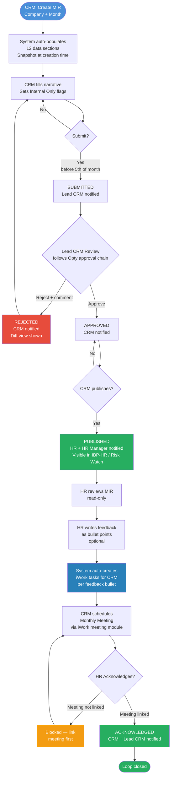

# MIR — Monthly Information Report · PRD (Phase-1)

**Module:** IIRM-758_MIR
**Author:** Nithin Sirigiri
**Apps:** iWork + IBP-HR Portal
**Created on:** 2026-06-26
**Last updated:** 2026-07-17
**Status:** Draft

---

## Overview

MIR is a monthly portfolio health report generated by CRM for each corporate client company. It covers policy status, claims activity, renewals, risk coverage, service scores, and planned actions. The CRM authors it, the Lead CRM approves it, and the CRM then publishes it to the client's HR on the IBP portal, where HR reviews, acknowledges, and can raise tasks back to the CRM.

**What the new system fixes vs legacy IRIS:**
- Legacy MIR required fully manual entry (no analytics, redundant data)
- Client delivery was email-only with no digital access to history
- Follow-up items were free-text remarks with no task tracking or accountability
- No AI assistance for insights or policy gap identification

**AI enhancements in Phase 1:**
- AI generates a plain-language insight per data section from auto-populated data
- AI reads the company's **Industry Segment** (from Company profile) and active policy portfolio, identifies missing coverages, and surfaces them as opportunities with rationale and priority

---

## Scope

This PRD covers **Phase-1** of the MIR module — the faithful digital rebuild of the legacy iWork MIR plus the new listing/generation entry point. The boundary below separates what Phase-1 commits to from what is out of scope, so sign-off is unambiguous.

**In scope (Phase-1):**

- **MIR listing (view-only)** — search (company / CRM) and Period / Status filters; open any past report read-only.
- **Generate MIR (owner-gated)** — Company + Month → a Draft with all report sections auto-populated as a creation-time snapshot.
- **The 13 report sections (§1–§13)** exactly as in the Data Contract — Auto columns, the CRM-editable fields (Remarks, Action, Details, Reason for Pendancy, Risk-Matrix checkboxes, Timelines, Responsibility), a per-section **Section Summary**, and the MIR-level **Overall Comments**.
- **Lifecycle** — Draft → Submitted → Approved → Published → Acknowledged, with Rejected (mandatory comment) returning to Draft.
- **Roles & access** — Associate CRM, Lead CRM, HR (`ROLE_EXTERNAL_HR`), HR Manager, Admin / Leadership; 3-month rolling access window.
- **Internal Only flags** and **client-facing PDF export**.
- **HR feedback notes → auto-created CRM tasks**; **Monthly Meeting linkage** as the acknowledgement gate.

**Out of scope (Phase-1):**

- AI-generated section insights and AI risk-gap analysis.
- Alternative presentation layouts / dashboard visualisations.
- Any change to source systems (claims, policy, CD / Caution Deposit). MIR consumes read-only snapshots only.
- Technical design and data-model decisions — that is the TRD (stage 40b).

(Columns for sections empty in the source export — §3 Renewals, §8.1 Group Health, §9 CD ledger — are tracked in Open Questions, pending a populated data sample.)

---

## Roles

| Role | System Identity | MIR Action |
|---|---|---|
| Associate CRM | iWork internal user | Creates, fills, submits |
| Lead CRM | iWork internal user (`leadCRM` on company) | Approves / Rejects — sole approver, single-level (see BR-MIR-007) |
| Any HR in Org | `ROLE_EXTERNAL_HR` on IBP portal | Views, writes feedback notes, acknowledges — system auto-creates tasks for CRM from the notes |
| HR Manager | IBP portal manager role | Views (read-only) |
| Admin / Leadership | System roles | Can access any MIR regardless of 3-month window |

---

## Lifecycle

```
Draft → Submitted → Approved → Published → Acknowledged
              ↑          |
              └── Rejected (back to Draft, unlocked)
```

| State | Who transitions | What happens |
|---|---|---|
| **Draft** | Associate CRM creates | Auto-population runs; AI generates insights; CRM fills narrative |
| **Submitted** | CRM submits | Locked for editing; Lead CRM notified (email + in-app) |
| **Approved** | Lead CRM approves | CRM notified; MIR still not visible to HR |
| **Rejected** | Lead CRM rejects + mandatory comment | CRM notified with comment; MIR unlocked; rejection diff shown |
| **Published** | CRM explicitly publishes | HR and HR Manager notified; MIR visible in IBP-HR / Risk Watch |
| **Acknowledged** | Any HR in the org acknowledges | CRM + Lead CRM notified; monthly loop closed |

> HR visibility gate: MIR is visible on IBP **only after CRM publishes**. Approved ≠ Published. CRM controls when the client sees the report.

---

## Process Flow



---

## MIR Listing & Generation

The MIR module opens on a **listing** of previously generated reports — this is the entry point for the feature (the legacy MIR had no landing list).

**Listing (view-only).** One row per generated MIR:
- Company
- Period (month)
- Status (Draft / Submitted / Approved / Published / Acknowledged)
- Policies
- Premium
- Open Claims
- CRM Owner
- Generated-on date
- Supports search (company / CRM) and filters by Period and Status.
- View or Click on row - Opening a row shows that MIR in read-only view; rows are never edited from the listing.

**Generate MIR (owner-gated).** The sole create entry point.
- The action is **visible and usable only to the CRM who owns the company** (the assigned Associate CRM / Lead CRM). A user who owns no company does not see it (extends BR-MIR-003).
- Opens a dialog to choose **Company** (only companies the user owns) and **Period (month)**. It will show only current + 1 month only because we can generate only that. Ex. we are in April, then user generate Mar not anything above March.
- On confirm, the system creates a **Draft** and auto-populates the data sections as a creation-time snapshot, then opens the new Draft for the CRM to review and add narrative.
- **One MIR per company per month** (BR-MIR-001): if a MIR already exists for that company + period, the dialog surfaces it and offers to open the existing report instead of creating a duplicate.

> ⚠ Technical (Tech Lead review): the listing is a new entry-point route for the MIR module. Generate-gating maps to authenticated-user vs. company-owner (`leadCRM` / account owner) — a permission check. No new data model; the listing reuses existing MIR records.

---

## MIR Sections — Data Contract

Sections, columns, and example rows are extracted from the **old iWork MIR** (`MIR - From Old iWork_4-Jun-2026.pdf`). Section sequence and grouping per review.

**Table layout:** each table is shown transposed — the **header row is the column Heading**, followed by a **Definition** row, a **Formula** row (how each Auto column is derived from live data, documented as-built from the code), then **Example 1** and **Example 2** rows; the first column labels each row. Headers marked **(CRM)** are CRM-entered (editable); all other columns are **Auto** (read-only snapshot). **GAP:** in a Formula cell flags where the shipped code diverges from that column's Definition.

**Policy identifier:** the system has no policy-specific name — policies are identified by **Policy Type** (from the policy-type master). Columns labelled **Policy Type - Policy Number** show the policy type followed by its **Insurer Policy Number**, or **POL-{Policy ID}** when the policy has no insurer number. ✅ **Fixed**: `policyLabel` now emits this format and is applied across §1, §3, §4.1–§4.4, §6, §7, §8, and §9's linked policies.

**Section Summary** (New): every top-level section carries a free-text box the CRM writes to summarise that section (manual, no AI). **§13 Overall Comments** is a separate MIR-level free-text box.

> Requirements status: section order, grouping, columns and example layout frozen from the old system. Sections empty in the source export are flagged "to confirm from live data" (see Open Questions).

### §1 — Critical Issues Needing Your Immediate Attention

| Field | Policy Type | No. of Policies | Incep. Premium | Remarks (CRM) | Action (CRM) |
|---|---|---|---|---|---|
| **Definition** | Policy type (grouped by type) | Count of policies grouped under this policy type | Premium at inception, in Rs (without service tax) | CRM free-text remark on this critical item | CRM free-text next step / action |
| **Formula** | Policy type, grouped ✅ | Count of policies in the group | Sum of inception premium (is-inception endorsement gross premium; else `policy.premium_at_inception`) | CRM-entered | CRM-entered |
| **Example 1** | Marine_Specific | 1 | Rs 6,217.42 | Renewal Notice shared to client on 15-May-20 | Following up with Insurer for Competitive quotes |
| **Example 2** | WC | 1 | Rs 90,51,626.60 | Renewal Notice shared to client on 15-May-20 | Following up with Insurer for Competitive quotes |

**How it's calculated (developer / tester detail):**

- **Scope:** every policy **active in the report period** — policy start on/before the report month-end **and** policy end on/after the report month-start. Rows are **grouped** (one row per group).
- **No. of Policies** = number of policies in the group.
- **Incep. Premium** = sum, across the group, of each policy's **inception premium**. Inception premium = the gross premium of the policy's inception endorsement (group policies) or inception asset-endorsement (other policies); if neither exists, the policy's recorded premium-at-inception.
- **Worked example:** three GMC policies active in the month with inception premiums Rs 10,00,000 + Rs 5,00,000 + Rs 2,00,000 -> the GMC row shows **No. of Policies = 3**, **Incep. Premium = Rs 17,00,000**.
- ✅ **Fixed**: now groups by policy **type**. <span style="color:#d00">Still open</span>: no "critical" filter is applied yet — it lists every active policy. The BA needs to define what makes a policy "critical" (e.g. tied to §2's pending issues, §3's renewal urgency, or a dedicated flag) before this can be built.

**Section Summary:** CRM free-text.

### §2 — Claim Documentation

| Field | Issues | Details (CRM) | Remarks (CRM) | Action (CRM) |
|---|---|---|---|---|
| **Definition** | Fixed issue category: Claims Documentation / Policy Documentation / Uncovered Risks / Other Issues | CRM detail note for the issue | CRM free-text remark | CRM free-text action |
| **Formula** | Fixed rows: Claims Documentation, Policy Documentation | Auto, not CRM (GAP): count of PENDING claims; count of pending endorsements (`insurer_endorsement_date IS NULL` + pending asset endorsements) | CRM-entered | CRM-entered |
| **Example 1** | Claims Documentation | 41 GPA Claims pending | — | Following up for shortfall Documents |
| **Example 2** | Policy Documentation | No Endorsements Pending | — | — |

**How it's calculated (developer / tester detail):**

- Two fixed rows: **Claims Documentation** and **Policy Documentation**.
- **Claims Documentation** = count of claims with status **PENDING** on policies active in the report period -> shown as "{N} Claims pending".
- **Policy Documentation** = count of **pending endorsements** on those policies -> "{M} Endorsements Pending", or **"No Endorsements Pending"** when M = 0. A regular endorsement is pending when its insurer-endorsement date is empty; an asset endorsement is pending when — for an *Extension* — its status is "request received", otherwise when its insurer-endorsement date is empty.
- **Worked example:** 41 claims with status PENDING and no pending endorsements -> row 1 "41 Claims pending", row 2 "No Endorsements Pending".
- <span style="color:#d00">Build note</span>: the computed count is written into the column the table labels CRM **Details** — confirm whether Details is auto (this count) or a CRM free-text field.

**Section Summary:** CRM free-text.

### §3 — Renewals Due in 3 Months

Policies due for renewal within 3 months of the report period.

| Field | Policy Type - Policy Number | Premium YTD | Renewal Date | Renewal Status |
|---|---|---|---|---|
| **Definition** | Policy type and its insurer policy number (or POL-{Policy ID} if none) | Premium year-to-date for the policy | Date the policy is due for renewal (expiry) | Current stage in the renewal pipeline (for developers: the Opportunity activity name) |
| **Formula** | Policy type (lookup) ✅ + insurer policy number; policies expiring within 3 months of the period | Premium YTD (GAP: as-built still returns inception premium, not a true YTD figure) | `policy.policy_to` | Opportunity activity name (Opty module) ✅ — now resolves the live activity (was hardcoded "Active") |
| **Example 1** | GMC - 0723002819P105276965 | Rs 52,23,386.00 | 30 Jun 2026 | Placement Slip |
| **Example 2** | GPA - 0723004219P105883549 | Rs 51,34,239.00 | 30 Jun 2026 | Quotes Shared |

**How it's calculated (developer / tester detail):**

- **Scope:** policies whose **renewal/expiry date** falls between the **first day of the report month** and the **last day of the second month after it** — i.e. the report month plus the next two months (a rolling 3-month window).
- **Renewal Date** = the policy's expiry date.
- **Premium YTD** = premium year-to-date (intended). <span style="color:#d00">As-built returns the inception premium, not a YTD figure.</span>
- **Renewal Status** = the current **Opportunity activity name** for that policy's renewal (Opty module). ✅ **Fixed** — resolves the latest incomplete (or, failing that, most recent) Opportunity activity name; no longer a hardcoded "Active".
- **Worked example:** report period **Mar-2026** -> window = **1-Mar-2026 to 31-May-2026**; a policy expiring **20-Apr-2026** appears; one expiring **10-Jun-2026** does not.

**Section Summary:** CRM free-text.

### §4 — Claims

#### §4.1 — Policy to Claim Status
*Movement of claim counts and values through the month. Each value cell is **No / Value**.*

| Field | Policy Type - Policy Number | Start of Month (No / Value) | Received (No / Value) | Paid (No / Value) | End of Month (No / Value) | Remarks (CRM) |
|---|---|---|---|---|---|---|
| **Definition** | Policy name + policy number | Open claims at start of month: count / Rs value | Claims received during month: count / value | Claims paid during month: count / value | Open claims at end of month: count / value | CRM free-text remark |
| **Formula** | Policy Type - Policy Number | Not-settled claims to prev month-end: count / sum amount | Not-settled claims to period-end: count / sum | Settled claims to period-end: count / sum | Start + Received − Paid (count and value) | CRM-entered |
| **Example 1** | GMC-0723002819P105276965 | 10 / 4,75,309 | 10 / 2,17,688 | 1 / 1,00,000 | 18 / 4,59,776 | — |
| **Example 2** | GMC-0723002819P105344870 | 44 / 13,69,672 | 108 / 45,54,393 | 42 / 7,83,194 | 109 / 45,96,393 | — |

**How it's calculated (developer / tester detail):**

- **Scope:** policies active in the report period. Every cell is **count / Σ claim amount**.
- **Intended:** **Start of Month** = claims open at the start of the month; **Received** = claims received **during** the month; **Paid** = claims settled **during** the month; **End of Month = Start + Received − Paid**.
- **Worked example (intended):** 10 open at month start, 5 received during the month, 2 paid -> End = 10 + 5 − 2 = **13**.
- ✅ **Fixed**: **Received** and **Paid** are now restricted to *within the report month* (`startStr`–`endStr`), removing the prior overlap with **Start**'s cumulative window. **End = Start + Received − Paid** no longer double-counts.

#### §4.2 — Claim Analysis
*As on report-creation date. Premium figures without service tax.*

| Field | Policy Type - Policy Number | Incep. Premium | Premium YTD | Claims as on Date | Loss Ratio | Remarks (CRM) |
|---|---|---|---|---|---|---|
| **Definition** | Policy type + insurer policy number (or POL-{Policy ID} if none) | Inception premium (Rs, without service tax) | Premium year-to-date | Total claims as on report date | Loss ratio % (claims ÷ premium) | CRM free-text remark |
| **Formula** | Policy Type - Policy Number ✅ | Inception premium | Sum of in-period endorsement premium ✅ (no longer duplicates Incep. Premium) | Sum of claim amount to prev month-end | **Claims ÷ Premium YTD × 100** ✅ | CRM-entered |
| **Example 1** | GMC-0723002819P105276965 | Rs 47,74,978.00 | Rs 52,23,386.00 | Rs 95,47,049.00 | 182.69 | — |
| **Example 2** | GMC-0723002819P105344870 | Rs 2,91,90,074.00 | Rs 6,88,50,285.00 | Rs 4,21,38,616.00 | 106.25 | — |

**How it's calculated (developer / tester detail):**

- **Scope:** policies active in the report period.
- **Incep. Premium** = inception premium (see §1).
- **Premium YTD** = premium year-to-date. ✅ **Fixed** — as-built now sums endorsement gross premium from policy start through the report period end, no longer duplicating Incep. Premium.
- **Claims as on Date** = Σ claim amount for claims dated from the policy start to the **previous month-end**.
- **Loss Ratio** = **Claims as on Date ÷ Premium YTD × 100** (a percentage). ✅ **Fixed** — computed as-built.
- **Worked example:** Claims Rs 95,47,049 ÷ Premium YTD Rs 52,23,386 × 100 ≈ **182.8%** (the legacy sample shows 182.69).

#### §4.3 — Claim Aging Analysis
*Only Reimbursement claims are considered. Each cell is **No / Value**. (No per-row remarks in the old system.)*

| Field | Policy Type - Policy Number | Outstanding (No / Value) | >45 Days (No / Value) | >30 Days (No / Value) | >15 Days (No / Value) | <15 Days (No / Value) |
|---|---|---|---|---|---|---|
| **Definition** | Policy type + insurer policy number (or POL-{Policy ID} if none) | Total outstanding: count / Rs value | Aged >45 days: count / value | Aged >30 days: count / value | Aged >15 days: count / value | Aged <15 days: count / value |
| **Formula** | Policy Type - Policy Number ✅ | Outstanding reimbursement (not-settled) claims: count / sum | count / sum aged >45d ✅ | count / sum aged 30–45d ✅ | count / sum aged 15–30d ✅ | count / sum aged ≤15d ✅ |
| **Example 1** | GPA-0723004219P105883549 | 6 / 6,00,000 | 6 / 6,00,000 | 0 / 0 | 0 / 0 | 0 / 0 |
| **Example 2** | GMC-0723002819P105276965 | 18 / 4,59,776 | 0 / 0 | 0 / 0 | 0 / 0 | 0 / 0 |

**How it's calculated (developer / tester detail):**

- **Scope:** only **Reimbursement** claims (`clm_type = REIMBURSEMENT`) that are **not Settled** (`claim_status ≠ SETTLED`), on policies active in the report period.
- **Days aged** = *reference date* − *claim date* (`claim_dt`), counted in whole days. The **reference date is the report period's previous month-end** (the snapshot cut-off) — **not** today's date.
- **Buckets** (non-overlapping; each cell shows **count / Σ claim amount** of the claims that fall in it):
  - **<15 Days** — days aged ≤ 15
  - **>15 Days** — 15 < days aged ≤ 30
  - **>30 Days** — 30 < days aged ≤ 45
  - **>45 Days** — days aged > 45
  - **Outstanding** — all of the above combined (every not-settled reimbursement claim)
- **Worked example:** a claim dated **1-Jan-2026**, still open, appearing in the **Mar-2026** MIR → reference date = **28-Feb-2026** (previous month-end); days aged = 28-Feb-2026 − 1-Jan-2026 = **58 days**; since 58 > 45 it is counted in **>45 Days** (and in **Outstanding**), and its claim amount adds to both value totals.
- ✅ **Fixed**: columns are now emitted in the documented descending order (Outstanding, >45, >30, >15, <15).

#### §4.4 — Issues on Claims >30 & <45 Days

| Field | Claim References | Policy Type - Policy Number | Claim Amount | Claims Date | Reason for Pendancy (CRM) |
|---|---|---|---|---|---|
| **Definition** | Claim reference number(s) | Policy type + insurer policy number (or POL-{Policy ID} if none) | Claim amount (Rs) | Date of the claim | CRM free-text reason the claim is pending |
| **Formula** | `policy_claim.claim_number` ✅ | Policy Type - Policy Number ✅ | Claim amount | Claim date | CRM-entered — ✅ now filtered to 30–45 day claims only |
| **Example 1** | 541497 | GMC-072300/48/13/41/00000727 | Rs 3,950.00 | 11/sep/2013 | — |
| **Example 2** | 543238 | GMC-072300/48/13/41/00000727 | Rs 19,899.00 | 21/sep/2013 | — |

**How it's calculated (developer / tester detail):**

- **Intended scope:** only claims **aged more than 30 and up to 45 days** (30 < days aged ≤ 45), reimbursement, still open. Days aged = previous month-end − claim date (see §4.3).
- Columns: Claim References, policy identifier, Claim Amount, Claim Date; Reason = CRM.
- **Worked example (intended):** a claim dated **20-Jan-2026** in the **Mar-2026** MIR -> days aged = 28-Feb-2026 − 20-Jan-2026 = **39 days** -> in the 30–45 range -> it appears.
- ✅ **Fixed**: filtered to claims aged 30–45 days only, and Claim References / Policy Type - Policy Number are now separate columns (previously the policy column showed a TAT-bucket label instead).

**Section Summary:** CRM free-text.

### §5 — Risk Matrix
*Risk categories: Financial · Liabilities · People · Property. Exposure / Cover / Adequacy are checkboxes.*

| Field | Risk | Risk Type | Exposure (CRM) | Cover (CRM) | Adequacy (CRM) | Remarks (CRM) |
|---|---|---|---|---|---|---|
| **Definition** | Risk category | Specific risk type | Checkbox — client has exposure | Checkbox — cover exists | Checkbox — cover is adequate | CRM free-text remark |
| **Formula** | Fixed template rows (Financial Risk, People Risk) — no live data | Fixed risk type | CRM checkbox | CRM checkbox | CRM checkbox | CRM-entered |
| **Example 1** | Financial Risk | ALOP | [ ] | [ ] | [ ] | — |
| **Example 2** | People Risk | GMC | [ ] | [ ] | [ ] | — |

**Section Summary:** CRM free-text.

### §6 — Portfolio Detail
*Premium figures without service tax.*

| Field | Policy Type - Policy Number | Renewal Date | Incep. Premium | Sum Insured | Premium YTD | Premium ADDONS | Premium DELONS | Claim YTD | Insurer |
|---|---|---|---|---|---|---|---|---|---|
| **Definition** | Policy type + insurer policy number (or POL-{Policy ID} if none) | Renewal date | Inception premium (Rs, w/o service tax) | Sum insured (Rs) | Premium year-to-date | Premium from endorsement additions | Premium from endorsement deletions | Claims year-to-date | Insurer name + branch |
| **Formula** | Policy Type - Policy Number ✅ | `policy.policy_to` | Inception premium | `policy.sum_insured` ✅ | Sum of in-period endorsement premium ✅ | <span style="color:#d00">Not implemented — no schema support, see note</span> | <span style="color:#d00">Not implemented — no schema support, see note</span> | Sum of claim amount to prev month-end | Lead insurer name + branch ✅ |
| **Example 1** | All_Risk-072300/48/11/01/00000225 | 19/Apr/2012 | Rs 62,886.00 | Rs 96,70,977.00 | Rs 71,928.84 | Rs 3,277.00 | Rs 951.00 | Rs 22,162.00 | UII, DO 9-72300, Bangalore |
| **Example 2** | GPA-0723004219P105883549 | 30/Jun/2020 | Rs 40,84,312.00 | Rs 1,95,30,66,000.00 | Rs 51,34,239.00 | Rs 19,19,009.00 | Rs 14,61,606.00 | Rs 6,00,000.00 | UII, DO 9-72300, Bangalore |

**How it's calculated (developer / tester detail):**

- **Scope:** policies active in the report period.
- **Renewal Date** = policy expiry date. **Incep. Premium** = inception premium (see §1). **Claim YTD** = Σ claim amount for claims dated from the policy start to the **previous month-end**.
- ✅ **Fixed**: **Sum Insured**, **Insurer** (lead insurer + branch), and **Premium YTD** (real in-period endorsement premium, no longer duplicating Incep. Premium) are all implemented.
- <span style="color:#d00">Still open</span>: **Premium ADDONS** / **Premium DELONS**. There is no dedicated addition/deletion premium column on `endorsement` / `policy_asset_endorsement` — only aggregate `gross_premium` plus separate addition/deletion *count* columns. Deriving ADDONS/DELONS from `gross_premium` filtered by count > 0 was attempted and reverted as not a reliable enough proxy to ship. This needs either a schema change (a real premium-direction column) or an explicit BA-approved approximation before it can be built.

**Section Summary:** CRM free-text.

### §7 — Policy Insurer Details
*Contact Person was blank in the source export.*

| Field | Policy Type - Policy Number | Insurer Name | Insurer Branch | Contact Person |
|---|---|---|---|---|
| **Definition** | Policy type + insurer policy number (or POL-{Policy ID} if none) | Insurer (company) name | Insurer branch / office | Insurer contact person |
| **Formula** | Policy Type - Policy Number | Lead insurer name (via `policy_insurer_map` LEAD → `insurer`) | Insurer branch (`address.branch_name` / `addr_1`) | Lead insurer contact name + phone — now populated (resolves the blank Contact Person) |
| **Example 1** | Fidelity_Guarantee | NIA | J.C. ROAD BRANCH 670201 | — |
| **Example 2** | Fire | NIC | DO 8 - 604500 | — |

**How it's calculated (developer / tester detail):**

- **Scope:** policies active in the report period, joined to the **lead insurer** on each policy.
- **Insurer Name** = the lead insurer's company name.
- **Insurer Branch** = the lead insurer's branch (branch name; falls back to the branch address line when no branch name).
- **Contact Person** = the lead insurer contact's full name; a phone number, when present, is appended as "Name (phone)" (decrypted when stored encrypted).
- No calculation — source lookup only. This resolves the legacy blank Contact Person.

**Section Summary:** CRM free-text.

### §8 — Head Count for Health Policies

#### §8.1 — Group Health
*Showed "No Opportunities Present" in the source export — columns to confirm from live data.*

| Field | Policy Type - Policy Number | Sum Insured | Inception Count | Additions | Deletions | Current Total |
|---|---|---|---|---|---|---|
| **Definition** | Health policy type + insurer policy number (or POL-{Policy ID} if none) | Sum insured per member | Lives covered at policy inception | Lives added during month | Lives deleted during month | Current total lives (Inception + Additions − Deletions) |
| **Formula** | Policy Type - Policy Number (health types) | `policy.sum_insured` | <span style="color:#d00">Not implemented — not shown (is-inception count queried, unused)</span> | Sum of `employee_endorsement_addition_count` | Sum of `employee_endorsement_deletion_count` | Additions − Deletions (GAP: ignores Inception; intended Inception + Add − Del) |
| **Example 1** | _No Opportunities Present (source export)_ | — | — | — | — | — |
| **Example 2** | — | — | — | — | — | — |

**How it's calculated (developer / tester detail):**

- **Scope:** **health-type** policies active in the report period. Figures are member (lives) counts.
- **Sum Insured** = the policy's sum insured (per member). **Additions** = total members added across the policy's endorsements. **Deletions** = total members deleted.
- **Current Total (intended)** = **Inception lives + Additions − Deletions**.
- **Worked example:** Inception 100, Additions 20, Deletions 5 -> Current Total = 100 + 20 − 5 = **115**.
- <span style="color:#d00">Build note</span>: as-built, **Current Total = Additions − Deletions** (it **ignores Inception**, giving 20 − 5 = 15 for the example), and the **Inception Count** column is not shown even though its value is queried. Both must be fixed.

#### §8.2 — Non-Health Insurance

| Field | Policy Type - Policy Number | Sum Insured | Additions | Deletions | Sum Insured at Closed |
|---|---|---|---|---|---|
| **Definition** | Non-health policy type + insurer policy number (or POL-{Policy ID} if none) | Sum insured at inception | Sum insured added during month | Sum insured deleted during month | Sum insured at close |
| **Formula** | Policy Type - Policy Number (non-health types) | `policy.sum_insured` | Sum of employee addition count (GAP: not a Sum-Insured amount) | Sum of employee deletion count (GAP) | Additions − Deletions (GAP: employee counts, not Sum Insured) |
| **Example 1** | WC-4010/81292573/06/000 | 12,91,99,16,328 | 3,22,37,57,162 | 1,21,91,89,826 | 14,92,44,83,664 |
| **Example 2** | GPA-0723004219P105883549 | 19,53,06,60,000 | 13,15,55,80,000 | 9,88,57,40,000 | 22,80,05,00,000 |

**How it's calculated (developer / tester detail):**

- **Scope:** **non-health-type** policies active in the report period. Figures are **sum-insured amounts**.
- **Sum Insured** = the policy's sum insured at inception.
- **Additions / Deletions (intended)** = sum insured added / removed via endorsements during the month.
- **Sum Insured at Closed (intended)** = Sum Insured + Additions − Deletions.
- <span style="color:#d00">Build note</span>: as-built, Additions/Deletions use **member (employee) counts, not sum-insured amounts**, and "Sum Insured at Closed" = Additions − Deletions (member counts). The section must be reworked to operate on sum-insured amounts.

**Section Summary:** CRM free-text.

### §9 — Cash Deposit Account (CD Statement)

**Objective.** Give the client an **account-level** view of every Caution Deposit (CD) account the company holds — *not* a transaction dump. Each CD account is held with an **insurer** and backs one or more **policies**. An executive (CEO / HR / Finance) opening the MIR wants each account's position for the month at a glance — opening balance, money in, money out, closing balance, status, and the policies it covers — not the underlying transactions.

**One row per CD account.** A company with 5 CD accounts shows 5 rows. Individual transactions stay in the live [CD Management](/cd-management) feature for anyone who needs to drill in.

**Across all accounts (summary):** Total Opening Balance · Total Credits · Total Debits · Total Closing Balance — the column totals of the rows below.

| Field | CD Account | Insurer | Opening Balance | Total Credits | Total Debits | Closing Balance | Status | Linked Policies |
|---|---|---|---|---|---|---|---|---|
| **Definition** | CD account number + name | Insurer the account is held with | Balance carried into the report month | Sum of credits during the month | Sum of debits during the month | Balance at month close (Opening + Credits − Debits) | Account status (Active / Dormant / Closed) | Policy Type - Policy Number of every policy the account backs |
| **Formula** | `caution_deposit.cd_account_number` + `cd_account_name` | `caution_deposit.insurer_id` -> `insurer.name` | cumulative `sum(credit − debit)` over `caution_deposit_transaction` with `transaction_date < startStr` | `SUM(transaction_amount)` where `transaction_type='CREDIT_TRANSACTION'` and `transaction_date BETWEEN startStr AND endStr` | `SUM(transaction_amount)` where `transaction_type='DEBIT_TRANSACTION'` and `transaction_date BETWEEN startStr AND endStr` | Opening + Total Credits − Total Debits | `caution_deposit.status` | distinct `policy` (type + number) the account backs, via `caution_deposit_transaction.policy_id` (confirm CD-policy linkage source) |
| **Example 1** | CD-72300-001 (Teamlease Main) | UII | Rs 5,00,000.00 | Rs 2,00,000.00 | Rs 1,50,000.00 | Rs 5,50,000.00 | Active | GMC - 0723002819P105276965; GPA - 0723004219P105883549 |
| **Example 2** | CD-72300-002 (Fire Pool) | NIA | Rs 10,00,000.00 | Rs 0.00 | Rs 3,00,000.00 | Rs 7,00,000.00 | Active | Fire - 072300/11/2026/0045 |
| **Example 3** | CD-72300-003 (Marine) | NIC | Rs 0.00 | Rs 8,00,000.00 | Rs 1,00,000.00 | Rs 7,00,000.00 | Active | Marine - 4010/81292573/06/000 |
| **Example 4** | CD-72300-004 (WC Reserve) | UII | Rs 2,00,000.00 | Rs 0.00 | Rs 0.00 | Rs 2,00,000.00 | Dormant | WC - 4010/81292573/06/000 |

**How it's calculated (developer / tester detail):**

- **One row per CD account** the company holds (`caution_deposit WHERE company_id = :companyId`).
- **Opening Balance** = balance carried into the month = `sum(credit − debit)` over every transaction on the account with `transaction_date < startStr` (report-month first day).
- **Total Credits / Total Debits** = `SUM(transaction_amount)` of the account's CREDIT / DEBIT transactions with `transaction_date BETWEEN startStr AND endStr`.
- **Closing Balance** = Opening + Total Credits − Total Debits (equals the account's running balance as of `endStr`).
- **Status** = `caution_deposit.status`. **Linked Policies** = distinct policies the account backs, resolved from the account's transactions' `policy_id` (or a direct CD-policy mapping if one exists — confirm the source).
- **Worked example:** CD-72300-001 opens the month at Rs 5,00,000; a Rs 2,00,000 credit and Rs 1,50,000 of debits post during the month -> Closing = 5,00,000 + 2,00,000 − 1,50,000 = **Rs 5,50,000**.
- ✅ **Fixed**: `s9t1` now returns one row per CD account with the account-level rollup described above (opening/closing balance, month-scoped credit/debit totals, status, linked policies), plus the "across all accounts" summary footer.

> ⚠ Technical (Tech Lead review): source is the existing Caution Deposit records (`caution_deposit` / `caution_deposit_transaction`, `/cd-management`) — read-only; the as-built per-transaction ledger has been replaced by this account-level aggregation. Note: `transaction_amount` is wrapped in `ABS()` in the opening/credit/debit calculations, since some stored transactions were found signed rather than the documented unsigned-magnitude convention — direction is derived solely from `transaction_type`.

**Section Summary:** CRM free-text.

### §10 — Our Service Tracker
*Total Service Score shown at the foot of the section (e.g. **77.50**).*

| Field | Service Name | No. of Policy | <7 Days | <14 Days | <21 Days | <30 Days | >30 Days | Remarks (CRM) | Scored | WTG |
|---|---|---|---|---|---|---|---|---|---|---|
| **Definition** | Service name (fixed list) | Processed / Total | Count completed in <7 days | <14 days | <21 days | <30 days | >30 days | CRM free-text remark | Service score for the row | Weight |
| **Formula** | Fixed service list (<span style="color:#d00">MIR, Quarterly/Monthly Meeting, Renewal Notice not implemented</span>) | Processed / Total | ≤7 days | 8–14 days | 15–21 days | 22–30 days | >30 days (TAT = completion date − created date) | CRM-entered | **(Processed ÷ Total) × WTG** | Fixed weight (rows sum to 100) |
| **Example 1** | Endorsement | 340 / 347 | 332 | 3 | 3 | 2 | 7 | — | 9.80 | 10 |
| **Example 2** | Health Claims | 1976 / 2095 | 485 | 503 | 552 | 254 | 299 | — | 14.10 | 15 |

**How it's calculated (developer / tester detail):**

- **Scope:** a **fixed list of services**. For each, the system measures how many items were completed within turnaround-time (TAT) buckets.
- **No. of Policy** = "**Processed / Total**" — items processed out of the total for that service.
- **TAT buckets** — each item's TAT = **completion/processed date − created/requested date**, in days, bucketed (non-overlapping): **<7** = ≤7, **<14** = 8–14, **<21** = 15–21, **<30** = 22–30, **>30** = over 30.
- **Scored** = **(Processed ÷ Total) × WTG**; 0 when Total = 0. **WTG** = a fixed weight per service; weights across all services sum to **100** (Endorsement 10, Health Claims 15, Non-Health Claims 15, Held Cover Note 15, Policy Document 10, Policy Docket 5, MIR 10, Quarterly Meeting 5, Monthly Meeting 5, Renewal Notice 10).
- **Total Service Score** (section footer) = **sum of Scored** across all rows.
- **Worked example:** Endorsement processed **340** of **347**, WTG **10** -> Scored = (340 ÷ 347) × 10 = **9.80**.
- <span style="color:#d00">Build note</span>: only 6 services are computed (Endorsement, Health Claims, Non-Health Claims, Held Cover Note, Policy Document, Policy Docket); **MIR, Quarterly Meeting, Monthly Meeting, Renewal Notice** return empty rows (0 / 0, Scored 0), so the Total Service Score is understated until they are implemented. Column labels **<14 / <21 / <30** actually mean the ranges 8–14 / 15–21 / 22–30.

Services: Endorsement · Health Claims · Non-Health Claims · Held Cover Note · Policy Document · Policy Docket · MIR · Quarterly Meeting · Monthly Meeting · Renewal Notice.

**Section Summary:** CRM free-text.

### §11 — Other Activities
*Three CRM free-text boxes.*

| Field | Special Initiatives (CRM) | Monthly Meeting Issues (CRM) | Other Issues (CRM) |
|---|---|---|---|
| **Definition** | CRM free-text on special initiatives this month | CRM free-text on issues from the monthly meeting | CRM free-text on any other issues |
| **Formula** | CRM-entered | CRM-entered | CRM-entered |
| **Example 1** | Enrollment drive initiated for Teamlease Midland Group Employees | No Issues | — |
| **Example 2** | — | — | — |

**Section Summary:** CRM free-text.

### §12 — Current Month Plan
*Fixed category rows: Documentation · Claims · Meetings · Others · Renewals.*

| Field | Category | Timelines (CRM) | Responsibility (CRM) | Remarks (CRM) |
|---|---|---|---|---|
| **Definition** | Fixed plan category | CRM timeline for the category | CRM responsibility / owner | CRM free-text remark |
| **Formula** | Fixed categories (Documentation, Claims, Meetings, Others, Renewals) | CRM-entered | CRM-entered | CRM-entered |
| **Example 1** | Documentation | No Endorsements Pending | — | — |
| **Example 2** | Claims | 41 GPA Claims Pending | Following up for pendency documents | — |

**Section Summary:** CRM free-text.

### §13 — Overall Comments
*MIR-level free-text. A single box the CRM writes to summarise the whole report.*

| Field | Overall Comments (CRM) |
|---|---|
| **Definition** | CRM free-text overall comment / summary for the entire MIR |
| **Formula** | CRM-entered (stored on `mir_report.overall_comments`) |
| **Example 1** | Portfolio stable overall; GMC loss ratio remains high — renewal strategy in progress with the insurer. |

---

## User Stories

Each story names the role, the action, and the outcome, and points to the section of this PRD it derives from. (This module is authored directly from the legacy system; there is no upstream BRD, so the **Source** column references the relevant PRD section rather than a UC/FR number.)

| ID | Story | Source |
|---|---|---|
| **US-MIR-001** | As the **owner CRM**, I want to generate a MIR for a company and month so that a Draft is created with all sections auto-populated as a snapshot. | MIR Listing & Generation |
| **US-MIR-002** | As a **CRM**, I want a listing of previously generated MIRs with search and Period / Status filters so that I can find any past report. | MIR Listing & Generation |
| **US-MIR-003** | As a **CRM**, I want to open a past MIR read-only from the listing so that I can review it without altering it. | MIR Listing & Generation |
| **US-MIR-004** | As a **CRM**, I want to fill the editable fields in each section (Remarks, Action, Details, Reason for Pendancy, Risk checkboxes, Timelines, Responsibility) so that the report carries my commentary. | Data Contract §1–§12 |
| **US-MIR-005** | As a **CRM**, I want to write a Section Summary for each section so that a reader gets the gist without parsing the table. | Data Contract (Section Summary) |
| **US-MIR-006** | As a **CRM**, I want to write Overall Comments for the whole MIR so that I can frame the month at a glance. | §13 Overall Comments |
| **US-MIR-007** | As a **CRM**, I want to mark any remark/comment as Internal Only so that it is excluded from the client-facing PDF. | Lifecycle / PDF |
| **US-MIR-008** | As an **Associate CRM**, I want to submit the MIR for approval so that it enters the review workflow and locks for editing. | Lifecycle |
| **US-MIR-009** | As a **Lead CRM**, I want to approve or reject (with a mandatory comment) a submitted MIR so that only accurate reports proceed. | Lifecycle |
| **US-MIR-010** | As an **Associate CRM**, I want to see what changed between my rejected submission and my re-edit so that I can respond to feedback. | Lifecycle |
| **US-MIR-011** | As an **Associate CRM**, I want to publish an approved MIR so that HR can view it at a time of my choosing. | Lifecycle |
| **US-MIR-012** | As an **HR user**, I want to view a published MIR read-only so that I can review the company's monthly portfolio health. | Roles / Lifecycle |
| **US-MIR-013** | As an **HR user**, I want to write feedback notes (no task UI) so that the CRM is aware of my concerns and tasks are created for them automatically. | Lifecycle |
| **US-MIR-014** | As an **HR user**, I want to acknowledge the MIR so that the monthly loop is formally closed. | Lifecycle |
| **US-MIR-015** | As any **authorized user**, I want to export the MIR as a PDF (client-facing content only) so that I can share or archive it. | PDF export |
| **US-MIR-016** | As an **Associate CRM**, I want to schedule the Monthly Meeting from the MIR so that it is linked to the report and unlocks acknowledgement. | Lifecycle |

---

## Business Rules

These rules govern MIR behaviour regardless of the UI. Each is stated with its concrete trigger and effect.

**BR-MIR-001 — One MIR per company per month.** Generating a MIR for a company + month that already has one is blocked; the system offers the existing report to open instead.

**BR-MIR-002 — Generate is owner-gated.** The Generate action and its company picker are available only to the CRM who owns the company (assigned Associate CRM / Lead CRM). Non-owners do not see the action; the picker lists only owned companies.

**BR-MIR-003 — Listing is the entry point; rows are view-only.** The module lands on the listing. Opening a row is read-only; creation happens only via Generate, editing only via the lifecycle.

**BR-MIR-004 — Auto-populated data is a creation-time snapshot.** All Auto columns are captured at generation and are read-only thereafter; no front-end edits at any stage. Example: §6 Loss Ratio shown on 5-Jun reflects data as of the creation timestamp, not "now".

**BR-MIR-005 — CRM-editable fields only.** Only the fields marked (CRM) in the Data Contract — plus each Section Summary and the Overall Comments — accept input. Everything else rejects edits.

**BR-MIR-006 — Section Summary and Overall Comments are CRM free-text.** They are authored manually (no AI in Phase-1). Both honour the Internal Only flag.

**BR-MIR-007 — Due before the 5th of the following month.** A warning shows from the 1st; an Overdue flag appears after the 5th. Example: the May 2026 MIR must be submitted by 5 Jun 2026.

**BR-MIR-008 — Submit locks editing.** A submitted MIR is read-only and can be unlocked only by a Lead CRM rejection.

**BR-MIR-009 — Approval is single-level, by the company's Lead CRM.** The sole approver is the `leadCRM` assigned to that company. Approve → status Approved, CRM notified. The MIR stays invisible to HR until published.

**BR-MIR-010 — Rejection requires a comment.** Reject without a comment is blocked. On reject: status Rejected, MIR unlocked, CRM notified with the comment, and a diff (submitted vs. re-edited) is shown on re-open.

**BR-MIR-011 — Approved ≠ Published.** The CRM must explicitly Publish after approval; until then HR cannot see the MIR.

**BR-MIR-012 — HR visibility.** Any `ROLE_EXTERNAL_HR` user in the same org can view a Published or Acknowledged MIR. Draft / Submitted / Approved / Rejected are invisible to HR.

**BR-MIR-013 — Internal Only flag.** Every remarks/comment field (and the Section Summary / Overall Comments) has an Internal Only toggle (default off = client-visible). Internal-only content never appears in the PDF, regardless of status.

**BR-MIR-014 — PDF = client-facing only.** The exported PDF contains only sections and fields where Internal Only is off. The header carries company, month, status, and approver + date.

**BR-MIR-015 — Service Tracker is read-only.** §10 scores, TAT buckets, and the total Service Score are system-calculated; the CRM may add Remarks only.

**BR-MIR-016 — 3-month rolling access window.** CRMs and managers see the current month + 2 prior months. Admin / Leadership see all MIRs without restriction.

**BR-MIR-017 — Auto-task creation from HR feedback.** When HR saves feedback notes, the system creates one iWork task per note, assigned to the company's Associate CRM, back-linked (company, month, MIR ID). HR sees no task UI.

**BR-MIR-018 — Monthly Meeting gate on acknowledgement.** HR cannot acknowledge until a Monthly Meeting (created in iWork) is linked. The Acknowledge action is disabled until then.

**BR-MIR-019 — Reimbursement-only claim aging.** §4.3 Claim Aging Analysis considers only Reimbursement claims, matching the legacy report.

---

## Acceptance Criteria

Each criterion is the client sign-off condition for its story, written Given / When / Then.

**AC-MIR-001 — Generate MIR, owner-gated (US-MIR-001, US-MIR-002, BR-MIR-001/002).**
*Given* a CRM on the listing who owns at least one company, *when* the page loads, *then* the Generate MIR action is shown; a CRM who owns none does not see it.
*Given* the Generate dialog, *when* the company picker opens, *then* only companies the user owns are listed.
*Given* an owned company + month with no existing MIR, *when* the CRM confirms, *then* a Draft is created with §1–§13 auto-populated as a creation-time snapshot and the Draft opens.
*Given* a company + month that already has a MIR, *when* the CRM confirms, *then* creation is blocked and the existing report is offered to open.

**AC-MIR-002 — View past MIRs (US-MIR-002, US-MIR-003, BR-MIR-003/016).**
*Given* the listing, *when* it loads, *then* one row per generated MIR shows Company, Period, Status, Policies, Premium, Open Claims, CRM Owner, Generated-on; and only the current + 2 prior months appear for non-admin roles.
*Given* the listing, *when* the CRM searches or filters by Period / Status, *then* the rows filter accordingly; opening a row shows the MIR read-only.

**AC-MIR-003 — Fill editable fields, Section Summary, Overall Comments (US-MIR-004/005/006, BR-MIR-005).**
*Given* a Draft MIR, *when* the CRM edits a (CRM) field, a Section Summary, or Overall Comments, *then* the input is saved.
*Given* a Draft MIR, *when* the CRM attempts to edit an Auto column, *then* the field is read-only and rejects input.

**AC-MIR-004 — Internal Only (US-MIR-007, BR-MIR-013/014).**
*Given* any remark/comment/summary field, *when* the CRM toggles Internal Only on, *then* the field is excluded from the client PDF while remaining visible internally.

**AC-MIR-005 — Submit (US-MIR-008, BR-MIR-008).**
*Given* a Draft, *when* the Associate CRM submits, *then* status → Submitted, all fields lock, and the company's Lead CRM is notified (email + in-app).

**AC-MIR-006 — Approve / Reject (US-MIR-009/010, BR-MIR-009/010).**
*Given* a Submitted MIR, *when* the Lead CRM rejects without a comment, *then* it is blocked with an inline prompt.
*Given* a rejection with a comment, *when* confirmed, *then* status → Rejected, fields unlock, the CRM is notified with the comment, and a diff is shown on re-open.
*Given* a Submitted MIR, *when* the company's Lead CRM approves, *then* status → Approved and the CRM is notified; the MIR stays invisible to HR.

**AC-MIR-007 — Publish (US-MIR-011, BR-MIR-011).**
*Given* an Approved MIR, *when* the CRM publishes, *then* status → Published, HR + HR Manager are notified, and the MIR becomes visible in IBP-HR / Risk Watch.

**AC-MIR-008 — HR view + feedback → tasks (US-MIR-012/013, BR-MIR-012/017).**
*Given* a Published or Acknowledged MIR, *when* an `ROLE_EXTERNAL_HR` user opens IBP-HR, *then* it shows read-only; Draft/Submitted/Approved/Rejected never appear for HR.
*Given* HR saves feedback notes, *when* the save completes, *then* one CRM task is created per note, assigned to the Associate CRM with a back-link; no task UI is shown to HR.

**AC-MIR-009 — Acknowledge (US-MIR-014/016, BR-MIR-018).**
*Given* a Published MIR with no linked Monthly Meeting, *when* HR clicks Acknowledge, *then* it is blocked with a "link a meeting first" message.
*Given* a linked Monthly Meeting, *when* HR acknowledges, *then* status → Acknowledged, the timestamp is recorded, and the Associate + Lead CRM are notified.

**AC-MIR-010 — PDF export (US-MIR-015, BR-MIR-014).**
*Given* a Published or Acknowledged MIR, *when* an authorized user exports PDF, *then* the PDF contains only non-Internal-Only content, with company/month/status/approver in the header.

**AC-MIR-011 — Snapshot integrity (BR-MIR-004).**
*Given* a generated MIR, *when* source data changes after creation, *then* the MIR's Auto columns remain as captured at creation.

---

## Open Questions

These must be resolved (by Product with the client, or in the TRD at stage 40b) before Phase-1 is built.

1. **Empty legacy sections** — §3.1 List of Policies, §3.2 Renewal Activity Calendar, §8.1 Group Health headcount, and the §9 CD transaction ledger were empty in the source export. Confirm the exact columns from a populated MIR (or the live source) before build.
2. **AI in Phase-1** — the Process Flow diagram (carried from the original) still shows an "AI: Section insights + Risk Gap Analysis" step, but the Data Contract has no AI section. Confirm AI is out of scope for Phase-1 and update the Process Flow to drop the AI step.
3. **Section Summary vs Overall Comments** — both are CRM free-text. Confirm whether Section Summaries appear in the client PDF by default, or are internal unless toggled.
4. **§7 Policy Insurer Details — Contact Person** was blank in the export. Confirm the source of the insurer contact (Manage Insurer contacts?) and whether it is Auto or CRM-entered.
5. ✅ **CD Account linkage** — Resolved and shipped: §9 is now built as an account-level statement, one row per CD account (a company with 5 accounts shows 5 rows), not combined. Linked Policies is resolved via `caution_deposit_transaction.policy_id`, the only linkage source available in the schema.
6. **Number formatting** — legacy values mix grouped and ungrouped figures (e.g. §8.2 raw sum-insured). Confirm display formatting (Indian lakh/crore vs raw) for the new build — display concern for the TRD.
7. **Generate for a non-owned company** — confirm whether an Admin/Leadership user may generate on behalf of any company, or generation is strictly owner-only.

---

## Approval

```
Approved by:
Role:
Date:

Approved by:
Role:
Date:
```