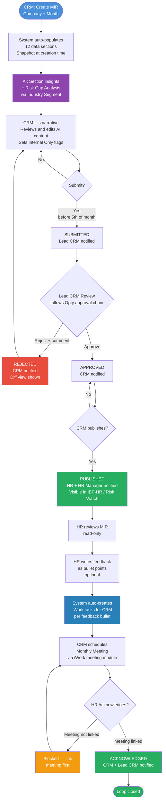

# MIR — Monthly Information Report · PRD (Phase-2)

> Phase-2 placeholder. Carried over from the original draft; to be re-planned when Phase-2 begins.

**Module:** IIRM-758_MIR | **Apps:** iWork + IBP-HR Portal | **Date:** 2026-06-04 | **Status:** Draft

---

## Overview

MIR is a monthly portfolio health report generated by CRM for each corporate client company. It covers policy status, claims activity, renewals, risk coverage, service scores, and planned actions. The CRM authors it, the Lead CRM approves it, and the CRM then publishes it to the client's HR on the IBP portal, where HR reviews, acknowledges, and can raise tasks back to the CRM.

**What the new system fixes vs legacy IRIS:**
- Legacy MIR required fully manual entry (no analytics, redundant data)
- Client delivery was email-only with no digital access to history
- Follow-up items were free-text remarks with no task tracking or accountability
- No AI assistance for insights or policy gap identification

**AI enhancements in Phase 1:**
- AI generates a plain-language insight per data section from auto-populated data
- AI reads the company's **Industry Segment** (from Company profile) and active policy portfolio, identifies missing coverages, and surfaces them as opportunities with rationale and priority

---

## Roles

| Role | System Identity | MIR Action |
|---|---|---|
| Associate CRM | iWork internal user | Creates, fills, submits |
| Lead CRM | iWork internal user (`leadCRM` on company) | Approves / Rejects — sole approver, single-level (see BR-MIR-007) |
| Any HR in Org | `ROLE_EXTERNAL_HR` on IBP portal | Views, writes feedback notes, acknowledges — system auto-creates tasks for CRM from the notes |
| HR Manager | IBP portal manager role | Views (read-only) |
| Admin / Leadership | System roles | Can access any MIR regardless of 3-month window |

---

## Lifecycle

```
Draft → Submitted → Approved → Published → Acknowledged
              ↑          |
              └── Rejected (back to Draft, unlocked)
```

| State | Who transitions | What happens |
|---|---|---|
| **Draft** | Associate CRM creates | Auto-population runs; AI generates insights; CRM fills narrative |
| **Submitted** | CRM submits | Locked for editing; Lead CRM notified (email + in-app) |
| **Approved** | Lead CRM approves | CRM notified; MIR still not visible to HR |
| **Rejected** | Lead CRM rejects + mandatory comment | CRM notified with comment; MIR unlocked; rejection diff shown |
| **Published** | CRM explicitly publishes | HR and HR Manager notified; MIR visible in IBP-HR / Risk Watch |
| **Acknowledged** | Any HR in the org acknowledges | CRM + Lead CRM notified; monthly loop closed |

> HR visibility gate: MIR is visible on IBP **only after CRM publishes**. Approved ≠ Published. CRM controls when the client sees the report.

---

## Process Flow



---

## User Stories

**US-MIR-001** — As an Associate CRM, I want to create a MIR for a company + month so that I can capture the monthly portfolio snapshot.

**US-MIR-002** — As an Associate CRM, I want to fill narrative sections and review/edit AI-generated insights so that the report reflects context the numbers alone don't convey.

**US-MIR-003** — As an Associate CRM, I want to mark any remark or comment field as **Internal Only** so that sensitive internal notes are excluded from the client-facing PDF.

**US-MIR-004** — As an Associate CRM, I want to submit the MIR for Lead CRM approval so that it enters the review workflow.

**US-MIR-005** — As an Associate CRM, I want to see exactly what changed between my rejected submission and my re-edit so that I can respond directly to the Lead CRM's feedback.

**US-MIR-006** — As an Associate CRM, I want to publish the approved MIR to the client so that HR can view it on IBP at a time of my choosing.

**US-MIR-007** — As a Lead CRM, I want to approve or reject a submitted MIR (with mandatory comment on rejection) so that only accurate, complete reports reach the client.

**US-MIR-008** — As a Lead CRM, I want to update Internal Only flags during approval so that I can control what the client sees before it's published.

**US-MIR-009** — As any HR user in the org, I want to view the published MIR under IBP-HR / Risk Watch so that I can review the company's monthly portfolio health.

**US-MIR-010** — As an HR user, I want to write my feedback and observations for the month as bullet points so that the CRM is aware of my concerns — without me having to manage tasks or assignments.

**US-MIR-011** — As an HR user, I want to acknowledge the MIR so that the monthly loop is formally closed.

**US-MIR-012** — As any authorized user, I want to export the MIR as a PDF (client-facing content only) so that I can share or archive it.

**US-MIR-013** — As an Associate CRM, I want to see AI-generated risk gap recommendations based on the company's industry so that I can identify missing policies and prepare pitches for the monthly meeting.

**US-MIR-014** — As an Associate CRM, I want to schedule the Monthly Meeting via iWork directly from the MIR so that it is linked to the report and pre-populated with key insights as the agenda.

**US-MIR-015** — As a CRM, I want a listing of previously generated MIRs so that I can find and open any past report without recreating it. The listing shows one row per generated MIR with: Company · Period (month) · Status (Draft / Submitted / Approved / Published / Acknowledged) · CRM Owner · Generated-on date, plus at-a-glance portfolio figures (policies, premium, open claims). It supports filtering by company, period, and status. Opening a row navigates to that MIR (view). Editing/creating remains governed by the lifecycle and roles above; from the listing a past report is **view-only**.

> ⚠ Technical (Tech Lead review): this is a new entry-point screen/route for the MIR module (the MIR previously had no landing list). Listing data should reuse existing MIR records; no new data model expected.

---

## Business Rules

**BR-MIR-001 — One MIR per company per month.** Duplicate creation is blocked with an error.

**BR-MIR-002 — MIR due before 5th of the following month.** Dashboard shows a warning from the 1st; overdue flag appears after the 5th. Example: May 2026 MIR must be submitted by 5 June 2026.

**BR-MIR-003 — CRM ownership.** Only the Associate CRM or Lead CRM assigned to a company can create its MIR.

**BR-MIR-004 — Submit locks editing.** MIR can only be unlocked by a Lead CRM rejection.

**BR-MIR-005 — Rejection requires a comment.** Rejection without a comment is blocked. Comment appears on the MIR form and in the notification.

**BR-MIR-006 — Rejection diff view.** After a rejection, when the CRM re-opens the MIR, a diff is shown between the originally submitted content and any edits made post-rejection.

**BR-MIR-007 — Approval chain — single level, Lead CRM of the company.**
- The sole approver is the `leadCRM` assigned to the company for which the MIR is created. No other user can approve, even if they hold a Lead CRM role on a different company.
- Approval is single-level — one Lead CRM sign-off is sufficient. No second approver required.
- On **Approve**: status → Approved; Associate CRM receives email + in-app notification. MIR remains invisible to HR until CRM publishes (BR-MIR-008).
- On **Reject**: comment is mandatory (reject blocked without it); status → Rejected; Associate CRM receives email + in-app notification including the rejection comment; MIR is unlocked for edits; diff view is shown on re-open (BR-006).
- After rejection, the Associate CRM can re-edit and re-submit immediately — no minimum change gate. The Lead CRM sees the diff between rejected submission and re-submitted content.
- Implementation follows the existing `opportunityActivityApproval` service pattern — TRD will map MIR to this.

**BR-MIR-008 — Approved ≠ Published.** CRM must explicitly click Publish after approval. Until published, HR cannot see the MIR on IBP.

**BR-MIR-009 — HR visibility.** Any HR user with `ROLE_EXTERNAL_HR` in the same org can view a Published or Acknowledged MIR. Draft, Submitted, Approved, and Rejected MIRs are invisible to HR.

**BR-MIR-010 — Internal Only flag.** Every remarks/comment field has an Internal Only toggle (default: off = client-visible). Fields with Internal Only on are excluded from the PDF. Flag can be changed by CRM post-submission or by Lead CRM during approval.

**BR-MIR-011 — PDF content = client-facing only.** Only sections and fields NOT marked Internal Only appear in the exported PDF. Internal-only content is never in the PDF regardless of status.

**BR-MIR-012 — Auto-populated data is a creation-time snapshot.** Data is pulled at MIR creation and does not change. No front-end edits to auto-populated fields are permitted at any stage.

**BR-MIR-013 — Service Tracker is read-only.** Scores and TAT counts are system-calculated. CRM can add remarks only. See [Service Score PRD — path TBD].

**BR-MIR-014 — AI content is CRM-editable.** AI-generated insights and gap analysis are suggestions. CRM can edit, override, or delete them before submission. The submitted version is CRM's final content.

**BR-MIR-015 — AI fallback.** If AI fails, the system falls back to displaying existing iWork policy types mapped to the company's Industry Segment — no AI, data-driven only.

**BR-MIR-016 — 3-month rolling access window.** CRM and managers see only the current month + 2 prior months. Admin and Leadership roles can access any MIR without restriction.

**BR-MIR-017 — Monthly Meeting gate.** HR cannot acknowledge without a linked Monthly Meeting (created in iWork). Acknowledgement button is disabled until a meeting is linked.

**BR-MIR-018 — Remarks grouped, not per-field.** CRM writes one summary per logical section group. Lead CRM adds a section-level review comment during approval.

**BR-MIR-019 — Notification matrix.**

| Event | Notified | Channel |
|---|---|---|
| Submitted | Lead CRM | Email + in-app |
| Approved | Associate CRM | Email + in-app |
| Rejected | Associate CRM (with comment) | Email + in-app |
| Published | Any HR in org, HR Manager | Email + in-app |
| Acknowledged | Associate CRM, Lead CRM | Email + in-app |

**BR-MIR-020 — Auto-task creation from HR feedback.** When HR submits feedback notes, the system automatically creates one task in iWork per feedback bullet point. Tasks are assigned to the company's Associate CRM and carry a back-link (company, month, MIR ID) visible in iWork. HR sees no task management UI — they only write notes and acknowledge.

---

## MIR Sections — Data Contract

Sections snapshot at **creation time**. Auto-populated fields are read-only throughout. Each remarks/comment field carries an Internal Only flag (BR-010).

**Section grouping is TBD** — UX team will validate and consolidate. Suggestions in the [UX Consolidation Suggestions](#ux-consolidation-suggestions) section below.

---

### §1 — Executive Summary
*Auto + Manual*

Critical policies needing attention. System lists them; CRM adds Remarks and Action per policy.

| Field | Source |
|---|---|
| Policy Name, No. of Policies, Inception Premium | Auto |
| Remarks, Action | Manual — CRM |

---

### §2 — Claim Documentation
*Manual*

Fixed rows: Claims Documentation · Policy Documentation · Uncovered Risks · Other Issues. Each row: Details / Remarks / Action (all CRM-filled).

---

### §3 — Renewals Due in 3 Months
*Auto* — Opportunity name, policy type, renewal date, premium, status.

---

### §4 — Claim Status (per policy)
*Auto + Manual (Remarks)*

| Field | Source |
|---|---|
| Policy Name | Auto |
| Start of Month, Received, Paid, End of Month — No./Value | Auto |
| Remarks | Manual — CRM |

---

### §5 — Claim Aging Analysis (Reimbursement only)
*Auto* — Per-policy table: PolicyName · Outstanding · >45d · >30d · >15d · <15d — each bucket shows **No. / Value**.

Interaction: Clicking any aging bucket cell opens an inline drill-down (§6) showing individual claims for that bucket across all policies. Drill-down closes when the same bucket is clicked again.

---

### §6 — Issues on Claims by Aging Bucket *(Drill-down from §5)*
*Auto + Manual — triggered by clicking any bucket in §5*

| Field | Source |
|---|---|
| Claim Reference No. | Auto |
| Policy Name (full policy number) | Auto |
| Claim Amount | Auto |
| Claim Date | Auto |
| Reason for Pendancy | Manual — CRM (free text, editable inline) |

Applies to all four buckets: >45d, >30d, >15d, <15d. The >45d bucket is highlighted in red to signal urgency.

---

### §7 — Renewal Calendar
*Auto* — Two sub-sections: Renewals Due in 3 Months (list) + Renewal Activity Calendar (log).

---

### §8 — Risk & Opportunity Assessment
*Auto (AI-driven) + Manual (CRM review)*

**Part A — Current Coverage Matrix**

| Field | Source |
|---|---|
| Risk Category (Financial / Liabilities / People / Property), Risk Type | System — iWork industry policy type data |
| Cover | Auto — derived from active policies |
| Exposure, Adequacy | Checkbox — CRM |
| Remarks | Manual — CRM |

**Part B — AI Gap Analysis**

AI reads Industry Segment (Company profile) + active policies → surfaces missing coverages.
Fallback: if AI unavailable, shows iWork's existing industry-to-policy-type mapping.

| Field | Source |
|---|---|
| Recommended Policy Type, Rationale, Priority (H/M/L) | Auto — AI or iWork data |
| CRM Notes, Status (To Discuss / Pitched / Not Applicable) | Manual — CRM |

---

### §9 — Portfolio Details
*Auto* — Full policy-level table.

| Column | Notes |
|---|---|
| Policy Name (with full policy number) | Auto |
| Renewal Date | Auto |
| Inception Premium | Auto |
| Sum Insured | Auto |
| Premium YTD | Auto |
| Premium Addons | Auto — endorsement additions this month |
| Premium Deletions | Auto — endorsement deletions this month |
| Claim YTD | Auto |
| Insurer (name + branch) | Auto |

---

### §10 — Policy Details
*Auto* — Per-policy insurer contact directory.

| Column | Notes |
|---|---|
| Policy Name (with full policy number) | Auto |
| Insurer Name | Auto |
| Insurer Branch | Auto |
| Contact Person | Auto |

---

### §11 — Headcount
*Auto* — Two sub-sections with different schemas:

**Group Health (per life policy):**

| Column | Notes |
|---|---|
| Policy Name | Auto |
| Sum Insured | Auto |
| Inception Count | Auto — employee count at policy start |
| Additions (this month) | Auto |
| Deletions (this month) | Auto |
| Current Total | Auto — Inception + Additions − Deletions |

**Non-Health / Non-Life (per policy):**

| Column | Notes |
|---|---|
| Policy Name (with full policy number) | Auto |
| Sum Insured (inception) | Auto |
| Additions (SI additions this month) | Auto |
| Deletions (SI deletions this month) | Auto |
| Sum Insured at Close | Auto — current SI |

---

### §12 — Cash Deposit Account
*Auto* — Bank-statement format. Reflects the company's existing CD (Caution Deposit) account so MIR figures reconcile with the CD Management screen.

**Account details:** CD Account Number · CD Account Name · Company · Insurer · Bank Name · IFSC Code · Account Status · Minimum Balance (defined as 20% of premium on the mapped policies) · Safe Limit.

KPI summary bar (4 cards): **Opening Balance** (last month's closing) · **Total Credits** (all CR entries this month) · **Total Debits** (all DR entries this month) · **Closing Balance** (current total balance).

Transaction ledger: Transaction Date · Type (CR/DR) · Policy (policy type + insurer policy number) · Intake (endorsement type + endorsement number) · Transaction Mode (NEFT / RTGS / Cheque) · Transaction / Cheque Number · Credit Amount · Debit Amount · Running Balance · Remarks. Shows "No CD Transactions" if none.

> ⚠ Technical (Tech Lead review): account and transaction fields map to the existing **Caution Deposit** records used by the CD Management feature (`/cd-management`). MIR consumes the same source read-only — no new data model. The relevant CD account is resolved via company + insurer (and the CD↔policy mapping).

---

### §13 — Service Tracker
*Auto + Manual (Remarks)*

| Field | Source |
|---|---|
| Service Name | Fixed list |
| No. of Policies (Processed/Total), TAT buckets (<7d <14d <21d <30d >30d) | Auto — TAT data |
| Remarks | Manual — CRM |
| Score, Weight, Total Service Score | Auto — calculated |

Services: Endorsement · Health Claims · Non-Health Claims · Held Cover Note · Policy Document · Policy Docket · MIR · Quarterly Meeting · Monthly Meeting · Renewal Notice.

> **Service Score PRD:** Scoring logic is defined in a separate document. Path to be linked here once available. [Service Score PRD — TBD]

---

### §14 — Other Activities
*Manual* — Special Initiatives · Monthly Meeting Issues · Other Issues (free text, CRM).

---

### §15 — Current Month Plan
*Manual* — Categories: Documentation · Claims · Meetings · Others · Renewals. Each: Timeline / Responsibility / Remarks (CRM).

---

### §16 — HR Feedback & Notes *(New)*
*HR-authored — visible only after Published*

HR writes feedback as free-form bullet points. There is no "create task" button — HR's job ends at writing notes and acknowledging. The system reads each note and automatically creates a task in iWork assigned to the company's CRM with a back-link to this MIR. HR never sees task management UI.

| Field | Type |
|---|---|
| Feedback Notes | Bullet-point free text — HR |
| Acknowledge button + timestamp | Action — HR |

*(System-generated, not visible to HR on IBP)*

| Auto-created iWork Task Field | Source |
|---|---|
| Title | Derived from each feedback bullet point |
| Description | Full feedback note text |
| Assignee | Company's Associate CRM (auto) |
| Linked MIR | Company + Month + MIR ID (auto) |

Acknowledgement is required to close the loop.

---

### §17 — AI-Generated Section Insights *(New)*
*Auto — AI-generated, CRM-editable before submission*

| Field | Source |
|---|---|
| Section Reference | Auto |
| AI-Generated Insight | Auto |
| CRM Edited Version | Manual — overrides AI text if filled |
| Include in PDF | Toggle — CRM |

---

### §18 — Monthly Meeting *(New)*
*CRM-initiated via iWork meeting module*

| Field | Type |
|---|---|
| Meeting Title | Auto-prefilled: "MIR Monthly Meeting — [Company] — [Month]" |
| Scheduled Date, Attendees | Manual — CRM |
| Agenda | Auto-prefilled from key MIR insights; CRM-editable |
| Link to MIR | Auto |

---

## Acceptance Criteria

**AC-MIR-001** — Create MIR (US-MIR-001)

*Given* an Associate CRM selects a company and a month/year and clicks Create,
*When* no MIR exists for that company + month,
*Then* a new MIR in Draft state is created, all §1–§13 sections are auto-populated from data current at that moment, and AI generates section insights (§17) and risk gap analysis (§8B).

*Given* an Associate CRM attempts to create a MIR for a company + month,
*When* a MIR already exists for that combination,
*Then* creation is blocked and an error message is shown indicating a MIR already exists for that period.

---

**AC-MIR-002** — Fill narrative and Internal Only flag (US-MIR-002, US-MIR-003)

*Given* a MIR is in Draft state,
*When* the CRM edits any manual narrative field,
*Then* the change is auto-saved and the Draft is retained.

*Given* a MIR is in Draft state,
*When* the CRM attempts to edit an auto-populated field,
*Then* the field rejects the input and remains read-only.

*Given* a remarks or comment field in any section,
*When* the CRM toggles the Internal Only flag on,
*Then* the field is marked internal and excluded from the client-facing PDF. The flag can be toggled again by CRM post-submission or by Lead CRM during approval.

---

**AC-MIR-003** — Submit for approval (US-MIR-004)

*Given* a MIR is in Draft state,
*When* the Associate CRM clicks Submit,
*Then* the MIR status changes to Submitted, all fields are locked for editing, and the Lead CRM receives an email and in-app notification.

---

**AC-MIR-004** — Approve MIR (US-MIR-007)

*Given* a MIR is in Submitted state,
*When* the Lead CRM approves it,
*Then* the MIR status changes to Approved, the Associate CRM receives an email and in-app notification, and the MIR remains invisible to HR on IBP until the CRM explicitly publishes it.

---

**AC-MIR-005** — Reject MIR (US-MIR-007)

*Given* a MIR is in Submitted state,
*When* the Lead CRM clicks Reject without entering a comment,
*Then* the rejection is blocked and an inline error prompts for a mandatory comment.

*Given* a MIR is in Submitted state and the Lead CRM has entered a rejection comment,
*When* the Lead CRM confirms the rejection,
*Then* the MIR status changes to Rejected, all fields are unlocked for CRM edits, the rejection comment is displayed on the MIR form, and the Associate CRM receives an email and in-app notification containing the comment.

*Given* a MIR has been rejected and the CRM re-opens it,
*When* the CRM views the MIR,
*Then* a diff is shown between the originally submitted content and the current editable state, so the CRM can see exactly what was in the rejected submission.

---

**AC-MIR-006** — Publish MIR (US-MIR-006)

*Given* a MIR is in Approved state,
*When* the Associate CRM clicks Publish,
*Then* the MIR status changes to Published, HR users and HR Manager of that company receive an email and in-app notification, and the MIR becomes visible in IBP-HR under Risk Watch.

---

**AC-MIR-007** — HR views MIR (US-MIR-009)

*Given* a MIR is in Published or Acknowledged state,
*When* any HR user with ROLE_EXTERNAL_HR in the same org opens IBP-HR / Risk Watch,
*Then* the MIR is displayed in read-only view.

*Given* a MIR is in Draft, Submitted, Approved, or Rejected state,
*When* an HR user opens IBP-HR / Risk Watch,
*Then* the MIR does not appear — no data is surfaced for HR until Published.

---

**AC-MIR-008** — HR feedback auto-creates tasks (US-MIR-010)

*Given* a MIR is in Published state and an HR user writes feedback as bullet points and saves,
*When* the notes are saved,
*Then* the system automatically creates one iWork task per bullet point, each assigned to the company's Associate CRM and carrying a back-link (company name, report month, MIR ID).

*Given* an HR user is on the feedback section of a Published MIR,
*When* the HR user views the screen,
*Then* no task form, assignee picker, or due date field is shown — only the feedback notes input and the Acknowledge button are visible.

---

**AC-MIR-009** — Acknowledge MIR (US-MIR-011)

*Given* a MIR is in Published state and no Monthly Meeting has been linked to it,
*When* an HR user clicks Acknowledge,
*Then* the acknowledgement is blocked and a message is shown: a Monthly Meeting must be scheduled before acknowledging.

*Given* a MIR is in Published state and a Monthly Meeting is linked,
*When* an HR user clicks Acknowledge,
*Then* the MIR status changes to Acknowledged, the acknowledgement timestamp is recorded, and the Associate CRM and Lead CRM receive an email and in-app notification.

---

**AC-MIR-010** — PDF export (US-MIR-012)

*Given* any authorized user is viewing a Published or Acknowledged MIR,
*When* they click Export PDF,
*Then* a PDF is generated containing only the sections and fields where Internal Only is off. The PDF header includes company name, report month, status, and approver name with date.

*Given* a field is marked Internal Only,
*When* the PDF is generated,
*Then* that field and its content do not appear anywhere in the PDF, regardless of the MIR status.

---

**AC-MIR-011** — AI risk gap analysis (US-MIR-013)

*Given* a MIR is in Draft state and the company has an Industry Segment set in its profile,
*When* the CRM opens §8 Risk & Opportunity Assessment,
*Then* Part B displays AI-generated recommendations showing the recommended policy type, rationale, and priority (High / Medium / Low) based on the company's industry and active policy portfolio.

*Given* the AI service is unavailable,
*When* the CRM opens §8 Part B,
*Then* the system falls back to displaying the existing iWork industry-to-policy-type mapping for that Industry Segment, with no error blocking the CRM from proceeding.

*Given* AI recommendations are displayed,
*When* the CRM sets a recommendation's status to To Discuss, Pitched, or Not Applicable,
*Then* the status is saved and carries through to the submitted MIR.

---

**AC-MIR-012** — Submission deadline warning (BR-MIR-002)

*Given* a company has no submitted MIR for the previous month and today is between the 1st and 5th of the current month,
*When* the CRM views their dashboard,
*Then* a deadline warning is shown for that company's pending MIR.

*Given* today's date is past the 5th and the MIR is still not submitted,
*When* the CRM views their dashboard,
*Then* the MIR is flagged as Overdue.

---

**AC-MIR-013** — 3-month rolling access window (BR-MIR-016)

*Given* a CRM user opens the MIR list for any company,
*When* the list loads,
*Then* only MIRs from the current month and the 2 immediately preceding months are shown.

*Given* a user with Admin or Leadership role opens the MIR list,
*When* the list loads,
*Then* all MIRs are accessible with no date restriction.

---

## UX Consolidation Suggestions

*Input for UX team review. These are Claude's grouping proposals based on data affinity — UX team validates and adjusts before design.*

The 15 legacy sections + 3 new sections (18 total) reduce to **11 logical groups** when merged by functional theme:

| Group | Proposed Name | Merges |
|---|---|---|
| A | Policy Summary | §1 Executive Summary + §9 Portfolio Details + §10 Policy Details |
| B | Claims | §4 Claim Status + §5 Claim Aging + §6 Issues on Claims >30–45d |
| C | Renewals | §3 Renewals Due in 3M + §7 Renewal Calendar |
| D | Risk & Opportunities | §8 Risk & Opportunity Assessment (Part A + B, AI-driven) |
| E | People & Cover | §11 Headcount for Health Policies |
| F | Financials | §12 Cash Deposit Account |
| G | Service Performance | §13 Service Tracker |
| H | Activity & Plan | §14 Other Activities + §15 Current Month Plan |
| I | HR Notes & Tasks | §16 (new) |
| J | AI Insights | §17 (new) |
| K | Monthly Meeting | §18 (new) |

**Rationale:**
- **A** groups all static policy metadata and premium data the client needs in one view
- **B** puts all claims intelligence together — status, aging, and the drill-down for pending claims
- **C** combines two renewal views that both answer "what's expiring soon"
- **H** combines narrative sections that both describe what happened this month and what's planned next
- **E, F, G** are standalone by nature and should stay separate
- **I, J, K** are new workflow sections with distinct purposes and should not be merged

**Open for UX discussion:** Whether Group A (Policy Summary) is too dense for a single panel, and whether Group J (AI Insights) should be inline within each section or a dedicated summary panel.

---

## Approval

```
Approved by:
Role:
Date:

Approved by:
Role:
Date:
```