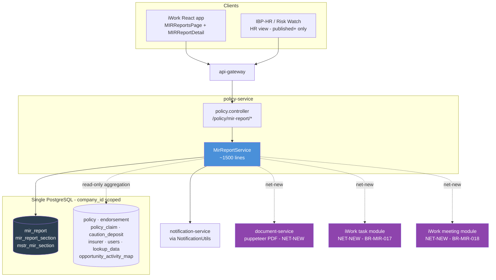
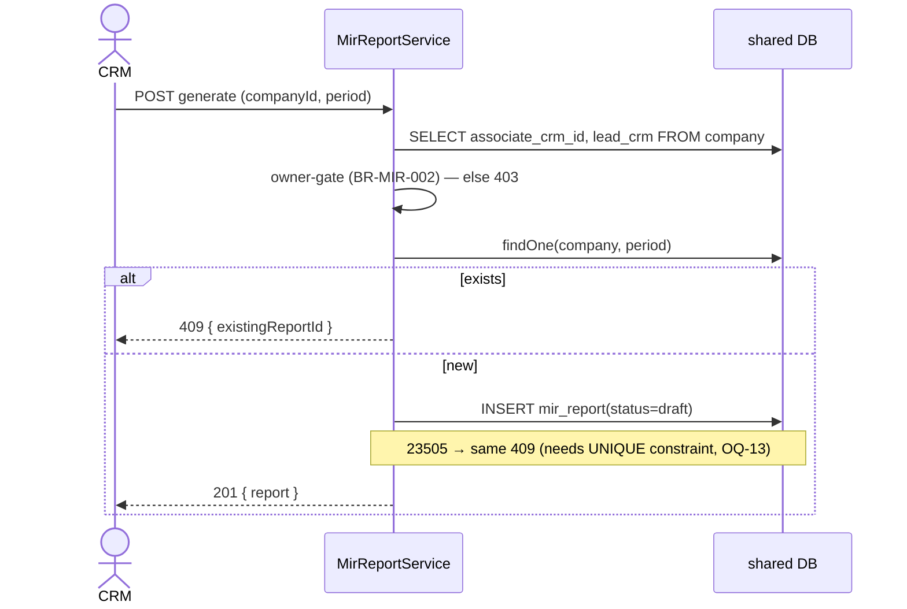

# MIR — Monthly Information Report · TRD (Phase-1)

**Module:** IIRM-758_MIR
**Implements PRD:** [MIR-Phase-1-PRD.md](MIR-Phase-1-PRD.md)
**Stage:** Daksh 40b — Technical Design
**Author:** (Architect / PTL)
**Status:** Draft — pending Architect/PTL sign-off

> The PRD says *what* MIR does. This TRD says *how* — and here the *how* already partly exists in code, so this document is written **as-built**: it describes the shipped design, then names precisely what Phase-1 still has to build.

This TRD translates the [MIR Phase-1 PRD](MIR-Phase-1-PRD.md) into a technical design — but MIR is **not greenfield**. A substantial backend already exists: `MirReportService` (~1,500 lines) in `policy-service`, three persisted entities, five live endpoints, and a React prototype (`apps/ui/iwork/src/app/pages/MIRReportsPage`). This document therefore has two jobs: (1) document the as-built architecture faithfully so a developer can extend it without re-deriving it, and (2) call out — as first-class open questions — every place where the shipped code and the current PRD disagree, plus every Phase-1 requirement not yet implemented.

> ⚠ Whole-document flag (Tech Lead / Architect + Product review): this TRD surfaces **behavioural conflicts between the shipped code and the current PRD** (snapshot timing, who publishes) and **six unbuilt Phase-1 requirements** (PDF, Internal-Only, HR feedback→tasks, meeting-gate, 3-month window, rejection diff). These need a product+tech decision, not just sign-off. All are in [Open Questions](#open-questions).

---

## Scope

This TRD covers the server-side and data design for Phase-1 MIR as specified in the [PRD Scope](MIR-Phase-1-PRD.md#scope): listing, owner-gated generation, the 13 sections (§1–§13), CRM-editable fields and summaries, the Draft→Acknowledged lifecycle, role-based access, the Internal-Only flag, client-facing PDF, HR-feedback-to-task creation, and the meeting-gated acknowledgement.

**In scope (this TRD documents or designs):**

- The **as-built** `MirReportService` in `policy-service`: its entities, endpoints, state machine, aggregation approach, and notification flow.
- The **net-new Phase-1 work** layered on top: PDF export, the Internal-Only flag, HR feedback→task creation, the Monthly-Meeting acknowledgement gate, the 3-month access window, and the rejection diff.
- The reconciliation of PRD-vs-code conflicts (snapshot timing; publish authority) into a single agreed behaviour.

**Non-goals (out of scope for this TRD):**

- **AI insights / risk-gap analysis** — [out of scope per the PRD](MIR-Phase-1-PRD.md#scope); no AI exists in code and none is designed (resolves PRD Open Question 2).
- The exact column sets for sections empty in the legacy export (§3.1, §3.2, §8.1 Group Health, §9 ledger) — blocked on a populated sample; the `jsonb` snapshot absorbs them without migration.
- The React component tree; the frontend consumes the API below.
- Task breakdown / sprint mapping — stage 40c.
- Any change to source data. MIR reads; it never writes back.

---

## Architecture Overview

MIR is an **aggregate-and-freeze** report, and the as-built code implements a specific — and consequential — version of that idea: it aggregates **live** from the source tables every time a Draft or Submitted report is viewed, and only **freezes** a snapshot when the report is **approved**. From that point (approved / published / acknowledged) the report is served from the stored snapshot and never recomputed. Think of it as a live viewfinder that becomes a printed photograph the moment the Lead CRM approves — before approval you always see "now"; after approval you see the approved instant, forever.

> ⚠ Conflict (Product + Tech): the PRD's [BR-MIR-004](MIR-Phase-1-PRD.md#business-rules) and [AC-MIR-011](MIR-Phase-1-PRD.md#acceptance-criteria) require the snapshot to be taken at **creation** ("creation-time snapshot"). The shipped code snapshots at **approval** (`getMirReportWithSections`: `isFrozen = status ∈ {approved, published, acknowledged}`; the `approve` transition writes `approved_data`). These are materially different: a Draft opened a week after generation shows *newer* numbers under the code, but *generation-time* numbers under the PRD. This must be reconciled — see [OQ-8](#open-questions).

**Where it lives.** MIR is a set of methods and endpoints inside **`policy-service`** (`apps/services/policy-service/src/app/policy/mir-report.service.ts`, wired into `policy.controller.ts` and `policy.module.ts`). It is *not* in `report-service` (that service is an empty Nx stub). This placement is pragmatic: most MIR source data — policies, endorsements, claims, service-TAT — is already owned by `policy-service`, so the heavy aggregation SQL runs against tables in the same database without a network hop. The cost is that `policy-service` grows a large reporting concern; extracting MIR to `report-service` later is possible but is not Phase-1 work.

**Tenancy — a single shared database, scoped by `company_id`.** Despite the presence of a dynamic per-tenant datasource framework in `service-lib` (`@UseDatasource`, `DynamicDatasourceService`, `dynamic-datasource.interceptor.ts`), that framework is **dormant** — it is referenced nowhere outside `service-lib` itself. Every service, MIR included, connects through one static PostgreSQL `TypeOrmModule.forRoot` (`service-lib/src/lib/database/typeorm.config.ts`). MIR is per-company purely by `company_id` filtering: `mir_report.company_id` and a `WHERE ... company_id = $1` clause in every aggregation query. Any TRD reader tempted to reach for `@UseDatasource` should not — it is not active.

**Rendering and notifications.** Lifecycle notifications already work: `MirReportService.sendMirNotification` resolves recipient emails from the `users` table and dispatches through `NotificationUtils` (email + in-app) on submit/approve/reject/publish/acknowledge, best-effort (a notification-service outage never blocks a transition). The **client-facing PDF does not yet exist** anywhere in MIR; the design reuses `document-service`'s existing puppeteer-core + handlebars HTML→PDF→S3 pattern (`apps/services/document-service/src/app/pdf`), which today only renders placement slips.

---

## Component Diagram

The diagram places the as-built `MirReportService` against what it touches. Solid arrows are in-process or synchronous calls; dashed arrows are the read-only aggregation against source tables **in the same database**; dotted-future marks the net-new PDF path. The iWork React app and the IBP-HR view both reach MIR through `api-gateway`.



Purple nodes are net-new Phase-1 work; everything else exists today.

---

## Data Model

The as-built schema is three tables, all in the shared database as TypeORM entities under `service-lib/src/lib/entities`. It is deliberately lean: a report header, one row per section carrying both the frozen snapshot and the CRM's edits, and a master list of the 13 sections. The section row is the clever part — it holds the Auto snapshot and the CRM overlay side by side in two `jsonb` columns, so the immutable and mutable halves of a section never fight over the same storage.

```mermaid
classDiagram
    class mir_report {
        int id PK
        int company_id FK
        varchar report_period  // 'MM-YYYY'
        varchar status  // draft|submitted|approved|published|acknowledged
        text overall_comments
        text rejection_comment
        int organisation_id
        int created_by
        int updated_by
        timestamptz created_at
        timestamptz updated_at
        // NO declared UNIQUE(company_id, report_period) — see OQ-13
    }
    class mir_report_section {
        int id PK
        int report_id FK
        int section_id FK
        text section_summary  // CRM per-section summary
        jsonb cell_data  // CRM editable overlay: {cellKey: value}
        jsonb approved_data  // FROZEN snapshot: {subTable: rows[][]}
        timestamptz created_at
        timestamptz updated_at
    }
    class mstr_mir_section {
        int id PK
        varchar section_key  // 's1'..'s13' (unique)
        varchar section_name
        int display_order
    }
    mir_report "1" --> "many" mir_report_section
    mstr_mir_section "1" --> "many" mir_report_section
```

**How the section data actually works:**

- **`approved_data`** is the frozen Auto snapshot, shaped `{ subTableKey: (string|boolean)[][] }` (e.g. `s4` holds `s4t1`…`s4t4`; `s10` holds `s10t1`). It is written **only** by the `approve` transition, from the live query results at approval time. Before approval it is empty and the view is computed live.
- **`cell_data`** is the CRM's editable overlay, a flat `{ cellKey: value }` map. It carries the `(CRM)` fields from the [Data Contract](MIR-Phase-1-PRD.md#mir-sections--data-contract) — Remarks, Action, Details, risk-matrix checkboxes, Timelines, Responsibility. This is the physical embodiment of [BR-MIR-005](MIR-Phase-1-PRD.md#business-rules): Auto data lives in `approved_data`, which the edit path never touches, so it cannot be overwritten.
- **`section_summary`** is the per-section CRM summary; **`overall_comments`** (on `mir_report`) is the MIR-level box (§13).
- **`mstr_mir_section`** is seeded with the 13 sections; the service also carries the same list as the `MIR_SECTION_MASTER` constant and static default grids (`MIR_SECTION_ROWS`) for the fixed-category sections §5 (Risk Matrix) and §12 (Current Month Plan).
- **Valid statuses** are not an enum — they are validated at runtime against `lookup_data WHERE lookup_name = 'MIR_STATUS'`.

**Gaps and risks in the current schema (Phase-1 must address):**

- **No `internal_only` anywhere.** The Internal-Only flag ([BR-MIR-013/014](MIR-Phase-1-PRD.md#business-rules)) has no column. `cell_data` stores bare values. Implementing it needs either a parallel `{cellKey: bool}` map or a schema change — see [OQ-9](#open-questions).
- **No unique constraint declared.** `generateMirReport` relies on a `UNIQUE(company_id, report_period)` for its race backstop (it catches Postgres error `23505`), but the entity declares no such constraint and no migration creates it. If the constraint isn't in the live DB, concurrent generates can create duplicates — [OQ-13](#open-questions).
- **No committed migration.** `mir_report*` tables, the `MIR_STATUS` lookup rows, and the unique constraint exist in running databases but are **not** tracked under `database-migrations/`. This is a reproducibility gap for any fresh environment — [OQ-13](#open-questions).
- **Numeric formatting is baked into the stored strings.** The service formats amounts (`fmtAmt`, Indian grouping), counts, and dates into the grid cells at build time, so snapshots store display strings, not raw numerics (resolves PRD Open Question 6, but note it means re-formatting later requires re-generation).

---

## API Contracts

Five endpoints exist today under `policy-service`, all prefixed `/policy` and reached via `api-gateway`. The lifecycle is driven by **one** `transition` endpoint keyed on an `action`, not one route per transition. The table separates shipped from net-new.

**As-built (shipped):**

| Method & path | Purpose (traces to) | Request | Success | Errors |
|---|---|---|---|---|
| `GET /policy/mir-report/list` | Listing + filters ([US-MIR-002](MIR-Phase-1-PRD.md#user-stories)) | query: `companyId, period, status, page, limit` | `200 { data[], total, page, limit }` (owner shown = Lead CRM name) | `500` |
| `POST /policy/mir-report/generate` | Owner-gated create ([US-MIR-001](MIR-Phase-1-PRD.md#user-stories), [BR-MIR-001/002](MIR-Phase-1-PRD.md#business-rules)) | `{ companyId, period, organisationId? }` + `userid` header | `201 { report }` | `403` non-owner · `409 { existingReportId, existingStatus }` · `400` |
| `GET /policy/mir-report/:id/sections` | Report view — live or frozen ([US-MIR-003](MIR-Phase-1-PRD.md#user-stories)) | — | `200 { report, sections[] }` | `404` |
| `POST /policy/mir-report/:id/submit` | Persist edits + lock ([US-MIR-004/005/006/008](MIR-Phase-1-PRD.md#user-stories), [BR-MIR-008](MIR-Phase-1-PRD.md#business-rules)) | `{ overallComments?, sections:[{ sectionKey, sectionSummary?, cellData? }] }` | `200 { reportId, status:"submitted" }` | `403` · `404` · `409` not Draft |
| `POST /policy/mir-report/:id/transition` | Approve / reject / publish / acknowledge ([US-MIR-009/011/014](MIR-Phase-1-PRD.md#user-stories), [BR-MIR-009/010/011](MIR-Phase-1-PRD.md#business-rules)) | `{ action, comment? }` + `userid` header | `200` (new status) | `403` · `404` · `409` illegal transition · `400` empty reject comment |

The `transition` state map is fixed in code: `approve` (submitted→approved), `reject` (submitted→**draft**, storing `rejection_comment`), `publish` (approved→published), `acknowledge` (published→acknowledged). Note there is **no persisted `rejected` status** — a rejection returns the report to `draft` with the comment attached, matching the PRD's "back to Draft, unlocked" intent while collapsing the state.

**Net-new (Phase-1 must add):**

| Method & path | Purpose (traces to) | Notes |
|---|---|---|
| `GET /policy/mir-report/:id/pdf` | Client-facing PDF ([US-MIR-015](MIR-Phase-1-PRD.md#user-stories), [BR-MIR-014](MIR-Phase-1-PRD.md#business-rules)) | Build a view model with Internal-Only content stripped server-side, render via `document-service`. |
| `POST /policy/mir-report/:id/feedback` | HR notes → CRM tasks ([US-MIR-013](MIR-Phase-1-PRD.md#user-stories), [BR-MIR-017](MIR-Phase-1-PRD.md#business-rules)) | One task per note to the Associate CRM; back-linked. |
| `POST /policy/mir-report/:id/monthly-meeting` | Link meeting ([US-MIR-016](MIR-Phase-1-PRD.md#user-stories)) | Prerequisite for acknowledge. |
| Internal-Only on `submit` payload | ([BR-MIR-013](MIR-Phase-1-PRD.md#business-rules)) | Extend `SubmitSectionDto` to carry the per-field internal flag. |

**Error-code contract:** `403` = ownership/authority failure; `404` = not found (and, once built, outside the caller's window); `409` = state or uniqueness conflict; `400` = validation (empty reject comment, invalid status/action).

---

## Data Flow

### Generate (create the Draft)

Generation is owner-gated, checks for a duplicate, and creates an empty Draft — it does **not** snapshot section data (that happens at approval). Prose-first because the ordering is load-bearing: gate, then duplicate-check, then create, with a DB-constraint backstop for the concurrent-create race.



### View, edit, and the live-vs-frozen split

Opening a report calls `getMirReportWithSections`. If the status is approved/published/acknowledged it serves the **frozen** `approved_data`; otherwise it recomputes every dynamic section **live** from the source tables (`getDynamicSectionRows` for §1–§4, §6–§10; static defaults for §5, §11, §12). Editing is not per-field — the CRM's overlay (`cell_data`, `section_summary`, `overall_comments`) is persisted in bulk by `submit`, which also locks the report.

```mermaid
sequenceDiagram
    actor CRM
    participant SVC as MirReportService
    participant DB as shared DB

    CRM->>SVC: GET :id/sections
    alt status frozen (approved+)
        SVC->>DB: read approved_data (snapshot)
    else draft / submitted
        SVC->>DB: live aggregation SQL per section
    end
    SVC-->>CRM: { report, sections[] (auto rows + savedData) }
    CRM->>SVC: POST submit { sections[], overallComments }
    SVC->>SVC: owner-gate; require status=draft
    SVC->>DB: upsert cell_data + section_summary; status=submitted; clear rejection_comment
    SVC->>SVC: notify Lead CRM (best-effort)
```

### Lifecycle transitions

Every transition is one call to `transition` with an `action`. Approve/reject/publish are gated to the company's **Lead CRM**; reject requires a comment; approve is where the snapshot is frozen into `approved_data`. Each action fires a best-effort notification.

```mermaid
sequenceDiagram
    actor Lead as Lead CRM
    actor HR
    participant SVC as MirReportService
    participant DB as shared DB
    participant NOT as notification-service

    Lead->>SVC: transition { action }
    SVC->>SVC: leadCrm gate on approve/reject/publish (else 403)
    alt approve
        SVC->>DB: freeze approved_data from live rows; status=approved
        SVC->>NOT: notify CRM
    else reject (comment required)
        SVC->>DB: status=draft; rejection_comment=comment
        SVC->>NOT: notify CRM (with comment)
    else publish
        SVC->>DB: status=published
        SVC->>NOT: notify HR + HR Manager
    else acknowledge
        SVC->>DB: status=acknowledged
        SVC->>NOT: notify Associate + Lead CRM
    end
```

> ⚠ Conflict (Product + Tech): the current PRD ([US-MIR-011](MIR-Phase-1-PRD.md#user-stories), [BR-MIR-011](MIR-Phase-1-PRD.md#business-rules)) says the **Associate CRM** publishes; the code gates `publish` to the **Lead CRM**. Also, the acknowledge action in code is **not** gated to an HR role and has **no Monthly-Meeting prerequisite** — both required by [BR-MIR-018](MIR-Phase-1-PRD.md#business-rules). See [OQ-10, OQ-12](#open-questions).

---

## Section Formulae — Data-Source Mapping

This is the technical counterpart to the PRD's [Data Contract](MIR-Phase-1-PRD.md#mir-sections--data-contract) formulae: for each computed section it maps every column to its **source table.column** and the **filter / derivation** a developer implements and a tester verifies against. All sections are returned by `GET /policy/mir-report/:reportId/sections`; values are computed **live** for Draft/Submitted and served from the frozen `approved_data` snapshot once approved. <span style="color:#d00">Red</span> = the shipped code does **not** implement it; **GAP** = computed but diverges from the PRD's column definition.

**Shared terms** (all aggregation is hand-written SQL in `mir-report.service.ts` → `getDynamicSectionRows`; JSON section key `sN`, sub-tables `sNtM`):

- **Period dates** — `startStr` = report-month first day, `endStr` = report-month last day, `prevMonthEnd` = previous month last day, `threeMonthsEnd` = last day of report-month + 2.
- **Active in period** — `policy.company_id = :companyId AND policy.policy_from <= endStr AND policy.policy_to >= startStr`, joined to `lookup_data` on `policy_type_lid`.
- **Inception premium** — `SUM(endorsement.gross_premium WHERE is_inception)` (group policy types) or `SUM(policy_asset_endorsement.gross_premium WHERE is_inception)` (others), else `policy.premium_at_inception`.

### §1 — Critical Issues (`s1` / `s1t1`)

| Column | Source | Derivation / filter |
|---|---|---|
| Policy Type | `policy.policy_name` | grouped (**GAP**: groups by name; should be policy type) |
| No. of Policies | `policy` | `COUNT(*)` per group |
| Incep. Premium | `endorsement` / `policy_asset_endorsement` / `policy.premium_at_inception` | `SUM(inception premium)` per group |

Scope: active in period. <span style="color:#d00">Not implemented</span>: any "critical" filter — every active policy is listed.

### §2 — Claim Documentation (`s2` / `s2t1`)

| Row | Source | Derivation |
|---|---|---|
| Claims Documentation | `policy_claim` | `COUNT(*) WHERE claim_status='PENDING'` on in-period policies |
| Policy Documentation | `endorsement`, `policy_asset_endorsement` | `COUNT` pending = `endorsement.insurer_endorsement_date IS NULL` + pending asset endorsements (`EXTENSION` → status `ENDORSEMENT_REQUEST_RECEIVED`, else `insurer_endorsement_date IS NULL`) |

**GAP**: the computed count is written to the column the PRD marks CRM "Details".

### §3 — Renewals Due in 3 Months (`s3` / `s3t1`)

| Column | Source | Derivation |
|---|---|---|
| Policy Type - Policy Number | `policy.policy_name`, `policy.insurer_policy_number` | label (**GAP**: name, not type) |
| Premium YTD | inception premium | **GAP**: returns inception, not YTD |
| Renewal Date | `policy.policy_to` | expiry date |
| Renewal Status | — | <span style="color:#d00">not implemented — hardcoded `"Active"`; intended = Opportunity **activity name** (`opportunity_activity_map`)</span> |

Filter: `policy.policy_to BETWEEN startStr AND threeMonthsEnd`.

### §4.1 — Policy to Claim Status (`s4` / `s4t1`)

Source: `policy_claim` (per policy). Each cell = `COUNT / SUM(claim_amount)`.

| Column | Derivation |
|---|---|
| Start of Month | not-settled, `claim_dt BETWEEN policy_from AND prevMonthEnd` |
| Received | not-settled, `claim_dt BETWEEN policy_from AND endStr` |
| Paid | settled, `claim_dt BETWEEN policy_from AND endStr` |
| End of Month | derived: `Start + Received − Paid` |

<span style="color:#d00">Build issue</span>: Start and Received are overlapping cumulative windows → End double-counts. Intended: Received/Paid restricted to within the report month.

### §4.2 — Claim Analysis (`s4t2`)

| Column | Source | Derivation |
|---|---|---|
| Incep. Premium | inception premium | — |
| Premium YTD | inception premium | **GAP**: duplicates Incep. Premium |
| Claims as on Date | `policy_claim.claim_amount` | `SUM`, `claim_dt ≤ prevMonthEnd` |
| Loss Ratio | — | <span style="color:#d00">not implemented — blank; intended `Claims ÷ Premium YTD × 100`</span> |

### §4.3 — Claim Aging Analysis (`s4t3`)

Scope: `policy_claim WHERE clm_type='REIMBURSEMENT' AND claim_status<>'SETTLED'`, on in-period policies. **Days aged** = `prevMonthEnd − policy_claim.claim_dt` (whole days).

| Column | Derivation |
|---|---|
| Outstanding | `COUNT / SUM(claim_amount)` of all in scope |
| >45 / >30 / >15 / <15 | `COUNT/SUM FILTER` by bucket: `>45`, `30–45`, `15–30`, `≤15` |

<span style="color:#d00">Build issue</span>: buckets emitted ascending (≤15 first) → values land under the wrong descending headers.

### §4.4 — Issues on Claims >30 & <45 Days (`s4t4`)

| Column | Source | Derivation |
|---|---|---|
| Claim References | `policy` label + `policy_claim.claim_number` | — |
| (PolicyName column) | — | <span style="color:#d00">shows TAT-bucket label, not the policy</span> |
| Claim Amount | `policy_claim.claim_amount` | — |
| Claims Date | `policy_claim.claim_dt` | — |

<span style="color:#d00">Build issue</span>: lists ALL not-settled reimbursement claims; intended filter `30 < days aged ≤ 45`.

### §6 — Portfolio Detail (`s6` / `s6t1`)

| Column | Source | Derivation |
|---|---|---|
| Policy Type - Policy Number | `policy` | label |
| Renewal Date | `policy.policy_to` | — |
| Incep. Premium | inception premium | — |
| Sum Insured | — | <span style="color:#d00">not implemented</span> (available: `policy.sum_insured`) |
| Premium YTD | inception premium | **GAP**: duplicates Incep. Premium |
| Premium ADDONS | — | <span style="color:#d00">not implemented</span> |
| Premium DELONS | — | <span style="color:#d00">not implemented</span> |
| Claim YTD | `policy_claim.claim_amount` | `SUM`, `claim_dt ≤ prevMonthEnd` |
| Insurer | — | <span style="color:#d00">not implemented</span> (available via `policy_insurer_map` → `insurer`) |

### §7 — Policy Insurer Details (`s7` / `s7t1`)

| Column | Source | Derivation |
|---|---|---|
| Policy Type - Policy Number | `policy` | label |
| Insurer Name | `policy_insurer_map` (participation = LEAD) → `insurer.name` | — |
| Insurer Branch | `address.branch_name` / `addr_1` via `policy_insurer_map.insurer_branch_id` | — |
| Contact Person | `contact` (first+last) via `policy_insurer_map.insurer_contact_id`; phone from `contact_communication_details` (decrypted) | "Name (phone)" |

### §8.1 — Group Health (`s8` / `s8t1`)

Scope: health policy types (`lookup_data.lookup_key IN (health keys)`), active in period. Values are member (lives) counts.

| Column | Source | Derivation |
|---|---|---|
| Sum Insured | `policy.sum_insured` | — |
| Inception Count | `endorsement.employee_endorsement_addition_count WHERE is_inception` | <span style="color:#d00">queried but not shown</span> |
| Additions | `endorsement.employee_endorsement_addition_count` | `SUM` all |
| Deletions | `endorsement.employee_endorsement_deletion_count` | `SUM` all |
| Current Total | derived | `Additions − Deletions` (**GAP**: ignores Inception; intended `Inception + Add − Del`) |

### §8.2 — Non-Health Insurance (`s8t2`)

Scope: non-health policy types, active in period.

| Column | Source | Derivation |
|---|---|---|
| Sum Insured | `policy.sum_insured` | — |
| Additions | `endorsement.employee_endorsement_addition_count` | **GAP**: member count, not sum-insured amount |
| Deletions | `endorsement.employee_endorsement_deletion_count` | **GAP** |
| Sum Insured at Closed | derived | `Additions − Deletions` (**GAP**: member counts, not Sum Insured) |

### §9 — Cash Deposit Account (account-level statement)

**One row per CD account** the company holds (`caution_deposit WHERE company_id = :companyId`) — not per transaction. Balances/totals are aggregated from `caution_deposit_transaction` (cdt) for the report month.

| Column | Source | Derivation |
|---|---|---|
| CD Account | `caution_deposit.cd_account_number` + `cd_account_name` | account identifier |
| Insurer | `caution_deposit.insurer_id` → `insurer.name` | — |
| Opening Balance | `cdt` | `SUM(+credit / −debit)` where `transaction_date < startStr` |
| Total Credits | `cdt.transaction_amount` | `SUM` where `transaction_type='CREDIT_TRANSACTION'` and `transaction_date BETWEEN startStr AND endStr` |
| Total Debits | `cdt.transaction_amount` | `SUM` where `transaction_type='DEBIT_TRANSACTION'` and `transaction_date BETWEEN startStr AND endStr` |
| Closing Balance | derived | Opening + Total Credits − Total Debits |
| Status | `caution_deposit.status` | Active / Dormant / Closed |
| Linked Policies | `caution_deposit_transaction.policy_id` → `policy` | distinct Policy Type - Policy Number (confirm CD-policy linkage source) |

<span style="color:#d00">Not implemented — full rework</span>: the shipped `s9t1` returns one row **per transaction** with a per-row running balance. The account-level rollup (per-account opening/closing), month-scoped credit/debit totals, status, and linked-policies list must be built. See [OQ-5](#open-questions).

### §10 — Our Service Tracker (`s10` / `s10t1`)

Per-service TAT queries over `endorsement` (Endorsement), `policy_claim` (Health / Non-Health Claims), and `opportunity_activity_map` (Held Cover Note, Policy Document, Policy Docket).

| Column | Source | Derivation |
|---|---|---|
| No. of Policy | per-service query | `Processed / Total` |
| <7 … >30 | per-service | TAT days = completion date − created date, bucketed (≤7 / 8–14 / 15–21 / 22–30 / >30) |
| Scored | derived | `(Processed ÷ Total) × WTG` |
| WTG | `SERVICE_WTG` constant | fixed weights, sum to 100 |
| Total Service Score (footer) | derived | `SUM(Scored)` across rows |

<span style="color:#d00">Not implemented</span>: MIR, Quarterly Meeting, Monthly Meeting, Renewal Notice → empty rows (0 / 0), so Total Service Score is understated.

### CRM-only sections (no data source)

§5 Risk Matrix and §12 Current Month Plan render fixed template rows (`MIR_SECTION_ROWS`); §11 Other Activities and §13 Overall Comments are CRM free-text. None reads live data.

---

## Technology Choices

Every choice below is what the code already does (or, for net-new, the pattern it should reuse). A choice without a *because* is a commit message, not a design.

| Choice | Because | Alternative / note |
|---|---|---|
| **`MirReportService` in `policy-service`** | Most source data (policies, endorsements, claims, service-TAT) is owned here, so aggregation runs in-DB with no network hop. | `report-service` — an empty stub; extracting MIR there is post-Phase-1, not now. |
| **Single shared PostgreSQL + `company_id` scoping** | The platform's actual runtime model; the dynamic per-tenant datasource is dormant/unused. | `@UseDatasource(CLIENT)` — do **not** use; not wired up. |
| **TypeORM entities + repositories for CRUD** | Platform standard; matches every `*.entity.ts`. | — |
| **Hand-written parameterized raw SQL for aggregation** | 13 heterogeneous sections with window functions, `FILTER (WHERE …)`, and running balances — expressible cleanly in SQL, awkward in an ORM. | ORM query builder — rejected for the complex analytic queries; kept for simple CRUD. |
| **Two `jsonb` columns (`approved_data` + `cell_data`) per section** | Cleanly separates the immutable Auto snapshot from the mutable CRM overlay ([BR-MIR-004/005](MIR-Phase-1-PRD.md#business-rules)); absorbs the still-unknown legacy-empty columns with no migration. | 13 relational tables — rejected, high schema cost for write-once display data. |
| **`document-service` puppeteer-core + handlebars for PDF (net-new)** | The HTML→PDF→S3 pattern already exists (placement slips); MIR's PDF is one more template. | Embedding puppeteer in `policy-service` — rejected, duplicates a working service ([OQ-11](#open-questions)). |
| **`NotificationUtils` → notification-service, best-effort** | Existing email + in-app channel; a notification outage must not block a transition. | Bespoke notifications — rejected. |
| **`FieldEncryptionService` for user emails** | Emails are stored encrypted (`email_id_enc`); notification recipient resolution decrypts via the platform service. | — |

---

## Security Design

MIR's security is almost entirely **authorization**, enforced in the service layer (not via a dedicated guard/decorator); authentication is the platform's JWT `AuthGuard` at the boundary.

- **Authentication.** Platform JWT (`service-lib/src/lib/auth.guard.ts`) + ACL guard; the caller's `userid` arrives as a request header the service reads.
- **Owner-gating** ([BR-MIR-002](MIR-Phase-1-PRD.md#business-rules)). `generate` and `submit` verify the caller is the company's `associate_crm_id` **or** `lead_crm`, else `403`. The Generate company-picker must be filtered to owned companies server-side (a UI-only hide is not a control).
- **Approver-gating** ([BR-MIR-009](MIR-Phase-1-PRD.md#business-rules)). `approve`/`reject`/`publish` require the caller to be the company's `lead_crm`. (Publish authority conflicts with the PRD — [OQ-10](#open-questions).)
- **Data-at-rest.** User emails are encrypted; recipient resolution goes through `FieldEncryptionService`.
- **Audit.** `rejection_comment`, `created_by`/`updated_by`, and `created_at`/`updated_at` provide a minimal trail. There is **no** dedicated state-transition audit log — every transition overwrites `status` in place. If per-transition accountability (who approved, when) is required beyond the latest state, it is net-new ([OQ-14](#open-questions)).

**Security gaps Phase-1 must close:**

- **HR visibility** ([BR-MIR-012](MIR-Phase-1-PRD.md#business-rules)): restricting `GET sections`/PDF to `ROLE_EXTERNAL_HR` and to `published`/`acknowledged` status is not enforced in this service (the IBP side is the intended gate; confirm it exists there).
- **Internal-Only PDF filter** ([BR-MIR-013/014](MIR-Phase-1-PRD.md#business-rules)): must strip internal content server-side before the PDF render payload is built — not yet designed because the flag isn't modelled.
- **3-month rolling window** ([BR-MIR-016](MIR-Phase-1-PRD.md#business-rules)): `list` applies **no** period-window filter today; non-admin scoping to current + 2 prior months is net-new.
- **Acknowledge authority + meeting gate** ([BR-MIR-018](MIR-Phase-1-PRD.md#business-rules)): acknowledge is neither HR-role-gated nor meeting-gated in code.

---

## NFR Design

There is no upstream BRD, so these targets follow the feature's shape — a low-frequency human action with a read-heavy afterlife — and note where the as-built code diverges from what that shape wants.

- **View latency, pre-approval.** Because Draft/Submitted views recompute **every** dynamic section live on each open, opening a Draft runs the full aggregation SQL suite each time. For a large portfolio this is the hottest path in the module. Acceptable at MIR's cadence, but the live-vs-frozen split ([OQ-8](#open-questions)) directly affects it: freezing at generation (per the PRD) would make Draft views cheap too.
- **View latency, post-approval.** Frozen views read `approved_data` — one indexed read per section, no source queries. Cheap by construction.
- **Listing.** Paginated (`skip`/`take`); should be indexed on `(company_id, report_period, status)`.
- **Snapshot integrity.** The approve transition writes `approved_data` per section; ensure it is transactional so a partial freeze can't leave a report half-frozen.
- **Concurrency.** Transitions guard on current status (illegal transition → `409`). The generate race relies on a DB `UNIQUE` constraint that must actually exist ([OQ-13](#open-questions)).
- **Formatting.** Indian lakh/crore grouping is applied server-side into stored display strings (resolves PRD Open Question 6).

---

## Testing Strategy

Testing must concentrate on the two places MIR can be silently wrong — the aggregation figures and the state machine — plus the net-new features, which have no coverage yet.

- **Unit** (mock notification + source): transition state-map (every legal/illegal edge, including reject→draft); owner-gate and lead-CRM approver-gate; the live-vs-frozen selection in `getMirReportWithSections`; submit lock (reject edits when status ≠ draft); the §10 Total Service Score footer sum; the `fmtAmt`/`fmtNum`/`fmtDate` formatters.
- **Integration** (seeded DB): generate → duplicate 409 (and the 23505 race backstop, which *requires* the unique constraint to be present — the test doubles as a schema check); the per-section aggregation SQL against seeded policy/claim/CD data; approve → `approved_data` written and subsequent views frozen.
- **Net-new feature tests**: Internal-Only content excluded from the PDF; HR feedback → one task per note; acknowledge blocked without a linked meeting; 3-month window filter on `list`.
- **End-to-end**: full Draft→Acknowledged across iWork and IBP-HR; PDF content = client-facing only, correct header.
- **Mock vs real**: source tables and `notification-service` mocked in unit; integration hits the real shared DB and at least one real notification path; `document-service` PDF exercised once in e2e against real Chromium.

---

## Open Questions

All seven PRD questions are carried forward (two resolved here, marked ✅). TRD-specific items (OQ-8+) capture the PRD-vs-code conflicts and the unbuilt Phase-1 work — these are the decisions that gate the build.

**Carried from the [PRD](MIR-Phase-1-PRD.md#open-questions):**

1. **Empty legacy sections** — §3.1, §3.2, §8.1 Group Health, §9 ledger were empty in the export. The code's `getDynamicSectionRows` covers §1–§4, §6–§10; confirm the exact columns/source for the empty ones from a populated sample. `jsonb` absorbs them without migration.
2. ✅ **AI in Phase-1** — Resolved: out of scope. No AI in code or design. (PRD Overview/Lifecycle prose still mentions AI and the Process-Flow diagram shows an AI step — that PRD copy should be cleaned to match its own Scope.)
3. **Section Summary vs Overall Comments in the PDF** — confirm default visibility once the Internal-Only flag exists ([OQ-9](#open-questions)); only changes a default, not the schema.
4. **§7 Contact Person source** — the SQL resolves a contact via `insurer`/address/`contact` joins; confirm this is the intended source and whether it's Auto (it currently is) or CRM-entered.
5. ✅ **CD Account linkage** — Resolved: §9 is an **account-level** statement, **one row per CD account** (a company with 5 accounts shows 5 rows), each carrying opening/closing balance, month credit/debit totals, status, insurer, and linked policies — not a transaction ledger. Remaining sub-question: confirm the **CD-to-policy linkage source** (via transaction `policy_id` vs a direct CD-policy mapping).
6. ✅ **Number formatting** — Resolved: applied server-side (Indian grouping) into stored display strings.
7. **Generate for a non-owned company** — code allows only Associate/Lead CRM; confirm whether Admin/Leadership may generate on behalf of any company (a one-line gate change if yes).

**TRD-specific — PRD-vs-code conflicts (need Product + Tech decision):**

8. **Snapshot timing — creation vs approval.** PRD [BR-MIR-004](MIR-Phase-1-PRD.md#business-rules)/[AC-MIR-011](MIR-Phase-1-PRD.md#acceptance-criteria) say freeze at **creation**; code freezes at **approval** (live until then). Decide which is correct; it changes both behaviour and Draft-view performance. **Recommendation:** if "the report reflects the month it was generated for" is the intent, freeze at generation; if "approvers see the freshest data until they sign off" is the intent, keep approval-time. Either way, align the PRD and the code.
9. **Internal-Only flag is unbuilt.** No `internal_only` in schema or code ([BR-MIR-013/014](MIR-Phase-1-PRD.md#business-rules)). Decide the model (per-cell flag map vs new column) and the PDF filter. Blocks the client-facing PDF.
10. **Publish authority — Associate vs Lead CRM.** PRD [US-MIR-011](MIR-Phase-1-PRD.md#user-stories)/[BR-MIR-011](MIR-Phase-1-PRD.md#business-rules) say the Associate CRM publishes; code gates publish to Lead CRM. Reconcile.
11. **PDF rendering location.** Reuse `document-service` (cross-service call, recommended) vs embed puppeteer in `policy-service`. PDF is entirely net-new.
12. **Acknowledgement gate + authority.** Code's acknowledge is neither HR-role-gated nor Monthly-Meeting-gated ([BR-MIR-018](MIR-Phase-1-PRD.md#business-rules)); HR feedback→task creation ([BR-MIR-017](MIR-Phase-1-PRD.md#business-rules)) is unbuilt. Confirm the iWork task and meeting-module contracts to build these.
13. **Schema provenance — migration + unique constraint.** No committed migration creates `mir_report*`, the `MIR_STATUS` lookup rows, or the `UNIQUE(company_id, report_period)` the race backstop depends on. Add the migration and confirm the constraint exists in every environment.
14. **State-transition audit.** Only the latest `status` is stored; there is no per-transition log (who approved/published/acknowledged, when). Confirm whether the current fields suffice or an audit table is required.
15. **3-month rolling window.** `list` has no window filter ([BR-MIR-016](MIR-Phase-1-PRD.md#business-rules)); confirm and build non-admin scoping to current + 2 prior months.
16. **Rejection diff.** [US-MIR-010](MIR-Phase-1-PRD.md#user-stories)/[BR-MIR-010](MIR-Phase-1-PRD.md#business-rules) require a submitted-vs-re-edited diff on re-open; there is no diff storage or logic today. Confirm scope and whether it needs a pre-reject snapshot of `cell_data`.

17. **Section formula divergences (as-built vs PRD).** Documenting the per-column formulae in the [PRD Data Contract](MIR-Phase-1-PRD.md#mir-sections--data-contract) (the `Formula` rows) surfaced that several sections' shipped SQL diverges from the column Definitions; each is flagged `GAP:` in the PRD. Summary: **§1** has no "critical" filter (lists all active policies); **§2** pending counts populate the column the PRD marks CRM "Details"; **§3** (§3.1/§3.2 merged into one table) Renewal Status is hardcoded "Active" — intended source is the Opportunity activity name, not implemented; **§4.1** claim-movement End = Start + Received − Paid double-counts (Start and Received are overlapping cumulative windows, not opening + during-month); **§4.2** Loss Ratio is blank and Premium YTD duplicates Incep. Premium; **§4.3** aging buckets are emitted in reverse column order; **§4.4** lists all outstanding reimbursement claims (not only 30–45 day) and shows a TAT-bucket label where PolicyName is expected; **§6** populates only 5 of 9 columns (Sum Insured, Premium ADDONS/DELONS, Insurer missing); **§8.1** Current Total = Additions − Deletions (ignores Inception) and Inception Count is not shown; **§8.2** uses employee add/delete counts rather than Sum-Insured amounts; **§9** is a per-transaction ledger but the PRD now requires an **account-level** statement (one row per CD account) — a full rework, not a column tweak; **§10** computes only 6 of 10 services. Decide per section whether the code is corrected to match the PRD, or the PRD is corrected to match the code.

18. **Policy identifier convention.** The PRD standardises the policy identifier as **Policy Type - Insurer Policy Number** (or **POL-{Policy ID}** when the policy has no insurer number), replacing "policy name" — the system has no policy-specific name. The as-built `policyLabel` helper in `mir-report.service.ts` emits `policy_name (insurer_policy_number || "ID {id}")`. It must change to `policy_type - (insurer_policy_number || "POL-{id}")` and apply across §1–§10; §1 additionally groups by policy **type**, not name.

---

## Approval

```
Approved by:
Role:
Date:

Approved by:
Role:
Date:
```
