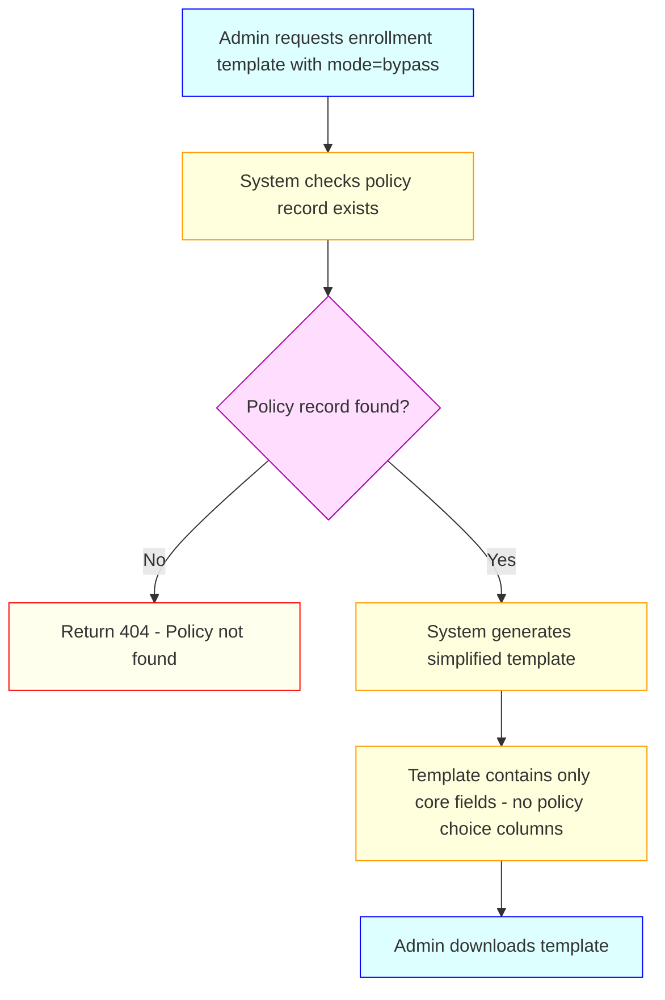
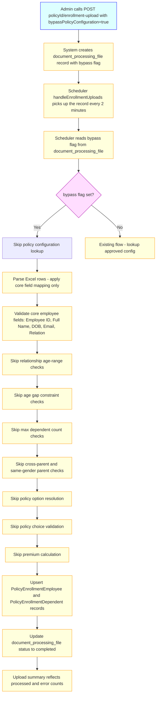

# Enrollment Without Policy Configuration — Business & Functional Requirements

## 1. Purpose

This document defines the business and functional requirements for a new enrollment mode — **Enrollment Without Policy Configuration** — that allows IIRM administrators to upload and enroll employees into a policy without requiring a completed and approved six-stage policy configuration. In this mode, the enrollment template contains standard demographic and identity fields plus a **Total Sum Insured** column (used by downstream claims processes) and a **Premium** column; all policy-configuration-driven validations (age range checks, relationship constraints, policy choice selection, policy option matching) are bypassed. The premium value is entered manually and carries a sign determined by the intake type: **addition rows carry a positive premium** (amount credited/charged) and **deletion rows carry a negative premium** (amount refunded). Both values are stored directly on the enrollment record without any policy-configuration-based computation. The employee enrollment record is still created and the full upload pipeline (template download → Excel fill → upload → scheduler processing) is followed to completion.

---

## 2. Background & Business Motivation

The existing enrollment upload flow (`GET :policyId/enrollment-template` → `POST :policyId/enrollment-upload` → scheduler `processEnrollmentUpload`) is tightly coupled to an approved policy configuration. The scheduler's `processEnrollmentUpload` function:

1. Looks up the **live (approved)** `PolicyConfiguration` record for the policy ID.
2. Reads `relationships.enabledPolicyRelations` and `constraints` from the configuration JSON to drive all validation.
3. Validates dependent age ranges, age gap constraints, max dependent counts, cross-parent rules, and same-gender parent rules from the configuration.
4. Resolves each row to a **policy option** (via the Cartesian-product parameters in Stage 4) and validates the selected **policy choices** (sum insured availability, default flags, contribution values).
5. Runs a premium calculation and writes to the premium calculator output.

There are scenarios where enrollment data must be captured before a policy configuration is finalised, or where the policy is straightforward enough that premium-tier differentiation is not required at upload time. In these cases, the current flow blocks enrollment entirely because no approved configuration exists or the configuration is incomplete.

The new mode removes this blocker by treating the enrollment upload as a **plain data intake** — capturing employee identity and family composition without any policy-configuration-driven business rules.

---

## 3. Scope

### In-Scope

- A new **enrollment mode flag** (`bypassPolicyConfiguration: true`) accepted by the `POST :policyId/enrollment-upload` endpoint.
- A corresponding **simplified enrollment template** (`GET :policyId/enrollment-template?mode=bypass`) that omits all policy-configuration-derived columns (policy choice columns, contribution columns, relationship-group columns derived from Stage 4 parameters) and instead appends two columns at the end: **Total Sum Insured** (a manually entered coverage amount used by downstream claims processes) and **Premium** (a manually entered amount whose sign reflects the intake type — positive for additions, negative for deletions/refunds).
- Modified scheduler processing path in `processEnrollmentUpload` that, when the bypass flag is set, skips:
  - Policy configuration lookup and the "approved configuration not found" guard
  - Relationship age range validation (min age / max age per sub-category from Stage 2)
  - Age gap constraints (`ageGapBetweenParentAndEmployee`, `ageGapBetweenChildrenAndEmployee`)
  - Max dependent count enforcement from the policy configuration
  - Cross-parent and same-gender parent constraint checks
  - Policy option resolution and policy choice validation (Stage 4 / Stage 5 checks)
  - Policy-configuration-based premium computation (`premiumCalculator` invocation)
- The **Total Sum Insured** column value from the uploaded row is read as a plain numeric amount and stored against the enrollment record for use by downstream claims processes.
- The **Premium** column value is read and stored with a sign applied by the scheduler based on the row's intake type: positive for `addition` rows (credited amount) and negative for `deletion` rows (refunded amount). No contribution breakdown, per-mille rate conversion, or pro-ration computation is applied.
- All remaining enrollment steps still execute: file parsing, employee identity validation, dependent row grouping, database upsert of `PolicyEnrollmentEmployee` and `PolicyEnrollmentDependent` records, upload summary generation, and `document_processing_file` status updates.
- The enrollment upload summary (`GET :policyId/enrollment-upload-summary`) continues to reflect processed, error, and skipped record counts.

### Out-of-Scope

- Changes to the six-stage Policy Configurator wizard itself.
- Retroactive application of policy configuration rules to records enrolled via bypass mode.
- Premium calculation or payroll instalment generation for bypass-mode enrollments.
- Endorsement flows (non-financial, asset enrollment) — bypass applies only to the `FINANCIAL_ENDORSEMENT` path of `processEnrollmentUpload`.
- The `updatedProcessEnrollmentUpload` (large-file-handling) path — bypass is not applied to that variant in this release.
- UI changes beyond the template download and upload endpoints.
- Parameter-level `applyToDependents` flag evaluation (Policy Configurator BRD FR-050) — in bypass mode, premiums are entered manually per row in the Excel template (one row per enrolled life). Each row already carries its own `Premium` value, so per-life attribute resolution against policy option bands is neither possible nor required. This flag is not evaluated during bypass-mode scheduler processing.

---

## 4. Stakeholders

- **Primary Users:** IIRM Administrators — HR operations teams who need to onboard employee data before a policy configuration is approved or when premium differentiation is not required.
- **Secondary Users:** Finance Teams — note that premium data will not be populated for bypass-mode enrollments; separate premium data entry will be needed once a configuration is approved.
- **System Actors:** IIRM Policy Service, Scheduler Service (`enrollment-upload.scheduler.ts`), Document Processing Service.

---

## 5. Key Use Cases

### Use Case UC-BYP-001: Download Simplified Enrollment Template

**Description:** Administrator downloads an enrollment Excel template that contains only core demographic and enrollment fields, without any policy-configuration-specific columns.
**Actors:** IIRM Administrator
**Preconditions:** Policy record exists; administrator is authenticated with IIRM Administrator role.
**Main Flow:**



---

### Use Case UC-BYP-002: Upload Enrollment Data Without Policy Configuration

**Description:** Administrator fills the simplified template and uploads it. The scheduler processes the file, creates enrollment records, but skips all policy-configuration-driven validations and premium checks.
**Actors:** IIRM Administrator, Scheduler Service
**Preconditions:** Simplified template has been filled and uploaded as a document; a policy record exists; `bypassPolicyConfiguration: true` is included in the upload request body.
**Main Flow:**



**Validations that remain active in bypass mode:**

| Validation | Retained? | Reason |
|---|---|---|
| Employee ID present | Yes | Identity record cannot be created without it |
| Full Name present | Yes | Mandatory identity field |
| Date of Birth present and valid format | Yes | Required for the enrollment record |
| Email present / valid format | Yes | Required for portal access (auth method dependent) |
| Phone number present | Yes | Required when phone auth method is active |
| Effective date within policy term | Yes | Cannot enroll outside policy period |
| Duplicate Employee ID within upload | Yes | Prevents duplicate record creation |
| Duplicate email within upload | Yes | Prevents duplicate login conflicts |
| Relation field maps to a recognised relation type | Yes | Required to create dependent record correctly |

**Validations skipped in bypass mode:**

| Validation | Skipped | Source in existing code |
|---|---|---|
| Approved policy configuration lookup | Yes | `policyConfigRepo.findOne` with `LIVE` status |
| Dependent min/max age range per sub-category | Yes | Stage 2 `configuredOptions.minAge / maxAge` |
| Age gap between parent and employee | Yes | Stage 6 `ageGapBetweenParentAndEmployee` |
| Age gap between child and employee | Yes | Stage 6 `ageGapBetweenChildrenAndEmployee` |
| Max dependent count per relationship category | Yes | Stage 2 `maxCount` |
| Cross-parent rule (`crossParentsAllowed`) | Yes | Stage 6 constraint |
| Same-gender parent rule | Yes | Stage 6 constraint |
| Policy option resolution (Cartesian product match) | Yes | Stage 4 parameter matching |
| Policy choice availability (`isAvailable`) | Yes | Stage 5 choice validation |
| Policy choice default flag (`isDefault`) | Yes | Stage 5 choice validation |
| Policy-config-derived contribution computation | Yes | Stage 5 `companyContribution / employeeContribution` |
| Policy-configuration-based premium calculation | Yes | `premiumCalculator()` utility |

> **Note — Total Sum Insured & Premium columns:** Although policy-configuration-based computation is skipped, the template includes two manually-entered columns at the end. **Total Sum Insured** stores the coverage amount used by downstream claims processes. **Premium** stores the premium amount with a sign applied by the scheduler based on intake type: `addition` → stored positive (credited), `deletion` → stored negative (refunded). The admin always enters absolute positive numbers; the scheduler handles signing. A non-numeric value in either column triggers a row error; blank or zero is accepted as ₹0.

---

## 6. Functional Requirements

### Template Generation

1. **FR-BYP-001:** The `GET :policyId/enrollment-template` endpoint shall accept an optional query parameter `mode` with value `bypass`. When `mode=bypass` is supplied, the system shall generate a simplified template containing only the following columns, regardless of the policy configuration state:

   | Column | Field | Mandatory | Notes |
   |---|---|---|---|
   | Employee ID | `companyEmployeeId` | Yes | |
   | Full Name | `employeeName` | Yes | |
   | Date of Birth | `dateOfBirth` | Yes | |
   | Gender | `gender` | No | |
   | Email | `email` | Conditional (auth method) | |
   | Mobile Number | `phoneNumber` | Conditional (auth method) | |
   | Relation | `relation` | Yes | |
   | Intake Type | `intakeType` | Yes | Must be `addition` or `deletion` |
   | Effective Date | `effectiveDate` | No | |
   | Marital Status | `maritalStatus` | No | |
   | **Total Sum Insured** | `totalSumInsured` | No | Plain numeric coverage amount (e.g., `500000`); stored as-is; used by claims downstream; blank or zero treated as ₹0 |
   | **Premium** | `premium` | No | Plain numeric amount entered as an **absolute positive value** by the admin; the scheduler automatically applies the sign based on `intakeType` — positive for `addition`, negative for `deletion`; blank or zero treated as ₹0 |

   **Column ordering:** `Total Sum Insured` is the second-to-last column; `Premium` is always the last column in the simplified template.

   **Premium sign convention:** The admin always enters a positive number in the Premium column regardless of intake type. The scheduler is responsible for converting deletion-row premiums to negative values before storing and aggregating them. This avoids admin error from manual sign entry.

2. **FR-BYP-002:** The simplified template shall **not** include any columns derived from the policy configuration: sum insured *option* columns (Stage 1 SI values), policy choice columns, contribution columns, relationship group columns, or parameter-derived columns. The **Total Sum Insured** column in the simplified template is a plain manually-entered coverage amount, not a reference to any policy configuration sum insured option.

3. **FR-BYP-003:** The system shall not require an approved (live) policy configuration to exist in order to generate the simplified template. The only precondition is that a policy record with the given `policyId` exists.

### Upload Endpoint

4. **FR-BYP-004:** The `POST :policyId/enrollment-upload` endpoint shall accept a new optional boolean body field `bypassPolicyConfiguration`. When `true`, the system shall persist this flag on the `document_processing_file` record so it can be read by the scheduler.

5. **FR-BYP-005:** The endpoint shall not require an approved policy configuration to exist when `bypassPolicyConfiguration: true` is supplied. All existing precondition checks for policy configuration approval shall be skipped at the upload queuing stage.

### Scheduler Processing

6. **FR-BYP-006:** The `handleEnrollmentUploads` scheduler cron job shall read the `bypassPolicyConfiguration` flag from the `document_processing_file` record before dispatching to `processEnrollmentUpload`.

7. **FR-BYP-007:** When `bypassPolicyConfiguration` is `true`, `processEnrollmentUpload` shall skip the policy configuration lookup block (the `policyConfigRepo.findOne` call with `LIVE` status check) and proceed without a `config` object.

8. **FR-BYP-008:** In bypass mode, `processEnrollmentUpload` shall use only the basic field mapping (`staticMap` / `targetToPropertyMap`) to parse rows. It shall not attempt to extract or validate policy choice columns from the row data.

9. **FR-BYP-009:** All core employee identity validations listed in UC-BYP-002 (Employee ID, Full Name, DOB, email, phone, effective date range, duplicate checks) shall remain active in bypass mode.

10. **FR-BYP-010:** In bypass mode, the dependent row processing shall still group rows by Employee ID and create `PolicyEnrollmentDependent` records. The `relation` field shall be normalised and stored as-is without cross-referencing the policy configuration's `enabledPolicyRelations`.

11. **FR-BYP-011:** In bypass mode, the scheduler shall skip the policy choice validation loop (the section that resolves the Cartesian-product policy option and checks `isAvailable` / `isDefault` / contribution values per component).

12. **FR-BYP-012:** In bypass mode, the scheduler shall skip the `premiumCalculator()` invocation at the end of `processEnrollmentUpload`. No premium calculation output shall be generated for bypass-mode uploads.

13. **FR-BYP-013:** The `document_processing_file` status update logic (marking the record as `completed`, `failed`, or `partial`) shall function identically in bypass mode. Rows that fail core identity validations shall still be written to the error output.

14. **FR-BYP-014:** The upload summary record (`PolicyEnrollmentUploadSummary`) shall be created for bypass-mode uploads with the same structure as normal uploads. The `premiumCalculated` flag or equivalent field shall be set to `false` to signal that no policy-configuration-based premium computation was performed.

15. **FR-BYP-015-SI:** In bypass mode, the scheduler shall read the **Total Sum Insured** column value from each row and store it on the enrollment record (`bypassSumInsured` field on `PolicyEnrollmentEmployee` / `PolicyEnrollmentDependent`). The following shall apply:
    - A blank or zero value is accepted and stored as `0`; it does not cause a row error.
    - A non-numeric value shall add a validation error to that row (e.g., "Total Sum Insured must be a valid number").
    - The value is stored as-is; no computation is applied.
    - Downstream claims processes shall read `bypassSumInsured` as the effective coverage amount for bypass-enrolled records in the absence of a policy configuration sum insured option.

16. **FR-BYP-016-PREMIUM:** In bypass mode, the scheduler shall read the **Premium** column value from each row, apply a sign based on `intakeType`, and store the signed value on the enrollment record (`bypassPremiumAmount` field). The following shall apply:

    | Intake Type | Admin enters | Scheduler stores | Interpretation |
    |---|---|---|---|
    | `addition` | `1200.00` | `+1200.00` | Premium charged / credited amount |
    | `deletion` | `1200.00` | `−1200.00` | Premium refunded amount |

    - The admin always enters an **absolute positive number** in the Premium column regardless of intake type; the scheduler applies the sign automatically.
    - A blank or zero value is accepted and stored as `0` regardless of intake type; it does not cause a row error.
    - A non-numeric value shall add a validation error to that row (e.g., "Premium must be a valid number").
    - No pro-ration, per-mille rate conversion, per-life multiplication, or contribution split is applied — only the sign is derived by the scheduler.
    - The signed `bypassPremiumAmount` is used when aggregating into `endorsement.grossPremium` (see FR-BYP-END-001) so that deletion refunds reduce the net endorsement total and the CD transaction reflects the correct net movement.

### Data Integrity

17. **FR-BYP-017:** Enrollment records created in bypass mode shall be clearly identifiable in the database. The `document_processing_file` record (or a linked summary record) shall store `bypassPolicyConfiguration: true` so that downstream processes (premium back-fill, audit) can identify these records.

18. **FR-BYP-018:** Bypass-mode enrollment records shall not block a subsequent normal enrollment upload once a policy configuration is approved. The system shall allow re-upload with `bypassPolicyConfiguration: false` (normal mode) to update or supplement the records with policy choice and premium data.

---

## 7. Non-Functional Requirements

### Performance

- **NFR-BYP-001:** Bypass-mode processing shall complete in equal or less time than normal-mode processing for the same number of rows, given that it executes fewer validation and lookup steps.

### Reliability

- **NFR-BYP-002:** Bypass mode shall follow the same transactional and error-isolation behaviour as normal mode. A failure in one employee's row shall not abort processing of subsequent rows.
- **NFR-BYP-003:** The scheduler's 2-minute polling interval and `document_processing_file` locking mechanism shall be unchanged by this feature.

### Security

- **NFR-BYP-004:** Only authenticated users with the IIRM Administrator role shall be permitted to set `bypassPolicyConfiguration: true` in the upload request. The flag shall be rejected with HTTP 403 for non-administrator users.

### Auditability

- **NFR-BYP-005:** Every bypass-mode upload shall be logged with the `bypassPolicyConfiguration: true` marker at both the API layer and the scheduler layer, so that audit trails can distinguish bypass uploads from normal uploads.

---

## 8. Impacted Components & Endpoints

| Component | File | Change Summary |
|---|---|---|
| Policy Controller | `policy-service/.../policy.controller.ts` | Add `bypassPolicyConfiguration` body param to `POST :policyId/enrollment-upload` (line ~3694); add `mode=bypass` query param to `GET :policyId/enrollment-template` (line ~3562) |
| Policy Service | `policy-service/.../policy.service.ts` | Pass `bypassPolicyConfiguration` flag to `createEnrollmentUpload`; persist flag on `document_processing_file`; generate simplified template (with Premium column) when `mode=bypass` |
| Enrollment Upload Scheduler | `scheduler-service/.../enrollment-upload.scheduler.ts` | `handleEnrollmentUploads` (line ~665): read bypass flag before dispatch. `processEnrollmentUpload` (line ~984): add bypass branch to skip config lookup, relationship/age/count/cross-parent checks, policy option resolution, choice validation; replace `premiumCalculator()` call with manual premium aggregation; write aggregated sum to `endorsement.grossPremium` / `netPremium` via `updateEndorsementSummaryAfterEnrollment`. |
| Document Processing File Entity | `service-lib/.../entities/document-processing-file.entity.ts` | Add `bypassPolicyConfiguration: boolean` column (nullable, default `false`) |
| Policy Enrollment Employee Entity | `service-lib/.../entities/policy-enrollment-employee.entity.ts` | Add `bypassPremiumAmount: number` (NUMERIC 19,2, nullable) — signed premium per row; add `bypassSumInsured: number` (NUMERIC 19,2, nullable) — manually entered coverage amount |
| Policy Enrollment Dependent Entity | `service-lib/.../entities/policy-enrollment-dependent.entity.ts` | Add `bypassPremiumAmount: number` (NUMERIC 19,2, nullable) — signed premium per row; add `bypassSumInsured: number` (NUMERIC 19,2, nullable) — manually entered coverage amount |
| Policy Enrollment Upload Summary Entity | `service-lib/.../entities/policy-enrollment-upload-summary.entity.ts` | Add `premiumCalculated: boolean` column (default `true`; set to `false` for bypass uploads) |
| Endorsement Entity | `service-lib/.../entities/endorsement.entity.ts` | No schema change. `grossPremium` / `netPremium` fields populated from manual aggregation instead of `premiumCalculator()` |
| Swagger Metadata | `policy-service/.../policy.swagger.ts` | Document new `bypassPolicyConfiguration` body field and `mode` query param |

---

## 9. Data Flow Comparison

### Current Flow (Normal Mode)

```
Admin → GET enrollment-template (policy config required, includes SI/choice columns)
      → fills template (must select policy options / sum insured)
      → POST enrollment-upload
      → document_processing_file created
      → Scheduler processEnrollmentUpload:
          ├── Lookup approved PolicyConfiguration (fails if none)
          ├── Validate relationships against Stage 2 config
          ├── Validate age gaps against Stage 6 constraints
          ├── Validate max counts against Stage 2 config
          ├── Resolve policy option (Stage 4 Cartesian product)
          ├── Validate policy choices (Stage 5 availability/default/contributions)
          ├── Upsert enrollment records
          └── Run premiumCalculator()
```

### New Flow (Bypass Mode)

```
Admin → GET enrollment-template?mode=bypass (no policy config required)
           Template columns: Employee ID | Full Name | DOB | Gender | Email |
                             Mobile | Relation | Intake Type | Effective Date |
                             Marital Status | Total Sum Insured | Premium
                             (Total Sum Insured = coverage amount for claims downstream)
                             (Premium = absolute positive value; scheduler applies sign:
                              addition → +Premium, deletion → −Premium)
      → fills template (demographic fields + sum insured + premium per row; always enter positive numbers)
      → POST enrollment-upload { bypassPolicyConfiguration: true }
      → document_processing_file created (with bypass flag)
      → Scheduler processEnrollmentUpload:
          ├── [SKIP] Policy configuration lookup
          ├── Validate core identity fields (Employee ID, Name, DOB, Email)
          ├── [SKIP] Relationship age-range validation
          ├── [SKIP] Age gap constraint checks
          ├── [SKIP] Max dependent count checks
          ├── [SKIP] Cross-parent / same-gender parent checks
          ├── [SKIP] Policy option resolution
          ├── [SKIP] Policy choice validation
          ├── Read Total Sum Insured column → store as bypassSumInsured on enrollment record
          ├── Read Premium column → apply sign (addition=+, deletion=−) → store as bypassPremiumAmount
          ├── Upsert enrollment records
          └── [SKIP] premiumCalculator() → replaced by signed-premium aggregation into endorsement
```

---

## 10. Acceptance Criteria

### FR-BYP-001/002/003 — Simplified Template

- AC1: Calling `GET :policyId/enrollment-template?mode=bypass` for a policy with no approved configuration returns a valid Excel file without error.
- AC2: The returned template contains exactly the columns specified in FR-BYP-001 and no policy-choice, sum-insured, or contribution columns.
- AC3: Calling the same endpoint without `mode=bypass` retains the existing behaviour (requiring an approved configuration and including policy-derived columns).

### FR-BYP-004/005 — Upload Endpoint

- AC1: `POST :policyId/enrollment-upload` with `bypassPolicyConfiguration: true` succeeds (HTTP 201) even when no approved policy configuration exists for the policy.
- AC2: The resulting `document_processing_file` record has `bypassPolicyConfiguration = true` stored on it.
- AC3: `POST :policyId/enrollment-upload` without `bypassPolicyConfiguration` (or with `false`) continues to follow the existing flow and fails if no approved configuration exists.

### FR-BYP-006/007/008/009 — Scheduler Core Skipping

- AC1: When the scheduler picks up a bypass-mode `document_processing_file`, it does not throw "Approved policy configuration not found" even when none exists.
- AC2: Rows missing Employee ID, Full Name, or DOB are still rejected with the existing error messages (ER0003, ER0007, ER0008) in bypass mode.
- AC3: A row with an effective date outside the policy term is still rejected in bypass mode (ER0014).

### FR-BYP-010 — Dependent Rows

- AC1: A multi-row upload (Employee row + dependent rows) in bypass mode correctly groups dependents under the employee and creates `PolicyEnrollmentDependent` records.
- AC2: A dependent's relation value is stored without cross-referencing `enabledPolicyRelations` from the policy configuration.

### FR-BYP-011/012 — Policy Choice / Premium Skipping

- AC1: No policy option resolution error occurs in bypass mode when no Stage 4 parameters / Cartesian product data exists.
- AC2: No premium calculator output file is generated for bypass-mode uploads.
- AC3: The upload summary for a bypass upload has `premiumCalculated = false`.

### FR-BYP-015-SI — Total Sum Insured Column

- AC1: The simplified template (`mode=bypass`) contains a `Total Sum Insured` column as the second-to-last column, before `Premium`.
- AC2: A row with a valid numeric Total Sum Insured value (e.g., `500000`) is processed and stored in `bypass_sum_insured` on the enrollment record as-is.
- AC3: A blank or zero Total Sum Insured value is stored as `0` with no row error.
- AC4: A non-numeric Total Sum Insured value (e.g., `"N/A"`) is rejected with a clear validation error (e.g., "Total Sum Insured must be a valid number").
- AC5: The `bypass_sum_insured` value is readable by the claims service without requiring a policy configuration to exist.

### FR-BYP-016-PREMIUM — Signed Manual Premium Column

- AC1: The simplified template (`mode=bypass`) has the `Premium` column as the last column.
- AC2: An `addition` row with Premium `1200.00` is stored as `bypassPremiumAmount = +1200.00`.
- AC3: A `deletion` row with Premium `1200.00` is stored as `bypassPremiumAmount = −1200.00` (scheduler applies the negative sign; admin entered a positive value).
- AC4: A blank or zero Premium value is stored as `0` regardless of intake type; no row error is generated.
- AC5: A non-numeric Premium value (e.g., `"TBD"`) is rejected with a clear validation error (e.g., "Premium must be a valid number").
- AC6: No pro-ration, per-life multiplication, contribution split, or per-mille conversion is applied — only the intake-type sign is applied by the scheduler.

### FR-BYP-013/014/015/016 — Status, Summary, Identity

- AC1: The `document_processing_file` record is marked `completed` after a successful bypass-mode upload.
- AC2: Rows with errors are written to the error output and the `document_processing_file` status reflects `partial` if some rows succeed and some fail.
- AC3: A subsequent normal-mode upload (with an approved policy configuration) for the same policy proceeds without being blocked by existing bypass-mode enrollment records.

### Section 11 — Endorsement Lifecycle Compatibility

**Step Progression (FR-BYP-END-007/008)**
- AC1: After a bypass-mode upload, the endorsement's `currentEndorsementStep` can advance through all six steps (`ENDORSEMENT_REQUEST_RECEIVED` → `CREATE_ENDORSEMENT` → `SEND_ENDORSEMENT_TO_INSURER` → `RECEIVE_INSURER_ACKNOWLEDGEMENT` → `CLIENT_CONFIRMATION` → `TPA_ID_UPLOAD`) without any step being blocked.
- AC2: The `endorsement.endorsementStatus` follows the same lifecycle (created → in-progress → completed) as in normal mode; no new status values are introduced.

**Employee / Dependent Status Transitions (FR-BYP-END-002)**
- AC1: After a successful bypass-mode upload, `policy_employee_endorsement.employeeEndorsementStatusKey = EMPLOYEE_ENDORSEMENT_READY` for all enrolled employees.
- AC2: After a successful bypass-mode upload, `policy_dependent_endorsement.employeeEndorsementStatusKey = EMPLOYEE_ENDORSEMENT_READY` for all enrolled dependents.
- AC3: Status advances (`READY → PROCESSED → … → DOWNLOADED`) occur identically in bypass mode as in normal mode.

**Premium Aggregation into Endorsement (FR-BYP-END-001)**
- AC1: A batch with employee `addition` ₹1200, spouse `addition` ₹600, child `deletion` ₹400 results in `endorsement.grossPremium = +1400.00` and `endorsement.netPremium = +1400.00` (1200 + 600 − 400).
- AC2: A pure-deletion batch with employee `deletion` ₹1200, spouse `deletion` ₹600 results in `endorsement.grossPremium = −1800.00` (refund scenario).
- AC3: Individual signed per-row values are stored in `policy_enrollment_employee.bypass_premium_amount` (positive for additions) and `policy_enrollment_dependent.bypass_premium_amount` (negative for deletions).
- AC4: Individual per-row coverage values are stored in `policy_enrollment_employee.bypass_sum_insured` and `policy_enrollment_dependent.bypass_sum_insured`.
- AC5: No `policy_employee_enrollment_choice` records are inserted for bypass-mode enrolled employees.
- AC6: For a bypass upload where all rows have blank Premium values, `endorsement.grossPremium = 0.00` and the endorsement is still saved without error.

**CD Transaction Integrity (FR-BYP-END-009/010)**
- AC1: For a net-addition batch (`grossPremium = +1400.00`), a `caution_deposit_transaction` record is created with `transactionAmount = +1400.00` (CD balance debited by ₹1400).
- AC2: For a pure-deletion batch (`grossPremium = −1800.00`), a `caution_deposit_transaction` record is created with `transactionAmount = −1800.00` (CD balance credited back by ₹1800).
- AC3: When all Premium values are zero, a `caution_deposit_transaction` record is created with `transactionAmount = 0.00`.

**Policy Choice Table (FR-BYP-END-004/005/006)**
- AC1: Querying `policy_employee_enrollment_choice` for a bypass-enrolled employee returns zero records; this is not treated as a data error by any downstream service.
- AC2: After a subsequent normal-mode re-upload for the same employee (once a policy configuration is approved), `policy_employee_enrollment_choice` records are inserted correctly.

---

## 11. Endorsement Lifecycle Compatibility

This section is the authoritative reference for how bypass-mode enrollment interacts with each endorsement step and each endorsement-related database table. The overarching rule is: **all endorsement step transitions, status progressions, and table writes that exist in normal mode must remain intact in bypass mode**. The only difference is the source of the premium value — manual column instead of `premiumCalculator()`.

---

### 11.1 Endorsement Steps & Bypass Mode Behaviour

The endorsement lifecycle for a `FINANCIAL_ENDORSEMENT` progresses through the following steps (defined in `ENDORSEMENT_STEPS` / `NON_GMC_ENDORSEMENT_TYPES`). Each step's behaviour in bypass mode is defined below.

| # | Step Key | Step Label | Normal Mode Behaviour | Bypass Mode Behaviour |
|---|---|---|---|---|
| 1 | `ENDORSEMENT_REQUEST_RECEIVED` | Request Received | Enrollment upload creates employee and dependent records; sets `policy_employee_endorsement.employeeEndorsementStatusKey = EMPLOYEE_ENDORSEMENT_READY` | **Identical.** Upload still creates `policy_enrollment_employee`, `policy_enrollment_dependent`, `policy_employee_endorsement`, and `policy_dependent_endorsement` records with `READY` status. No change to this step. |
| 2 | `CREATE_ENDORSEMENT` | Create Endorsement | System aggregates enrolled employees/dependents, populates `endorsement.endorsmentCount`, `endorsmentDependentCount`, `employeeEndorsementAdditionCount`, `employeeEndorsementDeletionCount`, `grossPremium`, `netPremium` via `updateEndorsementSummaryAfterEnrollment`. | **Modified.** The endorsement count fields are populated identically. For premium fields: instead of reading computed values from `premiumCalculator()`, the system aggregates the **manually entered Premium column values** per employee/dependent row and writes the sum to `endorsement.grossPremium` and `endorsement.netPremium`. CD transaction is created at this step. See FR-BYP-END-001. |
| 3 | `SEND_ENDORSEMENT_TO_INSURER` | Send to Insurer | Endorsement record (with premium totals) is dispatched to the insurer. Sets employee endorsement status to `EMPLOYEE_ENDORSEMENT_PROCESSED`. | **Identical.** The dispatch logic reads `endorsement.grossPremium` and `endorsement.netPremium` which are now populated from manual premiums. Status transition to `PROCESSED` proceeds as normal. |
| 4 | `RECEIVE_INSURER_ACKNOWLEDGEMENT` | Receive Acknowledgement | Insurer acknowledgement is recorded; employee and dependent endorsement statuses advance to `EMPLOYEE_ENDORSEMENT_ACKNOWLEDGEMENT` → `EMPLOYEE_ENDORSEMENT_ACKNOWLEDGEMENT_PENDING` → `EMPLOYEE_ENDORSEMENT_ACKNOWLEDGED`. | **Identical.** This step reads endorsement record status fields only; it does not depend on how the premium was sourced. |
| 5 | `CLIENT_CONFIRMATION` | Client Confirmation | HR/client reviews and confirms the acknowledged enrollment data. No scheduler action — a user action that updates endorsement status. | **Identical.** Confirmation step operates on enrollment records already in the database; bypass mode does not alter the data shape of those records. |
| 6 | `TPA_ID_UPLOAD` | TPA ID Upload | TPA IDs are uploaded against enrolled members; status advances to `EMPLOYEE_ENDORSEMENT_TPA_ACKNOWLEDGED` → `EMPLOYEE_ENDORSEMENT_DOWNLOADED`. | **Identical.** TPA ID upload is independent of premium computation. |

---

### 11.2 Employee & Dependent Endorsement Status Transitions

The status transitions on `policy_employee_endorsement.employeeEndorsementStatusKey` and `policy_dependent_endorsement.employeeEndorsementStatusKey` must follow the same sequence in bypass mode as in normal mode:

```
EMPLOYEE_ENDORSEMENT_READY
  → (after Step 4: Send to Insurer)
EMPLOYEE_ENDORSEMENT_PROCESSED
  → (after Step 5: Acknowledgement received)
EMPLOYEE_ENDORSEMENT_ACKNOWLEDGEMENT
  → EMPLOYEE_ENDORSEMENT_ACKNOWLEDGEMENT_PENDING
  → EMPLOYEE_ENDORSEMENT_ACKNOWLEDGED
  → (after Step 6: TPA ID upload)
EMPLOYEE_ENDORSEMENT_TPA_ACKNOWLEDGED
  → EMPLOYEE_ENDORSEMENT_DOWNLOADED
```

**FR-BYP-END-002:** The scheduler shall set `employeeEndorsementStatusKey = EMPLOYEE_ENDORSEMENT_READY` on both `policy_employee_endorsement` and `policy_dependent_endorsement` records created during a bypass-mode upload, identical to normal mode behaviour.

---

### 11.3 Database Table Write Matrix

The table below maps every endorsement-related table to what is written in normal mode vs bypass mode. A `✓` means the write happens identically. A `△` means the write happens but with a different value source. A `✗` means the write is skipped and the reason.

| Table | Written in Normal Mode | Written in Bypass Mode | Notes |
|---|---|---|---|
| `document_processing_file` | Status updates (`pending → processing → completed/failed`) | `✓` Identical + `bypassPolicyConfiguration = true` stored | New column required |
| `policy_enrollment_employee` | Employee identity + enrollment dates upserted | `✓` Identical | No change |
| `policy_enrollment_dependent` | Dependent identity + relation + endorsement ID upserted | `✓` Identical | No change |
| `policy_employee_endorsement` | INSERT/UPDATE with `endorsementId`, `employeeEndorsementStatusKey = READY`, file IDs | `✓` Identical | Status transition chain preserved |
| `policy_dependent_endorsement` | INSERT/UPDATE with `endorsementId`, `employeeEndorsementStatusKey = READY` | `✓` Identical | Status transition chain preserved |
| `policy_enrollment_employee_policy_map` | Links employee to policy with `enrollmentAdditionBatchId`, `effectiveDate`, `enrollmentEndDate` | `✓` Identical | Batch tracking preserved |
| `policy_employee_enrollment` | Main enrollment record per employee-policy pair | `✓` Identical | |
| `policy_enrollment_employee` / `policy_enrollment_dependent` (`bypassSumInsured`) | Not present in normal mode | `△` New column; stores the manually entered Total Sum Insured per row. Used by downstream claims processes as the effective coverage amount. | Migration required |
| `policy_employee_enrollment_choice` | Coverage selections (sum insured, component, policy option) | `✗` Skipped — no policy configuration choices available. `bypassSumInsured` and signed `bypassPremiumAmount` serve as the coverage and premium reference. | No records inserted for bypass enrollees |
| `endorsement` (`endorsmentCount`, `endorsmentDependentCount`, `employeeEndorsementAdditionCount`, `employeeEndorsementDeletionCount`) | Populated by `updateEndorsementSummaryAfterEnrollment` | `✓` Identical — counts are derived from uploaded rows, not from policy config | |
| `endorsement` (`grossPremium`, `netPremium`) | Computed by `premiumCalculator()` using policy choices and contribution rates | `△` Aggregated from **signed** `bypassPremiumAmount` values: addition rows contribute positive amounts, deletion rows contribute negative amounts. Net sum written to both fields. | See FR-BYP-END-001; deletion refunds correctly reduce the net total |
| `endorsement` (`basicPremium`, `gstAmount`, brokerage fields) | Computed from policy configuration rates during premium calculation | `✗` Skipped — not applicable without a policy configuration. Fields left at null / 0. | |
| `caution_deposit_transaction` | CD deduction created when endorsement is finalised | `△` CD transaction created using the **net** aggregated `grossPremium` (additions minus deletion refunds) at the `CREATE_ENDORSEMENT` step. Net amount may be positive (net addition) or negative (net deletion/refund). | Ensures CD balance reflects actual net movement |
| `policy_enrollment_upload_summary` | Upload counts + `premiumCalculated = true` | `✓` Identical counts + `premiumCalculated = false` flag | New column required |

---

### 11.4 Premium Aggregation into Endorsement Tables (FR-BYP-END-001)

In normal mode, `premiumCalculator()` (invoked at the end of `processEnrollmentUpload`) reads enrolled records and policy configuration contribution rates, computes totals, and writes to `endorsement.grossPremium` / `endorsement.netPremium`.

In bypass mode, this is replaced by a **signed manual premium aggregation step** executed at the end of `processEnrollmentUpload` (in place of the `premiumCalculator()` call):

1. For each successfully processed row the scheduler determines the sign from `intakeType`:
   - `addition` rows → premium stored as a **positive** value (`bypassPremiumAmount = +amount`)
   - `deletion` rows → premium stored as a **negative** value (`bypassPremiumAmount = −amount`)
2. After all rows are upserted, the scheduler computes: `netPremium = SUM(bypassPremiumAmount)` across all non-error rows in the batch. Addition premiums add to the total; deletion premiums (refunds) reduce it.
3. The net sum is written to `endorsement.grossPremium` and `endorsement.netPremium` via `updateEndorsementSummaryAfterEnrollment`.
4. `endorsement.premiumAtInception` is also set to the net sum if the endorsement is flagged as inception (`isInception = true`).
5. The signed per-row value is stored in the new `bypass_premium_amount` column on `policy_enrollment_employee` / `policy_enrollment_dependent` for audit and future back-fill.

```
Bypass-mode premium flow (mixed addition + deletion batch):

  Excel row (Self,   addition) → admin enters 1200.00 → stored as +1200.00
  Excel row (Spouse, addition) → admin enters  600.00 → stored as  +600.00
  Excel row (Child,  deletion) → admin enters  400.00 → stored as  −400.00

  Net sum = +1200.00 + 600.00 − 400.00 = +1400.00

  → endorsement.grossPremium = 1400.00
  → endorsement.netPremium   = 1400.00
  → caution_deposit_transaction.transactionAmount = 1400.00  (net debit at CREATE_ENDORSEMENT)

  Pure-deletion batch example:
  Excel row (Self,   deletion) → admin enters 1200.00 → stored as −1200.00
  Excel row (Spouse, deletion) → admin enters  600.00 → stored as  −600.00

  Net sum = −1800.00
  → endorsement.grossPremium = −1800.00   (refund / credit back to CD balance)
  → caution_deposit_transaction.transactionAmount = −1800.00
```

**FR-BYP-END-003:** Two new columns shall be added to both `policy_enrollment_employee` and `policy_enrollment_dependent`:
- `bypass_premium_amount` (NUMERIC 19,2, nullable) — signed premium per row; positive for additions, negative for deletions. `null` for records created through normal mode.
- `bypass_sum_insured` (NUMERIC 19,2, nullable) — manually entered Total Sum Insured. `null` for records created through normal mode.

---

### 11.5 Policy Choice Table Handling (policy_employee_enrollment_choice)

In normal mode, `policy_employee_enrollment_choice` stores the sum insured selection and contribution breakdown per component per employee. This is populated from the policy configuration choices (Stage 5).

In bypass mode, no policy configuration choices are available. The following rules apply:

- **FR-BYP-END-004:** No records shall be inserted into `policy_employee_enrollment_choice` during a bypass-mode upload. The table is left empty for those enrollment records.
- **FR-BYP-END-005:** Downstream processes that read `policy_employee_enrollment_choice` (e.g., premium reports, CD balance displays) shall treat a missing choice record for a bypass-enrolled employee as "bypass mode — premium sourced from `bypass_premium_amount`, coverage from `bypass_sum_insured`" rather than as a data error.
- **FR-BYP-END-006:** When a policy configuration is later approved and a re-upload is performed in normal mode, the normal-mode upload shall insert the appropriate `policy_employee_enrollment_choice` records for those employees, overwriting the bypass-mode state.

---

### 11.6 Endorsement Step Progression — No Blocking Condition

**FR-BYP-END-007:** No endorsement step transition (Steps 1–6) shall be blocked purely because the enrollment records were created in bypass mode. The `currentEndorsementStep` field on the `endorsement` table shall advance through all steps identically. The only difference is the source of premium data; the step state machine itself is unchanged.

**FR-BYP-END-008:** The `endorsement.endorsementStatus` field shall follow the same status lifecycle as in normal mode (created → in-progress → completed). Bypass mode introduces no new endorsement statuses.

---

### 11.7 Caution Deposit (CD) Transaction Integrity

**FR-BYP-END-009:** When the endorsement advances to the `CREATE_ENDORSEMENT` step, a `caution_deposit_transaction` record shall be created with `transactionAmount = endorsement.grossPremium` (the net signed aggregated premium — positive for net additions, negative for net deletions/refunds). A positive transaction amount debits the CD balance; a negative transaction amount credits it back. This ensures the CD ledger reflects the correct net premium movement regardless of whether the premium was computed by policy configuration or entered manually.

**FR-BYP-END-010:** If `endorsement.grossPremium` is zero (all rows had blank/zero Premium values, or addition and deletion premiums cancel out exactly), the CD transaction shall still be created with `transactionAmount = 0`. This preserves the audit trail for the endorsement.

---

## 12. Assumptions & Dependencies

- **ASM-BYP-001:** The `document_processing_file`, `policy_enrollment_employee`, and `policy_enrollment_dependent` table schemas can accommodate the new nullable columns described in this document without requiring a breaking migration.
- **ASM-BYP-002:** Bypass-mode enrollment records are treated as provisional. A separate back-fill process (TBD) will insert `policy_employee_enrollment_choice` records and recompute `endorsement.grossPremium` / `netPremium` using policy config contribution rates once a configuration is approved.
- **ASM-BYP-003:** The `relation` field in the simplified template will accept all standard relation values (Self, Husband, Wife, Son, Daughter, Father, Mother, etc.) and the scheduler will normalise them in the same way as normal mode.
- **ASM-BYP-004:** The bypass flag applies only to the `FINANCIAL_ENDORSEMENT` processing path (`processEnrollmentUpload`). Non-financial and asset enrollment paths are unchanged.
- **ASM-BYP-005:** Setting `endorsement.netPremium = endorsement.grossPremium` (no GST/brokerage split) in bypass mode is acceptable as a provisional state until a policy configuration is available.
- **ASM-BYP-006:** The `applyToDependents` flag introduced on Stage 4 parameters (Policy Configurator BRD FR-050) has no effect in bypass mode. Bypass-mode premiums are manually entered per enrolment row; the scheduler stores them as-is without evaluating any per-dependent attribute band matching. If a policy later receives an approved configuration with `applyToDependents: true` parameters, a normal-mode re-upload is required for correct per-life premium resolution (per ASM-BYP-002).
- **DEP-BYP-001:** Database migration required to add the following columns:
  - `bypass_policy_configuration` (boolean, default `false`) → `document_processing_file`
  - `premium_calculated` (boolean, default `true`) → `policy_enrollment_upload_summary`
  - `bypass_premium_amount` (NUMERIC 19,2, nullable) → `policy_enrollment_employee` — signed: positive for additions, negative for deletions
  - `bypass_premium_amount` (NUMERIC 19,2, nullable) → `policy_enrollment_dependent` — signed: positive for additions, negative for deletions
  - `bypass_sum_insured` (NUMERIC 19,2, nullable) → `policy_enrollment_employee` — manually entered coverage amount for claims
  - `bypass_sum_insured` (NUMERIC 19,2, nullable) → `policy_enrollment_dependent` — manually entered coverage amount for claims

---

## 13. Open Questions

| # | Question | Owner | Status |
|---|---|---|---|
| OQ-BYP-001 | Should bypass-mode uploads be restricted to specific endorsement types (e.g., inception only), or available for all enrollment windows? | Product | Open |
| OQ-BYP-002 | Once a policy configuration is approved, should the system automatically trigger a back-fill job to insert `policy_employee_enrollment_choice` records and recompute `endorsement.grossPremium` / `netPremium` using policy config rates? | Product / Engineering | Open |
| OQ-BYP-003 | Should the HR portal UI expose a "bypass mode" toggle when initiating an enrollment upload, or should this be an admin-only API-level flag? | Product / UX | Open |
| OQ-BYP-004 | When `grossPremium` is sourced from manual entries in bypass mode, should the existing CD balance checks (`caution_deposit_transaction` balance available) still gate the `CREATE_ENDORSEMENT` step, or should that check be relaxed for bypass-mode endorsements? | Finance / Product | Open |
| OQ-BYP-005 | Should the GST fields (`endorsement.gstAmount`, `showGstToEmployee`) be left at zero/null in bypass mode, or derived from a flat GST rate applied to the manual premium total? | Finance / Product | Open |
| OQ-BYP-006 | Should the large-file-handling path (`updatedProcessEnrollmentUpload`, enabled via `ENABLE_LARGE_FILE_HANDLING`) also support bypass mode in a future release? | Engineering | Open |
| OQ-BYP-007 | Should downstream premium reports and the premium calculator Excel output show a "bypass — manual premium" label for bypass-mode endorsements, or be excluded entirely until a policy configuration is back-filled? | Finance / Product | Open |

---

*Document generated: 07 May 2026*
