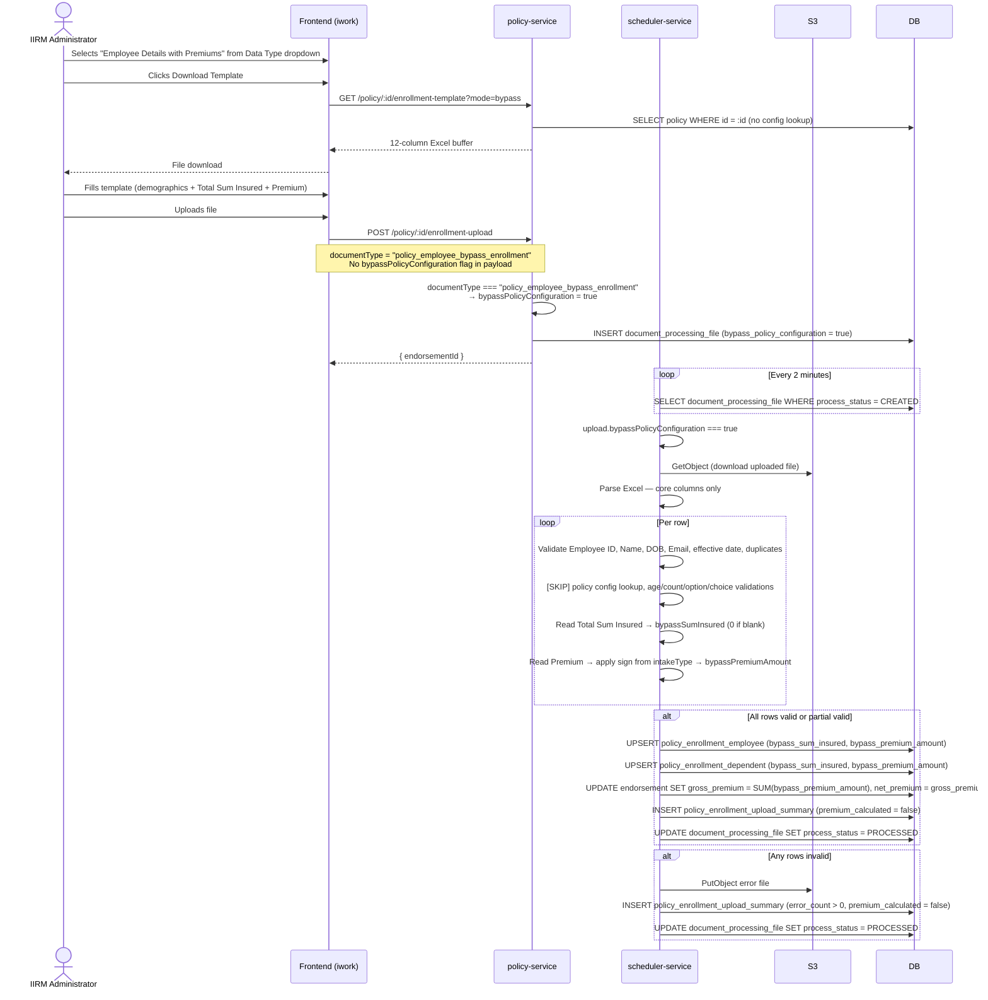

# Enrollment Without Policy Configuration — Technical Specification

**Feature:** Enrollment Without Policy Configuration (Bypass Mode)
**BRD Reference:** Enrollment-Without-Policy-Configuration-BRD.md
**Date:** 2026-05-07
**Status:** Draft

---

## 1. Overview

This document describes the technical design and implementation plan for the Enrollment Without Policy Configuration feature. It translates every BRD requirement into concrete code changes across the database, backend services, scheduler, and frontend layers.

### 1.1 High-Level Architecture

```
┌─────────────────────────────────────────────────────────────────┐
│  Frontend (apps/ui/iwork)                                       │
│                                                                 │
│  Endorsement Data Upload page — Group Policy                    │
│  "Data Type" dropdown gains a third option:                     │
│    1. Employee + Dependents Data with Insurance Benefits        │
│    2. Only Employee Data                                        │
│    3. Employee Details with Premiums  ← NEW (bypass mode)      │
│                                                                 │
│  When "Employee Details with Premiums" is selected:             │
│    • Download Template hits ?mode=bypass endpoint              │
│    • Upload POST automatically carries bypassPolicyConfig=true  │
└───────────────────────┬─────────────────────────────────────────┘
                        │ REST
┌───────────────────────▼─────────────────────────────────────────┐
│  policy-service (apps/services/policy-service)                  │
│    GET  /policy/:policyId/enrollment-template?mode=bypass       │
│         → returns simplified 12-column template                 │
│         → no approved policy configuration required             │
│    POST /policy/:policyId/enrollment-upload                     │
│         { documentType: "policy_employee_bypass_enrollment" }   │
│         → backend derives bypassPolicyConfiguration = true      │
│            from documentType; persists on document_processing_file
└───────────────────────┬─────────────────────────────────────────┘
                        │ DocumentProcessingFile (bypass_policy_configuration = true)
┌───────────────────────▼─────────────────────────────────────────┐
│  scheduler-service (apps/services/scheduler-service)            │
│    handleEnrollmentUploads() — reads bypass flag before dispatch│
│    processEnrollmentUpload(upload, bypassMode)                  │
│      bypassMode=false → existing flow (policy config required)  │
│      bypassMode=true  → bypass path:                            │
│        1. [SKIP] policy config lookup                           │
│        2. Parse core fields only (staticMap)                    │
│        3. Core identity validations only                        │
│        4. [SKIP] all policy-config-driven validations           │
│        5. Read Total Sum Insured + Premium columns per row      │
│        6. Apply sign from intakeType → bypassPremiumAmount      │
│        7. Upsert enrollment records (with bypass columns)       │
│        8. Aggregate signed premiums → endorsement.grossPremium  │
│        9. [SKIP] premiumCalculator()                            │
└───────────────────────┬─────────────────────────────────────────┘
                        │
┌───────────────────────▼─────────────────────────────────────────┐
│  Database (PostgreSQL)                                          │
│    document_processing_file       (existing, +1 column)         │
│    policy_enrollment_employee     (existing, +2 columns)        │
│    policy_enrollment_dependent    (existing, +2 columns)        │
│    policy_enrollment_upload_summary (existing, +1 column)       │
│    endorsement                    (existing, no schema change)  │
└─────────────────────────────────────────────────────────────────┘
```

### 1.2 Key Architectural Decisions

| Decision | Choice | Rationale |
|---|---|---|
| Bypass trigger (UI) | New "Employee Details with Premiums" dropdown option; no separate boolean toggle exposed to user | Consistent with how the existing two options work; the doc-type selection implicitly controls the entire flow |
| `bypassPolicyConfiguration` derivation | Backend derives flag from `documentType === "policy_employee_bypass_enrollment"` inside `createEnrollmentUpload`; no separate body field required | Keeps the API surface clean; avoids an extra boolean that could be set inconsistently |
| Bypass flag storage | New boolean column `bypass_policy_configuration` on `document_processing_file` | Flag persists until scheduler picks up the record; distinguishes bypass from normal uploads in audit |
| Template endpoint | Same `GET :policyId/enrollment-template` with `?mode=bypass` query param | Single URL pattern; frontend appends param based on selected doc type |
| Premium signing | Scheduler applies sign from `intakeType`; admin always enters positive numbers | Prevents admin entry error; sign logic is deterministic and code-auditable |
| Premium aggregation | Sum of signed `bypass_premium_amount` per batch → `endorsement.grossPremium` / `netPremium` | Reuses existing `updateEndorsementSummaryAfterEnrollment` call; no new endorsement fields needed |
| Policy-choice table | No `policy_employee_enrollment_choice` records inserted | No policy configuration choices exist; `bypass_sum_insured` + `bypass_premium_amount` serve as coverage/premium reference |
| Large-file path | Bypass not applied to `updatedProcessEnrollmentUpload` in this release | Out of scope per BRD |

---

## 2. Database Changes

### 2.1 New Columns — Migration

**Path:** `database-migrations/AddBypassEnrollmentColumns<timestamp>.ts`

```typescript
import { MigrationInterface, QueryRunner } from "typeorm";

export class AddBypassEnrollmentColumns1715088000000 implements MigrationInterface {
  public async up(queryRunner: QueryRunner): Promise<void> {
    // document_processing_file
    await queryRunner.query(`
      ALTER TABLE document_processing_file
        ADD COLUMN IF NOT EXISTS bypass_policy_configuration BOOLEAN NOT NULL DEFAULT FALSE
    `);

    // policy_enrollment_employee
    await queryRunner.query(`
      ALTER TABLE policy_enrollment_employee
        ADD COLUMN IF NOT EXISTS bypass_premium_amount NUMERIC(19,2) NULL,
        ADD COLUMN IF NOT EXISTS bypass_sum_insured    NUMERIC(19,2) NULL
    `);

    // policy_enrollment_dependent
    await queryRunner.query(`
      ALTER TABLE policy_enrollment_dependent
        ADD COLUMN IF NOT EXISTS bypass_premium_amount NUMERIC(19,2) NULL,
        ADD COLUMN IF NOT EXISTS bypass_sum_insured    NUMERIC(19,2) NULL
    `);

    // policy_enrollment_upload_summary
    await queryRunner.query(`
      ALTER TABLE policy_enrollment_upload_summary
        ADD COLUMN IF NOT EXISTS premium_calculated BOOLEAN NOT NULL DEFAULT TRUE
    `);
  }

  public async down(queryRunner: QueryRunner): Promise<void> {
    await queryRunner.query(`
      ALTER TABLE document_processing_file DROP COLUMN IF EXISTS bypass_policy_configuration
    `);
    await queryRunner.query(`
      ALTER TABLE policy_enrollment_employee
        DROP COLUMN IF EXISTS bypass_premium_amount,
        DROP COLUMN IF EXISTS bypass_sum_insured
    `);
    await queryRunner.query(`
      ALTER TABLE policy_enrollment_dependent
        DROP COLUMN IF EXISTS bypass_premium_amount,
        DROP COLUMN IF EXISTS bypass_sum_insured
    `);
    await queryRunner.query(`
      ALTER TABLE policy_enrollment_upload_summary
        DROP COLUMN IF EXISTS premium_calculated
    `);
  }
}
```

### 2.2 Modified Entity: `DocumentProcessingFile`

**File:** [document-processing-file.entity.ts](apps/services/service-lib/src/lib/entities/document-processing-file.entity.ts)

Add one column after the existing `updatedBy` column:

```typescript
@Column({
  name: "bypass_policy_configuration",
  type: "boolean",
  default: false,
  nullable: false,
})
bypassPolicyConfiguration!: boolean;
```

### 2.3 Modified Entity: `PolicyEnrollmentEmployee`

**File:** [policy-enrollment-employee.entity.ts](apps/services/service-lib/src/lib/entities/policy-enrollment-employee.entity.ts)

Add two columns after the existing `additionalParams` column:

```typescript
@Column({ name: "bypass_premium_amount", type: "numeric", precision: 19, scale: 2, nullable: true })
bypassPremiumAmount?: number | null;

@Column({ name: "bypass_sum_insured", type: "numeric", precision: 19, scale: 2, nullable: true })
bypassSumInsured?: number | null;
```

### 2.4 Modified Entity: `PolicyEnrollmentDependent`

**File:** [policy-enrollment-dependent.entity.ts](apps/services/service-lib/src/lib/entities/policy-enrollment-dependent.entity.ts)

Add two columns after the existing `endorsementStatusKey` column:

```typescript
@Column({ name: "bypass_premium_amount", type: "numeric", precision: 19, scale: 2, nullable: true })
bypassPremiumAmount?: number | null;

@Column({ name: "bypass_sum_insured", type: "numeric", precision: 19, scale: 2, nullable: true })
bypassSumInsured?: number | null;
```

### 2.5 Modified Entity: `PolicyEnrollmentUploadSummary`

**File:** [policy-enrollment-upload-summary.entity.ts](apps/services/service-lib/src/lib/entities/policy-enrollment-upload-summary.entity.ts)

Add one column after `endorsementId`:

```typescript
@Column({ name: "premium_calculated", type: "boolean", default: true, nullable: false })
premiumCalculated!: boolean;
```

---

## 3. Backend — policy-service

### 3.1 Controller Changes

**File:** [policy.controller.ts](apps/services/policy-service/src/app/policy/policy.controller.ts)

#### Change 1 — `GET :policyId/enrollment-template` (line ~3562)

Add optional `mode` query parameter:

```typescript
@Get(":policyId/enrollment-template")
@generateTemplateSwaggerMetadata()
async getEnrollmentTemplate(
  @Param("policyId", ParseIntPipe) policyId: number,
  @Query("mode") mode: string | undefined,   // ← new
  @Res() res: Response,
): Promise<Response> {
  try {
    if (!policyId) throw new Error("Policy ID is required.");
    const result = mode === "bypass"
      ? await this.policyService.generateBypassTemplate(policyId)    // ← new branch
      : await this.policyService.generateDownloadableTemplate(policyId);
    return res.status(HttpStatus.OK).json(createResponse(HttpStatus.OK, "Template generated", result));
  } catch (error) {
    return res.status(HttpStatus.BAD_REQUEST).json(
      createErrorResponse(HttpStatus.BAD_REQUEST, error instanceof Error ? error.message : "Failed to generate template.")
    );
  }
}
```

#### Change 2 — `POST :policyId/enrollment-upload` (line ~3694)

No new body parameters are needed. `bypassPolicyConfiguration` is derived from `documentType` in the service layer (see §3.2). The controller signature is unchanged:

```typescript
@Post(":policyId/enrollment-upload")
@queueEnrollmentUploadSwaggerMetadata()
async queueEnrollmentUpload(
  @Req() req: Request,
  @Param("policyId", ParseIntPipe) policyId: number,
  @Body("documentId", ParseIntPipe) documentId: number,
  @Body("documentType") documentType: string,        // "policy_employee_bypass_enrollment" triggers bypass
  @Res() res: Response,
  @Body("employeeCount", new ParseIntPipe({ optional: true })) employeeCount?: number,
  @Body("dependentCount", new ParseIntPipe({ optional: true })) dependentCount?: number,
  @Body("endorsementId", new ParseIntPipe({ optional: true })) endorsementId?: number,
  @Body("osTicketNumber") osTicketNumber?: string,
  @Body("endorsementType") endorsementType?: string,
  @Body("endorsementEntryDate") endorsementEntryDate?: string,
  @Body("enrollmentStartDate") enrollmentStartDate?: string,
  @Body("enrollmentEndDate") enrollmentEndDate?: string,
  @Body("isInception") isInception?: boolean,
): Promise<Response>
```

### 3.2 Service Changes

**File:** [policy.service.ts](apps/services/policy-service/src/app/policy/policy.service.ts)

#### Change 1 — New method `generateBypassTemplate`

Add after `generateDownloadableTemplate`:

```typescript
async generateBypassTemplate(policyId: number) {
  const policy = await this.policyRepository.findPolicyById(policyId);
  if (!policy) throw new NotFoundException(`Policy not found for ID ${policyId}`);
  return this.policyRepository.generateBypassEnrollmentTemplate(policyId);
}
```

#### Change 2 — Modify `createEnrollmentUpload` (line ~5432)

Derive `bypassPolicyConfiguration` from `documentType` before passing to the repository:

```typescript
async createEnrollmentUpload(
  policyId: number,
  userId: number,
  documentId: number,
  documentType: string,
  employeeCount: number = 0,
  dependentCount: number = 0,
  endorsementId?: number,
  osTicketNumber?: string,
  endorsementType?: string,
  endorsementEntryDate?: string,
  enrollmentStartDate?: string,
  enrollmentEndDate?: string,
  isInception: boolean = false,
) {
  // Derive bypass flag from document type — no extra body param needed
  const bypassPolicyConfiguration =
    documentType === "policy_employee_bypass_enrollment";  // ← new

  // ... existing log ...
  return this.policyRepository.createEnrollmentUpload(
    policyId, userId, documentId, documentType,
    employeeCount, dependentCount, endorsementId,
    osTicketNumber, endorsementType, endorsementEntryDate,
    enrollmentStartDate, enrollmentEndDate, isInception,
    bypassPolicyConfiguration,  // ← new, passed to repository
  );
}
```

### 3.3 Repository Changes

**File:** `apps/services/policy-service/src/app/policy/policy.repository.ts`

#### Change 1 — `createEnrollmentUpload`

Accept `bypassPolicyConfiguration` as the last parameter and persist it on the `DocumentProcessingFile` record:

```typescript
async createEnrollmentUpload(
  // ... existing params ...
  bypassPolicyConfiguration: boolean = false,   // ← new last param
) {
  // ... existing DocumentProcessingFile construction ...
  documentProcessingFile.bypassPolicyConfiguration = bypassPolicyConfiguration;
  await this.documentProcessingFileRepo.save(documentProcessingFile);
  // ... rest unchanged ...
}
```

#### Change 2 — New method `generateBypassEnrollmentTemplate`

```typescript
async generateBypassEnrollmentTemplate(policyId: number): Promise<Buffer> {
  const workbook = new ExcelJS.Workbook();
  const sheet = workbook.addWorksheet("Enrollment");

  const headers = [
    "Employee ID",
    "Full Name",
    "Date of Birth",
    "Gender",
    "Email",
    "Mobile Number",
    "Relation",
    "Intake Type",
    "Effective Date",
    "Marital Status",
    "Total Sum Insured",
    "Premium",
  ];

  sheet.addRow(headers);
  sheet.getRow(1).font = { bold: true };
  sheet.getRow(1).fill = { type: "pattern", pattern: "solid", fgColor: { argb: "FFD9E1F2" } };

  // Hint row
  sheet.addRow([
    "", "", "DD/MM/YYYY", "Male/Female", "", "",
    "Self/Husband/Wife/Son/Daughter/Father/Mother",
    "addition/deletion", "DD/MM/YYYY", "",
    "e.g. 500000",
    "Absolute positive value; sign applied automatically",
  ]);

  headers.forEach((_, i) => { sheet.getColumn(i + 1).width = 24; });

  return workbook.xlsx.writeBuffer() as Promise<Buffer>;
}
```

---

## 4. Frontend — apps/ui/iwork

The bypass enrollment mode is surfaced as a **third option in the existing "Data Type" dropdown** on the Endorsement Data Upload page for group policies. No new page or standalone toggle is introduced. All existing form fields (including `noOfEmployees` and `noOfDependents`) remain visible and behave identically to the other group-policy doc types.

### 4.1 New Constant

**File:** [apps/ui/iwork/src/app/constants/index.ts](apps/ui/iwork/src/app/constants/index.ts)

Add after the existing `ENROLLMENT_TEMP_NUM = 654321`:

```typescript
// Unique numeric key for bypass enrollment (Employee Details with Premiums)
export const BYPASS_ENROLLMENT_TEMP_NUM = 789013;
```

> `TEMP_NUM = 123456`, `ENROLLMENT_TEMP_NUM = 654321`, `BYPASS_ENROLLMENT_TEMP_NUM = 789013`  
> (789012 is reserved for Policy Extension per that feature's spec.)

### 4.2 `endorsementDocTypeMap.ts` — Add `policy_employee_bypass_enrollment`

**File:** [endorsementDocTypeMap.ts](apps/ui/iwork/src/app/pages/EndorsementPage/utils/endorsementDocTypeMap.ts)

#### Change 1 — Extend `DocTypeKey` union

```typescript
export type DocTypeKey =
  | "policy_employee_enrollment_data"
  | "policy_employee_data"
  | "policy_employee_dependent_data"
  | "policy_employee_data_with_benefits"
  | "policy_asset_enrollment_data"
  | "policy_employee_bypass_enrollment";   // ← new
```

#### Change 2 — Add map entry

```typescript
policy_employee_bypass_enrollment: {
  label: "Employee Details with Premiums",
  download: (id) => endPoints.downloadBypassEnrollmentTemplate(id),
  process: (id) => endPoints.processEmployeeData(id),   // same POST endpoint
},
```

### 4.3 `endPoints.ts` — Add Bypass Template Download Function

**File:** [apps/ui/ui-lib/src/lib/constants/endPoints.ts](apps/ui/ui-lib/src/lib/constants/endPoints.ts)

Add after `downloadEmployeeEnrollmentTemplate` (line ~802):

```typescript
downloadBypassEnrollmentTemplate: (policyId: number) =>
  environment.policyUrl + `/policy/${policyId}/enrollment-template?mode=bypass`,
```

### 4.4 `config.ts` — Add "Employee Details with Premiums" Option

**File:** [config.ts](apps/ui/iwork/src/app/pages/EndorsementPage/EndorsementDataUpload/config.ts)

#### Change 1 — Import new constant

```typescript
import { BYPASS_ENROLLMENT_TEMP_NUM, ENROLLMENT_TEMP_NUM, TEMP_NUM } from "../../../constants";
```

#### Change 2 — Add dropdown option

```typescript
options: [
  {
    value: TEMP_NUM,
    label: "Employee + Dependents Data with Insurance Benefits",
  },
  {
    label: "Only Employee Data",
    value: ENROLLMENT_TEMP_NUM,
  },
  {
    label: "Employee Details with Premiums",   // ← new
    value: BYPASS_ENROLLMENT_TEMP_NUM,
  },
],
```

### 4.5 `EndorsementDataUploadPage.tsx` — Wire Up Bypass Type

**File:** [EndorsementDataUploadPage.tsx](apps/ui/iwork/src/app/pages/EndorsementPage/EndorsementDataUpload/EndorsementDataUploadPage.tsx)

#### Change 1 — Import new constant

```typescript
import {
  DATA_UPLOAD,
  ENDORSEMENT_TOASTS,
  ENROLLMENT_TEMP_NUM,
  BYPASS_ENROLLMENT_TEMP_NUM,   // ← new
  TEMP_NUM,
} from "../../../constants";
```

#### Change 2 — Extend `docTypeMap` for group policies

```typescript
const docTypeMap = useMemo<Record<string | number, DocTypeKey>>(
  () =>
    isGroupPolicyType
      ? {
          [TEMP_NUM]:                  "policy_employee_enrollment_data",
          [ENROLLMENT_TEMP_NUM]:       "policy_employee_data",
          [BYPASS_ENROLLMENT_TEMP_NUM]: "policy_employee_bypass_enrollment",  // ← new
        }
      : { [TEMP_NUM]: "policy_asset_enrollment_data" },
  [isGroupPolicyType]
);
```

#### Change 3 — Upload payload: no special count handling

No changes to the counts or upload payload construction are required. The existing group-policy counts logic already handles the bypass doc type correctly — `employeeCount` and `dependentCount` are read from the visible form fields as normal:

```typescript
// Existing counts logic — unchanged for bypass enrollment
const counts = isGroupPolicyType
  ? { employeeCount: noOfEmployees || 0, dependentCount: noOfDependents || 0 }
  : { assetCount: noOfEmployees || 0, subAssetCount: noOfDependents || 0 };

const payload: Record<string, any> = {
  documentId,
  documentType: docType,   // "policy_employee_bypass_enrollment" → backend derives bypassPolicyConfiguration
  ...counts,
  enrollmentStartDate,
  enrollmentEndDate,
  ...endorsmentRequestValues,
  isInception: creationType === "inception" ? true : undefined,
};

if (endorsementId !== null && endorsementId !== undefined) {
  payload.endorsementId = endorsementId;
}
```

> **Note:** `bypassPolicyConfiguration` is NOT included in the payload. The backend derives it from `documentType === "policy_employee_bypass_enrollment"` (see §3.2 Change 2). The frontend only needs to send the correct `documentType` string.

---

## 5. Scheduler Service — Bypass Processing Path

### 5.1 `handleEnrollmentUploads` — Read Bypass Flag (line ~665)

**File:** [enrollment-upload.scheduler.ts](apps/services/scheduler-service/src/app/scheduler/enrollment-upload.scheduler.ts)

```typescript
@Cron("*/2 * * * *")
async handleEnrollmentUploads() {
  this.logInfo("handleEnrollmentUploads", "Enrollment data scheduler running");
  const upload = await this.getPendingEnrollmentUploads();
  if (!upload) return;

  const endorsement = await this.endorsementRepo.findOne({ where: { id: upload.endorsementId } });
  if (!endorsement || !endorsement.endorsementType) return;

  if (endorsement.endorsementType === ENDORSEMENT_TYPES.FINANCIAL_ENDORSEMENT) {
    if (upload.bypassPolicyConfiguration) {
      await this.processEnrollmentUpload(upload, true);   // ← new bypass branch
    } else if ((ENV.ENABLE_LARGE_FILE_HANDLING ?? BOOLEAN_VALUES.FALSE).toLocaleLowerCase() === BOOLEAN_VALUES.FALSE) {
      await this.processEnrollmentUpload(upload, false);
    } else {
      await this.updatedProcessEnrollmentUpload(upload, endorsement);
    }
  } else {
    await this.processNonFinancialEnrollmentUpload(upload);
  }
}
```

### 5.2 `processEnrollmentUpload` — Bypass Branch (line ~984)

**File:** [enrollment-upload.scheduler.ts](apps/services/scheduler-service/src/app/scheduler/enrollment-upload.scheduler.ts)

Add `bypassMode: boolean = false` parameter. The two paths diverge at Phase 1:

```typescript
private async processEnrollmentUpload(
  upload: DocumentProcessingFile,
  bypassMode: boolean = false,
) {
  this.logInfo("processEnrollmentUpload",
    `Processing upload ID: ${upload.id} | bypass: ${bypassMode}`);
  try {
    // ─── Phase 1: Policy config lookup ───────────────────────────────────────
    let config: PolicyConfiguration | null = null;

    if (!bypassMode) {
      const liveStatus = await this.lookUpRepository.findOne({
        where: { lookUpKey: POLICY_CONFIGURATION_STATUS_LIVE },
      });
      if (!liveStatus) throw new NotFoundException(`Status lookup not found`);
      config = await this.policyConfigRepo.findOne({
        where: { policyId: upload.entityId, policyConfiguartionStatusLid: liveStatus.id },
      });
      if (!config) throw new NotFoundException(
        `Approved policy configuration not found for policy ID ${upload.entityId}`
      );
    }
    // bypass: config is null — all config-driven blocks guarded by !bypassMode below

    // ─── Phase 2: Common setup ────────────────────────────────────────────────
    const currentEndorsementDetails = await this.endorsementRepo.findOne({
      where: { id: upload.endorsementId },
    });
    if (!currentEndorsementDetails) throw new NotFoundException(`Endorsement not found`);

    const file = await this.fileRepo.findOne({ where: { id: upload.documentId } });
    if (!file) throw new Error("File not found");

    const policy = await this.policyRepo.findOne({ where: { id: upload.entityId } });
    if (!policy) throw new NotFoundException(`Policy not found for ID ${upload.entityId}`);

    const companyAuthMethod = await this.getCompanyAuthenticationMethod(policy.companyId);
    const policyTermStart = this.normalizeToStartOfDay(policy.policyFrom);
    const policyTermEnd   = this.normalizeToStartOfDay(policy.policyTo);

    // ─── Phase 3: Config-derived data (skipped in bypass) ────────────────────
    const relationships: any[] = bypassMode
      ? []
      : (config?.policyConfiguration as any)?.relationships?.enabledPolicyRelations ?? [];

    const constraints: Record<string, any> = bypassMode
      ? {}
      : (config?.policyConfiguration as any)?.constraints ?? {};

    // ─── Phase 4: Parse Excel rows ────────────────────────────────────────────
    // ... existing file download + ExcelJS parse ...
    // In bypass mode, only staticMap (core identity) columns are mapped.
    // "Total Sum Insured" and "Premium" columns are read separately in Phase 6.

    // ─── Phase 5: Per-row validation ─────────────────────────────────────────
    for (const row of dataRows) {
      const rowErrors: string[] = [];

      // Core identity validations — always active in both modes
      if (!row.companyEmployeeId) rowErrors.push("ER0003: Employee ID is required");
      if (!row.employeeName)      rowErrors.push("ER0007: Full Name is required");
      if (!row.dateOfBirth)       rowErrors.push("ER0008: Date of Birth is required");
      // ... email / phone / effective date range / duplicate checks (unchanged) ...

      if (!bypassMode) {
        // Policy-config-driven validations — skipped entirely in bypass mode
        // ... age range, age gap, max count, cross-parent, same-gender,
        //     policy option resolution, policy choice validation (unchanged) ...
      }

      // ─── Phase 6 (bypass only): Total Sum Insured + Premium columns ────────
      let bypassSumInsured: number | null = null;
      let bypassPremiumAmount: number | null = null;

      if (bypassMode) {
        const rawSI = row["Total Sum Insured"];
        if (rawSI !== undefined && rawSI !== null && rawSI !== "") {
          const parsedSI = Number(rawSI);
          if (isNaN(parsedSI)) rowErrors.push("Total Sum Insured must be a valid number");
          else bypassSumInsured = parsedSI;
        } else {
          bypassSumInsured = 0;
        }

        const rawPremium = row["Premium"];
        if (rawPremium !== undefined && rawPremium !== null && rawPremium !== "") {
          const parsedPremium = Number(rawPremium);
          if (isNaN(parsedPremium)) rowErrors.push("Premium must be a valid number");
          else {
            const intakeType = (row.intakeType ?? "").toLowerCase();
            // Admin always enters positive; scheduler applies sign
            bypassPremiumAmount = intakeType === "deletion"
              ? -Math.abs(parsedPremium)
              :  Math.abs(parsedPremium);
          }
        } else {
          bypassPremiumAmount = 0;
        }
      }

      if (rowErrors.length > 0) {
        // push to errorRecords with rowErrors
      } else {
        // push to validRecords with { ...row, bypassSumInsured, bypassPremiumAmount }
      }
    }

    // ─── Phase 7: Upsert enrollment records ──────────────────────────────────
    // PolicyEnrollmentEmployee / PolicyEnrollmentDependent upsert — identical to normal mode.
    // Additionally set bypassSumInsured and bypassPremiumAmount on each record when bypassMode.

    // ─── Phase 8: Premium step ────────────────────────────────────────────────
    if (bypassMode) {
      const netPremium = validRecords.reduce((sum, r) => sum + (r.bypassPremiumAmount ?? 0), 0);
      await this.updateEndorsementSummaryAfterEnrollment({
        endorsementId: upload.endorsementId,
        grossPremium: netPremium,
        netPremium:   netPremium,
        ...(currentEndorsementDetails.isInception ? { premiumAtInception: netPremium } : {}),
      });
    } else {
      // Normal mode: if the policy has parameters with applyToDependents=true (FR-050–053),
      // premiumCalculator dispatches to per-dependent attribute resolution for those parameters
      // rather than the standard premiumPerLife multiplication. See §5.4 and
      // Policy-Configurator-TechSpec.md §5.3–5.4 for the full algorithm.
      await premiumCalculator(/* ... existing args ... */);
    }

    // ─── Phase 9: Upload summary ──────────────────────────────────────────────
    await this.policyEnrollmentUploadSummaryRepo.save({
      // ... existing fields ...
      premiumCalculated: !bypassMode,   // false for bypass uploads
    });

  } catch (error) {
    this.logError("processEnrollmentUpload", error);
    // ... existing error handling (mark FAILED / PARTIAL) ...
  }
}
```

### 5.3 Validation Error Messages Reference

| Field | Condition | Error Code / Message |
|---|---|---|
| Employee ID | Missing | `ER0003: Employee ID is required` |
| Full Name | Missing | `ER0007: Full Name is required` |
| Date of Birth | Missing or invalid format | `ER0008: Date of Birth is required / invalid` |
| Email | Missing when email auth active | `ER0009: Email is required` |
| Phone | Missing when phone auth active | `ER0010: Phone number is required` |
| Effective Date | Outside policy term | `ER0014: Effective date is outside the policy term` |
| Duplicate Employee ID | Within same upload file | `ER0015: Duplicate Employee ID in upload` |
| Duplicate Email | Within same upload file | `ER0016: Duplicate email in upload` |
| Total Sum Insured | Non-numeric value | `Total Sum Insured must be a valid number` |
| Premium | Non-numeric value | `Premium must be a valid number` |

Validations **skipped** in bypass mode:

| Skipped Validation | Source in existing code |
|---|---|
| Approved policy configuration lookup | `policyConfigRepo.findOne` with `LIVE` status |
| Dependent min/max age range | Stage 2 `configuredOptions.minAge / maxAge` |
| Age gap parent ↔ employee | Stage 6 `ageGapBetweenParentAndEmployee` |
| Age gap child ↔ employee | Stage 6 `ageGapBetweenChildrenAndEmployee` |
| Max dependent count | Stage 2 `maxCount` |
| Cross-parent rule | Stage 6 `crossParentsAllowed` |
| Same-gender parent rule | Stage 6 constraint |
| Policy option resolution | Stage 4 Cartesian product match |
| Policy choice availability | Stage 5 `isAvailable` / `isDefault` |
| Contribution computation | Stage 5 `companyContribution / employeeContribution` |
| `premiumCalculator()` invocation | [premium-calculator.util.ts](apps/services/service-lib/src/lib/utils/premium-calculator.util.ts):31 |

### 5.4 Normal-Mode Batch Upload and `applyToDependents` Interaction

This section documents how the `applyToDependents` flag (Policy Configurator BRD FR-050–053) affects the **normal enrollment batch upload path** (`bypassMode = false`) processed by `processEnrollmentUpload`.

#### Background

The Policy Configurator allows each Stage 4 parameter to carry an optional `applyToDependents: boolean` field (default `false`). When `true`, the enrollment service resolves each enrolled dependent's premium independently using their own attribute value, then sums all per-life premiums instead of multiplying the employee's matched rate by the enrolled life count. This is a policy-configuration-driven feature that is fully specified in **Policy-Configurator-TechSpec.md §5.3–5.4**.

#### Scheduler Impact

The `premiumCalculator()` utility called at Phase 8 of `processEnrollmentUpload` (normal mode) is the integration point for this feature in the batch upload path:

| Scenario | Phase 8 Behaviour |
|---|---|
| Policy has **no** `applyToDependents=true` parameters | Existing per-life multiplication unchanged |
| Policy has **≥ 1** `applyToDependents=true` parameters | Per-dependent attribute resolution: each enrolled life's premium resolved individually and summed (see Policy-Configurator-TechSpec.md §5.4) |
| `bypassMode = true` | `premiumCalculator()` **skipped entirely**; signed `bypassPremiumAmount` column values are summed directly (§5.2 Phase 8) |

#### Why Bypass Mode Is Unaffected

Bypass mode is completely decoupled from policy-configuration-driven logic — this is the core design principle documented in §12 ASM-007. The `Premium` column in the bypass template contains a pre-computed per-row amount entered manually by the admin. There is no policy configuration to read, no parameter bands to match against, and no per-dependent attribute resolution to perform. This holds true regardless of what `applyToDependents` settings the policy may later receive when a configuration is approved.

#### Cross-Reference

Full technical specification for the per-dependent resolution algorithm, the `per-dependent-resolution.util.ts` shared utility, and the updated `premium-calculator.util.ts` dispatch logic:

> **[Policy-Configurator-TechSpec.md — §5.3 Per-Dependent Attribute Resolution and §5.4 premiumCalculator Update](../Policy-Configurator/Policy-Configurator-TechSpec.md)**

---

## 6. Swagger / API Documentation

**File:** `apps/services/policy-service/src/app/policy/policy.swagger.ts`

#### `GET :policyId/enrollment-template`

Extend `@generateTemplateSwaggerMetadata` to document the new `mode` param:

```typescript
ApiQuery({
  name: "mode",
  required: false,
  description:
    'When set to "bypass", returns a simplified 12-column template (Employee ID, Full Name, ' +
    "DOB, Gender, Email, Mobile, Relation, Intake Type, Effective Date, Marital Status, " +
    "Total Sum Insured, Premium). No approved policy configuration is required.",
  example: "bypass",
})
```

#### `POST :policyId/enrollment-upload`

Document the `policy_employee_bypass_enrollment` document type:

```typescript
ApiBody({
  schema: {
    properties: {
      documentType: {
        type: "string",
        description:
          'When set to "policy_employee_bypass_enrollment", all policy-configuration-driven ' +
          "validations and premium calculation are bypassed. The uploaded file must use the " +
          "bypass-mode template (12 columns, including Total Sum Insured and Premium).",
        enum: [
          "policy_employee_enrollment_data",
          "policy_employee_data",
          "policy_employee_bypass_enrollment",
        ],
      },
    },
  },
})
```

---

## 7. Task Breakdown

All tasks are listed in dependency order. Tasks within the same group can be worked in parallel.

---

### Group A — Database (no dependencies)

| # | Task | File(s) | Notes |
|---|---|---|---|
| A-1 | Write migration: add `bypass_policy_configuration` to `document_processing_file` | `database-migrations/` | See §2.1 |
| A-2 | Write migration: add `bypass_premium_amount` + `bypass_sum_insured` to `policy_enrollment_employee` | Same migration file | See §2.1 |
| A-3 | Write migration: add `bypass_premium_amount` + `bypass_sum_insured` to `policy_enrollment_dependent` | Same migration file | See §2.1 |
| A-4 | Write migration: add `premium_calculated` to `policy_enrollment_upload_summary` | Same migration file | See §2.1 |

---

### Group B — Entity Updates (no dependencies)

| # | Task | File(s) | Notes |
|---|---|---|---|
| B-1 | Add `bypassPolicyConfiguration` column to `DocumentProcessingFile` entity | [document-processing-file.entity.ts](apps/services/service-lib/src/lib/entities/document-processing-file.entity.ts) | See §2.2 |
| B-2 | Add `bypassPremiumAmount` + `bypassSumInsured` to `PolicyEnrollmentEmployee` entity | [policy-enrollment-employee.entity.ts](apps/services/service-lib/src/lib/entities/policy-enrollment-employee.entity.ts) | See §2.3 |
| B-3 | Add `bypassPremiumAmount` + `bypassSumInsured` to `PolicyEnrollmentDependent` entity | [policy-enrollment-dependent.entity.ts](apps/services/service-lib/src/lib/entities/policy-enrollment-dependent.entity.ts) | See §2.4 |
| B-4 | Add `premiumCalculated` to `PolicyEnrollmentUploadSummary` entity | [policy-enrollment-upload-summary.entity.ts](apps/services/service-lib/src/lib/entities/policy-enrollment-upload-summary.entity.ts) | See §2.5 |

---

### Group C — Backend: policy-service (depends on A, B)

| # | Task | File(s) | Notes |
|---|---|---|---|
| C-1 | Add `?mode=bypass` query param to `getEnrollmentTemplate` controller method | [policy.controller.ts](apps/services/policy-service/src/app/policy/policy.controller.ts):3562 | See §3.1 Change 1 |
| C-2 | Derive `bypassPolicyConfiguration` from `documentType` inside `createEnrollmentUpload` service method | [policy.service.ts](apps/services/policy-service/src/app/policy/policy.service.ts):5432 | See §3.2 Change 2; no controller change needed |
| C-3 | Implement `generateBypassTemplate()` method in policy service | [policy.service.ts](apps/services/policy-service/src/app/policy/policy.service.ts) | See §3.2 Change 1 |
| C-4 | Accept + persist `bypassPolicyConfiguration` in `createEnrollmentUpload` repository method | `apps/services/policy-service/src/app/policy/policy.repository.ts` | See §3.3 Change 1 |
| C-5 | Implement `generateBypassEnrollmentTemplate()` in policy repository — 12-column Excel buffer | `apps/services/policy-service/src/app/policy/policy.repository.ts` | See §3.3 Change 2 |
| C-6 | Document `mode` query param and `policy_employee_bypass_enrollment` document type in Swagger | `apps/services/policy-service/src/app/policy/policy.swagger.ts` | See §6 |

---

### Group D — Scheduler Service (depends on A, B)

| # | Task | File(s) | Notes |
|---|---|---|---|
| D-1 | Read `bypassPolicyConfiguration` in `handleEnrollmentUploads` and dispatch to `processEnrollmentUpload(upload, true)` | [enrollment-upload.scheduler.ts](apps/services/scheduler-service/src/app/scheduler/enrollment-upload.scheduler.ts):665 | See §5.1 |
| D-2 | Add `bypassMode` param to `processEnrollmentUpload`; skip policy config lookup when `true` | [enrollment-upload.scheduler.ts](apps/services/scheduler-service/src/app/scheduler/enrollment-upload.scheduler.ts):984 | See §5.2 Phase 1 |
| D-3 | Guard relationship/constraint data extraction behind `if (!bypassMode)` | Same file | See §5.2 Phase 3 |
| D-4 | Add Total Sum Insured + Premium column parsing and sign logic in bypass row loop | Same file | See §5.2 Phase 6 |
| D-5 | Guard all policy-config-driven validations behind `if (!bypassMode)` | Same file | See §5.2 Phase 5 |
| D-6 | Set `bypassSumInsured` and `bypassPremiumAmount` on upserted `PolicyEnrollmentEmployee` / `PolicyEnrollmentDependent` records | Same file | See §5.2 Phase 7 |
| D-7 | Replace `premiumCalculator()` with signed-premium aggregation in bypass mode | Same file | See §5.2 Phase 8 |
| D-8 | Set `premiumCalculated = false` on `PolicyEnrollmentUploadSummary` for bypass uploads | Same file | See §5.2 Phase 9 |
| D-9 | Verify `premiumCalculator()` invocation in Phase 8 (bypassMode=false) correctly dispatches to per-dependent resolution when the policy has `applyToDependents=true` parameters | [enrollment-upload.scheduler.ts](apps/services/scheduler-service/src/app/scheduler/enrollment-upload.scheduler.ts) + [premium-calculator.util.ts](apps/services/service-lib/src/lib/utils/premium-calculator.util.ts) | See §5.4; implementation spec in Policy-Configurator-TechSpec.md §5.3–5.4 |

---

### Group E — Frontend: Endorsement Data Upload Page (depends on C)

| # | Task | File(s) | Notes |
|---|---|---|---|
| E-1 | Add `BYPASS_ENROLLMENT_TEMP_NUM = 789013` constant | [apps/ui/iwork/src/app/constants/index.ts](apps/ui/iwork/src/app/constants/index.ts):1086 | See §4.1; must be unique from `TEMP_NUM = 123456`, `ENROLLMENT_TEMP_NUM = 654321` |
| E-2 | Extend `DocTypeKey` union with `"policy_employee_bypass_enrollment"` and add map entry (`download` → bypass template endpoint, `process` → `processEmployeeData`) | [endorsementDocTypeMap.ts](apps/ui/iwork/src/app/pages/EndorsementPage/utils/endorsementDocTypeMap.ts) | See §4.2 |
| E-3 | Add `downloadBypassEnrollmentTemplate` endpoint function (`?mode=bypass`) | [apps/ui/ui-lib/src/lib/constants/endPoints.ts](apps/ui/ui-lib/src/lib/constants/endPoints.ts):802 | See §4.3 |
| E-4 | Add "Employee Details with Premiums" option with `BYPASS_ENROLLMENT_TEMP_NUM` to group policy `documentType` dropdown | [config.ts](apps/ui/iwork/src/app/pages/EndorsementPage/EndorsementDataUpload/config.ts) | See §4.4 |
| E-5 | Extend `docTypeMap` for group policies: add `[BYPASS_ENROLLMENT_TEMP_NUM]: "policy_employee_bypass_enrollment"` | [EndorsementDataUploadPage.tsx](apps/ui/iwork/src/app/pages/EndorsementPage/EndorsementDataUpload/EndorsementDataUploadPage.tsx) | See §4.5 Change 2 |
| E-6 | Confirm upload payload handler needs no changes — existing group-policy counts logic (`employeeCount` + `dependentCount` from visible form fields) applies unchanged; do NOT add `bypassPolicyConfiguration` to payload — backend derives it from `documentType` | Same file | See §4.5 Change 3 |

---

### Group F — Testing (depends on C, D, E)

| # | Task | Description |
|---|---|---|
| F-1 | Unit test: `generateBypassEnrollmentTemplate()` — buffer has exactly 12 headers; Total Sum Insured second-to-last, Premium last |  |
| F-2 | Unit test: bypass premium signing — `addition` `1200.00` → `+1200.00`; `deletion` `1200.00` → `−1200.00`; blank → `0` |  |
| F-3 | Unit test: bypass Total Sum Insured parsing — valid numeric stored as-is; blank stored as `0`; non-numeric triggers row error |  |
| F-4 | Unit test: core identity validations still fire in bypass mode (missing Employee ID → ER0003, etc.) |  |
| F-5 | Unit test: `createEnrollmentUpload` service — `documentType = "policy_employee_bypass_enrollment"` sets `bypassPolicyConfiguration = true`; any other `documentType` sets it to `false` |  |
| F-6 | Integration test: `POST :policyId/enrollment-upload` with `documentType: "policy_employee_bypass_enrollment"` when no approved config exists → HTTP 201; `document_processing_file.bypass_policy_configuration = true` |  |
| F-7 | Integration test: scheduler bypass path — valid file → records upserted with `bypass_sum_insured` + `bypass_premium_amount`; `premium_calculated = false`; `endorsement.grossPremium` = net signed sum |  |
| F-8 | Integration test: error path — non-numeric Premium value → row error generated; no enrollment records written; error file uploaded to S3 |  |
| F-9 | Integration test: mixed addition + deletion batch — `endorsement.grossPremium` = algebraic sum of signed premiums |  |
| F-10 | Integration test: `GET :policyId/enrollment-template?mode=bypass` with no approved config → HTTP 200 + 12-column Excel; without `mode=bypass` and no config → existing error behaviour unchanged |  |
| F-11 | Frontend: selecting "Employee Details with Premiums" from dropdown keeps all existing form fields visible and enables download of 12-column template via `?mode=bypass` |  |
| F-12 | Frontend: upload with "Employee Details with Premiums" selected sends `documentType: "policy_employee_bypass_enrollment"` (not a raw boolean flag) in the POST body; `employeeCount` and `dependentCount` are sent from visible form fields as normal |  |

---

## 8. API Contract Summary

| Method | Path | Auth | Request | Response |
|---|---|---|---|---|
| `GET` | `/policy/:policyId/enrollment-template` | Bearer | `?mode=bypass` (optional) | Signed URL / Excel buffer |
| `POST` | `/policy/:policyId/enrollment-upload` | Bearer | `{ documentId, documentType: "policy_employee_bypass_enrollment", employeeCount, endorsementId, ... }` | `{ endorsementId }` |
| `GET` | `/policy/:policyId/enrollment-upload-summary` | Bearer | `?endorsementId` | Upload summary including `premiumCalculated` flag |

---

## 9. Error Response Reference

| HTTP Status | Scenario |
|---|---|
| `400` | `?mode=bypass` template requested but policy record does not exist |
| `400` | `documentType: "policy_employee_bypass_enrollment"` supplied but no `endorsementId` provided |
| `404` | Policy not found during template generation or upload queuing |
| `422` | Uploaded file is not a valid `.xlsx` |

---

## 10. Sequence Diagram — Bypass Upload Flow



---

## 11. Data Flow Comparison

### Normal Mode — "Employee + Dependents Data with Insurance Benefits" (existing)

```
Admin selects "Employee + Dependents Data with Insurance Benefits"
      → GET enrollment-template          (policy config required; includes SI / choice columns)
      → fills template                   (must select policy options / sum insured)
      → POST enrollment-upload           { documentType: "policy_employee_enrollment_data" }
      → document_processing_file created (bypass_policy_configuration = false)
      → Scheduler processEnrollmentUpload(upload, bypassMode=false):
          ├── Lookup approved PolicyConfiguration (fails if none)
          ├── Extract relationships + constraints from config
          ├── Validate age ranges, age gaps, max counts, cross-parent rules
          ├── Resolve policy option (Stage 4 Cartesian product)
          ├── Validate policy choices (Stage 5 isAvailable/isDefault/contributions)
          ├── Upsert enrollment records
          └── Run premiumCalculator()
              [if policy has applyToDependents=true parameters (FR-050–053):
               per-dependent attribute resolution → sum of per-life matched premiums
               else: existing premiumPerLife multiplication behaviour (unchanged)]
```

### Bypass Mode — "Employee Details with Premiums" (new)

```
Admin selects "Employee Details with Premiums"
      → GET enrollment-template?mode=bypass   (no policy config required)
           Template: Employee ID | Full Name | DOB | Gender | Email |
                     Mobile | Relation | Intake Type | Effective Date |
                     Marital Status | Total Sum Insured | Premium
      → fills template                        (demographics + SI + positive premium)
      → POST enrollment-upload                { documentType: "policy_employee_bypass_enrollment" }
      → backend derives bypassPolicyConfiguration = true from documentType
      → document_processing_file created      (bypass_policy_configuration = true)
      → Scheduler processEnrollmentUpload(upload, bypassMode=true):
          ├── [SKIP] Policy configuration lookup
          ├── Validate core identity fields (Employee ID, Name, DOB, Email, phone, dates, duplicates)
          ├── [SKIP] Relationship age-range, age gap, max count, cross-parent checks
          ├── [SKIP] Policy option resolution + policy choice validation
          ├── Read Total Sum Insured → stored as bypass_sum_insured
          ├── Read Premium → apply sign (addition=+, deletion=−) → stored as bypass_premium_amount
          ├── Upsert enrollment records (with bypass columns populated)
          └── [SKIP] premiumCalculator()
              → SUM(bypass_premium_amount) → endorsement.gross_premium / net_premium
```

---

## 12. Assumptions & Constraints

- **ASM-001:** "Employee Details with Premiums" is a group policy–only option. The non-group config (`nonGroupConfig.ts`) is not changed in this release.
- **ASM-002:** The `bypass_policy_configuration` flag applies only to the `FINANCIAL_ENDORSEMENT` dispatch path. Non-financial and asset enrollment paths are unchanged.
- **ASM-003:** The `updatedProcessEnrollmentUpload` (large-file path, `ENABLE_LARGE_FILE_HANDLING = true`) is not modified in this release.
- **ASM-004:** `endorsement.netPremium` is set equal to `endorsement.grossPremium` in bypass mode (no GST/brokerage split). This is provisional until a policy configuration is back-filled.
- **ASM-005:** No records are inserted into `policy_employee_enrollment_choice` for bypass-mode enrollees. Downstream processes must treat a missing choice record for a bypass enrollee as a valid data state, not an error.
- **ASM-006:** The `relation` field is normalised and stored as-is; it is not cross-referenced against `enabledPolicyRelations` from the policy configuration in bypass mode.
- **ASM-007:** The `applyToDependents` parameter flag (Policy Configurator BRD FR-050–053) is not evaluated during bypass-mode scheduler processing (`processEnrollmentUpload` with `bypassMode = true`). The scheduler reads the `Premium` column value directly from each Excel row and applies only the intake-type sign (addition → positive, deletion → negative). No per-dependent attribute lookup or policy option band matching is performed. This is consistent with bypass mode's core design of bypassing all policy-configuration-driven logic. In the normal batch upload path (`bypassMode = false`), `applyToDependents` does affect `premiumCalculator()` — see §5.4 and Policy-Configurator-TechSpec.md §5.3–5.4 for the full algorithm. The bypass path is entirely unaffected by this feature regardless of what `applyToDependents` settings the policy configuration carries.
- **DEP-001:** Database migration must run before deploying policy-service or scheduler-service changes.
- **DEP-002:** ExcelJS is already a dependency of the policy-service; no new packages are required.

---

*Document generated: 2026-05-07*
