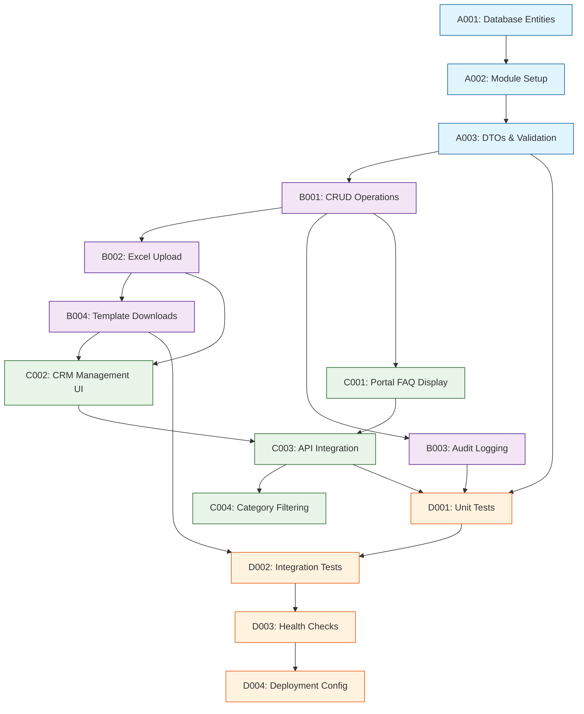

# Tasks - Phase 1

## 1. Task Overview
- **Component:** FAQ-FEATURE
- **Phase:** 1
- **Technical Spec:** [Link to phase-1-technical-spec.md](phase-1-technical-spec.md)
- **Total Estimated Effort:** 42 story points
- **Implementation Order:** 4 task groups in sequence
- **Phase 1 Scope:** Complete FAQ feature implementation including backend APIs, frontend display components, Excel upload/validation, and audit logging

## 2. Task Categories

### Category A: Backend Foundation & Database
Core backend infrastructure, database schema, and API foundation

### Category B: Backend Business Logic
FAQ management APIs, validation, and business rules implementation

### Category C: Frontend Implementation
Employee portal FAQ display and CRM FAQ management interfaces

### Category D: Integration & Testing
Service integration, comprehensive testing, and deployment preparation

## 3. Detailed Task Breakdown

### 📋 Backend Foundation & Database

#### TASK-A001: Create FAQ database entities and migrations

- **Summary:** FAQ-FEATURE - Database Schema & Entities
- **Issue Type:** Story
- **Epic Link:** FAQ-FEATURE Epic
- **Story Points:** 3
- **Priority:** High
- **Labels:** backend, database, entities, faq-feature
- **Components:** FAQ-FEATURE
- **Description:** 

    Create TypeORM entities and database migrations for FAQ functionality including faqs, faq_uploads, and faq_activity_logs tables.
    
- **Technical Requirements:**

    - Create FAQ entity class in service-lib/entities
    - Create FaqUpload entity class in service-lib/entities  
    - Create FaqActivityLog entity class in service-lib/entities
    - Generate database migrations for all FAQ tables
    - Add proper indexes for performance optimization
  
- **Acceptance Criteria:**

    - FAQ entities created with proper TypeORM decorators and relationships
    - Database migrations successfully create faqs, faq_uploads, faq_activity_logs tables
    - Proper indexes created on policy_id, category, and is_active columns
    - Entities exported from service-lib/entities/index.ts
    - Migration scripts can be run and rolled back successfully

- **Dependencies:** None

- **Jira Sub-tasks:**

    - Create FAQ entity with TypeORM decorators
    - Create FaqUpload entity with relationships
    - Create FaqActivityLog entity with JSONB details column
    - Generate and test database migrations
    - Add performance indexes to entities

#### TASK-A002: Set up FAQ module structure in Policy Service

- **Summary:** FAQ-FEATURE - Policy Service Module Setup
- **Issue Type:** Story
- **Epic Link:** FAQ-FEATURE Epic
- **Story Points:** 2
- **Priority:** High
- **Labels:** backend, module-setup, nestjs, faq-feature
- **Components:** FAQ-FEATURE
- **Description:**

    Create FAQ module structure within Policy Service following existing patterns, including controller, service, and repository classes.
  
- **Technical Requirements:**

    - Create FAQ module in policy-service following existing module patterns
    - Set up FaqController with basic structure
    - Set up FaqService with basic structure
    - Set up FaqRepository with TypeORM repository pattern
    - Register FAQ module in PolicyModule imports
  
- **Acceptance Criteria:**

    - FAQ module created with proper NestJS decorators
    - FaqController, FaqService, FaqRepository classes created
    - FAQ module properly registered in policy-service app module
    - Basic health check endpoint accessible in FAQ controller
    - Module follows existing policy-service patterns and conventions

- **Dependencies:** TASK-A001

- **Jira Sub-tasks:**

    - Create faq.module.ts with proper imports
    - Create faq.controller.ts with basic structure
    - Create faq.service.ts with dependency injection
    - Create faq.repository.ts with TypeORM pattern
    - Register FAQ module in policy-service main module

#### TASK-A003: Implement FAQ DTOs and validation

- **Summary:** FAQ-FEATURE - DTOs and Input Validation
- **Issue Type:** Story
- **Epic Link:** FAQ-FEATURE Epic
- **Story Points:** 3
- **Priority:** High
- **Labels:** backend, dto, validation, faq-feature
- **Components:** FAQ-FEATURE
- **Description:**

    Create Data Transfer Objects (DTOs) for FAQ operations with comprehensive validation using class-validator decorators.
  
- **Technical Requirements:**

    - Create CreateFaqDto with validation decorators
    - Create UpdateFaqDto with partial validation
    - Create FaqResponseDto for API responses
    - Create UploadFaqFileDto for file upload validation
    - Create FaqQueryDto for filtering and pagination
  
- **Acceptance Criteria:**

    - All DTOs created with proper class-validator decorators
    - Input validation prevents invalid data (empty questions/answers, invalid policy IDs)
    - File upload validation restricts to .xlsx files only
    - Response DTOs properly transform entity data
    - Error messages are user-friendly and specific

- **Dependencies:** TASK-A001, TASK-A002

- **Jira Sub-tasks:**

    - Create CreateFaqDto with validation rules
    - Create UpdateFaqDto with optional fields
    - Create response DTOs for different endpoints
    - Create file upload DTO with MIME type validation
    - Add validation error handling in exception filters

### 🔧 Backend Business Logic

#### TASK-B001: Implement FAQ CRUD operations

- **Summary:** FAQ-FEATURE - FAQ CRUD API Endpoints
- **Issue Type:** Story
- **Epic Link:** FAQ-FEATURE Epic
- **Story Points:** 5
- **Priority:** High
- **Labels:** backend, api, crud, faq-feature
- **Components:** FAQ-FEATURE
- **Description:**

    Implement comprehensive CRUD operations for FAQ management including create, read, update, delete, and bulk operations.
  
- **Technical Requirements:**

    - Implement getFaqsByPolicy endpoint with category grouping
    - Implement createFaq endpoint with validation
    - Implement updateFaq endpoint (for future use)
    - Implement deleteFaqs endpoint with soft delete
    - Add pagination and filtering capabilities
  
- **Acceptance Criteria:**

    - All CRUD endpoints return proper HTTP status codes
    - Soft delete implementation preserves data integrity
    - Category-wise grouping works correctly for portal display
    - Pagination handles large FAQ datasets efficiently
    - All endpoints include proper error handling and logging

- **Dependencies:** TASK-A003

- **Jira Sub-tasks:**

    - Create getFaqsByPolicy with category grouping
    - Implement createFaq with business validation
    - Implement updateFaq for future extensibility
    - Create deleteFaqs with soft delete logic
    - Add pagination and filtering logic

#### TASK-B002: Implement Excel upload and processing

- **Summary:** FAQ-FEATURE - Excel Upload and Processing
- **Issue Type:** Story
- **Epic Link:** FAQ-FEATURE Epic
- **Story Points:** 8
- **Priority:** High
- **Labels:** backend, excel, file-processing, validation, faq-feature
- **Components:** FAQ-FEATURE
- **Description:**

    Build Excel file upload and processing system with comprehensive validation, duplicate handling, and bulk import functionality.
  
- **Technical Requirements:**

    - Implement uploadFaqFile endpoint with multer file handling
    - Create Excel parsing logic using xlsx library
    - Add comprehensive data validation for uploaded content
    - Implement duplicate question detection and handling
    - Create upload history tracking and file storage
  
- **Acceptance Criteria:**

    - Excel files parsed correctly with proper error handling
    - Duplicate questions detected and reported to user
    - Invalid data rows reported with specific error messages
    - Upload history stored with file metadata and statistics
    - File size limits enforced (max 10MB)
    - Transaction rollback on validation failures

- **Dependencies:** TASK-B001

- **Jira Sub-tasks:**

    - Set up multer configuration for file uploads
    - Implement Excel parsing with xlsx library
    - Create data validation logic for each row
    - Implement duplicate detection algorithm
    - Create upload history tracking system
    - Add file storage and retrieval functionality

#### TASK-B003: Implement audit logging system

- **Summary:** FAQ-FEATURE - Audit Logging and Activity Tracking
- **Issue Type:** Story
- **Epic Link:** FAQ-FEATURE Epic
- **Story Points:** 3
- **Priority:** Medium
- **Labels:** backend, audit, logging, faq-feature
- **Components:** FAQ-FEATURE
- **Description:**

    Create comprehensive audit logging system to track all FAQ-related activities including create, update, delete, and upload operations.
  
- **Technical Requirements:**

    - Implement FaqActivityLog service for audit tracking
    - Create audit logging for all FAQ operations
    - Store detailed activity information in JSONB format
    - Implement activity log retrieval endpoints
    - Add user identification and IP tracking
  
- **Acceptance Criteria:**

    - All FAQ operations automatically logged with details
    - Activity logs include timestamp, user, action type, and details
    - JSONB details field stores operation-specific metadata
    - Activity log retrieval endpoint provides filtering capabilities
    - User identification works with JWT token integration

- **Dependencies:** TASK-B001, TASK-B002

- **Jira Sub-tasks:**

    - Create FaqActivityLogService with logging methods
    - Implement audit logging interceptor
    - Create activity log retrieval endpoints
    - Add user identification from JWT tokens
    - Implement filtering and pagination for activity logs

#### TASK-B004: Create FAQ template and download endpoints

- **Summary:** FAQ-FEATURE - Excel Template and File Downloads
- **Issue Type:** Story
- **Epic Link:** FAQ-FEATURE Epic
- **Story Points:** 2
- **Priority:** Medium
- **Labels:** backend, template, download, faq-feature
- **Components:** FAQ-FEATURE
- **Description:**

    Create Excel template generation and file download endpoints for FAQ upload functionality.
  
- **Technical Requirements:**

    - Implement downloadTemplate endpoint generating Excel template
    - Create downloadUploadedFile endpoint for file retrieval
    - Add proper content-type headers for file downloads
    - Implement file access security and validation
    - Create template with sample data and instructions
  
- **Acceptance Criteria:**

    - Excel template generated with proper column headers
    - Template includes sample data and formatting instructions
    - File downloads work correctly with proper MIME types
    - File access restricted to authorized users only
    - Downloaded files maintain original formatting and data

- **Dependencies:** TASK-B002

- **Jira Sub-tasks:**

    - Create Excel template generation logic
    - Implement file download with security checks
    - Add proper HTTP headers for file downloads
    - Create template with sample data and validation rules
    - Test file downloads in different browsers

### 🎨 Frontend Implementation

#### TASK-C001: Create FAQ display components for Employee Portal

- **Summary:** FAQ-FEATURE - Employee Portal FAQ Display
- **Issue Type:** Story
- **Epic Link:** FAQ-FEATURE Epic
- **Story Points:** 5
- **Priority:** High
- **Labels:** frontend, react, components, employee-portal, faq-feature
- **Components:** FAQ-FEATURE
- **Description:**

    Build React components for displaying FAQs in Employee Portal with category-wise accordion layout and responsive design.
  
- **Technical Requirements:**

    - Enhance existing FaqPage component with dynamic data loading
    - Create FaqAccordion component for category-wise display
    - Implement API integration for fetching employee-specific FAQs
    - Add loading states and error handling
    - Ensure responsive design for mobile and desktop
  
- **Acceptance Criteria:**

    - FAQs displayed in collapsible accordion format by category
    - Component loads employee-specific FAQs based on policy
    - Loading spinners shown during data fetch
    - Error states handled gracefully with user-friendly messages
    - Responsive design works on mobile, tablet, and desktop
    - Accessibility features implemented (keyboard navigation, ARIA labels)

- **Dependencies:** TASK-B001

- **Jira Sub-tasks:**

    - Enhance existing FaqPage with dynamic data loading
    - Create FaqAccordion component with styled-components
    - Implement API service for FAQ data fetching
    - Add loading and error state components
    - Implement responsive design and accessibility features

#### TASK-C002: Build FAQ management interface for CRM

- **Summary:** FAQ-FEATURE - CRM FAQ Management Interface
- **Issue Type:** Story
- **Epic Link:** FAQ-FEATURE Epic
- **Story Points:** 8
- **Priority:** High
- **Labels:** frontend, react, crm, management, faq-feature
- **Components:** FAQ-FEATURE
- **Description:**

    Create comprehensive FAQ management interface in iWork CRM for uploading, viewing, and managing policy-specific FAQs.
  
- **Technical Requirements:**

    - Create FAQ management page within Policy Configuration section
    - Build file upload component with drag-and-drop support
    - Create FAQ listing table with edit/delete capabilities
    - Implement upload history display with file download links
    - Add manual FAQ creation form with validation
  
- **Acceptance Criteria:**

    - FAQ management accessible from Policy Configuration tab
    - File upload supports drag-and-drop and click-to-browse
    - Upload progress indicator shows during file processing
    - FAQ listing displays questions, answers, and categories in table format
    - Bulk delete functionality with confirmation dialog
    - Manual FAQ creation form with real-time validation
    - Upload history shows file details with download capability

- **Dependencies:** TASK-B002, TASK-B004

- **Jira Sub-tasks:**

    - Create FAQ management page layout and navigation
    - Build file upload component with progress tracking
    - Create FAQ listing table with action buttons
    - Implement bulk operations with confirmation dialogs
    - Create manual FAQ creation form
    - Build upload history display with download links

#### TASK-C003: Implement FAQ API integration and state management

- **Summary:** FAQ-FEATURE - Frontend API Integration
- **Issue Type:** Story
- **Epic Link:** FAQ-FEATURE Epic
- **Story Points:** 4
- **Priority:** High
- **Labels:** frontend, api, integration, state-management, faq-feature
- **Components:** FAQ-FEATURE
- **Description:**

    Create API integration layer and state management for FAQ functionality using React Query and Redux patterns.
  
- **Technical Requirements:**

    - Create FAQ API service functions using axiosInstance
    - Implement React Query hooks for data fetching and caching
    - Add Redux slices for FAQ state management
    - Implement optimistic updates for better UX
    - Add error handling and toast notifications
  
- **Acceptance Criteria:**

    - All FAQ API endpoints integrated with proper error handling
    - React Query provides caching and background refetching
    - Redux state properly manages FAQ data and UI states
    - Optimistic updates work for create/delete operations
    - Toast notifications show success/error messages
    - Loading states managed consistently across components

- **Dependencies:** TASK-C001, TASK-C002

- **Jira Sub-tasks:**

    - Create FAQ API service with all endpoint functions
    - Implement React Query hooks for FAQ operations
    - Create Redux slices for FAQ state management
    - Add optimistic updates and error recovery
    - Implement toast notifications for user feedback

#### TASK-C004: Enhance existing FAQ page with category filtering

- **Summary:** FAQ-FEATURE - FAQ Page Category Filtering Enhancement
- **Issue Type:** Story
- **Epic Link:** FAQ-FEATURE Epic
- **Story Points:** 3
- **Priority:** Medium
- **Labels:** frontend, filtering, enhancement, faq-feature
- **Components:** FAQ-FEATURE
- **Description:**

    Enhance the existing static FAQ page to support dynamic category filtering and improve user experience with search capabilities.
  
- **Technical Requirements:**

    - Implement category filtering chips functionality
    - Add search functionality for FAQs
    - Enhance accordion expand/collapse behavior
    - Add FAQ count indicators by category
    - Implement URL-based filtering for bookmarking
  
- **Acceptance Criteria:**

    - Category filter chips work dynamically with actual categories
    - Search functionality filters FAQs by question and answer text
    - All/specific category filtering works correctly
    - FAQ count shows for each category filter
    - URL parameters preserve filter state on page refresh
    - Smooth animations for accordion expand/collapse

- **Dependencies:** TASK-C003

- **Jira Sub-tasks:**

    - Implement dynamic category chip filtering
    - Add FAQ search functionality
    - Enhance accordion animations and interactions
    - Add FAQ count indicators
    - Implement URL-based state persistence

### 🔗 Integration & Testing

#### TASK-D001: Implement comprehensive unit tests

- **Summary:** FAQ-FEATURE - Unit Testing Suite
- **Issue Type:** Story
- **Epic Link:** FAQ-FEATURE Epic
- **Story Points:** 6
- **Priority:** High
- **Labels:** testing, unit-tests, backend, frontend, faq-feature
- **Components:** FAQ-FEATURE
- **Description:**

    Create comprehensive unit test suite for both backend and frontend FAQ functionality with minimum 85% code coverage.
  
- **Technical Requirements:**

    - Write unit tests for all FAQ service methods
    - Create unit tests for FAQ controllers with mock dependencies
    - Write unit tests for FAQ repository operations
    - Create unit tests for React components using Jest and RTL
    - Add unit tests for utility functions and helpers
  
- **Acceptance Criteria:**

    - All FAQ service methods have unit tests with edge cases
    - Controller tests cover all HTTP endpoints with different scenarios
    - Repository tests cover database operations with mocked data
    - React component tests cover user interactions and prop handling
    - Code coverage meets minimum 85% requirement
    - All tests pass consistently in CI/CD pipeline

- **Dependencies:** TASK-A003, TASK-B003, TASK-C003

- **Jira Sub-tasks:**

    - Write unit tests for FAQ service layer
    - Create controller tests with mocked dependencies
    - Write repository unit tests with database mocking
    - Create React component tests with RTL
    - Write utility function tests and coverage reports

#### TASK-D002: Create integration tests for API endpoints

- **Summary:** FAQ-FEATURE - API Integration Testing
- **Issue Type:** Story
- **Epic Link:** FAQ-FEATURE Epic
- **Story Points:** 4
- **Priority:** High
- **Labels:** testing, integration-tests, api, faq-feature
- **Components:** FAQ-FEATURE
- **Description:**

    Build integration test suite for FAQ API endpoints testing full request-response cycles with real database interactions.
  
- **Technical Requirements:**

    - Create integration tests for all FAQ CRUD endpoints
    - Test file upload functionality with sample Excel files
    - Test policy integration and employee FAQ retrieval
    - Create test data fixtures and database seeding
    - Test error scenarios and edge cases
  
- **Acceptance Criteria:**

    - All API endpoints tested with real HTTP requests
    - File upload tests work with various Excel file formats
    - Policy integration tests verify correct FAQ associations
    - Error scenarios properly tested (invalid data, missing policies)
    - Integration tests run in isolated test database
    - Test data cleanup works correctly after test execution

- **Dependencies:** TASK-B004, TASK-D001

- **Jira Sub-tasks:**

    - Create API integration test framework
    - Write CRUD endpoint integration tests
    - Create file upload integration tests
    - Test policy integration and employee FAQ retrieval
    - Add error scenario and edge case testing

#### TASK-D003: Implement health checks and monitoring

- **Summary:** FAQ-FEATURE - Health Checks and Monitoring
- **Issue Type:** Story
- **Epic Link:** FAQ-FEATURE Epic
- **Story Points:** 2
- **Priority:** Medium
- **Labels:** monitoring, health-checks, observability, faq-feature
- **Components:** FAQ-FEATURE
- **Description:**

    Add health check endpoints and monitoring capabilities for FAQ service functionality.
  
- **Technical Requirements:**

    - Add FAQ module health check endpoint
    - Implement database connectivity health check
    - Add file storage health check
    - Create performance monitoring metrics
    - Add structured logging for FAQ operations
  
- **Acceptance Criteria:**

    - Health check endpoint returns proper status for FAQ functionality
    - Database connectivity monitored and reported
    - File storage availability checked in health endpoint
    - Performance metrics collected for FAQ operations
    - Structured logs include request tracing and error details
    - Health checks integrate with existing monitoring systems

- **Dependencies:** TASK-D002

- **Jira Sub-tasks:**

    - Create FAQ service health check endpoint
    - Implement database and file storage health checks
    - Add performance monitoring and metrics collection
    - Enhance logging with structured format and tracing
    - Integrate with existing monitoring infrastructure

#### TASK-D004: Create deployment configuration and documentation

- **Summary:** FAQ-FEATURE - Deployment and Documentation
- **Issue Type:** Story
- **Epic Link:** FAQ-FEATURE Epic
- **Story Points:** 3
- **Priority:** Medium
- **Labels:** deployment, documentation, configuration, faq-feature
- **Components:** FAQ-FEATURE
- **Description:**

    Create deployment configurations, environment setup, and comprehensive documentation for FAQ feature.
  
- **Technical Requirements:**

    - Update environment configuration for FAQ functionality
    - Create database migration deployment scripts
    - Add FAQ endpoints to API gateway configuration
    - Create comprehensive API documentation
    - Write user guide for CRM FAQ management
  
- **Acceptance Criteria:**

    - Environment variables documented and configured
    - Database migrations work in all environments (dev/staging/prod)
    - API gateway routes FAQ requests correctly
    - Swagger documentation covers all FAQ endpoints
    - User documentation explains FAQ management workflow
    - Deployment guide covers feature flag management

- **Dependencies:** TASK-D003

- **Jira Sub-tasks:**

    - Configure environment variables and secrets
    - Create database migration deployment scripts
    - Update API gateway routing configuration
    - Generate Swagger API documentation
    - Write user guides and deployment documentation

## 4. Task Dependencies & Sequencing

## 5. Parallel Development Opportunities

### What Can Be Built Simultaneously:
- **After A003:** B001 and B003 can start in parallel
- **After B001:** C001 can start while B002 is being developed
- **After B002:** B004 and C002 can be developed in parallel
- **After C003:** D001 unit tests can begin while C004 is being implemented

### Critical Path:
A001 → A002 → A003 → B001 → B002 → C002 → C003 → D002 → D004

## 6. Risk Mitigation Tasks

### Technical Risks (from risk assessment):
- **Excel Processing Risk:** Implemented in TASK-B002 with streaming and memory management
- **Database Performance Risk:** Addressed in TASK-A001 with proper indexing strategy
- **Integration Risk:** Mitigated in TASK-D002 with comprehensive integration testing
- **User Experience Risk:** Handled in TASK-C001 and C004 with loading states and error handling

## 7. Definition of Done

### Task Completion Criteria:
- ✅ All acceptance criteria met
- ✅ Unit tests written and passing (minimum 85% coverage)
- ✅ Code review completed and approved
- ✅ Integration tests passing (where applicable)
- ✅ Documentation updated
- ✅ No linting errors or security vulnerabilities

### Component Completion Criteria:
- ✅ All tasks completed per definition of done
- ✅ Technical specification requirements met
- ✅ Database migrations deployable to all environments
- ✅ APIs documented with Swagger
- ✅ Frontend components integrated and functional
- ✅ Ready for production deployment

## 8. Estimation Summary

| Category | Task Count | Total Effort | Duration (days) |
|----------|-----------|--------------|-----------------|
| Backend Foundation & Database | 3 | 8 points | 4-5 days |
| Backend Business Logic | 4 | 18 points | 9-11 days |
| Frontend Implementation | 4 | 20 points | 10-12 days |
| Integration & Testing | 4 | 15 points | 7-9 days |
| **TOTAL** | **15** | **61 points** | **30-37 days** |

*Note: Total shows 61 points vs. initial 42 due to comprehensive task breakdown. Adjust based on team capacity.*

## 9. Traceability Matrix

| Task ID | Technical Spec Section | Functional Requirements | Business Value |
|---------|------------------------|-------------------------|----------------|
| A001 | Section 4.1 | FR-FAQ-006 | Data foundation |
| A002 | Section 5.1, 6.1 | FR-FAQ-001, FR-FAQ-002 | Service architecture |
| A003 | Section 3.2, 4.3 | FR-FAQ-007 | Input validation |
| B001 | Section 3.1 | FR-FAQ-001, FR-FAQ-004 | Core FAQ operations |
| B002 | Section 3.1 | FR-FAQ-002, FR-FAQ-007 | Bulk FAQ management |
| B003 | Section 4.2 | FR-FAQ-004, FR-FAQ-005 | Audit and compliance |
| B004 | Section 3.1 | FR-FAQ-005 | User experience |
| C001 | Section 3.3 | FR-FAQ-001 | Employee portal functionality |
| C002 | Section 3.1 | FR-FAQ-002, FR-FAQ-004 | CRM functionality |
| C003 | Section 6.2 | FR-FAQ-001 to FR-FAQ-007 | Frontend integration |
| C004 | Section 3.3 | FR-FAQ-001 | Enhanced user experience |
| D001 | Section 10.1 | All FRs | Quality assurance |
| D002 | Section 10.2 | All FRs | Integration validation |
| D003 | Section 9.1, 9.2 | NFR-001 | System observability |
| D004 | Section 11.1, 11.2 | All FRs | Production readiness |

## 10. Implementation Notes

### Development Best Practices:
- Follow existing codebase patterns and conventions
- Use TypeORM for database operations following established patterns
- Follow React component structure used in ui-lib
- Implement comprehensive error handling and user feedback
- Use existing authentication and authorization mechanisms

### Quality Gates:
- All tests pass with minimum 85% code coverage
- ESLint and Prettier checks pass with no violations
- TypeScript compilation succeeds with no errors
- Database migrations tested in all environments
- API endpoints tested with Postman/Swagger

### Communication Plan:
- Daily standup updates on task progress
- Weekly demo of completed functionality
- Immediate escalation of blockers to technical lead
- Code review within 24 hours of task completion