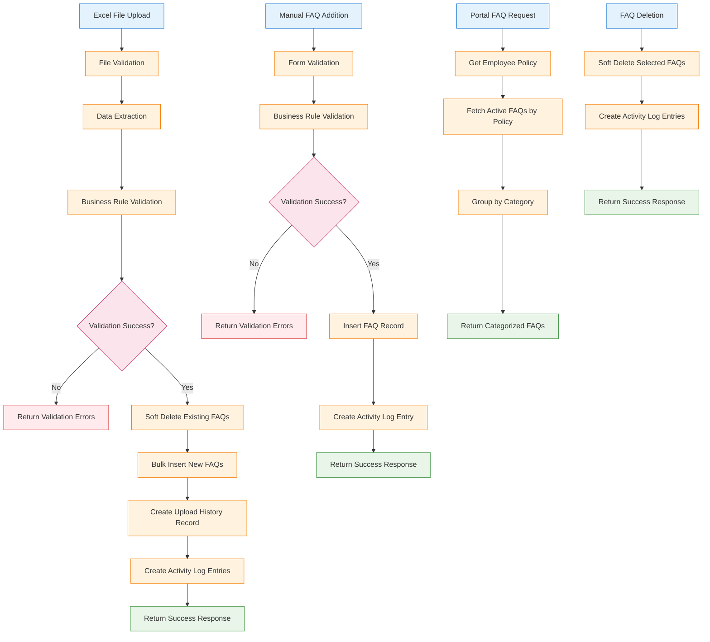

# TRD - Phase 1

## 1. Component Overview
- **Purpose:** Implement comprehensive FAQ feature enabling policy-specific FAQ management in iWork CRM and category-wise display in Employee Enrollment Portal
- **Scope:** Full FAQ lifecycle including upload, management, sync, and display functionality
- **Phase 1 Scope:** Complete FAQ feature implementation including backend APIs, frontend display components, Excel upload/validation, and audit logging
- **Dependencies:** 
  - Policy Service (for policy mapping)
  - Database infrastructure (PostgreSQL)
  - File upload infrastructure
  - Service registry and API gateway
- **Dependents:** Employee Enrollment Portal FAQ display

## 2. Functional Requirements
List of functional requirements this component must fulfill:
- **FR-FAQ-001:** Display policy-specific FAQs in Employee Enrollment Portal with category-wise accordion layout
- **FR-FAQ-002:** Enable bulk FAQ upload via Excel template in iWork CRM
- **FR-FAQ-003:** Support manual individual FAQ creation in CRM
- **FR-FAQ-004:** Provide FAQ management (view, delete) capabilities with audit logging
- **FR-FAQ-005:** Maintain upload history tracking with file metadata
- **FR-FAQ-006:** Implement policy-FAQ mapping
- **FR-FAQ-007:** Validate FAQ data and handle duplicate questions

## 3. Component Interface

### 3.1 Public API
Define the external interface this component exposes:

```typescript
// FAQ Management API (Backend)
interface FaqAPI {
  // FAQ CRUD Operations
  getFaqsByPolicy(policyId: string): Promise<FaqResponse[]>;
  createFaq(faqData: CreateFaqRequest): Promise<FaqResponse>;
  updateFaq(faqId: string, faqData: UpdateFaqRequest): Promise<FaqResponse>;
  deleteFaqs(faqIds: string[]): Promise<DeleteFaqResponse>;
  
  // Bulk Operations
  uploadFaqFile(policyId: string, file: Express.Multer.File): Promise<UploadResponse>;
  downloadTemplate(): Promise<Buffer>;
  getUploadHistory(policyId: string): Promise<UploadHistoryResponse[]>;
  downloadUploadedFile(uploadId: string): Promise<Buffer>;
  
  // Portal Display
  getFaqsForPortal(employeeId: string): Promise<PortalFaqResponse[]>;
}

// Frontend FAQ Component Interface
interface FaqComponentProps {
  employeeId?: string;
  policyId?: string;
  categories?: string[];
  onError?: (error: Error) => void;
}
```

### 3.2 Input/Output Contracts
- **Inputs:** 
  - Policy ID for FAQ association
  - Excel files with FAQ data (Policy ID, Category, Question, Answer columns)
  - Individual FAQ form data (Category, Question, Answer)
  - Employee ID for portal FAQ display
- **Outputs:** 
  - Category-wise FAQ listing for portal display
  - Upload success/failure responses with validation errors
  - Audit log entries for all FAQ operations
- **Data Formats:** JSON for API responses, Excel (.xlsx) for bulk uploads, TypeScript interfaces for frontend

### 3.3 Error Handling
- **Error Types:** 
  - ValidationError (missing required fields, invalid data)
  - DuplicateError (duplicate questions for same policy)
  - FileFormatError (invalid Excel format or structure)
  - PolicyNotFoundError (invalid policy ID)
- **Error Responses:** Structured JSON with error code, message, and details array
- **Recovery Strategies:** 
  - Partial upload success with error details for individual FAQ validation failures
  - Graceful degradation for portal display (show cached FAQs if service fails)

## 4. Data Model

### 4.1 Data Storage
- **Storage Type:** PostgreSQL relational database
- **Data Schema:** Multiple tables for FAQ data, upload tracking, and audit logging

```sql
-- FAQ master table
CREATE TABLE faqs (
  id UUID PRIMARY KEY DEFAULT gen_random_uuid(),
  policy_id VARCHAR(50) NOT NULL,
  category VARCHAR(100) NOT NULL,
  question TEXT NOT NULL,
  answer TEXT NOT NULL,
  is_active BOOLEAN DEFAULT true,
  created_by VARCHAR(100) NOT NULL,
  created_at TIMESTAMP DEFAULT NOW(),
  updated_by VARCHAR(100),
  updated_at TIMESTAMP,
  is_published BOOLEAN DEFAULT false
);

-- FAQ upload history table
CREATE TABLE faq_uploads (
  id UUID PRIMARY KEY DEFAULT gen_random_uuid(),
  policy_id VARCHAR(50) NOT NULL,
  file_name VARCHAR(255) NOT NULL,
  file_path VARCHAR(500) NOT NULL,
  faq_count INTEGER NOT NULL,
  uploaded_by VARCHAR(100) NOT NULL,
  uploaded_at TIMESTAMP DEFAULT NOW(),
  status VARCHAR(20) DEFAULT 'completed' -- processing, completed, failed
);

-- FAQ activity log table
CREATE TABLE faq_activity_logs (
  id UUID PRIMARY KEY DEFAULT gen_random_uuid(),
  policy_id VARCHAR(50) NOT NULL,
  action_type VARCHAR(20) NOT NULL, -- create, update, delete, upload
  changed_by VARCHAR(100) NOT NULL,
  changed_at TIMESTAMP DEFAULT NOW(),
  faq_id UUID,
  file_name VARCHAR(255),
  details JSONB -- store additional metadata
);

-- Indexes for performance
CREATE INDEX idx_faqs_policy_id ON faqs(policy_id);
CREATE INDEX idx_faqs_category ON faqs(category);
CREATE INDEX idx_faqs_active ON faqs(is_active);
CREATE INDEX idx_faq_uploads_policy_id ON faq_uploads(policy_id);
CREATE INDEX idx_faq_activity_logs_policy_id ON faq_activity_logs(policy_id);
```

### 4.2 Data Flow


### 4.3 Data Validation
- **Input Validation:** 
  - Policy ID format validation (non-empty, valid format)
  - Question and Answer text validation (non-empty, max length 5000 characters)
  - Category validation (non-empty, max length 100 characters)
  - Excel file format validation (required columns present)
- **Business Rules:** 
  - Duplicate question validation within same policy
  - Policy existence validation before FAQ creation
  - File size limits (max 10MB for Excel uploads)
  - Maximum FAQs per policy (500 limit)
- **Data Integrity:** 
  - Foreign key constraints on policy_id
  - Unique constraints on (policy_id, question) combination
  - Soft delete implementation (is_active flag)

## 5. Technology Stack

### 5.1 Core Technologies
- **Programming Language:** TypeScript (Node.js 18+)
- **Backend Framework:** NestJS 10.x
- **Frontend Framework:** React 18.x with TypeScript
- **Database:** PostgreSQL 14+
- **ORM:** TypeORM 0.3.x
- **File Processing:** xlsx library for Excel parsing
- **Additional Libraries:** 
  - multer for file uploads
  - joi for validation
  - class-validator for DTO validation
  - styled-components for frontend styling

### 5.2 Technology Rationale
- **Why These Choices:** 
  - NestJS provides structured, scalable backend architecture with built-in validation and security
  - TypeORM offers type-safe database operations with migration support
  - React with TypeScript ensures type safety and component reusability
  - PostgreSQL provides ACID compliance and complex query capabilities
- **Alternatives Considered:** 
  - Prisma ORM (chosen TypeORM for existing codebase consistency)
  - MongoDB (chosen PostgreSQL for relational data and complex queries)
- **Trade-offs:** 
  - TypeORM learning curve vs powerful features
  - Excel processing overhead vs user-friendly bulk upload experience

## 6. Integration Design

### 6.1 Dependency Integration
- **Policy Service:** HTTP API calls to validate policy existence and get policy details
  - **Communication Method:** REST API calls through HTTP client
  - **Data Exchange:** Policy ID validation requests and policy metadata responses
- **API Gateway:** Routes FAQ requests to appropriate services
  - **Communication Method:** HTTP proxy and load balancing
  - **Data Exchange:** Standard HTTP request/response with JWT token passing
- **File Storage Service:** Store uploaded Excel files for audit and re-download
  - **Communication Method:** File system or cloud storage API
  - **Data Exchange:** File upload/download operations with metadata

### 6.2 Service Integration
- **External APIs:** None required for Phase 1
- **Authentication:** JWT token validation through existing auth service
- **Rate Limiting:** Standard API gateway rate limiting (100 requests/minute per user)
- **Fallback Strategies:** 
  - Return cached FAQs if policy service is unavailable
  - Graceful degradation for non-critical features

## 7. Performance Considerations

### 7.1 Performance Requirements
- **Response Time:** 
  - FAQ retrieval: < 500ms for up to 100 FAQs
  - Excel upload processing: < 5 seconds for files up to 1000 rows
  - Individual FAQ operations: < 200ms
- **Throughput:** 
  - Support 50 concurrent users in CRM
  - Handle 200 portal FAQ requests per minute
- **Scalability:** Horizontal scaling capability with database connection pooling

### 7.2 Performance Strategies
- **Caching:** 
  - Redis cache for frequently accessed FAQs (TTL: 1 hour)
  - Application-level caching for policy metadata
- **Database Optimization:** 
  - Indexed queries on policy_id and category fields
  - Pagination for large FAQ lists (50 items per page)
  - Connection pooling (max 20 connections)
- **Resource Management:** 
  - Stream processing for large Excel files
  - Async/await patterns for non-blocking operations
  - Memory-efficient file processing with streaming

## 8. Security Design

### 8.1 Security Requirements
- **Authentication:** JWT token validation for all API endpoints
- **Authorization:** Role-based access control (Admin, HR Manager, Employee roles)
- **Data Protection:** 
  - Encrypt sensitive data at rest
  - Secure file upload validation
  - SQL injection prevention through parameterized queries

### 8.2 Security Implementation
- **Encryption:** 
  - HTTPS for all API communications
  - File encryption for stored Excel uploads
- **Input Sanitization:** 
  - XSS prevention for FAQ content
  - File type validation (only .xlsx files allowed)
  - Content length limits to prevent DoS attacks
- **Audit Logging:** 
  - All FAQ modifications logged with user identification
  - File upload activities tracked with IP addresses
  - Failed authentication attempts monitoring

## 9. Monitoring & Observability

### 9.1 Logging
- **Log Levels:** 
  - ERROR: Failed operations, validation errors, sync failures
  - WARN: Performance issues, unusual data patterns
  - INFO: Successful operations, user activities
  - DEBUG: Detailed processing information (dev/staging only)
- **Log Format:** Structured JSON with timestamp, service name, trace ID, user ID, and operation details
- **Sensitive Data:** Never log FAQ answers containing PII, user passwords, or authentication tokens

### 9.2 Metrics
- **Performance Metrics:** 
  - API response times by endpoint
  - Database query execution times
  - File processing durations
  - Memory and CPU usage patterns
- **Business Metrics:** 
  - FAQ creation/update/delete counts
  - Upload success/failure rates
  - Portal FAQ view counts by category
  - User engagement with FAQ content
- **Alerting:** 
  - Response time > 1 second for 5 consecutive minutes
  - Error rate > 5% over 10-minute window
  - Sync failures requiring manual intervention

## 10. Testing Strategy

### 10.1 Unit Testing
- **Test Coverage:** Minimum 85% code coverage for all modules
- **Key Test Cases:** 
  - FAQ CRUD operations with various data scenarios
  - Excel file parsing and validation logic
  - Business rule validation (duplicates, limits)
  - Error handling for edge cases
- **Mock Dependencies:** 
  - Policy service API calls
  - Database operations
  - File system operations
  - Authentication service

### 10.2 Integration Testing
- **Integration Points:** 
  - FAQ API with database operations
  - File upload with storage system
  - Policy service integration
  - Frontend-backend API integration
- **Test Data:** 
  - Sample Excel files with valid/invalid data
  - Test policies with known characteristics
  - Mock user authentication tokens
- **Environment Requirements:** 
  - Isolated test database with sample data
  - Mock policy service endpoints
  - File upload test environment

## 11. Deployment Considerations

### 11.1 Environment Requirements
- **Infrastructure:** 
  - Container-based deployment (Docker)
  - PostgreSQL database instance
  - Redis cache instance (optional for Phase 1)
  - File storage volume or cloud storage
- **Configuration:** 
  - Environment-specific database connection strings
  - File upload directory paths
  - API endpoint configurations
  - JWT secret keys
- **Secrets Management:** 
  - Database credentials via environment variables
  - API keys for external services
  - File encryption keys

### 11.2 Deployment Strategy
- **Build Process:** 
  - TypeScript compilation for backend services
  - React application build with webpack
  - Database migration execution
  - Container image creation
- **Deployment Steps:** 
  1. Database migration execution
  2. Backend service deployment
  3. Frontend application deployment
  4. Health check verification
  5. Integration testing execution
- **Rollback Plan:** 
  - Database migration rollback scripts
  - Previous service version containers
  - Frontend build rollback capability
  - Feature flag disable option

## 12. Risk Mitigation
Address specific risks identified in the implementation:
- **Data Loss Risk:** Implement soft deletes and maintain upload file backups
- **Performance Risk:** Database indexing strategy and query optimization
- **Security Risk:** Input validation, authentication checks, and audit logging
- **Integration Risk:** Circuit breaker pattern for external service calls
- **User Experience Risk:** Graceful error handling and loading states
- **Scalability Risk:** Horizontal scaling design and connection pooling

## 13. Future Considerations
- **Extensibility:** 
  - FAQ categorization system extensibility
  - Multi-language support for international deployments
  - Rich text formatting for FAQ answers
  - FAQ search and filtering capabilities
- **Migration Path:** 
  - Phase 2: Advanced FAQ management features (templates, approval workflows)
  - Phase 3: Analytics and reporting on FAQ usage
  - Phase 4: AI-powered FAQ suggestions and auto-categorization
- **Deprecation Strategy:** 
  - Maintain backward compatibility for API versions
  - Gradual migration path for data schema changes
  - Feature flag management for smooth transitions