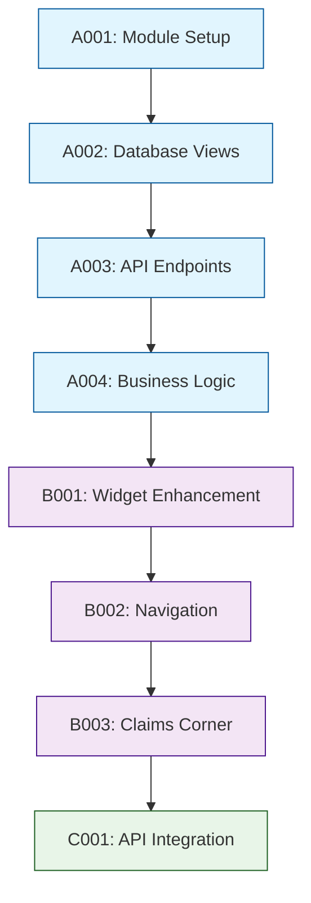

# Tasks - Phase 1

## 1. Task Overview

- **Component:** IBP Claims Summary & Claims Corner
- **Phase:** 1
- **Technical Spec:** [Link to phase-1-technical-spec.md](./phase-1-technical-spec.md)
- **Total Estimated Effort:** 34 story points
- **Implementation Order:** 3 task categories in sequence
- **Phase 1 Scope:** Claims Summary Dashboard Widget, Claims Corner Screen, and supporting backend APIs for claim data retrieval

## 2. Task Categories

### Category A: Backend Foundation & APIs
Core backend services and database views for claims data

### Category B: Frontend Widget Implementation  
Dashboard widget and navigation components

### Category C: Claims Corner Screen & API Integration
Dedicated claims viewing screen with policy-wise display and API integration

## 3. Detailed Task Breakdown

### 📋 Backend Foundation & APIs

#### TASK-A001: Setup Claims module structure in IBP service

- **Summary:** IBP Claims - Backend Module Structure Setup
- **Issue Type:** Story
- **Epic Link:** IBP Claims Epic
- **Story Points:** 2
- **Priority:** High
- **Labels:** setup, backend, ibp-claims
- **Components:** IBP Service
- **Description:** 

    Create the claims module structure within the existing IBP service, following established NestJS patterns and reusing existing authentication and database infrastructure.
    
- **Technical Requirements:**

    - Create claims module under `apps/services/ibp-service/src/app/claims/`
    - Reuse existing TypeORM connection and service-lib infrastructure
    - Follow existing module pattern from hospital-network and company-employee modules
    - Integrate with existing JWT authentication guards
  
- **Acceptance Criteria:**

    - Claims module folder structure created with controller, service, and module files
    - Module registered in main app.module.ts following existing patterns
    - Authentication guards properly integrated
    - Basic health check endpoint responds correctly

- **Dependencies:** None

- **Jira Sub-tasks:**

    - Create module folder structure
    - Implement claims.module.ts with proper imports
    - Create base claims.controller.ts with auth guards
    - Create base claims.service.ts with logging
    - Register module in app.module.ts

#### TASK-A002: Create database views for claims aggregation

- **Summary:** IBP Claims - Database Views for Efficient Queries
- **Issue Type:** Story
- **Epic Link:** IBP Claims Epic
- **Story Points:** 5
- **Priority:** High
- **Labels:** database, backend, views, ibp-claims
- **Components:** IBP Service
- **Description:**

    Implement optimized database views to aggregate claims data efficiently, following PostgreSQL best practices and reusing existing policy_claim entity structure.
  
- **Technical Requirements:**

    - Create `vw_employee_claims_summary` view for dashboard widget data
    - Create `vw_employee_recent_claims` view with ROW_NUMBER for recent claims
    - Create `vw_policy_family_members` view for GMC family display
    - Add composite indexes for performance optimization
    - Create migration files following existing migration patterns
  
- **Acceptance Criteria:**

    - Database views created with correct aggregation logic
    - Views handle Base/Parent policy separation properly
    - Composite indexes on (employee_id, policy_id, claim_date) created
    - Migration files follow existing naming and structure conventions
    - Views return data in under 200ms for typical employee datasets

- **Dependencies:** TASK-A001

- **Jira Sub-tasks:**

    - Design view queries with business logic
    - Create migration files for views
    - Add performance indexes
    - Test view performance with sample data
    - Document view usage and maintenance

#### TASK-A003: Implement Claims Controller API endpoints

- **Summary:** IBP Claims - REST API Endpoints Implementation
- **Issue Type:** Story
- **Epic Link:** IBP Claims Epic
- **Story Points:** 8
- **Priority:** High
- **Labels:** api, backend, controller, ibp-claims
- **Components:** IBP Service
- **Description:**

    Build REST API endpoints for claims data retrieval, reusing existing authentication patterns and following established API conventions from other IBP modules.
  
- **Technical Requirements:**

    - Implement `GET /ibp/claims/employee-summary` for dashboard widget
    - Implement `GET /ibp/claims/employee-details` for Claims Corner screen
    - Implement `GET /ibp/claims/family-members/:policyId` for family data
    - Use existing JWT auth guards and employee context extraction
    - Follow existing Swagger documentation patterns
    - Implement proper error handling and validation
  
- **Acceptance Criteria:**

    - All three endpoints respond with correct data structure
    - JWT authentication properly validates employee access
    - Error responses follow existing IBP service patterns
    - Swagger documentation generated for all endpoints
    - Input validation prevents invalid policy type requests
    - Endpoints return data in under 500ms target

- **Dependencies:** TASK-A002

- **Jira Sub-tasks:**

    - Implement employee-summary endpoint with aggregation
    - Implement employee-details endpoint with filtering
    - Implement family-members endpoint
    - Add comprehensive input validation
    - Create Swagger documentation
    - Add error handling for edge cases

#### TASK-A004: Implement Claims Service business logic

- **Summary:** IBP Claims - Business Logic & Data Processing
- **Issue Type:** Story
- **Epic Link:** IBP Claims Epic
- **Story Points:** 8
- **Priority:** High
- **Labels:** service, backend, business-logic, ibp-claims
- **Components:** IBP Service
- **Description:**

    Implement core business logic for claims data processing, including policy type handling, empty state management, and business rule validation.
  
- **Technical Requirements:**

    - Implement business logic for GMC Base/Parent policy separation
    - Handle empty states gracefully with appropriate messaging
    - Apply business rules: family members only for GMC, recent claims limits
    - Calculate available amounts (Total Sum Insured - Approved Claims)
    - Reuse existing logging patterns from service-lib
    - Implement data transformation for frontend consumption
  
- **Acceptance Criteria:**

    - Policy types (GMC, GPA, GTL) handled with type-specific logic
    - Base and Parent policies calculated independently for GMC
    - Empty state handling returns appropriate responses
    - Available amount calculations are mathematically correct
    - Business rules consistently applied across all endpoints
    - Comprehensive logging for debugging and monitoring

- **Dependencies:** TASK-A003

- **Jira Sub-tasks:**

    - Implement policy type specific business logic
    - Add empty state handling logic
    - Create data transformation utilities
    - Implement calculation logic for available amounts
    - Add comprehensive logging and error handling
    - Write business logic unit tests

### 🔧 Frontend Widget Implementation

#### TASK-B001: Enhance existing ClaimSummary component

- **Summary:** IBP Claims - Enhance Dashboard Widget Component
- **Issue Type:** Story
- **Epic Link:** IBP Claims Epic
- **Story Points:** 5
- **Priority:** High
- **Labels:** frontend, dashboard, widget, ibp-claims
- **Components:** IBP Frontend
- **Description:**

    Enhance the existing ClaimSummary component to match product specification requirements while reusing existing styled components and following established IBP UI patterns.
  
- **Technical Requirements:**

    - Modify existing `components/Dashboard/ClaimSummary/index.tsx` to match specs
    - Implement multi-policy support with policy type grouping
    - Add Base/Parent policy separation for GMC display
    - Integrate with new claims API endpoints
    - Maintain existing styling patterns and responsive design
    - Handle empty states with appropriate messaging
  
- **Acceptance Criteria:**

    - Widget displays multiple policies (GMC, GPA, GTL) as separate cards
    - Base and Parent GMC policies show in same card with separation
    - Empty state shows "No claims found for your policies" message
    - Policy information displays correctly (number, expiry, sum insured)
    - Claims status summary shows Total, Settled, Pending counts
    - Recent claims list shows latest 5 claims per policy

- **Dependencies:** TASK-A004

- **Jira Sub-tasks:**

    - Update component to support multi-policy display
    - Implement GMC Base/Parent policy separation UI
    - Add empty state handling in component
    - Update API integration to use new endpoints
    - Ensure responsive design works on mobile
    - Update component unit tests

#### TASK-B002: Add Claims Corner navigation and routing

- **Summary:** IBP Claims - Navigation & Routing Implementation
- **Issue Type:** Story
- **Epic Link:** IBP Claims Epic
- **Story Points:** 3
- **Priority:** Medium
- **Labels:** frontend, navigation, routing, ibp-claims
- **Components:** IBP Frontend
- **Description:**

    Implement navigation from dashboard widget to Claims Corner screen, following existing IBP routing patterns and navigation components.
  
- **Technical Requirements:**

    - Add Claims Corner route in IBP app routing
    - Implement "View All Claims" navigation from widget
    - Create tab navigation for Claims Corner
    - Follow existing navigation patterns from other IBP screens
    - Ensure proper breadcrumb integration if needed
    - Implement route guards for authenticated access
  
- **Acceptance Criteria:**

    - Clicking widget navigates to Claims Corner screen
    - Claims Corner accessible via direct URL with authentication
    - Back navigation returns to dashboard properly
    - Route guards prevent unauthorized access
    - Navigation follows existing IBP app patterns
    - URL structure follows RESTful conventions

- **Dependencies:** TASK-B001

- **Jira Sub-tasks:**

    - Add Claims Corner route to app routing
    - Implement navigation click handlers in widget
    - Create route guards for authentication
    - Add breadcrumb navigation if required
    - Test navigation flow across different states
    - Update navigation unit tests

#### TASK-B003: Create Claims Corner page component

- **Summary:** IBP Claims - Claims Corner Screen Implementation
- **Issue Type:** Story
- **Epic Link:** IBP Claims Epic
- **Story Points:** 8
- **Priority:** Medium
- **Labels:** frontend, screen, component, ibp-claims
- **Components:** IBP Frontend
- **Description:**

    Create the dedicated Claims Corner screen with three sections: Policy Information, Life Event Update, and Parental Policy, following product specifications and IBP design patterns.
  
- **Technical Requirements:**

    - Create `pages/ClaimsCorner/index.tsx` following existing page patterns
    - Implement three main sections as per product specs
    - Reuse existing ClaimSummary components where possible
    - Add Life Event Update card with "Update Now" CTA
    - Implement responsive layout (side-by-side desktop, stacked mobile)
    - Integrate with claims API for detailed data
  
- **Acceptance Criteria:**

    - Screen displays policy-wise claim information for all policy types
    - Policy Information section shows same data as dashboard widget
    - Life Event Update card displays for all policy types
    - Parental Policy section shows only for GMC policies
    - Layout is responsive and follows IBP design system
    - Screen handles loading states and error conditions gracefully

- **Dependencies:** TASK-B002

- **Jira Sub-tasks:**

    - Create Claims Corner page structure
    - Implement Policy Information section
    - Add Life Event Update card component
    - Implement Parental Policy section for GMC
    - Ensure responsive layout works correctly
    - Add loading and error state handling
    - Write component tests for all sections

### 🔗 Claims Corner Screen & API Integration

#### TASK-C001: Implement API integration and data flow

- **Summary:** IBP Claims - Frontend API Integration
- **Issue Type:** Story
- **Epic Link:** IBP Claims Epic
- **Story Points:** 5
- **Priority:** Medium
- **Labels:** integration, api, frontend, ibp-claims
- **Components:** IBP Frontend
- **Description:**

    Integrate frontend components with backend APIs using existing useApiQuery patterns and error handling, ensuring proper data flow and state management.
  
- **Technical Requirements:**

    - Add new claim endpoints to ui-lib endPoints configuration
    - Implement useApiQuery integration in Claims components
    - Handle API loading states and error conditions
    - Follow existing API integration patterns from hospital-network
    - Implement proper TypeScript interfaces for API responses
    - Add basic error handling for failed requests
  
- **Acceptance Criteria:**

    - Claims data loads correctly from backend APIs
    - Loading states display appropriate spinners/skeletons
    - Error states show user-friendly error messages
    - API integration follows existing IBP patterns
    - TypeScript interfaces match backend response structures
    - Basic error handling for network failures

- **Dependencies:** TASK-B003

- **Jira Sub-tasks:**

    - Add claims endpoints to ui-lib endPoints
    - Implement useApiQuery hooks in components
    - Create TypeScript interfaces for API responses
    - Add error handling and loading states
    - Test API integration with mock data

## 4. Task Dependencies & Sequencing

## 5. Parallel Development Opportunities

### What Can Be Built Simultaneously:
- **After A004:** B001 (Widget Enhancement) can start immediately
- **After B002:** C001 (API Integration) can begin while B003 (Claims Corner) is in development
- Frontend and backend work can proceed in parallel after A004 completion

### Critical Path:
A001 → A002 → A003 → A004 → B001 → B002 → B003 → C001

## 6. Risk Mitigation Tasks

### Technical Risks:
- **Database Query Risk:** Mitigated by TASK-A002 (optimized database views)
- **Integration Complexity Risk:** Addressed by TASK-C001 (systematic API integration)
- **Authentication Risk:** Mitigated by reusing existing JWT patterns in TASK-A001

## 7. Definition of Done

### Task Completion Criteria:
- ✅ All acceptance criteria met and verified
- ✅ Code review completed and approved
- ✅ Basic functionality testing completed
- ✅ Documentation updated

### Component Completion Criteria:
- ✅ All 8 tasks completed per definition of done
- ✅ Claims Summary Widget displays correctly on dashboard
- ✅ Claims Corner screen accessible and functional
- ✅ All API endpoints responding correctly
- ✅ API integration working smoothly
- ✅ Security requirements satisfied with proper authentication

## 8. Estimation Summary

| Category | Task Count | Total Effort | Duration (days) |
|----------|-----------|--------------|-----------------|  
| Backend Foundation & APIs | 4 | 23 points | 12-15 days |
| Frontend Widget Implementation | 3 | 16 points | 8-10 days |
| Claims Corner Screen & API Integration | 1 | 5 points | 3-4 days |
| **TOTAL** | **8** | **34 points** | **23-29 days** |## 9. Traceability Matrix

| Task ID | Technical Spec Section | Functional Requirements | Business Value |
|---------|------------------------|-------------------------|----------------|
| A001 | Section 5.1, 6.1 | Infrastructure Setup | Development Foundation |
| A002 | Section 4.1 | FR-CLAIMS-001, FR-CLAIMS-002 | Data Aggregation |
| A003 | Section 3.1 | FR-CLAIMS-001 to FR-CLAIMS-006 | API Functionality |
| A004 | Section 4.3 | FR-CLAIMS-008, FR-CLAIMS-009 | Business Logic |
| B001 | Product Specs Section 3 | FR-CLAIMS-001, FR-CLAIMS-005 | Dashboard Widget |
| B002 | Product Specs Section 2 | FR-CLAIMS-007 | Navigation |
| B003 | Product Specs Sections 4-6 | FR-CLAIMS-007 to FR-CLAIMS-010 | Claims Corner Screen |
| C001 | Section 6.2 | FR-CLAIMS-001 to FR-CLAIMS-010 | System Integration |

## 10. Implementation Notes

### Reusable Components & Patterns:
- **Existing ClaimSummary component** - Enhance rather than rebuild
- **useApiQuery hook** - Follow established API integration patterns  
- **IBP service architecture** - Reuse authentication, logging, and module structure
- **Styled components** - Maintain existing design system consistency
- **Database patterns** - Leverage existing TypeORM and entity structure

### Quality Gates:
- Code review required for all backend API implementations
- Basic functionality testing required for each component
- Security audit required for authentication integration
- Basic accessibility validation for frontend components

### Communication Plan:
- Daily standup updates on task progress within categories
- Demo functionality after completing each category
- Escalate integration blockers immediately to technical lead
- Weekly progress review against story point targets

## 11. Future Considerations

### Extension Points for Future Phases:
- Claims Corner can be extended with claim submission workflow
- Additional policy types can be supported with minimal changes
- Integration with notification service for claim updates
- Mobile app integration using same API endpoints

### Maintenance Considerations:
- Database views may need updates when policy_claim schema changes
- Cache invalidation strategy may need refinement based on usage patterns
- Performance monitoring should be reviewed quarterly
- API versioning strategy for backward compatibility