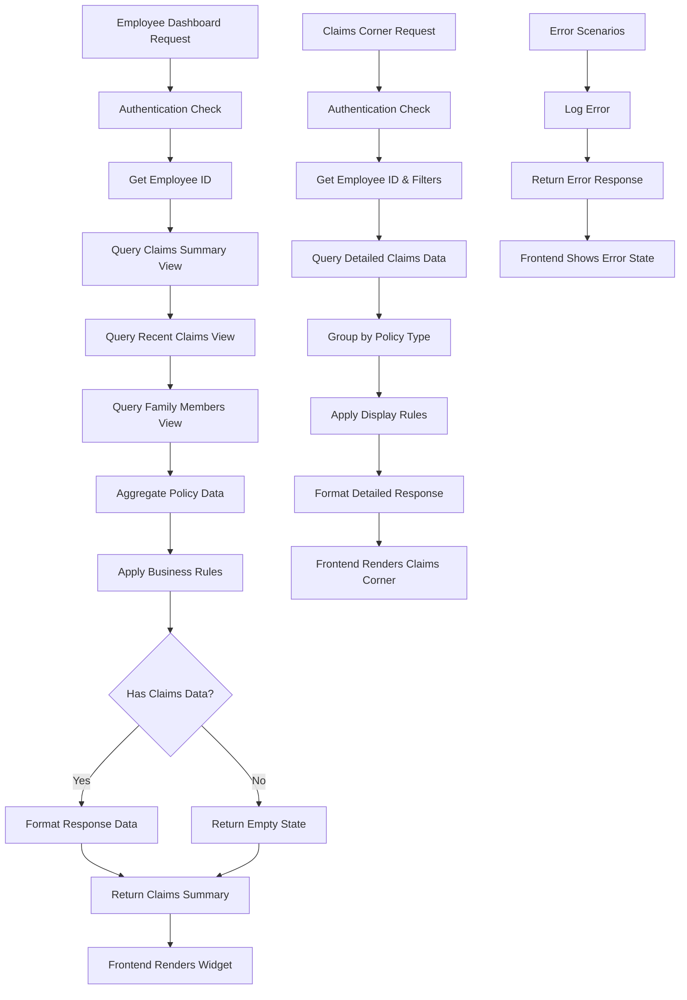

# TRD - Phase 1

## 1. Component Overview

- **Purpose:** Implement Claims Summary functionality for the IBP Employee Portal, enabling employees to view their insurance claim information in a clear, intuitive dashboard and dedicated Claims Corner screen.
- **Scope:** Claims Summary Dashboard Widget, Claims Corner Screen, and supporting backend APIs for claim data retrieval and processing.
- **Phase 1 Scope:** 
  - Claims Summary Widget on Dashboard
  - Claims Corner Screen with policy-wise claim details
  - Backend APIs for claim data aggregation and retrieval
  - Support for GMC, GPA, GTL policy types
  - Employee and dependent claim tracking
- **Dependencies:** 
  - IBP Service (existing)
  - Policy Service (existing claims upload functionality)
  - Service Registry (existing)
  - Authentication Service (existing)
- **Dependents:** Future Claims functionality phases (detailed claims tracking, claim submission workflow)

## 2. Functional Requirements

List of functional requirements this component must fulfill:
- **FR-CLAIMS-001:** Display policy-level claim statistics on employee dashboard
- **FR-CLAIMS-002:** Show claim status summary (Total, Settled, Pending) for employee and dependents
- **FR-CLAIMS-003:** Display policy information (Policy Number, Expiry, Sum Insured, Available Amount)
- **FR-CLAIMS-004:** List recent claims with details (Name, Date, Amount, Status, Reference Number)
- **FR-CLAIMS-005:** Show family members covered under GMC policies
- **FR-CLAIMS-006:** Support multiple policy types (GMC, GPA, GTL) with type-specific displays
- **FR-CLAIMS-007:** Navigate from dashboard widget to dedicated Claims Corner screen
- **FR-CLAIMS-008:** Display separate cards for Base and Parent policies in GMC
- **FR-CLAIMS-009:** Handle empty states gracefully with appropriate messaging
- **FR-CLAIMS-010:** Provide responsive layout for desktop and mobile devices

## 3. Component Interface

### 3.1 Public API

```typescript
// IBP Service - Claims Controller
interface ClaimsAPI {
  // Get claims summary for employee dashboard
  getEmployeeClaimsSummary(employeeId: number): Promise<EmployeeClaimsSummaryResponse>;
  
  // Get detailed claims for Claims Corner screen
  getEmployeeClaimsDetails(employeeId: number, policyType?: string): Promise<EmployeeClaimsDetailsResponse>;
  
  // Get family members for policy
  getFamilyMembers(employeeId: number, policyId: number): Promise<FamilyMembersResponse>;
}

// Frontend API Interface
interface ClaimsWidgetAPI {
  // Render claims summary widget
  renderClaimsSummary(data: ClaimsSummaryData): JSX.Element;
  
  // Navigate to Claims Corner
  navigateToClaimsCorner(): void;
  
  // Handle widget interactions
  onViewAllClaims(): void;
  onUpdateDependents(): void;
}
```

### 3.2 Input/Output Contracts

**Inputs:**
- Employee ID (from authentication context)
- Policy Type filter (optional for Claims Corner)
- Date range filters (optional)

**Outputs:**
- Claims Summary Data with policy-level aggregations
- Recent Claims List with claim details
- Family Members List for GMC policies
- Policy Information with coverage details

**Data Formats:**
```typescript
interface ClaimsSummaryData {
  policyGroups: PolicyGroup[];
  hasAnyClaims: boolean;
}

interface PolicyGroup {
  policyType: 'GMC' | 'GPA' | 'GTL';
  policies: PolicyClaimInfo[];
}

interface PolicyClaimInfo {
  policyId: number;
  policyNumber: string;
  policyType: 'BASE' | 'PARENT';
  policyExpiry: Date;
  totalSumInsured: number;
  availableAmount: number;
  totalClaimedAmount: number;
  claimsSummary: ClaimsSummary;
  recentClaims: RecentClaim[];
  familyMembers?: FamilyMember[];
}

interface ClaimsSummary {
  totalClaims: number;
  settledClaims: number;
  pendingClaims: number;
}

interface RecentClaim {
  claimId: number;
  claimNumber: string;
  memberName: string;
  relationship: string;
  claimRequestedDate: Date;
  claimAmount: number;
  claimStatus: 'Settled' | 'Pending';
}

interface FamilyMember {
  memberId: number;
  memberName: string;
  relationship: string;
  isEmployee: boolean;
}
```

### 3.3 Error Handling

**Error Types:**
- `NoClaimsFoundError`: When employee has no claims data
- `PolicyNotFoundError`: When policy information is missing
- `DataRetrievalError`: When backend services are unavailable
- `AuthorizationError`: When employee lacks access to claim data

**Error Responses:**
```typescript
interface ErrorResponse {
  error: {
    code: string;
    message: string;
    details?: any;
  };
  timestamp: string;
  path: string;
}
```

**Recovery Strategies:**
- Graceful degradation with empty state messages
- Retry mechanisms for transient failures
- Fallback to cached data when available
- User-friendly error messages with support contact information

## 4. Data Model

### 4.1 Data Storage

**Storage Type:** Existing PostgreSQL database with additional views/procedures for aggregation

**Data Schema:** Extends existing entities with new views and procedures

```sql
-- Create view for employee claims summary aggregation
CREATE OR REPLACE VIEW vw_employee_claims_summary AS
SELECT 
    pec.employee_id,
    p.id as policy_id,
    p.policy_number,
    p.policy_type_key,
    p.policy_expiry_date,
    p.total_sum_insured,
    p.available_amount,
    COUNT(pec.id) as total_claims,
    COUNT(CASE WHEN pec.claim_status = 'Settled' THEN 1 END) as settled_claims,
    COUNT(CASE WHEN pec.claim_status = 'Pending' THEN 1 END) as pending_claims,
    COALESCE(SUM(pec.claim_amount), 0) as total_claimed_amount
FROM policy_claim pec
INNER JOIN policy p ON pec.policy_id = p.id
WHERE pec.deleted_at IS NULL
GROUP BY pec.employee_id, p.id, p.policy_number, p.policy_type_key, 
         p.policy_expiry_date, p.total_sum_insured, p.available_amount;

-- Create view for recent claims
CREATE OR REPLACE VIEW vw_employee_recent_claims AS
SELECT 
    pec.employee_id,
    pec.policy_id,
    pec.id as claim_id,
    pec.claim_number,
    CASE 
        WHEN pec.dependent_id IS NULL THEN 'Self'
        ELSE ped.dependent_name
    END as member_name,
    CASE 
        WHEN pec.dependent_id IS NULL THEN 'Employee'
        ELSE ped.relationship
    END as relationship,
    pec.claim_date as claim_requested_date,
    pec.claim_amount,
    pec.claim_status,
    ROW_NUMBER() OVER (PARTITION BY pec.employee_id, pec.policy_id ORDER BY pec.claim_date DESC) as rn
FROM policy_claim pec
LEFT JOIN policy_enrollment_dependent ped ON pec.dependent_id = ped.id
WHERE pec.deleted_at IS NULL
  AND pec.claim_date IS NOT NULL;

-- Create view for family members
CREATE OR REPLACE VIEW vw_policy_family_members AS
SELECT 
    pee.id as employee_id,
    pee.policy_id,
    pee.employee_name as member_name,
    'Employee' as relationship,
    true as is_employee,
    1 as sort_order
FROM policy_enrollment_employee pee
WHERE pee.deleted_at IS NULL

UNION ALL

SELECT 
    ped.employee_id,
    ped.policy_id,
    ped.dependent_name as member_name,
    ped.relationship,
    false as is_employee,
    2 as sort_order
FROM policy_enrollment_dependent ped
WHERE ped.deleted_at IS NULL
  AND ped.is_enrolled = true;
```

### 4.2 Data Flow



### 4.3 Data Validation

**Input Validation:**
- Employee ID: Required, must be valid integer
- Policy Type: Optional, must be one of ['GMC', 'GPA', 'GTL']
- Date Range: Optional, must be valid date range with end date >= start date

**Business Rules:**
- Only show claims for policies where employee is enrolled
- Calculate available amount as (Total Sum Insured - Sum of Approved Claims)
- Group claims by policy type and policy base/parent classification
- Show family members only for GMC policies
- Recent claims limited to last 5 claims per policy

**Data Integrity:**
- Ensure claim amounts are non-negative
- Validate policy expiry dates are future dates for active policies
- Check employee enrollment status before showing claims
- Verify dependent relationships are valid

## 5. Technology Stack

### 5.1 Core Technologies

**Backend:**
- **Programming Language:** TypeScript (Node.js 18+)
- **Framework:** NestJS 10.x
- **Database:** PostgreSQL 14+
- **ORM:** TypeORM 0.3.x
- **Validation:** class-validator, class-transformer

**Frontend:**
- **Programming Language:** TypeScript
- **Framework:** React 18.x
- **Build Tool:** Vite 4.x
- **State Management:** Redux Toolkit
- **Styling:** Styled Components, Material-UI
- **HTTP Client:** Axios (via @ui/ui-lib)

**Additional Libraries:**
- **Caching:** Redis (for performance optimization)
- **Logging:** Winston (existing service-lib logger)
- **API Documentation:** Swagger/OpenAPI
- **Testing:** Jest, React Testing Library

### 5.2 Technology Rationale

**Why These Choices:**
- NestJS provides robust dependency injection and modular architecture
- TypeORM offers type-safe database operations with existing entity structure
- React with TypeScript ensures type safety across full stack
- Styled Components maintain consistency with existing IBP UI patterns
- Redis caching improves performance for frequently accessed claim data

**Alternatives Considered:**
- GraphQL instead of REST (rejected for consistency with existing APIs)
- Prisma instead of TypeORM (rejected to maintain existing ORM choice)
- Emotion instead of Styled Components (rejected for consistency)

**Trade-offs:**
- TypeORM complexity vs. type safety benefits
- Additional Redis dependency vs. performance gains
- Comprehensive error handling vs. implementation complexity

## 6. Integration Design

### 6.1 Dependency Integration

**IBP Service Integration:**
- **Integration Method:** Direct service method calls within IBP service
- **Communication:** Internal service calls, no external HTTP requests
- **Data Exchange:** TypeScript interfaces with type safety

**Policy Service Integration:**
- **Integration Method:** HTTP API calls via service registry
- **Communication:** REST endpoints with JSON payload
- **Data Exchange:** Claim data already synchronized via existing upload mechanism
- **Authentication:** JWT token forwarding for security

**Service Registry Integration:**
- **Integration Method:** Service discovery for policy service endpoints
- **Communication:** HTTP registration and discovery
- **Data Exchange:** Service metadata and health status

### 6.2 Service Integration

**Database Integration:**
- **Connection:** Existing TypeORM connection via service-lib
- **Transactions:** Use database transactions for data consistency
- **Connection Pooling:** Utilize existing connection pool configuration

**Caching Integration:**
- **Cache Strategy:** Cache frequently accessed claim summaries for 5 minutes
- **Cache Keys:** `claims_summary:${employeeId}`, `claims_details:${employeeId}:${policyType}`
- **Cache Invalidation:** Time-based expiration with manual invalidation on claim updates

**Authentication Integration:**
- **Method:** JWT token validation via existing auth guard
- **Employee Context:** Extract employee ID from JWT token payload
- **Authorization:** Verify employee access to claim data

## 7. Performance Considerations

### 7.1 Performance Requirements

**Response Time:**
- Claims Summary API: < 500ms for 95th percentile
- Claims Corner API: < 1s for 95th percentile
- Widget Render Time: < 200ms initial load

**Throughput:**
- Support 100 concurrent users per service instance
- Handle 1000 requests per minute during peak hours

**Scalability:**
- Horizontal scaling via multiple service instances
- Database connection pooling for concurrent requests
- Caching layer to reduce database load

### 7.2 Performance Strategies

**Caching:**
- Redis cache for claims summary data (5-minute TTL)
- Browser cache for static assets (24-hour TTL)
- Database query result caching for lookup data

**Database Optimization:**
- Indexed views for claims aggregation queries
- Composite indexes on (employee_id, policy_id, claim_date)
- Query optimization with EXPLAIN ANALYZE monitoring
- Connection pooling with max 20 connections per service

**Resource Management:**
- Memory optimization with streaming for large datasets
- CPU optimization with async/await patterns
- I/O optimization with batched database operations
- Garbage collection tuning for Node.js heap management

## 8. Security Design

### 8.1 Security Requirements

**Authentication:**
- JWT token validation for all API endpoints
- Employee session management via existing auth service
- Token expiration and refresh handling

**Authorization:**
- Employee can only access their own claim data
- Role-based access control via existing ACL system
- Data filtering based on employee enrollment status

**Data Protection:**
- PII encryption for sensitive claim information
- Secure data transmission via HTTPS
- Database field-level encryption for claim amounts

### 8.2 Security Implementation

**Encryption:**
- AES-256 encryption for sensitive claim data at rest
- TLS 1.3 for data in transit
- JWT token signing with RS256 algorithm

**Input Sanitization:**
- SQL injection prevention via parameterized queries
- XSS prevention via input validation and output encoding
- Request size limiting to prevent DoS attacks

**Audit Logging:**
- Log all claim data access with employee ID and timestamp
- Security event logging for unauthorized access attempts
- Audit trail for claim data modifications

## 9. Monitoring & Observability

### 9.1 Logging

**Log Levels:**
- ERROR: API failures, database connection issues, authentication failures
- WARN: Performance degradation, cache misses, rate limiting
- INFO: API requests, successful operations, cache hits
- DEBUG: Detailed execution flow for troubleshooting

**Log Format:**
```typescript
interface LogEntry {
  timestamp: string;
  level: 'ERROR' | 'WARN' | 'INFO' | 'DEBUG';
  service: 'ibp-service';
  component: 'claims-controller' | 'claims-service';
  traceId: string;
  employeeId?: number;
  action: string;
  duration?: number;
  error?: string;
  metadata?: Record<string, any>;
}
```

**Sensitive Data:**
- Never log claim amounts or personal health information
- Mask employee names in logs (show only first letter + asterisks)
- Exclude PII from error stack traces

### 9.2 Metrics

**Performance Metrics:**
- API response times (p50, p95, p99)
- Database query execution times
- Cache hit/miss ratios
- Memory and CPU utilization

**Business Metrics:**
- Claims widget view count
- Claims Corner navigation rate
- Error rate by endpoint
- Active employees using claims functionality

**Alerting:**
- API response time > 2s for 5 consecutive minutes
- Error rate > 5% for 3 consecutive minutes
- Database connection pool exhaustion
- Cache service unavailability

## 10. Testing Strategy

### 10.1 Unit Testing

**Test Coverage:** 90% minimum code coverage target

**Key Test Cases:**
```typescript
describe('ClaimsService', () => {
  describe('getEmployeeClaimsSummary', () => {
    it('should return claims summary for valid employee');
    it('should handle employee with no claims');
    it('should filter by policy type when specified');
    it('should throw error for invalid employee ID');
  });

  describe('aggregateClaimsData', () => {
    it('should calculate correct claim totals');
    it('should group claims by policy type');
    it('should separate base and parent policies');
  });
});

describe('ClaimsSummaryWidget', () => {
  it('should render widget with claims data');
  it('should show empty state when no claims');
  it('should handle loading states');
  it('should navigate to Claims Corner on click');
});
```

**Mock Dependencies:**
- Database repositories mocked with jest.fn()
- External service calls mocked with MSW (Mock Service Worker)
- Authentication context mocked for different user roles

### 10.2 Integration Testing

**Integration Points:**
- Claims API endpoints with real database
- Frontend widget with mocked API responses
- Caching layer integration with Redis

**Test Data:**
- Seed database with test employee and claim data
- Multiple policy types (GMC, GPA, GTL) with different scenarios
- Edge cases: expired policies, claims without amounts, missing dependents

**Environment Requirements:**
- Test database with isolated schemas per test suite
- Redis test instance for caching tests
- JWT tokens for authentication testing

## 11. Deployment Considerations

### 11.1 Environment Requirements

**Infrastructure:**
- Container deployment via existing Docker setup
- Kubernetes cluster with minimum 2 replicas
- Load balancer for traffic distribution
- Redis cluster for caching (3 nodes recommended)

**Configuration:**
```typescript
interface ClaimsConfig {
  database: {
    connectionPool: number; // 20
    queryTimeout: number; // 30000ms
  };
  cache: {
    ttl: number; // 300 seconds
    maxSize: number; // 1000 entries
  };
  api: {
    rateLimit: number; // 100 requests/minute
    timeout: number; // 10000ms
  };
}
```

**Secrets Management:**
- Database credentials via Kubernetes secrets
- JWT signing keys via secure key management
- Redis connection strings via environment variables

### 11.2 Deployment Strategy

**Build Process:**
1. TypeScript compilation with type checking
2. Unit test execution with coverage validation
3. Docker image building with multi-stage builds
4. Container security scanning
5. Integration test execution against staging

**Deployment Steps:**
1. Deploy backend service with rolling update strategy
2. Run database migrations if schema changes exist
3. Deploy frontend build to CDN
4. Update API gateway routing if needed
5. Verify health checks and monitoring

**Rollback Plan:**
1. Revert to previous container image version
2. Rollback database migrations if necessary
3. Restore previous frontend build
4. Verify system functionality with health checks

## 12. Risk Mitigation

**Performance Risk:**
- **Risk:** High database load during peak usage
- **Mitigation:** Implement caching layer and database query optimization
- **Contingency:** Scale database read replicas and implement circuit breakers

**Data Consistency Risk:**
- **Risk:** Claims data inconsistency between services
- **Mitigation:** Use database transactions and event-driven updates
- **Contingency:** Implement data reconciliation processes and manual data fixes

**Security Risk:**
- **Risk:** Unauthorized access to sensitive claim information
- **Mitigation:** Implement robust authentication and authorization
- **Contingency:** Audit logging and incident response procedures

**Integration Risk:**
- **Risk:** Policy service unavailability affecting claim data
- **Mitigation:** Implement circuit breakers and graceful degradation
- **Contingency:** Fallback to cached data and user notification system

## 13. Future Considerations

**Extensibility:**
- Plugin architecture for additional claim types
- Configurable business rules for claim status calculations
- API versioning strategy for backward compatibility

**Migration Path:**
- Gradual rollout with feature flags
- A/B testing for widget placement and design
- Progressive enhancement for mobile responsiveness

**Deprecation Strategy:**
- Sunset plan for legacy claim viewing mechanisms
- Data migration tools for historical claim data
- User communication plan for feature transitions

**Scalability Enhancements:**
- Event-sourcing for claim state changes
- GraphQL federation for complex data requirements
- Microservice decomposition for specialized claim processing