# Claims Corner — End-to-End Process Flow

Single comprehensive UML flowchart covering the full claims journey: Dashboard → Claims Corner → Claim Intimation (pre-admission) → Claim Submission (post-treatment, Path A linked / Path B AI).

---

```mermaid
flowchart TD

    LOGIN([Employee Logs In]) --> DASH_LOAD

    %% ════════════════════════════════════════
    %%  1. DASHBOARD
    %% ════════════════════════════════════════
    subgraph DASHBOARD["① Dashboard"]
        DASH_LOAD[Dashboard loads]
        DASH_BANNER[Claims Corner awareness banner shown\nCTA: Go to Claim Submission]
        DASH_WIDGET_Q{Claims data\nexists?}
        DASH_WIDGET[Claims Summary Widget\nshown per policy]
        DASH_HIDE[Widget hidden\nno claims on record]

        DASH_LOAD --> DASH_BANNER
        DASH_LOAD --> DASH_WIDGET_Q
        DASH_WIDGET_Q -- Yes --> DASH_WIDGET
        DASH_WIDGET_Q -- No --> DASH_HIDE
    end

    DASH_BANNER    -- CTA clicked          --> CC_LOAD
    DASH_WIDGET    -- Claims Corner nav    --> CC_LOAD
    DASH_HIDE      -- Claims Corner nav    --> CC_LOAD

    %% ════════════════════════════════════════
    %%  2. CLAIMS CORNER
    %% ════════════════════════════════════════
    subgraph CLAIMSCORNER["② Claims Corner"]
        CC_LOAD[GET /employees/id/claims-overview\nLoads overnight batch data]
        CC_POLICIES_Q{Policies\nreturned?}
        CC_EMPTY[Empty state — No claims found]
        CC_CARDS[Render policy cards\nGMC / GPA / GTL]
        CC_HEADER[Conversational UX intro section visible\nWhatsApp QR support widget shown\nLast Synced At timestamp in header]

        CC_LOAD --> CC_POLICIES_Q
        CC_POLICIES_Q -- No  --> CC_EMPTY
        CC_POLICIES_Q -- Yes --> CC_CARDS
        CC_CARDS --> CC_HEADER

        CC_CARDS --> CC_POLNUM_Q{policyNumber\npresent?}
        CC_POLNUM_Q -- Yes --> CC_REFRESH_BTN[Refresh Claim Status button shown]
        CC_POLNUM_Q -- No  --> CC_NO_REFRESH[No refresh button for this policy]

        CC_REFRESH_BTN -- Employee clicks --> CC_SYNC[GET /tpa/claims-sync\nButton shows loading state]
        CC_SYNC --> CC_SYNC_Q{TPA sync\nresult?}
        CC_SYNC_Q -- Claims returned --> CC_SYNC_OK[TPA live claims section updated]
        CC_SYNC_Q -- Empty or error  --> CC_SYNC_EMPTY[TPA section shows empty]

        CC_CARDS --> CC_ACTION{Employee\naction?}
    end

    %% ─── TPA SSO ──────────────────────────────────────────────
    CC_ACTION -- Claim No / Status / TPA Name click --> DEPART_MODAL[Departure confirmation modal\nYou are navigating to the TPA website]
    DEPART_MODAL --> DEPART_Q{Employee\nconfirms?}
    DEPART_Q -- Cancel    --> DEPART_CANCEL[Modal closed\nStay on Claims Corner]
    DEPART_Q -- Continue  --> SSO_CALL[GET /employees/id/tpa-portal-sso\nOpen new browser tab]
    SSO_CALL --> SSO_Q{SSO\nresponse?}
    SSO_Q -- redirectUrl --> SSO_OK([TPA portal opened in new tab])
    SSO_Q -- Error        --> SSO_ERR[Toast: Redirect failed]

    %% ─── Life Event ───────────────────────────────────────────
    CC_ACTION -- Life Event CTA --> LE_FLAG_Q{Feature flag\nenabled?}
    LE_FLAG_Q -- Yes --> LE_NAV([Navigate to /life-events])
    LE_FLAG_Q -- No  --> LE_ERR[Toast: Enrolment period not complete]

    %% ─── Route to claim flows ─────────────────────────────────
    CC_ACTION -- File Intimation --> CI_ENTRY([Start Claim Intimation])
    CC_ACTION -- Submit Claim    --> CS_ENTRY([Start Claim Submission])

    %% ════════════════════════════════════════
    %%  3. CLAIM INTIMATION — PRE-ADMISSION
    %% ════════════════════════════════════════
    subgraph INTIMATION["③ Claim Intimation — Pre-Admission"]

        CI_S1_POL[STEP 1 — Select Policy\nGMC / GPA / Top-Up    GTL excluded]
        CI_S1_DEP[Select Claimant\nSelf or Dependent]
        CI_S1_CHG{Policy\nchanged?}
        CI_S1_FILTER[Filter dependents to new policy\nClear prior selection]
        CI_S1_OK{Policy and claimant\nboth selected?}
        CI_S1_ERR[Inline error shown\nContinue blocked]
        CI_S1_NEXT[Continue to Step 2]

        CI_S2_TYPE{STEP 2 — Policy type?}
        CI_S2_GMC[GMC: Claim Type selector\nDiagnosis / Admission Date / Discharge Date]
        CI_S2_GPA[GPA: Accident Details / Amount\nDate and Place of Accident]
        CI_S2_VAL{Validation\npasses?}
        CI_S2_AMT_ERR[Error: Amount exceeds sum insured]
        CI_S2_DATE_ERR[Error: Discharge before Admission]
        CI_S2_NEXT[Continue to Step 3]

        CI_S3_HOSP_Q{STEP 3 — GMC policy?}
        CI_S3_SEARCH[Search network hospitals]
        CI_S3_FOUND{Hospital\nfound?}
        CI_S3_AUTO[Auto-fill hospital name and location]
        CI_S3_MANUAL[Manual hospital entry]
        CI_S3_SKIP[Skip hospital section GPA]
        CI_S3_DOCS[Upload pre-admission documents]
        CI_S3_DOCS_Q{Required docs\nuploaded?}
        CI_S3_BLOCKED[Submit disabled]
        CI_S3_READY[Submit enabled]

        CI_S1_POL --> CI_S1_DEP --> CI_S1_CHG
        CI_S1_CHG -- Yes --> CI_S1_FILTER --> CI_S1_OK
        CI_S1_CHG -- No  --> CI_S1_OK
        CI_S1_OK -- No  --> CI_S1_ERR
        CI_S1_OK -- Yes --> CI_S1_NEXT

        CI_S1_NEXT --> CI_S2_TYPE
        CI_S2_TYPE -- GMC / Top-Up --> CI_S2_GMC --> CI_S2_VAL
        CI_S2_TYPE -- GPA          --> CI_S2_GPA --> CI_S2_VAL
        CI_S2_VAL -- Amount invalid --> CI_S2_AMT_ERR  --> CI_S2_GMC
        CI_S2_VAL -- Date invalid   --> CI_S2_DATE_ERR --> CI_S2_GMC
        CI_S2_VAL -- All valid      --> CI_S2_NEXT

        CI_S2_NEXT --> CI_S3_HOSP_Q
        CI_S3_HOSP_Q -- Yes GMC --> CI_S3_SEARCH --> CI_S3_FOUND
        CI_S3_FOUND  -- Yes     --> CI_S3_AUTO   --> CI_S3_DOCS
        CI_S3_FOUND  -- No      --> CI_S3_MANUAL --> CI_S3_DOCS
        CI_S3_HOSP_Q -- No GPA  --> CI_S3_SKIP   --> CI_S3_DOCS
        CI_S3_DOCS --> CI_S3_DOCS_Q
        CI_S3_DOCS_Q -- No  --> CI_S3_BLOCKED
        CI_S3_DOCS_Q -- Yes --> CI_S3_READY
        CI_S3_BLOCKED -. employee uploads .-> CI_S3_DOCS_Q

    end

    CI_ENTRY --> CI_S1_POL

    CI_S3_READY -- Employee submits --> CI_POST[POST /claims/intimation]
    CI_POST --> CI_RESP_Q{API\nresponse?}
    CI_RESP_Q -- Success --> CI_NOTIF[POST /claims/intimation-confirmation\nfire and forget]
    CI_NOTIF  --> CI_TOAST[Toast: Intimation submitted successfully]
    CI_TOAST  --> CC_RETURN([Return to Claims Corner])
    CI_RESP_Q -- Error --> CI_ERR[Toast: Submission failed\nStay on Step 3]

    %% ════════════════════════════════════════
    %%  4. CLAIM SUBMISSION — POST-TREATMENT
    %% ════════════════════════════════════════
    subgraph SUBMISSION["④ Claim Submission — Post-Treatment"]

        CS_INTIM_Q{Existing Claim\nIntimations on file?}

        CS_A_LIST[PATH A — Show list of employee Intimations]
        CS_A_SEL{Employee selects\nan Intimation?}
        CS_A_FILL[Pre-fill from Intimation:\npolicy / claimant / diagnosis / hospital / dates]

        CS_B_FORM[PATH B — Empty form\nEmployee fills all details manually]

        CS_DOCS[Upload post-treatment documents\nClaim Form / Discharge Summary / others]

        CS_AI_Q{Path B active:\nAI extraction needed?}
        CS_AI_CALL[POST /claims/document-extract\nAI reads Claim Form and Discharge Summary]
        CS_AI_FILL[Pre-fill extracted fields:\ndiagnosis / hospital / dates / amounts]
        CS_AI_REVIEW[Employee reviews and edits\nAI-extracted data]

        CS_DOCS_Q{Required docs\nuploaded?}
        CS_BLOCKED[Submit disabled]
        CS_READY[Submit enabled]

        CS_INTIM_Q -- Yes --> CS_A_LIST --> CS_A_SEL
        CS_INTIM_Q -- No  --> CS_B_FORM
        CS_A_SEL -- Yes --> CS_A_FILL --> CS_DOCS
        CS_A_SEL -- No  --> CS_B_FORM
        CS_B_FORM --> CS_DOCS
        CS_DOCS --> CS_AI_Q
        CS_AI_Q -- Yes Path B --> CS_AI_CALL --> CS_AI_FILL --> CS_AI_REVIEW --> CS_DOCS_Q
        CS_AI_Q -- No Path A  --> CS_DOCS_Q
        CS_DOCS_Q -- No  --> CS_BLOCKED
        CS_DOCS_Q -- Yes --> CS_READY
        CS_BLOCKED -. employee uploads .-> CS_DOCS_Q

    end

    CS_ENTRY --> CS_INTIM_Q

    CS_READY -- Employee submits --> CS_POST[POST /claims/upload]
    CS_POST --> CS_RESP_Q{API\nresponse?}
    CS_RESP_Q -- Success --> CS_NOTIF[POST /claims/intimation-confirmation\nfire and forget]
    CS_NOTIF  --> CS_TOAST[Toast: Claim submitted successfully]
    CS_TOAST  --> CC_FINAL([Claims Corner: new claim now visible])
    CS_RESP_Q -- Error --> CS_ERR[Toast: Submission failed\nStay on review step]

    %% ════════════════════════════════════════
    %%  STYLES
    %% ════════════════════════════════════════
    style CC_EMPTY       fill:#FEF3C7,stroke:#D97706
    style DEPART_CANCEL  fill:#FEF3C7,stroke:#D97706
    style CC_SYNC_EMPTY  fill:#FEF3C7,stroke:#D97706
    style CI_S1_ERR      fill:#FEE2E2,stroke:#DC2626
    style CI_S2_AMT_ERR  fill:#FEE2E2,stroke:#DC2626
    style CI_S2_DATE_ERR fill:#FEE2E2,stroke:#DC2626
    style CI_S3_BLOCKED  fill:#FEF3C7,stroke:#D97706
    style CI_ERR         fill:#FEE2E2,stroke:#DC2626
    style CS_BLOCKED     fill:#FEF3C7,stroke:#D97706
    style CS_ERR         fill:#FEE2E2,stroke:#DC2626
    style SSO_ERR        fill:#FEE2E2,stroke:#DC2626
    style LE_ERR         fill:#FEE2E2,stroke:#DC2626
    style CI_TOAST       fill:#DCFCE7,stroke:#16A34A
    style CS_TOAST       fill:#DCFCE7,stroke:#16A34A
    style SSO_OK         fill:#DBEAFE,stroke:#2563EB
    style LE_NAV         fill:#DCFCE7,stroke:#16A34A
    style CC_FINAL       fill:#DCFCE7,stroke:#16A34A
    style CC_RETURN      fill:#DCFCE7,stroke:#16A34A
```

