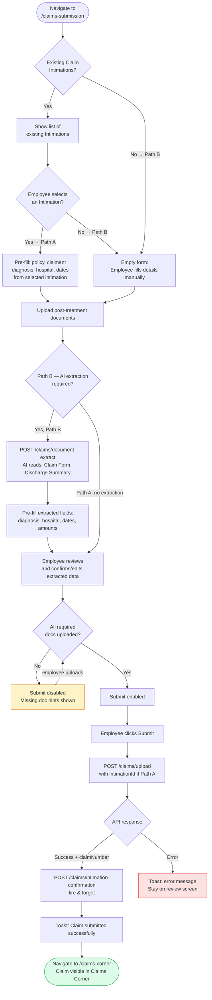
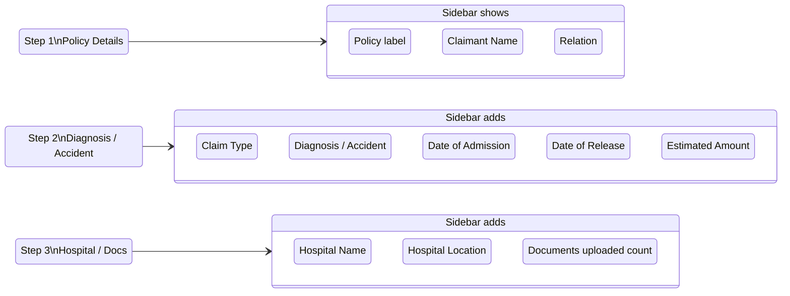

# Claims Corner — Process Flow Diagram

> **Updated 4-Jun-2026:** Reflects overnight batch sync + manual refresh (no auto-poll), two-stage claim process (Intimation pre-admission / Submission post-treatment), TPA SSO triggers on claim row clicks, TPA Name label, and departure confirmation modal.

Four diagrams below: Claims Corner viewing flow, Claim Intimation wizard, Claim Submission (both paths), and Claim Summary Sidebar state.

---

## 1. Claims Corner — Viewing Flow

```mermaid
flowchart TD
    A([Employee Logs In]) --> B[Dashboard loads]

    B --> BB[Dashboard Claims Corner\nawareness banner shown]
    BB --> BC{CTA clicked?}
    BC -- Yes --> BD([Navigate to\nClaim Submission])
    BC -- No --> C

    B --> C{Claims data\nexists?}
    C -- No --> D[Claims Summary Widget\nhidden on dashboard]
    C -- Yes --> E[Claims Summary Widget\nshown per policy]

    E --> F[Employee clicks\nClaims Corner tab]
    D --> F

    F --> G[GET /employees/:id/claims-overview\nReturns: policies, lastSyncedAt, tpaName]
    G --> H{Policies\nreturned?}

    H -- No / empty --> I[Empty state:\nNo claims found]
    H -- Yes --> J[Render policy cards\nGMC / GPA / GTL]

    J --> K[Display per policy card:\nPolicy info · Coverage · Claims list\nStatus counts · Add-ons · Premium\n"Last Synced At" in header]

    J --> L{Policy has\npolicyNumber?}
    L -- Yes --> M["Refresh Claim Status"\nbutton shown per policy]
    L -- No --> N[Refresh button hidden\nfor this policy]

    M --> MA{Employee clicks\nRefresh?}
    MA -- Yes --> MB[GET /tpa/claims-sync\nShow loading state on button]
    MB --> MC{TPA response}
    MC -- claims returned --> MD[Update TPA Live Claims\nsection for this policy]
    MC -- error / empty --> ME[Show empty state\nfor TPA section]

    K --> S{User action}
    S -- Claim number / Status\nor TPA Name click --> T1[Show departure\nconfirmation modal]
    T1 --> T2{Employee confirms?}
    T2 -- Yes --> T3[GET /employees/:id/tpa-portal-sso\nOpen in new tab → redirect]
    T2 -- No / Cancel --> T4[Modal closed\nStay on Claims Corner]
    S -- File Intimation button --> U[Navigate to\n/claims-intimation]
    S -- Submit Claim button --> UA[Navigate to\n/claims-submission]
    S -- Update Now\nLife Event card --> V{Feature flag\nenabled?}
    V -- Yes + policy qualifies --> W[Navigate to /life-events]
    V -- No --> X[Toast: Enrolment\nperiod not complete]

    style I fill:#FEF3C7,stroke:#D97706
    style ME fill:#FEF3C7,stroke:#D97706
    style T4 fill:#FEF3C7,stroke:#D97706
    style X fill:#FEE2E2,stroke:#DC2626
    style W fill:#DCFCE7,stroke:#16A34A
    style T3 fill:#DBEAFE,stroke:#2563EB
    style U fill:#DBEAFE,stroke:#2563EB
    style UA fill:#DBEAFE,stroke:#2563EB
    style BD fill:#DBEAFE,stroke:#2563EB
```

---

## 2. Claim Intimation — Pre-Admission 3-Step Wizard

```mermaid
flowchart TD
    A([Navigate to\n/claims-intimation]) --> B[Load enrolled policies\nfrom Redux store]
    B --> C[Default select first\nGMC policy]

    C --> STEP1

    subgraph STEP1["Step 1 — Policy Details"]
        D[Select Policy Type\nGMC · GPA · Top-Up\nGTL excluded] --> E[Select Claimant\nSelf · Dependent]
        E --> F{Policy changed?}
        F -- Yes --> G[Filter dependents\nto new policy\nClear invalid selection]
        G --> F2{All selected?}
        F -- No --> F2
        F2 -- No --> H[Inline error shown\nContinue blocked]
        F2 -- Yes --> I[Continue →]
    end

    I --> STEP2

    subgraph STEP2["Step 2 — Diagnosis / Accident Details"]
        J{Policy type?}
        J -- GMC / Top-Up --> K[Show Claim Type selector\nCashless · Reimbursement]
        K --> L[Fill: Description · Estimated Amount\nDate of Admission · Discharge Date]
        J -- GPA --> M[Fill: Accident Details · Estimated Amount\nDate of Accident · Place of Accident]
        L --> N{Validation}
        M --> N
        N -- Amount > Sum Insured --> O[Error: exceeds\nsum insured limit]
        N -- Discharge ≤ Admission --> P[Error: discharge must\nbe after admission]
        N -- All valid --> Q[Continue →]
        O --> L
        P --> L
    end

    Q --> STEP3

    subgraph STEP3["Step 3 — Hospital Details & Pre-Admission Documents"]
        R{GMC policy?}
        R -- Yes --> S[Hospital search\nSearch network hospitals]
        S --> T{Hospital found?}
        T -- Yes → select --> U[Auto-fill: Name · Location\nCity · State · Pincode]
        T -- No → manual --> V[Manual entry:\nName* · Country · State · City\nLocation · Pincode]
        R -- No GPA --> W[Skip hospital section]

        U --> X[Pre-Admission Document Upload]
        V --> X
        W --> X

        X --> Y{Claim type?}
        Y -- CASHLESS --> Z[Required: GHPL Card*\nPAN & Aadhar*]
        Y -- REIMBURSEMENT / GPA --> AA[Required: Claim Form A & B*]

        Z --> BB{All required\ndocs uploaded?}
        AA --> BB
        BB -- No --> CC[Submit disabled]
        BB -- Yes --> EE[Submit enabled]
    end

    EE --> FF[Employee clicks Submit]
    FF --> GG[POST /claims/intimation]

    GG --> HH{API response}
    HH -- Success --> II[POST /claims/intimation-confirmation\nfire & forget]
    II --> JJ[Toast: Intimation submitted successfully]
    JJ --> KK([Navigate to /claims-corner])

    HH -- Error --> LL[Toast: error message\nStay on Step 3]

    style O fill:#FEE2E2,stroke:#DC2626
    style P fill:#FEE2E2,stroke:#DC2626
    style CC fill:#FEF3C7,stroke:#D97706
    style KK fill:#DCFCE7,stroke:#16A34A
    style LL fill:#FEE2E2,stroke:#DC2626
```



---

## 3. Claim Submission — Post-Treatment (Two Paths)



---

## 4. Claim Submission — Claim Summary Sidebar (Live State)

The sidebar tracks inputs in real time across all three steps.


