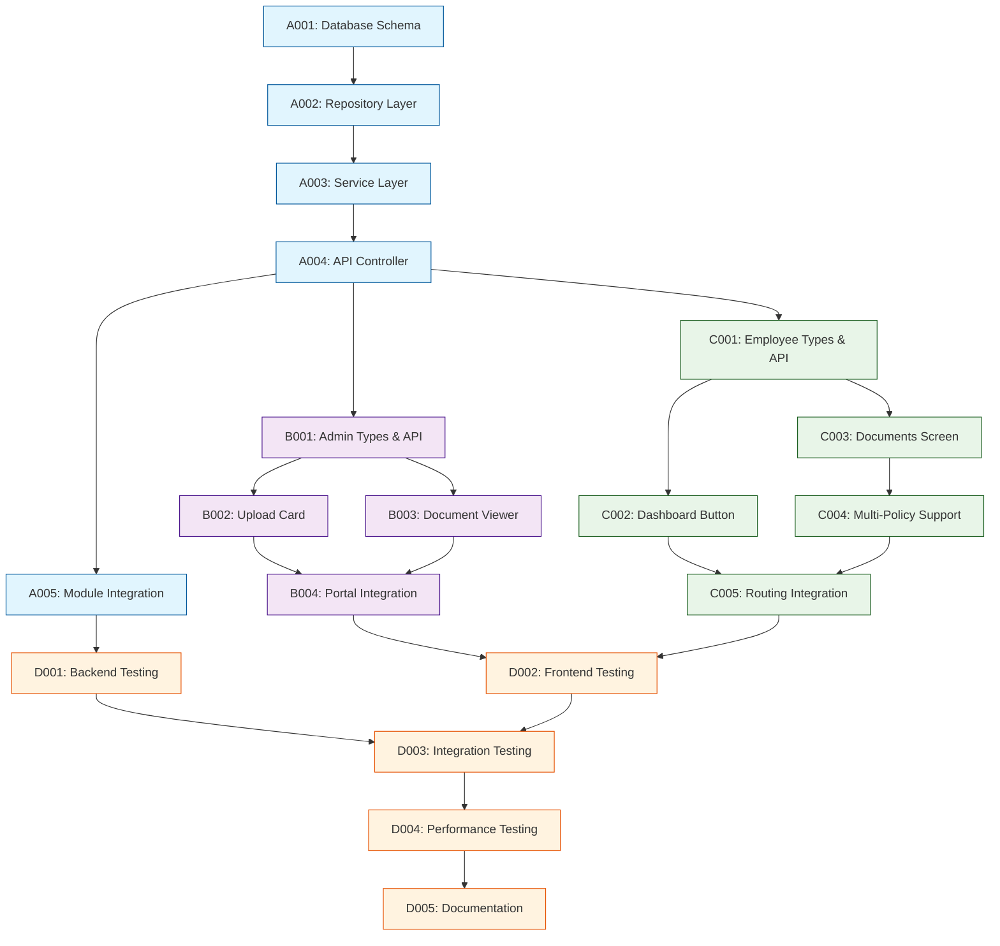

# Tasks - Phase 1

## 1. Task Overview
- **Component:** Policy Features Management
- **Phase:** 1 - Complete Implementation
- **Technical Spec:** [Policy-Feature-Tech-Spec.md](./Tech%20Specs/Policy-Feature-Tech-Spec.md)
- **Total Estimated Effort:** 96 story points
- **Implementation Order:** Sequential with overlapping phases (Backend → Admin Frontend → Employee Frontend → Integration)
- **Phase 1 Scope:** Complete policy document upload, management, and viewing functionality for both admin and employee portals
- **Team Structure:** 2-person team (1 Backend Developer + 1 Frontend Developer)

## 2. Task Categories

### Category A: Backend Foundation & Core API
Database layer, business logic, and REST API endpoints

### Category B: Admin Portal Implementation
File upload cards, document viewers, and policy configuration UI

### Category C: Employee Portal Implementation
Document viewing interface with multi-policy support and tabbed navigation

### Category D: Integration & Testing
Cross-service integration, comprehensive testing, and deployment preparation

## 3. Detailed Task Breakdown

### 📋 Backend Foundation & Core API

#### TASK-A001: Database schema and migration setup

- **Summary:** Policy Features - Database Schema & Migration
- **Issue Type:** Story
- **Epic Link:** Policy Features Epic
- **Story Points:** 3
- **Priority:** High
- **Labels:** backend, database, migration, policy-features
- **Components:** Policy Service
- **Description:** 

    Create database table and migration for policy feature documents with proper indexes and constraints.
    
- **Technical Requirements:**

    - Create PolicyFeatureDocument entity per tech spec section 2.1
    - Implement migration script with proper indexes for performance
    - Set up TypeORM entity relationships and constraints
  
- **Acceptance Criteria:**

    - PolicyFeatureDocument entity created with all required fields
    - Migration script creates table with proper indexes (policy_id, status, is_active)
    - Database constraints enforce data integrity (non-null fields, status enum)
    - Migration can be run and rolled back successfully

- **Dependencies:** None

- **Jira Sub-tasks:**

    - Create PolicyFeatureDocument entity class
    - Write migration script with table creation and indexes
    - Add entity to TypeORM configuration
    - Test migration up/down functionality

#### TASK-A002: Policy feature repository implementation

- **Summary:** Policy Features - Repository Layer Implementation
- **Issue Type:** Story
- **Epic Link:** Policy Features Epic
- **Story Points:** 5
- **Priority:** High
- **Labels:** backend, repository, policy-features
- **Components:** Policy Service
- **Description:**

    Build repository layer for policy feature document CRUD operations with history management.
  
- **Technical Requirements:**

    - Implement PolicyFeatureRepository with TypeORM patterns
    - Add methods for upload, get active, history, and delete operations
    - Handle document replacement with status tracking
  
- **Acceptance Criteria:**

    - Repository supports uploading new policy documents with previous document deactivation
    - Active document retrieval works correctly for policy ID
    - Document history returns all documents in reverse chronological order
    - Document deletion properly updates status rather than hard delete
    - All repository methods have proper error handling

- **Dependencies:** TASK-A001

- **Jira Sub-tasks:**

    - Implement uploadPolicyFeature method with document replacement logic
    - Create getActivePolicyFeature method with proper filtering
    - Add getPolicyFeatureHistory method with sorting
    - Implement deletePolicyFeature with soft delete
    - Write unit tests for all repository methods

#### TASK-A003: Policy feature service layer and DTOs

- **Summary:** Policy Features - Service Layer & DTOs
- **Issue Type:** Story
- **Epic Link:** Policy Features Epic
- **Story Points:** 6
- **Priority:** High
- **Labels:** backend, service, dto, policy-features
- **Components:** Policy Service
- **Description:**

    Implement business logic layer with DTOs for policy feature document management.
  
- **Technical Requirements:**

    - Create UploadPolicyFeatureDto and PolicyFeatureResponseDto per tech spec
    - Implement PolicyFeatureService with document validation
    - Add integration with Document Service for file validation
  
- **Acceptance Criteria:**

    - DTOs properly validate input data with class-validator decorators
    - Service validates document existence in Document Service before saving
    - Upload service properly handles document replacement and history
    - Download URL generation works with Document Service integration
    - Proper error handling with meaningful exception messages

- **Dependencies:** TASK-A002

- **Jira Sub-tasks:**

    - Create UploadPolicyFeatureDto with validation rules
    - Create PolicyFeatureResponseDto with API documentation
    - Implement PolicyFeatureService business logic
    - Add Document Service integration for file validation
    - Write comprehensive unit tests for service methods

#### TASK-A004: REST API endpoints and controller

- **Summary:** Policy Features - REST API Controller
- **Issue Type:** Story
- **Epic Link:** Policy Features Epic
- **Story Points:** 5
- **Priority:** High
- **Labels:** backend, controller, api, policy-features
- **Components:** Policy Service
- **Description:**

    Build REST API endpoints for policy feature document operations with proper security and documentation.
  
- **Technical Requirements:**

    - Implement PolicyFeatureController with all CRUD endpoints
    - Add authentication and authorization guards
    - Include Swagger/OpenAPI documentation
  
- **Acceptance Criteria:**

    - All API endpoints work correctly (POST upload, GET document, GET history, GET download-url)
    - Authentication guard properly validates JWT tokens
    - User context correctly populated for uploaded_by fields
    - Swagger documentation generated with proper request/response schemas
    - Error responses follow standard format with proper HTTP status codes

- **Dependencies:** TASK-A003

- **Jira Sub-tasks:**

    - Implement POST /policy-features/{policyId}/upload endpoint
    - Create GET /policy-features/{policyId} endpoint
    - Add GET /policy-features/{policyId}/history endpoint
    - Implement GET /policy-features/{policyId}/download-url endpoint
    - Add Swagger documentation and integration tests

#### TASK-A005: Module configuration and service integration

- **Summary:** Policy Features - Module Setup & Integration
- **Issue Type:** Story
- **Epic Link:** Policy Features Epic
- **Story Points:** 3
- **Priority:** Medium
- **Labels:** backend, module, integration, policy-features
- **Components:** Policy Service
- **Description:**

    Configure NestJS module and integrate with existing Policy Service application.
  
- **Technical Requirements:**

    - Create PolicyFeatureModule with proper imports and exports
    - Update main AppModule to include PolicyFeatureModule
    - Configure TypeORM entity registration
  
- **Acceptance Criteria:**

    - PolicyFeatureModule properly configured with all dependencies
    - Module integrated into main application without conflicts
    - All services and controllers properly registered and injectable
    - Application starts successfully with new module
    - Health check endpoint continues to work

- **Dependencies:** TASK-A004

- **Jira Sub-tasks:**

    - Create PolicyFeatureModule configuration
    - Update AppModule imports
    - Register TypeORM entities
    - Test application startup and service availability
    - Update API documentation

### 🔧 Admin Portal Implementation

#### TASK-B001: Admin portal types and API service

- **Summary:** Admin Portal - Types & API Service
- **Issue Type:** Story
- **Epic Link:** Policy Features Epic
- **Story Points:** 3
- **Priority:** High
- **Labels:** frontend, admin, types, api, policy-features
- **Components:** IWORK Admin Portal
- **Description:**

    Create TypeScript types and API service layer for policy features in admin portal.
  
- **Technical Requirements:**

    - Define PolicyFeatureDocument and request/response interfaces
    - Implement PolicyFeatureService with all API methods
    - Add proper error handling and response typing
  
- **Acceptance Criteria:**

    - All TypeScript interfaces match backend DTOs exactly
    - API service methods handle success and error cases properly
    - Service integrates with existing apiRequest utility
    - Proper typing for async operations and error responses
    - Code follows existing patterns in IWORK application

- **Dependencies:** TASK-A004 (API endpoints available)

- **Jira Sub-tasks:**

    - Define policy-feature.types.ts interfaces
    - Implement PolicyFeatureService class
    - Add error handling for different HTTP status codes
    - Integrate with existing API utilities
    - Add TypeScript type checking validation

#### TASK-B002: Upload policy features card component

- **Summary:** Admin Portal - Upload Policy Features Card
- **Issue Type:** Story
- **Epic Link:** Policy Features Epic
- **Story Points:** 8
- **Priority:** High
- **Labels:** frontend, admin, upload, component, policy-features
- **Components:** IWORK Admin Portal
- **Description:**

    Build the policy features upload card for Portal Configuration with file upload and status display.
  
- **Technical Requirements:**

    - Create UploadPolicyFeaturesCard component per tech spec section 4.3
    - Integrate with existing FileUploadWrapper component
    - Add proper state management and loading indicators
  
- **Acceptance Criteria:**

    - Card displays correct status (uploaded/not uploaded) based on document existence
    - Upload functionality works with existing FileUploadWrapper component
    - Replace document shows confirmation dialog before proceeding
    - Card shows proper metadata (uploader name, upload date, file status)
    - Loading states and error handling work correctly

- **Dependencies:** TASK-B001

- **Jira Sub-tasks:**

    - Create UploadPolicyFeaturesCard component structure
    - Integrate file upload functionality with existing patterns
    - Add state management for document metadata
    - Implement confirmation dialog for document replacement
    - Style component to match existing Portal Configuration cards

#### TASK-B003: Policy feature document viewer component

- **Summary:** Admin Portal - Document Viewer Component
- **Issue Type:** Story
- **Epic Link:** Policy Features Epic
- **Story Points:** 6
- **Priority:** High
- **Labels:** frontend, admin, viewer, document, policy-features
- **Components:** IWORK Admin Portal
- **Description:**

    Build document viewer with PDF display and upload history functionality.
  
- **Technical Requirements:**

    - Create PolicyFeatureViewer component with iframe PDF display
    - Add upload history table with download capabilities
    - Implement document download functionality
  
- **Acceptance Criteria:**

    - PDF documents display correctly in iframe viewer
    - Upload history shows all previous documents with metadata
    - Download functionality works for current and historical documents
    - History table shows proper sorting (newest first)
    - Viewer modal can be closed and reopened without issues

- **Dependencies:** TASK-B001

- **Jira Sub-tasks:**

    - Create PolicyFeatureViewer modal component
    - Add PDF iframe display with proper sizing
    - Implement upload history table with download actions
    - Add document download functionality using existing patterns
    - Style components to match existing IWORK design patterns

#### TASK-B004: Portal configuration integration

- **Summary:** Admin Portal - Portal Configuration Integration
- **Issue Type:** Story
- **Epic Link:** Policy Features Epic
- **Story Points:** 4
- **Priority:** Medium
- **Labels:** frontend, admin, integration, portal-config, policy-features
- **Components:** IWORK Admin Portal
- **Description:**

    Integrate upload policy features card into existing Portal Configuration section.
  
- **Technical Requirements:**

    - Add UploadPolicyFeaturesCard to Policy Details Portal Configuration
    - Ensure proper routing and policy ID passing
    - Maintain existing Portal Configuration layout and functionality
  
- **Acceptance Criteria:**

    - Upload card appears in Portal Configuration for each policy
    - Policy ID correctly passed from Policy Details to upload card
    - Card integrates seamlessly with existing Portal Configuration layout
    - No impact on other Portal Configuration features
    - Proper conditional rendering based on policy permissions

- **Dependencies:** TASK-B002

- **Jira Sub-tasks:**

    - Add component to Portal Configuration layout
    - Ensure policy ID prop passing from parent components
    - Test integration with existing Policy Details workflow
    - Verify no conflicts with other configuration cards
    - Update Portal Configuration documentation

### 🔗 Employee Portal Implementation

#### TASK-C001: Employee portal types and API service

- **Summary:** Employee Portal - Types & API Service
- **Issue Type:** Story
- **Epic Link:** Policy Features Epic
- **Story Points:** 2
- **Priority:** High
- **Labels:** frontend, employee, types, api, policy-features
- **Components:** IBP Employee Portal
- **Description:**

    Create shared types and API service for employee portal policy feature access.
  
- **Technical Requirements:**

    - Define interfaces for employee portal document access
    - Implement API service methods for document retrieval
    - Add policy enrollment integration patterns
  
- **Acceptance Criteria:**

    - TypeScript interfaces support multi-policy scenarios
    - API service methods work with employee authentication context
    - Service handles cases where no documents exist for policies
    - Proper error handling for unauthorized access
    - Code follows IBP application patterns and conventions

- **Dependencies:** TASK-A004 (API endpoints available)

- **Jira Sub-tasks:**

    - Define employee-specific types and interfaces
    - Implement PolicyFeatureService for employee context
    - Add policy enrollment data integration
    - Handle API responses for multi-policy scenarios
    - Add proper TypeScript type definitions

#### TASK-C002: Policy features dashboard button

- **Summary:** Employee Portal - Dashboard Policy Features Button
- **Issue Type:** Story
- **Epic Link:** Policy Features Epic
- **Story Points:** 3
- **Priority:** High
- **Labels:** frontend, employee, dashboard, button, policy-features
- **Components:** IBP Employee Portal
- **Description:**

    Add Policy Features button to employee dashboard with navigation to documents screen.
  
- **Technical Requirements:**

    - Create PolicyFeaturesButton component per tech spec section 4.5
    - Add proper navigation to documents screen with correct tab selection
    - Integrate with existing dashboard layout and design
  
- **Acceptance Criteria:**

    - Button appears prominently on employee dashboard
    - Clicking navigates to documents screen with Policy Feature tab selected
    - Button follows existing dashboard design patterns and styling
    - Proper icon and text display for Policy Features functionality
    - Button integrates seamlessly with existing dashboard layout

- **Dependencies:** TASK-C001

- **Jira Sub-tasks:**

    - Create PolicyFeaturesButton component
    - Add navigation logic to documents screen
    - Style button to match existing dashboard elements
    - Integrate with dashboard layout component
    - Test button functionality and navigation

#### TASK-C003: Documents screen with tabbed interface

- **Summary:** Employee Portal - Documents Screen Implementation
- **Issue Type:** Story
- **Epic Link:** Policy Features Epic
- **Story Points:** 10
- **Priority:** High
- **Labels:** frontend, employee, documents, tabs, policy-features
- **Components:** IBP Employee Portal
- **Description:**

    Build comprehensive documents screen with main tabs (Policy Feature/TPA Card) and policy sub-tabs for multi-policy support.
  
- **Technical Requirements:**

    - Create DocumentsPage component per tech spec section 4.6
    - Implement main tabs and policy sub-tabs with proper state management
    - Add document viewer with iframe display and download functionality
  
- **Acceptance Criteria:**

    - Main tabs (Policy Feature/TPA Card) work correctly with proper selection
    - Policy sub-tabs appear for employees with multiple policies
    - Document viewer displays PDFs correctly with zoom and navigation
    - Download functionality works with original filename preservation
    - Placeholder message shows when no document available for policy

- **Dependencies:** TASK-C001

- **Jira Sub-tasks:**

    - Create DocumentsPage component structure
    - Implement main tab navigation (Policy Feature/TPA Card)
    - Add policy sub-tabs for multi-policy scenarios
    - Create document viewer with PDF iframe display
    - Add download functionality with proper file naming

#### TASK-C004: Multi-policy support and document loading

- **Summary:** Employee Portal - Multi-Policy Support & Document Loading
- **Issue Type:** Story
- **Epic Link:** Policy Features Epic
- **Story Points:** 7
- **Priority:** Medium
- **Labels:** frontend, employee, multi-policy, loading, policy-features
- **Components:** IBP Employee Portal
- **Description:**

    Implement policy enrollment detection and document loading for multiple policies with proper state management.
  
- **Technical Requirements:**

    - Add user policy enrollment detection and loading
    - Implement document loading for all enrolled policies
    - Add proper loading states and error handling for missing documents
  
- **Acceptance Criteria:**

    - System correctly identifies user's enrolled policies
    - Documents load efficiently for all policies without blocking UI
    - Loading states show progress during document retrieval
    - Error handling gracefully manages cases with missing documents
    - Policy switching works smoothly without unnecessary re-renders

- **Dependencies:** TASK-C003

- **Jira Sub-tasks:**

    - Implement user policy enrollment detection
    - Add batch document loading for multiple policies
    - Create loading states and progress indicators
    - Handle error cases for missing or unauthorized documents
    - Optimize performance for multiple policy document loading

#### TASK-C005: Employee portal routing and integration

- **Summary:** Employee Portal - Routing & Integration
- **Issue Type:** Story
- **Epic Link:** Policy Features Epic
- **Story Points:** 3
- **Priority:** Medium
- **Labels:** frontend, employee, routing, integration, policy-features
- **Components:** IBP Employee Portal
- **Description:**

    Set up routing for documents screen and integrate with existing IBP navigation patterns.
  
- **Technical Requirements:**

    - Add /documents route with tab parameter support
    - Integrate documents screen with existing IBP routing
    - Ensure proper navigation flow from dashboard
  
- **Acceptance Criteria:**

    - Documents route works with tab parameter (/documents?tab=policy-feature)
    - Navigation from dashboard button works correctly
    - Back navigation returns to dashboard appropriately
    - Route guards work properly for authenticated users
    - Integration follows existing IBP routing patterns

- **Dependencies:** TASK-C002

- **Jira Sub-tasks:**

    - Add documents route configuration
    - Implement tab parameter handling
    - Test navigation flow from dashboard
    - Verify route guards and authentication
    - Update IBP routing documentation

### ✨ Integration & Testing

#### TASK-D001: Backend API comprehensive testing

- **Summary:** Policy Features - Backend API Testing Suite
- **Issue Type:** Story
- **Epic Link:** Policy Features Epic
- **Story Points:** 6
- **Priority:** High
- **Labels:** backend, testing, api, integration, policy-features
- **Components:** Policy Service
- **Description:**

    Build comprehensive testing suite for policy features backend including unit tests and integration tests.
  
- **Technical Requirements:**

    - Create unit tests for all service, repository, and controller methods
    - Add integration tests for API endpoints with proper test data
    - Achieve minimum 90% code coverage as per project standards
  
- **Acceptance Criteria:**

    - All service methods have unit tests with mocking of dependencies
    - Repository tests cover all CRUD operations and edge cases
    - Controller tests verify proper request/response handling and authentication
    - Integration tests validate end-to-end API functionality
    - Code coverage meets project requirements (90% minimum)

- **Dependencies:** TASK-A005

- **Jira Sub-tasks:**

    - Write unit tests for PolicyFeatureService
    - Create unit tests for PolicyFeatureRepository
    - Add unit tests for PolicyFeatureController
    - Implement integration tests for API endpoints
    - Set up test data and mocking for external dependencies

#### TASK-D002: Frontend component testing

- **Summary:** Policy Features - Frontend Component Testing
- **Issue Type:** Story
- **Epic Link:** Policy Features Epic
- **Story Points:** 8
- **Priority:** High
- **Labels:** frontend, testing, components, unit-tests, policy-features
- **Components:** IWORK Admin Portal, IBP Employee Portal
- **Description:**

    Create comprehensive unit tests for all policy features frontend components in both admin and employee portals.
  
- **Technical Requirements:**

    - Unit tests for all React components using Jest and React Testing Library
    - Mock API services and external dependencies
    - Test user interactions and state management
  
- **Acceptance Criteria:**

    - All admin portal components have comprehensive unit tests
    - Employee portal components tested for different user scenarios
    - User interaction flows tested (uploads, downloads, navigation)
    - API service mocks properly simulate backend responses
    - Test coverage meets project standards (90% minimum)

- **Dependencies:** TASK-B004, TASK-C005

- **Jira Sub-tasks:**

    - Write tests for UploadPolicyFeaturesCard component
    - Create tests for PolicyFeatureViewer component
    - Add tests for employee DocumentsPage component
    - Test API service methods with mocked responses
    - Set up component test utilities and helpers

#### TASK-D003: Cross-service integration validation

- **Summary:** Policy Features - Cross-Service Integration Testing
- **Issue Type:** Story
- **Epic Link:** Policy Features Epic
- **Story Points:** 5
- **Priority:** Medium
- **Labels:** integration, validation, document-service, policy-features
- **Components:** Policy Service, Document Service Integration
- **Description:**

    Validate integration between Policy Service and Document Service for file operations and ensure proper error handling.
  
- **Technical Requirements:**

    - Test document validation calls to Document Service
    - Verify file download URL generation and access
    - Validate error handling for missing or invalid documents
  
- **Acceptance Criteria:**

    - Document Service integration works for file validation during upload
    - Download URL generation properly integrates with Document Service
    - Error handling gracefully manages Document Service unavailability
    - File access permissions work correctly between services
    - Integration follows established service communication patterns

- **Dependencies:** TASK-D001

- **Jira Sub-tasks:**

    - Test document validation integration
    - Verify download URL generation and access
    - Test error scenarios with Document Service
    - Validate service communication patterns
    - Document integration points and dependencies

#### TASK-D004: Performance testing and optimization

- **Summary:** Policy Features - Performance Testing & Optimization
- **Issue Type:** Story
- **Epic Link:** Policy Features Epic
- **Story Points:** 4
- **Priority:** Medium
- **Labels:** performance, optimization, testing, policy-features
- **Components:** Policy Service, IWORK Admin Portal, IBP Employee Portal
- **Description:**

    Conduct performance testing and optimization for file operations and database queries.
  
- **Technical Requirements:**

    - Test API response times for document operations
    - Validate database query performance with indexes
    - Optimize frontend loading for multiple documents and policies
  
- **Acceptance Criteria:**

    - API endpoints respond within acceptable time limits (< 2 seconds)
    - Database queries use proper indexes and perform efficiently
    - Frontend document loading optimized for multiple policies
    - File upload/download operations meet performance requirements
    - Performance baselines documented for monitoring

- **Dependencies:** TASK-D003

- **Jira Sub-tasks:**

    - Conduct API performance testing
    - Analyze database query performance
    - Optimize frontend loading strategies
    - Test file operation performance
    - Document performance baselines and monitoring

#### TASK-D005: Documentation and deployment preparation

- **Summary:** Policy Features - Documentation & Deployment Preparation
- **Issue Type:** Story
- **Epic Link:** Policy Features Epic
- **Story Points:** 5
- **Priority:** Medium
- **Labels:** documentation, deployment, api-docs, policy-features
- **Components:** Policy Service, IWORK Admin Portal, IBP Employee Portal
- **Description:**

    Complete API documentation, user guides, and deployment configuration for policy features functionality.
  
- **Technical Requirements:**

    - Update API documentation with policy features endpoints
    - Create user guides for admin and employee functionality
    - Prepare deployment scripts and configuration
  
- **Acceptance Criteria:**

    - Swagger/OpenAPI documentation complete for all endpoints
    - User guides created for both admin upload and employee access workflows
    - Environment configuration documented for deployment
    - Database migration scripts ready for production deployment
    - Component integration documented for future development

- **Dependencies:** TASK-D004

- **Jira Sub-tasks:**

    - Complete API documentation updates
    - Create admin user guide for policy feature uploads
    - Write employee user guide for document access
    - Prepare deployment configuration and scripts
    - Document component architecture and integration points

## 4. Task Dependencies & Sequencing

## 5. Parallel Development Opportunities

### What Can Be Built Simultaneously:
- **Backend Phase 1:** A001-A005 (Backend developer works sequentially)
- **Frontend Phase 1:** After A004 completion, frontend developer starts B001
- **Frontend Phase 2:** After admin portal (B-tasks), frontend developer continues with employee portal (C-tasks)
- **Testing Phase:** Both developers collaborate on integration testing (D001-D005)

### Critical Path (2-Person Team):
**Backend Developer:** A001 → A002 → A003 → A004 → A005 → D001 → D003 (collaborate) → D005
**Frontend Developer:** (waits for A004) → B001 → B002 → B003 → B004 → C001 → C002 → C003 → C004 → C005 → D002 → D003 (collaborate)

## 6. Risk Mitigation Tasks

### Technical Risks (from tech spec analysis):
- **Document Service Integration:** Early integration testing in D003 validates service communication
- **File Upload Performance:** Performance testing in D004 ensures large file handling works properly  
- **Multi-Policy Complexity:** C004 specifically addresses the complexity of multiple policy support
- **Authentication Context:** Proper testing in D001 and D002 validates user context handling

## 7. Definition of Done

### Task Completion Criteria:
- ✅ All acceptance criteria met with evidence
- ✅ Unit tests written and passing (90% coverage minimum)
- ✅ Code review completed by team lead
- ✅ Integration tests passing (where applicable)
- ✅ Documentation updated (README, API docs, user guides)
- ✅ No lint errors or code quality issues
- ✅ Deployed to development environment and tested

### Component Completion Criteria:
- ✅ All tasks completed per definition of done
- ✅ Technical specification requirements met completely
- ✅ Integration with Document Service verified
- ✅ Performance targets achieved (< 2 second response times)
- ✅ Security requirements satisfied (authentication, file validation)
- ✅ Admin and employee workflows tested end-to-end
- ✅ Ready for user acceptance testing

## 8. Estimation Summary

| Category | Task Count | Total Effort | Duration (days) |
|----------|-----------|--------------|------------------|
| Backend Foundation & Core API | 5 | 22 points | 11-14 days |
| Admin Portal Implementation | 4 | 21 points | 10-13 days |
| Employee Portal Implementation | 5 | 25 points | 12-15 days |
| Integration & Testing | 5 | 28 points | 14-17 days |
| **TOTAL** | **19** | **96 points** | **47-59 days** |

### 2-Person Team Timeline:
- **Backend Developer:** 33 story points (A001-A005, D001, D003) ≈ 16-20 days
- **Frontend Developer:** 46 story points (B001-B004, C001-C005, D002) ≈ 23-28 days
- **Collaboration Tasks:** D003-D005 ≈ 3-5 days overlap
- **Total Calendar Time:** ~26-33 days (sequential with some overlap)

## 9. Team Allocation for 2-Person Team

### Backend Developer (1 developer):
- **Phase 1:** A001-A005 (Backend foundation) - 22 story points
- **Phase 2:** D001 (Backend testing) - 6 story points
- **Phase 3:** D003 (Integration testing collaboration) - 2.5 story points
- **Phase 4:** D005 (Documentation collaboration) - 2.5 story points
- **Total effort:** 33 story points
- **Timeline:** 16-20 days

### Frontend Developer (1 developer):
- **Phase 1:** Wait for A004 completion (~8 days)
- **Phase 2:** B001-B004 (Admin portal) - 21 story points
- **Phase 3:** C001-C005 (Employee portal) - 25 story points
- **Phase 4:** D002 (Frontend testing) - 8 story points
- **Phase 5:** D003-D004 (Integration & performance) - 4.5 story points
- **Total effort:** 58.5 story points
- **Timeline:** 29-35 days (including wait time)

### Recommended Work Flow:
1. **Week 1-2:** Backend developer works on A001-A004
2. **Week 3:** Backend completes A005, Frontend starts B001 (after A004)
3. **Week 4-5:** Backend works on D001, Frontend works on B002-B004
4. **Week 6-7:** Backend available for questions, Frontend works on C001-C005
5. **Week 8:** Both collaborate on D002-D005 (testing, integration, documentation)

## 10. Traceability Matrix

| Task ID | Technical Spec Section | Functional Requirements | Business Value |
|---------|------------------------|-------------------------|----------------|
| A001-A005 | Section 2 (Database), Section 3 (Backend) | FR-001, FR-003, FR-004 | Core data management |
| B001-B004 | Section 4.2, 4.3, 4.4 (Admin Portal) | FR-001, FR-003, FR-004 | Admin document management |
| C001-C005 | Section 4.5, 4.6 (Employee Portal) | FR-002, FR-005 | Employee document access |
| D001-D005 | Section 6 (Testing), Section 9-11 | All FRs | Quality assurance & deployment |

## 11. Implementation Notes

### Development Best Practices:
- Follow test-driven development (TDD) approach for critical business logic
- Use feature flags for gradual rollout of admin and employee functionality
- Implement comprehensive logging for file operations and user actions
- Regular code reviews after each task completion with focus on security

### Quality Gates:
- All automated tests must pass before task completion
- Code coverage minimum 90% (per project standards)
- Security scan must pass with no high-severity issues  
- Performance benchmarks must meet targets (< 2 second response times)
- User acceptance criteria validated by product owner

### Communication Plan for 2-Person Team:

- **Daily standup:** Brief sync on progress and blockers (15 minutes)
- **Weekly demo:** Show completed functionality after each phase
- **Handoff sessions:** Structured knowledge transfer when backend APIs are ready
- **Integration reviews:** Joint testing sessions for D003 and D004
- **Documentation:** Maintain shared notes on API changes and frontend requirements

### Recommended Sprint Structure:

**Sprint 1 (2 weeks):** Backend foundation (A001-A005)
**Sprint 2 (2 weeks):** Admin portal development (B001-B004) + Backend testing (D001)
**Sprint 3 (2 weeks):** Employee portal development (C001-C005)
**Sprint 4 (1 week):** Integration testing and deployment prep (D002-D005)

This task breakdown is optimized for a 2-person team with clear handoff points and minimal blocking dependencies.