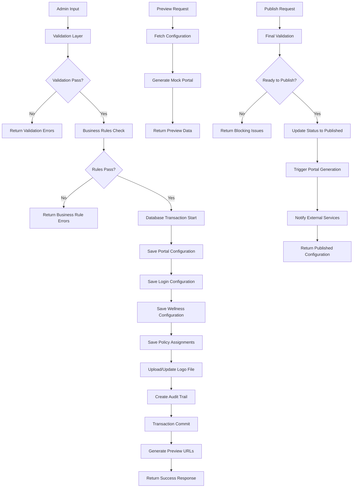

# TRD - Phase 1

## 1. Component Overview
- **Purpose:** Enable brokerage admins to configure company-specific employer portals in a controlled, brand-safe manner with guardrails to prevent UI inconsistencies and support overhead
- **Scope:** Company branding, portal URL configuration, login methods, wellness benefit structure, policy enrollment settings, and preview functionality
- **Phase 1 Scope:** Core portal configuration functionality including branding, login configuration, wellness configuration, policy assignment, and preview mode capabilities
- **Dependencies:** 
  - auth-service (JWT authentication and user management)
  - policy-service (existing policy configuration infrastructure)
  - company entity (from service-lib)
  - notification-service (for login-specific notification rules)
- **Dependents:** 
  - ibp-service (employer portal generation)
  - ui/iwork (admin configuration interface)

## 2. Functional Requirements
List of functional requirements this component must fulfill:
- **FR-01:** Logo upload with format validation (PNG, JPG, SVG)
- **FR-02:** Header and tagline text configuration with character limits
- **FR-03:** Portal URL configuration with real-time preview and validation
- **FR-04:** Login method configuration (Email+Password, Mobile+OTP, Employee ID+YOB)
- **FR-05:** 2FA enforcement for Email+Password login
- **FR-06:** Login-specific notification rules (system-defined, non-editable)
- **FR-07:** Corporate Wellness configuration (mandatory)
- **FR-08:** Insurance Wellness toggle (Allowed/Not Allowed)
- **FR-09:** Insurance Wellness type selection (Corporate/Retail Policy)
- **FR-10:** Wellness benefit sub-configuration
- **FR-11:** Policy assignment to company portal
- **FR-12:** Enrollment window configuration with date validation
- **FR-13:** Financial settings configuration (excluding employer contribution)
- **FR-14:** Family eligibility configuration
- **FR-15:** Preview Mode for complete portal experience

## 3. Component Interface

### 3.1 Public API
The Portal Configuration module exposes a comprehensive REST API interface organized into distinct functional areas:

**Company Portal Configuration Management:**
The system must provide endpoints for complete lifecycle management of portal configurations. This includes creating new portal configurations for specific companies, updating existing configurations with validation and business rule enforcement, retrieving complete configuration details for display and editing purposes, and safely deleting configurations with proper cascade handling for related data.

**Branding Management Operations:**
Branding functionality requires specialized endpoints for logo file management and text content configuration. Logo operations must handle multipart file uploads with comprehensive validation for file format, size, and content integrity. The system should support logo replacement and removal operations while maintaining referential integrity with existing configurations. Text branding operations manage header and tagline content with real-time character limit validation and preview capabilities.

**Portal URL Management:**
URL management requires real-time validation endpoints that provide immediate feedback during slug entry. The validation system must check for uniqueness across all existing portals, format compliance with business rules, and availability of the proposed URL. Preview functionality generates complete portal URL examples showing how the configured slug will appear in the final portal address structure.

**Login Configuration Management:**
Login configuration endpoints manage the complex relationships between different authentication methods and their associated requirements. This includes enabling or disabling specific login methods, configuring two-factor authentication requirements with method-specific validation rules, and managing notification preferences that are automatically determined by selected login methods.

**Wellness Configuration Operations:**
Wellness configuration requires endpoints that handle both mandatory Corporate Wellness settings and optional Insurance Wellness configurations. The system must enforce business rules around wellness type selection, validate benefit sub-configurations, and ensure completeness of required wellness benefit settings before allowing configuration publication.

**Policy Configuration and Assignment:**
Policy-related endpoints manage the assignment of policies to portal configurations, enrollment window scheduling with comprehensive date validation, financial settings configuration excluding employer contribution details, and family eligibility rule management with dependent relationship definitions.

**Preview Mode and Publication:**
Preview functionality generates mock portal experiences showing exactly how the configured portal will appear to end users. This includes preview generation for different portal sections (login, wellness, enrollment) and complete end-to-end preview workflows. Publication endpoints handle the final validation and deployment of configurations to active portal generation systems.

**Validation and Error Management:**
Comprehensive validation endpoints provide real-time feedback on configuration completeness, business rule compliance, and potential conflicts. Error management includes detailed field-level validation results, business rule violation explanations, and suggested resolution paths for common configuration issues.

### 3.2 Input/Output Contracts
- **Inputs:** 
  - Company ID for portal configuration association
  - Logo files (PNG, JPG, SVG format, max 2MB)
  - Text fields with character limits (header: 100 chars, tagline: 200 chars)
  - Portal slug (alphanumeric + hyphens, 3-50 characters)
  - Login method selections and 2FA preferences
  - Wellness benefit configurations
  - Policy assignments and enrollment date ranges
  - Financial settings and family eligibility rules

- **Outputs:** 
  - Portal configuration objects with all settings
  - Validation status and error details
  - Real-time portal URL previews
  - Preview mode URLs for testing
  - Publication status and deployment details

- **Data Formats:** 
  - JSON for configuration payloads
  - Multipart form data for file uploads
  - Base64 encoded logo images in responses
  - ISO 8601 date formats for enrollment windows

### 3.3 Error Handling
- **Error Types:** 
  - Validation errors (V-01 through V-09 from PRD)
  - File upload errors (format, size, corruption)
  - Business rule violations (2FA not configured, wellness incomplete)
  - Database constraint violations (duplicate portal slugs)
  - External service failures (notification service, file storage)

- **Error Responses:** 
  - Structured error objects with error codes, messages, and field-specific details
  - HTTP status codes: 400 (validation), 409 (conflicts), 422 (business rules), 500 (system errors)

- **Recovery Strategies:** 
  - Automatic retry for transient external service failures
  - Rollback mechanisms for partial configuration updates
  - Validation pre-checks before save operations
  - Graceful degradation for preview functionality

## 4. Data Model

### 4.1 Data Storage
- **Storage Type:** PostgreSQL database with TypeORM entity management
- **Data Schema:** Extends existing company and policy configuration patterns

**Portal Configuration Master Entity:**
The primary portal configuration entity serves as the central hub for all portal-specific settings. This entity maintains a direct relationship with company entities through foreign key constraints, ensuring each portal configuration is uniquely associated with a specific company. The entity stores essential portal identity information including the unique portal slug that forms the basis of the portal URL, customizable header and tagline text with enforced character limits, and reference links to uploaded logo files through the existing file upload management system.

The configuration status is managed through lookup table references supporting draft, published, and archived states with proper workflow transitions. Version control is implemented through incremental versioning to support configuration history and rollback capabilities. Standard audit fields track creation and modification timestamps along with user attribution for all configuration changes. Soft deletion support through deleted timestamp fields ensures data retention for audit and recovery purposes.

**Login Configuration Management:**
Login configuration data is stored in a dedicated entity that maintains one-to-many relationships with the master portal configuration. Each login method type is represented through lookup table references supporting Email+Password, Mobile+OTP, and Employee ID+Year of Birth authentication methods. The entity manages enablement status for each login method along with specific two-factor authentication requirements.

Two-factor authentication configuration includes separate boolean flags for email and mobile-based second-factor methods, allowing granular control over authentication security levels. The relationship structure supports multiple login methods per portal while enforcing business rules around mandatory two-factor authentication for password-based login methods.

**Wellness Configuration Structure:**
Wellness configuration utilizes a flexible entity design supporting both Corporate and Insurance wellness types through lookup table references. The mandatory Corporate Wellness requirement is enforced through business logic while Insurance Wellness remains optional with additional type specification requirements when enabled.

Insurance Wellness configurations require selection between Corporate Policy and Retail Policy variants through additional lookup references. Complex wellness benefit sub-configurations are stored in JSON format allowing flexible schema definition while maintaining query performance through PostgreSQL JSONB indexing capabilities.

**Policy Assignment and Enrollment Management:**
Policy assignments are managed through a separate entity maintaining relationships between portal configurations and assigned policies. Each assignment includes comprehensive enrollment window definitions with start and end dates enforced through database constraints preventing invalid date ranges.

Financial settings are stored in JSON format supporting flexible configuration schemas while excluding employer contribution details as per business requirements. Family eligibility configurations are similarly stored in JSON format supporting complex relationship definitions and dependent limits with validation rules enforced at the application layer.

**Comprehensive Audit Trail System:**
A dedicated audit trail entity captures all configuration changes with complete before and after value tracking. Each audit entry records the specific field changed, previous and new values in text format supporting complex data type serialization, and complete user attribution with timestamp precision.

Audit entries are categorized by change type including insert, update, and delete operations enabling comprehensive change history reporting and rollback capability analysis. The audit system supports compliance requirements and provides detailed change tracking for security and operational monitoring purposes.

### 4.2 Data Flow

### 4.3 Data Validation
- **Input Validation:** 
  - Logo file format (PNG/JPG/SVG) and size (max 2MB)
  - Portal slug format (lowercase, alphanumeric, hyphens, 3-50 chars)
  - Text field character limits (header: 100, tagline: 200)
  - Date range validation (start < end, no overlapping windows)
  - Required field checks for all mandatory configurations

- **Business Rules:** 
  - 2FA required when Email+Password login is enabled
  - Corporate Wellness must always be enabled
  - Insurance Wellness type selection required when enabled
  - At least one wellness benefit must be configured
  - Unique portal slug across all companies
  - Valid enrollment date ranges with no overlaps

- **Data Integrity:** 
  - Foreign key constraints to company, policy, and lookup tables
  - Unique constraints on portal slugs
  - Check constraints on date ranges and boolean combinations
  - JSON schema validation for configuration objects

## 5. Technology Stack

### 5.1 Core Technologies
- **Programming Language:** TypeScript 4.9+
- **Backend Framework:** NestJS 9.x
- **Database:** PostgreSQL 14+
- **ORM:** TypeORM 0.3+
- **Authentication:** JWT tokens with existing auth-service integration
- **File Storage:** Local file system with FileUpload entity management
- **Frontend:** React 18+ with Material-UI 5.x (for admin interface)

### 5.2 Technology Rationale
- **Why These Choices:** 
  - TypeScript provides type safety across full-stack development
  - NestJS aligns with existing microservices architecture and dependency injection patterns
  - PostgreSQL supports JSONB for flexible configuration storage while maintaining relational integrity
  - TypeORM provides existing entity patterns and migration support
  - Material-UI ensures consistent admin interface with existing UI patterns

- **Alternatives Considered:** 
  - MongoDB for configuration storage (rejected due to relational data needs)
  - Express.js (rejected in favor of NestJS architectural consistency)
  - File-based configuration (rejected due to multi-tenancy requirements)

- **Trade-offs:** 
  - TypeORM complexity vs. raw SQL performance (chose consistency with existing codebase)
  - Monolithic vs. separate microservice (chose integration into policy-service for simplicity)

## 6. Integration Design

### 6.1 Dependency Integration
- **AUTH-SERVICE:** JWT token validation, user session management, and role-based access control for admin portal access
- **POLICY-SERVICE:** Integration with existing policy entities and configuration patterns, reusing established database connections and service patterns
- **COMPANY ENTITY:** Direct foreign key relationship for company-specific portal configurations, leveraging existing company management workflows
- **NOTIFICATION-SERVICE:** Login-method-specific notification rule enforcement and delivery for welcome messages and password resets

### 6.2 Service Integration
- **File Storage Service:** Logo upload and management using existing FileUpload entity patterns with local file system storage
- **Preview Generation:** Internal service for rendering portal mockups and configuration previews without external dependencies
- **Portal Generation Service:** Future integration point for generating live employer portals from configuration data (Phase 2+ consideration)

## 7. Performance Considerations

### 7.1 Performance Requirements
- **Response Time:** 
  - Configuration CRUD operations: < 500ms
  - Logo upload: < 2 seconds for 2MB files
  - Preview generation: < 1 second
  - Validation checks: < 200ms
  
- **Throughput:** 
  - Support 50 concurrent admin users
  - Handle 100 configuration updates per hour
  - Process 20 logo uploads per hour

- **Scalability:** 
  - Design for 1000+ company portal configurations
  - Support horizontal scaling through stateless service design

### 7.2 Performance Strategies
- **Caching:** 
  - Redis cache for validation results (5-minute TTL)
  - Logo file caching with CDN headers
  - Configuration lookups cached for read-heavy operations

- **Database Optimization:** 
  - Indexes on company_id, portal_slug, and status fields
  - JSONB indexes for nested configuration queries
  - Query optimization for configuration retrieval

- **Resource Management:** 
  - File size limits and format validation to prevent resource exhaustion
  - Connection pooling for database operations
  - Async processing for non-critical operations like audit trail creation

## 8. Security Design

### 8.1 Security Requirements
- **Authentication:** Integration with existing JWT-based authentication system from auth-service
- **Authorization:** Role-based access control ensuring only brokerage admins can configure company portals
- **Data Protection:** Encryption of sensitive configuration data and secure file upload handling

### 8.2 Security Implementation
- **Encryption:** 
  - HTTPS for all API communications
  - Database-level encryption for sensitive configuration fields
  - Secure file upload with virus scanning integration points

- **Input Sanitization:** 
  - File upload validation (format, size, content scanning)
  - XSS prevention for text field inputs
  - SQL injection prevention through TypeORM parameterized queries

- **Audit Logging:** 
  - Complete audit trail of configuration changes
  - User action logging for compliance requirements
  - Security event logging for failed authentication attempts

## 9. Monitoring & Observability

### 9.1 Logging
- **Log Levels:** 
  - INFO: Configuration changes, successful operations
  - WARN: Validation failures, business rule violations
  - ERROR: System errors, external service failures
  - DEBUG: Detailed operation traces for troubleshooting

- **Log Format:** 
  - Structured JSON logs with trace IDs
  - Include user ID, company ID, and operation context
  - Timestamp, log level, service name, and message details

- **Sensitive Data:** 
  - Never log file contents or binary data
  - Mask sensitive configuration values in logs
  - Exclude authentication tokens and passwords

### 9.2 Metrics
- **Performance Metrics:** 
  - API response times by endpoint
  - Database query execution times
  - File upload success/failure rates
  - Cache hit/miss ratios

- **Business Metrics:** 
  - Configuration creation/update rates
  - Preview generation frequency
  - Publication success rates
  - User adoption metrics by company

- **Alerting:** 
  - Alert on API response time > 1 second
  - Alert on file upload failures > 10% in 1 hour
  - Alert on database connection failures
  - Alert on validation error spikes

## 10. Testing Strategy

### 10.1 Unit Testing
- **Test Coverage:** Target 90% code coverage across all service methods and validation logic
- **Key Test Cases:** 
  - Configuration CRUD operations with edge cases
  - Validation logic for all business rules (V-01 through V-09)
  - File upload handling and error scenarios
  - Preview generation and URL validation

- **Mock Dependencies:** 
  - Mock auth-service for authentication tests
  - Mock file storage for upload tests
  - Mock database repositories for service logic tests
  - Mock notification service for integration tests

### 10.2 Integration Testing
- **Integration Points:** 
  - Database integration with real PostgreSQL instance
  - File upload integration with storage system
  - JWT authentication integration with auth-service
  - API endpoint testing with full request/response cycles

- **Test Data:** 
  - Sample company configurations
  - Valid and invalid logo files
  - Edge case portal slug values
  - Complete configuration scenarios

- **Environment Requirements:** 
  - Test database with sample lookup data
  - File system access for upload testing
  - Mock authentication tokens for authorization testing

## 11. Deployment Considerations

### 11.1 Environment Requirements
- **Infrastructure:** 
  - Node.js 18+ runtime environment
  - PostgreSQL 14+ database with JSONB support
  - File system storage with appropriate permissions
  - Redis cache for performance optimization

- **Configuration:** 
  - Environment-specific database connection strings
  - File upload path and size limit configurations
  - JWT secret keys and authentication endpoints
  - Cache TTL and connection parameters

- **Secrets Management:** 
  - Database credentials via environment variables
  - JWT signing keys through secure secret management
  - File storage access credentials
  - External service API keys

### 11.2 Deployment Strategy
- **Build Process:** 
  - TypeScript compilation to JavaScript
  - NestJS application bundling
  - Database migration execution
  - Static asset optimization

- **Deployment Steps:** 
  1. Database migration execution
  2. Application deployment to container/server
  3. Configuration validation checks
  4. Service health verification
  5. Integration testing in target environment

- **Rollback Plan:** 
  - Database migration rollback scripts
  - Previous application version deployment
  - Configuration state restoration
  - Service dependency verification

## 12. Risk Mitigation
Address specific risks identified in business requirements and technical implementation:

- **Risk: Configuration Corruption:** 
  - Mitigation: Transaction-based updates with rollback capability, configuration validation before save, audit trail for change tracking

- **Risk: Portal Slug Conflicts:** 
  - Mitigation: Real-time slug validation, unique database constraints, suggested alternatives for conflicts

- **Risk: File Upload Security:** 
  - Mitigation: File format validation, size limits, virus scanning integration points, secure file storage practices

- **Risk: Integration Failures:** 
  - Mitigation: Graceful degradation for non-critical services, retry mechanisms, comprehensive error handling

- **Risk: Performance Degradation:** 
  - Mitigation: Caching strategies, database optimization, resource limits, performance monitoring

## 13. Future Considerations
- **Extensibility:** 
  - Plugin architecture for additional configuration types
  - API versioning for backward compatibility
  - Webhook system for external integrations

- **Migration Path:** 
  - Database schema evolution through TypeORM migrations
  - Configuration format versioning
  - Legacy system integration patterns

- **Deprecation Strategy:** 
  - Graceful handling of deprecated configuration options
  - Migration tools for configuration updates
  - Backward compatibility maintenance guidelines