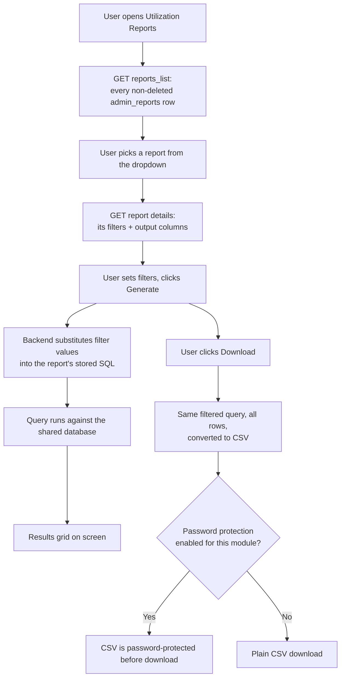

# Report Hub ("Utilization Reports") — Admin Module

iWork is IIRM's internal platform for running the insurance broking business, and its Admin Module is where operations and leadership go to configure and monitor that business rather than transact it. One entry in that module, labelled **Utilization Reports** in the sidebar (`iworkedge.indiainsure.com/report`), is the subject of this document. Anyone extending this screen — adding a new report, changing a filter, or deciding whether it should keep absorbing every ad-hoc reporting need in the platform — should start here.

## What "Utilization Reports" Actually Is

The name is misleading, and worth correcting before anything else: **there is no single report called "Utilization Report."** The sidebar label names an entire screen — a generic, database-driven report picker and runner. A user opens `/report`, picks *any* registered report from a "Select Report" dropdown, fills in whatever filters that report defines, and runs it. The mechanism behind that dropdown is internally referred to as the Report Hub (hence this document's folder), and its download feature is tagged in code with the module key `utilization_reports` — which is where the sidebar label actually comes from. It is a piece of shared reporting infrastructure wearing the name of just one of its possible use cases.

This matters because the real product question isn't "what does the Utilization Report calculate" — it's "what reports currently live inside this engine, and what governs what gets added to it."

## Where It Lives

| | |
|---|---|
| Menu path | Admin Module → Utilization Reports |
| Route | `/report` |
| Frontend | `ReportGeneration` component, iWork app (`apps/ui/iwork`) |
| Gated by | `FeatureKey.VIEW_ADMIN_REPORTS` (screen) / `FeatureKey.EXPORT_ADMIN_REPORTS` (Download button) |
| Backend | `scheduler-service` |

One correction to a plausible-but-wrong assumption: a service literally named `report-service` exists in this codebase, but it is an unused scaffold — a default NestJS "Hello World" with no routes wired to it. The actual backend for this screen lives in `scheduler-service`, under its own `report` module. Don't confuse the two.

## The Generic Report Engine

Every report on this screen — its existence, its filters, its output columns, and the calculation itself — is a row of configuration in the database, not a piece of code. Three tables drive the whole thing:

| Table | Holds |
|---|---|
| `admin_reports` | One row per report: its name, its display label, and a `query` column containing the actual SQL that computes it, written with `###Token###` placeholders wherever a filter plugs in |
| `admin_reports_parameters` | One row per filter a report exposes: its label, its input type (date picker vs. dropdown), and — for dropdowns — where its options come from |
| `admin_reports_results_mappings` | One row per output column: which query column it is, what label to show, and how to align it in the grid |

Adding a new report to this screen is a database change, not a deployment — there is no report-specific frontend or backend code to write. The existing documentation for one such addition, [IBP Login Info](../../implementation/ibp-service/admin-reports/IBP-Login-Info-Utilization%20Report-PRD.md), is the fullest in-repo example of the authoring convention: kebab-case names, a dedicated `vr_`-prefixed database view feeding the query, and a fixed set of patterns for filters (below).



## How Filters Work

Every report defines its own filters independently — there is no shared "date range / company / branch" filter bar imposed across all reports. What is shared is the *pattern* each filter follows, established by convention across every report in the table:

- **Optional by default.** A filter left at "All" or blank does not constrain the query. This is implemented as `WHERE col = COALESCE(###Token###, col)` — a no-op when the token resolves to `NULL`.
- **Date ranges are the one exception to COALESCE.** Because a date column can itself be `NULL` (a record that never had the event being filtered on), a date-range filter uses `(###Token### IS NULL OR date_col::date >= ###Token###::date)` instead. Using `COALESCE` here would silently drop those never-happened rows even when the filter isn't active — worth knowing before copying the wrong pattern into a new report.
- **Dropdowns have two flavors.** A `raw` dropdown is a small hard-coded option list (e.g., Yes/No). A `query` dropdown runs its own SQL live against the database to populate options (e.g., every distinct company name) — this SQL lives in the parameter row itself, not the report's main query.
- **"All" is a sentinel, not an empty value.** Every query-sourced dropdown includes an `'All'` row with the fixed value `#99#`. The frontend must send this literal token when a filter is cleared — sending an empty string filters the report down to zero rows instead of removing the constraint.
- **Filters combine with AND**, and — per the current implementation — always independently. A documented but *not yet built* enhancement (cascading dropdowns, e.g. narrowing an Employee list once a Company is chosen) exists as a deferred item on the IBP Login Info report; it isn't a capability of the engine itself yet.

## Pagination and Export

The grid can run in two modes, switched by an environment flag (`VITE_GENERIC_REPORT_PAGINATION`): **server-side** (the default — filters, sort, and paging all round-trip to the database, so arbitrarily large result sets stay fast) or **client-side** (the entire filtered result set is fetched once and paged/sorted in the browser). Both the on-screen grid and the CSV download always reflect the same filters — Download never fetches a different slice than what's on screen.

Downloaded CSVs can optionally be password-protected. Whether that protection actually applies is a two-part gate: a global feature flag for password protection, *and* a per-module configuration lookup keyed specifically on `utilization_reports` — the same string that gives this whole screen its sidebar name.

## Who Sees What

Viewing the screen requires `VIEW_ADMIN_REPORTS`; downloading requires `EXPORT_ADMIN_REPORTS` on top of that (a user who can view but not export sees the grid with no Download button). Both permissions are registered under the `ADMIN_REPORTS` RBAC category, scoped to the iWork product.

One thing this document flags rather than resolves: the RBAC seed data registers the export permission against the API path `reports/utilisation/download` (`GET`), but the endpoint actually implemented and called by the frontend is `POST /report/download/:report`. Neither the path nor the HTTP method matches. This may be inert (if RBAC enforcement here works by permission key rather than by matching the literal API string) or it may mean the seeded mapping never actually engages — see Decisions Still Open.

## What Reports Actually Exist Today

This section was speculative in an earlier draft. It no longer is: on 2026-07-23, a direct query against the production database —

```sql
SELECT id, name, label, order_no FROM admin_reports WHERE deleted_at IS NULL ORDER BY order_no;
```

— returned **56 active rows**, and confirmed the risk this document was flagging: because `admin_reports` has no "which screen owns this" column, every one of those 56 rows is exactly what a user sees in the "Select Report" dropdown at `/report` today. The HR Portal/dashboard reports below aren't a theoretical leak — they are genuinely sitting in this screen's dropdown right now, mixed in with everything else.

### The likely-original catalog — no `order_no`, kebab-case names

Fourteen rows stand apart from the rest: they're the lowest IDs in the table (1–20), the only ones named in kebab-case rather than snake_case, and — notably — the only ones with **no `order_no` set at all**. Since the listing query sorts `ORDER BY order_no ASC` and Postgres sorts `NULL` last by default, this cluster falls to the *bottom* of the dropdown, beneath even the backup row noted below. These read as the screen's original, foundational report set — the closest thing to what "Utilization Reports" was actually built to show:

| ID | Name | Label |
|---|---|---|
| 1 | `user-activity` | User Activity |
| 2 | `user-activity-aggregated` | User Activity Summary |
| 5 | `lookup-info` | Lookup Info |
| 7 | `role-permission-info` | Role Permission Info |
| 8 | `user-hierarchy` | User Hierarchy |
| 9 | `user-access-summary` | User Access Summary |
| 10 | `user-access` | User Access |
| 11 | `active-user-info` | Active User Info |
| 12 | `inactive-user-info` | Inactive User Info |
| 13 | `org-vert-dept-info` | Vertical Department Info |
| 14 | `org-branch-info` | Branch Info |
| 15 | `org-designation-info` | Designation Info |
| 16 | `user-permission-info` | User Permission Info |
| 20 | `user-hierarchy-raw` | User Hierarchy Raw |

None of these 14 have SQL anywhere in this repository — no migration, seed script, or dump inserts any of them. They exist only as live rows in the database, and their query text plus the database views/function behind them were pulled directly from production on 2026-07-23. Each now has its own standalone `.sql` file in this folder — main query, filter parameters (with dropdown sub-queries inlined), result-column mappings, the underlying view/function definition, and an explicit "how to change this" section, so a future edit only ever needs one file plus the note below on what it computes:

| Report | Reads from | What it actually computes | Reference |
|---|---|---|---|
| Active User Info | `vr_active_user_info` | Every IIRM employee with `user_status_key = 'USER_STATUS_ACTIVE'`, joined to their manager, organisation, vertical, department, branch, designation, and a comma-joined list of every role they hold. A `UNION` of two branches handles employees with no manager (top of the org chart) via a `LEFT JOIN` instead of dropping them. This is the closest thing to an org-chart employee directory this screen has. | [`11_active-user-info.sql`](./11_active-user-info.sql) |
| Inactive User Info | `vr_active_user_info` — **should be `vr_inactive_user_info`** | **Confirmed one-line bug, not an architectural dead end.** A separate view called `vr_inactive_user_info` genuinely exists — all six of this report's own filter dropdowns (Manager Name, Organisation, Vertical, Department, Branch, Designation) pull their option lists from it via `admin_reports_parameters`. But the report's own main `query` in `admin_reports` was never updated to match — it still reads `FROM vr_active_user_info`, identical to the Active User Info report. The result: every filter dropdown on this report is correctly populated from the inactive-user view, but the data grid it filters comes from the *active*-user view instead. This is a copy-paste-and-forget bug in one row of one table — fixing it is a one-line `UPDATE admin_reports SET query = ... FROM vr_inactive_user_info ... WHERE name = 'inactive-user-info'`, not a rebuild. | [`12_inactive-user-info.sql`](./12_inactive-user-info.sql) |
| User Activity | `vr_user_activity` | A `UNION` of 9 entity types — Company, Contact, Insurer, Broker, TPA, Opportunity, Meeting, Task, Note — each reporting who created it, when, and its status. Every one of the 9 branches hardcodes the literal string `'Creation'` as the `operation` column. Despite looking like a general activity/audit log, **this view can only ever report creation events** — no updates, no deletions, regardless of what "operation" implies. | [`01_user-activity.sql`](./01_user-activity.sql) |
| User Activity Summary | `vr_user_activity` (same view) | The same 9-entity creation log, grouped down to `created_by, entity_type, operation, count(1)` — i.e. "how many things did each person create, by type," for a date range. Since `operation` is always `'Creation'`, this collapses to a per-person, per-entity-type creation count. | [`02_user-activity-aggregated.sql`](./02_user-activity-aggregated.sql) |
| User Access | `vr_user_access` | Rows from `audit_history_log` filtered to `action IN ('LOGIN', 'PASSWORD-RESET')` only — a security/access log, not a general audit trail. Each row is one login or password-reset event with who did it and when. | [`10_user-access.sql`](./10_user-access.sql) |
| User Access Summary | `vr_user_access` (same view) | The same login/password-reset log, grouped to `create_by, operation, count(1) as attempts` for a date range — attempt counts per user per action type. | [`09_user-access-summary.sql`](./09_user-access-summary.sql) |
| User Hierarchy | `vr_user_hierarchy` | Reads a precomputed `employee_hierarchy` closure table (not walked live) and returns each direct manager↔reportee pair twice — once labelled "Higher Ups," once "Reportees" — with both parties' active/inactive status. One hop per row; no multi-level chain. | [`08_user-hierarchy.sql`](./08_user-hierarchy.sql) |
| User Hierarchy Raw | `vr_user_hierarchy_raw` | A genuinely different, far more sophisticated view: a **recursive CTE** that walks the full reporting chain in both directions for every user — every manager up to the top of the org, every reportee down to the bottom — producing a `skip_level` integer and a `visual_hierarchy` indented tree string. This is the multi-level version of User Hierarchy, computed live rather than from a precomputed table. Its indentation character is corrupted: `repeat('â '::text, level)` in the view definition itself was almost certainly a box-drawing or arrow character at authoring time, now permanently stored as `â`. | [`20_user-hierarchy-raw.sql`](./20_user-hierarchy-raw.sql) |
| Role Permission Info | `vr_role_permission_info` | A pure RBAC matrix: every (function, action, role) combination currently granted, joining `acl_category_action_map` → `acl_categories`/`acl_actions` → `role_acl_category_action_map` → `roles`. Role-centric: "which roles can do this," independent of which users hold those roles. | [`07_role-permission-info.sql`](./07_role-permission-info.sql) |
| User Permission Info | `fr_user_permission_info(...)` function | The same RBAC tables as Role Permission Info, extended one hop further through `user_role` → `users` → `employee`, filtered to IIRM/company-IIRM employee types only. User-centric: "what can this specific person do," resolved through their roles. Notably, all four of its filters use `ILIKE ... COALESCE(...)` — case-insensitive **partial-text** matching — unlike every other report in this cluster, which requires exact matches. It's also the only one of the 14 implemented as a Postgres function rather than a plain view, called positionally: `fr_user_permission_info(###UserName###, ###UserEmail###, ###PermittedFunctionName###, ###PermittedActionName###)`. | [`16_user-permission-info.sql`](./16_user-permission-info.sql) |
| Lookup Info | `vr_lookup_info` | A browsable dump of the `lookup_data` master table (the source of nearly every dropdown across the platform) per organisation, including its IRDAI/IIRM category mappings and active/inactive status. Has no real `WHERE` clause in the view itself (`WHERE (1 = 1)`) — all filtering happens in the report's own query on top. | [`05_lookup-info.sql`](./05_lookup-info.sql) |
| Vertical Department Info | `vr_org_vertical_department` | Organisation → SBU → Vertical → Department, each filtered to active status. The view computes and returns all four levels, but **the report's `SELECT` only pulls organisation, vertical, and department — the SBU level is silently dropped** before it reaches the user, even though the view has it available. | [`13_org-vert-dept-info.sql`](./13_org-vert-dept-info.sql) |
| Branch Info | `vr_org_branch` | Organisation → its active branches. Simple reference lookup. | [`14_org-branch-info.sql`](./14_org-branch-info.sql) |
| Designation Info | `vr_org_designation` | Organisation → its active designations and grade levels, ordered by grade. No filters at all — the entire designation master for the org is returned every time. | [`15_org-designation-info.sql`](./15_org-designation-info.sql) |

Two pairs in this cluster are two different lenses on the same underlying data rather than independent reports: **User Hierarchy** (one-hop, precomputed) vs. **User Hierarchy Raw** (recursive, multi-level), and **Role Permission Info** (role-centric) vs. **User Permission Info** (user-centric, same RBAC tables). That's a coherent design choice, unlike the Active/Inactive User Info pair, which is a bug.

Taken together, these 14 reports are a genuine, coherent product: a **user and access governance suite** — who exists, who's active, who reports to whom, who logged in and when, who can do what. That's a sensible, confident reading of what "Utilization Reports" was actually built to mean, not a hedge.

### The HR Portal / dashboard cluster — confirmed live in this same dropdown

The remaining 42 rows match query patterns, table usage, and naming (snake_case, prefixed `dashboard_`, `portfolio_`, `endorsement_`, `external_hr_`, `cd_`, `policy_`) built for HR Portal dashboards and the HR Portal's own separate report screen — which reaches these by exact name, never through a "pick from everything" dropdown. This screen has no such restraint; all 42 show up here too. Live query text for every one of these 42 (not just the ones found in migration history) was pulled directly from production on 2026-07-23, closing the formula gap entirely, and each has its own `.sql` reference file the same way the 14 originals do:

| Group | Report (label) | What it actually computes | Reference |
|---|---|---|---|
| Dashboard | Dashboard Premium Summary | Current vs. prior-year premium (inception/net) for a company, with the year-over-year % change. | [`21_dashboard_premium_summary.sql`](./21_dashboard_premium_summary.sql) |
| Dashboard | Dashboard Policy Cards | Large multi-CTE per-policy KPI card: enrollment %, incurred claims ratio (current/same-period-last-year/full-year-forecast), CD balance, insurer/TPA. The single richest query in the whole engine. | [`22_dashboard_policy_cards.sql`](./22_dashboard_policy_cards.sql) |
| Dashboard | Dashboard Claims Analysis KPI | Claims KPI aggregate (paid/pending amounts and counts) vs. net premium, current vs. prior year, with a claim-ratio % and its YoY change. | [`23_dashboard_claims_analysis_kpi.sql`](./23_dashboard_claims_analysis_kpi.sql) |
| Dashboard | Dashboard Claims Monthly Trend | Month-by-month cashless vs. reimbursement claims for one policy, current year vs. prior year, over a generated date spine. | [`24_dashboard_claims_monthly_trend.sql`](./24_dashboard_claims_monthly_trend.sql) |
| Dashboard | Dashboard Enrollment Status | Enrollment/login funnel for a company's policy scope: total eligible, logged-in vs. not, enrollment confirmed — each as a %. | [`25_dashboard_enrollment_status.sql`](./25_dashboard_enrollment_status.sql) |
| Dashboard | Dashboard Demographics | Employee/dependent counts at inception, added, deleted, and currently active, for a company's policy scope over a period. | [`26_dashboard_demographics.sql`](./26_dashboard_demographics.sql) |
| Dashboard | Dashboard Top 10 Employees by Claims | Top 10 employees ranked by claim amount for a company/period, with prior-year rank and YoY % change. | [`27_dashboard_top10_employees.sql`](./27_dashboard_top10_employees.sql) |
| Dashboard | Dashboard Top 10 Hospitals by Claims | Top 10 hospitals ranked by claim amount, current vs. prior year, with rank change. | [`28_dashboard_top10_hospitals.sql`](./28_dashboard_top10_hospitals.sql) |
| Dashboard | Dashboard Top 10 Diseases by Claims | Top 10 disease/claim-description categories ranked by claim amount, current vs. prior year, with rank change. | [`29_dashboard_top10_diseases.sql`](./29_dashboard_top10_diseases.sql) |
| CD | CD Management KPI Summary | Company-wide caution-deposit KPI: total balance, active account count, utilised amount/%, last deposit, 6-month balance trend. The one place in this whole engine with a literal "utilisation %" formula. | [`44_cd_kpi_summary.sql`](./44_cd_kpi_summary.sql) |
| CD | CD Account Details | Per-CD-account balance, utilised amount, and utilisation % for a company, sorted by utilisation descending. | [`45_cd_account_details.sql`](./45_cd_account_details.sql) |
| CD | CD Deposit Transactions | Caution-deposit transaction ledger (deposits/deductions) for a company, with running balance and linked endorsement. | [`46_cd_transactions.sql`](./46_cd_transactions.sql) |
| CD | Policy CD Summary | One policy's caution-deposit balance, used amount, safe limit, and % used, plus lives count and insurer. | [`30_policy_cd_summary.sql`](./30_policy_cd_summary.sql) |
| CD | Linked Policies of CD Account | Every policy sharing the same caution-deposit account(s) as a given policy, with lives and premium. | [`33_linked_policies_of_cd_account.sql`](./33_linked_policies_of_cd_account.sql) |
| Endorsement | Endorsement Overview KPIs | Total endorsement count for a company/policy. `netGrossPremium` in the output is always `NULL` — it's declared but never actually computed. | [`40_endorsement_overview.sql`](./40_endorsement_overview.sql) |
| Endorsement | Endorsement Employee & Lives Metrics | Employee/dependent counts at inception vs. now, plus additions/deletions from non-inception endorsements. | [`41_endorsement_employee_metrics.sql`](./41_endorsement_employee_metrics.sql) |
| Endorsement | Endorsement List | Endorsements for a policy/company with upload-batch success/error counts and premium components. | [`42_endorsement_list.sql`](./42_endorsement_list.sql) |
| Endorsement | Endorsement Premium Components | A static list of premium component labels (Base Premium, Tax, Gross, Net, etc.) — every amount is hardcoded `NULL`, so this report returns labels but no real figures today. | [`43_endorsement_premium_components.sql`](./43_endorsement_premium_components.sql) |
| Endorsement | Policy Renewal Status | Renewal-activity status (work-in-progress/submitted/approved/rejected) for a comma-separated list of not-yet-expired policies. | [`58_policy_renewal_status.sql`](./58_policy_renewal_status.sql) |
| Portfolio | Portfolio KPI Summary | Portfolio-wide company/policy/premium counts for a CRM user or HR company scope, restricted to life/health policies. | [`47_portfolio_kpi_summary.sql`](./47_portfolio_kpi_summary.sql) |
| Portfolio | Portfolio Companies | Every company (group member or individual) with policy counts, active/inactive split, and assigned RM. | [`48_portfolio_companies.sql`](./48_portfolio_companies.sql) |
| Portfolio | Portfolio Policies | Every policy belonging to a non-group company, with insurer, premium, and status. | [`49_portfolio_policies.sql`](./49_portfolio_policies.sql) |
| Portfolio | Portfolio Group Companies | Group companies with their own and their parent's policy/lives counts, filtered to life/health business. | [`50_portfolio_group_companies.sql`](./50_portfolio_group_companies.sql) |
| Portfolio | Portfolio Individual Companies | Standalone (non-group) companies with policy counts and status, filtered to life/health business. | [`51_portfolio_individual_companies.sql`](./51_portfolio_individual_companies.sql) |
| Portfolio | Portfolio Company Policies | Policies for one company with insurer/TPA and location-prorated premium. | [`52_portfolio_company_policies.sql`](./52_portfolio_company_policies.sql) |
| External HR | External HR Company Policies | Policies visible to an external HR user for their company. | [`54_external_hr_company_policies.sql`](./54_external_hr_company_policies.sql) |
| External HR | External HR Company Locations | Distinct addresses configured for a company's policies, for an external HR user. | [`55_external_hr_company_locations.sql`](./55_external_hr_company_locations.sql) |
| External HR | External HR User List | Roster of external HR users for a company, with policy counts. | [`56_external_hr_user_list.sql`](./56_external_hr_user_list.sql) |
| External HR | External HR User Detail | One external HR user's profile plus the policies/locations they're mapped to. | [`57_external_hr_user_detail.sql`](./57_external_hr_user_detail.sql) |
| Enrollment | Policy Enrollment Summary | Enrollment status counts (enrolled/in-progress/not-started) and %s for one policy. | [`32_policy_enrollment_summary.sql`](./32_policy_enrollment_summary.sql) |
| Enrollment | Policy Enrollment Period Status Summary | Enrolled/in-progress/not-enrolled counts per currently-active enrollment period, for a company. **Unreachable from this screen — see Known Issues.** | [`62_policy_enrollment_period_status_summary.sql`](./62_policy_enrollment_period_status_summary.sql) |
| Enrollment | Policy Enrollment Periods By Company | Distinct enrollment date windows (batches) across a whole company. | [`64_policy_enrollment_periods_by_company.sql`](./64_policy_enrollment_periods_by_company.sql) |
| Enrollment | Policy List For Enrollment Period | Policies that had employees enrolled in a given set of enrollment periods. | [`65_policy_list_for_enrollment_period.sql`](./65_policy_list_for_enrollment_period.sql) |
| Enrollment | Policy Enrollment Periods | Distinct enrollment date windows for one policy. **Unreachable from this screen — see Known Issues.** | [`59_policy_enrollment_periods.sql`](./59_policy_enrollment_periods.sql) |
| Enrollment | Policy List For Company | Simple policy list (name/number) for one company. **Unreachable from this screen — see Known Issues.** | [`60_policy_list_for_company.sql`](./60_policy_list_for_company.sql) |
| Enrollment | IBP HR Employee Listing | Full employee/dependent enrollment export for a company (identity, plan, sum insured, dependents, enrollment status) — the main HR Portal employee listing export. | [`53_ibp_hr_employee_listing.sql`](./53_ibp_hr_employee_listing.sql) |
| Enrollment | IBP HR Employee Listing Count | Row-count-only variant of IBP HR Employee Listing, for pagination. | [`66_ibp_hr_employee_listing_count.sql`](./66_ibp_hr_employee_listing_count.sql) |
| Claims | Policy Claim History | Full per-claim history for one policy: employee, patient, hospital, amounts, settlement date, with a wide set of optional filters (status, type, TAT, amount range, search). | [`31_policy_claim_history.sql`](./31_policy_claim_history.sql) |
| Other | Upcoming Installments | Future premium installment due dates and amounts for one policy. | [`18_upcoming_installments.sql`](./18_upcoming_installments.sql) |
| Other | Employee Login Activity Report | Per-employee login count and last-login date for one policy. **Unreachable from this screen — see Known Issues.** | [`19_employee_login_activity.sql`](./19_employee_login_activity.sql) |
| Support | HR Support Tickets | Support/escalation tickets raised for a company's employees, tagged with who actually raised each one (CRM, HR, or the employee). | [`17_hr_support_tickets.sql`](./17_hr_support_tickets.sql) |
| **Stray backup row** | **IBP HR Employee Listing Backup 2026-07-15** | A backup snapshot of IBP HR Employee Listing (id 53), missing its later performance fix — still live and selectable. | [`63_ibp_hr_employee_listing_bkp_20260715.sql`](./63_ibp_hr_employee_listing_bkp_20260715.sql) |

**Correction to an earlier draft of this document:** roughly a dozen HR-side reports catalogued from migration history — Claims Summary, Processed Claims, Claims by Hospital, the three Top Claim Insights reports, both Cashless/Reimbursement summaries, Company Demographics Breakdown, Company Enrollment Status, IBP HR Endorsement Listing, Company Policy Details/KPI Summary, and the two Non-Life Asset reports — are **not** among the 56 confirmed-live rows. They exist in migration scripts but are either soft-deleted in production or were never actually run against this database. Treat anything not in the tables on this page as historical, not live, until shown otherwise.

**A live backup row is sitting in the production dropdown, and it's an older, unoptimized copy.** ID 63, `ibp_hr_employee_listing_bkp_20260715`, is not soft-deleted and therefore selectable by every user of this screen at `order_no = 9998`. Comparing its query against the current `ibp_hr_employee_listing` (id 53): id 53 has an extra `filtered_employees` CTE with a code comment explaining it exists to hit a status index for a fast path ("44ms vs 6s for the forward scan approach"). The backup predates that performance fix. It's not just redundant — it's the *slow* version, silently available for anyone to pick.

**34 of these 42 reports have at least one mandatory, unfallbacked `companyId`/`policyId` filter in their SQL** — a bare `col = ###Token###` with no `COALESCE`/`IS NULL OR`/`= '' OR` fallback, contrast with the 14 original reports above, where every filter is optional by design, always. But pulling `admin_reports_parameters` for all of them shows this is **not uniformly fatal** — it splits into two very different situations depending on how the corresponding filter is configured:

- **Usable, just unfriendly.** Most of the 34 (Dashboard Premium Summary/Policy Cards/Claims Analysis KPI and siblings, the CD reports, the Portfolio/Endorsement reports, HR Support Tickets, Upcoming Installments, IBP HR Employee Listing and its Count variant) have their required `companyId`/`policyId` configured as a plain `input_field_type: "input"` — a free-text/number box that *does* render on screen. A user can type a value in, but only if they already know the raw internal numeric ID (there's no searchable company/policy picker the way the original 14 use `SelectBox` dropdowns) — a real usability gap, not a hard block.
- **Provably, permanently inaccessible from this screen.** Four reports have their *only* required identifier configured as `input_field_type: "hidden"` — a field type the frontend has no rendering path for at all (it only special-cases `date` vs. falls through to a `SelectBox` Autocomplete, which for a hidden-type parameter resolves to zero options and can never be filled in): **Employee Login Activity Report** (`companyId`, `policyId`, and `enrollmentPeriodId` — all three hidden), **Policy List For Company** (`companyId` hidden, its only filter), **Policy Enrollment Periods** (`policyId` hidden, its only filter), and **Policy Enrollment Period Status Summary** (`companyId` hidden, its only filter). Selecting any of these four from the dropdown guarantees an empty grid, permanently, with no way for any user to fix it from this screen. All four read like reports meant to be embedded in a specific HR Portal company/policy page, where the ID would arrive silently from page context — a legitimate pattern there, dead weight here.

Only **6 of 42 are genuinely filterless-or-optional** in the same way the original 14 are: Portfolio KPI Summary, Portfolio Companies, Portfolio Policies, Portfolio Group Companies, Portfolio Individual Companies, and External HR User List.

**A second, independent gap compounds the "hidden filter" problem for Employee Login Activity Report specifically.** Its `admin_reports_results_mappings` row expects snake_case columns (`employee_record_id`, `company_employee_id`, `login_count`, `has_logged_in`, `last_login_date`, etc.) — but the report's *live* query returns entirely different, human-readable spaced aliases (`"Company name"`, `"Employee Id"`, `"Total login count"`, `"Has logged in"`, `"Last login"`). None of the mapping rows match any actual output column, so even disregarding the hidden-filter problem, this report's grid would show raw, unlabelled headers instead of the configured ones. The same drift shows up on **IBP HR Employee Listing** (id 53): its 15 configured result mappings (`employeeId`, `fullName`, `sumInsured`, `dependentsCount`, `ecardKey`, `lastLoginAt`, …) describe a completely different column set than what its current query actually returns (`REPORT_DATE`, `POLICY_NUMBER`, `EIN`, `INSUREDNAME`, `PLANOPTED`, `ENROLLMENT_COMPLETE`, `ENROLLED_BY`, …, ~28 ALL-CAPS export-style columns) — meaning even though this report *is* reachable from this screen (its `companyId` filter is a plain input, not hidden), literally every column header would fall back to the raw query alias. Both look like cases where the query was substantially rewritten after the parameter/mapping rows were set up, and the metadata was never brought back in sync — worth a full mapping-vs-query consistency check across all 56, not just these two.

**One more configuration gap, harmless but worth noting:** roughly 16 reports across the CD/Portfolio/Endorsement/Dashboard groups (`dashboard_enrollment_status`, `portfolio_kpi_summary`, `endorsement_overview`, `cd_kpi_summary`, `cd_account_details`, `cd_transactions`, `policy_claim_history`, `dashboard_policy_cards`, `dashboard_claims_monthly_trend`, `dashboard_top10_hospitals`, `dashboard_top10_diseases`, `portfolio_group_companies`, `portfolio_individual_companies`, `portfolio_company_policies`, and others) each have a `locationIds` parameter row with a completely empty label, data type, and input configuration. Their SQL treats `locationIds` as optional, so this doesn't break anything — but it does mean the location-scoping capability these queries were built with is simply unreachable from this screen; there's no way to ever populate that token here.

**"IBP Login Info" — proposed, but not what's actually live.** The documented [IBP Login Info PRD](../../implementation/ibp-service/admin-reports/IBP-Login-Info-Utilization%20Report-PRD.md) specifies a report named `ibp-login-info`, reading from a dedicated view `vr_ibp_login_info`, with six independent, fully optional filters (Company Name, Employee ID, Employee Name, Has Logged In, Date From, Date To). Neither that name nor that view exists in the live catalog. What's live instead, at a suspiciously similar order position (`order_no = 10`, next to CD KPI Summary), is `employee_login_activity` — and now that its query text is available, the two are clearly **not the same feature**: it requires mandatory `companyId` and `policyId` (not six optional filters), joins raw tables directly with no dedicated view, and returns human-readable spaced column aliases (`"Company name"`, `"Has logged in"`) rather than the PRD's camelCase convention. This reads as a report built to answer "did this specific policy's people log in," embedded in a policy-scoped HR Portal context — not the general-purpose, freely-filterable, cross-company login browser the PRD proposed. The PRD's report was very likely never actually built; `employee_login_activity` is a different, narrower feature that happens to also track logins.

### The one calculation that actually says "utilisation"

Ironically, the closest thing in the entire codebase to a formula computing a literal utilisation figure is buried inside **CD Management KPI Summary**, one of the confirmed-live HR-derived reports above. For a company's caution deposit account, it computes:

> `utilisedPercent = ROUND(utilised_amount × 100.0 ÷ total_deposit_balance, 1)`

where `utilised_amount` is the sum of all debit transactions against the deposit, and `total_deposit_balance` is the account's current balance. It's a genuinely useful figure — "how much of this deposit has been drawn down" — just not the "Utilization Report" the sidebar label might suggest. Flagging it here so nobody later assumes it's the report behind this screen's name; it isn't, it just shares the word.

### Dead code, for the record

Two things surfaced during this investigation that look like they belong to this screen but don't do anything:

- `apps/services/report-service` — a scaffold NestJS app with no real routes, not called by any frontend code. Not the backend for this screen; `scheduler-service` is.
- `report.constants.ts` in `scheduler-service` defines a `user_activity` / `user_activity_aggregated` report pair (snake_case, against a view `vr_user_activity` that doesn't exist anywhere in this repository) and nothing imports the file. Easy to confuse with the *live* rows `user-activity` (id 1) and `user-activity-aggregated` (id 2) in the table above — those are kebab-case and genuinely live, this file's snake_case pair is not the same rows and isn't wired to anything. Treat the file as an abandoned early draft, unrelated to what's actually running.

## Decisions Still Open

1. **Fix "Inactive User Info" — now a precise, one-line fix, not a rebuild.** `admin_reports_parameters` confirms a genuine `vr_inactive_user_info` view exists (every filter dropdown on this report already reads from it). The only thing wrong is the report's own `query` column, which still points to `vr_active_user_info`. Point it at the correct view and the report works as labelled.

2. **Is the RBAC export mapping (`reports/utilisation/download`, `GET`) actually load-bearing?** It doesn't match the implemented route (`POST /report/download/:report`). Needs a check against how `EXPORT_ADMIN_REPORTS` is actually enforced at request time — by permission key alone, or by matching this API string.

3. **Is `report-service` intended to eventually replace `scheduler-service` for this feature**, or is it leftover scaffolding that should be deleted? Its name strongly implies the former was once the plan.

4. **A backup row is live in the production dropdown, and it's the slower of the two versions.** `ibp_hr_employee_listing_bkp_20260715` (id 63) is selectable by every user of this screen today, and predates a performance fix present in the current `ibp_hr_employee_listing` (id 53). Soft-delete it.

5. **The `â` corruption is confirmed, not a CSV artifact.** It appears in three independent places pulled straight from Postgres: live report labels (`External HR â Company Policies`), string-literal fallback values inside several `admin_reports.query` texts (e.g. `COALESCE(pi.insurer_name, 'â')`), and inside the `vr_user_hierarchy_raw` **view definition itself** (`repeat('â '::text, level)`, meant to draw an indented tree). All three were almost certainly a dash or box-drawing character at authoring time, now permanently mis-encoded in stored data. A genuine (if cosmetic) data-quality bug, not a download/export issue — worth a cleanup pass across all three locations.

6. **`vr_org_vertical_department` computes an SBU level that "Vertical Department Info" never surfaces.** Confirm whether that's intentional (SBU deemed not useful for this report) or an oversight in the original report's `SELECT` list.

7. **`fr_user_permission_info` uses `ILIKE` partial-text matching on all four filters; every sibling report in this cluster uses exact-match `COALESCE`.** Confirm this is a deliberate usability choice (partial name/email search) rather than an inconsistency worth aligning.

8. **`admin_reports_results_mappings` has drifted out of sync with the live query on at least two reports.** Employee Login Activity Report's mapping expects snake_case columns that don't exist in its current query (which uses human-readable spaced aliases instead); IBP HR Employee Listing's 15 mapped columns don't match any of the ~28 ALL-CAPS export-style columns its current query actually returns. Both reports would show raw, unlabelled headers instead of their configured ones. This looks like queries being rewritten without the mapping rows being updated alongside — worth a full mapping-vs-query consistency pass across all 56 reports, not just the two found here by spot-check.

9. **`companyId`/`policyId` filters are never checked against who's asking — and the platform already has the mechanism to do it.** Any user with `VIEW_ADMIN_REPORTS` can type any numeric `companyId`/`policyId` into a plain input box and pull that company's data through `generateReport()`, with no server-side check that they're authorized to see it. This isn't a gap because the platform doesn't do authorization checks like this — `org-service`'s `company.controller.ts` calls a shared `ScopeService.validateResourceScope(userId, "company", ..., companyId)` for the exact same resource type before returning data, `opportunity-service` reuses the same service independently, and Biz Done Report's aggregate path uses it for leadership/team scoping. Report Hub's `report.controller.ts`/`report.service.ts` never call it. (One sibling gap exists too — `policy-service`'s `getPoliciesByCompanyId` is equally unscoped — so this isn't unique to Report Hub, but it's a known, used, available mechanism being skipped, not an absent one.)

10. **Report Hub doesn't add report-specific error messaging the way several higher-stakes pages do — smaller than it first looked.** The app has a global `apiRequest → handleApiError → toast` pipeline that fires on any API failure regardless of what a component's own `onError` does, so a failed report isn't actually silent — a generic toast does appear. The real, narrower gap: Claims, Opportunity Activities, Endorsement, and Task/Meeting Notes pages all layer a second, specific, actionable message on top of that generic one; Report Hub (like Dashboard and Biz Done Report's own page) relies solely on the generic message. Separately, `handleDownloadWithPagination` has no `.catch()` at all on its `apiRequest` call — an unhandled-rejection code smell worth a one-line fix regardless of the messaging question.

11. **The unbounded-fetch pattern (`limit: 0` for CSV download and client-side mode) is a genuine deviation from how this exact problem is solved elsewhere in this codebase, not a platform norm.** HR Portal Reports' download path chunks in 10,000-row batches with an explicit GC-aware comment; Biz Done Report's Excel export streams via `ExcelJS.stream.xlsx.WorkbookWriter` with batched, offset-paginated DB reads — neither holds a full result set in memory. `hr.service.ts`'s `generateReport()` is structurally almost identical to Report Hub's, strongly suggesting Report Hub is either an earlier, unhardened version of the same pattern or a copy that never received the chunking fix its sibling got. Of the four scenarios checked here, this is the clearest case where "this is just how the app works" would be the wrong conclusion — the fix already exists next door.

12. **No audit trail of who generated or downloaded which report — consistent with the platform's general convention, except for one directly-relevant precedent it doesn't follow.** The platform's audit system is genuinely mutation-only (`AuditHistorySubscriber` fires only on INSERT/UPDATE/DELETE across ~15 business entities); claim views and document downloads are equally unlogged elsewhere, so on that basis Report Hub is consistent with the norm, not an outlier. But `config-service`'s `RevealService` already establishes a deliberate exception: every unmasking of a PII field is logged via `AuditHistoryAction.REVEALED`, specifically because it exposes PII — the same justification that applies to reports exposing employee PII and cross-company financial data. A generic, endpoint-agnostic `UserTraceInterceptor`/`@UserTrace` decorator exists that could log this today; it has only ever been wired to login/logout/password-reset.

13. **HIGHEST PRIORITY — unmitigated SQL injection via the `sort` query parameter, on every one of the 56 reports.** `GenerateReportQueryDto` declares `sort` with only `@IsOptional() @IsString()` — no pattern restriction, no allowlist against the report's actual result columns. `generateReport()` (`report.service.ts:122-130`) splits it on `:`/`,` and interpolates the field name directly into `` `"${field}" ${ord ? ord.toUpperCase() : 'ASC'}` ``, then appends it to the query as a raw `ORDER BY` clause. The only defense present anywhere is `finalQuery.replaceAll(';', '')`, which blocks classic stacked-statement injection but does nothing to stop breaking out of the `"..."` identifier quoting or subquery-based blind injection inside `ORDER BY` (e.g. timing attacks via a crafted expression). This is compounded by `report.controller.ts`'s catch block, which returns the raw `error.message` from a failed query directly in the JSON response body — turning a type-cast error into a viable error-based data-exfiltration channel, not just a timing one. This is architecturally distinct from the already-known `buildQuery()` filter-value injection (pre-existing, tracked in the IBP Login Info PRD) — this is the separate sort/pagination code path, reachable via the query string on `POST /report/generate/:report`, and it affects every report through this shared engine, not one report's authored SQL. Recommend allowlisting `field` against the report's own `admin_reports_results_mappings.query_parameter_name` values before interpolation, as the fix, and treating this as a security-triage item ahead of everything else in this list.

## Approval

Approved by:
Role:
Date:

Approved by:
Role:
Date:
