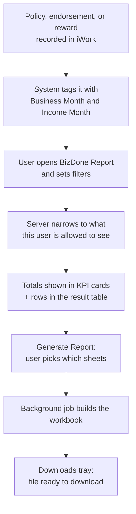

# BizDone Report — Module PRD

iWork is IIRM's internal platform for running the insurance broking business, and the BizDone Report (at `iworkedge.indiainsure.com/biz-done-report`) is the module anyone — a branch manager, an ops lead, or leadership — opens to see exactly how much [Biz Done](../../glossary#biz-done) has been finalised and earned in a given period, broken down by premium and brokerage. This PRD specifies that module's behavior: what it shows, on screen and in its generated workbook, who is allowed to see what, and the business rules governing how a row gets into this report at all. It is written for whoever reads this cold — a developer picking up the module, a client reviewer signing off on it, or a business stakeholder confirming it matches how the report should behave.

> [!warning]
> This module is **not yet registered** in this repo's Daksh roadmap/manifest (`docs/.daksh/manifest.json` lists 16 modules; BizDone is not one of them). This PRD was written by reverse-engineering an already-shipped feature — from source code and a real production data export — rather than forward from an approved BRD/roadmap. User stories below are therefore not traced to BRD use cases or FRs, as Stage 40a would normally require. See Open Question 4.

## Scope

**In scope:** the production report at `/biz-done-report` — its on-screen preview (KPI cards + table) and its generated Excel workbook (up to seven sheets, user-selected).

**Out of scope / deferred:**
- The newer **Enhanced** report's on-screen UI at `/biz-done-report-enhanced` (the company-by-company roll-up view and organisation-hierarchy drill-down widget). Its export output is the same workbook this PRD already documents — only the screen experience is out of scope here.
- The exact effect of the Income Type filter (Policy / Endorsement / Rewards, taken singly) on each of the six download sheets is now documented (Business Rule 11) — this bullet originally flagged it as unconfirmed and is kept here only as a scope note that the confirming sample used Income Type: All.
- A formal reconciliation policy for the three independently-entered brokerage figures (Brokerage Amount, Brokerage Amount As Entered By ISG, Brokerage Amount As Per iWork) — see Business Rule 9 and Open Question 3.

## User Stories

1. **US-BIZDONE-001** — As a branch or team manager, I want to see finalised business (policies, endorsements, rewards) for myself and my direct reports, filtered by period, so that I can track how much premium and brokerage my team has closed.
2. **US-BIZDONE-002** — As a user holding a Leadership or Super User role, I want to widen the Organisation filter beyond my own organisation, so that I can review business across any part of the company.
3. **US-BIZDONE-003** — As a report consumer, I want to choose whether "when did this happen" means the policy's own coverage start ([Business Month](../../glossary#business-month)) or IIRM's books ([Income Month](../../glossary#income-month)), so that I can reconcile against either the underwriting calendar or IIRM's own accounting period.
4. **US-BIZDONE-004** — As a finance or ops user, I want to export the currently filtered report as an Excel workbook, choosing which sheets it contains, so that I have the full underlying ledger — including the CRM ownership chain, GST breakdown, and co-insurer splits — for reconciliation or board reporting, not just the on-screen summary.
5. **US-BIZDONE-005** — As any user, I want to choose which columns appear on screen and have that choice remembered, so that I only see the fields relevant to my role without changing what anyone else sees.

## Business Rules

A row only exists in this report once it has stopped being a pending opportunity and become completed, billable business — a policy, an endorsement, or a reward payout.

The thirteen rules are grouped by the question they answer. Each rule is stated in business terms first; the technical detail and supporting data sit in indented blocks beneath, so the rules themselves stay readable on their own.

### What gets into the report

**BR-BIZDONE-001 — Only finalised business appears.**
Policies, endorsements, and rewards show up once they are finalised. Pending opportunities never appear.

**BR-BIZDONE-002 — Every row has two dates, and you choose which one the report uses.**
**Business Month** is when the policy or endorsement actually took effect. **Income Month** is when IIRM's books recognise that income — anything finalised by the 5th of the following month still counts toward the earlier month, per the [Cut-Off Management PRD](../../IIRM-10585_Cut-Off-Mgmt/IIRM-10585_cut-off_PRD.md). The **Filter by** toggle decides which of the two the report is built around.

This matters because the same business can land in different months depending on the toggle. Reconciling against the underwriting calendar means Business Month; reconciling against IIRM's accounts means Income Month.

**BR-BIZDONE-004 — The report has no fixed size.**
How many rows and sheets you get depends entirely on the filters applied. There is no minimum or maximum.

### Who can see what

**BR-BIZDONE-003 — "Manager + Team" shows the whole downline, not just direct reports.**

By default a user sees only their own business. Switching **View by** to *Manager + Team* adds everyone in their reporting chain — not just the people who report to them directly, but their reports' reports, and so on all the way down.

For a senior manager this can mean a very large share of the company's book. Anyone assuming "my team" means "the handful of people who report to me" will see far more than they expect.

Leadership and Super User roles can also widen the Organisation filter to any part of the company. Everyone else is locked to their own organisation. This is enforced by the system that builds the report, not merely hidden on screen — no combination of filters lets a user reach business outside their own downline, on screen or in an export.

> **What the data shows.** Several managers have between 100 and 392 people beneath them beyond their direct reports. Ordinary managers illustrate the scale: three separate managers' indirect reports alone account for 102,245, 75,158, and 75,035 finalised policies respectively.
>
> Two much larger figures in the same check should be **disregarded** — they belong to IT system/debugging logins, not real users. A third large figure belongs to the founder's account, which was also used to load data at go-live, so its size reflects that migration as much as any real reporting line.
>
> *Technical:* visibility is resolved server-side by an uncapped recursive query over the reporting-manager relationship (`getNewEmployeeHierarchyByUserId`). The disregarded accounts are IDs `-1` and `342395`; the founder's is ID `2`; the ordinary managers are `331`, `2168`, and `5950`.

### How the workbook is put together

**BR-BIZDONE-005 — Both Details sheets end with a Totals row.**
It sums every money column above it. This is a footer, not a policy — anyone importing the file into another system should exclude it.

**BR-BIZDONE-006 — Summary sheets group by their named dimension *and* SBU *and* Vertical.**
Not by the dimension alone. A customer active in two SBUs appears as two separate rows, one per SBU, each with its own totals — so the sheet may have more rows than there are customers.

**BR-BIZDONE-011 — Filtering by most business dimensions makes rewards disappear without warning.**

Choosing an Income Type of Policy, Endorsement, or Rewards narrows the report to that type, as you would expect.

But **rewards vanish entirely — whatever Income Type is set to, including "Rewards" and "All"** — as soon as you filter by SBU, Vertical, Department, Branch, Insurer Branch, Policy Type, Group Company, Broker Agent, or a company name search.

The reason is that rewards aren't attached to an owner or a company the way policies are, so there is nothing for those filters to match against, and every reward row silently drops out. Nothing on screen or in the file signals this.

Separately, rewards never appear inside either Details sheet — only in the Rewards sheet — so that a single reward is never counted twice in one workbook.

**BR-BIZDONE-012 — The Rewards sheet ignores nearly every filter.**

Only Organisation, Insurer, and the period range narrow it. It has no concept of SBU, Vertical, Department, Branch, Insurer Branch, Policy Type, Group Company, Broker Agent, or Income Type, because rewards simply aren't recorded against those attributes.

In practice: filter the report to a single branch, and every other sheet honours that — but the Rewards sheet still shows the entire organisation's rewards for the period. The two sheets in the same workbook are describing different populations.

> **Impact today is small.** The only organisation with real branch/vertical/department breadth has exactly one reward row this affects, worth ₹100. The gap is structural, though, and will matter more as reward volume grows.
>
> *Technical:* the sheet is built by `getRewardsForReport`, whose parameter list is deliberately narrower than every other sheet's.

### Whether the numbers can be trusted

These five rules are the ones to read before using this report for reconciliation or board reporting.

**BR-BIZDONE-010 — Almost all of today's data came from the old system, not from iWork.**

99.6% of policies (194,104 of 194,880) were bulk-loaded from the legacy system, copied across as-is with no recalculation. Only 776 policies were actually created in iWork.

**This rule sets up the next three.** Where the historical data looks internally consistent, that consistency came from the old system — it is not something iWork enforces. Only those 776 newer policies show how the application actually behaves today.

**BR-BIZDONE-009 — Brokerage Amount follows its percentage on new policies, but not on the migrated bulk.**

For policies created in iWork, Brokerage Amount reliably equals Net Premium × Brokerage Percentage. For the migrated majority it does not hold — and most of those rows carry no brokerage percentage at all.

Also note that **"Brokerage Amount", "Brokerage Amount As Entered By ISG", and "Brokerage Amount As Per iWork" are three separately typed figures**. Nothing in the system reconciles them against one another. Where more than one is filled in, they usually disagree.

> **What the data shows.** Of the 776 policies created in iWork, 97.8% carry a real brokerage percentage, and 92.8% of those match the formula to within ₹1 — roughly 91% of that population. Of the 194,104 migrated policies, only 47.6% carry a percentage at all.
>
> On the three brokerage figures: wherever two are both populated, they disagree about **83%** of the time.

**BR-BIZDONE-008 — Gross Premium is only roughly consistent, and this will not improve on its own.**

When a policy is edited in iWork, Gross Premium is kept in step with **Net Premium plus GST only** — the Terrorism and Other components are not part of that calculation. (Sri Lanka works differently: both Net and Gross Premium are calculated automatically from their own components and cannot be typed over.)

The point worth carrying: unlike brokerage above, this inconsistency is **not** explained by the old data. Newly created policies are about as inconsistent as migrated ones, so it will not clean itself up over time. The most likely explanation is simply that not every policy is taxed at a flat 18%.

> **What the data shows.** Gross Premium ≈ Net Premium × 1.18 holds for **75.0%** of policies created in iWork and **79.77%** of migrated ones — a majority either way, but barely different between the two, and far weaker than the brokerage split above.

**BR-BIZDONE-007 — Total Net Premium is calculated when the report runs; it isn't stored anywhere.**
Total Net Premium = Net Premium + Terrorism + Other. Changing any of those three changes this figure the next time the report is generated.

> **Verified twice.** Row-by-row against a 5,695-row export with zero mismatches, and again against the whole-report Totals of the 8 Aug 2026 production export: ₹5,836,087,232.83 + ₹1,555,585,416.33 + ₹268.00 = ₹7,391,672,917.16, matching the reported Total Net Premium to the rupee.

**BR-BIZDONE-013 — The two Details sheets do not agree on brokerage.**

Details-Policy Based gives one brokerage figure per policy. Details-Co-Insurer Based breaks the same policies down by insurer share. Adding the per-insurer figures back up **matches the policy-level figure for only 0.34% of policies** (648 of 188,811).

For a business reader this is the single most important caveat in the document: **this workbook is not a brokerage reconciliation tool.** Its brokerage figures are entered or migrated independently at every level and were never designed to cross-foot.

<details>
<summary>Verification detail — code paths and method notes (for engineering and TRD authoring)</summary>

Formula checks ran against `Sample - BizDones/BizDone_Details-Policy Based.csv` (5,695 rows, one filtered export): Total Net Premium matched Net + Terrorism + Other with zero mismatches; the implied GST rate clustered at ~18% for most rows. That same export showed Brokerage Percentage null on 98% of rows — but proved unrepresentative, being almost entirely legacy-migrated. A follow-up query direct against `public.policy`, split by `ingested_mode`, corrected this: `APPLICATION` (776 rows) is 97.8% non-zero on `basic_brokerage_percentage`, and of those, `basic_brokerage_amount = ROUND(net_premium * basic_brokerage_percentage / 100.0, 2)` within ₹1 for 92.8% (704 of 759); `SQL_LOAD` (194,104 rows) is only 47.6% non-zero.

**Method note worth keeping:** a plain `COUNT(column)` in Postgres counts a stored `0` as populated. Only `COUNT(*) FILTER (WHERE col IS NOT NULL AND col <> 0)` distinguishes a real value from an empty default — this was the mistake behind the misleading 98%-null reading.

Migration behaviour (BR-010): `migratePolicies()` in `policy.service.ts` copies legacy columns as-is, with only two derived assignments — Premium Collected from Gross Premium, and Brokerage Collected from Brokerage Amount.

Code-level tracing covered: `policy.entity.ts` (confirms no `total_net_premium` column exists); `PolicyDetails/formConfig.ts` and `index.tsx` (`handlePremiumAndBrokerageValuesChange`, the live GST↔Gross reconciliation, non-Sri-Lanka only); `Utils/calculatePercentageAmountUpdate.ts` (explicitly skipped for Sri Lanka); the Sri-Lanka auto-populate path (`useAutoPopulateCalculatedFields`); the Opportunity Activity fallback brokerage calculations (`PolicyConfirmationActivity.tsx`, `HeldCoverNoteActivity.tsx`, `PolicyHardCopyActivity.tsx`, `FinalNegotiationActivity.tsx`, `CommonActivity.tsx`); and `policy.repository.ts` (`updatePolicyDetailedSectionById`, a pass-through with no server-side recomputation).

No generated columns, triggers, or slab/tier commission-rate tables exist anywhere in the codebase for any of these fields.

</details>


## Acceptance Criteria

**AC-BIZDONE-001** *(US-001 — team visibility)*
**Given** a non-leadership user with View by set to *Manager + Team*,
**when** they open the BizDone Report,
**then** they see their own business plus that of their entire reporting downline at any depth — not only their direct reports (BR-003).

**AC-BIZDONE-002** *(US-002 — organisation scope)*
**Given** a user holding a Leadership or Super User role,
**when** they change the Organisation filter,
**then** they can select any organisation in the company, not only their own.

> Checked for a related risk: the "finalised" gate this depends on is a single company-wide setting, not one per organisation, so it cannot silently apply the wrong organisation's rule.

**AC-BIZDONE-003** *(US-003 — Business Month vs Income Month)*
**Given** the same underlying business,
**when** the user switches Filter by between Income Month and Business Month,
**then** rows are re-grouped by the corresponding date.

> **Important caveat.** Which policies appear stays the same *only when no period filter is applied.* Once a Financial Year, Quarter, Month, or date range is active, a policy whose two dates fall in different months — exactly what the 5th-of-month cut-off causes (BR-002) — can appear or disappear when the toggle changes. This is expected behaviour, not a defect, but it surprises people reconciling two exports.

**AC-BIZDONE-004** *(US-004 — the export)*
**Given** any set of applied filters,
**when** the user clicks Generate Report and selects one or more sheets,
**then** the workbook contains exactly the sheets they selected, in this fixed tab order: Applied Filters, Summary-Comp Classification, Summary-Policy Classification, Summary-Insurer Classification, Details-Policy Based, Details-Co-Insurer Based, Rewards.

Three things a reader should know about that workbook:

- **Only Details-Policy Based is pre-ticked.** A user who accepts the default gets a one-sheet workbook, not the full set.
- **Applied Filters is added automatically** whenever at least one filter is active, and both Details sheets get a Totals row.
- **Every sheet honours the filters except Rewards**, which only respects Organisation, Insurer, and the period (BR-012).

> **Caveat on the reconciliation use case in US-004.** The brokerage figures in Details-Policy Based do not add up to those in Details-Co-Insurer Based (BR-013 — they agree for 0.34% of policies). The workbook is structurally complete, but it is not a brokerage reconciliation instrument.

**AC-BIZDONE-005** *(US-005 — saved column layout)*
**Given** a user changes visible columns in Table settings and saves,
**when** they reopen the report,
**then** their layout is restored for their account only, with no effect on anyone else's view.

> Confirmed in production: 10 users have saved a layout for the main report and 1 for Rewards mode, with no user holding two conflicting default layouts.


## Data Contract

**Consumes:** the filter parameters listed under [Smart Search](#smart-search--the-filter-bar), plus the requesting user's role and organisation — the latter applied implicitly and server-side per Business Rule 3, never passed by the client.

**Produces:** the on-screen preview (KPI cards + result table) and the generated Excel workbook. Both are read-only views over the same underlying policy, endorsement, and reward records.

**Writes:** nothing to business data. The only persisted state this module creates is per-user UI preference (saved view, saved column layout) and export job records for the Downloads tray.

## The Screen

Everything the user does happens on one screen at `/biz-done-report`: set filters, read the totals, scan the rows, and generate the workbook. The controls below are listed in the order they appear.

### Smart Search — the filter bar

A single collapsed bar across the top summarising the active filters inline (e.g. *Organisation: IIRM India · Owner: Suryamohan Surampudi · View by: Manager + Team · Income Type: All · Financial Year: 2026-2027 · Filter by: Income Month*), with a filter icon opening the full panel.

Two of these are not filters in the ordinary sense and deserve care:

- **Filter by (Income Month / Business Month)** doesn't narrow anything — it changes *which date column the query reads* (Business Rule 2). Switching it can move rows in and out of the result set whenever a period filter is also active (Acceptance Criterion 3).
- **View by (Manager / Manager + Team)** controls visibility depth. "Manager + Team" means the user's **entire reporting downline at any depth**, not just direct reports (Business Rule 3) — the single most commonly misread control on this screen.

The full filter set: Filter by, Financial Year, Quarter, Month, From/To date, Organisation, SBU, Vertical, Department, Branch, Owner, View by (Manager / Manager + Team), Income Type (Policy / Endorsement / Rewards / All), Insurer, Insurer Branch, View by (Branch / Branch + sub-branches), Group Company, Company Name, Policy Type, Broker Agent — plus the logged-in user's role and organisation, applied implicitly and server-side per Business Rule 3.

> [!warning]
> Income Type is not a neutral filter. Selecting a dimension filter (SBU, Vertical, Department, Branch, Insurer Branch, Policy Type, Group Company, Broker Agent, or a company text search) silently drops **all** reward rows, whatever Income Type says — including "Rewards" and "All" (Business Rule 11). Selecting Income Type: Rewards also switches the screen into **Rewards mode**, which uses a different column set and its own saved layout.

### KPI Cards

Four cards totalling the current filtered set. They summarise the same data the table shows — not a different or wider scope.

| Card | What it means | How it is derived |
|---|---|---|
| Gross Premium | The full premium across every row in the current filter, before deductions. | Sum of Gross Premium. |
| Net Premium | Premium after statutory deductions. | Sum of Net Premium. |
| Brokerage Amount | The [brokerage](../../glossary#brokerage) IIRM has earned across that same business. | Sum of Brokerage Amount. |
| Brokerage to Collect | How much of that earned brokerage has not yet been received. | Brokerage Amount − Brokerage Collected. |

> **Worked example — production export of 8 Aug 2026** (filters: IIRM India · Manager + Team · Income Type All · FY 2026-2027 · Income Month). The cards read 660.25 Cr / 583.61 Cr / 45.69 Cr / 40.80 Cr, and the exported workbook's own Totals row gives ₹6,602,455,568.36 gross, ₹5,836,087,232.83 net, ₹456,913,533.64 brokerage, and ₹48,936,106.94 brokerage collected. Every card ties to the workbook exactly, and Brokerage to Collect is confirmed as the difference of the last two.

### List of Records

The result table, headed with the total row count for the current filter (e.g. *List of records (43,903)*) — paginated, sortable, with a configurable page size. IIRM Policy Number and Opportunity ID render as links through to the underlying records.

Every column here is one already defined in the per-sheet child documents; the screen shows a chosen subset. Default columns as of this PRD:

**Shown:** IIRM Policy Number, Opportunity ID, SBU, IIRM Organisation, IIRM Branch, Business Month, Date Of Business, Policy From Date, Policy To Date, Customer Name, Broker Agent, Policy Name, Insurer Name, Reward Category, Remarks, Employee Name, Income Month, Date Of Income, Net Premium, Premium Collected, Gross Premium, Brokerage Amount, Brokerage Collected, Brokerage Amount As Entered By ISG, Brokerage Amount As Per Iwork, Policy Status, Updated Via SQL.

**Available but hidden:** IIRM Reference Number, Insurer Policy Number, Insurer Endorsement Number, Income Type, Entry In Iwork, Cust Id, Customer Category, Policy Category, Insurer Branch, Vertical, Department, Status, Share Percentage, Terrorism, Other, Service Tax, Brokerage Percentage, Fees, Deal Confirmed, Terrorism Brokerage Amount, Terrorism Brokerage Percentage.

Labels differ between screen and workbook for the same underlying field — the screen's "Policy Category" is the workbook's IIRM Category; the screen's "Terrorism Brokerage Amount / Percentage" are `terrorismCommissionAmount` / `terrorismCommissionPercentage`. Same data, different surface labels.

### The Four Action Buttons

| Control | What it does |
|---|---|
| **Save view** | Persists the current filter selection as the user's saved view, so the screen reopens with the same filters next time. Per-user; does not affect anyone else. |
| **Table settings** | Chooses which columns are visible and in what order. Persisted per user, and **separately for Rewards mode** — Rewards uses its own saved-layout entity so that switching modes doesn't drop columns the other mode needs. Confirmed exercised in production: 10 users have saved a main-report layout, 1 for Rewards mode, with no user holding two simultaneously-active defaults. |
| **Generate Report** | Opens a sheet-selection dialog (below), then enqueues the export as a **background job** — the user keeps working while it builds. While one is in flight the button reads *"Preparing report…"* and is disabled; a second attempt raises a toast rather than queuing a duplicate. Gated on the `DOWNLOAD_BUSINESS_PERFORMANCE_REPORT` permission. |
| **Downloads (N)** | Opens the downloads tray listing recent exports with their status and a link to the finished file. Appears only once at least one export exists; **N is the count of *unseen* completed exports**, not the total. |

> [!important]
> **The workbook does not always contain all seven sheets — the user picks.** Generate Report opens a checklist of six selectable sheets (Policy Details, Company Summary, Policy Summary, Insurer Summary, Co-Insurer Details, Rewards), and **only Policy Details is ticked by default**. A user who accepts the default gets a one-sheet workbook. Applied Filters is not in the checklist — it is added automatically whenever at least one filter is active.

### How Data Reaches the Workbook

The numbers don't originate here — they start when a policy, endorsement, or reward is recorded elsewhere in iWork and stamped with Business Month and Income Month (Business Rule 2). Filters narrow that to what the user may see (Business Rule 3); the same filtered set feeds the KPI cards, the table, and the export.



## The Workbook

One Excel workbook, up to seven sheets, in tab order. Which of the six selectable sheets are present depends on what the user ticked in the Generate Report dialog.


| # | Sheet | What it is | Field-level detail |
|---|---|---|---|
| 1 | Applied Filters | A record of exactly what filters produced this workbook. Present only when at least one filter was applied. | [Applied Filters](IIRM-5441_BizDone-Applied-Filters.md) |
| 2 | Summary-Comp Classification | The business rolled up by customer. | [Summary-Comp Classification](IIRM-5441_BizDone-Summary-Comp-Classification.md) |
| 3 | Summary-Policy Classification | The business rolled up by policy name — despite the sheet's name, **not** by policy category. | [Summary-Policy Classification](IIRM-5441_BizDone-Summary-Policy-Classification.md) |
| 4 | Summary-Insurer Classification | The business rolled up by insurer. | [Summary-Insurer Classification](IIRM-5441_BizDone-Summary-Insurer-Classification.md) |
| 5 | Details-Policy Based | The full row-by-row ledger — one row per policy or endorsement — carrying the richest set of fields, including who owns the deal internally. | [Details-Policy Based](IIRM-5441_BizDone-Details-Policy-Based.md) |
| 6 | Details-Co-Insurer Based | The same business restated at the insurer-share level — one row per insurer's share of a policy. | [Details-Co-Insurer Based](IIRM-5441_BizDone-Details-Co-Insurer-Based.md) |
| 7 | Rewards | Every reward payout in the filtered period, on its own. | [Rewards](IIRM-5441_BizDone-Rewards.md) |

### What a Real Workbook Looks Like

The production export of 8 Aug 2026 — filtered to IIRM India, Manager + Team, Income Type All, FY 2026-2027, by Income Month — gives a useful sense of proportion:

| Sheet | Rows |
|---|---|
| Applied Filters | 5 |
| Summary-Comp Classification | 16,910 |
| Summary-Policy Classification | 324 |
| Summary-Insurer Classification | 258 |
| Details-Policy Based | 43,903 |
| Details-Co-Insurer Based | 27 |
| Rewards | 2 |

Three things worth reading off that table:

- **Details-Policy Based is the report.** At 43,903 rows it is effectively the whole dataset; every other sheet is a view onto some slice or roll-up of it.
- **Details-Co-Insurer Based is nearly empty — and that is normal.** Only a handful of policies are genuinely shared across insurers, so 27 rows against 43,903 is expected, not a filtering fault.
- **Summary-Comp Classification has 16,910 rows, not one per customer.** That is BR-006 in practice: a customer active in two SBUs appears twice.

### Where to Look for What

This parent PRD holds everything that is true across the whole report: scope, user stories, the thirteen business rules, acceptance criteria, and open questions. **It deliberately does not carry field-level column definitions** — those live in the per-sheet child documents linked in the table above, one per sheet, because the two Details sheets alone carry over a hundred columns between them and folding that into one document made the shared rules impossible to find.

Each child document follows the same shape: what the sheet is, every column it carries with meaning and formula/source, whatever caveats are specific to that sheet, and a **Change History** section recording what changed, when, and in which commit. Read a child document when you need to know what a specific column means; read this parent when you need to know how the report behaves.

Three cross-sheet warnings are worth carrying into any of them:

- **Summary-Policy Classification is mislabeled.** It groups by raw product name, not by IIRM Category — "Motor" alone spans 608 distinct product names, so a reader expecting one row per category gets hundreds.
- **Summary-Insurer Classification uses a different insurer name than the Details sheets do** (`insurer.name` vs. `insurer.display_name`), and these differ for 48 insurers — so a name-based join between those sheets silently fails for those.
- **Brokerage figures do not cross-foot between Details-Policy Based and Details-Co-Insurer Based** (Business Rule 13 — 0.34% agreement). The workbook is structurally complete but is not a reconciliation instrument for brokerage.

### The Sheets Are Not Uniformly Filtered

A reader naturally assumes every sheet in one workbook reflects the same filters. That assumption holds for Summary-Comp, Summary-Policy, Summary-Insurer, Details-Policy Based, and Details-Co-Insurer Based — and breaks for the other two:

- **Applied Filters** records what the *user selected*, which is not always what the query used, and does not reflect the two Rewards behaviours below.
- **Rewards** honours only Organisation, Insurer, and the period range (Business Rule 12), and disappears entirely when any dimension filter is active (Business Rule 11).

Anyone reconciling one sheet against another should establish which of these two categories each sheet falls into first.


## Open Questions

Everything answerable from the code or the database has already been folded into the business rules above. What remains are five genuine decisions — nothing here is waiting on further investigation.

**OQ-1 — Should the co-insurer sheet show the full ownership chain, and what was "Status" meant to be?** *(Product + Engineering)*

Details-Co-Insurer Based carries a single Emp Name where Details-Policy Based carries the full chain of accountable roles. Separately, that sheet's "Status" column currently shows exactly the same value as "Policy Status" — two headings, one piece of information.

> **Scope is small.** Only 12 policies in the entire database are genuinely co-insured, and for those the ownership data mostly already exists (9 of 12 have an Associate CRM, all 12 a Lead CRM, 11 of 12 an Account Manager). So this is a reporting omission, not missing data.
>
> On "Status": the policy record holds three other status fields never surfaced in this report (approval, cover, and CD status). One of them may be what this column was originally meant to show — engineering needs to confirm which.

**OQ-2 — Do brokerage figures agreed before the policy exists ever carry through to the policy itself?** *(Engineering)*

No code path was found connecting brokerage calculated during pre-policy negotiation into the policy record on creation. BR-009's finding — that 92.8% of iWork-created policies already match the expected formula — suggests *something* populates them, but not which route. This needs an engineering answer rather than more searching.

**OQ-3 — Should the three brokerage figures be reconciled, and which one is authoritative?** *(Product)*

The report shows Brokerage Amount, Brokerage Amount As Entered By ISG, and Brokerage Amount As Per iWork side by side, with nothing tying them together.

> **The gap is large and consistent.** Where Brokerage Amount and "As Per iWork" are both filled in (20,337 rows), they disagree in 16,796 — **82.6%**. Against "As Entered By ISG": 16,811 of 20,337 — **82.7%**. Four times out of five, when someone fills in more than one, they disagree. These are tracking genuinely different things, not drifting copies of one figure.

The decision: nominate one as authoritative, or keep all three and explain plainly what each means.

**OQ-4 — Should BizDone be registered in the Daksh pipeline?** *(Process)*

This module has no entry in the Daksh manifest and no approved roadmap or BRD behind it — this PRD was written by reverse-engineering a shipped feature. If BizDone is to go through the full pipeline (roadmap approval, TRD, task breakdown), it needs onboarding first.

**OQ-5 — Should Lead CRM be switched off in Details-Policy Based, or not?** *(Engineering)*

The column-resequencing script intends to deactivate Lead CRM for the India Details-Policy Based sheet, but the live configuration still has it active. Either the step was never applied or it was reverted. Until confirmed, treat Lead CRM as live in production.


## Approval

```
Approved by:
Role:
Date:

Approved by:
Role:
Date:
```
