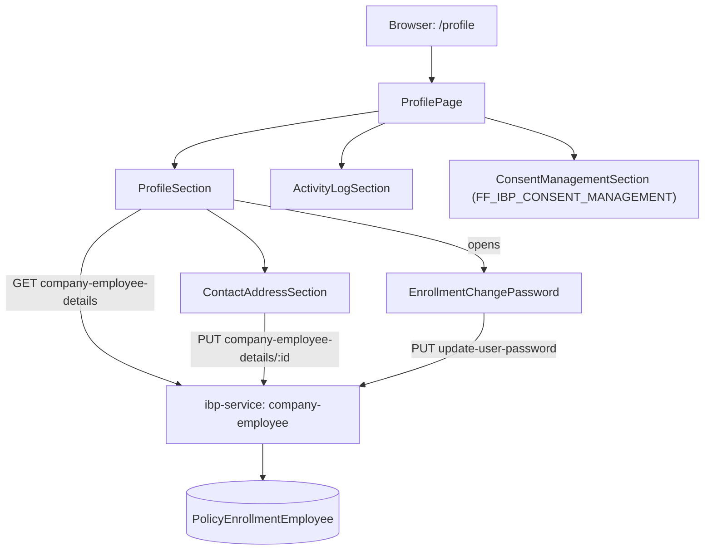

# User Profile & Personal Profile Management — TRD

**Route:** `/profile` · **Frontend:** `apps/ui/ibp/src/app/pages/ProfilePage/`, `apps/ui/ibp/src/app/components/ProfileSection/`, `apps/ui/ibp/src/app/components/ContactAddressSection/`
**Backend:** `ibp-service` (`company-employee` module, same controller/service/repository as every other IBP feature — no dedicated user/profile module exists)
**Status:** Draft (as-is architecture documented; several PRD scope areas found unimplemented or broken) · **Last updated:** 2026-07-20
**Related:** [User Account or Personal Profile Management.md](../PRD/User%20Account%20or%20Personal%20Profile%20Management.md) — product requirements (this is the fuller of two PRD drafts in this repo)

---

## 1. Architecture overview



`ProfilePage/index.tsx:1-23` is a thin layout shell composing three sections. `ActivityLogSection` and `ConsentManagementSection` are separate features sharing this page — out of scope for this TRD (Activity History has its own TRD; see [Activity-History-TRD.md](../../../implementation/ACTIVITY-HISTORY/Activity-History-TRD.md)).

**All PRD-relevant logic lives in `ProfileSection/index.tsx` (1822 lines) and the nested `ContactAddressSection/index.tsx`.**

## 2. Scope-area implementation status

| PRD scope area | Status |
|---|---|
| 4.1 View basic profile | **Implemented** |
| 4.2 View primary contact | **Partially implemented** — no "4 availability states" messaging |
| 4.2 Add/edit secondary contact | **Implemented**, via the generic profile-update endpoint (no dedicated API) |
| 4.3 Change Password | **Implemented, but the eligibility gate is commented out and server-side policy enforcement is missing** |
| 4.4 Address Management | **Not implemented — UI is fully written but commented out; no schema/entity/endpoints exist** |
| 4.5 Profile Picture | **Not implemented**, consistent with the PRD's "Development not required" |

Also present, but **outside this PRD's stated scope** (flagging so it isn't mistaken for a PRD requirement): a full Dependents add/edit/delete panel (`ProfileSection/index.tsx:1543-1725`), "Reset Enrolment" (1491-1499, 1790-1816), and Logout (1500).

## 3. Data sourcing

**Identity:** `employeeId`/`companyId` read from `sessionStorage.getItem("user")` (`ProfileSection/index.tsx:234-236`) — the same pattern used across Life Events, E-Card, etc.

**Field values** (name, DOB, gender, marital status, designation, primary phone/email) come from a dedicated fetch, not sessionStorage:
```ts
useApiQuery({ queryKey: ["employeeDetails", employeeId], url: endPoints.employeeDetails, ... }) // ProfileSection/index.tsx:290-295
```
`endPoints.employeeDetails` → `GET {ibpUrl}/company-employee/company-employee-details` (`endPoints.ts:15`) → `company-employee.controller.ts:530` (`getEmployeeDetails`) → `company-employee.service.ts:2352` (`getEmployeeDetailsByUserId`).

**Secondary contact display, by contrast, is read straight from `sessionStorage`** (`userDetails?.alternatePhoneNumber`/`alternateEmail`, `ContactAddressSection/index.tsx:58-68`), not refetched from the API. After a successful save, the component patches `sessionStorage.user` directly and dispatches a custom `ibp:user-updated` event instead of triggering a refetch (`ContactAddressSection/index.tsx:74-84`).

**Staleness risk (flagged, not yet an issue reported by users):** because secondary-contact display relies on a manually-patched `sessionStorage` object rather than the query cache, if any other tab/flow updates the same sessionStorage key differently, or if the patch logic has a bug, the two sources of truth (API-backed primary fields vs. sessionStorage-backed secondary fields) can silently diverge until next login.

## 4. Secondary contact — implemented via the generic profile-update endpoint

No dedicated "secondary contact" API exists — it's folded into the same PUT used for the whole employee profile:

- Frontend: `ContactAddressSection/index.tsx:41-231`, regex-validated (`REGEX_PATTERNS.EMAIL`/`REGEX_PATTERNS.PHONE`, lines 141, 154), saved via `useApiMutation` → `endPoints.updateEmployeeDetails(employeeId)` PUT (lines 178-200).
- Endpoint: `PUT {ibpUrl}/company-employee/company-employee-details/:employeeId` (`endPoints.ts:16-17`) → `company-employee.controller.ts:1250` → DTO `UpdateEmployeeDetails` (`dto/update-employee-details.dto.ts:17-42`, includes `alternatePhoneNumber`/`alternateEmail` alongside unrelated fields like `employeeName`, `email`, `phone`, `designation`, `gender`).
- Service/repo: `UpdateEmployeeDetailsByEmployeeId` (`company-employee.service.ts:2525`) → `company-employee.repository.ts:653-783`, merging onto `PolicyEnrollmentEmployee` (lines 730-750, `alternatePhoneNumber`/`alternateEmail` at 733-738) and `.save(updatedEmployee)` (line 761).

**Audit trail exists, incidentally, via generic infrastructure — not a purpose-built feature.** `PolicyEnrollmentEmployee` is decorated `@Auditable()` (`policy-enrollment-employee.entity.ts:22`). A TypeORM subscriber under `apps/services/service-lib/src/lib/audit-history/` writes every `.save()` to `AuditHistoryLog` + `AuditHistoryLogDetail` (`fieldName`, `oldValue` jsonb, `newValue` jsonb, `fieldType`). Since the secondary-contact save path goes through `.save()`, old/new value + timestamp **are** captured today — but there is no UI surfacing this to the employee, and it's a generic entity-level audit mechanism shared by many entities, not something built for this PRD's contact/address-history requirement specifically.

## 5. Change Password — implemented, with two real gaps

### 5.1 Frontend gating is broken (confirmed, not a design gap)

```tsx
// ProfileSection/index.tsx:1481-1490
{/* {hasPasswordAuth && ( */}
  <ChangePasswordButton ... onClick={onProfileClick}>
    Change Password
  </ChangePasswordButton>
{/* )} */}
```
`hasPasswordAuth` (line 1449, `userDetails?.loginMethod?.toLowerCase()?.includes("password")`) is computed but **the conditional wrapping the button is commented out** — confirmed directly against the source. The button renders unconditionally today, contradicting PRD 4.3/User Story 6 ("non-password login → CTA should not be displayed").

It also doesn't reuse the established `passwordMethodCodes` pattern (`["EMAIL_PASSWORD","PHONE_PASSWORD","USERNAME_PASSWORD"]`) already used in `SignIn/index.tsx:274-277` and duplicated in `MultiEnrollment/index.tsx:1390-1393`, which compares against the company's actual configured `authMethods[].methodCode` list. `ProfileSection` instead does an ad-hoc substring check on `sessionStorage.user.loginMethod` — a weaker, inconsistent check.

### 5.2 Flow (once un-commented)

`EnrollmentChangePassword/index.tsx`, opened from `ProfileSection/index.tsx:1532-1534` or via router state (`location.state.openChangePassword`, lines 259-265). Client-side validation reads `state.portalConfig.data?.passwordRules` (Redux, `portalConfigSlice.ts:58-74`, sourced via `getCompanyPasswordRules`), falling back to hardcoded `STATIC_RULES` (8 chars + upper/lower/digit/special, `formConfig.ts:34-40`) if none configured. Submits via `doFetch(endPoints.updateUserPassword, {method:"PUT", ...})` (`EnrollmentChangePassword/index.tsx:78-81`) → `PUT {ibpUrl}/company-employee/update-user-password` (`endPoints.ts:40`).

**Do not confuse with** the separate, unrelated `updatePassword` endpoint (`company-employee-password-update`, `endPoints.ts:39`) used only by the pre-login `PasswordReset` component.

### 5.3 Backend gap: no server-side policy enforcement

`company-employee.controller.ts:899-968` only checks `newPassword === reNewPassword`. `company-employee.service.ts:3797-3841` (`updateUserPassword`) only: (1) verifies current password matches, (2) verifies new ≠ current, (3) hashes and saves. **It never re-validates the new password against the company's configured `passwordRules` server-side**, and there is no expiry enforcement despite a `password_expires_at` column existing on the entity but never being read in this flow. **Password policy enforcement today is client-side only** — directly contradicting PRD 4.3's "the system must enforce the password policy rules configured for that company."

## 6. Address Management — not implemented

`ContactAddressSection/index.tsx:433-477` contains a fully-written "Address Information" section (Current/Secondary address, add/edit grids) — **entirely wrapped in a JSX comment** (confirmed: `{/* <AddressSection> ... </AddressSection> */}`, lines 433-477). It references `addressData`, which isn't even defined in the file — it would throw if uncommented as-is.

No backend support exists at all:
- No employee-address columns on `PolicyEnrollmentEmployee` or any entity (no `addressLine1/2`, `city`, `state`, `country`, `pincode`).
- The only address-related endpoints are **country/state/city lookup** for populating dropdowns (`ibpCountriesList`/`ibpStateListById`/`ibpCityListById`, `endPoints.ts:804-808` → `company-employee.controller.ts:3484,3496,3511`) — no save/update endpoint for an employee's own address.
- Other `*Address` entities in `service-lib` (`broker-address.entity.ts`, `contact-address.entity.ts`, `tpa-address.entity.ts`, `mstr-hospital-address.entity.ts`, `company.address.entity.ts`, `insurer-address.entity.ts`) are all different domains — none is an employee personal-address table.

**Conclusion: this is a from-scratch build**, not a partial one. The PRD's "history of address changes" requirement has nothing to audit today since there's no address data in the schema at all.

## 7. Profile Picture — confirmed unbuilt (matches PRD intent)

No upload input, cropping, storage, or display logic anywhere in `ProfilePage`/`ProfileSection`. An unused `ProfileAvatar` styled component (`ProfileSection/styles.ts:81`) is dead leftover styling — never imported. A separate `ProfileAvatarBox`/`ProfileAvatarText` in `EmployeeProfile/index.tsx:184-186` renders **initials only** (no image) but belongs to the **HR portal's employee-detail view**, not this self-service `/profile` page — do not conflate the two. No backend upload/storage code exists (`avatar`/`profilePicture`/`profilePhoto` — zero hits across `ibp-service`).

## 8. Backend ownership

Single service, no dedicated user/profile module — everything lives in the generic `company-employee` folder (`apps/services/ibp-service/src/app/company-employee/{controller,service,repository,module}.ts`), shared with every other IBP employee-facing feature.

**Primary entity:** `PolicyEnrollmentEmployee` (table `policy_enrollment_employee`, `policy-enrollment-employee.entity.ts:19+`) — `employeeName`, `fullName`, `dateOfBirth` (encrypted `@SensitiveField`), `gender`, `email`/`phoneNumber` (encrypted), `alternatePhoneNumber`, `alternateEmail`, `maritalStatus`, `designation`, credential fields (`password`, `ibpPassword`, `isPasswordSet`, `passwordExpiresAt`). Decorated `@Auditable()`.

No dedicated secondary-contact table, no employee-address table.

## 9. Decisions — proposed fixes

### D1 (§5.1) — Un-comment and correct the Change Password gate

**Change:** restore the `{hasPasswordAuth && (...)}` wrapper at `ProfileSection/index.tsx:1481,1490`, and replace the ad-hoc `loginMethod.includes("password")` check with the established `passwordMethodCodes`/`authMethods` comparison already used in `SignIn`/`MultiEnrollment`, for consistency and correctness (the current substring check could false-positive/false-negative depending on exactly how `loginMethod` is serialized into sessionStorage, whereas the `authMethods` list is the authoritative, company-configured source).

### D2 (§5.3) — Add server-side password policy validation

**Change:** in `updateUserPassword` (`company-employee.service.ts:3797-3841`), before hashing and saving, fetch the company's configured password rules (the same source `EnrollmentChangePassword`'s frontend already reads via `getCompanyPasswordRules`) and re-validate the new password server-side — mirroring the defense-in-depth pattern already established elsewhere in this codebase (e.g. Life Events' age-constraint validation is enforced both client- and server-side, per the Life Events TRD). Also read and enforce `passwordExpiresAt` if password expiry is a real product requirement, or explicitly note in the PRD that expiry is not currently enforced if it's being deprioritized.

### D3 (§6) — Build Address Management from scratch

**New columns** on `PolicyEnrollmentEmployee` (or a new dedicated `EmployeeAddress` entity if "Current" + "Permanent" addresses need to coexist as structured rows rather than two sets of columns — **recommend a dedicated entity**, since the PRD requires two named address types plus a change history, which fits a one-employee-to-many-address-rows model better than flat columns): `addressType` (`current`/`permanent`), `addressLine1`, `addressLine2`, `city`, `state`, `country`, `pincode`, plus the standard `createdAt`/`updatedAt`/`@Auditable()` for the history requirement (reusing the same generic audit-history mechanism already proven for secondary contact, §4).

**New endpoints:** `GET`/`PUT /company-employee/employee/:employeeId/address` (or two endpoints for current/permanent, Tech Lead's call) on the existing `company-employee` controller family, consistent with this module's established pattern.

**Frontend:** un-comment `ContactAddressSection/index.tsx:433-477`, define the missing `addressData` state, wire it to the new endpoints, and reuse the existing country/state/city lookup endpoints (`ibpCountriesList`/`ibpStateListById`/`ibpCityListById`) already present for the dropdowns.

## 10. Testing plan

- **D1:** log in via each of the three password-based methods (Email+Password, Phone+Password, Employee Username+Password) and confirm the Change Password CTA shows; log in via OTP/Google and confirm it does NOT show.
- **D2:** attempt a password change with a new password that violates the company's configured rules (too short, missing required character class) — confirm the backend rejects it even if a modified/bypassed frontend somehow submitted it.
- **D3:** add a Current address, add a Permanent address, update each, and confirm both the current values and an old/new/timestamp history entry are retrievable.

## 11. Rollout / risk

- D1 is a pure frontend fix, low risk, closes an existing security-relevant UX gap (the CTA being shown to users who can't use it) immediately.
- D2 changes backend validation behavior for an existing, already-shipped endpoint — additive validation only (rejecting previously-accepted-but-policy-violating passwords), no schema change, low risk.
- D3 is a from-scratch feature with a schema addition — should ship behind the same kind of review any new PII-adjacent data collection warrants (address is personal data), and coordinate with whatever data-retention/PII-encryption conventions this codebase already applies to other `@SensitiveField`-decorated columns (e.g. `dateOfBirth`, `phoneNumber` on the same entity).
