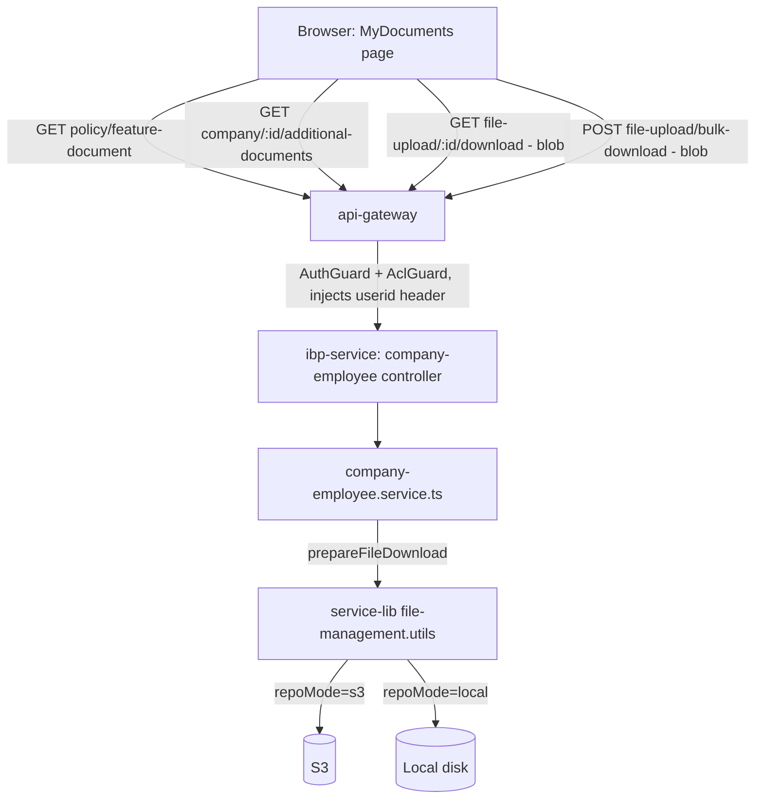

# My Documents — Technical Design Document

**Route:** `/my-documents`, `/my-documents/preview` (IBP frontend) · **Backend:** `ibp-service` (`company-employee` controller), fronted by `api-gateway`
**Status:** Draft (as-is architecture documented; two fixes speced, not yet implemented) · **Last updated:** 2026-07-20
**Related:** [My-Documents-PRD.md](./My-Documents-PRD.md) — product-facing requirements (FR-1, FR-2) and acceptance criteria

This TRD documents the actual current implementation of the My Documents module (frontend + backend + auth trust boundary), root-causes the broken document preview, and specs the two changes required by the PRD. It intentionally also inventories adjacent findings (dead code, enum drift) surfaced during this investigation, flagged as follow-ups rather than in-scope changes.

---

## 1. Architecture overview



**Trust boundary:** `ibp-service`'s `company-employee` controller has **no `@AuthProtected()` guard** on the document/file routes themselves (only `login` and `tickets` routes do). Authentication and authorization are enforced one layer up, at `api-gateway`'s proxy routes (`@UseGuards(AuthGuard, AclGuard)`), which resolve the caller's identity from the verified JWT and inject it as an `userid` request header before proxying to `ibp-service`. This is intentional (gateway-as-trust-boundary pattern used elsewhere in this codebase) but means any direct call to `ibp-service` bypassing the gateway would be unauthenticated — not a concern for this PRD's scope, noted for completeness.

## 2. Frontend component map

| File | Role |
|---|---|
| `apps/ui/ibp/src/app/app.tsx:233-234` | Routes: `/my-documents` → `MyDocuments`, `/my-documents/preview` → `DocumentPreviewPage`. |
| `apps/ui/ibp/src/app/pages/MyDocuments/index.tsx` | Page shell: header (`MY_DOCUMENTS.TITLE`/`SUB_TITLE`, `apps/ui/ibp/src/app/constants/index.ts:711-714`), fetches both document sets, merges them, renders a single hardcoded tab (`tabKey="policyFeature"`, line 454). |
| `apps/ui/ibp/src/app/pages/MyDocuments/PolicyFeatureDocTab.tsx` | The actual logic: normalization, filter/search/sort application, section grouping, selection state, view/download actions. This is where both FR-1 and FR-2 changes land. |
| `apps/ui/ibp/src/app/common/PolicyDocumentCard/index.tsx` | Individual document card (icon, name, "Latest modify", View/Download buttons). |
| `apps/ui/ibp/src/app/pages/DocumentPreviewPage/index.tsx` | `/my-documents/preview` — reads metadata from `location.state` (`DocumentPreviewState`, lines 31-40), renders `Properties` panel from that state directly, and renders the shared `DocumentPreview` (ui-lib) component for the actual file. |
| `apps/ui/ui-lib/src/lib/commonComponents/DocumentPreview/index.tsx` | Shared pdf.js-based preview renderer (also used elsewhere — see TRD for `PolicyFeaturePreview`/`HRPortalPolicyFeature` in the responsive-fix work). This is where the preview fetch and its swallowed error live. |

## 3. Data flow: listing, search, filter

Two independent `useApiQuery` calls, merged client-side in `MyDocuments/index.tsx:238-250`:

1. **Policy-feature documents** (server-filtered) — `index.tsx:200-224`:
   `endPoints.policyFeatureDocumentsByEmployee(employeeId, { search, category, documentType, sortOrder })` → `apps/ui/ui-lib/src/lib/constants/endPoints.ts:101-123` →
   `GET {ibpUrl}/company-employee/policy/feature-document?employeeId=...&search=...&category=...&documentType=...&sortOrder=...`
   Backend: `ibp-service/.../company-employee.controller.ts:2618` (`@Get("policy/feature-document")`) → `getActivePolicyFeatureDocumentForEmployee`.

2. **Company additional documents** (unfiltered fetch, client-side filter) — `index.tsx:226-236`:
   `endPoints.companyAdditionalDocuments(companyId)` → `endPoints.ts:29-30` →
   `GET {ibpUrl}/company-employee/company/{companyId}/additional-documents`
   Backend: `company-employee.controller.ts:406` (`@Get("company/:companyId/additional-documents")`).

Both are normalized (`extractPolicyFeatureDocuments`, `normalizeCompanyAdditionalDocuments`, `index.tsx:60-105`) and concatenated (`index.tsx:238-250`) before being handed to `PolicyFeatureDocTab`, which does the actual grouping/filter/sort/search over the merged array (`PolicyFeatureDocTab.tsx:584-616`).

### 3.1 Document type / category enum drift (documented, not fixed this round)

Three independent definitions exist today, not fully aligned:

| Source | Values |
|---|---|
| Backend request DTO (`get-policy-feature-documents-query.dto.ts:27-58`) — what's actually **validated** | `category`: all, policies, claims, life_events, personal_documents, support_tickets, mail, other. `documentType`: all, policy_certificate, claim_form, life_event_proof, personal_document, support_ticket, communication, document. |
| Backend service-internal matching types (`company-employee.service.ts:148-166`) | Same `category`/`documentType` unions **minus `support_tickets`/`support_ticket`** — an inconsistency between what the DTO accepts and what the matching logic recognizes. |
| Frontend labels (`PolicyFeatureDocTab.tsx:207-262`) | The same 7 document-type labels **plus a client-only 8th value, `additional_document`**, used only for the merged-in company-additional-documents set. |

Because `additional_document` isn't in the backend's `@IsIn` allow-list, and the API layer runs a global `ValidationPipe({ whitelist: true, forbidNonWhitelisted: true })` (`service-lib/common-bootstrap.ts:110-116`), selecting the "Additional Document" filter causes the **policy-feature-document** server call to fail validation (400) — while the additional documents still display correctly because they're filtered client-side from the unconditional call. Net effect: the filter "works" from the user's point of view (the right documents show) but one of the two underlying network calls is silently erroring on every request while that filter is active. **Flagged as GAP-3 in the PRD — not fixed in this round**, since it doesn't block FR-1/FR-2 and touches shared backend validation.

## 4. Selection & bulk download — current implementation

State: `selectedRows: Set<string>` (`PolicyFeatureDocTab.tsx:359`), keyed by `getDocumentRowKey(doc, index)` (`String(doc.id ?? doc.documentId ?? index)`, lines 642-645).

- `toggleRowSelect(key)` (630-640) — flips a single row.
- `toggleSectionSelect(sectionDocs, allSelected)` (647-663) — "Select All" / "Deselect All" handler for one section.
- Per-section render (820-871):

```tsx
const selectedInSectionCount = sectionDocKeys.filter((k) => selectedRows.has(k)).length;
const allSectionSelected = sectionDocs.length > 0 && selectedInSectionCount === sectionDocs.length;
...
<SelectAllButton onClick={() => toggleSectionSelect(sectionDocs, allSectionSelected)}>
  {allSectionSelected ? "Deselect All" : "Select All"}
</SelectAllButton>
<DownloadAllButton
  startIcon={<FileDownloadOutlinedIcon />}
  disabled={selectedInSectionCount <= 1}
  onClick={() => {
    const selectedSectionDocs = sectionDocs.filter((doc, index) =>
      selectedRows.has(getDocumentRowKey(doc, index)),
    );
    void handleBulkDownload(selectedSectionDocs, sectionLabel);
  }}
>
  Download All
</DownloadAllButton>
```
(`PolicyFeatureDocTab.tsx:826-869`)

`handleBulkDownload` (415-495 range) filters out `mail`-category items and falsy `documentId`s, then `POST`s `{ documentIds, zipFileName }` to `ibpFileUploadBulkDownload` (`{ibpUrl}/company-employee/file-upload/bulk-download`, `endPoints.ts:94`) with `responseType: "blob"`, reads the `Content-Disposition` header for the zip filename, and triggers a client-side download.

### D1 — Fix: change the enablement threshold from `≤ 1` to `=== 0`

**Change:**
```diff
- disabled={selectedInSectionCount <= 1}
+ disabled={selectedInSectionCount === 0}
```
at `PolicyFeatureDocTab.tsx:859`.

**Rationale:** Satisfies PRD FR-2 exactly — "Download All" should be disabled only when nothing is selected, and enabled as soon as ≥1 document is selected (whether via "Select All" or an individual checkbox). No other logic in `handleBulkDownload` needs to change — it already correctly operates on whatever is in `selectedRows` regardless of count, including a single document (a 1-file "bulk" download still produces a valid zip via the same endpoint). This is a one-line, purely client-side change with no backend/API impact.

**Testing:** AC-2.1–AC-2.4 in the PRD map 1:1 to manual/e2e checks: 0 selected → disabled; 1 selected → enabled + downloads that 1 file; Select All → enabled + downloads all; deselect back to 0 → disabled again.

## 5. Document preview — root cause and fix

### 5.1 Current flow

"View" (`PolicyFeatureDocTab.tsx:497-560`, `handleViewDocument`) navigates:
```ts
navigate("/my-documents/preview", {
  state: { documentId, fileName, mimeType, title, documentType, associatedContext, uploadedBy, lastUpdated },
});
```
`DocumentPreviewPage` renders the Properties panel directly from this state (always works, independent of the preview binary — this is why the Properties panel in the reported screenshot shows correct data even though the preview pane fails), and renders the shared preview:
```tsx
<DocumentPreview
  fileId={documentId}
  fileName={fileName}
  mimeType={mimeType}
  getFileDownloadUrl={endPoints.ibpFileUploadDownloadById}
  previewHeight="65vh"
  showDownloadButton={false}
  showFileMeta={false}
/>
```
(`DocumentPreviewPage/index.tsx:116-124`)

`DocumentPreview` (`ui-lib/.../DocumentPreview/index.tsx`) is a **pdf.js-based renderer** (default `previewMode="pdfjs"`, not an iframe/embed). Its file-loading effect:

```ts
// index.tsx:406-441
const loadPreview = async () => {
  setLoading(true);
  setError(null);
  try {
    ...
    const response = await apiRequest(sourceUrl, { method: "GET", responseType: "blob" });
    const blob = response.data as Blob;
    const url = URL.createObjectURL(blob);
    setPreviewUrl(url);
  } catch (_err) {
    setError("Unable to load the document preview.");   // <-- underlying error discarded here
  } finally {
    setLoading(false);
  }
};
```

`sourceUrl` = `getFileDownloadUrl(Number(fileId))` = `ibpFileUploadDownloadById(documentId)` → `GET {ibpUrl}/company-employee/file-upload/{documentId}/download`.

### 5.2 Backend path for that request

`company-employee.controller.ts:1146` (`@Get("file-upload/:documentId/download")`) → `downloadFile` (1146-1202) → `company-employee.service.ts:1048-1059` (`downloadEmployeeFile`) → shared `prepareFileDownload` util (`service-lib/.../file-management.utils.ts:254-287`), which:
- looks up the DB file-upload record for the given key,
- fetches the byte stream from **S3** or **local disk** depending on `repoMode` config,
- **throws `NotFoundException`** if either the DB record or the underlying storage object is missing (lines ~270-279).

A `NotFoundException` here becomes an HTTP 404, proxied straight back through `api-gateway`'s streaming proxy (`handleFileDownloadProxy`, `app-gateway/.../app.controller.ts:945-1002`) to the browser. `apiRequest`'s blob-based error path then surfaces that as a generic axios error, which `DocumentPreview`'s catch-all (§5.1) converts into the single message *"Unable to load the document preview."* regardless of whether the real cause was:
- (a) the file genuinely missing from storage (DB record present, S3/disk object absent — the most likely cause of the reported bug, since the metadata/Properties panel populates correctly, meaning the DB record and its non-file metadata exist), or
- (b) an auth/CORS failure on the blob fetch, or
- (c) a transient network error.

**This single swallowed catch — not knowing which of (a)/(b)/(c) actually occurred — is the concrete defect underlying GAP-1.** Given the Properties panel (sourced from the same document record, via navigation state) renders correctly, (a) — file-not-found-in-storage — is the most probable cause in the reported case, but the current code gives no way to confirm this without server-side log inspection.

### D2 — Fix: stop discarding the real error; log it and (optionally) differentiate the message

**Change 1 (required, minimal):** in the `catch` block at `DocumentPreview/index.tsx:435-438`, capture and log the actual error before setting the generic message, so it's diagnosable from browser/console or an error-reporting pipeline instead of vanishing silently:

```diff
- } catch (_err) {
+ } catch (err) {
    if (!isCancelled) {
+     console.error("DocumentPreview: failed to load preview blob", err);
      setError("Unable to load the document preview.");
    }
```

This alone satisfies PRD AC-1.2's "failure reason is captured" requirement without changing the user-facing message or component contract — the safest, lowest-risk fix.

**Change 2 (recommended, optional):** if product wants the UI itself to distinguish a genuinely-missing file from a transient error (open question in the PRD §8), branch on the caught error's HTTP status (`err?.response?.status === 404` → a distinct "This document is no longer available." message; anything else → keep the current generic message with the existing "Try downloading the file instead." fallback). This is a larger change (touches the shared `DocumentPreview` component's public error-string contract, used by other consumers per the earlier responsive-fix work on `PolicyFeaturePreview`/`HRPortalPolicyFeature`) and is left as a follow-up pending that product decision.

**Note on AC-1.1** ("a document with a valid, retrievable file must render"): nothing in this investigation indicates the *rendering* path (pdf.js load, blob→object-URL, canvas draw) is broken — the failure is upstream, in fetching the bytes at all. Once a given document's underlying storage object is confirmed present (verify via the same `prepareFileDownload` path, e.g. a direct download of that `documentId` succeeding), AC-1.1 should already hold with no rendering-side change needed. If a specific document still fails to render after confirming the file exists in storage, that would be a distinct, new investigation (outside what this TRD can conclude from static analysis alone).

## 6. Decisions log

| # | Decision | Rationale |
|---|---|---|
| D1 | Change `DownloadAllButton`'s `disabled` condition from `selectedInSectionCount <= 1` to `selectedInSectionCount === 0` (`PolicyFeatureDocTab.tsx:859`). | Directly satisfies PRD FR-2. Purely client-side, no API/backend change — `handleBulkDownload` already handles any non-zero selection count correctly. |
| D2 | Stop silently discarding the real fetch error in `DocumentPreview`'s `loadPreview` catch block (`DocumentPreview/index.tsx:435-438`); log it. Optionally (follow-up, pending product input) differentiate the user-facing message by HTTP status. | Satisfies PRD FR-1/AC-1.2 with minimal, low-risk change. A status-based differentiated message is deferred as a separate, larger change since `DocumentPreview` is a shared component used by other pages. |
| D3 | Document (not fix) the "Additional Document" filter's backend-validation mismatch (GAP-3) and the two other adjacent findings (GAP-4 personal-documents widget, GAP-5 unused tab config) as explicit follow-ups rather than folding them into this round. | None of the three block FR-1/FR-2, each has its own blast radius (shared validation DTO, a half-built upload feature, dead routing scaffolding) that warrants a separate, deliberate change rather than bundling into a preview/selection bugfix. |

## 7. Testing plan

- **FR-2 (D1):** Manual — for a section with ≥3 documents: (0 selected → Download All disabled) → (select 1 → enabled, click, verify a 1-file zip downloads) → (select all → enabled, click, verify full zip) → (deselect all → disabled again). Repeat across at least two sections (e.g. "Policies Document" and "Additional Documents") since each section's selection state is independent.
- **FR-1 (D2):** Manual — open "View" on a document known to preview successfully today (regression check: still works); open "View" on a document reproducing the reported failure and confirm the browser console now logs the underlying error (status code and message) instead of nothing.
- **Regression:** confirm the Properties panel continues to populate correctly in both the success and failure preview cases (it does not depend on the preview fetch at all, per §5.1 — should be unaffected by D2).

## 8. Rollout / risk

- Both D1 and D2 are small, isolated, frontend-only changes with no API contract change and no backend deploy required.
- D2's "Change 1" (log-only) carries effectively zero behavioral risk — the user-facing message and error UI are unchanged, only a `console.error` is added.
- D1 carries no risk beyond the intended UX change itself (more permissive enablement of an existing, already-tested download path).
