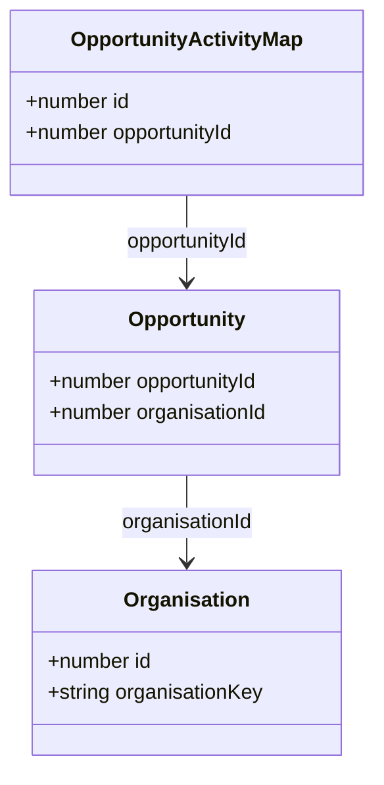
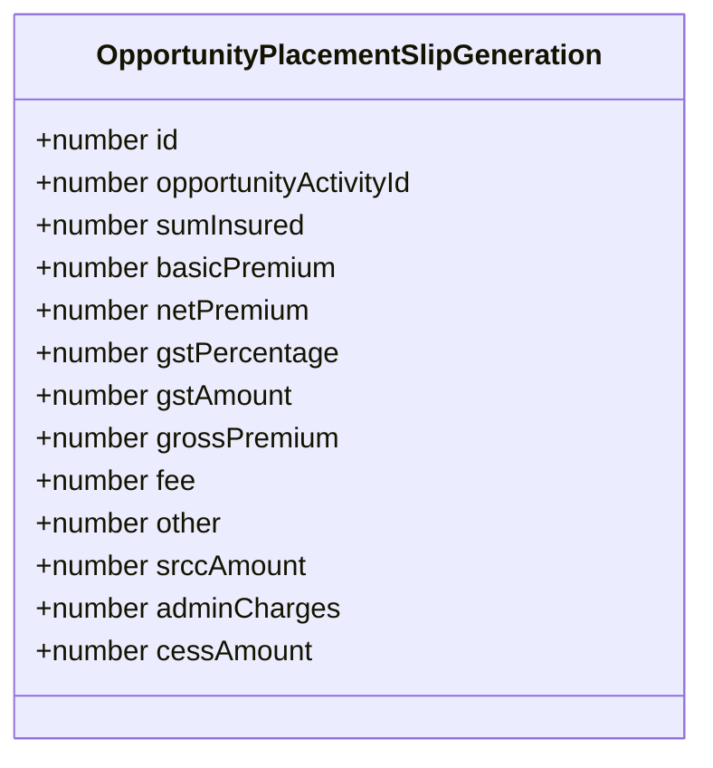

# AI Policy Details Extractor — Business & Functional Requirements

## 1. Purpose

This document defines the business and functional requirements for the **AI Policy Details Extractor** — an AI-powered endpoint within the IIRM platform that accepts an insurance policy document (PDF), extracts key financial details from it, and compares those extracted values against the existing placement slip record stored in the `opportunity_placement_slip_generation` table for the given opportunity. The result is a field-level match report returned to the caller, enabling the UI to highlight discrepancies in the **Policy Hard Copy** section of the Opportunity Activity flow.

The extraction is not a replacement for manual data entry; it is a verification assist that surfaces mismatches so the operator can reconcile them with confidence.

The endpoint is **organisation-aware**: the field set extracted from the PDF and compared against the DB is determined by the `organisationKey` of the organisation that owns the opportunity (`iirm_india`, `iirm_srilanka`, `iirm_kenya`). Each organisation may use different financial fields and different document terminology (GST vs. VAT vs. Levies).

---

## 2. Scope

### **In-Scope**

- **PDF Upload:** Accepting an insurance policy PDF via a dedicated REST endpoint (`POST /pdf-analyser/policy-details`)
- **Document Parsing:** Extracting text content and tables from the PDF using Azure Document Intelligence
- **Organisation Resolution:** Determining the `organisationKey` from the opportunity entity chain (`OpportunityActivityMap → Opportunity → Organisation`)
- **AI Field Extraction:** Using Azure OpenAI to extract financial fields from the document using org-specific field lists and terminology hints
- **DB Lookup:** Fetching the `opportunity_placement_slip_generation` record for the given `opportunityActivityId`
- **Field-Level Comparison:** Comparing each extracted field against its database counterpart and producing an `is_matched` boolean per field
- **Mismatch Summary:** Returning an overall `message` string that is empty when all fields match and lists the mismatched field names when discrepancies are found
- **Search Index Cleanup:** Deleting the temporarily indexed document from Azure Cognitive Search after extraction is complete

### **Field Sets by Organisation**

#### India (`iirm_india`) — Default

| Field Key | Type | AI Terminology |
|-----------|------|---------------|
| `policy_number` | string\|null | policy number / insurer policy number |
| `sum_insured` | number\|null | sum insured |
| `basic_premium` | number\|null | basic premium |
| `net_premium` | number\|null | net premium |
| `gst_percentage` | number\|null | GST percentage |
| `gst_amount` | number\|null | GST amount |
| `fee` | number\|null | fee / broker fee |
| `other_amount` | number\|null | other amount |
| `total_premium` | number\|null | total premium |

#### Kenya (`iirm_kenya`)

Same 9 field keys as India. AI prompt uses different terminology:
- `gst_percentage` → **"Levies percentage"**
- `gst_amount` → **"Levies amount"**
- `other_amount` → **"stamp duty / other charges"**

DB mapping is identical to India.

#### Sri Lanka (`iirm_srilanka`)

11 fields — does **not** include `sum_insured`; adds SRCC, admin charges, and cess:

| Field Key | Type | AI Terminology |
|-----------|------|---------------|
| `policy_number` | string\|null | policy number / insurer policy number |
| `basic_premium` | number\|null | basic premium |
| `srcc_amount` | number\|null | SRCC premium amount |
| `net_premium` | number\|null | total net premium |
| `admin_charges` | number\|null | admin charges |
| `other_amount` | number\|null | stamp duty / other charges |
| `cess_amount` | number\|null | cess / cess amount |
| `fee` | number\|null | policy fee |
| `gst_percentage` | number\|null | VAT percentage / service tax percentage |
| `gst_amount` | number\|null | VAT amount / service tax amount |
| `total_premium` | number\|null | total gross premium including tax and other charges |

### **Out-of-Scope**

- Saving or updating the `opportunity_policy_hard_copy` record — this endpoint is read-only from a database write perspective
- Extracting non-financial fields (coverage terms, exclusions, endorsement details, insurer name, branch, branch code, location)
- Validating branch or location against any master lookup table
- Returning partial-match scores (e.g., fuzzy name matching percentage)
- Batch processing of multiple PDFs in a single request
- Storing an audit log of extraction attempts (may be added in a future iteration)
- Organisations not listed above — unknown `organisationKey` values fall back to the India (`iirm_india`) field set

---

## 3. Stakeholders

- **Primary Users:** IIRM Operators / Relationship Officers — validate that the physical policy document received from the insurer matches the financial details already recorded in the system
- **System Actors:** AI Service (`ai-service`) — hosts the extraction endpoint; Azure Document Intelligence — parses PDF content; Azure OpenAI — extracts structured field values; Azure Cognitive Search — temporarily indexes document for RAG context; PostgreSQL — source of truth for `opportunity_placement_slip_generation` records
- **Consuming UI:** Policy Hard Copy section within the Opportunity Activity flow

---

## 4. Key Use Cases

### **Use Case UC-PDC-001: Upload Policy Document and Compare Financial Details**

**Description:** Operator uploads a policy PDF for a given opportunity. The system resolves the organisation, extracts the org-specific financial fields using AI, and compares them against the saved placement slip record, returning a per-field match report.

**Actors:** IIRM Operator, AI Service

**Preconditions:** Operator is authenticated; a valid policy PDF is available; an `opportunity_policy_hard_copy` record exists for the given `opportunity_id`; Azure services are reachable

**Main Flow:**

```mermaid
flowchart TD
    A[Operator uploads policy PDF via POST /pdf-analyser/policy-details?opportunityActivityId=X] --> B[AI Service validates file and opportunityActivityId]
    B --> C[Resolve organisationKey via OpportunityActivityMap → Opportunity → Organisation - default iirm_india]
    C --> D[Azure Document Intelligence parses PDF - extracts text and tables]
    D --> E[AI Service indexes extracted content in Azure Cognitive Search]
    E --> F[AI Service calls Azure OpenAI with org-specific field list and terminology]
    F --> G[AI Service deletes document from Azure Cognitive Search]
    G --> H[AI Service queries opportunity_placement_slip_generation WHERE opportunity_activity_id = X]
    H --> I{Placement slip record found?}
    I -->|Yes| J[Map DB fields using org-specific field mapping]
    I -->|No| K[All db_value fields set to null]
    J --> L[Compare each extracted field against DB value using org field keys]
    K --> L
    L --> M{Any mismatches?}
    M -->|Yes| N[message = Mismatch found in - comma-separated field names]
    M -->|No| O[message = empty string]
    N --> P[Return 200 OK with success=true, data={fields, message}]
    O --> P

    classDef user fill:#DFF,stroke:#00F;
    classDef system fill:#FFD,stroke:#F90;
    classDef decision fill:#FDF,stroke:#A0A;

    class A user;
    class B,C,D,E,F,G,H,J,K,L,N,O,P system;
    class I,M decision;
```

**Alternate Flows:**

- If no file is uploaded, return HTTP 400 with `{ success: false, error: "No file uploaded" }`
- If `opportunityActivityId` is missing or non-numeric, return HTTP 400 with `{ success: false, error: "opportunityActivityId query param is required and must be a valid number" }`
- If organisation resolution fails, fall back to `iirm_india` field set silently
- If Azure Document Intelligence or OpenAI is unavailable, return HTTP 500 with the service error message

---

### **Use Case UC-PDC-002: No Placement Slip Record Found**

**Description:** The operator uploads a PDF but no `opportunity_placement_slip_generation` record exists yet for that `opportunityActivityId`. The system still extracts values from the PDF and returns them, with all `db_value` fields set to `null` and `is_matched` logic based on whether the extracted value is also null.

**Main Flow:** Same as UC-PDC-001 up to the DB lookup step. When `findOne` returns null, all `db_value` properties are `null`. A field where both `extracted` and `db_value` are `null` is considered matched. A field where `extracted` is non-null and `db_value` is null is a mismatch.

---

### **Use Case UC-PDC-003: Organisation-Specific Extraction**

**Description:** The same endpoint serves operators from India, Sri Lanka, and Kenya. The field set and document terminology used in the AI prompt differ per organisation. The operator does not need to specify the organisation — it is resolved automatically from the opportunity.

**Key Behaviour by Org:**
- India: 9 fields, GST terminology
- Kenya: 9 fields (same keys), Levies terminology
- Sri Lanka: 11 fields, VAT terminology, no `sum_insured`, adds `srcc_amount` / `admin_charges` / `cess_amount`

---

## 5. Functional Requirements

### **Document Upload and Parsing**

1. **FR-PDC-001:** The system shall expose a `POST /pdf-analyser/policy-details` endpoint accepting a multipart form upload with a single `file` field containing a PDF document, and a required `opportunityActivityId` query parameter (integer).

2. **FR-PDC-002:** The endpoint shall require a `userid` header identifying the requesting operator. The value is used for S3 key namespacing of the temporary upload path.

3. **FR-PDC-003:** The system shall process the uploaded PDF using Azure Document Intelligence to extract the full text content and tabular data from every page. The result shall be indexed in Azure Cognitive Search under a unique UUID generated for each upload.

4. **FR-PDC-004:** After indexing, the system shall wait 2 seconds for search index propagation before making the AI extraction call.

5. **FR-PDC-005:** After the AI extraction is complete, the system shall delete the indexed document from Azure Cognitive Search. A deletion failure shall be logged but shall not affect the HTTP response.

### **Organisation Resolution**

6. **FR-PDC-017:** Before AI extraction, the system shall resolve the `organisationKey` for the request via the following entity chain:
   - `OpportunityActivityMap` where `id = opportunityActivityId` → `opportunityId`
   - `Opportunity` where `id = opportunityId` → `organisationId`
   - `Organisation` where `id = organisationId` → `organisationKey`

   If any step in the chain returns null (no record found), the system shall fall back to `organisationKey = 'iirm_india'` and continue processing. This fallback shall not result in an error response.

### **AI Field Extraction**

7. **FR-PDC-006:** The system shall call Azure OpenAI with the indexed document content as context and a structured extraction prompt. The field list, field descriptions, and document terminology used in the prompt shall be determined by the resolved `organisationKey`. The system shall return `null` for any field it cannot find.

   **India / default field list (9 fields):**

   | Field Key | Type | AI Terminology |
   |-----------|------|---------------|
   | `policy_number` | string\|null | policy number or insurer policy number |
   | `sum_insured` | number\|null | sum insured / coverage amount |
   | `basic_premium` | number\|null | basic premium |
   | `net_premium` | number\|null | net premium |
   | `gst_percentage` | number\|null | GST percentage (number only, e.g. 18) |
   | `gst_amount` | number\|null | GST amount (not percentage) |
   | `fee` | number\|null | broker / service fee |
   | `other_amount` | number\|null | other charges |
   | `total_premium` | number\|null | total premium |

   **Kenya overrides** (same 9 keys, different terminology in prompt):
   - `gst_percentage` → search for "Levies percentage"
   - `gst_amount` → search for "Levies amount"
   - `other_amount` → search for "Stamp duty / other charges"

   **Sri Lanka field list (11 fields):**

   | Field Key | Type | AI Terminology |
   |-----------|------|---------------|
   | `policy_number` | string\|null | policy number or insurer policy number |
   | `basic_premium` | number\|null | basic premium |
   | `srcc_amount` | number\|null | SRCC premium amount |
   | `net_premium` | number\|null | total net premium |
   | `admin_charges` | number\|null | admin charges |
   | `other_amount` | number\|null | stamp duty / other charges |
   | `cess_amount` | number\|null | cess / cess amount |
   | `fee` | number\|null | policy fee |
   | `gst_percentage` | number\|null | VAT percentage / service tax percentage |
   | `gst_amount` | number\|null | VAT amount / service tax amount |
   | `total_premium` | number\|null | total gross premium including tax and other charges |

8. **FR-PDC-007:** The AI prompt shall instruct the model to return `null` for any field it cannot find in the document. The system shall strip markdown code fences from the response before JSON parsing.

9. **FR-PDC-008:** If the AI response cannot be parsed as valid JSON, the system shall return a default object with all org-specific fields set to `null` rather than propagating the error. The comparison step continues with the null-filled extracted values.

### **Database Lookup**

10. **FR-PDC-009:** The system shall query the `opportunity_placement_slip_generation` table for the record where `opportunity_activity_id` equals the request `opportunityActivityId`. No joins to `opportunity_placement_slip_insurer_map`, `insurer`, or `address` are required.

11. **FR-PDC-010:** The DB field mapping per organisation shall be:

    **India / Kenya (9 fields):**

    | Response Field | DB Column | Entity Property |
    |---|---|---|
    | `sum_insured` | `sum_insured` | `sumInsured` |
    | `basic_premium` | `basic_premium` | `basicPremium` |
    | `net_premium` | `net_premium` | `netPremium` |
    | `gst_percentage` | `gst_percentage` | `gstPercentage` |
    | `gst_amount` | `gst_amount` | `gstAmount` |
    | `fee` | `fee` | `fee` |
    | `other_amount` | `other` | `other` |
    | `total_premium` | `gross_premium` | `grossPremium` |
    | `policy_number` | — | always `null` |

    **Sri Lanka (11 fields):**

    | Response Field | DB Column | Entity Property |
    |---|---|---|
    | `basic_premium` | `basic_premium` | `basicPremium` |
    | `srcc_amount` | `srcc_amount` | `srccAmount` |
    | `net_premium` | `net_premium` | `netPremium` |
    | `admin_charges` | `admin_charges` | `adminCharges` |
    | `other_amount` | `other` | `other` |
    | `cess_amount` | `cess_amount` | `cessAmount` |
    | `fee` | `fee` | `fee` |
    | `gst_percentage` | `gst_percentage` | `gstPercentage` |
    | `gst_amount` | `gst_amount` | `gstAmount` |
    | `total_premium` | `gross_premium` | `grossPremium` |
    | `policy_number` | — | always `null` |

12. **FR-PDC-011:** If no `opportunity_placement_slip_generation` record is found for the given `opportunityActivityId`, the system shall set all `db_value` fields to `null` and continue to the comparison step — it shall **not** return an error.

### **Field-Level Comparison**

13. **FR-PDC-012:** For each field in the org-specific field list, the system shall compute `is_matched` using the following rules:
    - `policy_number` is a special case: `db_value` is always `null` and `is_matched` is always `true` (no DB comparison)
    - If both `extracted` and `db_value` are `null` → `is_matched: true`
    - If one is `null` and the other is not → `is_matched: false`
    - For numeric fields: `is_matched: true` if `|extracted - db_value| < 0.01`
    - For string fields: `is_matched: true` if the values are equal after lowercasing and trimming whitespace

14. **FR-PDC-013:** The system shall collect the keys of all fields where `is_matched === false` into a `mismatches` array. If the array is non-empty, the `message` property shall be set to `"Mismatch found in: <comma-separated field names>"`. If the array is empty, `message` shall be an empty string `""`.

### **Response**

15. **FR-PDC-014:** On success the endpoint shall return HTTP 200 with the following response shape (field count varies by organisation):

```json
{
  "success": true,
  "data": {
    "fields": {
      "<field_key>": { "extracted": <value|null>, "db_value": <value|null>, "is_matched": <boolean> },
      "..."
    },
    "message": "<string — empty if all match, mismatch description otherwise>"
  }
}
```

Example (India, 9 fields):
```json
{
  "success": true,
  "data": {
    "fields": {
      "policy_number":  { "extracted": "POL/2024/001234", "db_value": null, "is_matched": true },
      "sum_insured":    { "extracted": 5000000, "db_value": 5000000, "is_matched": true },
      "basic_premium":  { "extracted": 45000, "db_value": 45000, "is_matched": true },
      "net_premium":    { "extracted": 47000, "db_value": 47000, "is_matched": true },
      "gst_percentage": { "extracted": 18, "db_value": 18, "is_matched": true },
      "gst_amount":     { "extracted": 8460, "db_value": 8500, "is_matched": false },
      "fee":            { "extracted": null, "db_value": 0, "is_matched": false },
      "other_amount":   { "extracted": null, "db_value": null, "is_matched": true },
      "total_premium":  { "extracted": 55460, "db_value": 55500, "is_matched": false }
    },
    "message": "Mismatch found in: gst_amount, fee, total_premium"
  }
}
```

16. **FR-PDC-015:** On validation failure (missing file or invalid `opportunity_id`) the endpoint shall return HTTP 400 with `{ success: false, error: "<description>" }`.

17. **FR-PDC-016:** On unexpected runtime error the endpoint shall return HTTP 500 with `{ success: false, error: "<error message>" }`.

---

## 6. Acceptance Criteria

### **FR-PDC-001 — Endpoint Availability**

- AC1: `POST /pdf-analyser/policy-details?opportunityActivityId=123` with a valid PDF returns HTTP 200
- AC2: Calling without a file returns HTTP 400 with `error: "No file uploaded"`
- AC3: Calling without `opportunityActivityId` returns HTTP 400 with `error: "opportunityActivityId query param is required and must be a valid number"`
- AC4: The endpoint is documented in Swagger with `multipart/form-data` schema and `userid` header

### **FR-PDC-017 — Organisation Resolution**

- AC1: Given an `opportunityActivityId` whose opportunity belongs to `iirm_india`, the response uses 9 India fields with GST terminology in the AI extraction
- AC2: Given an `opportunityActivityId` whose opportunity belongs to `iirm_srilanka`, the response uses 11 Sri Lanka fields (no `sum_insured`, VAT terminology)
- AC3: Given an `opportunityActivityId` whose opportunity belongs to `iirm_kenya`, the response uses 9 fields with Levies terminology
- AC4: If organisation resolution fails (null opportunity / organisation), the response defaults to India field set without error

### **FR-PDC-006/007 — AI Extraction**

- AC1: A standard policy PDF with clear financial tables results in all applicable numeric fields being non-null
- AC2: `policy_number` is extracted when present in the document
- AC3: If the AI returns malformed JSON, the response still returns HTTP 200 with all `extracted` values as `null`

### **FR-PDC-009/010 — DB Lookup**

- AC1: Given a valid `opportunityActivityId` with a placement slip record, all `db_value` fields are populated from the mapped columns in `opportunity_placement_slip_generation`
- AC2: `total_premium.db_value` is sourced from the `gross_premium` column (`grossPremium` entity property), not `total_premium`
- AC3: For Sri Lanka, `srcc_amount.db_value`, `admin_charges.db_value`, and `cess_amount.db_value` are correctly populated

### **FR-PDC-011 — No Placement Slip Record**

- AC1: When no `opportunity_placement_slip_generation` record exists, all `db_value` fields are `null`
- AC2: The response is still HTTP 200, not a 404

### **FR-PDC-012/013 — Comparison and Message**

- AC1: `policy_number` always has `is_matched: true` and `db_value: null` regardless of extracted value
- AC2: When extracted `net_premium` is `47000` and DB value is `47000`, `is_matched` is `true`
- AC3: When all fields match, `message` is `""`
- AC4: `gst_percentage` comparison uses numeric tolerance (`|extracted - db| < 0.01`)

### **FR-PDC-005 — Search Index Cleanup**

- AC1: After the endpoint returns, the document is no longer findable in Azure Cognitive Search by its `documentId`

---

## 7. Non-Functional Requirements

- **NFR-PDC-001:** The endpoint shall return a response within **60 seconds** for a standard 10–20 page policy PDF under normal Azure service conditions.
- **NFR-PDC-002:** The Azure Cognitive Search document deletion is non-blocking with respect to the HTTP response — a deletion failure shall only be logged.
- **NFR-PDC-003:** The endpoint shall require a valid Bearer token via the existing IIRM JWT middleware.
- **NFR-PDC-004:** All AI extraction calls shall be independently wrapped in error handling; an AI failure shall not crash the endpoint but shall return null-filled extracted values.
- **NFR-PDC-005:** Organisation resolution failure (null activity / opportunity / organisation) shall silently fall back to `iirm_india` and must not result in a 4xx or 5xx error response.

---

## 8. Data Models

### **Request**

```
POST /pdf-analyser/policy-details?opportunityActivityId=<int>
Headers: Authorization: Bearer <token>, userid: <int>
Body: multipart/form-data { file: <PDF binary> }
```

### **Organisation Resolution Chain**



### **Key DB Entities Used (read-only)**



### **Table / Column Reference**

| Entity Class | Table | Key Columns Used |
|---|---|---|
| `OpportunityActivityMap` | `opportunity_activity_map` | `id`, `opportunity_id` |
| `Opportunity` | `opportunity` | `id`, `organisation_id` |
| `Organisation` | `organisation` | `id`, `organisation_key` |
| `OpportunityPlacementSlipGeneration` | `opportunity_placement_slip_generation` | `opportunity_activity_id`, `sum_insured`, `basic_premium`, `net_premium`, `gst_percentage`, `gst_amount`, `gross_premium`, `fee`, `other`, `srcc_amount`, `admin_charges`, `cess_amount` |

### **Response Fields Map — India / Kenya**

| Response Key | DB Column | Entity Property |
|---|---|---|
| `policy_number` | — | always null |
| `sum_insured` | `sum_insured` | `sumInsured` |
| `basic_premium` | `basic_premium` | `basicPremium` |
| `net_premium` | `net_premium` | `netPremium` |
| `gst_percentage` | `gst_percentage` | `gstPercentage` |
| `gst_amount` | `gst_amount` | `gstAmount` |
| `fee` | `fee` | `fee` |
| `other_amount` | `other` | `other` |
| `total_premium` | `gross_premium` | `grossPremium` |

### **Response Fields Map — Sri Lanka**

| Response Key | DB Column | Entity Property |
|---|---|---|
| `policy_number` | — | always null |
| `basic_premium` | `basic_premium` | `basicPremium` |
| `srcc_amount` | `srcc_amount` | `srccAmount` |
| `net_premium` | `net_premium` | `netPremium` |
| `admin_charges` | `admin_charges` | `adminCharges` |
| `other_amount` | `other` | `other` |
| `cess_amount` | `cess_amount` | `cessAmount` |
| `fee` | `fee` | `fee` |
| `gst_percentage` | `gst_percentage` | `gstPercentage` |
| `gst_amount` | `gst_amount` | `gstAmount` |
| `total_premium` | `gross_premium` | `grossPremium` |

---

## 9. Business Rules

- **BR-PDC-001:** The endpoint is verification-only — it never writes to `opportunity_placement_slip_generation` or any related table. The operator's existing placement slip entry flow is the system of record; this endpoint assists in validating it.
- **BR-PDC-002:** Numeric comparison uses a tolerance of `0.01` to account for rounding differences between the PDF representation and the stored decimal value.
- **BR-PDC-003:** String comparison (`policy_number`) is case-insensitive and whitespace-trimmed.
- **BR-PDC-004:** When no `opportunity_placement_slip_generation` record exists for the given `opportunityActivityId`, `db_value` is `null` for all fields. A null extracted value and a null DB value are treated as matched. This prevents false mismatch alerts when the document is uploaded before the placement slip is entered.
- **BR-PDC-005:** `policy_number` has no DB counterpart. Its `db_value` is always `null` and `is_matched` is always `true`. The UI treats this field as informational — it is displayed but not used in mismatch alerting.
- **BR-PDC-006:** `total_premium` is always compared against `gross_premium` (DB column), not `total_premium` column, for all organisations. The `gross_premium` column stores what the UI labels "Total premium" in the Policy Hard Copy deviation section.
- **BR-PDC-007:** The `organisationKey` is resolved automatically from the opportunity. If the resolved key is not one of the known configs (`iirm_india`, `iirm_srilanka`, `iirm_kenya`), the India config is used as the default. The caller never needs to supply an organisation parameter.

---

## 10. Assumptions & Dependencies

### **Assumptions**

- The uploaded PDF has a selectable text layer. Purely scanned image PDFs will result in empty or near-empty extraction with all fields `null`.
- The `opportunity_placement_slip_generation` table has at least one row per `opportunityActivityId` by the time this endpoint is called in the normal UI flow.
- Azure Document Intelligence, Azure OpenAI, and Azure Cognitive Search credentials are configured in the `ai-service` environment variables under the `openAi.*` config namespace.
- `OpportunityActivityMap.opportunityId` correctly maps to `Opportunity.id` and `Opportunity.organisationId` is set for all opportunities.

### **Dependencies**

| Dependency | Type | Notes |
|---|---|---|
| Azure Document Intelligence | External Service | PDF parsing — same config as existing endpoints |
| Azure OpenAI | External Service | Field extraction — same config as existing endpoints |
| Azure Cognitive Search | External Service | Temporary document index — same config as existing endpoints |
| AWS S3 | External Service | Transient file storage during Document Intelligence processing |
| `OpportunityPlacementSlipGeneration` entity | Internal DB | Table `opportunity_placement_slip_generation`; registered in `TypeOrmModule.forFeature([...])` in `pdf-analyser.module.ts` |
| `OpportunityActivityMap` entity | Internal DB | Table `opportunity_activity_map`; used to resolve `opportunityId` from `opportunityActivityId` |
| `Opportunity` entity | Internal DB | Table `opportunity`; used to resolve `organisationId` |
| `Organisation` entity | Internal DB | Table `organisation`; used to resolve `organisationKey` |

---

## 11. Open Questions

| # | Question | Owner | Status |
|---|---|---|---|
| OQ-PDC-001 | ~~What is the exact entity/column path for `branch` and `location`?~~ **Resolved — out of scope.** Insurer/branch/location fields removed from extraction scope. | Engineering | Closed |
| OQ-PDC-002 | ~~Should the endpoint also extract `basic_premium` or `gst_percentage` from the PDF?~~ **Resolved.** Both are now in scope for all organisations. | Product | Closed |
| OQ-PDC-003 | Should a mismatch trigger any notification or workflow action, or is the comparison purely informational (UI highlights only)? | Product | Open |
| OQ-PDC-004 | Should extraction failures (null-filled result from AI) be distinguishable in the response from a genuine case where the PDF does not contain those values? | Engineering / Product | Open |
| OQ-PDC-005 | Are there additional organisations beyond `iirm_india`, `iirm_srilanka`, `iirm_kenya` that will require distinct field sets? | Product | Open |

---

*Document created: 2026-06-24*
*Last updated: 2026-06-24 — Revised field set (financial-only, 9 India/Kenya + 11 Sri Lanka fields), added org-aware extraction requirements (FR-PDC-017), removed insurer/branch/location fields from scope*
*Feature: AI Policy Details Extractor — Opportunity Policy Hard Copy Verification (FR-PDC-001 through FR-PDC-017)*
