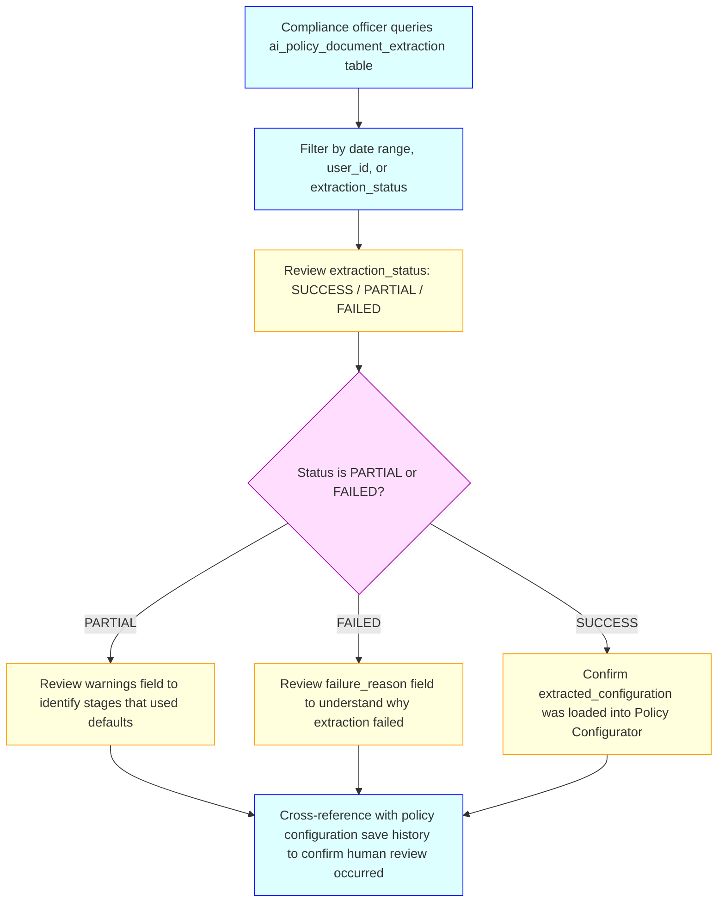
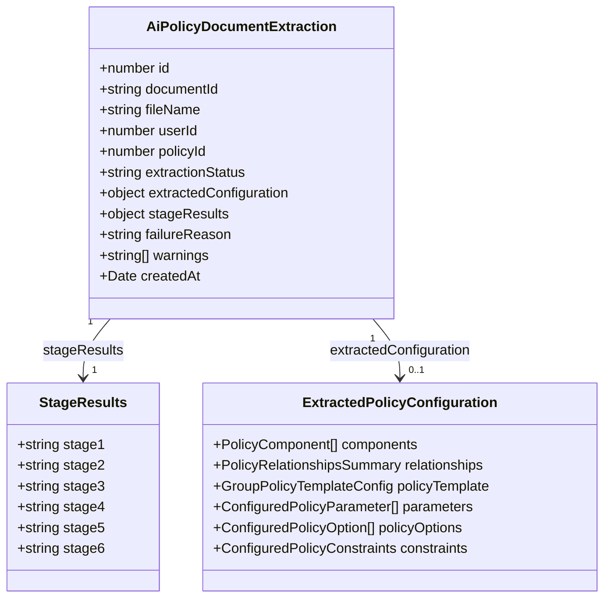

# AI Policy Document Extractor — Business & Functional Requirements

## 1. Purpose

This document defines the detailed business and functional requirements for the **AI Policy Document Extractor** — an AI-powered feature within the IIRM platform that allows authorised administrators to upload an insurance policy PDF document and receive an automatically pre-populated **Policy Configurator JSON** covering all six stages of the Policy Configurator wizard. The feature reduces the time and effort required to manually configure complex insurance policies from scratch by using Azure Document Intelligence for document parsing and Azure OpenAI for structured information extraction.

The output is not intended to be a final configuration; it is a best-effort pre-fill that the admin reviews, corrects, and completes within the existing Policy Configurator wizard. Every extraction attempt is recorded for auditing purposes regardless of whether it succeeded.

---

## 2. Scope

### **In-Scope**

**AI Policy Document Extraction**

- **PDF Upload:** Accepting a policy document in PDF format via a dedicated REST endpoint
- **Document Parsing:** Extracting text content and tabular data from the PDF using Azure Document Intelligence
- **Stage 1 Extraction (Components):** Identifying base, parental, and optional policy components with their sum insured options, models, and flags
- **Stage 2 Extraction (Relationships):** Identifying enabled family relationship categories and sub-categories with age bounds and max counts
- **Stage 3 Extraction (Template):** Mapping optional add-on components to their parent components and extracting policy number references
- **Stage 4 Extraction (Parameters):** Identifying premium-driving parameters (Age, Grade, Gender, Marital Status, Designation, Relationship Group, Dependent Count, Custom types) with their configured options or bands
- **Stage 5 Generation (Choices):** Programmatic generation of a policy option skeleton (Cartesian product of all parameters) with contributions defaulting to `0`; AI-assisted attempt to pre-fill contribution values from premium tables in the document
- **Stage 6 Extraction (Constraints):** Extracting family eligibility, tax, financial, and enrolment constraint values; defaulting to system defaults for any not found in the document
- **Fallback Guardrail:** Returning an empty `{}` with a descriptive message when no valid configuration can be extracted
- **Partial Success Handling:** Returning a configuration with per-stage warning messages when one or more stages fell back to safe defaults
- **Audit Trail:** Persisting every extraction attempt (success, partial, or failed) to the `ai_policy_document_extraction` database table with the extracted configuration, per-stage results, and failure reason

**UI Integration**

- **Trigger Button:** "Extract from PDF" button in the Policy Configurator wizard action bar (DRAFT/WIP status only)
- **Extraction Modal:** Two-phase modal — PDF file picker → extraction result preview with status, warnings, and load confirmation
- **Configuration Loading:** Pre-populating all six wizard stages with the extracted configuration on admin confirmation
- **AI Disclaimer:** Informational alert on Stage 1 reminding the admin to review AI-extracted values

### **Out-of-Scope**

- Automatic saving of the extracted configuration into the Policy Configurator — the admin always reviews and explicitly saves via the existing wizard
- Extraction from non-PDF formats (Word, Excel, image-only scanned PDFs without text layer)
- Real-time feedback or streaming of extraction progress to the client
- Extraction of employee-level or endorsement data from the document
- Comparison or merging of extracted configuration with an existing policy record
- Extraction of financial ratios, actuarial assumptions, or underwriting conditions
- Integration with insurer portals to validate extracted policy numbers in real time

---

## 3. Stakeholders

- **Primary Users:** IIRM Administrators — HR operations and benefits administrators who configure insurance policies; they upload the insurer-provided policy document to bootstrap the wizard
- **Secondary Users:** Compliance and Audit Teams — access the `ai_policy_document_extraction` audit table to review extraction history, spot discrepancies, and verify that AI-extracted configurations have been human-reviewed
- **System Actors:** AI Service (`ai-service`) — hosts the extraction endpoint; Azure Document Intelligence — parses PDF content and tables; Azure OpenAI — generates structured JSON from document content; Azure Cognitive Search — temporarily indexes the document for retrieval-augmented generation; PostgreSQL — persists audit records
- **External Stakeholders:** Insurers — the document being processed is typically an insurer-issued Group Medical Cover (GMC) or similar policy document

---

## 4. Key Use Cases

### **Use Case UC-AIE-001: Upload Policy Document and Extract Configuration**

**Description:** Administrator uploads a policy document PDF and receives a pre-populated PolicyConfiguration JSON covering all six stages of the Policy Configurator wizard.
**Actors:** IIRM Administrator, AI Service
**Preconditions:** Administrator is authenticated; a valid policy PDF document is available; Azure Document Intelligence, Azure OpenAI, and Azure Cognitive Search services are reachable
**Main Flow:**

```mermaid
flowchart TD
    A[Admin uploads policy PDF via POST /pdf-analyser/policy-configurator] --> B[AI Service accepts multipart file]
    B --> C[Azure Document Intelligence parses PDF - extracts text and tables]
    C --> D[AI Service indexes extracted content in Azure Cognitive Search]
    D --> E[AI Service runs parallel AI extraction calls for Stages 1, 2, 4, 6]
    E --> F[Stage 1 result available - run Stage 3 extraction using component IDs]
    F --> G[Stages 1 and 4 results available - generate Stage 5 skeleton via Cartesian product]
    G --> H[AI attempts to fill Stage 5 premium values from document tables]
    H --> I[AI Service assembles all 6 stages into a PolicyConfiguration object]
    I --> J{Is configuration valid? At least one base component with SI options?}
    J -->|Yes - all stages succeeded| K[extractionStatus = SUCCESS]
    J -->|Yes - some stages used defaults| L[extractionStatus = PARTIAL - warnings populated]
    J -->|No - no valid base component| M[extractionStatus = FAILED - policyConfiguration = {}]
    K --> N[Save audit record to ai_policy_document_extraction]
    L --> N
    M --> N
    N --> O[Delete document from Azure Cognitive Search index]
    O --> P[Return 200 OK with policyConfiguration, warnings, extractionStatus]
    P --> Q[Admin receives pre-populated JSON and opens Policy Configurator wizard]
    Q --> R[Admin reviews, corrects, and completes each stage in the wizard]
    R --> S[Admin saves the policy via existing Policy Configurator save flow]

    classDef user fill:#DFF,stroke:#00F;
    classDef system fill:#FFD,stroke:#F90;
    classDef error fill:#FFE,stroke:#F00;
    classDef decision fill:#FDF,stroke:#A0A;

    class A,Q,R,S user;
    class B,C,D,E,F,G,H,I,K,L,N,O,P system;
    class M error;
    class J decision;
```

**Alternate Flows:**

- If no text content can be extracted from the PDF (scanned image without OCR layer), the service returns `extractionStatus: 'FAILED'` with a message indicating the document has no readable content
- If the Azure OpenAI or Document Intelligence services are unavailable, the service returns HTTP 500 and the caller may retry; no partial audit record is written in this case

---

### **Use Case UC-AIE-002: Partial Extraction with Stage Fallbacks**

**Description:** The AI successfully extracts a valid base component but fails to extract one or more stages. The service returns the best-effort configuration with per-stage warnings so the admin knows which stages need manual completion.
**Actors:** IIRM Administrator, AI Service
**Preconditions:** Document has been uploaded and parsed; at least one stage AI call fails or returns unparseable JSON
**Main Flow:**

```mermaid
flowchart TD
    A[AI extraction runs for all 6 stages] --> B{One or more stage calls return invalid JSON or throw?}
    B -->|Yes - partial failure| C[Failed stages return safe defaults: empty arrays or default constraint values]
    C --> D[Warnings array populated with per-stage failure messages]
    D --> E{Does assembled config have at least one base component with SI options?}
    E -->|Yes| F[extractionStatus = PARTIAL]
    E -->|No| G[extractionStatus = FAILED - policyConfiguration = {}]
    F --> H[Config saved to audit table with stageResults map]
    G --> H
    H --> I[Response includes policyConfiguration and warnings array]
    I --> J[Admin sees advisory warnings in the response and knows which stages to complete manually]

    classDef user fill:#DFF,stroke:#00F;
    classDef system fill:#FFD,stroke:#F90;
    classDef error fill:#FFE,stroke:#F00;
    classDef decision fill:#FDF,stroke:#A0A;

    class J user;
    class A,C,D,F,G,H,I system;
    class B,E decision;
```

**Alternate Flows:**

- If all AI calls fail but the document content is present, the response is `FAILED` with `policyConfiguration: {}`
- Stage 5 premium extraction always has a two-level fallback: (1) AI fills values from document tables; (2) if AI parse fails, skeleton with all contributions = 0 is returned

---

### **Use Case UC-AIE-003: Audit Record Retrieval**

**Description:** A compliance officer or system administrator queries the `ai_policy_document_extraction` table to review historical extraction attempts and verify that AI-extracted configurations were reviewed by a human administrator before being used.
**Actors:** Compliance Officer / System Administrator
**Preconditions:** At least one extraction attempt has been made; direct database access or an internal admin query interface is available

**Main Flow:**



---

## 5. Functional Requirements

### **UI Integration**

1. **FR-AIE-024:** The Policy Configurator wizard shall display an **"Extract from PDF"** button in the action bar alongside the existing "Import Policy Configuration" button. The button shall be visible only when the policy configuration is in `DRAFT` or `WIP` status and the wizard is in a normal (non-live-edit) editable state.

2. **FR-AIE-025:** When the "Extract from PDF" button is clicked, the system shall open a modal dialog presenting a two-phase flow:
   - **Phase 1 — File Selection:** A PDF file picker (accepting `.pdf` files only) with an "Extract" action button. The file picker shall validate that a file is selected before allowing submission.
   - **Phase 2 — Result Preview:** After the API call completes, the modal shall display the extraction outcome: a success indicator when `extractionStatus === 'SUCCESS'`, a warning indicator with a list of per-stage warning messages when `extractionStatus === 'PARTIAL'`, and an error message when `extractionStatus === 'FAILED'`. A **"Load into Configurator"** button shall be disabled on `FAILED` status. A **"Cancel"** / close button shall always be available.

3. **FR-AIE-026:** During the API call the modal shall display a loading indicator with the message _"Extracting policy configuration… This may take up to 90 seconds."_ The "Extract" button shall be disabled while the call is in progress to prevent duplicate submissions.

4. **FR-AIE-027:** When the admin clicks "Load into Configurator" in the modal, the system shall:
   - Replace the wizard's current `components`, `relationships`, `policyTemplate`, `parameters`, `policyOptions`, and `constraints` configuration values with the extracted values.
   - Reset the wizard to Step 1 (`policyComponents`) so the admin reviews from the beginning.
   - Close the modal and display a toast notification confirming that the AI-extracted configuration has been loaded.
   - Display a dismissible informational alert banner on the Step 1 panel reminding the admin that AI-extracted values are a best-effort pre-fill and must be reviewed before saving.

### **Document Upload and Parsing**

1. **FR-AIE-001:** The system shall expose a `POST /pdf-analyser/policy-configurator` endpoint that accepts a multipart form upload with a single `file` field containing a PDF document. The endpoint shall require a valid `userid` header identifying the requesting administrator.

2. **FR-AIE-002:** The system shall process the uploaded PDF using **Azure Document Intelligence** to extract the full text content of every page and any tabular data embedded in the document. The extracted text and table data shall be indexed in **Azure Cognitive Search** under a unique document ID generated for each upload.

3. **FR-AIE-003:** After indexing, the system shall wait for the index to settle (up to 2 seconds) and then retrieve the indexed content for use as the document context in all subsequent AI extraction calls.

4. **FR-AIE-004:** After all extraction stages are complete and the response is prepared, the system shall delete the temporarily indexed document from Azure Cognitive Search. This ensures no residual document data persists in the search index beyond the extraction lifecycle.

### **Stage 1 — Component Extraction**

5. **FR-AIE-005:** The system shall attempt to identify all insurance components defined in the policy document. For each component, the extraction shall produce:
   - `id` — unique string identifier
   - `type` — one of `base`, `parental`, `optional`
   - `label` — display name of the component as named in the document
   - `sumInsuredModel` — `FLAT` (if fixed values are stated) or `MULTIPLE` (if multiples of a salary/CTC are stated)
   - `sumInsuredOptions` — array of `{ id, value }` pairs representing stated sum insured amounts
   - `premiumPerLife` — boolean flag; default `true` if not determinable from the document
   - `proRationEnabled` — boolean flag; default `true` if not stated
   - `showCompanyContribution` — boolean flag; default `true` if not stated
   - `isBenefitComponent` — boolean flag; `true` only if the component explicitly represents a waiver or fixed-benefit charge with no sum insured (e.g., Co-pay Waiver)

6. **FR-AIE-006:** If Stage 1 AI extraction fails (network error, invalid JSON response, or empty response), the system shall return an empty `components[]` array as the safe default. The stage shall be recorded as `failed` in the audit record.

### **Stage 2 — Relationship Extraction**

7. **FR-AIE-007:** The system shall attempt to identify which family relationship categories are covered under the policy and the eligibility rules for each. For each relationship category (`Self`, `Spouse/Partner`, `Children`, `Parents`, `Siblings`), the extraction shall produce:
   - `type` — relationship category name
   - `enabled` — boolean; `true` if the category is covered in the document
   - `maxCount` — maximum number of covered members of this type
   - `configuredOptions` — array of sub-categories (e.g., Husband, Wife, Son, Daughter, Father, Mother) with `name`, `enabled`, `minAge`, and `maxAge`
   - `familyMaxPolicyLevel` — the maximum total family unit size stated in the document

8. **FR-AIE-008:** If Stage 2 extraction fails, the safe default is `{ enabledPolicyRelations: [], familyMaxPolicyLevel: '0' }`. The stage is recorded as `failed`.

### **Stage 3 — Template Extraction**

9. **FR-AIE-009:** The system shall attempt to map optional add-on components (identified in Stage 1) to their respective parent component (base or parental). For each parent component, the extraction shall produce:
   - `mainPolicyId` — the ID of the parent component
   - `addonIds` — array of optional component IDs mapped to this parent
   - `eligibleRelations` — array of enabled sub-category names covered under this component
   - `clubSumInsured` — boolean; `true` if add-on sum insureds are aggregated with the parent SI
   - `provisionPolicyNumber`, `insurerPolicyNumber`, `iirmPolicyNumber` — extracted from the document where available; `null` if not found

10. **FR-AIE-010:** Stage 3 extraction is sequential — it runs after Stage 1 completes, so that component IDs are available for the prompt context. If Stage 3 fails, the safe default is a minimal template containing only the base component ID with no add-ons and empty eligible relations. The stage is recorded as `failed`.

### **Stage 4 — Parameter Extraction**

11. **FR-AIE-011:** The system shall attempt to identify the employee attribute parameters used to determine premium variation. For each detected parameter, the extraction shall produce:
   - `id` — unique string identifier
   - `parameterType` — one of `Age`, `Grade`, `Gender`, `MaritalStatus`, `Designation`, `RelationshipGroup`, `DependentCount`, `CustomList`, `CustomRange`
   - `internalType` — one of `list`, `range`, `relation`, `dependent-count`
   - `label` — display name
   - For range types: `rangeBands` array with `displayName`, `min`, `max` per band
   - For list types: `options` array with `value` and `isDefault`
   - For relation types: `relationshipGroups` array with group name, categories, and max counts
   - For dependent-count types: `dependentCountConfig` with `targetRelationCategory` and `countBands`
   - `applyToDependents` — boolean; default `false`

12. **FR-AIE-012:** If Stage 4 extraction fails, the safe default is an empty `parameters[]` array. The resulting Stage 5 skeleton will contain exactly one Universal Option.

### **Stage 5 — Choice Generation**

13. **FR-AIE-013:** The system shall programmatically generate a **Stage 5 skeleton** from the extracted Stage 1 components and Stage 4 parameters. The skeleton is the Cartesian product of all parameter options (one dimension per parameter, one combination per resulting option). Each skeleton entry shall contain:
   - `optionId` — a generated unique string
   - `optionLabel` — a human-readable label derived from the parameter option values (e.g., "Age: 18-35 | Gender: Male")
   - `optionMeta` — array of `{ parameterId, parameterOptionId }` pairs
   - For each component: a `basePolicyChoices` or `parentalPolicyChoices` block containing, for each sum insured option: `{ sumInsuredId, isAvailable: true, isDefault: false, companyContribution: 0, employeeContribution: 0 }`
   - The first sum insured option of each component within each policy option shall have `isDefault: true`

14. **FR-AIE-014:** After generating the skeleton, the system shall make a second AI call attempting to pre-fill `companyContribution` and `employeeContribution` values by matching the premium tables found in the document to the corresponding option combinations. Only values that can be matched with reasonable confidence shall be filled; unmatched combinations retain `0`.

15. **FR-AIE-015:** If the premium-fill AI call fails or returns invalid JSON, the system shall fall back to the skeleton with all contributions = 0. Stage 5 is recorded as `failed` and a warning is added to the response informing the admin to complete premium values manually.

### **Stage 6 — Constraint Extraction**

16. **FR-AIE-016:** The system shall attempt to extract the values of all 22 Policy Configurator constraint properties from the document. For any constraint not found in the document, the system shall apply the system default value (as defined in `POLICY_CONSTRAINTS_MASTER`).

17. **FR-AIE-017:** If Stage 6 extraction fails entirely, all 22 constraints shall be populated with their system default values. The stage is recorded as `failed` and a warning is added.

### **Validity Check and Fallback Guardrail**

18. **FR-AIE-018:** After assembling all six stages, the system shall perform a **validity check**. A configuration is considered valid if and only if:
    - `components[]` is non-empty, AND
    - At least one component has `type === 'base'` AND a non-empty `sumInsuredOptions[]` array

19. **FR-AIE-019:** If the validity check fails, the system shall return `policyConfiguration: {}` (empty object) along with `extractionStatus: 'FAILED'` and a descriptive message: *"Could not extract a valid policy configuration from the provided document. The document may not contain sufficient policy structure. Please configure manually."* The failed extraction shall still be saved to the audit table.

20. **FR-AIE-020:** If the validity check passes but one or more stages used fallback defaults, the system shall return the assembled configuration with `extractionStatus: 'PARTIAL'` and a `warnings[]` array listing which stages fell back to defaults.

21. **FR-AIE-021:** If the validity check passes and no stages used fallback defaults, the system shall return the configuration with `extractionStatus: 'SUCCESS'` and an empty `warnings[]` array.

### **Audit Record**

22. **FR-AIE-022:** The system shall persist an audit record to the `ai_policy_document_extraction` table for every extraction attempt, regardless of outcome. The record shall contain:
   - `document_id` — the UUID assigned to this upload
   - `file_name` — original file name of the uploaded PDF
   - `user_id` — the administrator's user ID from the request header
   - `extraction_status` — one of `SUCCESS`, `PARTIAL`, `FAILED`
   - `extracted_configuration` — the assembled `policyConfiguration` object (or `{}` on failure)
   - `stage_results` — a map of `{ stage1: 'ok'|'failed', stage2: ..., ..., stage6: ... }`
   - `failure_reason` — a text description of why the extraction failed, if applicable
   - `warnings` — the populated warnings array
   - `created_at` — the timestamp of the extraction attempt

23. **FR-AIE-023:** The audit save operation shall never throw an exception or block the API response. If the database write fails, the error shall be logged and the API response shall still be returned to the caller.

---

## 6. Acceptance Criteria

### **FR-AIE-001 — Endpoint Availability**

- AC1: `POST /pdf-analyser/policy-configurator` with a valid multipart PDF and a `userid` header returns HTTP 200
- AC2: Calling the endpoint without a file returns HTTP 400 with `{ success: false, error: "No file uploaded" }`
- AC3: The endpoint is documented in Swagger with the correct `multipart/form-data` schema and `userid` header requirement

### **FR-AIE-002/003 — Document Parsing and Indexing**

- AC1: Uploading a text-layer PDF results in `documentContent` being populated with extracted page text
- AC2: Tables found in the document are appended to the document content and available to all AI extraction calls
- AC3: The document is deleted from Azure Cognitive Search after the extraction response is returned; a subsequent search for the same `documentId` returns zero results

### **FR-AIE-005/006 — Stage 1 Component Extraction**

- AC1: A standard GMC policy document with a base cover and two add-ons results in `components[]` with exactly three entries: one of `type: "base"` and two of `type: "optional"`
- AC2: Each extracted component has at least one `sumInsuredOption` with a numeric value
- AC3: If Stage 1 AI call returns malformed JSON, `components[]` is empty and `stageResults.stage1 === 'failed'`

### **FR-AIE-013/014/015 — Stage 5 Skeleton and Premium Fill**

- AC1: A policy with two Age bands and two Gender options produces a Stage 5 skeleton with 4 policy options
- AC2: Each policy option contains a premium entry for each component defined in Stage 1
- AC3: If the document contains a clearly structured premium table, at least some contribution values are non-zero after AI premium fill
- AC4: If Stage 5 AI premium fill fails, all contributions remain `0` and `stageResults.stage5 === 'failed'`

### **FR-AIE-018/019 — Fallback Guardrail**

- AC1: Uploading a non-policy PDF (e.g., an HR policy handbook with no insurance structure) results in `policyConfiguration: {}` and `extractionStatus: 'FAILED'`
- AC2: The failure response includes the descriptive message: *"Could not extract a valid policy configuration from the provided document..."*
- AC3: A failed extraction still writes a record to `ai_policy_document_extraction` with `extraction_status = 'FAILED'`

### **FR-AIE-020 — Partial Success**

- AC1: An extraction where Stage 4 fails but Stages 1, 2, 3, 5, 6 succeed returns `extractionStatus: 'PARTIAL'` and a `warnings[]` containing the Stage 4 warning message
- AC2: The `policyConfiguration` in a partial response is a complete six-key object; missing stages are filled with their safe defaults
- AC3: `stageResults` in the audit record accurately reflects which stages succeeded and which failed

### **FR-AIE-021 — Full Success**

- AC1: An extraction where all six stages return valid AI responses results in `extractionStatus: 'SUCCESS'` and `warnings: []`
- AC2: The returned `policyConfiguration` object has all six top-level keys: `components`, `relationships`, `policyTemplate`, `parameters`, `policyOptions`, `constraints`

### **FR-AIE-022/023 — Audit Record**

- AC1: After every API call (success or failure), exactly one record is written to `ai_policy_document_extraction`
- AC2: A failure in the audit table write (e.g., DB connection lost) does not cause the endpoint to return an error to the caller
- AC3: The `user_id` in the audit record matches the `userid` header value from the request

### **FR-AIE-024 — Extract from PDF Button**

- AC1: The "Extract from PDF" button is visible in the action bar when `configuratorStatus === 'DRAFT'` or `configuratorStatus === 'WIP'` and the wizard is not in live-edit mode
- AC2: The "Extract from PDF" button is not visible when the policy is `SUBMITTED`, `LIVE`, or in `LIVEEDITPENDINGAPPROVAL` status
- AC3: Clicking the button opens the extraction modal

### **FR-AIE-025/026 — Extraction Modal**

- AC1: The modal file picker rejects non-PDF files with an inline validation message
- AC2: The "Extract" button is disabled until a PDF file is selected
- AC3: While the API call is in progress the loading message is shown and the "Extract" button is disabled
- AC4: A `SUCCESS` extraction result displays a success badge in the modal
- AC5: A `PARTIAL` extraction result displays a warning badge and lists each warning message from the `warnings[]` array
- AC6: A `FAILED` extraction result displays the failure message and the "Load into Configurator" button is disabled

### **FR-AIE-027 — Configuration Loading**

- AC1: Clicking "Load into Configurator" on a SUCCESS or PARTIAL result replaces all six configuration keys and resets the wizard to Step 1
- AC2: A toast notification confirming the load is displayed after the modal closes
- AC3: An AI disclaimer alert is shown on Step 1 after loading an extracted configuration
- AC4: The admin can proceed through the wizard normally after loading, saving each step via the existing save flow

---

## 7. Non-Functional Requirements

### **Performance**

- **NFR-AIE-001:** The extraction endpoint shall return a response within **90 seconds** under normal conditions for a standard 20-page GMC policy document. The parallel AI call design (stages 1, 2, 4, 6 in parallel) is the primary mechanism for meeting this target.
- **NFR-AIE-002:** Stage 5 Cartesian product skeleton generation shall be synchronous and complete within 1 second for up to 500 policy option combinations.
- **NFR-AIE-003:** The document indexing and search propagation wait (2-second delay) shall not be configurable per-request; if consistency issues are observed in staging, the delay may be increased globally via environment configuration.

### **Reliability**

- **NFR-AIE-004:** Each per-stage AI call shall be independently wrapped in error handling. A failure in one stage must not prevent other stages from completing.
- **NFR-AIE-005:** The audit record write is non-blocking. If it fails, the failure is logged at error level but the API response is not affected.
- **NFR-AIE-006:** The Azure Cognitive Search document deletion is performed after the response is assembled; a deletion failure shall be logged but shall not result in an HTTP error.

### **Security**

- **NFR-AIE-007:** The endpoint shall require a valid Bearer token (authenticated via the existing IIRM JWT middleware). Unauthenticated calls shall return HTTP 401.
- **NFR-AIE-008:** The uploaded file size limit shall follow the existing `ai-service` multipart upload limits. Files exceeding the limit shall return HTTP 413.
- **NFR-AIE-009:** The `userid` header value is used only for audit logging and S3 key namespacing; it shall not be used as a security boundary or access control mechanism.

### **Accuracy**

- **NFR-AIE-010:** Extraction accuracy is AI-dependent and not formally guaranteed. The system shall never present AI output as authoritative; the admin must always review and confirm the extracted configuration before saving.
- **NFR-AIE-011:** Stage 6 constraints shall always be present in the response, populated with system defaults for any constraint the AI cannot determine. This ensures the admin never receives a configuration with missing constraint keys.

### **Observability**

- **NFR-AIE-012:** All stage extraction calls shall be logged at INFO level with the stage name and success/failure status. AI raw responses shall be logged at DEBUG level only.
- **NFR-AIE-013:** The `extraction_status` and `stage_results` fields in the audit table provide the primary operational visibility into extraction quality over time.

---

## 8. Data Models & Entities



### **Audit Entity Schema**

```json
{
  "id": "number (auto-increment PK)",
  "document_id": "string (UUID, generated per upload)",
  "file_name": "string (original file name from upload)",
  "user_id": "number | null (from userid header)",
  "policy_id": "number | null (reserved for future linkage to a policy record)",
  "extraction_status": "SUCCESS | PARTIAL | FAILED",
  "extracted_configuration": "jsonb | null (assembled PolicyConfiguration or {})",
  "stage_results": "jsonb | null ({ stage1: 'ok'|'failed', ..., stage6: 'ok'|'failed' })",
  "failure_reason": "text | null (plain-text description on FAILED status)",
  "warnings": "jsonb | null (string[] of per-stage warning messages)",
  "created_at": "timestamp (auto-set on insert)"
}
```

### **API Response Schema**

```json
{
  "success": "boolean",
  "data": {
    "policyConfiguration": {
      "components": "PolicyComponent[]",
      "relationships": "PolicyRelationshipsSummary",
      "policyTemplate": "GroupPolicyTemplateConfig",
      "parameters": "ConfiguredPolicyParameter[]",
      "policyOptions": "ConfiguredPolicyOption[]",
      "constraints": "ConfiguredPolicyConstraints"
    },
    "extractionStatus": "SUCCESS | PARTIAL | FAILED",
    "message": "string | undefined (present only on FAILED status)",
    "warnings": "string[] (empty on SUCCESS)"
  }
}
```

---

## 9. Business Rules

- **BR-AIE-001:** A policy configuration is considered **extractable** from a document if and only if the AI can identify at least one component with `type: 'base'` and at least one numeric `sumInsuredOption`. All other stages contribute to completeness but a base component is the minimum structural requirement.

- **BR-AIE-002:** All Stage 5 contribution values in the extracted configuration default to `0`. The administrator **must** review and complete Stage 5 premium values before the policy is made available for enrolment. An extraction result where all contributions are `0` is structurally valid and shall not be treated as a failure.

- **BR-AIE-003:** The AI extraction shall never invent or interpolate data that does not exist in the source document. Where a value cannot be determined, the system shall apply the documented safe default rather than a plausible AI-generated value.

- **BR-AIE-004:** Each upload generates a new, independent extraction audit record. A re-upload of the same document by the same user creates a new record; there is no deduplication or update of prior records.

- **BR-AIE-005:** The `policy_id` field in the audit record is reserved for future use when the caller wants to link an extraction to an existing policy record. It is `null` in the current implementation and shall remain optional.

- **BR-AIE-006:** The document indexed in Azure Cognitive Search during extraction is temporary. It shall be deleted after each extraction cycle. No document content from a policy upload shall persist in the search index beyond the lifetime of a single extraction request.

- **BR-AIE-007:** Stage 5 skeleton generation (Cartesian product) is deterministic and uses only Stage 1 and Stage 4 results. If Stage 4 returned empty parameters, the skeleton contains exactly one Universal Option. If Stage 1 returned empty components, the skeleton is also empty and the validity check fails.

- **BR-AIE-008:** An extraction where the document is a scanned image PDF with no OCR text layer results in `extractionStatus: 'FAILED'` because `documentContent` will be empty after the Document Intelligence and search indexing steps. The error message shall clearly state that no text content was extractable.

---

## 10. Assumptions & Dependencies

### **Assumptions**

- The uploaded policy document is a PDF with a selectable text layer (not a purely scanned image). While Azure Document Intelligence can handle scanned PDFs with its OCR capability, extraction quality degrades significantly for low-resolution or handwritten documents.
- The policy structure follows standard Indian Group Health Insurance conventions (GMC / GPA / GHB). Documents with highly non-standard structures may produce incomplete extractions that require more manual correction.
- Azure Document Intelligence, Azure OpenAI, and Azure Cognitive Search credentials are correctly configured in the `ai-service` environment variables (`openAi.*` config namespace).
- The administrator who triggers the extraction has sufficient context about the policy document to review and correct the AI output before saving.

### **Dependencies**

| Dependency | Type | Notes |
|---|---|---|
| Azure Document Intelligence | External Service | Used for PDF parsing; requires `openAi.intelligenceEndpoint` and `openAi.intelligenceKey` config values |
| Azure OpenAI (GPT deployment) | External Service | Used for structured JSON extraction; requires `openAi.endpoint`, `openAi.apiKey`, `openAi.apiVersion`, `openAi.deploymentName` |
| Azure Cognitive Search | External Service | Used as temporary document store for RAG context; requires `openAi.searchEndPoint`, `openAi.searchKey`, `openAi.searchIndexName` |
| AWS S3 | External Service | Uploaded files are stored transiently in S3 before Document Intelligence processes them via URL |
| PostgreSQL (`ai_policy_document_extraction` table) | Database | Requires migration to create the audit table before the endpoint is deployed |
| `service-lib` entities barrel | Internal | `AiPolicyDocumentExtraction` entity must be exported from `service-lib/src/lib/entities/index.ts` and included in the TypeORM entity list |
| Policy Configurator TypeScript interfaces | Internal | `PolicyComponent`, `ConfiguredPolicyParameter`, `ConfiguredPolicyOption`, `ConfiguredPolicyConstraints` defined in `apps/ui/iwork/src/app/pages/PolicyPage/PolicyConfigurator/policytypes.ts` are used as schema reference for AI prompts |

---

## 11. Glossary

| Term | Definition |
|---|---|
| **Policy Configurator** | The six-stage wizard in the IIRM portal used by administrators to define the full structure of an insurance policy |
| **PolicyConfiguration JSON** | The top-level JSON object representing all six stages of a configured policy: `{ components, relationships, policyTemplate, parameters, policyOptions, constraints }` |
| **Azure Document Intelligence** | Microsoft Azure cognitive service that parses PDF documents and extracts structured text, tables, and key-value pairs |
| **Azure OpenAI** | Microsoft Azure-hosted OpenAI GPT model used for natural language understanding and structured JSON generation |
| **Azure Cognitive Search** | Microsoft Azure search service used as a temporary document index for retrieval-augmented AI calls |
| **Stage 5 Skeleton** | A programmatically generated set of policy option entries from the Cartesian product of Stage 4 parameter options, with all premium contributions set to `0` pending manual or AI fill |
| **Cartesian Product** | The mathematical product of all parameter option sets; if a policy has Age (3 bands) × Gender (2 values), the Cartesian product is 6 policy options |
| **Extraction Status** | A three-value taxonomy indicating the outcome of an extraction attempt: `SUCCESS` (all stages extracted), `PARTIAL` (valid config with some stages defaulted), `FAILED` (no valid config extracted) |
| **Fallback Guardrail** | The behaviour that returns `policyConfiguration: {}` with a descriptive message when the validity check fails, preventing an unusable configuration from reaching the Policy Configurator wizard |
| **Audit Record** | A row in the `ai_policy_document_extraction` database table recording every extraction attempt for compliance and traceability purposes |
| **GMC** | Group Medical Cover — the most common type of Indian group health insurance policy for which this extractor is designed |
| **RAG** | Retrieval-Augmented Generation — the pattern of indexing document content in a search store and retrieving relevant passages as context for AI inference calls |

---

## 12. Open Questions

| # | Question | Owner | Status |
|---|---|---|---|
| OQ-001 | Should the extracted `policyConfiguration` be automatically pre-loaded into the Policy Configurator wizard UI when the admin navigates to it, or should the frontend retrieve it from a separate API after the upload? | Product / Frontend | **Resolved** — The extraction is triggered by an "Extract from PDF" button in the wizard action bar. The API call is made client-side from the modal; on success the response payload is loaded directly into the wizard state without a separate retrieval step. |
| OQ-002 | Should the `policy_id` field in the audit record be linkable to the Policy Configurator's policy record, and if so, when and how does the admin provide the association? | Product | Open |
| OQ-003 | What is the agreed file size limit for policy PDF uploads? The current `ai-service` multipart limit applies; insurers sometimes provide documents exceeding 20 MB. | DevOps / Product | Open |
| OQ-004 | Should the endpoint support scanned-image PDFs with no text layer using Azure Document Intelligence OCR mode? Currently, OCR accuracy for insurance-specific tables is untested. | Engineering | Open |
| OQ-005 | Should extraction warnings be displayed to the admin as dismissible in-wizard alerts, or only in the API response? The frontend integration design is not yet specified. | Frontend / Product | Open |
| OQ-006 | Is a UI trigger button ("Extract from PDF") within the Policy Configurator wizard in scope, or will the admin call the API independently and paste the result? | Product / Frontend | **Resolved** — A dedicated "Extract from PDF" button is in scope and implemented in the Policy Configurator wizard action bar alongside "Import Policy Configuration". See FR-AIE-024 through FR-AIE-027. |
| OQ-007 | What retention policy applies to rows in `ai_policy_document_extraction`? Should records older than N months be archived or purged? | Compliance / DBA | Open |

---

*Document created: 2026-06-15*
*Feature: AI Policy Document Extractor (FR-AIE-001 through FR-AIE-023)*
