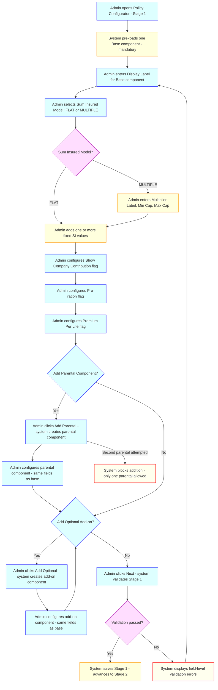
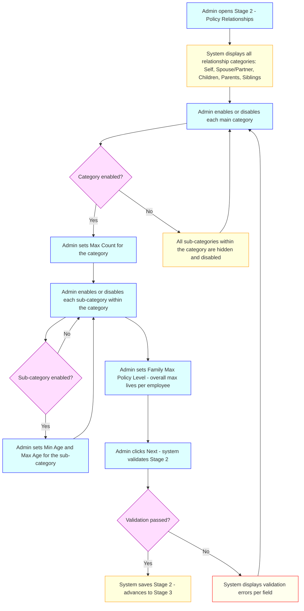
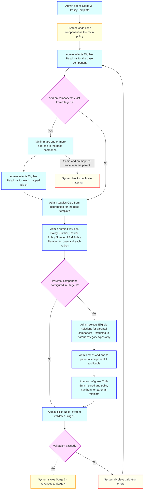
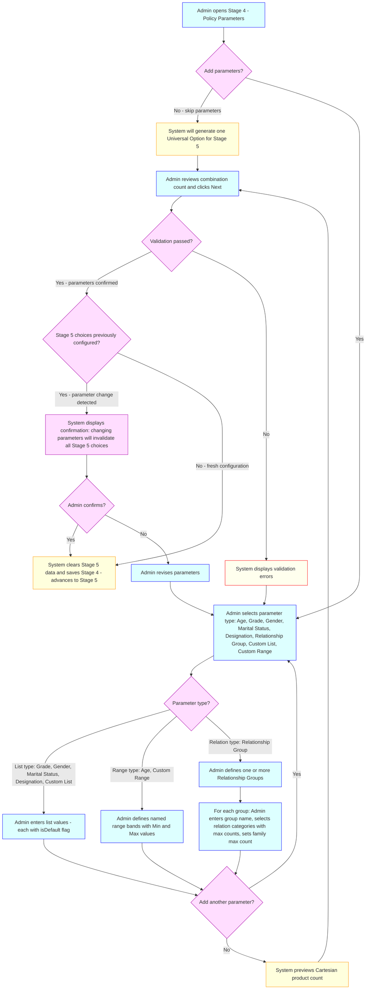
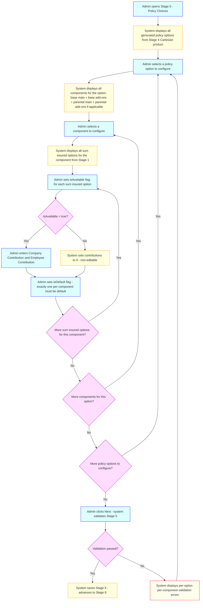
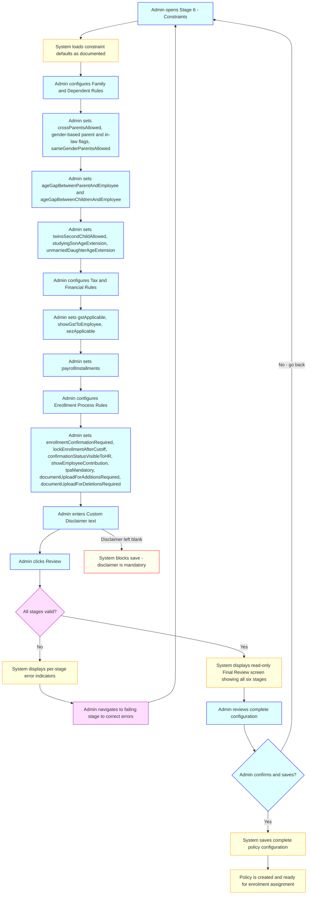
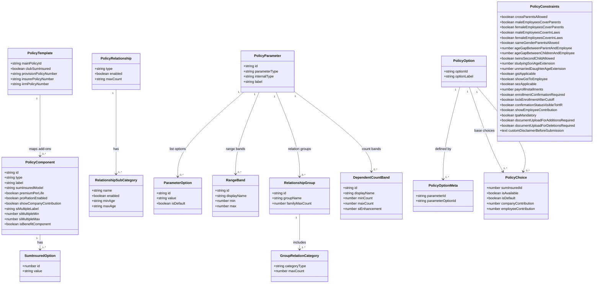

# Policy Configurator — Business & Functional Requirements

## 1. Purpose

This document defines the detailed business and functional requirements for the **Policy Configurator** — a six-stage sequential wizard within the IIRM (CRM) portal that allows authorised administrators to fully define the structure, rules, pricing, and constraints of an insurance policy before it is made available for employee enrolment. The feature ensures all policy configuration decisions are validated at each stage, maintains a complete and auditable policy definition, and prevents employees from being exposed to misconfigured or incomplete policies.

---

## 2. Scope

### **In-Scope**

**Policy Configurator — Six-Stage Wizard**

- **Stage 1 – Policy Components:** Definition of the base, parental, and optional add-on components of a policy, including sum insured models, pro-ration flags, premium-per-life settings, and company contribution visibility
- **Stage 2 – Policy Relationships:** Configuration of eligible family relationship categories and sub-categories, including age constraints and maximum dependent counts per category
- **Stage 3 – Policy Template:** Mapping of optional add-on components to their parent (base or parental) components, assignment of eligible relationship types per component, and entry of policy number references
- **Stage 4 – Policy Parameters:** Definition of employee attribute parameters (Age, Grade, Gender, Marital Status, Designation, Relationship Group, Custom List, Custom Range) that drive premium variation; Cartesian product generation of all resulting policy option combinations
- **Stage 5 – Policy Choices:** Premium configuration for every policy option generated in Stage 4, covering all components and all sum insured values; availability and default flags per sum insured option
- **Stage 6 – Constraints & Final Review:** Configuration of family and dependent eligibility rules, tax and financial settings, enrolment process controls, custom disclaimer text, and a read-only final review before the policy is saved

### **Out-of-Scope**

- Employee-facing enrolment portal — the Policy Configurator is exclusively an administrator-facing tool
- Policy editing after the policy has been activated and enrolment has begun — post-activation changes are managed through separate amendment or endorsement flows
- Cloning or copying an existing policy configuration to a new policy
- Multi-tenant or multi-company policy templates shared across organisations
- Automated premium calculation or actuarial modelling — premium values are entered manually by the administrator
- Integration with external insurer systems to validate or fetch policy numbers in real time
- Deletion of a policy that already has enrolled members

---

## 3. Stakeholders

- **Primary Users:** IIRM Administrators — HR operations and benefits administrators who design and configure insurance policies on behalf of their organisation
- **Secondary Users:** Finance Teams — verify premium amounts and payroll instalment configurations; Compliance Teams — review age gap, tax, and GST settings
- **System Actors:** IIRM Backend API — enforces validation rules, persists stage data, and generates policy option combinations; Scheduler Service — no direct involvement in the wizard flow itself
- **External Stakeholders:** Insurers — insurer policy numbers entered in Stage 3 reference insurer-issued identifiers; TPA (Third-Party Administrators) — TPA-related settings configured in Stage 6 constraints

---

## 4. Key Use Cases

### **Use Case UC-001: Stage 1 – Define Policy Components**

**Description:** Administrator defines the building blocks of a policy by configuring the mandatory base component, an optional parental component, and zero or more optional add-on components. Each component is assigned its display label, sum insured options, sum insured model, and operational flags.
**Actors:** IIRM Administrator
**Preconditions:** Administrator is authenticated, has navigated to the Policy Configurator, and a new policy record has been initialised
**Main Flow:**



**Alternate Flows:**

- If the admin attempts to delete the base component, the action is blocked — the base component is mandatory and permanent
- If MULTIPLE model is selected but multiplier label, min cap, or max cap fields are left blank, the system prevents advancing to Stage 2

---

### **Use Case UC-002: Stage 2 – Define Policy Relationships**

**Description:** Administrator defines which family relationship categories and sub-categories are covered under the policy, along with age eligibility limits and maximum dependent counts.
**Actors:** IIRM Administrator
**Preconditions:** Stage 1 has been completed and saved; administrator is on Stage 2
**Main Flow:**



**Alternate Flows:**

- If a sub-category is enabled but Min Age or Max Age is left blank, the system prevents advancing to Stage 3
- If Max Count for an enabled category is not entered, validation fails

---

### **Use Case UC-003: Stage 3 – Define Policy Template**

**Description:** Administrator maps optional add-on components to their parent (base or parental) components, assigns eligible relationship types to each component, enters policy number references, and configures the club sum insured flag.
**Actors:** IIRM Administrator
**Preconditions:** Stages 1 and 2 have been completed and saved; administrator is on Stage 3
**Main Flow:**



**Alternate Flows:**

- If a non-parent-category relation type is selected for the parental component's eligible relations, the system rejects the selection
- Policy number fields (provisional, insurer, IIRM) are optional and do not block stage completion

---

### **Use Case UC-004: Stage 4 – Define Policy Parameters**

**Description:** Administrator optionally defines the employee attribute parameters that drive premium variation. The system generates the Cartesian product of all configured parameter options to produce the full set of policy option combinations that must be priced in Stage 5.
**Actors:** IIRM Administrator
**Preconditions:** Stages 1–3 have been completed and saved; administrator is on Stage 4
**Main Flow:**



**Alternate Flows:**

- If range-type bands overlap or leave gaps, the system returns a validation error before allowing the admin to proceed
- If a relationship group is added but no relation category is selected within it, validation fails

---

### **Use Case UC-005: Stage 5 – Configure Policy Choices**

**Description:** For every policy option generated from the Stage 4 parameter Cartesian product, the administrator configures the premium breakdown (company and employee contributions) for every component and every sum insured value. Availability and default flags are set per sum insured option.
**Actors:** IIRM Administrator
**Preconditions:** Stages 1–4 have been completed and saved; administrator is on Stage 5; policy option combinations have been generated by the system
**Main Flow:**



**Alternate Flows:**

- For components using the MULTIPLE sum insured model, contribution values are entered as per-mille (‰) rates rather than absolute ₹ values
- If no sum insured option for a component has `isAvailable: true`, validation blocks stage completion
- If more than one sum insured option is flagged `isDefault: true` for the same component within a policy option, validation fails

---

### **Use Case UC-006: Stage 6 – Set Constraints & Final Review**

**Description:** Administrator configures enrollment rules, family eligibility constraints, tax settings, and the custom disclaimer. After constraints are confirmed, a read-only final review of the entire policy configuration is presented before the administrator saves the policy.
**Actors:** IIRM Administrator
**Preconditions:** Stages 1–5 have been completed and saved; administrator is on Stage 6
**Main Flow:**



**Alternate Flows:**

- If the admin attempts to save the policy while any of the six stages has an incomplete or invalid configuration, saving is blocked and the specific failing stages are highlighted
- The Final Review screen is read-only; no inline edits are permitted from the review screen

---

## 5. Functional Requirements

### **Stage 1 – Policy Components**

1. **FR-001:** System shall enforce that every policy has exactly one base component. The base component shall be pre-loaded on Stage 1 initialisation and shall not be deletable.

2. **FR-002:** System shall allow at most one parental component per policy. Attempting to add a second parental component shall be blocked with an appropriate error.

3. **FR-003:** System shall allow zero or more optional (add-on) components with no enforced upper limit on count.

4. **FR-004:** Each component shall have a configurable **Display Label** (alias name shown in the portal and to employees).

5. **FR-005:** Each component shall support one or more **Sum Insured Options**, each with a unique numeric ID and a value.

6. **FR-006:** Each component shall support two **Sum Insured Models** — `FLAT` (fixed absolute values) and `MULTIPLE` (multiples of an employee property such as CTC).

7. **FR-007:** When the `MULTIPLE` sum insured model is selected, the following fields shall become mandatory: `siMultipleLabel` (multiplier label, e.g., "CTC"), `siMultipleMin` (minimum sum insured cap), and `siMultipleMax` (maximum sum insured cap). These fields shall be hidden and not required when `FLAT` is selected.

8. **FR-008:** Each component shall have a **Show Company Contribution** flag (boolean) controlling whether the employer's contribution amount is displayed to the employee in the enrolment portal.

9. **FR-009:** Each component shall have a **Pro-ration** flag (boolean, default `true`) controlling whether premiums and refunds are calculated proportionally based on active days.

   - When enabled: Charged Premium = Full Premium × (Active Days / Total Policy Duration Days), where Active Days = policy end date − employee effective enrolment date (inclusive).
   - When enabled and an employee is removed: Refund = Full Premium × (Remaining Days / Total Policy Duration Days).
   - When disabled: Full premium is charged regardless of enrolment date; no refund is issued on removal.
   - Pro-ration is evaluated independently per component.

10. **FR-010:** Each component shall have a **Premium Per Life** flag (boolean) controlling whether the premium is multiplied by the number of enrolled members (per-life) or charged once for the entire enrolled family unit (per-family).

11. **FR-042:** System shall allow optional (add-on) components to be designated as **Benefit/Waiver Components** via a boolean flag `isBenefitComponent` (default `false`). When `isBenefitComponent` is set to `true`:
    - The component's Sum Insured Model shall be locked to `FLAT`.
    - The only permitted Sum Insured value shall be `0`.
    - The component shall be restricted to type `optional`; attempting to enable `isBenefitComponent` on a `base` or `parental` component shall be blocked with a validation error.
    - The Display Label shall still be configurable and shall be shown to employees (e.g., "Co-pay Waiver").

12. **FR-043:** When `isBenefitComponent: true`, Stage 1 validation shall accept a Sum Insured value of `0` without error. The Pro-ration flag, Premium Per Life flag, and Show Company Contribution flag shall remain configurable for benefit components.

### **Stage 2 – Policy Relationships**

11. **FR-011:** System shall present the following main relationship categories for configuration: Self, Spouse/Partner, Children, Parents, Siblings.

12. **FR-012:** Each main category shall have an **Enabled / Disabled** toggle. Disabling a category shall hide all its sub-categories and prevent enrolment of those relation types.

13. **FR-013:** Each enabled main category shall require a **Max Count** value defining the maximum number of dependents of that type allowed per employee.

14. **FR-014:** Within each enabled main category, individual sub-categories (e.g., Husband, Wife, Son, Daughter, Father, Mother) shall each have an **Enabled / Disabled** toggle.

15. **FR-015:** Each enabled sub-category shall require a **Min Age** and **Max Age** (in years) defining the eligibility age range for dependents of that sub-type.

16. **FR-016:** System shall support a **Policy-Level Family Maximum** (`familyMaxPolicyLevel`) — the maximum total number of lives (employee plus all dependents) enrollable under a single policy record.

### **Stage 3 – Policy Template**

17. **FR-017:** System shall allow one or more optional add-on components (from Stage 1) to be mapped to the base component. Each add-on may be mapped to only one parent (base or parental) and cannot be mapped twice to the same parent.

18. **FR-018:** The base policy template shall expose an **Eligible Relations** selector for the base component, drawing from the sub-categories enabled in Stage 2.

19. **FR-019:** Each add-on mapped under a parent component shall carry its own independent **Eligible Relations** list.

20. **FR-020:** System shall support a **Club Sum Insured** flag per template (base and parental). When `true`, the sum insured of mapped add-ons is aggregated with the parent component's sum insured.

21. **FR-021:** If a parental component was configured in Stage 1, the system shall expose a parental policy template with the same structure as the base template, but eligible relations shall be restricted to parent-category types only (Father, Mother, Father-in-law, Mother-in-law, Parent).

22. **FR-022:** Each component in the template (main and each add-on) shall carry three policy number fields: `provisionPolicyNumber`, `insurerPolicyNumber`, and `iirmPolicyNumber`. These fields are optional and do not block stage completion.

### **Stage 4 – Policy Parameters**

23. **FR-023:** Parameters are optional for Stage 4. If no parameters are configured, the system shall generate exactly one **Universal Option** in Stage 5 that applies uniformly to all employees.

24. **FR-024:** System shall support the following parameter types:

    | Parameter Type     | Internal Type | Description |
    |--------------------|---------------|-------------|
    | Age                | `range`       | Configured as named numeric range bands |
    | Grade              | `list`        | Employee grade or band values |
    | Relationship Group | `relation`    | Named groups of family relation categories with max counts |
    | Gender             | `list`        | e.g., Male, Female |
    | Marital Status     | `list`        | e.g., Married, Unmarried |
    | Designation        | `list`        | Employee designation values |
    | Custom List        | `list`        | User-defined string values |
    | Custom Range       | `range`       | User-defined numeric range bands on any employee property |

25. **FR-025:** For **list-type** parameters, each list item shall have a value and an `isDefault` flag. At least one value must be present per parameter.

26. **FR-026:** For **range-type** parameters, each band shall have a display name, a minimum value, and a maximum value (both inclusive). Bands must be non-overlapping and contiguous across the full expected input domain.

27. **FR-027:** For **relation-type** (Relationship Group) parameters, the admin shall define one or more named groups. Each group shall specify: a group display name, one or more selected relation categories (from the main categories in Stage 2), a `maxCount` per selected category, and a `familyMaxCount` (maximum total lives in the group). The `familyMaxCount` may be entered manually or auto-calculated as the sum of selected category max counts; when set manually it must be ≥ the sum of all selected category max counts.

28. **FR-028:** System shall generate the **Cartesian product** of all configured parameter options. Each resulting combination shall become a distinct **Policy Option** in Stage 5.

29. **FR-029:** If parameters are modified in Stage 4 after Stage 5 choices have been configured, the system shall display a confirmation prompt warning the admin that all Stage 5 data will be cleared. Stage 5 data shall be invalidated and regenerated only after admin confirmation.

30. **FR-044:** System shall support a new parameter type **"Dependent Count"** with internal type `dependent-count`. The admin selects a **target relation category** (one of: Self, Spouse/Partner, Children, Parents, Siblings) and defines one or more **count-range bands**. Each band has:
    - `displayName` — a label for the band (e.g., "No Parents", "1–2 Parents", "3–4 Parents").
    - `minCount` — minimum enrolled member count (inclusive, ≥ 0).
    - `maxCount` — maximum enrolled member count (inclusive); `null` represents "and above" (unlimited upper bound).
    - `siEnhancement` — additional sum insured amount (in ₹, ≥ 0) added on top of the base component SI for this band.

31. **FR-045:** Count-range bands for a single Dependent Count parameter must be **non-overlapping and contiguous** starting from 0. A member count must fall into exactly one band; counts outside all defined bands shall result in an enrolment error. Validation shall reject overlapping bands and gaps between bands before allowing Stage 4 to be completed.

32. **FR-046:** A Dependent Count parameter shall participate in the **Cartesian product** generation in the same way as other parameter types. Each count band becomes a distinct dimension in the combination space, generating one policy option per band (multiplied by all other parameter option combinations).

33. **FR-047:** Multiple Dependent Count parameters may be defined for different target relation categories (e.g., one for Parents and one for Children). Each such parameter is independent and contributes separately to the Cartesian product.

34. **FR-050:** Every Stage 4 parameter (any type: list, range, relation, dependent-count) shall expose an optional boolean flag **`applyToDependents`** (default `false`).
    - When `false` (existing behaviour): The employee's own attribute is matched against the parameter to resolve a policy option. The premium for that option is then multiplied by the number of enrolled lives when `premiumPerLife: true` on the component, meaning all lives pay the same per-unit rate as the employee.
    - When `true` (new behaviour): Each enrolled life — employee and every dependent — is independently evaluated against the parameter bands using **that individual's own attribute value**. The component premium for the enrolment is the **sum** of each life's individually matched premium, not a per-life multiplication of the employee's rate.

35. **FR-051:** When `applyToDependents: true` on a parameter, the enrolment service shall:
    1. Resolve the employee's policy option from the employee's own attribute (existing logic).
    2. For each enrolled dependent, resolve **their own** policy option using the dependent's own attribute value for that parameter.
    3. Look up the configured premium (Stage 5 choice) for each individual's matched policy option.
    4. Sum all resolved premiums to produce the total component premium for the family unit.

    This resolution applies per-parameter: if a policy has multiple parameters (e.g., Age + Grade), only parameters with `applyToDependents: true` are evaluated per-dependent; the remainder use the employee's attribute as today.

36. **FR-052:** Certain parameter types (Grade, Designation, Marital Status, Custom List, Custom Range) hold attributes meaningful only for employees, not dependents. When a parameter of these types has `applyToDependents: true`:
    - The system shall use the **employee's own attribute value** when resolving the policy option for each dependent (i.e., all dependents fall into the same option as the employee for that parameter).
    - Parameters with inherently per-life attributes (Age, Gender) shall resolve each dependent's value from their enrolment record data (DOB → age at enrolment date; gender column value).
    - The Stage 4 UI shall display an advisory warning when `applyToDependents: true` is set on a Grade, Designation, Marital Status, Custom List, or Custom Range parameter, informing the admin that the employee's attribute value will be used for all dependents for that parameter.

37. **FR-053:** When `applyToDependents: true` is set on a parameter, the component's `premiumPerLife` flag shall be ignored for the purpose of per-life multiplication — the summing of individually resolved premiums inherently accounts for each life. The effective component premium is always the algebraic sum of each enrolled life's matched premium. When `applyToDependents: false` (or not set), existing `premiumPerLife` behaviour is unchanged.

### **Stage 5 – Policy Choices**

30. **FR-030:** For each Policy Option generated in Stage 4, the system shall present a premium configuration panel covering all components (base main, base add-ons, parental main, parental add-ons) and all sum insured options from Stage 1.

31. **FR-031:** Each sum insured option within a component within a policy option shall carry the following configurable fields: `isAvailable` (boolean), `isDefault` (boolean), `companyContribution` (number), `employeeContribution` (number).

32. **FR-032:** When `isAvailable` is set to `false` for a sum insured option, both `companyContribution` and `employeeContribution` shall be set to `0` and shall not be editable.

33. **FR-033:** At least one sum insured option per component per policy option must have `isAvailable: true`. Stage 5 cannot be completed if any component has all sum insured options marked unavailable.

34. **FR-034:** Exactly one sum insured option per component per policy option must be flagged `isDefault: true`. Multiple defaults on the same component within the same option shall be rejected.

35. **FR-035:** For components using the `MULTIPLE` sum insured model, contributions shall be stored as **per-mille (‰) rates** — the contribution amount per ₹1,000 of the computed sum insured. The applied premium formula is: `Premium = contribution_rate × (computed_SI / 1,000)`.

36. **FR-048:** For **benefit/waiver components** (`isBenefitComponent: true`), Stage 5 validation shall **not** lock contribution fields to `0` solely because the Sum Insured value is `0`. The `isAvailable` flag shall govern editability as normal: when `isAvailable: true`, both `companyContribution` and `employeeContribution` shall be fully editable and may hold positive values representing the fixed benefit premium amount.

37. **FR-049:** For policy options generated from **Dependent Count** parameter bands, Stage 5 shall display the **effective SI** for admin reference: `Effective SI = base component SI + siEnhancement` from the corresponding count band. Premium contributions are configured independently per count-band option.

### **Stage 6 – Constraints & Final Review**

36. **FR-036:** System shall present all constraint properties with their documented default values on first load of Stage 6. The following family and dependent rule constraints shall be configurable:

    | Constraint | Type | Default |
    |---|---|---|
    | `crossParentsAllowed` | boolean | `false` |
    | `maleEmployeesCoverParents` | boolean | `true` |
    | `femaleEmployeesCoverParents` | boolean | `true` |
    | `maleEmployeesCoverInLaws` | boolean | `true` |
    | `femaleEmployeesCoverInLaws` | boolean | `true` |
    | `sameGenderParentsAllowed` | boolean | `false` |
    | `ageGapBetweenParentAndEmployee` | number | `18` |
    | `ageGapBetweenChildrenAndEmployee` | number | `18` |
    | `twinsSecondChildAllowed` | boolean | `true` |
    | `studyingSonAgeExtension` | number | `0` |
    | `unmarriedDaughterAgeExtension` | number | `0` |

37. **FR-037:** The following tax and financial rule constraints shall be configurable:

    | Constraint | Type | Default |
    |---|---|---|
    | `gstApplicable` | boolean | `true` |
    | `showGstToEmployee` | boolean | `true` |
    | `sezApplicable` | boolean | `false` |
    | `payrollInstallments` | number | `1` |

38. **FR-038:** The following enrolment process rule constraints shall be configurable:

    | Constraint | Type | Default |
    |---|---|---|
    | `enrollmentConfirmationRequired` | boolean | `true` |
    | `lockEnrollmentAfterCutoff` | boolean | `true` |
    | `confirmationStatusVisibleToHR` | boolean | `true` |
    | `showEmployeeContribution` | boolean | `true` |
    | `tpaMandatory` | boolean | `true` |
    | `documentUploadForAdditionsRequired` | boolean | `true` |
    | `documentUploadForDeletionsRequired` | boolean | `true` |

39. **FR-039:** System shall require a **Custom Disclaimer** text field to be non-blank before the final save is permitted. The default pre-filled text shall be: *"I confirm that the information provided is accurate and complete…"*

40. **FR-040:** After all constraints are configured, the system shall present a **read-only Final Review screen** summarising all six stages of the policy configuration before the admin confirms and saves.

41. **FR-041:** The **Save action** shall be blocked if any stage contains an incomplete or invalid configuration. The system shall display a per-stage error indicator identifying which stages require attention.

---

## 6. Acceptance Criteria

### **FR-001/002/003 — Component Cardinality**

- AC1: System pre-loads exactly one base component on Stage 1 initialisation and provides no delete action for it
- AC2: Admin can successfully add one parental component; attempting to add a second parental component triggers a blocking error
- AC3: Admin can add any number of optional add-on components with no system-enforced upper limit

### **FR-006/007 — Sum Insured Model**

- AC1: Selecting `FLAT` model hides `siMultipleLabel`, `siMultipleMin`, and `siMultipleMax` fields and does not require them
- AC2: Selecting `MULTIPLE` model makes `siMultipleLabel`, `siMultipleMin`, and `siMultipleMax` mandatory; attempting to advance to Stage 2 without them fails validation with field-level error messages
- AC3: Multiple sum insured option values can be added under a single component in both `FLAT` and `MULTIPLE` models

### **FR-009 — Pro-ration**

- AC1: Pro-ration flag defaults to `true` on component creation
- AC2: With pro-ration enabled and a policy of 365 days total, an employee enrolling on day 155 (211 active days remaining) is charged: Full Premium × (211 / 365)
- AC3: With pro-ration disabled, the full premium is charged regardless of the enrolment date
- AC4: Removing an employee mid-policy with pro-ration enabled generates a refund of Full Premium × (Remaining Days / Total Policy Duration Days)
- AC5: Two components in the same policy can independently have pro-ration enabled and disabled; each is evaluated separately

### **FR-010 — Premium Per Life**

- AC1: With `premiumPerLife: true`, enrolling Employee + Spouse results in a total premium of 2 × base premium
- AC2: With `premiumPerLife: false`, enrolling Employee + Spouse results in a total premium equal to 1 × base premium (flat family rate)

### **FR-012/013/014/015 — Relationships**

- AC1: Disabling a main category hides all its sub-categories and blocks enrolment of those relation types during the enrolment flow
- AC2: Min Age and Max Age are mandatory for each enabled sub-category; leaving either blank prevents advancing to Stage 3
- AC3: A dependent whose age falls outside the configured min–max range for their sub-category is blocked from enrolment with a clear validation error
- AC4: Enrolling a number of dependents in a category exceeding `maxCount` is blocked at enrolment time

### **FR-016 — Family Max**

- AC1: `familyMaxPolicyLevel` is enforced across all enrolled categories combined; attempting to enrol a dependent that would exceed the total is blocked

### **FR-017/018/019/020/021/022 — Policy Template**

- AC1: Each add-on component can be mapped to at most one parent (base or parental); mapping the same add-on twice to the same parent is blocked
- AC2: Attempting to assign a non-parent-category relation (e.g., Spouse, Son) to the parental component's eligible relations is rejected
- AC3: All three policy number fields are optional and accepted as blank without blocking stage completion
- AC4: Setting `clubSumInsured: true` on a template aggregates the add-on's sum insured with the parent component's sum insured in premium calculations

### **FR-023/028/029 — Parameters and Combination Generation**

- AC1: With no parameters configured, exactly one Universal Option is generated in Stage 5
- AC2: Configuring Age (2 bands) × Gender (2 values) × Relationship Group (3 groups) generates exactly 12 policy options in Stage 5
- AC3: Modifying parameters after Stage 5 choices exist triggers a confirmation dialog; confirming clears all Stage 5 data and regenerates options; cancelling leaves Stage 4 and Stage 5 unchanged

### **FR-026 — Range Validation**

- AC1: Overlapping range bands (e.g., 0–30 and 25–50) are rejected with a validation error
- AC2: Gaps between range bands (e.g., 0–30 and 32–100, missing 31) are rejected with a validation error

### **FR-027 — Relationship Groups**

- AC1: A relationship group with no relation categories selected is rejected
- AC2: A manually set `familyMaxCount` that is less than the sum of all selected category max counts is rejected with an error
- AC3: Auto-calculated `familyMaxCount` equals the sum of all selected category max counts

### **FR-032/033/034 — Choice Validation**

- AC1: Setting `isAvailable: false` on a sum insured option locks both contribution fields to 0 and makes them non-editable
- AC2: A component where all sum insured options have `isAvailable: false` blocks Stage 5 completion with a clear error
- AC3: Flagging two sum insured options as `isDefault: true` for the same component within the same policy option is rejected

### **FR-035 — MULTIPLE Model Contributions**

- AC1: For a MULTIPLE model component with `companyContribution = 0.2` and computed SI = ₹4,00,000, the applied company premium is ₹80 (0.2 × 400)
- AC2: Contribution values for MULTIPLE model components are stored as per-mille rates, not as absolute ₹ amounts or percentages

### **FR-036/037/038 — Constraint Defaults**

- AC1: On first load of Stage 6 for a new policy, all boolean and numeric constraints match their documented default values
- AC2: `payrollInstallments` accepts only positive integers ≥ 1; entering 0 or a negative value is rejected
- AC3: `ageGapBetweenParentAndEmployee` and `ageGapBetweenChildrenAndEmployee` accept only positive integers; entering 0 or a negative value is rejected
- AC4: `studyingSonAgeExtension` and `unmarriedDaughterAgeExtension` accept 0 or positive integers only

### **FR-042/043 — Benefit/Waiver Component**

- AC1: Admin can add an optional component with `isBenefitComponent: true`; Stage 1 accepts a Sum Insured value of `0` without a validation error
- AC2: When `isBenefitComponent: true`, the Sum Insured Model field is locked to `FLAT` and no other SI values besides `0` may be added
- AC3: Attempting to enable `isBenefitComponent` on the base or parental component is blocked with a clear error message
- AC4: The Display Label field remains editable for benefit components (e.g., "Co-pay Waiver")

### **FR-048 — Benefit Component Contributions in Stage 5**

- AC1: In Stage 5, a benefit/waiver component with `isAvailable: true` and SI = 0 does not have its contribution fields locked to `0`; positive values are accepted
- AC2: In Stage 5, a benefit/waiver component with `isAvailable: false` has both contribution fields locked to `0` (consistent with FR-032)

### **FR-044/045/046/047 — Dependent Count Parameter**

- AC1: Admin can add a "Dependent Count" parameter targeting the "Parents" relation category with 3 count bands (0, 1–2, 3-and-above); Stage 4 generates 3 policy options from this parameter alone
- AC2: Count bands that overlap (e.g., 0–2 and 1–3) are rejected with a validation error before Stage 4 can be completed
- AC3: A gap between count bands (e.g., 0–0 and 2–3, with count 1 uncovered) is rejected with a validation error
- AC4: A Dependent Count parameter with `siEnhancement = 0` for a band is accepted; the base SI applies unchanged for that band
- AC5: Two Dependent Count parameters targeting different relation categories (e.g., Parents and Children) may coexist and their bands participate independently in the Cartesian product

### **FR-049 — Effective SI Display in Stage 5**

- AC1: In Stage 5, a policy option derived from a Dependent Count band with `siEnhancement = ₹5,00,000` and base SI = ₹5,00,000 displays an effective SI of ₹10,00,000 for admin reference
- AC2: Premium contributions for Dependent Count options are entered and stored independently; they are not auto-derived from the siEnhancement value

### **FR-050/051/052/053 — Dependent Attribute Premium (`applyToDependents`)**

- AC1: In Stage 4, every parameter type (list, range, relation, dependent-count) exposes an `applyToDependents` toggle, defaulting to `false`
- AC2: Enrolling an employee (25 years old, matching the 19–100 age band at ₹2,000) and a dependent son (16 years old, matching the 0–19 age band at ₹1,000) with `applyToDependents: true` on the Age parameter produces a total component premium of ₹3,000 — not ₹4,000
- AC3: The same enrolment with `applyToDependents: false` produces ₹2,000 × 2 lives = ₹4,000 (existing behaviour unchanged)
- AC4: A Grade parameter with `applyToDependents: true` applies the employee's grade band to all dependents; no per-dependent grade lookup is attempted; the result is the same as if a single resolved premium were applied to all lives in the employee's grade tier
- AC5: A Gender parameter with `applyToDependents: true` uses each dependent's own gender value from their enrolment template row; a female dependent is matched against the Female band even if the employee is male
- AC6: When `applyToDependents: true`, the `premiumPerLife: true` multiplier is not applied on top of the summed individual premiums; the sum of individually resolved premiums is the final component premium with no further multiplication
- AC7: Stage 4 displays an advisory warning (non-blocking) when `applyToDependents: true` is set on a Grade, Designation, Marital Status, Custom List, or Custom Range parameter, informing the admin that the employee's attribute value will be used for all dependents for that parameter

### **FR-039/040/041 — Final Review and Save**

- AC1: Attempting to save with the custom disclaimer blank is blocked with a mandatory field error
- AC2: The Final Review screen displays a complete read-only summary of all six stages
- AC3: Attempting to save while any stage is incomplete or invalid is blocked; the UI displays a per-stage error indicator identifying each failing stage

---

## 7. Non-Functional Requirements

### **Performance**

- **NFR-001:** Each stage of the wizard shall load within 3 seconds under normal network conditions
- **NFR-002:** Cartesian product generation for up to 500 policy option combinations shall complete within 5 seconds after Stage 4 is confirmed
- **NFR-003:** The Final Review screen shall render the complete policy summary within 5 seconds

### **Reliability**

- **NFR-004:** Stage data shall be auto-persisted (draft-saved) when the admin clicks Next at each stage, ensuring no data loss if the browser session is interrupted mid-wizard
- **NFR-005:** The policy record shall not be marked as active or available for enrolment until the Final Review confirmation is successfully saved
- **NFR-006:** If saving the complete policy configuration fails due to a backend error, the system shall roll back the entire save and present the admin with a clear error message; no partial policy state shall be persisted in a way that blocks re-submission

### **Security**

- **NFR-007:** Only authenticated users with the IIRM Administrator role shall be able to create or modify a policy configuration
- **NFR-008:** All input fields in the wizard shall be validated server-side in addition to client-side to prevent injection or data integrity attacks

### **Usability**

- **NFR-009:** The wizard shall clearly indicate the current active stage and the completion status of all previous stages (e.g., a stage indicator breadcrumb or stepper component)
- **NFR-010:** Validation errors shall be displayed inline at the field level, not only as a page-level summary
- **NFR-011:** The admin shall be able to navigate back to a previously completed stage to review or edit configuration without losing data entered in later stages, subject to the Stage 4 parameter-change confirmation requirement
- **NFR-012:** The Cartesian product combination count shall be displayed to the admin in Stage 4 before they proceed, so the volume of premium configuration work in Stage 5 is transparent

### **Data Integrity**

- **NFR-013:** Sum insured option IDs referenced in Stage 5 (Policy Choices) must always resolve to a sum insured option defined in Stage 1; orphaned references shall be detected and rejected at save time
- **NFR-014:** Relationship sub-categories referenced in Stage 3 (Eligible Relations) must always be a subset of the sub-categories enabled in Stage 2; stale references caused by Stage 2 edits shall be flagged before Stage 3 completion is accepted

---

## 8. Data Models & Entities



### **Component Schema (full)**

```json
{
  "id": "string",
  "type": "base | parental | optional",
  "label": "string",
  "sumInsuredModel": "FLAT | MULTIPLE",
  "sumInsuredOptions": [{ "id": "number", "value": "string" }],
  "siMultipleLabel": "string | null",
  "siMultipleMin": "number | null",
  "siMultipleMax": "number | null",
  "premiumPerLife": "boolean",
  "proRationEnabled": "boolean",
  "showCompanyContribution": "boolean",
  "isBenefitComponent": "boolean"
}
```

> **Note on `isBenefitComponent`:** When `true`, `sumInsuredModel` must be `FLAT`, `sumInsuredOptions` must contain exactly one entry with `value: 0`, and `type` must be `optional`. Premium contributions configured in Stage 5 represent a fixed benefit charge (e.g., ₹8,000 for Co-pay Waiver) and are not derived from the SI value.

### **Relationship Schema (full)**

```json
{
  "type": "Self | Spouse/Partner | Children | Parents | Siblings",
  "enabled": "boolean",
  "maxCount": "number",
  "configuredOptions": [
    { "name": "string", "minAge": "number", "maxAge": "number", "enabled": "boolean" }
  ]
}
```

### **Policy Parameter Schema (full)**

```json
{
  "id": "string",
  "parameterType": "Age | Grade | RelationshipGroup | Gender | MaritalStatus | Designation | CustomList | CustomRange | DependentCount",
  "internalType": "list | range | relation | dependent-count",
  "label": "string",
  "applyToDependents": "boolean",
  "options": [
    { "id": "string", "value": "string", "isDefault": "boolean" }
  ],
  "rangeBands": [
    { "id": "string", "displayName": "string", "min": "number", "max": "number" }
  ],
  "relationshipGroups": [
    {
      "id": "string",
      "groupName": "string",
      "familyMaxCount": "number",
      "categories": [{ "categoryType": "string", "maxCount": "number" }]
    }
  ],
  "dependentCountConfig": {
    "targetRelationCategory": "Self | Spouse/Partner | Children | Parents | Siblings",
    "countBands": [
      { "id": "string", "displayName": "string", "minCount": "number", "maxCount": "number | null", "siEnhancement": "number" }
    ]
  }
}
```

> **Note on `DependentCount` parameter:** `dependentCountConfig` is only populated when `internalType` is `dependent-count`. `maxCount: null` represents an unlimited upper bound ("and above"). `siEnhancement` is in ₹ and is additive over the base component SI defined in Stage 1; a value of `0` means no SI enhancement for that band.

### **Policy Option / Choice Schema (full)**

```json
{
  "optionId": "string",
  "optionLabel": "string",
  "optionMeta": [{ "parameterId": "string", "parameterOptionId": "string" }],
  "basePolicyChoices": {
    "mainPolicyChoices": {
      "policyId": "string",
      "choices": [
        {
          "sumInsuredId": "number",
          "isAvailable": "boolean",
          "isDefault": "boolean",
          "companyContribution": "number",
          "employeeContribution": "number"
        }
      ]
    },
    "addonChoices": [
      {
        "policyId": "string",
        "choices": []
      }
    ]
  },
  "parentalPolicyChoices": {}
}
```

---

## 9. Business Rules & Constraints

### **Component Rules**

- **BR-001:** The base component is mandatory and permanent. It cannot be deleted or changed to a different type. Every policy must have exactly one base component.
- **BR-002:** A maximum of one parental component may exist per policy. The parental component is optional and may be deleted if not required.
- **BR-003:** When the `MULTIPLE` sum insured model is active on a component, the actual sum insured applied at enrolment is: `(multiplier × employee property value)`, clamped between `siMultipleMin` and `siMultipleMax`.
- **BR-004:** Pro-ration, when enabled, uses the employee's **effective enrolment date** (not the date they submitted their enrolment form) as the start of the active coverage period.
- **BR-005:** Pro-ration is evaluated independently per component. A single policy may have some components with pro-ration enabled and others with it disabled.

### **Relationship Rules**

- **BR-006:** Disabling a main relationship category implicitly disables all its sub-categories. Re-enabling the category restores the sub-category configuration to its previous state.
- **BR-007:** A dependent's eligibility is evaluated against the sub-category's age range at the time of enrolment. Age changes that push a dependent out of the eligible range after initial enrolment are managed by the enrolment life-events flow, which is outside the scope of this configurator.
- **BR-008:** `familyMaxPolicyLevel` is the hard ceiling on total enrolled lives per employee across all relationship categories combined.

### **Template Rules**

- **BR-009:** An optional add-on component may be mapped to the base component or to the parental component, but not to both simultaneously.
- **BR-010:** Eligible relations configured for the parental template must be a strict subset of parent-category relationship sub-categories (Father, Mother, Father-in-law, Mother-in-law, Parent). Any non-parent relation type is invalid for the parental template.
- **BR-011:** The Club Sum Insured flag affects premium calculation: if `true`, add-on SI is pooled with the parent component's SI for the purpose of aggregate benefit limits.

### **Parameter Rules**

- **BR-012:** If no parameters are defined in Stage 4, the system treats the policy as having a single Universal Option — all employees receive the same premium configuration regardless of their attributes.
- **BR-013:** The Cartesian product of all parameter options defines the complete set of policy options. Each unique combination represents a distinct premium tier.
- **BR-014:** Range bands for a single range-type parameter must be non-overlapping and contiguous. A numeric value must fall into exactly one band; values outside all defined bands cannot be matched to a policy option and shall result in an enrolment error.
- **BR-015:** The `familyMaxCount` on a relationship group must be ≥ the sum of all selected category max counts within that group when set manually. Auto-calculation sets it to exactly the sum.

### **Choice Rules**

- **BR-016:** Unavailable sum insured options (`isAvailable: false`) must have both contributions set to exactly `0`. Non-zero contributions on unavailable options are invalid and shall be rejected on save.
- **BR-017:** For MULTIPLE model components, contribution values represent per-mille (‰) rates. The applied premium is: `Premium = contribution_rate × (computed_SI / 1,000)`. Contributions must not be interpreted as absolute ₹ values or percentages.
- **BR-018:** There is no restriction on the number of policy options that may be configured in Stage 5, beyond the practical limits imposed by the number of parameters defined in Stage 4.

### **Benefit/Waiver Component Rules**

- **BR-024:** A benefit/waiver component (`isBenefitComponent: true`) does not represent coverage by sum insured. Its value to the employee is the removal of an obligation (e.g., waiving a co-pay or deductible). The premium configured in Stage 5 is a fixed charge for the waiver benefit, not a function of a coverage amount.
- **BR-025:** Benefit/waiver components are restricted to type `optional`. They cannot be the `base` or `parental` component of a policy. This ensures the primary coverage structure is always defined by a component with a meaningful sum insured.

### **Dependent Count Parameter Rules**

- **BR-026:** The Dependent Count parameter is independent of the Relationship Group parameter. Relationship Group defines *which* relation categories are included in a family unit and their max counts. Dependent Count defines *how many members* of a specific relation category are enrolled, and drives SI and premium escalation based on that count.
- **BR-027:** The `siEnhancement` value on a Dependent Count band is **additive** over the base SI defined in Stage 1. The effective SI applied at enrolment is: `Effective SI = base component SI + siEnhancement`. The `siEnhancement` is not a replacement for the base SI; a band with `siEnhancement = 0` retains the base SI unchanged.
- **BR-028:** At enrolment time, the system shall evaluate the count of enrolled members in the Dependent Count parameter's target relation category, match that count against the configured bands, and apply the corresponding `siEnhancement` and premium. If the count falls outside all defined bands, enrolment shall be blocked with an appropriate validation error.

### **Dependent Attribute Premium Rules**

- **BR-029:** When `applyToDependents: true` on a parameter, each enrolled dependent's premium contribution for the affected component is resolved independently by matching that dependent's own attribute value against the parameter bands. For parameters with inherently per-life attributes (Age, Gender), the dependent's own data from the enrolment record is used. For employee-level-only attributes (Grade, Designation, Marital Status, Custom List, Custom Range), the employee's resolved policy option is used as the fallback for all dependents — the system does not error; it silently applies the employee's band to every dependent for that parameter.
- **BR-030:** When `applyToDependents: true` on a parameter, the `premiumPerLife` flag on the component is implicitly superseded for that component's premium calculation. The final component premium for the enrolment is the algebraic sum of each individual life's matched Stage 5 premium. Double-multiplication (per-life multiplier applied on top of the individual sum) shall not occur.
- **BR-031:** `applyToDependents` is independent of the Dependent Count parameter type. A Dependent Count parameter may also carry `applyToDependents: true`, in which case the count-band resolution (driven by enrolled member count in the target relation category) still determines which policy option applies — but the matched Stage 5 premium from that option is applied individually per enrolled life rather than as a single flat family-level charge.

### **Constraint Rules**

- **BR-019:** `payrollInstallments` must be a positive integer ≥ 1. A value of 0 or any negative value is invalid.
- **BR-020:** Age gap constraints (`ageGapBetweenParentAndEmployee`, `ageGapBetweenChildrenAndEmployee`) must be positive integers. Default value is 18 years.
- **BR-021:** Age extension fields (`studyingSonAgeExtension`, `unmarriedDaughterAgeExtension`) must be 0 or positive integers. A value of 0 means no extension beyond the standard max age.
- **BR-022:** The custom disclaimer text is mandatory. The policy cannot be saved with a blank disclaimer.
- **BR-023:** All six stages must individually pass validation before the Final Review save is permitted. A per-stage error indicator must clearly identify any stage requiring correction.

---

## 10. Assumptions & Dependencies

### **Assumptions**

- **ASM-001:** Administrators configuring the Policy Configurator have been granted the appropriate IIRM portal role and are familiar with the insurance policy terms they are entering
- **ASM-002:** Sum insured values and premium amounts entered by the administrator are derived from and agreed with the insurer prior to configuration; the system does not validate premium amounts against external insurer records
- **ASM-003:** The list of relationship sub-categories available in Stage 2 is a fixed master set (Self, Husband, Wife, Spouse, Partner, Same-sex Spouse, Same-sex Partner, Son, Daughter, Child, Father, Mother, Mother-in-law, Father-in-law, Parent, Brother, Sister, Sibling) and is not configurable per organisation
- **ASM-004:** Employee attribute values (grade, gender, marital status, designation, CTC) that are referenced by parameters in Stage 4 are accurately maintained in the employee data store at the time of enrolment
- **ASM-005:** The wizard enforces sequential stage completion: a stage cannot be marked complete until all mandatory fields within it pass validation; however, the admin may navigate back to earlier stages to review or edit

### **Dependencies**

- **DEP-001:** Employee Data Store — Stage 4 parameters (Grade, Gender, Marital Status, Designation, Age) must resolve against employee profile attributes at enrolment time; the Policy Configurator does not directly integrate with the employee store but depends on the enrolment service consuming the configured parameter structure correctly
- **DEP-002:** Enrolment Service — consumes the saved policy configuration (components, relationships, template, parameters, choices, constraints) to drive the employee-facing enrolment portal; the Policy Configurator is the sole source of truth for this configuration
- **DEP-003:** Premium Calculation Engine — applies the pro-ration formula, per-life/per-family multiplier, and MULTIPLE model per-mille rate using the configuration saved by the Policy Configurator; any change to calculation logic must be validated against the acceptance criteria in this document
- **DEP-004:** Policy record — the Policy Configurator operates on an existing policy record (identified by policy ID) and updates its configuration fields; the policy record itself is created by a separate policy creation flow prior to entering the configurator
- **DEP-005:** IIRM Authentication & Authorisation — the wizard is accessible only to authenticated administrators; the authorisation check is enforced by the existing IIRM session and role framework

---

## 11. Glossary

| Term | Definition |
|---|---|
| **Base Component** | The mandatory primary insurance coverage component. Every policy has exactly one. It cannot be deleted. |
| **Parental Component** | An optional separate coverage component exclusively for parent-category dependents. At most one per policy. |
| **Optional (Add-on) Component** | Zero or more supplemental coverage components that can be mapped under the base or parental component in Stage 3. |
| **Sum Insured Model** | The method used to determine the sum insured value. `FLAT` uses fixed absolute amounts; `MULTIPLE` computes the value as a multiple of an employee property, clamped within a min/max cap. |
| **Pro-ration** | A premium adjustment mechanism that charges a proportion of the full premium based on active coverage days within the policy period. Also governs refund calculation on dependent removal. |
| **Premium Per Life** | A billing mode in which the premium is multiplied by the number of enrolled members. Contrast with Per Family, where a single flat premium applies to the entire enrolled family unit. |
| **Policy Relationships** | The set of family relationship categories and sub-categories (e.g., Self, Spouse, Children, Parents, Siblings) that are eligible for enrolment under the policy. |
| **Policy Template** | The mapping that associates optional add-on components with their parent (base or parental) components and assigns eligible relationship types to each component. |
| **Policy Parameters** | Employee attributes (Age, Grade, Gender, Marital Status, Designation, Relationship Group, Custom List, Custom Range) configured in Stage 4 to drive premium variation across different employee segments. |
| **Relationship Group** | A named group of family relation categories with associated max counts, used as a `relation`-type parameter to price employees differently based on who they are enrolling alongside themselves. |
| **Cartesian Product** | The set of all possible combinations of parameter option values. Each combination becomes a distinct Policy Option in Stage 5 that must be fully priced by the administrator. |
| **Policy Option** | A single combination of parameter values generated by the Cartesian product. Represents a distinct employee segment for premium pricing purposes. |
| **Universal Option** | The single Policy Option generated when no parameters are configured in Stage 4. All employees receive the same premium regardless of their attributes. |
| **Policy Choice** | The premium configuration for a specific sum insured option within a specific component within a specific Policy Option. Includes `isAvailable`, `isDefault`, `companyContribution`, and `employeeContribution`. |
| **Per-mille (‰) Rate** | The contribution rate used for `MULTIPLE` model components, expressed as the premium amount per ₹1,000 of computed sum insured. Formula: `Premium = rate × (computed_SI / 1,000)`. |
| **Club Sum Insured** | A flag on the policy template that, when enabled, aggregates the add-on component's sum insured with the parent component's sum insured for benefit limit purposes. |
| **familyMaxPolicyLevel** | The overall maximum number of lives (employee plus all dependents) that can be enrolled under a single policy record, regardless of relationship category. |
| **familyMaxCount** | The maximum total number of lives allowed within a specific Relationship Group. Applies at the parameter level within Stage 4. |
| **Benefit Component** | An optional add-on component (`isBenefitComponent: true`) with a Sum Insured of `0`. It represents a benefit or waiver (e.g., Co-pay Waiver) rather than a coverage amount. Premiums configured in Stage 5 are fixed charges for the benefit, not derived from any SI value. |
| **Dependent Count Parameter** | A Stage 4 parameter type (`internalType: dependent-count`) that defines count-range bands over enrolled members of a specific relation category. Each band carries an SI enhancement and generates a distinct policy option in Stage 5. |
| **SI Enhancement** | An additive sum insured increment (in ₹) defined on a Dependent Count band. The effective SI at enrolment = base component SI + SI enhancement for the matched count band. |
| **Count Band** | A named range within a Dependent Count parameter, defined by `minCount`, `maxCount`, and `siEnhancement`. A member count must fall into exactly one band; the band determines the effective SI and premium applied at enrolment. |
| **Effective Enrolment Date** | The date from which coverage is considered active for an employee. Used as the start of the active period in pro-ration calculations. |
| **Stage Completion** | A stage is considered complete when all mandatory fields pass server-side validation and the admin has confirmed by clicking Next. |
| **Final Review** | A read-only summary screen in Stage 6 displaying the complete policy configuration across all six stages before the administrator saves the policy. |
| **`applyToDependents`** | A boolean flag on a Stage 4 parameter (default `false`). When `true`, each enrolled life — employee and every dependent — is independently evaluated against the parameter bands using their own attribute value, and their individually matched Stage 5 premium is summed to produce the total component premium. Contrast with the default behaviour where only the employee's attribute resolves the policy option and the resulting per-unit premium is multiplied by the enrolled life count. |
| **Dependent Attribute Premium** | The per-life premium model activated by `applyToDependents: true` on a parameter. Each enrolled life's premium contribution is derived from their own attribute value matched against the parameter bands; all individual contributions are summed to yield the total component premium for the family unit. |
| **Per-Life Attribute Resolution** | The enrolment-time process of evaluating each enrolled dependent's own attribute (e.g., age from DOB, gender from enrolment row) against the Stage 4 parameter bands to independently determine their matched policy option and corresponding Stage 5 premium contribution. |

---

## 12. Open Questions

| # | Question | Owner | Status |
|---|---|---|---|
| OQ-001 | Should the Policy Configurator support a draft/save-for-later state so an admin can exit mid-wizard and resume without losing progress? | Product / Engineering | **Open** |
| OQ-002 | Should changes to an already-saved and active policy configuration be allowed, and if so, which stages can be edited post-activation? | Product / Compliance | **Open** |
| OQ-003 | Should there be a clone/duplicate feature to copy an existing policy configuration as the starting point for a new policy? | Product | **Open** |
| OQ-004 | Is there a maximum number of policy option combinations the system should enforce in Stage 4 to prevent performance degradation in Stage 5 (e.g., cap at 500 combinations)? | Engineering | **Open** |
| OQ-005 | Should the administrator be able to bulk-import Stage 5 premium values via an Excel upload instead of entering them one by one in the UI? | Product / Engineering | **Open** |
| OQ-006 | Should the system support versioning of policy configurations so that historical configuration snapshots are preserved when a policy is re-configured? | Product / Compliance | **Open** |
| OQ-007 | Should the Custom Disclaimer text support rich text formatting (bold, bullets) or is plain text sufficient? | Product | **Open** |
| OQ-008 | Should the list of relationship sub-categories in Stage 2 be configurable per organisation, or is the master set fixed for all tenants? | Product | **Open** |
| OQ-009 | Should administrators receive an in-app notification or email confirmation when a policy configuration is successfully saved? | Product | **Open** |
| OQ-010 | Is a Relationship Group parameter always independent of other parameters (Age, Grade, etc.), or can the admin restrict certain groups to specific genders or grades? | Business / Product | **Open** |

---

*Document generated: 07 May 2026*
