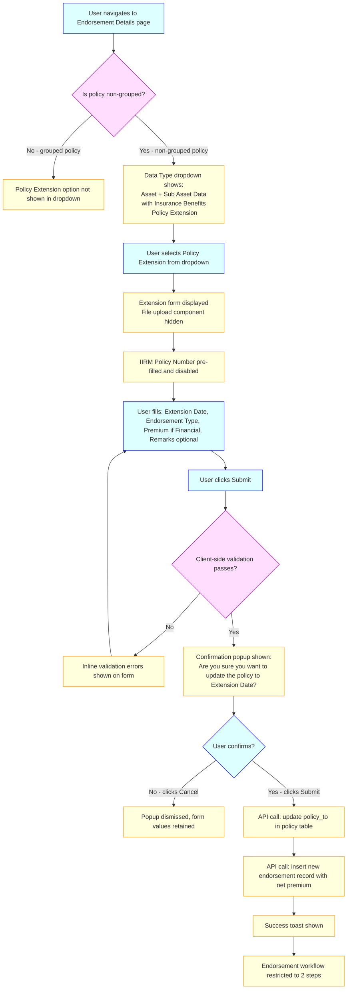
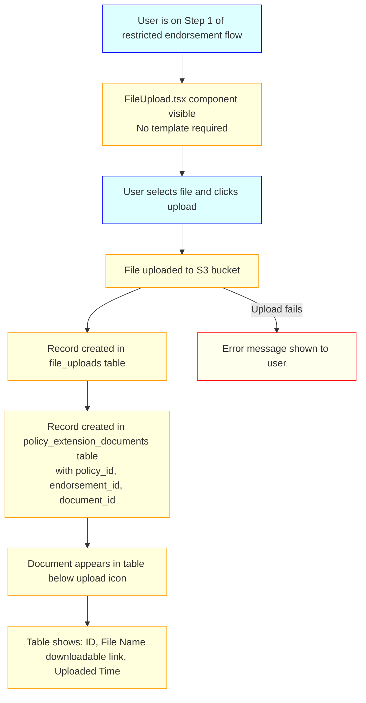
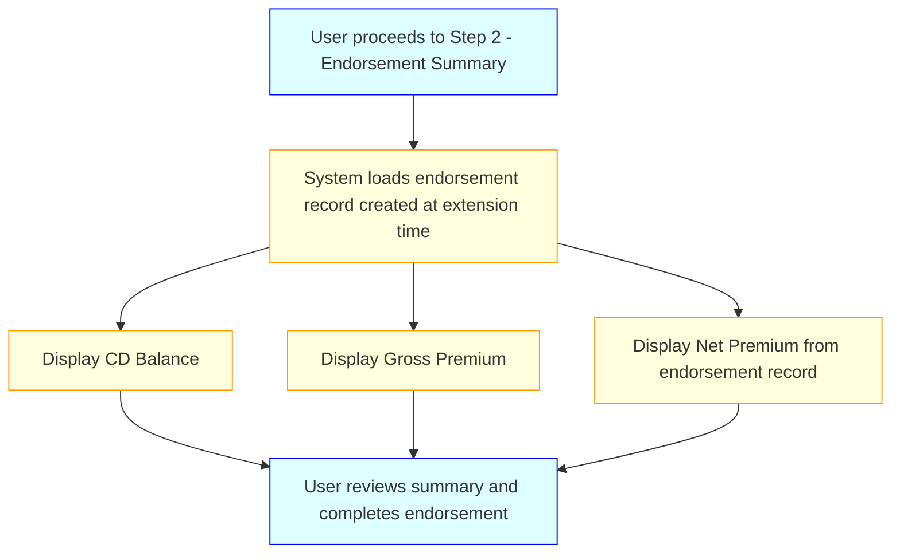
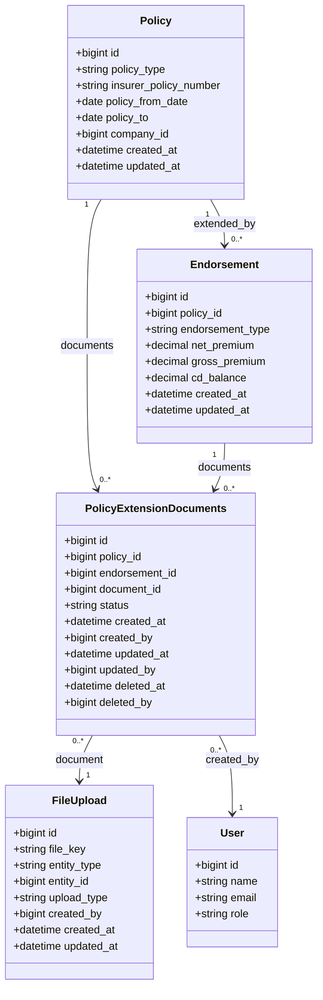

# Policy Duration Extension — Business & Functional Requirements

**Status:** Draft — Updated
**Date:** 2026-05-18

---

## 1. Purpose

This document defines the detailed business and functional requirements for **Policy Duration Extension** — a feature that enables authorised users to extend the end date of non-grouped insurance policies through a structured in-page form. The extension is submitted synchronously, immediately updating the policy end date and creating a new endorsement record with the net premium. After a successful extension, the endorsement workflow is restricted to two steps — document upload and summary — and supporting documents can be uploaded and stored against the endorsement.

---

## 2. Scope

### **In-Scope**

**Policy Duration Extension**

- **Policy Type Classification:** Determination of grouped vs. non-grouped policies based on policy type constants; the extension feature is available exclusively for non-grouped policies
- **Form-Based Input:** An in-page form rendered within the existing Endorsement Details page when "Policy Extension" is selected from the Data Type dropdown; no Excel template or bulk upload is involved
- **Form Field Validation:** Client-side validation of all mandatory fields (Extension Date, Endorsement Type, Premium when Financial) before the confirmation popup is shown
- **Confirmation Popup:** A modal confirmation step requiring explicit user acknowledgement before the API call is made
- **Policy End Date Update:** Synchronous update of the `policy_to` field in the `policy` table to the Extension Date provided via the form
- **Endorsement Record Creation:** Insertion of a new record in the `endorsement` table with the net premium value on successful submission
- **Endorsement Step Restriction:** After a successful policy extension, the endorsement workflow is locked to exactly two steps (Document Upload and Endorsement Summary)
- **Asset Upload Restriction:** After a successful policy extension, the asset/sub-asset data upload option is disabled for the endorsement
- **Document Upload:** In Step 1 of the restricted endorsement flow, users can upload supporting documents using the shared `FileUpload.tsx` component (no template); documents are stored in S3, with records in `file_uploads` and the new `policy_extension_documents` table
- **Document Display:** Uploaded documents are displayed in a table below the upload icon in Step 1, showing ID, File Name (downloadable), and Uploaded Time
- **Endorsement Summary:** Step 2 of the restricted flow displays CD Balance, Gross Premium, and Net Premium

### **Out-of-Scope**

- Grouped policy types (`POLICY_TYPE_GTL`, `POLICY_TYPE_GMC`, `POLICY_TYPE_GPA`, `POLICY_TYPE_OPD`, `POLICY_TYPE_GMC_PARENTAL`, `POLICY_TYPE_GMC_PARENTAL_TOP_UP`, `POLICY_TYPE_GMC_TOP-UP`, `POLICY_TYPE_2_SURGICAL_HOSPITAL_INSURANCE`) — the "Policy Extension" form must not appear for these types
- Excel template download and bulk file upload
- Asynchronous scheduler-based processing
- Error file generation — errors are surfaced inline on the form
- Revert / rollback of a submitted policy extension
- Extension History tab on the Policy Details page
- Email or in-app notifications on success or failure
- Role-based access control restrictions
- Maximum extension duration enforcement

---

## 3. Stakeholders

- **Primary Users:** Operations Team — users who submit policy extension requests and upload supporting documents
- **Secondary Users:** None
- **System Actors:** Policy Service — processes the synchronous extension API call, updates the policy record, and creates the endorsement record
- **External Stakeholders:** Insurers — policy information is displayed in read-only pre-filled fields during the extension form

---

## 4. Key Use Cases

### **Use Case UC-001: Policy Extension Form Submission**

**Description:** User selects "Policy Extension" from the Data Type dropdown on the Endorsement Details page, fills in the extension form, confirms submission, and the system updates the policy end date and creates a new endorsement record.
**Actors:** Operations Team
**Preconditions:** User is authenticated, is on the Endorsement Details page of a non-grouped policy, and the Data Type dropdown is visible.

**Main Flow:**

**Alternate Flows:**
- If the policy is grouped, "Policy Extension" does not appear in the dropdown
- If Extension Date is not after the current `policy_to`, an inline error is shown and the form is not submitted

---

### **Use Case UC-002: Document Upload After Policy Extension**

**Description:** After a successful policy extension, the user uploads supporting documents in Step 1 of the restricted endorsement workflow using the `FileUpload.tsx` component.
**Actors:** Operations Team
**Preconditions:** Policy extension has been successfully submitted; the endorsement is in the 2-step restricted flow; user is on Step 1.

**Main Flow:**

**Alternate Flows:**
- If the S3 upload fails, an error message is shown and no database records are created

---

### **Use Case UC-003: Endorsement Summary After Policy Extension**

**Description:** After completing document upload in Step 1, the user proceeds to Step 2 to review the endorsement summary.
**Actors:** Operations Team
**Preconditions:** Policy extension has been successfully submitted; user is on Step 2 of the restricted endorsement workflow.

**Main Flow:**

---

## 5. Functional Requirements

### **Policy Classification Requirements**

1. **FR-001:** System shall classify policies as grouped or non-grouped based on their `policy_type` value. The following types are classified as grouped and are excluded from the Policy Duration Extension feature: `POLICY_TYPE_GTL`, `POLICY_TYPE_GMC`, `POLICY_TYPE_GPA`, `POLICY_TYPE_OPD`, `POLICY_TYPE_GMC_PARENTAL`, `POLICY_TYPE_GMC_PARENTAL_TOP_UP`, `POLICY_TYPE_GMC_TOP-UP`, `POLICY_TYPE_2_SURGICAL_HOSPITAL_INSURANCE`. Any policy type not in this list is classified as non-grouped.

2. **FR-002:** The "Policy Extension" option shall appear in the Data Type dropdown of the Endorsement Details page only for non-grouped policies. For grouped policies, the dropdown renders existing group-policy options and "Policy Extension" is not included.

### **Form Display Requirements**

3. **FR-003:** When "Policy Extension" is selected from the Data Type dropdown, the system shall hide the file upload component and render the policy extension form with the following fields: IIRM Policy Number (pre-filled, disabled), Extension Date (mandatory), Endorsement Type (mandatory, dropdown: Financial / Non-Financial), Premium (conditional — mandatory when Financial, optional when Non-Financial), Remarks (optional).

4. **FR-004:** The IIRM Policy Number field shall be pre-filled from the current policy record and rendered as disabled (read-only).

5. **FR-005:** The form shall display **Cancel** and **Submit** buttons. Cancel resets the form state; Submit triggers client-side validation.

### **Validation Requirements**

6. **FR-006:** System shall validate the following on Submit click, before showing the confirmation popup:
   - Extension Date is provided and is strictly after the current `policy_to` date
   - Endorsement Type is selected
   - Premium is provided when Endorsement Type is "Financial"

7. **FR-007:** Validation errors shall be displayed inline on the relevant form fields. The confirmation popup shall not appear until all mandatory fields pass validation.

### **Confirmation Requirements**

8. **FR-008:** Upon passing client-side validation, the system shall display a confirmation popup with the message: *"Are you sure you want to update the policy to [Extension Date]?"* with Cancel and Submit actions.

9. **FR-009:** Clicking Cancel on the confirmation popup shall dismiss it without making any API call; form values shall be retained.

### **Policy Update Requirements**

10. **FR-010:** On confirmation, the system shall synchronously update the `policy_to` field of the current policy in the `policy` table to the Extension Date entered in the form.

11. **FR-011:** On confirmation, the system shall insert a new record in the `endorsement` table containing at minimum the net premium value from the Premium field.

### **Post-Extension Endorsement Flow Requirements**

12. **FR-012:** After a successful policy extension submission, the asset/sub-asset data upload option shall be disabled for this endorsement.

13. **FR-013:** After a successful policy extension submission, the endorsement workflow shall be restricted to exactly two steps: Step 1 (Document Upload) and Step 2 (Endorsement Summary).

### **Document Upload Requirements**

14. **FR-014:** In Step 1 of the restricted endorsement flow, the system shall render a document upload section using the shared `FileUpload.tsx` component. No download template shall be provided.

15. **FR-015:** On document upload, the system shall:
    - Upload the file to the S3 bucket
    - Create a record in the `file_uploads` table
    - Create a corresponding record in the `policy_extension_documents` table with `policy_id`, `endorsement_id`, `document_id`, and `status`

16. **FR-016:** Uploaded documents shall be displayed in a table below the upload icon in Step 1 with the following columns: ID, File Name (as a downloadable link), Uploaded Time.

### **Endorsement Summary Requirements**

17. **FR-017:** Step 2 (Endorsement Summary) shall display the following fields for the extension endorsement: CD Balance, Gross Premium, Net Premium.

---

## 6. Acceptance Criteria

### **FR-001 — Policy Classification**

- AC1: Policy Extension form is visible for a policy with type `POLICY_TYPE_PERSONAL_ACCIDENT` (non-grouped)
- AC2: Policy Extension option is absent from the dropdown for a policy with type `POLICY_TYPE_GMC` (grouped)

### **FR-003/004 — Form Display**

- AC1: Selecting "Policy Extension" from the dropdown hides the file upload component and shows the extension form
- AC2: IIRM Policy Number field is pre-filled with the correct value and cannot be edited
- AC3: Endorsement Type dropdown displays exactly two options: Financial and Non-Financial
- AC4: Premium field is marked as mandatory when Financial is selected and optional when Non-Financial is selected

### **FR-006/007 — Validation**

- AC1: Submitting with an empty Extension Date shows an inline error and does not open the confirmation popup
- AC2: Submitting with an Extension Date equal to or before the current `policy_to` shows an inline validation error
- AC3: Submitting with Endorsement Type = Financial and an empty Premium shows an inline validation error
- AC4: Submitting with Endorsement Type = Non-Financial and an empty Premium passes validation

### **FR-008/009 — Confirmation Popup**

- AC1: After passing validation, the confirmation popup appears with the message including the entered Extension Date
- AC2: Clicking Cancel on the popup dismisses it and the form values remain unchanged
- AC3: Clicking Submit on the popup triggers the API call

### **FR-010/011 — Policy Update & Endorsement Record**

- AC1: After confirmation, the policy's `policy_to` in the database equals the Extension Date entered in the form
- AC2: A new endorsement record exists in the `endorsement` table with the net premium from the form

### **FR-012/013 — Endorsement Flow Restriction**

- AC1: After a successful policy extension, the asset upload option is not available for this endorsement
- AC2: The endorsement workflow shows exactly two steps and no additional steps are rendered

### **FR-015/016 — Document Upload**

- AC1: Uploading a document in Step 1 creates a record in `file_uploads` and in `policy_extension_documents`
- AC2: The uploaded document appears in the table below the upload icon with the correct file name, as a downloadable link, and the upload timestamp
- AC3: The `policy_extension_documents` record contains the correct `policy_id`, `endorsement_id`, and `document_id`

### **FR-017 — Endorsement Summary**

- AC1: Step 2 displays CD Balance, Gross Premium, and Net Premium
- AC2: The Net Premium value matches the value entered in the extension form

---

## 7. Non-Functional Requirements

### **Performance**

- **NFR-001:** The policy extension API call (policy update + endorsement record creation) shall complete within 5 seconds under normal database load
- **NFR-002:** Document uploads to S3 shall complete within 30 seconds for files up to 25 MB

### **Reliability**

- **NFR-003:** The policy `policy_to` update and endorsement record creation shall occur within a single database transaction to guarantee consistency — either both succeed or neither is committed
- **NFR-004:** S3 upload failure shall prevent `file_uploads` and `policy_extension_documents` records from being created; an error message shall be shown to the user

### **Security**

- **NFR-005:** Documents stored in S3 shall be accessible only via pre-signed URLs with a defined expiry; direct public access to the S3 bucket shall be disabled
- **NFR-006:** All API endpoints for policy extension shall require authentication

### **Usability**

- **NFR-007:** Inline validation error messages shall be human-readable and actionable, clearly stating what value is expected
- **NFR-008:** The document table shall update in real time after each successful upload without requiring a full page refresh

---

## 8. Data Models & Entities

### **`policy_extension_documents` Table — Column Reference**

| Column | Type | Nullable | Description |
|---|---|---|---|
| `id` | `bigint` PK | No | Auto-increment primary key |
| `policy_id` | `bigint` FK | No | The policy to which this extension belongs |
| `endorsement_id` | `bigint` FK | No | The endorsement record created for this extension |
| `document_id` | `bigint` FK | No | Reference to the `file_uploads` record for the uploaded document |
| `status` | `varchar` | No | Document status: `active` or `deleted` |
| `created_at` | `timestamp` | No | Record creation timestamp |
| `created_by` | `bigint` FK | No | User who uploaded the document |
| `updated_at` | `timestamp` | No | Last update timestamp |
| `updated_by` | `bigint` FK | Yes | User who last updated the record |
| `deleted_at` | `timestamp` | Yes | Soft-delete timestamp (null if not deleted) |
| `deleted_by` | `bigint` FK | Yes | User who soft-deleted the record |

---

## 9. Business Rules & Constraints

### **Policy Classification Rules**

- **BR-001:** The grouped policy type list is the single source of truth for determining feature eligibility. Any policy type absent from the list is automatically treated as non-grouped and eligible for the extension feature.
- **BR-002:** Policy type classification is evaluated at the time the form is rendered. Changing a policy type after submission does not retroactively affect endorsement records.

### **Form & Validation Rules**

- **BR-003:** Extension Date must be strictly greater than the current `policy_to`. An Extension Date equal to the current end date is not permitted.
- **BR-004:** Endorsement Type must be selected — either Financial or Non-Financial. Blank selection is not accepted.
- **BR-005:** Premium is mandatory when Endorsement Type is Financial. When Non-Financial, Premium is optional and its absence is not treated as an error.
- **BR-006:** Remarks require no validation; any value including empty is accepted.
- **BR-007:** The IIRM Policy Number field is pre-filled from the system and cannot be modified by the user.

### **Processing Rules**

- **BR-008:** The policy `policy_to` update and the endorsement record creation must be committed in a single database transaction. If either operation fails, both must roll back.
- **BR-009:** No maximum extension duration is enforced. The Extension Date may be any date strictly after the current `policy_to`.

### **Post-Extension Rules**

- **BR-010:** Once a policy extension is successfully submitted, the asset upload step is permanently disabled for that endorsement.
- **BR-011:** After a policy extension, the endorsement is restricted to exactly two steps: Document Upload (Step 1) and Endorsement Summary (Step 2). No additional steps can be added.

### **Document Upload Rules**

- **BR-012:** Each document upload creates one record in `file_uploads` and one record in `policy_extension_documents`. Both are linked by `document_id`.
- **BR-013:** Documents are stored in S3; direct public access is not permitted.
- **BR-014:** Documents are displayed in the endorsement step only (Step 1), below the upload icon. They are not surfaced elsewhere.
- **BR-015:** The `policy_extension_documents` record must reference the correct `policy_id` and `endorsement_id` of the current extension endorsement.

---

## 10. Assumptions & Dependencies

### **Assumptions**

- **ASM-001:** The existing `FileUpload.tsx` common component is reused as-is for document upload in Step 1; no changes to that component are required for the base upload functionality
- **ASM-002:** The `endorsement` table already supports the fields required for the new endorsement record (net premium, policy reference, endorsement type); if not, a migration is required
- **ASM-003:** The platform's existing S3 upload infrastructure and `file_uploads` persistence pattern are reused without modification
- **ASM-004:** The confirmation popup follows the existing modal/dialog pattern used elsewhere in the application

### **Dependencies**

- **DEP-001:** `policy` table — must expose `policy_to`, `policy_type`, and IIRM policy number fields for pre-fill and validation
- **DEP-002:** `endorsement` table — must accept the net premium and policy reference on insert
- **DEP-003:** `file_uploads` table — existing file metadata table, reused for document tracking
- **DEP-004:** `policy_extension_documents` table — new table (migration required)
- **DEP-005:** S3 bucket — documents are uploaded under a defined prefix path
- **DEP-006:** `FileUpload.tsx` — shared common component used in Step 1 for document upload

---

## 11. Glossary

| Term | Definition |
|---|---|
| **Grouped Policy** | A policy whose `policy_type` is one of the eight designated grouped types. Not eligible for Policy Duration Extension. |
| **Non-Grouped Policy** | A policy whose `policy_type` is not in the grouped list. Eligible for Policy Duration Extension. |
| **Policy Duration Extension** | The act of advancing a policy's `policy_to` date via the form in the Endorsement Details page. |
| **IIRM Policy Number** | The identifier pre-filled from the current policy record into the extension form. Displayed as a read-only field. |
| **Extension Date** | The new `policy_to` date provided by the user via the form. Must be strictly after the current `policy_to`. |
| **Endorsement Type** | A classification of the financial nature of the endorsement: Financial or Non-Financial. Determines whether Premium is mandatory. |
| **Net Premium** | The premium amount entered in the form. Stored in the new endorsement record. Mandatory when Endorsement Type is Financial. |
| **`policy_to`** | The current end date of a policy. Updated to the Extension Date on successful form submission. |
| **2-Step Endorsement Flow** | The restricted endorsement workflow applied after a policy extension: Step 1 (Document Upload) and Step 2 (Endorsement Summary). |
| **`policy_extension_documents`** | The new database table that stores references to documents uploaded against a policy extension endorsement. |
| **FileUpload.tsx** | The shared React component used across the application for file uploads. Reused in Step 1 of the post-extension endorsement flow. |

---

## 12. Open Questions

| # | Question | Owner | Status |
|---|---|---|---|
| OQ-001 | Should the feature be gated behind a specific user role? | Product | **Resolved:** No role restriction |
| OQ-002 | Should email or in-app notifications be sent on upload success or failure? | Product | **Resolved:** No notifications |
| OQ-003 | Is there a maximum allowed extension duration? | Business / Compliance | **Resolved:** No maximum duration enforced |
| OQ-004 | Should extensions be reversible? | Engineering / Product | **Resolved:** Not in scope for this version |
| OQ-005 | Should there be a limit on the number of documents that can be uploaded per extension? | Product | **Open** |
| OQ-006 | Should the Endorsement Summary (Step 2) include any fields beyond CD Balance, Gross Premium, and Net Premium? | Product | **Open** |
| OQ-007 | What should happen if the user navigates away from the form without submitting — should draft values be retained? | Product | **Open** |
