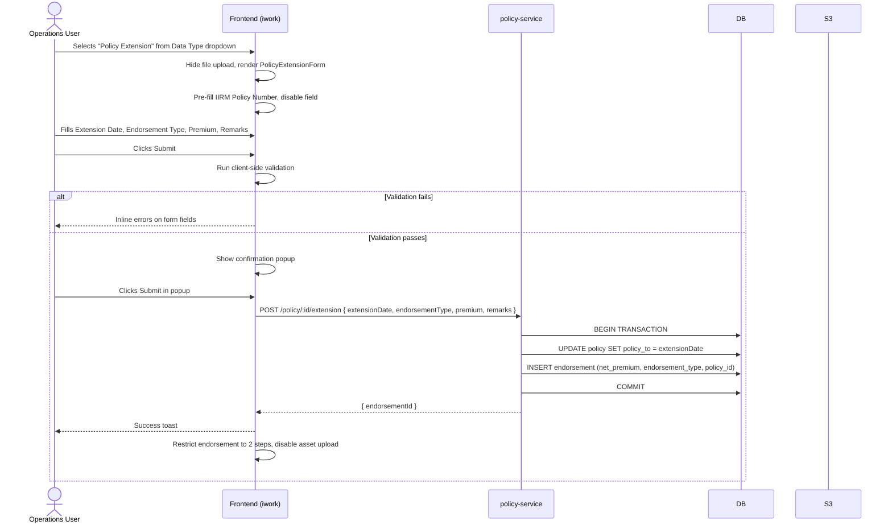
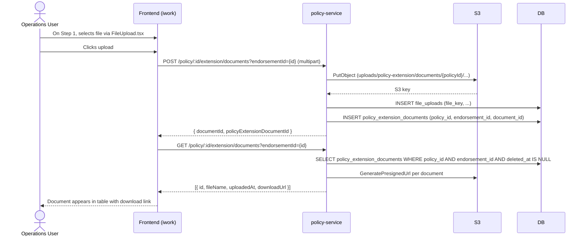

# Policy Duration Extension — Technical Specification

**Feature:** Policy Duration Extension (Non-Grouped Policies)
**BRD Reference:** Policy-Duration-Extension-BRD.md
**Date:** 2026-05-18
**Status:** Draft — Updated

---

## 1. Overview

This document describes the technical design and implementation plan for the updated Policy Duration Extension feature. The previous Excel bulk-upload / scheduler-based approach is **replaced** by a synchronous form-based submission flow. When the user selects "Policy Extension" from the Data Type dropdown, an input form is rendered. On confirmation, a direct API call updates `policy_to` in the `policy` table and creates a new endorsement record. After extension, the endorsement workflow is restricted to two steps: document upload (Step 1) and endorsement summary (Step 2).

### 1.1 High-Level Architecture

```
┌─────────────────────────────────────────────────────────────────┐
│  Frontend (apps/ui/iwork)                                       │
│                                                                 │
│  EndorsementDetailsPage → Data Type dropdown                    │
│    "Policy Extension" selected:                                 │
│       ├── PolicyExtensionForm component                         │
│       │     Fields: IIRM Policy Number (pre-filled, disabled)   │
│       │             Extension Date (mandatory)                   │
│       │             Endorsement Type (Financial / Non-Financial) │
│       │             Premium (mandatory if Financial)             │
│       │             Remarks (optional)                           │
│       │     Buttons: Cancel | Submit                             │
│       │     → Confirmation popup on Submit                       │
│       │     → POST /policy/:id/extension (synchronous)          │
│       │                                                         │
│  After extension success:                                       │
│    ├── Endorsement restricted to 2 steps                        │
│    ├── Step 1 — Document Upload                                 │
│    │     FileUpload.tsx (no template)                           │
│    │     Documents table: ID, File Name, Uploaded Time          │
│    └── Step 2 — Endorsement Summary                             │
│          CD Balance | Gross Premium | Net Premium               │
└───────────────────────┬─────────────────────────────────────────┘
                        │ REST (synchronous)
┌───────────────────────▼─────────────────────────────────────────┐
│  policy-service (apps/services/policy-service)                  │
│    POST  /policy/:id/extension           → extend policy        │
│    POST  /policy/:id/extension/documents → upload document      │
│    GET   /policy/:id/extension/documents → list documents       │
└───────────────────────┬─────────────────────────────────────────┘
                        │
┌───────────────────────▼─────────────────────────────────────────┐
│  Database (PostgreSQL)                                          │
│    policy                         (existing, updated)           │
│    endorsement                    (existing, new record)        │
│    file_uploads                   (existing, reused)            │
│    policy_extension_documents     (new table)                   │
└─────────────────────────────────────────────────────────────────┘
                        │
┌───────────────────────▼─────────────────────────────────────────┐
│  S3                                                             │
│    uploads/policy-extension/documents/{policyId}/{filename}     │
└─────────────────────────────────────────────────────────────────┘
```

> **Note:** The Scheduler Service is **not involved** in the policy extension submission flow. Processing is synchronous within the API request. The `DocumentProcessingFile` queue entity is not used for this feature.

### 1.2 Key Architectural Decisions

| Decision | Choice | Rationale |
|---|---|---|
| Input method | In-page form (not Excel upload) | Simpler UX; single policy, known fields; no bulk scenario |
| Processing model | Synchronous API call | Immediate feedback; no async queue needed for single-record update |
| Extension transaction | `policy_to` update + endorsement record in single DB transaction | Guarantees consistency |
| Document upload | Reuse `FileUpload.tsx` + S3 + `file_uploads` pattern | Consistent with existing upload infrastructure |
| Document tracking | New `policy_extension_documents` table | Provides FK to `policy`, `endorsement`, and `file_uploads`; supports soft-delete |
| Grouped policy check | Hardcoded constant array in `constants.ts` | Per BRD decision — no admin configuration |

---

## 2. Database Changes

### 2.1 New Table: `policy_extension_documents`

#### Migration File

**Path:** `apps/services/service-lib/src/lib/migrations/YYYYMMDDHHMMSS-create-policy-extension-documents.ts`

```typescript
import { MigrationInterface, QueryRunner, Table, TableForeignKey } from "typeorm";

export class CreatePolicyExtensionDocuments1234567890124 implements MigrationInterface {
  public async up(queryRunner: QueryRunner): Promise<void> {
    await queryRunner.createTable(
      new Table({
        name: "policy_extension_documents",
        columns: [
          { name: "id",             type: "bigint",    isPrimary: true, isGenerated: true, generationStrategy: "increment" },
          { name: "policy_id",      type: "bigint",    isNullable: false },
          { name: "endorsement_id", type: "bigint",    isNullable: false },
          { name: "document_id",    type: "bigint",    isNullable: false },
          { name: "status",         type: "varchar",   isNullable: false, default: "'active'" },
          { name: "created_at",     type: "timestamp", isNullable: false, default: "now()" },
          { name: "created_by",     type: "bigint",    isNullable: false },
          { name: "updated_at",     type: "timestamp", isNullable: false, default: "now()" },
          { name: "updated_by",     type: "bigint",    isNullable: true  },
          { name: "deleted_at",     type: "timestamp", isNullable: true  },
          { name: "deleted_by",     type: "bigint",    isNullable: true  },
        ],
      }),
      true
    );

    await queryRunner.createForeignKey("policy_extension_documents",
      new TableForeignKey({ columnNames: ["policy_id"],      referencedTableName: "policy",       referencedColumnNames: ["id"], onDelete: "CASCADE" })
    );
    await queryRunner.createForeignKey("policy_extension_documents",
      new TableForeignKey({ columnNames: ["endorsement_id"], referencedTableName: "endorsement",  referencedColumnNames: ["id"] })
    );
    await queryRunner.createForeignKey("policy_extension_documents",
      new TableForeignKey({ columnNames: ["document_id"],    referencedTableName: "file_uploads", referencedColumnNames: ["id"] })
    );
    await queryRunner.createForeignKey("policy_extension_documents",
      new TableForeignKey({ columnNames: ["created_by"],     referencedTableName: "user",         referencedColumnNames: ["id"] })
    );
  }

  public async down(queryRunner: QueryRunner): Promise<void> {
    await queryRunner.dropTable("policy_extension_documents");
  }
}
```

### 2.2 New Entity: `PolicyExtensionDocument`

**Path:** `apps/services/service-lib/src/lib/entities/policy-extension-document.entity.ts`

```typescript
import {
  Entity, PrimaryGeneratedColumn, Column,
  CreateDateColumn, UpdateDateColumn, DeleteDateColumn,
  ManyToOne, JoinColumn,
} from "typeorm";
import { Policy } from "./policy.entity";
import { Endorsement } from "./endorsement.entity";
import { FileUpload } from "./file-upload.entity";

@Entity("policy_extension_documents")
export class PolicyExtensionDocument {
  @PrimaryGeneratedColumn()
  id: number;

  @Column({ name: "policy_id" })
  policyId: number;

  @Column({ name: "endorsement_id" })
  endorsementId: number;

  @Column({ name: "document_id" })
  documentId: number;

  @Column({ default: "active" })
  status: string;

  @CreateDateColumn({ name: "created_at" })
  createdAt: Date;

  @Column({ name: "created_by" })
  createdBy: number;

  @UpdateDateColumn({ name: "updated_at" })
  updatedAt: Date;

  @Column({ name: "updated_by", nullable: true })
  updatedBy: number;

  @DeleteDateColumn({ name: "deleted_at", nullable: true })
  deletedAt: Date;

  @Column({ name: "deleted_by", nullable: true })
  deletedBy: number;

  @ManyToOne(() => Policy)
  @JoinColumn({ name: "policy_id" })
  policy: Policy;

  @ManyToOne(() => Endorsement)
  @JoinColumn({ name: "endorsement_id" })
  endorsement: Endorsement;

  @ManyToOne(() => FileUpload)
  @JoinColumn({ name: "document_id" })
  document: FileUpload;
}
```

**Export:** Add to `apps/services/service-lib/src/lib/entities/index.ts`

---

## 3. Shared Constants & Utilities

### 3.1 Grouped Policy Type Constant

**File:** `apps/services/service-lib/src/lib/constants.ts`

```typescript
export const GROUPED_POLICY_TYPES: string[] = [
  "POLICY_TYPE_GTL",
  "POLICY_TYPE_GMC",
  "POLICY_TYPE_GPA",
  "POLICY_TYPE_OPD",
  "POLICY_TYPE_GMC_PARENTAL",
  "POLICY_TYPE_GMC_PARENTAL_TOP_UP",
  "POLICY_TYPE_GMC_TOP-UP",
  "POLICY_TYPE_2_SURGICAL_HOSPITAL_INSURANCE",
];

export const isGroupedPolicy = (policyType: string): boolean =>
  GROUPED_POLICY_TYPES.includes(policyType);
```

### 3.2 Endorsement Type Constants

**File:** `apps/services/service-lib/src/lib/constants.ts`

```typescript
export const POLICY_EXTENSION_ENDORSEMENT_TYPE_FINANCIAL     = "Financial";
export const POLICY_EXTENSION_ENDORSEMENT_TYPE_NON_FINANCIAL = "Non-Financial";
```

### 3.3 S3 Document Path

Documents are stored under:

```
uploads/policy-extension/documents/{policyId}/{timestamp}-{originalFilename}
```

---

## 4. Backend — policy-service

### 4.1 Module Registration

**File:** `apps/services/policy-service/src/app/policy/policy.module.ts`

- Import and register `PolicyExtensionDocument` entity and its TypeORM repository
- Inject `PolicyExtensionService` (see §4.3)

### 4.2 Controller Endpoints

**File:** `apps/services/policy-service/src/app/policy/policy.controller.ts`

#### Endpoint 1 — Submit Policy Extension

```typescript
@Post(":policyId/extension")
@UseGuards(AuthGuard)
async submitPolicyExtension(
  @Param("policyId", ParseIntPipe) policyId: number,
  @Body() dto: SubmitPolicyExtensionDto,
  @Headers() headers: Record<string, string>,
): Promise<{ endorsementId: number }>
```

**Request DTO:**
```typescript
export class SubmitPolicyExtensionDto {
  @IsDateString()
  extensionDate: string;

  @IsIn(["Financial", "Non-Financial"])
  endorsementType: string;

  @IsOptional()
  @IsDecimal()
  premium?: string;

  @IsOptional()
  @IsString()
  remarks?: string;
}
```

**Processing:**
```
1. Load policy by policyId — throw NotFoundException if not found
2. Throw BadRequestException if isGroupedPolicy(policy.policyType)
3. Validate extensionDate > policy.policyTo — throw BadRequestException if not
4. Validate premium is provided when endorsementType === "Financial"
   → throw BadRequestException: "Premium is required for financial endorsements"
5. Begin DB transaction:
   a. UPDATE policy SET policy_to = extensionDate WHERE id = policyId
   b. INSERT endorsement record:
        policy_id      = policyId
        endorsement_type = dto.endorsementType
        net_premium    = dto.premium (null if Non-Financial and not provided)
        remarks        = dto.remarks
        created_by     = userId from headers
6. Commit transaction
7. Return { endorsementId }
```

**Errors:**
- `404` — Policy not found
- `400` — Policy is grouped type
- `400` — Extension date is not after current `policy_to`
- `400` — Premium missing when endorsement type is Financial

#### Endpoint 2 — Upload Extension Document

```typescript
@Post(":policyId/extension/documents")
@UseGuards(AuthGuard)
@UseInterceptors(FileInterceptor("file"))
async uploadExtensionDocument(
  @Param("policyId", ParseIntPipe) policyId: number,
  @Query("endorsementId", ParseIntPipe) endorsementId: number,
  @UploadedFile() file: Express.Multer.File,
  @Headers() headers: Record<string, string>,
): Promise<{ documentId: number; policyExtensionDocumentId: number }>
```

**Processing:**
```
1. Upload file to S3:
     key = uploads/policy-extension/documents/{policyId}/{timestamp}-{originalname}
2. INSERT file_uploads record → get fileUploadId
3. INSERT policy_extension_documents:
     policy_id      = policyId
     endorsement_id = endorsementId
     document_id    = fileUploadId
     status         = "active"
     created_by     = userId from headers
4. Return { documentId: fileUploadId, policyExtensionDocumentId }
```

#### Endpoint 3 — List Extension Documents

```typescript
@Get(":policyId/extension/documents")
@UseGuards(AuthGuard)
async listExtensionDocuments(
  @Param("policyId", ParseIntPipe) policyId: number,
  @Query("endorsementId", ParseIntPipe) endorsementId: number,
): Promise<{ id: number; fileName: string; uploadedAt: Date; downloadUrl: string }[]>
```

**Processing:**
```
1. Query policy_extension_documents WHERE policy_id = policyId
     AND endorsement_id = endorsementId AND deleted_at IS NULL
2. For each record, resolve file_uploads.file_key → generate pre-signed S3 URL
3. Return array: [{ id, fileName, uploadedAt, downloadUrl }]
```

### 4.3 Service: `PolicyExtensionService`

**File:** `apps/services/policy-service/src/app/policy/policy-extension.service.ts`

#### `submitExtension(policyId, dto, userId): Promise<{ endorsementId: number }>`

Contains the business logic described in Endpoint 1 §4.2. Runs the DB transaction atomically.

#### `uploadDocument(policyId, endorsementId, file, userId): Promise<{ documentId, policyExtensionDocumentId }>`

Contains the logic described in Endpoint 2 §4.2. Calls the shared S3 upload utility.

#### `listDocuments(policyId, endorsementId): Promise<DocumentRecord[]>`

Contains the logic described in Endpoint 3 §4.2. Generates pre-signed URLs via the shared S3 utility.

---

## 5. Frontend — apps/ui/iwork

The Policy Extension feature is integrated into the **existing Endorsement Details page**. The changes replace the file upload component with an inline form and add document upload and summary behaviour to the restricted 2-step endorsement flow.

### 5.1 New Constant

**File:** `apps/ui/iwork/src/app/constants.ts`

```typescript
export const POLICY_EXTENSION_NUM = 789012; // unique key for policy extension doc type
```

### 5.2 `nonGroupConfig.ts` — Add "Policy Extension" Dropdown Option

**File:** `apps/ui/iwork/src/app/pages/EndorsementPage/EndorsementDataUpload/nonGroupConfig.ts`

Remove `disabled: true` from the `documentType` field. Add the new dropdown option:

```typescript
{
  key: "documentType",
  name: "documentType",
  label: "Data Type",
  type: "select",
  gridColumn: 9,
  // disabled: true  ← REMOVED
  componentProps: { fullWidth: true, placeholder: "Select Data Type" },
  options: [
    {
      value: TEMP_NUM,
      label: "Asset + Sub Asset Data with Insurance Benefits",
    },
    {
      value: POLICY_EXTENSION_NUM,
      label: "Policy Extension",              // ← new option
    },
  ],
  rules: { required: "Please select a data type" },
},
```

### 5.3 `EndorsementDataUploadPage.tsx` — Render Form Instead of File Upload

**File:** `apps/ui/iwork/src/app/pages/EndorsementPage/EndorsementDataUpload/EndorsementDataUploadPage.tsx`

#### Change 1 — Detect policy extension selection

```typescript
const selectedDocType = methods?.watch("documentType");
const isPolicyExtension = !isGroupPolicyType && selectedDocType === POLICY_EXTENSION_NUM;
```

#### Change 2 — Conditionally render form vs. file upload

```typescript
{isPolicyExtension ? (
  <PolicyExtensionForm
    policyId={policyId}
    iirnPolicyNumber={policy.iirnPolicyNumber}
    currentPolicyTo={policy.policyTo}
    onSuccess={(endorsementId) => handleExtensionSuccess(endorsementId)}
    onCancel={() => methods.resetField("documentType")}
  />
) : (
  <FileUploadSection ... /> // existing upload component
)}
```

#### Change 3 — On extension success, trigger 2-step flow

```typescript
const handleExtensionSuccess = (endorsementId: number) => {
  setExtensionEndorsementId(endorsementId);
  setIsPolicyExtended(true);
  // Triggers restriction to 2-step flow and disables asset upload
};
```

### 5.4 New Component: `PolicyExtensionForm`

**File:** `apps/ui/iwork/src/app/components/PolicyExtensionForm/index.tsx`

```
Props:
  policyId: number
  iirnPolicyNumber: string
  currentPolicyTo: string     // ISO date string
  onSuccess: (endorsementId: number) => void
  onCancel: () => void

Form fields (using react-hook-form + MUI):
  1. iirnPolicyNumber    — TextField, disabled, pre-filled
  2. extensionDate       — DatePicker, required
  3. endorsementType     — Select: ["Financial", "Non-Financial"], required
  4. premium             — TextField (decimal), required when endorsementType = "Financial"
  5. remarks             — TextField multiline, optional

Validation (react-hook-form rules):
  - extensionDate: required; must be after currentPolicyTo
  - endorsementType: required
  - premium: required when endorsementType === "Financial"

On Submit click:
  1. Trigger react-hook-form validation
  2. If invalid → show inline errors, abort
  3. If valid → open ConfirmationDialog

ConfirmationDialog:
  Message: `Are you sure you want to update the policy to ${extensionDate}?`
  Actions: Cancel | Submit
  On Submit: call POST /policy/:policyId/extension with form values
  On success: call props.onSuccess(endorsementId)
  On error: show error toast, close dialog
```

### 5.5 Endorsement Step Restriction

**File:** `apps/ui/iwork/src/app/pages/EndorsementPage/EndorsementStepper/index.tsx` (or equivalent stepper component)

When `isPolicyExtended === true`:

```typescript
const visibleSteps = isPolicyExtended
  ? steps.filter(s => ["documentUpload", "endorsementSummary"].includes(s.key))
  : steps;
```

- Asset upload step is excluded from `visibleSteps`
- Only "Document Upload" and "Endorsement Summary" steps are rendered

### 5.6 Step 1 — Document Upload (Post-Extension)

**File:** `apps/ui/iwork/src/app/pages/EndorsementPage/Steps/DocumentUploadStep/index.tsx`

When `isPolicyExtended === true`, render the extension document upload section:

```
Section content:
  - FileUpload.tsx component (no template download button)
  - On file selected + upload triggered:
      POST /policy/:policyId/extension/documents?endorsementId={endorsementId}
      with multipart/form-data file
  - On success: refresh document list

Document table (below upload icon):
  Columns:
    - ID (numeric)
    - File Name (rendered as <a href={downloadUrl} download> link)
    - Uploaded Time (formatted timestamp)
  Data source: GET /policy/:policyId/extension/documents?endorsementId={endorsementId}
  Re-fetches after each successful upload
```

### 5.7 Step 2 — Endorsement Summary (Post-Extension)

**File:** `apps/ui/iwork/src/app/pages/EndorsementPage/Steps/EndorsementSummaryStep/index.tsx`

When `isPolicyExtended === true`, render only the extension-specific summary fields:

```
Display:
  CD Balance    — from endorsement record
  Gross Premium — from endorsement record
  Net Premium   — from endorsement record (value entered in PolicyExtensionForm)
```

### 5.8 New Endpoint Functions

**File:** `apps/ui/ui-lib/src/lib/endpoints.ts`

```typescript
submitPolicyExtension: (policyId: number) =>
  `/policy/${policyId}/extension`,

uploadPolicyExtensionDocument: (policyId: number) =>
  `/policy/${policyId}/extension/documents`,

listPolicyExtensionDocuments: (policyId: number) =>
  `/policy/${policyId}/extension/documents`,
```

---

## 6. API Contract Summary

| Method | Path | Auth | Request | Response |
|---|---|---|---|---|
| `POST` | `/policy/:policyId/extension` | Bearer | `{ extensionDate, endorsementType, premium?, remarks? }` | `{ endorsementId }` |
| `POST` | `/policy/:policyId/extension/documents?endorsementId` | Bearer | `multipart/form-data` `file` | `{ documentId, policyExtensionDocumentId }` |
| `GET` | `/policy/:policyId/extension/documents?endorsementId` | Bearer | — | `[{ id, fileName, uploadedAt, downloadUrl }]` |

---

## 7. Error Response Reference

| HTTP Status | Scenario |
|---|---|
| `400` | Policy is grouped type — extension not allowed |
| `400` | Extension date is not after current `policy_to` |
| `400` | Premium is missing when endorsement type is Financial |
| `404` | Policy not found |

---

## 8. Task Breakdown

All tasks are listed in dependency order. Tasks within the same group can be worked in parallel.

---

### Group A — Database (no dependencies)

| # | Task | File(s) | Notes |
|---|---|---|---|
| A-1 | Write migration: create `policy_extension_documents` table with all columns and FK constraints | `apps/services/service-lib/src/lib/migrations/` | See §2.1 |
| A-2 | Create `PolicyExtensionDocument` TypeORM entity | `apps/services/service-lib/src/lib/entities/policy-extension-document.entity.ts` | See §2.2 |
| A-3 | Export `PolicyExtensionDocument` from service-lib entities index | `apps/services/service-lib/src/lib/entities/index.ts` | Add export line |

---

### Group B — Shared Constants (no dependencies)

| # | Task | File(s) | Notes |
|---|---|---|---|
| B-1 | Add `GROUPED_POLICY_TYPES` constant array and `isGroupedPolicy()` utility function | `apps/services/service-lib/src/lib/constants.ts` | See §3.1 |
| B-2 | Add `POLICY_EXTENSION_ENDORSEMENT_TYPE_FINANCIAL` and `NON_FINANCIAL` constants | `apps/services/service-lib/src/lib/constants.ts` | See §3.2 |

---

### Group C — Backend: policy-service (depends on A, B)

| # | Task | File(s) | Notes |
|---|---|---|---|
| C-1 | Register `PolicyExtensionDocument` entity in policy-service TypeORM module | `apps/services/policy-service/src/app/policy/policy.module.ts` | Import entity + `TypeOrmModule.forFeature([PolicyExtensionDocument])` |
| C-2 | Create `PolicyExtensionService` with `submitExtension()`, `uploadDocument()`, `listDocuments()` methods | `apps/services/policy-service/src/app/policy/policy-extension.service.ts` | See §4.3; transaction in `submitExtension()` |
| C-3 | Add `POST /policy/:policyId/extension` endpoint with `SubmitPolicyExtensionDto` | `apps/services/policy-service/src/app/policy/policy.controller.ts` | See §4.2 Endpoint 1; transactional |
| C-4 | Add `POST /policy/:policyId/extension/documents` endpoint | `apps/services/policy-service/src/app/policy/policy.controller.ts` | See §4.2 Endpoint 2; S3 upload + dual DB insert |
| C-5 | Add `GET /policy/:policyId/extension/documents` endpoint | `apps/services/policy-service/src/app/policy/policy.controller.ts` | See §4.2 Endpoint 3; generates pre-signed URLs |

---

### Group D — Frontend: Form & Dropdown Integration (depends on C)

| # | Task | File(s) | Notes |
|---|---|---|---|
| D-1 | Add `POLICY_EXTENSION_NUM = 789012` constant | `apps/ui/iwork/src/app/constants.ts` | See §5.1 |
| D-2 | Update `nonGroupConfig.ts`: remove `disabled: true` and add "Policy Extension" option | `apps/ui/iwork/src/app/pages/EndorsementPage/EndorsementDataUpload/nonGroupConfig.ts` | See §5.2 |
| D-3 | Add `isPolicyExtension` flag and conditional form rendering in `EndorsementDataUploadPage.tsx` | `apps/ui/iwork/src/app/pages/EndorsementPage/EndorsementDataUpload/EndorsementDataUploadPage.tsx` | See §5.3; hide file upload when policy extension selected |
| D-4 | Build `PolicyExtensionForm` component with all fields, inline validation, and confirmation dialog | `apps/ui/iwork/src/app/components/PolicyExtensionForm/index.tsx` | See §5.4; uses react-hook-form + MUI DatePicker + MUI Dialog |
| D-5 | Add `submitPolicyExtension`, `uploadPolicyExtensionDocument`, `listPolicyExtensionDocuments` endpoint functions | `apps/ui/ui-lib/src/lib/endpoints.ts` | See §5.8 |

---

### Group E — Frontend: 2-Step Endorsement Flow (depends on D)

| # | Task | File(s) | Notes |
|---|---|---|---|
| E-1 | Implement step restriction logic: filter stepper to only "documentUpload" and "endorsementSummary" when `isPolicyExtended === true` | Endorsement stepper component | See §5.5; disables asset upload step |
| E-2 | Implement Step 1 document upload section: render `FileUpload.tsx` (no template), call upload endpoint, refresh document list on success | `apps/ui/iwork/src/app/pages/EndorsementPage/Steps/DocumentUploadStep/` | See §5.6 |
| E-3 | Implement document table in Step 1: columns ID, File Name (downloadable), Uploaded Time; data from list documents endpoint | Same file as E-2 | See §5.6; re-fetches after each upload |
| E-4 | Implement Step 2 summary: render CD Balance, Gross Premium, Net Premium from endorsement record | `apps/ui/iwork/src/app/pages/EndorsementPage/Steps/EndorsementSummaryStep/` | See §5.7 |

---

### Group F — Testing (depends on C, D, E)

| # | Task | Description |
|---|---|---|
| F-1 | Unit test: `isGroupedPolicy()` — all 8 grouped types return true; others return false | |
| F-2 | Unit test: `PolicyExtensionService.submitExtension()` — grouped policy throws 400; extension date not after policy_to throws 400; premium missing for Financial throws 400; valid input updates policy_to and creates endorsement record | |
| F-3 | Integration test: POST /policy/:id/extension — valid payload → policy_to updated, endorsement record inserted, endorsementId returned | |
| F-4 | Integration test: POST /policy/:id/extension/documents — file uploaded to S3, file_uploads record created, policy_extension_documents record created | |
| F-5 | Integration test: GET /policy/:id/extension/documents — returns documents with pre-signed download URLs | |
| F-6 | Frontend: PolicyExtensionForm validation — extension date equal to policy_to shows error; missing premium when Financial shows error; Non-Financial with empty premium passes | |
| F-7 | Frontend: confirmation popup — Cancel dismisses without API call; Submit triggers POST and calls onSuccess with endorsementId | |
| F-8 | Frontend: E2E — select Policy Extension → fill form → confirm → check policy_to updated → upload document → verify document in table → check summary fields | |

---

## 9. Sequence Diagram — Extension Form Submission



---

## 10. Sequence Diagram — Document Upload


