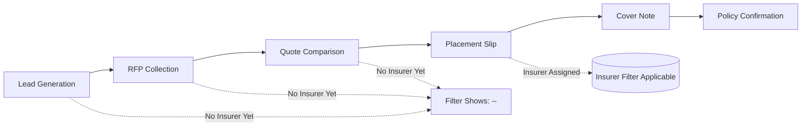

# Dashboard Insurer Filter - Technical Specification

## 1. Overview

The Dashboard Insurer Filter enables users to filter business performance widgets by insurer relationships and maintains filter consistency when drilling down from dashboard widgets to listing pages.

## 2. Architecture & Implementation

### 2.1 Frontend Components

#### Dashboard Integration
- **Location**: `apps/ui/iwork/src/app/components/BusinessPerformance/index.tsx`
- **Filter Component**: Insurer dropdown integrated with existing filter UI
- **State Management**: Redux store maintains `insurerId` in dashboard filters
- **Drill-down**: `getDashboardDrilldownFilters()` passes `insurerId` to listing pages

#### Filter Behavior
```typescript
// Dashboard filter state
const dashboardFilters = {
  financialYear: 2026,
  organisationId: 1,
  insurerId: 4913,        // ✅ New insurer filter
  fromDashboard: true     // ✅ Dashboard origin flag
};

// Drill-down navigation
const handleViewPortfolio = () => {
  navigate(`/opportunities`, {
    state: getDashboardDrilldownFilters() // Passes all filters including insurerId
  });
};
```

### 2.2 Backend Implementation

#### API Parameters
All dashboard-related endpoints now support:
```typescript
// Query parameters
insurerId?: number;        // Filter by insurer ID
fromDashboard?: boolean;   // Dashboard-specific logic flag
```

#### Affected Endpoints
1. **Main Opportunity Listing**: `/opportunity`
2. **Activity Brokerage Summary**: `/opportunity/activity-brokerage-summary`  
3. **Pending Activities Summary**: `/opportunity/pending-activities-summary`

### 2.3 Database Query Logic

#### Conditional Insurer Filtering
```sql
-- When insurerId provided, filter opportunities through placement slip insurer relationships
WHERE main.opportunityId IN (
  SELECT DISTINCT oam.opportunity_id
  FROM opportunity_activity_map oam
  INNER JOIN opportunity_placement_slip_generation opsg
    ON opsg.opportunity_activity_id = oam.id
  INNER JOIN opportunity_placement_slip_insurer_map opsim
    ON opsim.placement_slip_id = opsg.id
  WHERE opsim.insurer_id = :insurerId
)
```

#### Dashboard-Specific Logic (`fromDashboard=true`)
```typescript
// Sales/Renewal Funnel: Only placement slip stage shows data when insurer selected
if (insurerId && fromDashboard && stage !== PLACEMENT_SLIP) {
  return { count: 0, brokerage: 0 }; // Zero out non-placement stages
}

// Activity Filter Combination: Both insurer + activity filters applied together
if (insurerId && activityTable) {
  // Combined filter query for precise drill-down matching
}
```

## 3. Business Logic Rules

### 3.1 Insurer-Opportunity Relationship

**Key Concept**: Insurer relationships are established at the **Placement Slip stage** of the opportunity lifecycle.



### 3.2 Filter Application Logic

| Scenario | Frontend | Backend | Result |
|----------|----------|---------|---------|
| **No insurer selected** | `insurerId: undefined` | Standard queries | All opportunities |
| **Insurer selected, non-dashboard** | `insurerId: 123` | Insurer filter only | Opportunities with insurer |
| **Dashboard drill-down** | `insurerId: 123, fromDashboard: true` | Combined filtering | Exact dashboard count match |

### 3.3 Widget Behavior

#### Sales/Renewal Funnel Widgets
- **Without insurer filter**: Shows all opportunities across all stages
- **With insurer filter**: 
  - Placement Slip stage: Shows insurer-specific count
  - Other stages: Shows 0 (insurers not assigned yet)

#### TAT Summary Widgets  
- **Placement Slip Generation**: Filtered by insurer placement slip relationships
- **Policy Expiry**: Filtered by policy-insurer relationships
- **Other activities**: Filtered through opportunity-insurer associations

## 4. Implementation Details

### 4.1 Frontend Changes

#### Filter Component Integration
```typescript
// BusinessPerformance/index.tsx - Filter state
const [insurerId, setInsurerId] = useState<number | undefined>();

// Filter change handler
const handleInsurerChange = (selectedInsurerId: number) => {
  setInsurerId(selectedInsurerId);
  // Triggers widget data refresh with new filter
};

// Drill-down filter passing
const getDashboardDrilldownFilters = () => ({
  financialYear,
  organisationId, 
  insurerId,           // ✅ Passes insurer filter
  fromDashboard: true  // ✅ Identifies dashboard origin
});
```

### 4.2 Backend Changes

#### Service Layer Enhancements
```typescript
// opportunity.service.ts - Method signature updates
async getAllOpportunityList(
  // ... existing parameters
  insurerId?: number,
  // No fromDashboard needed - handled via query parameters
) {
  // Conditional insurer filtering logic
  if (insurerId) {
    customWhereCondition = /* insurer subquery */;
  }
}
```

#### Repository Query Building
```typescript
// opportunity.repository.ts - Conditional filter application
if (insurerId && fromDashboard && activityTable) {
  // Dashboard drill-down: Combine insurer + activity filters
  customWhereCondition = new Brackets((query) => {
    query.where(`/* Combined insurer + activity subquery */`);
  });
} else if (insurerId) {
  // Standard insurer filtering
  customWhereCondition = new Brackets((query) => {
    query.where(`/* Insurer-only subquery */`);
  });
}
```

## 5. Key Technical Decisions

### 5.1 Placement Slip Focus
- **Decision**: Filter insurers only through placement slip relationships
- **Rationale**: Placement slip is where insurer selection actually occurs in the business process
- **Alternative Considered**: Multi-stage insurer relationships (rejected for complexity)

### 5.2 Dashboard Origin Flag
- **Decision**: Use `fromDashboard` parameter to differentiate dashboard vs direct navigation
- **Rationale**: Enables different filtering logic for drill-downs vs standalone usage
- **Benefit**: Maintains backward compatibility for existing listing page usage

### 5.3 Conditional Query Building
- **Decision**: Build different SQL queries based on parameter combinations
- **Rationale**: Ensures exact count matching between dashboard widgets and listing pages
- **Implementation**: Three query patterns (no filter, insurer only, insurer + activity)

## 6. Performance Considerations

### 6.1 Database Optimization
- **Batch Size**: Increased from 3000 to 5000 records for pending activities
- **Query Monitoring**: Added execution time logging for performance tracking
- **Index Requirements**: Existing indexes on placement slip insurer maps are sufficient

### 6.2 Monitoring & Debugging
```typescript
// Performance tracking
console.log("🚀 PENDING ACTIVITIES PERFORMANCE: Completed", {
  executionTimeMs: Date.now() - startTime,
  hasInsurerFilter: !!insurerId,
  fromDashboard,
  totalRecords: summaryTotals.total
});

// Filter debugging  
console.log("🔍 COMBINING INSURER + ACTIVITY FILTERS", {
  insurerId, activityTable, fromDashboard
});
```

## 7. Testing & Validation

### 7.1 Functional Testing
- **Dashboard Filter**: Verify insurer dropdown filters all widgets correctly
- **Drill-down**: Confirm listing page counts match dashboard widget counts exactly
- **Backward Compatibility**: Ensure existing functionality works without insurer filter

### 7.2 Count Consistency Validation
```typescript
// Dashboard Widget Count: 11 placement slip opportunities for insurer 4913
// Drill-down Result: Must also show exactly 11 opportunities
// Validation: GET /opportunity?insurerId=4913&fromDashboard=true&activityName=[Placement Slip Generation]
```

## 8. API Documentation

### 8.1 Request Examples

#### Dashboard Widget API Call
```http
GET /api/opportunity/activity-brokerage-summary
    ?financialYear=2026
    &organisationId=1 
    &insurerId=4913
    &fromDashboard=true
```

#### Drill-down Navigation  
```http
GET /api/opportunity
    ?page=1&limit=10
    &insurerId=4913
    &fromDashboard=true
    &activityName=[Placement Slip Generation]
    &financialYear=2026
```

### 8.2 Response Format
All APIs maintain existing response formats with no breaking changes.

## 9. Deployment Notes

- **Backward Compatibility**: ✅ All changes are additive with optional parameters
- **Database Changes**: ❌ No schema changes required
- **Configuration**: ❌ No new environment variables or configurations
- **Dependencies**: ❌ No new external dependencies

---

**Document Version**: 1.0  
**Last Updated**: 2026-04-28  
**Implementation Status**: ✅ Complete