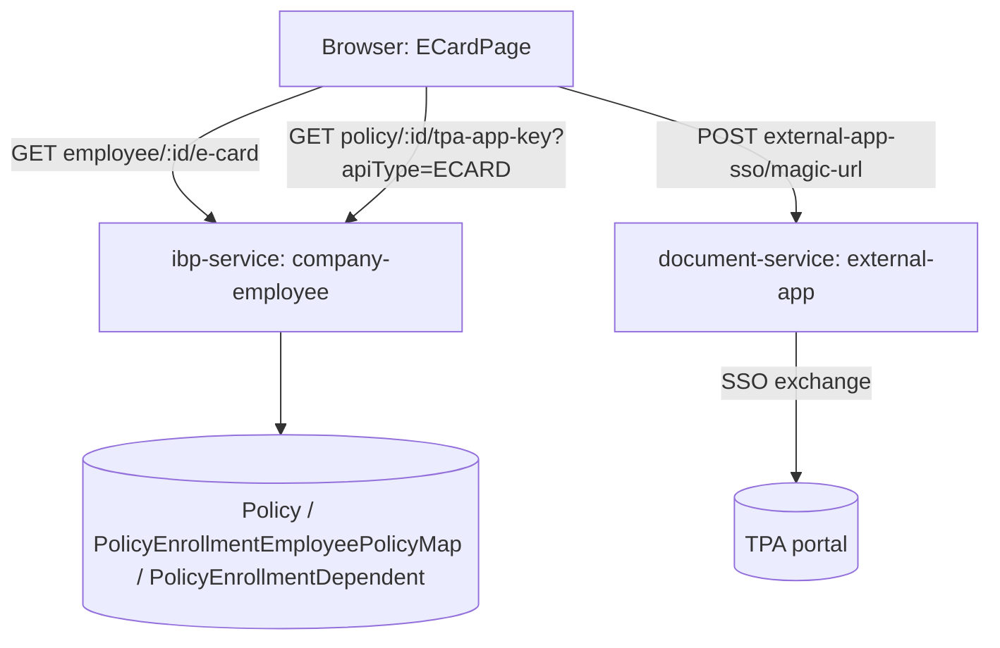

# E-Card — Employee Portal TRD (Phase 2)

**Route:** `/e-card` · **Frontend:** `apps/ui/ibp/src/app/pages/ECardPage/` · **Backend:** `ibp-service` (`company-employee`) + `document-service` (`external-app`)
**Status:** Draft (as-is architecture documented; FR-1/FR-2/FR-3 fixes speced, not yet implemented) · **Last updated:** 2026-07-20
**Related:** [phase-2-employee-portal-prd.md](./phase-2-employee-portal-prd.md) — product requirements and acceptance criteria · [phase-1-product-spec.md](./phase-1-product-spec.md) — original admin-upload PRD (superseded in its data-model assumptions by §3 below)

---

## 1. Architecture overview



**Key architectural fact (supersedes Phase 1's assumption):** there is **no persisted e-card PDF** in our own storage for this page. `ibp-service` only supplies policy/member/TPA-config metadata; the actual card is fetched **live** from the TPA's own system per request, via an SSO "magic-url" exchange handled by `document-service`. Phase 1's bulk-upload-and-store model applies to a different, admin-facing flow (`policy-service`'s `tpa-external-feature` module configures the TPA app-key itself) — not to how this employee page renders/downloads cards.

## 2. Frontend component map

| File | Role |
|---|---|
| `apps/ui/ibp/src/app/app.tsx:43,225` | Route: `/e-card` → `ECardPage` (inside `ProtectedRoute`). Note: a second, unreachable `/e-card` route exists at `app.tsx:256` rendering `WorkInProgress` — dead code, shadowed by route declaration order (React Router v6 uses first match). Flagged in PRD §5 as cleanup debt, not touched by this TRD's fixes. |
| `apps/ui/ibp/src/app/pages/ECardPage/index.tsx` | Page logic: tabs, search, policy/member grouping, detail-pane fetch, per-row download. |
| `apps/ui/ibp/src/app/pages/ECardPage/styles.ts` | Styled components, incl. `MemberItem` (row, hover/selected reveal rules) and `MemberDownloadButton` (the per-row icon button). |

## 3. Current vs. Expired — data flow

Single API call, split client-side:

```ts
// index.tsx:60-64
useApiQuery({ queryKey: ["eCardsContent", employeeId], url: endPoints.eCards(employeeId), ... });
// -> GET {ibpUrl}/company-employee/employee/:employeeId/e-card
```

```ts
// index.tsx:142-153
const { currentPoliciesMap, expiredPoliciesMap } = useMemo(() => {
  const now = new Date(); now.setHours(0, 0, 0, 0);
  allRecords.forEach((record) => {
    const policyTo = record.policyTo ?? record.policyEndDate ?? null;
    const isExpired = policyTo && new Date(policyTo) < now;
    (isExpired ? expired : current).push(record);
  });
  return { currentPoliciesMap: buildPoliciesMap(current), expiredPoliciesMap: buildPoliciesMap(expired) };
}, [allRecords]);
```

Backend: `company-employee.repository.ts`, `getEmployeeECardPolicies` (lines 1315-1356) applies **no date filter at all** — it returns every mapped policy row, current and expired alike, with raw `policyFrom`/`policyTo` strings. Contrast with the sibling method `getPoliciesByEmployee` (lines 1227-1253), used by a different feature, which does filter by `policyTo >= today` server-side. There is no `status`/`ACTIVE`/`EXPIRED` enum anywhere in this data path — classification is a pure client-side date comparison, which is fragile if `policyTo` is null or malformed (falls to "current" by default, since `isExpired` requires a truthy `policyTo`).

Service/DTO: `company-employee.service.ts` `getEmployeeECardDetails` (~line 8536) builds one `EmployeeECardItemDto` per self/dependent; shape in `apps/services/ibp-service/src/app/company-employee/dto/employee-ecard-details.dto.ts`.

## 4. Per-row Download — current implementation (already built, both tabs)

Identical markup in both tabs — Current tab at `index.tsx:567-589`, Expired tab at `index.tsx:756-764`:

```tsx
const isUnavailable = tpaId ? pdfUrls[tpaId] === "unavailable" : false;
...
{tpaId && (
  <Tooltip title={isUnavailable ? "E-Card not available" : "Download E-Card"} placement="right" arrow>
    <span>
      <MemberDownloadButton
        className="ecard-download-btn"
        size="small"
        disabled={isUnavailable || isDownloading}
        onClick={(e) => handleDownload(e, record)}
        aria-label={`Download E-Card for ${record.name || "member"}`}
      >
        {isDownloading ? <CircularProgress size={14} /> : <DownloadIcon sx={{ fontSize: 16 }} />}
      </MemberDownloadButton>
    </span>
  </Tooltip>
)}
```

`handleDownload` (`index.tsx:348-381`) calls `fetchEcardForRecord` (see §4.1) then `triggerBrowserDownload` (`index.tsx:339-346`, an `<a download>` click), and logs an `ECARD_DOWNLOADED` activity (`createEcardActivityLog`, POSTing to `endPoints.getActivityLogs`).

**Visibility rule** (`styles.ts:160-180`, `MemberItem`):
```ts
"&:hover": { "& .ecard-download-btn": { opacity: 1 } },
...(selected && { "& .ecard-download-btn": { opacity: 1 } }),
```
`MemberDownloadButton` itself defaults to `opacity: 0` (`styles.ts:277-292`). So the icon is present in the DOM for every row with a `tpaId`, but invisible until hover/select.

**Gating condition:** the entire `<Tooltip>`/`<MemberDownloadButton>` block is wrapped in `{tpaId && (...)}` — a member record with no `tpaId` renders **nothing** in that slot, regardless of hover/selected state. Verified directly against the reported screenshot's selected row ("Thaneesh," radio filled) showing no visible download icon: since selection alone should force `opacity: 1` per the CSS rule above, the most consistent explanation is that record has no `tpaId`, so the `{tpaId && (...)}` guard suppresses the whole control — not a CSS/opacity issue for that specific row.

### 4.1 Detail-pane fetch pipeline (`fetchEcardForRecord`, `index.tsx:248-323`)

1. Resolve TPA app-key for the policy: `GET policyTpaAppKey(policyId, "ECARD")` (cached in `policyAppKeyCache`, lines 253-262).
2. **No app-key configured** → returns `"unavailable"` immediately (lines 278-281) — this is a **policy-level** gap (no TPA integration wired up at all for that policy), distinct from the **member-level** `tpaId` gap in §4.
3. Build `dynamicFields`, `POST eCardExternalUrl` (`{documentServiceUrl}/external-app-sso/magic-url`) with `{ appKey, dynamicFields, employeeId, policyId }` (lines 284-287) → `document-service`'s `ExternalAppController.executeExternalAppSSO` (`external-app.controller.ts:55`).
4. Parse response for a URL key (`REDIRECT_URL`/`DOWNLOAD_URL`/`url`/`downloadUrl`/`ecardUrl`/`EcardUrl`) or a base64 PDF key (`BASE64_PDF`/`Ecard_Base64String`/`base64`/etc.); base64 is converted to a blob URL (lines 292-319).
5. Neither key found → returns `"unavailable"` (lines 321-322). A thrown exception during the whole flow is caught separately in the calling `useEffect` (lines 333-335) and normalized to the same `"unavailable"` sentinel — there is no distinct "error" UI state; a hard failure and a clean "no card" response look identical to the user.

Cached in `pdfUrls`, keyed by `currentMemberKey` = `` `${policyId}_${companyEmployeeId ?? tpaId ?? idx}` `` (lines 202-212) for the **detail pane**, but the **row-level Download button's** `isUnavailable` check (line 543/738, and inside `handleDownload`) reads `pdfUrls[tpaId]` — keyed by **raw `tpaId` alone**, not the composite key. These are two different keys into the same `pdfUrls` map.

### D1 — Formalize: no new endpoint needed

The existing `eCards` (list) + `policyTpaAppKey` + `eCardExternalUrl` (magic-url) combination already services Expired-tab rows exactly as it does Current-tab rows — `fetchEcardForRecord`/`handleDownload` make no tab-based branch. **PRD FR-1/FR-2/FR-3 are UI/state-consistency fixes only; no backend or endpoint change is required.**

### D2 — Fix: make the Expired-tab download icon always visible (PRD FR-1)

**Change:** scope the opacity-reveal rule so it doesn't apply within the Expired tab's row rendering, or (simpler, single-file change) add an `alwaysVisible` prop to `MemberDownloadButton` used only in the Expired-tab JSX block:

```diff
// styles.ts — MemberDownloadButton
- export const MemberDownloadButton = styled(IconButton)({
+ export const MemberDownloadButton = styled(IconButton)<{ alwaysVisible?: boolean }>(({ alwaysVisible }) => ({
    ...
-   opacity: 0,
+   opacity: alwaysVisible ? 1 : 0,
    transition: "opacity 0.15s, background 0.15s",
    ...
- });
+ }));
```
```diff
// index.tsx:756-764 (Expired tab row) — pass the new prop
- <MemberDownloadButton className="ecard-download-btn" size="small" ...>
+ <MemberDownloadButton className="ecard-download-btn" alwaysVisible size="small" ...>
```
The Current tab's block (`index.tsx:567-589`) is left unchanged (no `alwaysVisible` prop), preserving today's hover/select-reveal behavior there per PRD AC-3.4, pending the open product question on whether to extend this to Current too.

### D3 — Fix: don't hide the control when `tpaId` is missing; show it disabled instead (PRD FR-2)

**Change:** replace the `{tpaId && (...)}` gate with an always-rendered control whose `disabled`/tooltip reflects the missing-`tpaId` case explicitly, scoped to the Expired tab:

```diff
// index.tsx:756-764 (Expired tab)
- {tpaId && (
+ {(
    <Tooltip
      title={
+       !tpaId
+         ? "E-Card not available for this member"
+         :
        isUnavailable ? "E-Card not available" : "Download E-Card"
      }
      placement="right"
      arrow
    >
      <span>
        <MemberDownloadButton
          className="ecard-download-btn"
          alwaysVisible
          size="small"
-         disabled={isUnavailable || isDownloading}
+         disabled={!tpaId || isUnavailable || isDownloading}
          onClick={(e) => handleDownload(e, record)}
          aria-label={`Download E-Card for ${record.name || "member"}`}
        >
          {isDownloading ? <CircularProgress size={14} /> : <DownloadIcon sx={{ fontSize: 16 }} />}
        </MemberDownloadButton>
      </span>
    </Tooltip>
  )}
```
`handleDownload` already no-ops safely when called without a usable `tpaId` (it flows into the same `fetchEcardForRecord` → policy-appkey lookup → `"unavailable"` path), but disabling the button client-side avoids firing that request at all when `tpaId` is known to be absent up front — cheaper and matches AC-3.2's "explain why" requirement immediately rather than after a round-trip.

### D4 — Fix: reconcile the two `pdfUrls` cache keys (PRD FR-3)

**Root cause:** row-level checks read `pdfUrls[tpaId]`; the detail pane reads/writes `pdfUrls[currentMemberKey]` where `currentMemberKey = \`${policyId}_${companyEmployeeId ?? tpaId ?? idx}\``. For any member where `companyEmployeeId` is present (i.e., the composite key differs from raw `tpaId`), the two features never observe each other's cached result.

**Change:** standardize on a single key function used by both call sites. Since `tpaId` is the natural key for a row-level button (no `policyId`/`idx` context needed there) and the composite key exists specifically to disambiguate members across different policies/positions in the detail pane, the safer normalization is to **key the entire `pdfUrls` cache by `tpaId` when present, falling back to the composite key only when `tpaId` is absent** (mirroring the existing `companyEmployeeId ?? tpaId ?? idx` fallback order, just making `tpaId` the primary key everywhere it exists):

```diff
// index.tsx — wherever currentMemberKey is computed (≈ lines 202-212)
- const currentMemberKey = `${policyId}_${companyEmployeeId ?? tpaId ?? idx}`;
+ const currentMemberKey = tpaId ? String(tpaId) : `${policyId}_${companyEmployeeId ?? idx}`;
```
This makes the detail pane's cache key collapse onto the same `tpaId` the row button already uses whenever a `tpaId` exists (the common case), while still disambiguating the rare no-`tpaId` case by policy/position — eliminating the disagreement for every member that has a `tpaId` at all (which is also the only case the row Download button renders for in the first place, per §4's gating).

## 5. Decisions log

| # | Decision | Rationale |
|---|---|---|
| D1 | No new backend endpoint/data model change — reuse `eCards`/`policyTpaAppKey`/`eCardExternalUrl` as-is. | These already work identically for both tabs; the gaps are purely frontend visibility/state-key issues. |
| D2 | Add an `alwaysVisible` prop to `MemberDownloadButton`, applied only in the Expired-tab row block. | Satisfies PRD FR-1 without touching the Current tab's existing hover/select-reveal UX, pending the open product question on whether to unify both tabs. |
| D3 | Replace the Expired tab's `{tpaId && (...)}` gate with an always-rendered, conditionally-disabled control (disabled + explanatory tooltip when `tpaId` is absent). | Satisfies PRD FR-2 directly — this is the most likely explanation for the "missing" button in the reported screenshot, confirmed by cross-checking the CSS reveal rule (which should have shown the icon for a *selected* row regardless of hover) against the gating condition. |
| D4 | Normalize `pdfUrls` cache keying to prefer raw `tpaId` (matching the row button's existing key) over the composite `policyId_companyEmployeeId` key, falling back to the composite key only when `tpaId` is absent. | Satisfies PRD FR-3 — the row button and detail pane currently read genuinely different cache entries for the same member whenever `companyEmployeeId` differs from `tpaId`, which is the common case; unifying on `tpaId` (the key the button already exclusively uses, and the key every rendered download button implies is present) removes the disagreement for exactly the population D2/D3 make more visible. |
| D5 | Client-only `policyTo`-based expiry classification (§3) is documented as a known fragility, not changed in this round. | No server-side status flag exists to replace it with; introducing one is a larger, separate backend change outside this PRD's scope (flagged as a PRD §5 follow-up). |
| D6 | The unreachable duplicate `/e-card` → `WorkInProgress` route (`app.tsx:256`) is documented, not removed, in this pass. | Harmless today (shadowed by route order), but flagged as cleanup debt since a future reordering of routes could unexpectedly resurrect a "Work In Progress" page for this now-fully-built feature. |

## 6. Testing plan

- **FR-1/D2:** Open the Expired tab; confirm every member row with a `tpaId` shows a visible download icon without hovering or selecting the row. Confirm the Current tab's existing hover/select-reveal behavior is unchanged.
- **FR-2/D3:** Find (or simulate) a member record with no `tpaId` in the Expired tab; confirm a disabled download icon renders with tooltip "E-Card not available for this member," instead of no icon at all.
- **FR-3/D4:** For a member with a `tpaId`, trigger the "unavailable" state via the row Download button (click it where the TPA resolves to unavailable), then select that same row to view in the detail pane — confirm the detail pane also reflects "unavailable" immediately (from cache) rather than re-fetching and potentially disagreeing. Repeat in the opposite order (detail pane first, then row button).
- **Regression:** confirm Current-tab download/preview behavior, and Expired-tab's existing `NoDataPage` empty state (when literally nothing is selected), are both unaffected.

## 7. Rollout / risk

- D2-D4 are frontend-only, scoped to `ECardPage/index.tsx` and `ECardPage/styles.ts`, no API contract or backend change.
- D4 (cache key normalization) has the widest blast radius of the three since it changes a cache key used by both the row button and the detail pane — test both consumers together, not just the row button in isolation.
- No change proposed to the live-TPA-fetch mechanism itself (magic-url call, base64/URL parsing) — if a TPA's integration is genuinely down, the existing "unavailable" outcome is correct and unaffected by D2-D4.
