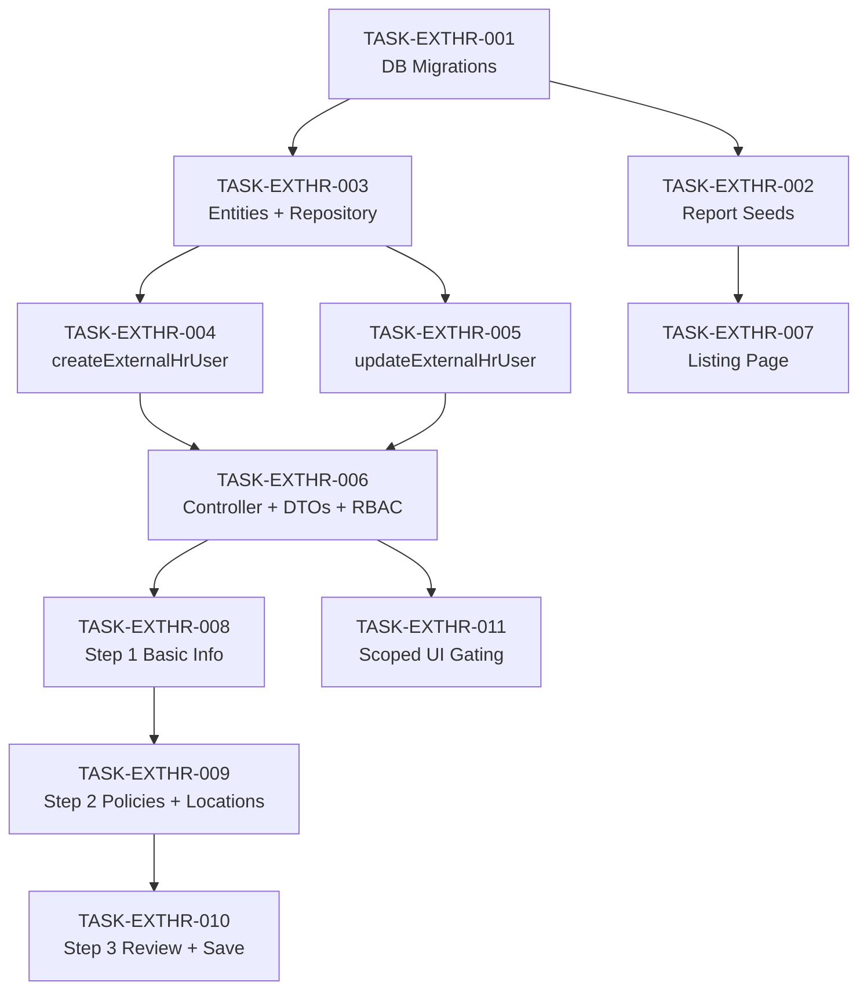

# Tasks: External HR User Management (EXTHR)

This document breaks down the [EXTHR TRD](trd.md) into sprint-ready tasks for the squad building the External HR role enhancement. It is the direct input for Stage 50 implementation sessions. Every task below is traceable to a user story in the [EXTHR PRD](prd.md) and to a specific section of the TRD. Backend tasks are sequenced first because the frontend depends on the API contracts being stable. Frontend tasks are written to begin in parallel once API contracts are confirmed — they do not need deployed APIs to build the UI shell and Step 1.

> ⚠️ **Approval gate:** The TRD carries 0 of 2 required sign-offs. Tasks are written and ready. Do not begin sprint execution until both TL and PTL sign the TRD approval block.

---

## Task Summary

| ID | Summary | Type | Pts | Assignee Role | Depends On |
|---|---|---|---|---|---|
| TASK-EXTHR-001 | DB migrations — both mapping tables | Task | 2 | Mid | — |
| TASK-EXTHR-002 | Report framework seeds — all 4 report keys | Task | 2 | Mid | TASK-EXTHR-001 |
| TASK-EXTHR-003 | TypeORM entities + repository layer | Task | 3 | Mid | TASK-EXTHR-001 |
| TASK-EXTHR-004 | `createExternalHrUser` service method | Story | 5 | Senior | TASK-EXTHR-003 |
| TASK-EXTHR-005 | `updateExternalHrUser` service method | Story | 3 | Mid | TASK-EXTHR-003 |
| TASK-EXTHR-006 | Controller endpoints + DTOs + RBAC guard | Task | 3 | Mid | TASK-EXTHR-004, TASK-EXTHR-005 |
| TASK-EXTHR-007 | External HR tab + listing page | Story | 3 | Mid | TASK-EXTHR-002 |
| TASK-EXTHR-008 | Multi-step routing + Step 1 Basic Info + company checkbox | Story | 5 | Senior | TASK-EXTHR-006 |
| TASK-EXTHR-009 | Step 2 — Policies & Locations checkbox lists | Story | 5 | Senior | TASK-EXTHR-008 |
| TASK-EXTHR-010 | Step 3 — Review & Save + success/error handling | Story | 3 | Mid | TASK-EXTHR-009 |
| TASK-EXTHR-011 | EXTERNAL_HR scoped UI gating | Story | 2 | Mid | TASK-EXTHR-006 |

**Total backend:** 6 tasks · 18 pts  
**Total frontend:** 5 tasks · 18 pts  
**Grand total:** 11 tasks · 36 pts

---

## Dependency Graph

The diagram below shows sequencing constraints. Tasks on the same horizontal level can start in parallel. The backend critical path ends at TASK-EXTHR-006 before the main frontend flow can begin. TASK-EXTHR-007 and TASK-EXTHR-011 can start earlier since they only need the report seeds and role constants respectively.



---

## Backend Tasks

---

#### TASK-EXTHR-001: DB migrations — both mapping tables

- **Type:** Task
- **Epic:** EXTHR — External HR Role Enhancement
- **Sprint:** Sprint 1
- **Points:** 2
- **Assignee:** Mid
- **Traces to:** [US-01](prd.md#us-01--create-external-hr-user) (infrastructure prerequisite)
- **Depends on:** none

- **Description:** Create the two new mapping tables defined in [TRD §3](trd.md#3-database). Both SQL files must run cleanly on an empty schema and be idempotent (`CREATE TABLE IF NOT EXISTS`). No `ON DELETE CASCADE` — FKs are plain referential constraints only; the application layer handles deletion ordering. Run both scripts in one migration session.

- **Decision budget:**
  - Junior can decide: index naming conventions, comment wording.
  - Escalate to TL: any schema change beyond what is specified in the TRD; whether to add `deleted_at` soft-delete column to the mapping tables.

- **Acceptance criteria:**
  - [ ] `external_hr_policy_map (id, user_id, policy_id, company_id, created_at, updated_at)` created with `SERIAL PRIMARY KEY`, all columns `NOT NULL` except none.
  - [ ] `external_hr_location_map (id, user_id, address_id, company_id, created_at, updated_at)` created with same pattern.
  - [ ] Both `user_id` FK constraints reference `users(user_id)` with **no** `ON DELETE CASCADE`.
  - [ ] Unique indexes: `(user_id, policy_id)` on policy map; `(user_id, address_id)` on location map.
  - [ ] Lookup indexes: `(user_id)` and `(company_id)` on both tables.
  - [ ] Scripts are idempotent — running twice produces no error and no duplicate objects.
  - [ ] `COMMENT ON TABLE` added to both tables.
  - [ ] Both scripts committed to `apps/services/ibp-service/src/app/hr-module/` with names `external-hr-policy-map-create.sql` and `external-hr-location-map-create.sql`.

- **Definition of Done:**
  - [ ] Jira ticket updated to Done
  - [ ] Scripts verified against a local PostgreSQL instance
  - [ ] PR reviewed and merged to module branch

---

#### TASK-EXTHR-002: Report framework seeds — all 4 report keys

- **Type:** Task
- **Epic:** EXTHR — External HR Role Enhancement
- **Sprint:** Sprint 1
- **Points:** 2
- **Assignee:** Mid
- **Traces to:** [US-01](prd.md#us-01--create-external-hr-user), [US-03](prd.md#us-03--view-external-hr-users)
- **Depends on:** TASK-EXTHR-001

- **Description:** Seed all four `admin_reports` rows, their `admin_reports_parameters` rows, and `admin_reports_results_mappings` rows as specified in [TRD §4](trd.md#4-report-framework-seeds) and the ready-to-run seed script in [TRD §6](trd.md#6-report-framework-seed-sql). All four keys — `external_hr_company_policies`, `external_hr_company_locations`, `external_hr_user_list`, `external_hr_user_detail` — must be inserted in one atomic script using `ON CONFLICT (name) DO UPDATE` so the script is re-runnable. Confirm with DBA that `admin_reports.name` has a unique constraint before running (Open Question 1 in TRD).

- **Decision budget:**
  - Junior can decide: `order_no` values (use 100–103 as specified); `created_by`/`updated_by` default of `1`.
  - Escalate to TL: if `admin_reports` lacks a unique constraint on `name` — do not modify the schema; escalate and wait.
  - Escalate to TL: if the policy table name is not `admin_policy` or the location join path differs (Open Questions 2 and 3 in TRD).

- **Acceptance criteria:**
  - [ ] All four `admin_reports` rows inserted with correct `name`, `label`, `end_point`, and SQL bodies including `###placeholder###` tokens.
  - [ ] `###companyId###` parameter row exists for `external_hr_company_policies` and `external_hr_company_locations`.
  - [ ] `###companyId###` and `###search###` parameter rows exist for `external_hr_user_list`.
  - [ ] `###userId###` parameter row exists for `external_hr_user_detail`.
  - [ ] `admin_reports_results_mappings` rows populated for all four keys matching the `source_key → display_key` tables in [TRD §4](trd.md#4-report-framework-seeds).
  - [ ] Script is idempotent — `ON CONFLICT DO UPDATE` / `ON CONFLICT DO NOTHING` used throughout.
  - [ ] `POST /hr-module/generate/external_hr_company_policies` returns a policy list for a known company after seeding.
  - [ ] `POST /hr-module/generate/external_hr_company_locations` returns `[]` for a company with no locations without error.

- **Definition of Done:**
  - [ ] Jira ticket updated to Done
  - [ ] Seed script verified on local DB
  - [ ] PR reviewed and merged to module branch

---

#### TASK-EXTHR-003: TypeORM entities + repository layer

- **Type:** Task
- **Epic:** EXTHR — External HR Role Enhancement
- **Sprint:** Sprint 1
- **Points:** 3
- **Assignee:** Mid
- **Traces to:** [US-01](prd.md#us-01--create-external-hr-user), [US-02](prd.md#us-02--update-external-hr-user)
- **Depends on:** TASK-EXTHR-001

- **Description:** Create two TypeORM entity classes and add all repository methods required by the service layer. Entities follow the pattern in [TRD §3.3](trd.md#33-typeorm-entity-externalhrpolicymap) and [§3.4](trd.md#34-typeorm-entity-externahrlocationmap). Repository methods follow [TRD §5.4](trd.md#54-repository-methods). Extend the existing `HrRepository` — do not create a new repository class. Register both entities in the module's TypeORM `forFeature` array.

- **Decision budget:**
  - Junior can decide: import paths, TypeORM decorator choices (`@Column` options), exact error message wording in repo methods.
  - Escalate to TL: if the existing `User` entity path or `HrUserManagement` entity path differs from what is assumed in [TRD §5.3](trd.md#53-service-methods) — do not guess, escalate.

- **Acceptance criteria:**
  - [ ] `ExternalHrPolicyMap` entity created at `apps/services/ibp-service/src/app/hr-module/entities/external-hr-policy-map.entity.ts` with `id`, `userId`, `policyId`, `companyId`, `createdAt`, `updatedAt` columns.
  - [ ] `ExternalHrLocationMap` entity created at `apps/services/ibp-service/src/app/hr-module/entities/external-hr-location-map.entity.ts` with `id`, `userId`, `addressId`, `companyId`, `createdAt`, `updatedAt` columns.
  - [ ] Both entities registered in the module's `TypeOrmModule.forFeature([...])` array.
  - [ ] `findExternalHrByEmailAndCompany(email, companyId)` — queries `hr_user_management` where `email_id`, `role_key = 'EXTERNAL_HR'`, `company_id`, `deleted_at IS NULL`.
  - [ ] `findUserByEmail(email)` — queries `users` where `email_id`, `deleted_at IS NULL`.
  - [ ] `createUser(data)` — inserts into `users`, returns saved entity.
  - [ ] `createHrUserManagement(data)` — inserts into `hr_user_management`, returns saved entity.
  - [ ] `findHrManagementByUserId(userId)` — queries `hr_user_management` where `user_id`, `deleted_at IS NULL`.
  - [ ] `updateHrUserManagement(id, data)` — updates the row and sets `updated_at = NOW()`.
  - [ ] `insertExternalHrPolicyMappings(userId, companyId, policyIds[])` — bulk insert using query builder with `.orIgnore()` to handle unique index conflicts.
  - [ ] `deleteExternalHrPolicyMappings(userId)` — deletes all rows for `user_id` from `external_hr_policy_map`.
  - [ ] `insertExternalHrLocationMappings(userId, companyId, addressIds[])` — same bulk insert pattern.
  - [ ] `deleteExternalHrLocationMappings(userId)` — deletes all rows for `user_id` from `external_hr_location_map`.
  - [ ] All repository methods have unit tests with mocked TypeORM repositories.

- **Definition of Done:**
  - [ ] Jira ticket updated to Done
  - [ ] Unit tests passing
  - [ ] PR reviewed and merged to module branch

---

#### TASK-EXTHR-004: `createExternalHrUser` service method

- **Type:** Story
- **Epic:** EXTHR — External HR Role Enhancement
- **Sprint:** Sprint 1
- **Points:** 5
- **Assignee:** Senior
- **Traces to:** [US-01](prd.md#us-01--create-external-hr-user)
- **Depends on:** TASK-EXTHR-003

- **Description:** Implement `createExternalHrUser(dto)` in `HrService` following the full decision tree in [TRD §7.1](trd.md#71-create-external-hr-user). This is the core transactional flow: duplicate check → find-or-create user row in `users` table → insert `hr_user_management` row → insert policy mappings → conditionally insert location mappings. The `users` table insertion is mandatory — every External HR user must exist in `users` regardless of whether they were already present. The service does not wrap operations in a DB transaction by default; see Open Question 4 in TRD — escalate if instructed to add transaction wrapping.

- **Decision budget:**
  - Junior can decide: exact success log message wording, whether to `console.log` intermediate steps.
  - Escalate to TL: adding `QueryRunner` / DB transaction wrapping (Open Question 4); behavior if `createUser` succeeds but `createHrUserManagement` fails; any deviation from the exact steps below.

- **Acceptance criteria:**

  **Duplicate check:**
  - [ ] If `findExternalHrByEmailAndCompany(email, companyId)` returns a row → throw `ConflictException` with message `"An External HR user with this email already exists for this company."` — return 409 to caller. No rows are written.

  **User table (the core case):**
  - [ ] If `findUserByEmail(email)` returns `null` → call `createUser({ name: firstName + ' ' + lastName, email_id: email.toLowerCase().trim(), first_name: firstName, last_name: lastName })` → use the returned `user.user_id` for all subsequent inserts.
  - [ ] If `findUserByEmail(email)` returns an existing user → reuse `existingUser.user_id` without inserting a new row.
  - [ ] In both cases, the `user_id` used in `hr_user_management`, `external_hr_policy_map`, and `external_hr_location_map` must be the same value.

  **HR management record:**
  - [ ] Call `createHrUserManagement({ user_id, user_name: firstName + ' ' + lastName, email_id: email.toLowerCase().trim(), role_key: 'EXTERNAL_HR', company_id: companyId })`.
  - [ ] The resulting `hrRecord.id` is returned in the response as `hrManagementId`.

  **Policy mappings:**
  - [ ] Call `insertExternalHrPolicyMappings(userId, companyId, policyIds)` — inserts one row per policy ID into `external_hr_policy_map`. ON CONFLICT DO NOTHING if a mapping already exists.
  - [ ] `policyIds` must be non-empty (enforced by DTO); service does not need to re-validate.

  **Location mappings:**
  - [ ] If `dto.locationIds` is provided and `dto.locationIds.length > 0` → call `insertExternalHrLocationMappings(userId, companyId, locationIds)`.
  - [ ] If `dto.locationIds` is undefined, null, or empty array → skip location insert. No error is thrown.

  **Return value:**
  - [ ] Return `{ userId: user.user_id, hrManagementId: hrRecord.id }`.

  **Unit tests:**
  - [ ] Test: duplicate email + company → `ConflictException` thrown, no DB writes after the check.
  - [ ] Test: email not in `users` → `createUser` called; `user_id` from new user used throughout.
  - [ ] Test: email already in `users` → `createUser` not called; existing `user_id` used.
  - [ ] Test: locationIds omitted → `insertExternalHrLocationMappings` not called.
  - [ ] Test: locationIds = [] → `insertExternalHrLocationMappings` not called.
  - [ ] Test: locationIds = [11276, 11277] → `insertExternalHrLocationMappings` called once with correct args.

- **Definition of Done:**
  - [ ] Jira ticket updated to Done
  - [ ] All six unit tests passing
  - [ ] PR reviewed and merged to module branch

---

#### TASK-EXTHR-005: `updateExternalHrUser` service method

- **Type:** Story
- **Epic:** EXTHR — External HR Role Enhancement
- **Sprint:** Sprint 1
- **Points:** 3
- **Assignee:** Mid
- **Traces to:** [US-02](prd.md#us-02--update-external-hr-user)
- **Depends on:** TASK-EXTHR-003

- **Description:** Implement `updateExternalHrUser(userId, dto)` in `HrService` following [TRD §5.3](trd.md#53-service-methods). The update uses a replace strategy for mappings: delete all existing policy rows, insert new ones; delete all existing location rows, insert new ones. The `users` table is not updated (name/email changes are out of scope for this iteration). Only `hr_user_management` core fields (user_name, status) are updated.

- **Decision budget:**
  - Junior can decide: whether to skip `updateHrUserManagement` call if neither `firstName`/`lastName` nor `status` is provided in the DTO.
  - Escalate to TL: if the replace strategy should be transactional (see Open Question 4); any request to update the `users` table in this flow.

- **Acceptance criteria:**
  - [ ] If `findHrManagementByUserId(userId)` returns `null` or a row with `role_key !== 'EXTERNAL_HR'` → throw `NotFoundException` with message `"External HR user not found."` — return 404.
  - [ ] If `dto.firstName` and `dto.lastName` both provided → call `updateHrUserManagement(hrRecord.id, { user_name: firstName + ' ' + lastName })`.
  - [ ] If `dto.status` provided → include `role_key: dto.status` in the update payload (note: `role_key` stores the status value per existing schema).
  - [ ] `updated_at` must be set to `NOW()` on every `updateHrUserManagement` call.
  - [ ] If `dto.policyIds` is provided (any array including empty): call `deleteExternalHrPolicyMappings(userId)` first, then `insertExternalHrPolicyMappings` if `policyIds.length > 0`.
  - [ ] If `dto.policyIds` is `undefined` (field absent in request body): skip policy replace entirely — do not delete existing mappings.
  - [ ] Same conditional replace logic applies to `dto.locationIds`.
  - [ ] Return `{ userId }`.

  **Unit tests:**
  - [ ] Test: userId not found → `NotFoundException` thrown.
  - [ ] Test: policyIds = [45] → delete then insert called in order.
  - [ ] Test: policyIds = [] → delete called, insert not called.
  - [ ] Test: policyIds undefined → neither delete nor insert called.
  - [ ] Test: status = 'INACTIVE' → `updateHrUserManagement` called with correct payload.

- **Definition of Done:**
  - [ ] Jira ticket updated to Done
  - [ ] All five unit tests passing
  - [ ] PR reviewed and merged to module branch

---

#### TASK-EXTHR-006: Controller endpoints + DTOs + RBAC guard

- **Type:** Task
- **Epic:** EXTHR — External HR Role Enhancement
- **Sprint:** Sprint 2
- **Points:** 3
- **Assignee:** Mid
- **Traces to:** [US-01](prd.md#us-01--create-external-hr-user), [US-02](prd.md#us-02--update-external-hr-user)
- **Depends on:** TASK-EXTHR-004, TASK-EXTHR-005

- **Description:** Add two HTTP handlers to the existing `HrController` and create the `CreateExternalHrDto` and `UpdateExternalHrDto` DTOs as specified in [TRD §5.1](trd.md#51-dtos) and [§5.2](trd.md#52-controller-methods). Add RBAC guard enforcement: both endpoints must require `HR_ADMIN` role. Use the existing auth guard if it supports per-endpoint role checks; if not, create a minimal `HrAdminGuard` and escalate the architecture decision. Apply `@UsePipes(new ValidationPipe({ whitelist: true }))` to both handlers. Follow the existing controller pattern (`@Res()`, `createResponse`, `createErrorResponse`).

- **Decision budget:**
  - Junior can decide: exact error message strings, HTTP status code mapping for `ConflictException` (should be 409).
  - Escalate to TL: whether to create a new `HrAdminGuard` or extend the existing guard (Open Question 5 in TRD); any change to how the existing auth guard is wired.

- **Acceptance criteria:**
  - [ ] `POST /hr-module/external-hr` handler calls `hrService.createExternalHrUser(body)` and returns 201 on success.
  - [ ] `PUT /hr-module/external-hr/:userId` handler calls `hrService.updateExternalHrUser(userId, body)` and returns 200 on success.
  - [ ] `CreateExternalHrDto` validates: `firstName` (string, required), `lastName` (string, required), `email` (valid email, required), `status` (enum ACTIVE|INACTIVE, required), `companyId` (int, required), `policyIds` (non-empty int array, required), `locationIds` (optional int array).
  - [ ] `UpdateExternalHrDto` extends `PartialType(OmitType(CreateExternalHrDto, ['email']))` — email cannot be updated.
  - [ ] Both endpoints return 403 when called by a non-`HR_ADMIN` user.
  - [ ] Both endpoints return 401 when called without authentication.
  - [ ] `ConflictException` from the service surfaces as HTTP 409.
  - [ ] `NotFoundException` from the service surfaces as HTTP 404.
  - [ ] `POST /hr-module/external-hr` with missing `policyIds` returns 400 with validation error.
  - [ ] `POST /hr-module/external-hr` with invalid email format returns 400.

- **Definition of Done:**
  - [ ] Jira ticket updated to Done
  - [ ] E2E tests covering the cases above passing
  - [ ] PR reviewed and merged to module branch

---

## Frontend Tasks

---

#### TASK-EXTHR-007: External HR tab + listing page

- **Type:** Story
- **Epic:** EXTHR — External HR Role Enhancement
- **Sprint:** Sprint 2
- **Points:** 3
- **Assignee:** Mid
- **Traces to:** [US-03](prd.md#us-03--view-external-hr-users)
- **Depends on:** TASK-EXTHR-002

- **Description:** Add an "External HR" tab to the existing HR User Management screen. The tab renders a paginated table bound to the `external_hr_user_list` report key via `POST /hr-module/generate/external_hr_user_list`. Columns: Full Name, Email, Status, Company, Policy Count, Created Date. Supports free-text search (bound to `###search###`) and pagination. Clicking a row navigates to the Edit External HR page (route to be wired in TASK-EXTHR-008).

- **Decision budget:**
  - Junior can decide: column widths, date format, empty-state illustration choice.
  - Escalate to TL: any change to the existing HR User Management tab layout that could affect other role tabs.

- **Acceptance criteria:**
  - [ ] "External HR" tab visible on the HR User Management screen; selecting it does not break existing tab content.
  - [ ] Table calls `POST /hr-module/generate/external_hr_user_list` with `companyId` from the current HR admin's context on load.
  - [ ] Table renders columns: Full Name, Email, Status, Company, Policy Count, Created Date.
  - [ ] Search input debounces and passes `search` param; clearing search re-fetches without filter.
  - [ ] Pagination controls work: changing page/limit triggers a new API call with correct `page` and `limit` query params.
  - [ ] A "Create External HR User" button navigates to the create page (route stub acceptable if TASK-EXTHR-008 is not yet merged).
  - [ ] Empty state shown when `count = 0`.
  - [ ] Table shows loading skeleton while fetching.

- **Definition of Done:**
  - [ ] Jira ticket updated to Done
  - [ ] Renders correctly on latest Chrome/Firefox
  - [ ] PR reviewed and merged to module branch

---

#### TASK-EXTHR-008: Multi-step routing + Step 1 Basic Info + company checkbox

- **Type:** Story
- **Epic:** EXTHR — External HR Role Enhancement
- **Sprint:** Sprint 2
- **Points:** 5
- **Assignee:** Senior
- **Traces to:** [US-01](prd.md#us-01--create-external-hr-user)
- **Depends on:** TASK-EXTHR-006

- **Description:** Build the multi-step page routing and Step 1. The creation flow is a dedicated full page — no drawers or modals. Route: `/hr-module/external-hr/create` for new users; `/hr-module/external-hr/:userId/edit` for existing. The page carries step state locally (not in the URL). A step indicator and breadcrumb are always visible. Step 1 collects Basic Info and company selection. Company is selected via a checkbox list with "Select All". When the admin clicks "Next" on Step 1, company selection is locked and Step 2 mounts (TASK-EXTHR-009).

  For the edit flow, on page load: call `POST /hr-module/generate/external_hr_user_detail` with `userId` to pre-fill all fields. The company selection is locked in edit mode (company cannot be changed once a user is created).

- **Decision budget:**
  - Junior can decide: step indicator component choice, breadcrumb label text, loading spinner style.
  - Escalate to TL: whether company can be changed on edit (current spec: locked — do not change without TL approval); routing library approach if it differs from what the rest of the app uses.

- **Acceptance criteria:**
  - [ ] Route `/hr-module/external-hr/create` renders the multi-step page with Step 1 active.
  - [ ] Route `/hr-module/external-hr/:userId/edit` renders the page with all fields pre-filled from `external_hr_user_detail` response.
  - [ ] Step indicator shows Step 1 / Step 2 / Step 3 at all times; current step is highlighted.
  - [ ] Breadcrumb: `HR User Management > External HR > Create` (or `Edit`).
  - [ ] Step 1 fields: First Name (required), Last Name (required), Email (required, email format; disabled on edit), Status (dropdown: Active/Inactive, required).
  - [ ] Company section renders as a checkbox list. Each item shows the company name and checkbox.
  - [ ] "Select All" checkbox above the list: checking it checks every company; unchecking it clears all. Individual check/uncheck updates "Select All" state automatically.
  - [ ] "Next" button is disabled until all required fields are valid and at least one company is selected.
  - [ ] Clicking "Next" locks company selection and mounts Step 2.
  - [ ] "Back" from any later step returns to Step 1 with all entered data intact.
  - [ ] In edit mode, company checkbox is rendered as read-only (visually disabled, value pre-filled).

- **Definition of Done:**
  - [ ] Jira ticket updated to Done
  - [ ] Renders correctly in create and edit flows
  - [ ] PR reviewed and merged to module branch

---

#### TASK-EXTHR-009: Step 2 — Policies & Locations checkbox lists

- **Type:** Story
- **Epic:** EXTHR — External HR Role Enhancement
- **Sprint:** Sprint 2
- **Points:** 5
- **Assignee:** Senior
- **Traces to:** [US-01](prd.md#us-01--create-external-hr-user)
- **Depends on:** TASK-EXTHR-008

- **Description:** Build Step 2 of the multi-step page. When Step 2 mounts, fire two parallel calls — `POST /hr-module/generate/external_hr_company_policies { companyId }` and `POST /hr-module/generate/external_hr_company_locations { companyId }` — to populate the policy and location checkbox lists. Both lists follow the checkbox + "Select All" pattern established in Step 1. See [PRD §9.2](prd.md#92-multi-step-page-flow) and [TRD §7.2](trd.md#72-step-2--load-policies-and-locations).

- **Decision budget:**
  - Junior can decide: skeleton list item count while loading, whether to show policy count badge.
  - Escalate to TL: if one of the parallel API calls fails — should the step show an error or degrade gracefully with an empty list.

- **Acceptance criteria:**
  - [ ] On Step 2 mount: both `external_hr_company_policies` and `external_hr_company_locations` are called in parallel for the locked company.
  - [ ] Both lists show a skeleton loader while fetching. The "Next" button is hidden/disabled until both calls complete.
  - [ ] **Policies section:** Checkbox list with "Select All" at top. Checking "Select All" selects all policies; unchecking it deselects all. Individual deselection updates "Select All" to indeterminate/unchecked. At least one policy must be selected to advance to Step 3.
  - [ ] **Locations section:** Checkbox list with "Select All" at top — same toggle behavior as policies.
  - [ ] If locations API returns an empty array: show `"No locations configured for this company."` message below the section title. "Select All" and the list are hidden. Step 3 can be reached with no locations selected.
  - [ ] In edit mode: policy and location checkboxes are pre-checked based on `policies` and `locations` arrays from `external_hr_user_detail` response (matched by `policyId` / `addressId`).
  - [ ] "Next" advances to Step 3 only if at least one policy is checked.
  - [ ] "Back" returns to Step 1 without losing policy/location selections.

- **Definition of Done:**
  - [ ] Jira ticket updated to Done
  - [ ] Tested with company that has locations and one that has none
  - [ ] PR reviewed and merged to module branch

---

#### TASK-EXTHR-010: Step 3 — Review & Save + success/error handling

- **Type:** Story
- **Epic:** EXTHR — External HR Role Enhancement
- **Sprint:** Sprint 3
- **Points:** 3
- **Assignee:** Mid
- **Traces to:** [US-01](prd.md#us-01--create-external-hr-user), [US-02](prd.md#us-02--update-external-hr-user)
- **Depends on:** TASK-EXTHR-009

- **Description:** Build Step 3 — the read-only review summary and the final save action. On "Save", the frontend calls `POST /hr-module/external-hr` (create) or `PUT /hr-module/external-hr/:userId` (edit) with the assembled DTO. Handle success and error responses per [PRD §9.2 Step 3](prd.md#step-3--review--save).

- **Decision budget:**
  - Junior can decide: layout of the review card, whether to collapse long policy/location lists with a "Show more" toggle.
  - Escalate to TL: any retry logic on network failure; whether to clear step state after redirect.

- **Acceptance criteria:**
  - [ ] Step 3 shows read-only summary: Full Name, Email, Status, Company Name, list of selected policy names, list of selected location `address1` values (or "None selected" if empty).
  - [ ] "Back" button returns to Step 2 with selections intact.
  - [ ] "Save" button calls `POST /hr-module/external-hr` on create, `PUT /hr-module/external-hr/:userId` on edit, with the correctly assembled body: `{ firstName, lastName, email, status, companyId, policyIds: number[], locationIds: number[] }`.
  - [ ] While the save call is in flight, "Save" button shows a loading state and is disabled to prevent double-submit.
  - [ ] On 201/200 success: redirect to the External HR listing tab with a success toast `"External HR user created/updated successfully."`.
  - [ ] On 409 conflict: stay on Step 3, show inline error `"An External HR user with this email already exists for this company."`.
  - [ ] On 400 validation error: show the API error message inline on Step 3.
  - [ ] On any other error: show generic error `"Something went wrong. Please try again."`.

- **Definition of Done:**
  - [ ] Jira ticket updated to Done
  - [ ] Happy path (create + edit) tested manually
  - [ ] 409 and 400 error cases tested manually
  - [ ] PR reviewed and merged to module branch

---

#### TASK-EXTHR-011: EXTERNAL_HR scoped UI gating

- **Type:** Story
- **Epic:** EXTHR — External HR Role Enhancement
- **Sprint:** Sprint 3
- **Points:** 2
- **Assignee:** Mid
- **Traces to:** [US-04](prd.md#us-04--scoped-access-for-external-hr-users)
- **Depends on:** TASK-EXTHR-006

- **Description:** Apply UI-level role gating for the `EXTERNAL_HR` role. When the logged-in user's `role_key` is `EXTERNAL_HR`, hide admin navigation items and ensure data-fetch calls pass the `user_id` scope filter where required. See [PRD §7.3](prd.md#73-ui-gating) and [PRD §9.3](prd.md#93-role-based-ui-for-external_hr-users).

- **Decision budget:**
  - Junior can decide: exact component/hook used to read `role_key` from session; whether to use a route guard or conditional render for nav hiding.
  - Escalate to TL: if scoped filtering requires a change to an existing shared API call (not just adding a param to a new call); any change to the auth session shape.

- **Acceptance criteria:**
  - [ ] When `role_key === 'EXTERNAL_HR'`: the navigation items Policy Configuration, Endorsements, Insurer Management, and HR User Management are hidden (not just disabled — fully absent from the DOM).
  - [ ] When `role_key === 'EXTERNAL_HR'`: Dashboard, Employee List, Claims, and Policy List are visible and scoped.
  - [ ] When `role_key !== 'EXTERNAL_HR'`: no existing navigation item is affected.
  - [ ] The role check reads from the session/auth store — it is not derived from a URL pattern.
  - [ ] Manual test: log in as an `EXTERNAL_HR` user, confirm hidden nav; log in as `HR_ADMIN`, confirm all nav items are present.

- **Definition of Done:**
  - [ ] Jira ticket updated to Done
  - [ ] Tested with both `EXTERNAL_HR` and `HR_ADMIN` test accounts
  - [ ] PR reviewed and merged to module branch

---

## Parallel Work Plan

The table below shows what can run concurrently within each sprint.

**Sprint 1 — Backend foundation**

| Parallel track | Tasks |
|---|---|
| Track A | TASK-EXTHR-001 → TASK-EXTHR-003 → TASK-EXTHR-004 |
| Track B | TASK-EXTHR-001 → TASK-EXTHR-002 |
| Track C | TASK-EXTHR-001 → TASK-EXTHR-003 → TASK-EXTHR-005 |

Tracks B and C run alongside Track A. TASK-EXTHR-004 and TASK-EXTHR-005 both unblock once TASK-EXTHR-003 is merged.

**Sprint 2 — Controller + Frontend shell**

| Parallel track | Tasks |
|---|---|
| Track A | TASK-EXTHR-006 (finishes backend critical path) |
| Track B | TASK-EXTHR-007 (listing page, only needs seeds from Sprint 1) |
| Track C | TASK-EXTHR-011 (scoped UI, only needs role constant — can start in parallel with TASK-EXTHR-006) |
| Track D | TASK-EXTHR-008 (Step 1 — depends on TASK-EXTHR-006 being merged first) |

**Sprint 3 — Steps 2 and 3**

| Parallel track | Tasks |
|---|---|
| Track A | TASK-EXTHR-009 → TASK-EXTHR-010 |

Step 2 and Step 3 are sequential; no parallelism available within this sprint.

---

## Open Questions

These must be resolved before sprint execution begins. They are sourced from [TRD §12](trd.md#12-open-questions).

| # | Question | Blocks | Owner | Due |
|---|---|---|---|---|
| 1 | Does `admin_reports` have a unique constraint on `name`? Seed SQL uses `ON CONFLICT (name)`. | TASK-EXTHR-002 | DBA | Before Sprint 1 |
| 2 | Policy table name: is it `admin_policy.policy_name` or a different table/column? | TASK-EXTHR-002 | Backend | Before Sprint 1 |
| 3 | Does `company_policy_configuration_location` have a direct `company_id` column, or does it join via `admin_policy`? | TASK-EXTHR-002 | DBA | Before Sprint 1 |
| 4 | Should `createExternalHrUser` and `updateExternalHrUser` be wrapped in a DB transaction? Partial failures (user row created, HR row insert fails) are currently unhandled. | TASK-EXTHR-004, TASK-EXTHR-005 | Backend Tech Lead | Before Sprint 1 |
| 5 | Is the existing auth guard injectable per endpoint (`@UseGuards`), or does a new `HrAdminGuard` need to be created? | TASK-EXTHR-006 | Backend | Before Sprint 2 |

---

## Approval

```
Approved by:
Role:
Date:

Approved by:
Role:
Date:
```

---

*EXTHR Tasks — External HR User Management — ibp-service — May 2026*
