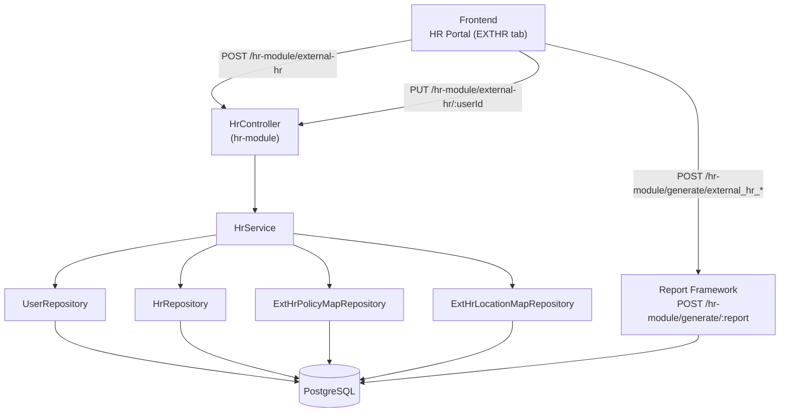
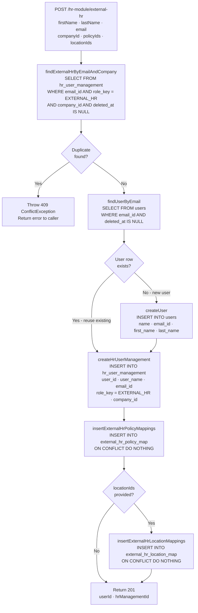
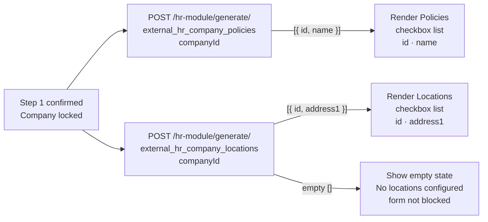
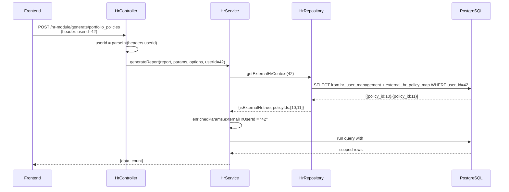

# TRD: External HR User Management (EXTHR)

**Module:** EXTHR — External HR Role Enhancement  
**Parent Module:** HR User Management  
**Version:** 1.0  
**Status:** Draft  
**Date:** 2026-05-13

---

## 1. Scope

**In scope:**

- Database migrations: `external_hr_policy_map` and `external_hr_location_map` tables.
- Two custom HTTP endpoints: `POST /hr-module/external-hr` (create) and `PUT /hr-module/external-hr/:userId` (update).
- Four report framework seeds for data-fetch operations via `POST /hr-module/generate/:report`.
- `admin_reports`, `admin_reports_parameters`, and `admin_reports_results_mappings` rows for each report key.
- Backend service method for transactional user + mapping creation.
- RBAC enforcement (`HR_ADMIN` guard on write endpoints; scoped data for `EXTERNAL_HR` role).

**Out of scope:**

- Email invite / onboarding flow for new External HR users.
- Frontend component implementation (UI spec is in the PRD).
- Authentication changes (login/session): JWT role ID fix and 2FA phone OTP fix for EXTERNAL_HR are covered in auth-service and ibp-service (see §10b).
- Encryption of `EXTERNAL_HR` user PII at rest (follows existing `user` table convention).

---

## 2. Architecture Overview

The EXTHR feature adds a thin write layer (two endpoints) on top of the existing HR module and extends the report framework with four new report keys. No new service or controller is introduced — the feature extends `HrController` and `HrService` with two new handler methods and seeds four new `admin_reports` rows.



---

## 3. Database

### 3.1 Migration: `external_hr_policy_map`

```sql
-- File: external-hr-policy-map-create.sql
-- NOTE: user_id is nullable (External HR users are detached from the users table).
-- Joins use hr_management_id, not user_id.

CREATE TABLE IF NOT EXISTS external_hr_policy_map (
  id               SERIAL        PRIMARY KEY,
  hr_management_id INTEGER       NOT NULL REFERENCES hr_user_management(id) ON DELETE CASCADE,
  user_id          INTEGER,      -- nullable; NULL for detached External HR users
  policy_id        INTEGER       NOT NULL,
  company_id       INTEGER       NOT NULL,
  created_at       TIMESTAMPTZ   NOT NULL DEFAULT NOW(),
  updated_at       TIMESTAMPTZ   NOT NULL DEFAULT NOW()
);

CREATE UNIQUE INDEX IF NOT EXISTS uq_ext_hr_policy_map_hr_mgmt_policy
  ON external_hr_policy_map (hr_management_id, policy_id);

CREATE INDEX IF NOT EXISTS idx_ext_hr_policy_map_hr_management_id
  ON external_hr_policy_map (hr_management_id);

CREATE INDEX IF NOT EXISTS idx_ext_hr_policy_map_company_id
  ON external_hr_policy_map (company_id);

COMMENT ON TABLE external_hr_policy_map IS
  'Maps EXTERNAL_HR users (via hr_management_id) to the specific policies they are permitted to access.';
```

### 3.2 Migration: `external_hr_location_map`

```sql
-- File: external-hr-location-map-create.sql
-- NOTE: user_id is nullable. Joins use hr_management_id.

CREATE TABLE IF NOT EXISTS external_hr_location_map (
  id               SERIAL        PRIMARY KEY,
  hr_management_id INTEGER       NOT NULL REFERENCES hr_user_management(id) ON DELETE CASCADE,
  user_id          INTEGER,      -- nullable; NULL for detached External HR users
  address_id       INTEGER       NOT NULL,
  company_id       INTEGER       NOT NULL,
  created_at       TIMESTAMPTZ   NOT NULL DEFAULT NOW(),
  updated_at       TIMESTAMPTZ   NOT NULL DEFAULT NOW()
);

CREATE UNIQUE INDEX IF NOT EXISTS uq_ext_hr_location_map_hr_mgmt_address
  ON external_hr_location_map (hr_management_id, address_id);

CREATE INDEX IF NOT EXISTS idx_ext_hr_location_map_hr_management_id
  ON external_hr_location_map (hr_management_id);

CREATE INDEX IF NOT EXISTS idx_ext_hr_location_map_company_id
  ON external_hr_location_map (company_id);

COMMENT ON TABLE external_hr_location_map IS
  'Maps EXTERNAL_HR users (via hr_management_id) to specific company locations they can access.';
```

### 3.3 TypeORM Entity: `ExternalHrPolicyMap`

**File:** `apps/services/ibp-service/src/app/hr-module/entities/external-hr-policy-map.entity.ts`

```typescript
import { Entity, PrimaryGeneratedColumn, Column, CreateDateColumn, UpdateDateColumn, ManyToOne, JoinColumn } from 'typeorm';
import { User } from '../../user/user.entity';

@Entity('external_hr_policy_map')
export class ExternalHrPolicyMap {
  @PrimaryGeneratedColumn()
  id: number;

  @Column({ name: 'user_id' })
  userId: number;

  @Column({ name: 'policy_id' })
  policyId: number;

  @Column({ name: 'company_id' })
  companyId: number;

  @CreateDateColumn({ name: 'created_at' })
  createdAt: Date;

  @UpdateDateColumn({ name: 'updated_at' })
  updatedAt: Date;
}
```

### 3.4 TypeORM Entity: `ExternalHrLocationMap`

**File:** `apps/services/ibp-service/src/app/hr-module/entities/external-hr-location-map.entity.ts`

```typescript
import { Entity, PrimaryGeneratedColumn, Column, CreateDateColumn, UpdateDateColumn } from 'typeorm';

@Entity('external_hr_location_map')
export class ExternalHrLocationMap {
  @PrimaryGeneratedColumn()
  id: number;

  @Column({ name: 'user_id' })
  userId: number;

  @Column({ name: 'address_id' })
  addressId: number;

  @Column({ name: 'company_id' })
  companyId: number;

  @CreateDateColumn({ name: 'created_at' })
  createdAt: Date;

  @UpdateDateColumn({ name: 'updated_at' })
  updatedAt: Date;
}
```

---

## 4. Report Framework Seeds

All four report keys use `POST /hr-module/generate/:report`. SQL uses `###placeholder###` token substitution.

### 4.1 Report Key: `external_hr_company_policies`

**Purpose:** Returns active policies for a given company. Used to populate the Assigned Policies checkbox list on Step 2 of the create/edit page flow.

**`admin_reports` row:**

| Column | Value |
|---|---|
| `name` | `external_hr_company_policies` |
| `label` | `External HR – Company Policies` |
| `end_point` | `external_hr_company_policies` |

**SQL:**

```sql
SELECT
  ap.id,
  ap.policy_name AS name
FROM admin_policy ap
WHERE ap.company_id = ###companyId###
ORDER BY ap.policy_name ASC
```

**`admin_reports_parameters` rows:**

| `query_parameter` | `parameter_value` | Notes |
|---|---|---|
| `###companyId###` | `NULL` | Required; must be supplied by caller |

**`admin_reports_results_mappings` rows:**

| `source_key` | `display_key` |
|---|---|
| `id` | `id` |
| `name` | `name` |

---

### 4.2 Report Key: `external_hr_company_locations`

**Purpose:** Returns company locations for a given company. Used to populate the Locations checkbox list on Step 2 of the create/edit page flow.

**`admin_reports` row:**

| Column | Value |
|---|---|
| `name` | `external_hr_company_locations` |
| `label` | `External HR – Company Locations` |
| `end_point` | `external_hr_company_locations` |

**SQL:**

```sql
SELECT
  a.id,
  a.address1
FROM company_policy_configuration_location cpcl
JOIN address a ON a.id = cpcl.address_id
WHERE cpcl.company_id = ###companyId###
  AND a.deleted_at IS NULL
ORDER BY a.address1 ASC
```

**`admin_reports_parameters` rows:**

| `query_parameter` | `parameter_value` | Notes |
|---|---|---|
| `###companyId###` | `NULL` | Required |

**`admin_reports_results_mappings` rows:**

| `source_key` | `display_key` |
|---|---|
| `id` | `id` |
| `address1` | `address1` |

---

### 4.3 Report Key: `external_hr_user_list`

**Purpose:** Paginated list of External HR users for a company. Supports search and pagination.

**`admin_reports` row:**

| Column | Value |
|---|---|
| `name` | `external_hr_user_list` |
| `label` | `External HR – User List` |
| `end_point` | `external_hr_user_list` |

**SQL:**

```sql
SELECT
  hum.id          AS hr_management_id,
  hum.user_id     AS user_id,
  hum.user_name   AS full_name,
  hum.email_id    AS email,
  hum.role_key    AS role_key,
  hum.company_name,
  hum.company_id,
  COUNT(DISTINCT epm.policy_id) AS policy_count,
  hum.created_at
FROM hr_user_management hum
LEFT JOIN external_hr_policy_map epm ON epm.hr_management_id = hum.id
WHERE hum.role_key = 'EXTERNAL_HR'
  AND hum.deleted_at IS NULL
  AND hum.company_id = ###companyId###
  AND (###search### IS NULL
       OR hum.user_name ILIKE '%' || ###search### || '%'
       OR hum.email_id  ILIKE '%' || ###search### || '%')
GROUP BY hum.id, hum.user_id, hum.user_name, hum.email_id, hum.role_key,
         hum.company_name, hum.company_id, hum.created_at
ORDER BY hum.created_at DESC
```

Note: `JOIN users` removed — External HR users may not have a `users` row. `epm` join uses `hr_management_id`.

**`admin_reports_parameters` rows:**

| `query_parameter` | `parameter_value` | Notes |
|---|---|---|
| `###companyId###` | `NULL` | Required |
| `###search###` | `NULL` | Optional; NULL disables search filter |

**`admin_reports_results_mappings` rows:**

| `source_key` | `display_key` |
|---|---|
| `hr_management_id` | `hrManagementId` |
| `user_id` | `userId` |
| `full_name` | `fullName` |
| `email` | `email` |
| `status` | `status` |
| `company_name` | `companyName` |
| `company_id` | `companyId` |
| `policy_count` | `policyCount` |
| `created_at` | `createdAt` |

---

### 4.4 Report Key: `external_hr_user_detail`

**Purpose:** Full detail of a single External HR user including assigned policies and locations.

**`admin_reports` row:**

| Column | Value |
|---|---|
| `name` | `external_hr_user_detail` |
| `label` | `External HR – User Detail` |
| `end_point` | `external_hr_user_detail` |

**SQL:**

```sql
SELECT
  hum.id          AS hr_management_id,
  hum.user_id     AS user_id,
  hum.user_name   AS full_name,
  hum.email_id    AS email,
  hum.role_key,
  hum.company_id,
  hum.company_name,
  hum.phone_number,
  hum.date_of_birth,
  COALESCE(
    JSON_AGG(DISTINCT JSONB_BUILD_OBJECT('policyId', epm.policy_id))
      FILTER (WHERE epm.policy_id IS NOT NULL),
    '[]'
  ) AS policies,
  COALESCE(
    JSON_AGG(DISTINCT JSONB_BUILD_OBJECT('addressId', elm.address_id))
      FILTER (WHERE elm.address_id IS NOT NULL),
    '[]'
  ) AS locations
FROM hr_user_management hum
LEFT JOIN external_hr_policy_map   epm ON epm.hr_management_id = hum.id
LEFT JOIN external_hr_location_map elm ON elm.hr_management_id = hum.id
WHERE hum.role_key   = 'EXTERNAL_HR'
  AND hum.deleted_at IS NULL
  AND hum.id         = ###userId###
GROUP BY hum.id, hum.user_id, hum.user_name, hum.email_id, hum.role_key,
         hum.company_id, hum.company_name, hum.phone_number, hum.date_of_birth
```

Note: Both `epm` and `elm` joins use `hr_management_id`. `JOIN users` removed. `phone_number` and `date_of_birth` added.

**`admin_reports_parameters` rows:**

| `query_parameter` | `parameter_value` | Notes |
|---|---|---|
| `###userId###` | `NULL` | Required |

**`admin_reports_results_mappings` rows:**

| `source_key` | `display_key` |
|---|---|
| `hr_management_id` | `hrManagementId` |
| `user_id` | `userId` |
| `full_name` | `fullName` |
| `email` | `email` |
| `role_key` | `roleKey` |
| `company_id` | `companyId` |
| `company_name` | `companyName` |
| `policies` | `policies` |
| `locations` | `locations` |

---

## 5. API Implementation

### 5.1 DTOs

**File:** `apps/services/ibp-service/src/app/hr-module/dto/create-external-hr.dto.ts`

```typescript
import { IsEmail, IsEnum, IsInt, IsArray, IsOptional, IsString, ArrayNotEmpty } from 'class-validator';

export enum ExternalHrStatus {
  ACTIVE = 'ACTIVE',
  INACTIVE = 'INACTIVE',
}

export class CreateExternalHrDto {
  @IsString()
  firstName: string;

  @IsString()
  lastName: string;

  @IsEmail()
  email: string;

  @IsEnum(ExternalHrStatus)
  status: ExternalHrStatus;

  @IsInt()
  companyId: number;

  @IsArray()
  @ArrayNotEmpty()
  @IsInt({ each: true })
  policyIds: number[];

  @IsOptional()
  @IsArray()
  @IsInt({ each: true })
  locationIds?: number[];
}
```

**File:** `apps/services/ibp-service/src/app/hr-module/dto/update-external-hr.dto.ts`

```typescript
import { OmitType, PartialType } from '@nestjs/swagger';
import { CreateExternalHrDto } from './create-external-hr.dto';

export class UpdateExternalHrDto extends PartialType(OmitType(CreateExternalHrDto, ['email'] as const)) {}
```

### 5.2 Controller Methods

**File:** `apps/services/ibp-service/src/app/hr-module/hr.controller.ts` — extend existing controller

```typescript
@Post('external-hr')
async createExternalHr(
  @Body() body: CreateExternalHrDto,
  @Res() res: Response,
) {
  try {
    const data = await this.hrService.createExternalHrUser(body);
    return res
      .status(HttpStatus.CREATED)
      .json(createResponse(HttpStatus.CREATED, 'External HR user created successfully.', data));
  } catch (error) {
    const status = error?.status || HttpStatus.BAD_REQUEST;
    return res
      .status(status)
      .json(createErrorResponse(status, error instanceof Error ? error.message : 'Failed to create External HR user.'));
  }
}

@Put('external-hr/:userId')
async updateExternalHr(
  @Param('userId', ParseIntPipe) userId: number,
  @Body() body: UpdateExternalHrDto,
  @Res() res: Response,
) {
  try {
    const data = await this.hrService.updateExternalHrUser(userId, body);
    return res
      .status(HttpStatus.OK)
      .json(createResponse(HttpStatus.OK, 'External HR user updated successfully.', data));
  } catch (error) {
    const status = error?.status || HttpStatus.BAD_REQUEST;
    return res
      .status(status)
      .json(createErrorResponse(status, error instanceof Error ? error.message : 'Failed to update External HR user.'));
  }
}
```

### 5.3 Service Methods

**File:** `apps/services/ibp-service/src/app/hr-module/hr.service.ts` — extend existing service

```typescript
async createExternalHrUser(dto: CreateExternalHrDto): Promise<{ hrManagementId: number }> {
  // 1. Duplicate check
  const existing = await this.hrRepository.findExternalHrByEmailAndCompany(dto.email, dto.companyId);
  if (existing) {
    throw new ConflictException('An External HR user with this email already exists for this company.');
  }

  // 2. Generate unique login name
  const baseLoginName = `${dto.firstName}${dto.lastName}`.toLowerCase().replace(/[^a-z0-9]/g, '');
  const loginName = await this.hrRepository.generateUniqueLoginName(baseLoginName);

  // 3. Insert hr_user_management row (no users table row required)
  const companyName = await this.hrRepository.getCompanyName(dto.companyId);
  const hrRecord = await this.hrRepository.createHrUserManagement({
    user_name: `${dto.firstName} ${dto.lastName}`,
    email_id: dto.email.toLowerCase().trim(),
    login_name: loginName,
    role_key: 'EXTERNAL_HR',
    company_id: dto.companyId,
    company_name: companyName,
    phone_number: dto.phone ? normalizeIndianPhone(dto.phone) : dto.phone,
    date_of_birth: dto.dateOfBirth ?? null,
  });

  // 4. Insert policy mappings using hrRecord.id (hr_management_id)
  await this.hrRepository.insertExternalHrPolicyMappings(hrRecord.id, dto.companyId, dto.policyIds);

  // 5. Insert location mappings (if provided)
  if (dto.locationIds?.length) {
    await this.hrRepository.insertExternalHrLocationMappings(hrRecord.id, dto.companyId, dto.locationIds);
  }

  return { hrManagementId: hrRecord.id };
}
```

Key differences from original spec:
- No `users` table lookup or insert. External HR users are fully detached.
- Phone normalized to `+91XXXXXXXXXX` via `normalizeIndianPhone()` before storage.
- Policy/location mappings use `hrRecord.id` (hr_management_id), NOT `user_id`.

```typescript
async updateExternalHrUser(userId: number, dto: UpdateExternalHrDto): Promise<{ userId: number }> {
  const hrRecord = await this.hrRepository.findHrManagementByUserId(userId);
  if (!hrRecord || hrRecord.role_key !== 'EXTERNAL_HR') {
    throw new NotFoundException('External HR user not found.');
  }

  // 1. Update hr_user_management
  await this.hrRepository.updateHrUserManagement(hrRecord.id, {
    user_name: dto.firstName && dto.lastName ? `${dto.firstName} ${dto.lastName}` : undefined,
    role_key: dto.status ? dto.status : undefined,
  });

  // 2. Replace policy mappings
  if (dto.policyIds !== undefined) {
    await this.hrRepository.deleteExternalHrPolicyMappings(userId);
    if (dto.policyIds.length > 0) {
      await this.hrRepository.insertExternalHrPolicyMappings(userId, hrRecord.company_id, dto.policyIds);
    }
  }

  // 3. Replace location mappings
  if (dto.locationIds !== undefined) {
    await this.hrRepository.deleteExternalHrLocationMappings(userId);
    if (dto.locationIds.length > 0) {
      await this.hrRepository.insertExternalHrLocationMappings(userId, hrRecord.company_id, dto.locationIds);
    }
  }

  return { userId };
}
```

### 5.4 Repository Methods

**File:** `apps/services/ibp-service/src/app/hr-module/hr.repository.ts` — extend existing repository

```typescript
async findExternalHrByEmailAndCompany(email: string, companyId: number) {
  return this.hrUserManagementRepository.findOne({
    where: {
      email_id: email.toLowerCase().trim(),
      role_key: 'EXTERNAL_HR',
      company_id: companyId,
      deleted_at: IsNull(),
    },
  });
}

async findUserByEmail(email: string) {
  return this.userRepository.findOne({ where: { email_id: email.toLowerCase().trim(), deleted_at: IsNull() } });
}

async createUser(data: Partial<User>) {
  const user = this.userRepository.create(data);
  return this.userRepository.save(user);
}

async createHrUserManagement(data: Partial<HrUserManagement>) {
  const record = this.hrUserManagementRepository.create(data);
  return this.hrUserManagementRepository.save(record);
}

async findHrManagementByUserId(userId: number) {
  return this.hrUserManagementRepository.findOne({
    where: { user_id: userId, deleted_at: IsNull() },
  });
}

async updateHrUserManagement(id: number, data: Partial<HrUserManagement>) {
  await this.hrUserManagementRepository.update(id, { ...data, updated_at: new Date() });
}

async insertExternalHrPolicyMappings(userId: number, companyId: number, policyIds: number[]) {
  const rows = policyIds.map((policyId) => ({ user_id: userId, policy_id: policyId, company_id: companyId }));
  await this.extHrPolicyMapRepository
    .createQueryBuilder()
    .insert()
    .into(ExternalHrPolicyMap)
    .values(rows)
    .orIgnore()
    .execute();
}

async deleteExternalHrPolicyMappings(userId: number) {
  await this.extHrPolicyMapRepository.delete({ user_id: userId });
}

async insertExternalHrLocationMappings(userId: number, companyId: number, addressIds: number[]) {
  const rows = addressIds.map((addressId) => ({ user_id: userId, address_id: addressId, company_id: companyId }));
  await this.extHrLocationMapRepository
    .createQueryBuilder()
    .insert()
    .into(ExternalHrLocationMap)
    .values(rows)
    .orIgnore()
    .execute();
}

async deleteExternalHrLocationMappings(userId: number) {
  await this.extHrLocationMapRepository.delete({ user_id: userId });
}
```

---

## 6. Report Framework Seed SQL

All four report keys must be seeded via the following migration script.

**File:** `apps/services/ibp-service/src/app/hr-module/external-hr-report-seeds.sql`

```sql
BEGIN;

-- ── external_hr_company_policies ──────────────────────────────
INSERT INTO admin_reports (name, label, end_point, query, order_no, created_by, updated_by)
VALUES (
  'external_hr_company_policies',
  'External HR – Company Policies',
  'external_hr_company_policies',
  $q$SELECT ap.id, ap.policy_name AS name
     FROM admin_policy ap
     WHERE ap.company_id = ###companyId### AND ap.deleted_at IS NULL
     ORDER BY ap.policy_name ASC$q$,
  100, 1, 1
)
ON CONFLICT (name) DO UPDATE
  SET query = EXCLUDED.query, updated_by = 1, updated_at = NOW();

WITH r AS (SELECT id FROM admin_reports WHERE name = 'external_hr_company_policies')
INSERT INTO admin_reports_parameters (report_id, query_parameter, parameter_value)
SELECT r.id, '###companyId###', 'NULL' FROM r
ON CONFLICT (report_id, query_parameter) DO NOTHING;


-- ── external_hr_company_locations ─────────────────────────────
INSERT INTO admin_reports (name, label, end_point, query, order_no, created_by, updated_by)
VALUES (
  'external_hr_company_locations',
  'External HR – Company Locations',
  'external_hr_company_locations',
  $q$SELECT a.id, a.address1
     FROM company_policy_configuration_location cpcl
     JOIN address a ON a.id = cpcl.address_id
     WHERE cpcl.company_id = ###companyId### AND a.deleted_at IS NULL
     ORDER BY a.address1 ASC$q$,
  101, 1, 1
)
ON CONFLICT (name) DO UPDATE
  SET query = EXCLUDED.query, updated_by = 1, updated_at = NOW();

WITH r AS (SELECT id FROM admin_reports WHERE name = 'external_hr_company_locations')
INSERT INTO admin_reports_parameters (report_id, query_parameter, parameter_value)
SELECT r.id, '###companyId###', 'NULL' FROM r
ON CONFLICT (report_id, query_parameter) DO NOTHING;


-- ── external_hr_user_list ─────────────────────────────────────
INSERT INTO admin_reports (name, label, end_point, query, order_no, created_by, updated_by)
VALUES (
  'external_hr_user_list',
  'External HR – User List',
  'external_hr_user_list',
  $q$SELECT hum.id AS hr_management_id, u.user_id, hum.user_name AS full_name,
            hum.email_id AS email, hum.role_key AS status, hum.company_name,
            hum.company_id, COUNT(DISTINCT epm.policy_id) AS policy_count, hum.created_at
     FROM hr_user_management hum
     JOIN users u ON u.user_id = hum.user_id
     LEFT JOIN external_hr_policy_map epm ON epm.user_id = hum.user_id
     WHERE hum.role_key = 'EXTERNAL_HR'
       AND hum.deleted_at IS NULL
       AND hum.company_id = ###companyId###
       AND (###search### IS NULL
            OR hum.user_name ILIKE '%' || ###search### || '%'
            OR hum.email_id  ILIKE '%' || ###search### || '%')
     GROUP BY hum.id, u.user_id, hum.user_name, hum.email_id, hum.role_key,
              hum.company_name, hum.company_id, hum.created_at
     ORDER BY hum.created_at DESC$q$,
  102, 1, 1
)
ON CONFLICT (name) DO UPDATE
  SET query = EXCLUDED.query, updated_by = 1, updated_at = NOW();

WITH r AS (SELECT id FROM admin_reports WHERE name = 'external_hr_user_list')
INSERT INTO admin_reports_parameters (report_id, query_parameter, parameter_value)
SELECT r.id, unnest(ARRAY['###companyId###','###search###']), 'NULL' FROM r
ON CONFLICT (report_id, query_parameter) DO NOTHING;


-- ── external_hr_user_detail ───────────────────────────────────
INSERT INTO admin_reports (name, label, end_point, query, order_no, created_by, updated_by)
VALUES (
  'external_hr_user_detail',
  'External HR – User Detail',
  'external_hr_user_detail',
  $q$SELECT hum.id AS hr_management_id, u.user_id, hum.user_name AS full_name,
            hum.email_id AS email, hum.role_key, hum.company_id, hum.company_name,
            COALESCE(JSON_AGG(DISTINCT JSONB_BUILD_OBJECT('policyId', epm.policy_id))
              FILTER (WHERE epm.policy_id IS NOT NULL), '[]') AS policies,
            COALESCE(JSON_AGG(DISTINCT JSONB_BUILD_OBJECT('addressId', elm.address_id))
              FILTER (WHERE elm.address_id IS NOT NULL), '[]') AS locations
     FROM hr_user_management hum
     JOIN users u ON u.user_id = hum.user_id
     LEFT JOIN external_hr_policy_map epm ON epm.user_id = hum.user_id
     LEFT JOIN external_hr_location_map elm ON elm.user_id = hum.user_id
     WHERE hum.role_key = 'EXTERNAL_HR'
       AND hum.deleted_at IS NULL
       AND u.user_id = ###userId###
     GROUP BY hum.id, u.user_id, hum.user_name, hum.email_id, hum.role_key,
              hum.company_id, hum.company_name$q$,
  103, 1, 1
)
ON CONFLICT (name) DO UPDATE
  SET query = EXCLUDED.query, updated_by = 1, updated_at = NOW();

WITH r AS (SELECT id FROM admin_reports WHERE name = 'external_hr_user_detail')
INSERT INTO admin_reports_parameters (report_id, query_parameter, parameter_value)
SELECT r.id, '###userId###', 'NULL' FROM r
ON CONFLICT (report_id, query_parameter) DO NOTHING;

COMMIT;
```

---

## 7. Sequence Diagrams

### 7.1 Create External HR User

The diagram below shows the full service-layer decision tree for `createExternalHrUser`. Every branch is an acceptance criterion in [TASK-EXTHR-004](tasks.md#task-exthr-004-createexternalhruser-service-method).



### 7.2 Step 2 — Load Policies and Locations

When the admin advances from Step 1, the frontend fires two report calls in parallel to populate the checkbox lists for Step 2. The diagram shows the dual fetch and both outcomes for locations.



---

## 8. File Locations

| Artifact | Path |
|---|---|
| Controller (extended) | `apps/services/ibp-service/src/app/hr-module/hr.controller.ts` |
| Service (extended) | `apps/services/ibp-service/src/app/hr-module/hr.service.ts` |
| Repository (extended) | `apps/services/ibp-service/src/app/hr-module/hr.repository.ts` |
| Create DTO | `apps/services/ibp-service/src/app/hr-module/dto/create-external-hr.dto.ts` |
| Update DTO | `apps/services/ibp-service/src/app/hr-module/dto/update-external-hr.dto.ts` |
| PolicyMap entity | `apps/services/ibp-service/src/app/hr-module/entities/external-hr-policy-map.entity.ts` |
| LocationMap entity | `apps/services/ibp-service/src/app/hr-module/entities/external-hr-location-map.entity.ts` |
| DB migration: policy map | `apps/services/ibp-service/src/app/hr-module/external-hr-policy-map-create.sql` |
| DB migration: location map | `apps/services/ibp-service/src/app/hr-module/external-hr-location-map-create.sql` |
| Report seeds | `apps/services/ibp-service/src/app/hr-module/external-hr-report-seeds.sql` |

---

## 9. Security Design

### 9.1 Authorization Guard

`POST /hr-module/external-hr` and `PUT /hr-module/external-hr/:userId` must be protected by the existing auth guard checking `role_key = HR_ADMIN`. If the current guard does not support per-endpoint role checks, a `@UseGuards(HrAdminGuard)` decorator must be added.

### 9.2 Scope Enforcement for EXTERNAL_HR

When an `EXTERNAL_HR` user calls any report endpoint:

- The JWT-derived `userId` must be injected as `###userId###` server-side (not from request body) for all scoped queries.
- The service layer must cross-check that the requested `companyId` matches the user's `hr_user_management.company_id`.
- `policyId` filters must be validated against `external_hr_policy_map` before executing employee queries.

### 9.3 Input Sanitization

- `email`: trim + lowercase before all DB reads and writes.
- `firstName`, `lastName`: trim; reject if empty after trim.
- `policyIds`, `locationIds`: each element must be a positive integer; reject array if any element fails.

---

## 10. Testing Checklist

### Unit (Service)

- [ ] `createExternalHrUser` throws `ConflictException` when duplicate email + company exists.
- [ ] `createExternalHrUser` reuses existing `user` row when email already in `users`.
- [ ] `createExternalHrUser` creates new `user` row when email not in `users`.
- [ ] `updateExternalHrUser` throws `NotFoundException` when `userId` not found with `EXTERNAL_HR`.
- [ ] `updateExternalHrUser` deletes and re-inserts policy and location mappings.
- [ ] Empty `locationIds` on create: no rows inserted in `external_hr_location_map`.

### Integration (SQL)

- [ ] `external_hr_company_policies` returns only active policies for the company.
- [ ] `external_hr_company_locations` returns empty array when company has no locations (no error).
- [ ] `external_hr_user_list` search filter returns correct matches; no result when search mismatches.
- [ ] `external_hr_user_detail` returns `policies` and `locations` as JSON arrays; returns `[]` when no mappings.
- [ ] Unique index on `external_hr_policy_map (user_id, policy_id)` blocks duplicate inserts.
- [ ] Unique index on `external_hr_location_map (user_id, address_id)` blocks duplicate inserts.

### E2E

- [ ] `POST /hr-module/external-hr` with valid body → 201 with `userId` and `hrManagementId`.
- [ ] `POST /hr-module/external-hr` with duplicate email + company → 409.
- [ ] `POST /hr-module/external-hr` with missing `policyIds` → 400.
- [ ] `PUT /hr-module/external-hr/:userId` replaces policy and location mappings correctly.
- [ ] `PUT /hr-module/external-hr/:userId` with unknown userId → 404.
- [ ] `POST /hr-module/generate/external_hr_company_policies` with valid companyId → 201 with policy list.
- [ ] `POST /hr-module/generate/external_hr_company_locations` with company having no locations → 201 with empty array.
- [ ] Unauthenticated POST to `/hr-module/external-hr` → 401.
- [ ] `EXTERNAL_HR` user calling `POST /hr-module/external-hr` → 403.

### Policy Scoping (EXTERNAL_HR)

- [ ] `POST /hr-module/generate/portfolio_policies` with `userid` header of an EXTERNAL_HR user → returns only their assigned policies.
- [ ] `POST /hr-module/generate/portfolio_company_policies` with `userid` header of an EXTERNAL_HR user → returns only assigned policies for that company.
- [ ] `POST /hr-module/generate/portfolio_group_companies` with `userid` header of an EXTERNAL_HR user → returns only companies the user has assigned policies in.
- [ ] `POST /hr-module/generate/portfolio_individual_companies` with `userid` header of an EXTERNAL_HR user → scoped to assigned companies.
- [ ] `POST /hr-module/generate/portfolio_kpi_summary` with `userid` header of an EXTERNAL_HR user → aggregates reflect only assigned policies.
- [ ] Same endpoints with `userid` header of an `HR_ADMIN` user → full unfiltered results (scoping is a no-op).
- [ ] `getExternalHrContext` for a userId with no EXTERNAL_HR record → `{isExternalHr: false}` → no scoping applied.

---

## 10b. Policy Scoping for EXTERNAL_HR

### Overview

When `POST /hr-module/generate/:report` or `POST /hr-module/download/:report` is called by an `EXTERNAL_HR` user, the backend automatically restricts the query results to only the policies assigned to that user via `external_hr_policy_map`. HR Admins and other roles see the full unfiltered dataset.

### Flow



### Backend Changes

**`hr.controller.ts`**

`generate` and `download` endpoints now extract `userId` from the `userid` request header and pass it to the service:

```typescript
const userId = parseInt(String(req?.headers?.userid ?? "0"), 10);
await this.hrService.generateReport(report, { ...body }, { page, limit, sort }, userId);
```

**`hr.service.ts` — `generateReport`**

```typescript
if (userId > 0) {
  const ctx = await this.hrRepository.getExternalHrContext(userId);
  if (ctx.isExternalHr) {
    enrichedParams["externalHrUserId"] = String(userId);
  }
}
```

`enrichedParams` is a copy of the incoming `params` with the injected field. The `buildQuery` method then substitutes `###externalHrUserId###` if it exists in the report's parameter list. For non-External-HR callers, `externalHrUserId` is never set so it substitutes as `NULL`.

**`hr.repository.ts` — `getExternalHrContext`**

```typescript
async getExternalHrContext(userId: number): Promise<{ isExternalHr: boolean; policyIds: number[] }> {
  // userId here is hr_user_management.id for External HR users
  const hum = await this.hrUserManagementRepo.findOne({
    where: { id: userId, roleKey: 'EXTERNAL_HR', deletedAt: IsNull() },
  });
  if (!hum) return { isExternalHr: false, policyIds: [] };

  const epmRows = await this.dataSource.query(
    `SELECT policy_id FROM external_hr_policy_map WHERE hr_management_id = $1`,
    [userId],
  );
  return { isExternalHr: true, policyIds: epmRows.map((r: any) => r.policy_id) };
}
```

Note: Uses `hr_management_id` (not `user_id`) for the epm join, matching the actual DB column.

### SQL Filter Pattern

Each portfolio report query contains the following guard pattern (substituted at runtime):

```sql
-- For policy-level reports (portfolio_policies, portfolio_company_policies):
AND (###externalHrUserId### IS NULL
     OR p.id IN (SELECT policy_id FROM external_hr_policy_map WHERE user_id = ###externalHrUserId###::INTEGER))

-- For company-level reports (portfolio_group_companies, portfolio_individual_companies):
AND (###externalHrUserId### IS NULL
     OR c.id IN (SELECT DISTINCT company_id FROM external_hr_policy_map WHERE user_id = ###externalHrUserId###::INTEGER))
```

- When `externalHrUserId` is `NULL` (HR Admin or no match): `NULL IS NULL = TRUE` → short-circuits → no filter.
- When `externalHrUserId` is `'42'` (External HR user 42): `'42' IS NULL = FALSE` → evaluates subquery → scoped results.

### SQL Migration

Patches are in `external-hr-scripts.sql` Section 6. Each patch:
1. `UPDATE admin_reports SET query = $q$...patched query...$q$` — replaces the report SQL with the scoped version.
2. `INSERT INTO admin_reports_parameters (...externalHrUserId...) ON CONFLICT DO NOTHING` — registers the new parameter.

Safe to re-run. The UPDATE is idempotent (replaces same content). The INSERT is guarded by ON CONFLICT.

### Reports Patched

| Report name | Filter target |
|---|---|
| `portfolio_kpi_summary` | `policy` join |
| `portfolio_policies` | `policy` WHERE |
| `portfolio_group_companies` | `company` WHERE |
| `portfolio_individual_companies` | `company` WHERE |
| `portfolio_company_policies` | `policy` WHERE |

---

## 10c. Authentication Fixes for EXTERNAL_HR

### JWT Role ID Fix — `ibp-service/company-employee.repository.ts`

`findHRUserByIdentifier` performs a dual lookup for the role record because `hr_user_management.role_key = 'EXTERNAL_HR'` but `roles.role_key = 'ROLE_EXTERNAL_HR'`:

```typescript
const roleRecordExact = await roleRepository.findOne({ where: { roleKey: hrRecord.roleKey } });
const roleRecordPrefixed = (!roleRecordExact)
  ? await roleRepository.findOne({ where: { roleKey: `ROLE_${hrRecord.roleKey}` } })
  : null;
const roleRecord = roleRecordExact ?? roleRecordPrefixed;
```

### `company-employee-details` for EXTERNAL_HR — `ibp-service/company-employee.repository.ts`

`getEmployeeDetailsByUserId` checks `hr_user_management` BEFORE `policy_enrollment_employee` to avoid ID collision with unrelated IBP employees:

```typescript
const hrCheck = await hrUserManagementRepo.findOne({ where: { id: userId, deletedAt: IsNull() } });
if (hrCheck) {
  return {
    isEmployee: false, isHR: true,
    id: hrCheck.id,
    userId: hrCheck.userId,
    companyId: hrCheck.companyId,
    email: hrCheck.emailId,
    phone: hrCheck.phoneNumber,   // required for 2FA phone OTP
    roleKey: hrCheck.roleKey,
  };
}
```

The `phone` field must be returned so the IBP frontend's `fetchTwoFactorContacts()` can populate the phone number for 2FA.

### Phone Normalization — `ibp-service/hr.service.ts`

All phone numbers stored in `hr_user_management.phone_number` are normalized to `+91XXXXXXXXXX` at creation time:

```typescript
private normalizeIndianPhone(phone: string): string {
  const digits = phone.replace(/\D/g, '');
  if (digits.length === 10) return `+91${digits}`;
  if (digits.length === 12 && digits.startsWith('91')) return `+${digits}`;
  return phone.startsWith('+') ? phone : `+${digits}`;
}
```

### 2FA Phone OTP — `auth-service/phone-otp.service.ts`

`findEmployeeByPhoneWithHrFallback` tries four phone format variants to handle stored vs sent mismatches:

```typescript
const digits = phone.replace(/\D/g, '');
const phoneVariants = [
  phone,
  phone.startsWith('+') ? phone.slice(1) : `+${phone}`,
  digits.length === 12 && digits.startsWith('91') ? digits.slice(2) : null,
  digits.length === 10 ? `+91${digits}` : null,
].filter(Boolean);
```

---

## 11. Definition of Done

A backend developer can create all migration SQL, entity classes, repository methods, service methods, controller methods, DTOs, and report seed rows from this TRD without asking a single question.

A frontend developer can bind the multi-step create/edit page flow, policy checkbox list, location checkbox list, and user list table to the named response keys from this TRD without asking a single question.

A QA engineer can validate every endpoint, validation rule, scope enforcement, and edge case from the testing checklist without asking a single question.

---

## 12. Open Questions

| # | Question | Status |
|---|---|---|
| 1 | Does `admin_reports` have a unique constraint on `name`? | ✅ Resolved — confirmed by running seed SQL successfully |
| 2 | Policy table name: `admin_policy.policy_name`? | ✅ Resolved — confirmed |
| 3 | `company_policy_configuration_location` has direct `company_id`? | ✅ Resolved — confirmed |
| 4 | Should service methods be wrapped in DB transactions? | ⚠️ Open — currently not transactional; partial failure risk exists |
| 5 | Existing auth guard injectable per endpoint? | ✅ Resolved — existing guard used |
| 6 | External HR users are detached from `users` table — no `users` row is created at External HR creation time. All joins use `hr_management_id`. | ✅ Implemented and confirmed working |

---

## 13. Approval

```
Approved by:
Role:
Date:

Approved by:
Role:
Date:
```

---

*EXTHR TRD — External HR User Management — ibp-service — May 2026*
